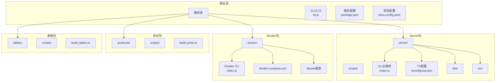
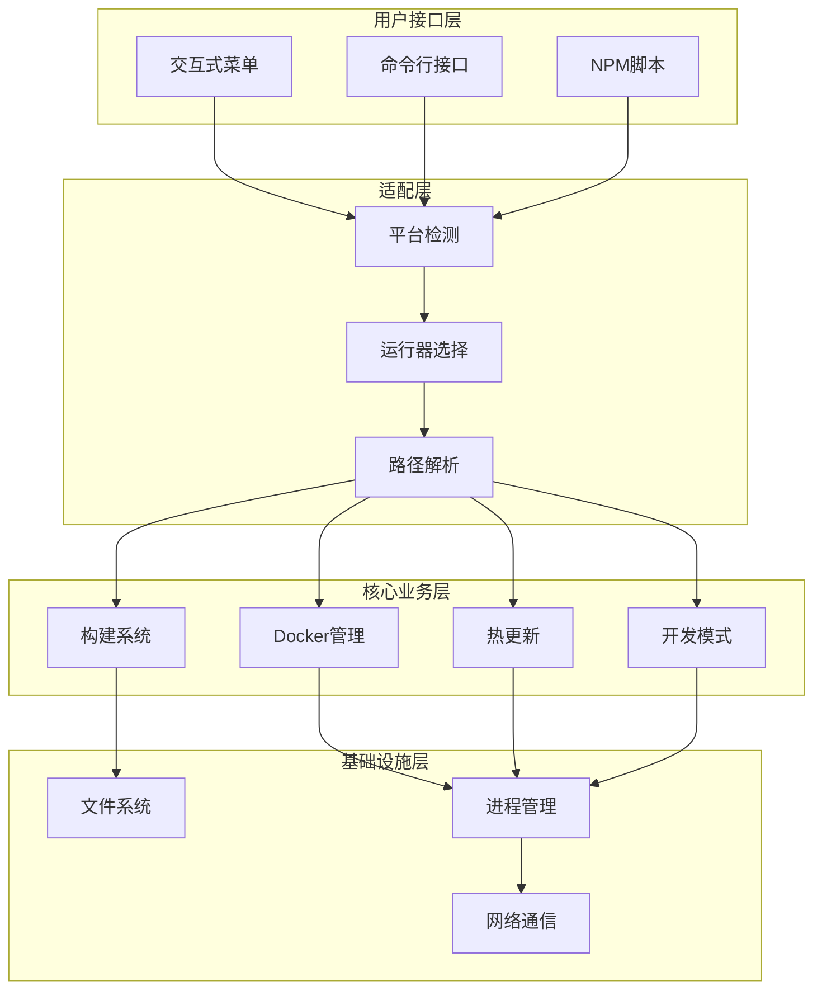
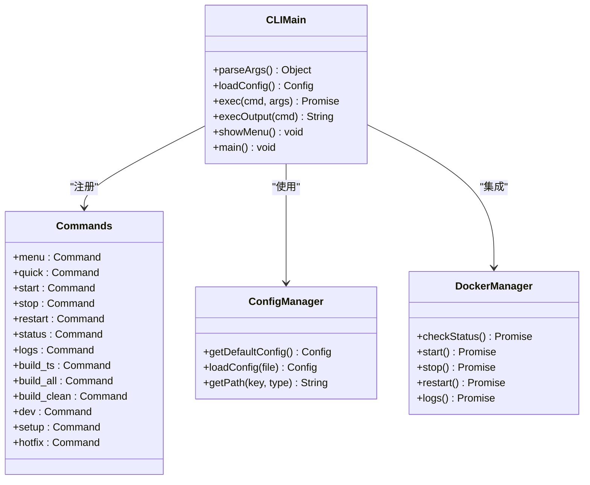
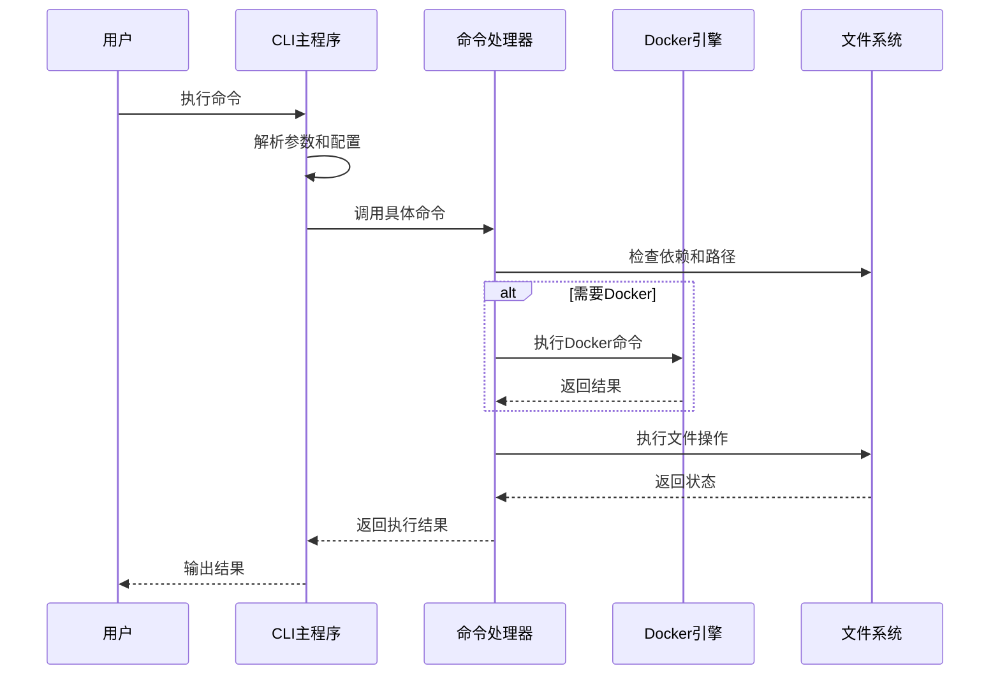
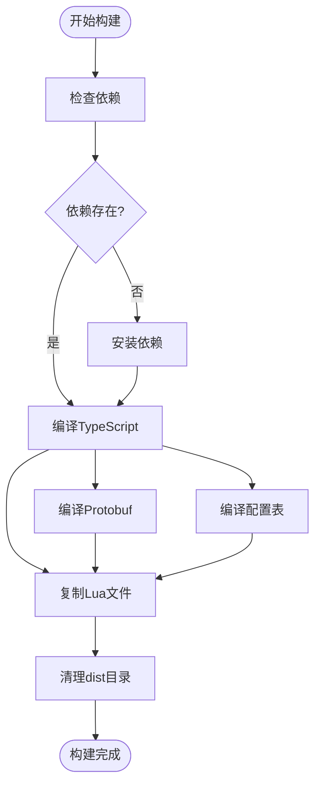
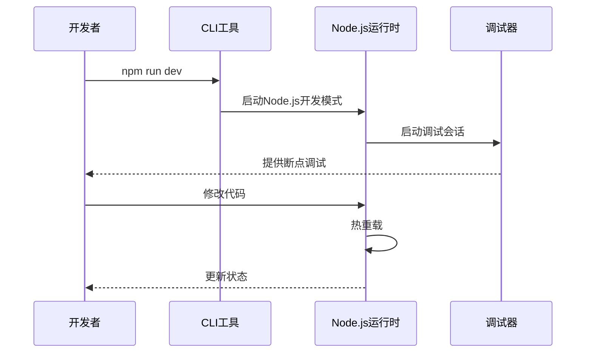
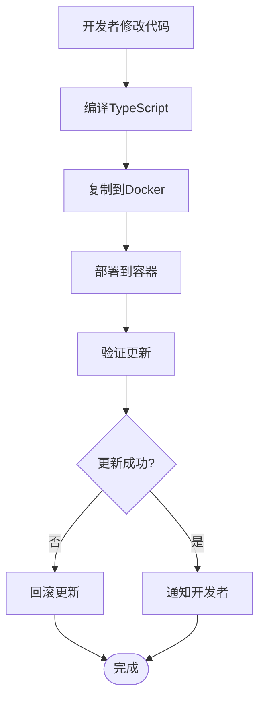
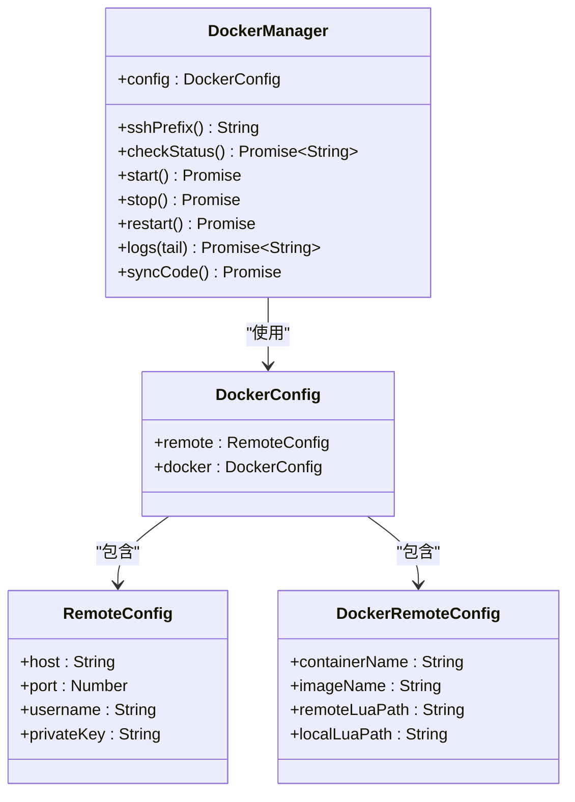
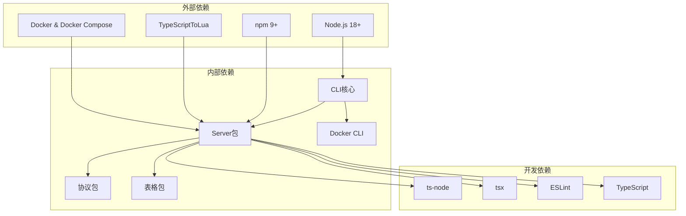

# CLI工具链

<cite>
**本文档引用的文件**
- [cli.js](file://cli.js)
- [package.json](file://package.json)
- [tslua.config.yaml](file://tslua.config.yaml)
- [server/scripts/cli/index.ts](file://server/scripts/cli/index.ts)
- [server/package.json](file://server/package.json)
- [docker/cli/index.js](file://docker/cli/index.js)
- [docker/cli/README.md](file://docker/cli/README.md)
- [docs/CLI 使用指南.md](file://docs/CLI 使用指南.md)
- [README.md](file://README.md)
- [server/config/tsconfig.lua.json](file://server/config/tsconfig.lua.json)
- [start.sh](file://start.sh)
- [start.ps1](file://start.ps1)
- [start.bat](file://start.bat)
</cite>

## 目录
1. [简介](#简介)
2. [项目结构](#项目结构)
3. [核心组件](#核心组件)
4. [架构概览](#架构概览)
5. [详细组件分析](#详细组件分析)
6. [依赖分析](#依赖分析)
7. [性能考虑](#性能考虑)
8. [故障排除指南](#故障排除指南)
9. [结论](#结论)
10. [附录](#附录)

## 简介

TS-Skynet 跨平台 CLI 工具链是一个专为混合开发框架设计的完整命令行工具集，支持 Windows、Linux 和 macOS 平台。该工具链的核心目标是简化 TypeScript 到 Skynet Lua 运行时的开发流程，提供从开发、构建到部署的全流程自动化支持。

该工具链采用 TypeScript 编写，利用 TypeScriptToLua (TSTL) 转译器将 TypeScript 代码编译为 Lua，同时保持与 Skynet Actor 模型的兼容性。工具链不仅支持本地开发模式，还提供了完整的 Docker 部署和远程管理功能。

## 项目结构

项目采用多包架构，主要包含以下几个核心部分：



**图表来源**
- [cli.js:1-58](file://cli.js#L1-L58)
- [package.json:1-48](file://package.json#L1-L48)
- [tslua.config.yaml:1-52](file://tslua.config.yaml#L1-L52)

**章节来源**
- [README.md:136-193](file://README.md#L136-L193)
- [package.json:6-10](file://package.json#L6-L10)

## 核心组件

### CLI入口组件

CLI 工具链的核心入口由三个组件构成：

1. **跨平台入口脚本** - `cli.js`
2. **服务器端CLI主程序** - `server/scripts/cli/index.ts`
3. **启动脚本适配器** - `start.sh`、`start.ps1`、`start.bat`

这些组件协同工作，提供统一的命令行接口，支持多种使用方式和平台适配。

### 配置管理系统

工具链采用灵活的配置系统，支持 YAML 和 JSON 格式的配置文件，并提供默认配置回退机制。

### 构建管道系统

完整的构建管道包括 TypeScript 编译、协议生成、配置表处理和 Docker 集成，确保代码从开发到生产的无缝转换。

**章节来源**
- [cli.js:12-43](file://cli.js#L12-L43)
- [server/scripts/cli/index.ts:48-193](file://server/scripts/cli/index.ts#L48-L193)

## 架构概览

CLI 工具链采用分层架构设计，每层都有明确的职责分工：



**图表来源**
- [server/scripts/cli/index.ts:301-354](file://server/scripts/cli/index.ts#L301-L354)
- [cli.js:15-43](file://cli.js#L15-L43)

## 详细组件分析

### CLI主程序组件

CLI 主程序是整个工具链的核心，采用模块化设计，每个命令都是独立的模块：



**图表来源**
- [server/scripts/cli/index.ts:301-354](file://server/scripts/cli/index.ts#L301-L354)
- [server/scripts/cli/index.ts:48-193](file://server/scripts/cli/index.ts#L48-L193)

#### 命令执行流程

每个命令都遵循统一的执行模式：



**图表来源**
- [server/scripts/cli/index.ts:427-496](file://server/scripts/cli/index.ts#L427-L496)
- [server/scripts/cli/index.ts:547-571](file://server/scripts/cli/index.ts#L547-L571)

**章节来源**
- [server/scripts/cli/index.ts:301-745](file://server/scripts/cli/index.ts#L301-L745)

### 构建系统组件

构建系统是 CLI 工具链的核心功能之一，支持多种构建模式：

#### TypeScript 编译流程



**图表来源**
- [server/scripts/cli/index.ts:547-626](file://server/scripts/cli/index.ts#L547-L626)

#### 构建命令详解

| 命令 | 功能描述 | 执行流程 | 输出结果 |
|------|----------|----------|----------|
| `build:ts` | 编译 TypeScript → Lua | 检查依赖 → 编译TS → 复制到Docker → 清理dist | dist/lua/ 目录 |
| `build:all` | 完整构建（Proto + Tables + TS） | Protobuf → 配置表 → TypeScript | 完整的Lua代码 |
| `build:clean` | 清理构建产物 | 删除dist/lua/ → 清理临时文件 | 清理后的项目 |

**章节来源**
- [server/scripts/cli/index.ts:547-646](file://server/scripts/cli/index.ts#L547-L646)

### 开发辅助组件

#### Node.js 开发模式

开发模式提供完整的本地开发体验，支持热重载和调试功能：



**图表来源**
- [server/scripts/cli/index.ts:648-651](file://server/scripts/cli/index.ts#L648-L651)

#### 热更新机制

热更新功能允许在不重启服务的情况下更新代码：



**图表来源**
- [server/scripts/cli/index.ts:694-707](file://server/scripts/cli/index.ts#L694-L707)

**章节来源**
- [server/scripts/cli/index.ts:648-707](file://server/scripts/cli/index.ts#L648-L707)

### Docker管理组件

Docker 管理组件提供了完整的容器生命周期管理：



**图表来源**
- [docker/cli/index.js:72-133](file://docker/cli/index.js#L72-L133)

**章节来源**
- [docker/cli/index.js:72-310](file://docker/cli/index.js#L72-L310)

## 依赖分析

CLI 工具链的依赖关系复杂且层次分明：



**图表来源**
- [package.json:36-49](file://package.json#L36-L49)
- [server/package.json:36-49](file://server/package.json#L36-L49)

**章节来源**
- [package.json:11-37](file://package.json#L11-L37)
- [server/package.json:6-26](file://server/package.json#L6-L26)

## 性能考虑

### 启动性能优化

CLI 工具链采用了多种性能优化策略：

1. **运行器检测** - 自动选择最快的运行器（tsx > ts-node > npx）
2. **缓存机制** - 避免重复的依赖检查
3. **并行执行** - 多任务并行处理

### 构建性能优化

1. **增量编译** - 利用 TypeScript 的增量编译能力
2. **并行构建** - Protobuf 和配置表构建并行执行
3. **智能清理** - 自动清理不必要的构建产物

### 内存管理

工具链实现了高效的内存管理策略：

- 及时释放不再使用的资源
- 避免内存泄漏
- 优化大文件处理

## 故障排除指南

### 常见问题及解决方案

#### 依赖安装问题

**问题**: 命令执行时报错，提示缺少依赖

**解决方案**:
```bash
# 安装根目录依赖
npm install

# 安装server目录依赖
cd server && npm install
```

**章节来源**
- [docs/CLI 使用指南.md:153-161](file://docs/CLI 使用指南.md#L153-L161)

#### Docker相关问题

**问题**: Docker命令执行失败

**解决方案**:
1. 确保 Docker Desktop 已启动
2. 检查Docker权限
3. 重启Docker服务

**章节来源**
- [docs/CLI 使用指南.md:163-166](file://docs/CLI 使用指南.md#L163-L166)

#### Windows PowerShell执行策略问题

**问题**: PowerShell执行受限

**解决方案**:
```powershell
Set-ExecutionPolicy -ExecutionPolicy RemoteSigned -Scope CurrentUser
```

**章节来源**
- [docs/CLI 使用指南.md:167-174](file://docs/CLI 使用指南.md#L167-L174)

### 调试技巧

#### 启用详细日志

在命令行中添加调试参数：
```bash
npm run cli -- --verbose <command>
```

#### 检查配置文件

验证配置文件格式和内容：
```bash
npm run cli -- --config=tslua.config.yaml help
```

## 结论

TS-Skynet 跨平台 CLI 工具链提供了一个完整、高效且易于使用的开发环境。通过精心设计的架构和丰富的功能，它成功地解决了 TypeScript 开发与 Skynet 部署之间的技术鸿沟。

### 主要优势

1. **跨平台兼容性** - 支持 Windows、Linux、macOS
2. **完整的开发流程** - 从开发到部署的一站式解决方案
3. **灵活的配置系统** - 支持多种配置格式和自定义选项
4. **强大的扩展性** - 模块化设计便于功能扩展

### 未来发展方向

1. **CI/CD集成** - 提供更完善的持续集成支持
2. **监控和诊断** - 增强应用监控和性能诊断功能
3. **可视化工具** - 开发图形化的项目管理和监控界面
4. **生态扩展** - 支持更多的第三方工具和服务集成

## 附录

### 命令速查表

| 命令 | 描述 | 使用场景 |
|------|------|----------|
| `npm run menu` | 显示交互式菜单 | 新手入门和日常操作 |
| `npm run quick` | 一键启动 | 快速验证和演示 |
| `npm run build:ts` | 编译TypeScript | 代码变更后的构建 |
| `npm run dev` | Node.js开发模式 | 本地开发和调试 |
| `npm run hotfix` | 热更新代码 | 生产环境快速修复 |
| `npm run setup` | 初始化环境 | 新项目搭建 |

### 配置文件说明

项目配置文件支持以下关键配置：

- **paths**: 定义项目各组件的相对路径
- **build**: 构建相关的输出路径配置
- **docker**: Docker部署的相关配置
- **hooks**: 构建过程中的钩子脚本

### 最佳实践建议

1. **开发阶段** - 使用 `npm run dev` 进行本地开发
2. **测试阶段** - 使用 `npm run build:ts` 进行代码验证
3. **部署阶段** - 使用 `npm run quick` 进行一键部署
4. **维护阶段** - 使用 `npm run hotfix` 进行快速修复