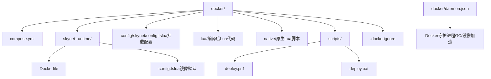
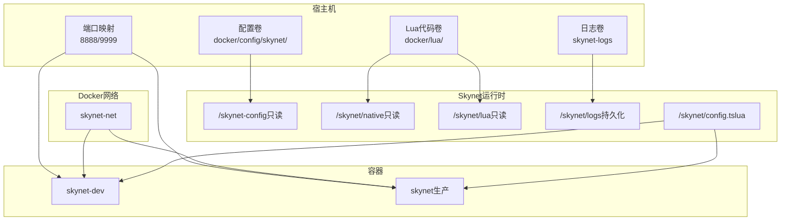
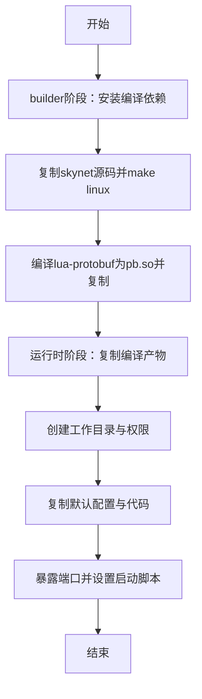
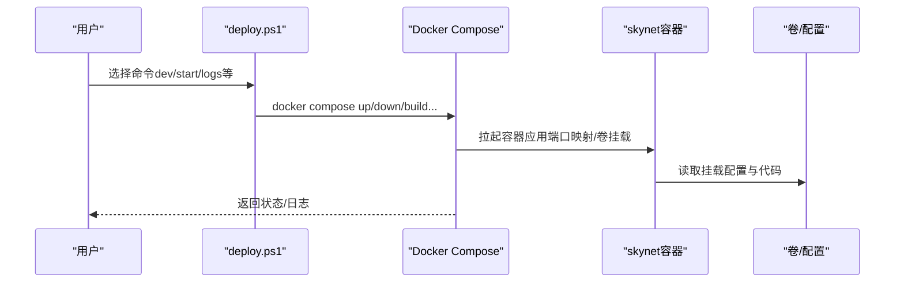
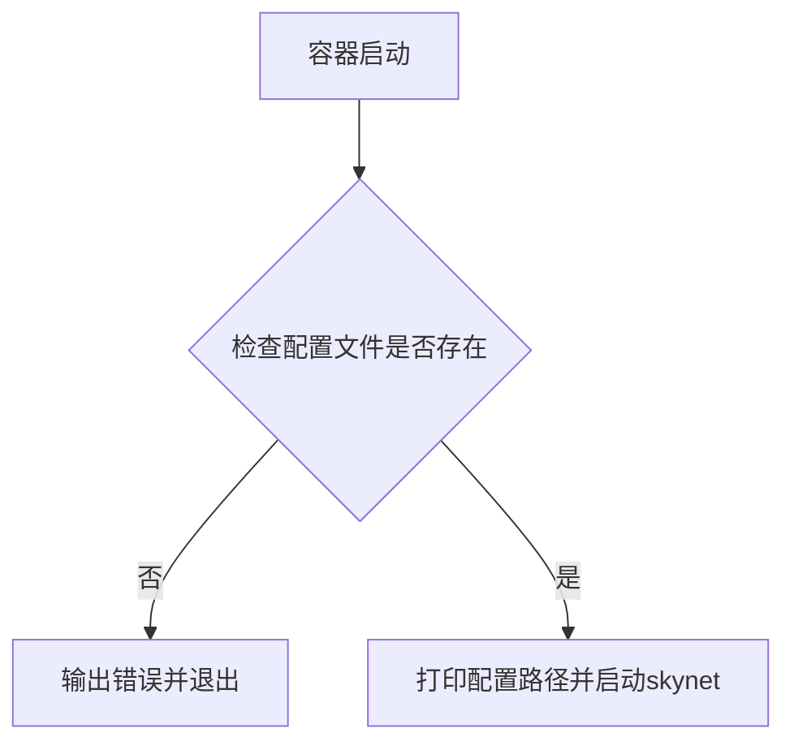
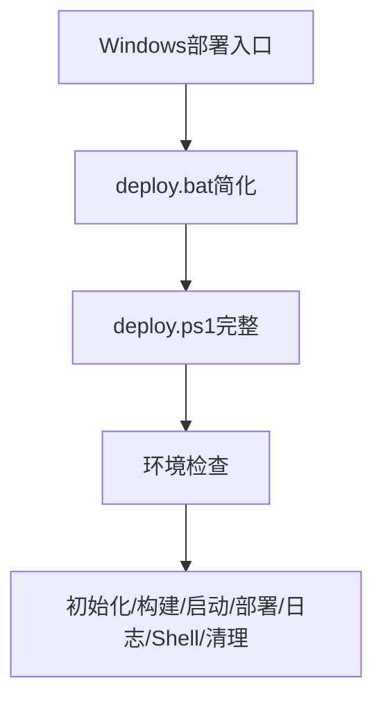
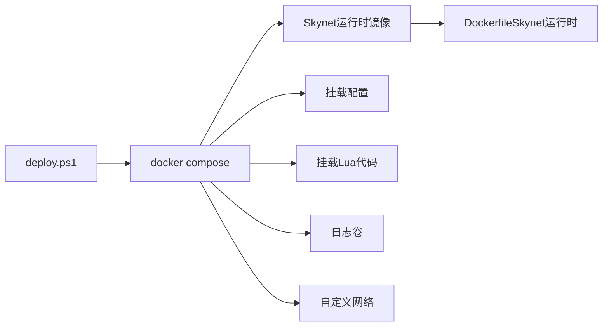

# Docker部署

<cite>
**本文引用的文件**
- [compose.yml](file://docker/compose.yml)
- [Dockerfile（Skynet运行时）](file://docker/skynet-runtime/Dockerfile)
- [Dockerfile（Server开发镜像）](file://server/Dockerfile)
- [.dockerignore](file://docker/.dockerignore)
- [daemon.json](file://docker/daemon.json)
- [deploy.ps1](file://docker/scripts/deploy.ps1)
- [deploy.bat](file://docker/scripts/deploy.bat)
- [config.tslua（镜像内默认配置）](file://docker/skynet-runtime/config.tslua)
- [config.tslua（容器挂载配置）](file://docker/config/skynet/config.tslua)
- [DEPLOY.md](file://DEPLOY.md)
- [start.sh（服务端入口）](file://server/start.sh)
- [README.md](file://README.md)
</cite>

## 目录
1. [引言](#引言)
2. [项目结构](#项目结构)
3. [核心组件](#核心组件)
4. [架构总览](#架构总览)
5. [详细组件分析](#详细组件分析)
6. [依赖关系分析](#依赖关系分析)
7. [性能考量](#性能考量)
8. [故障排除指南](#故障排除指南)
9. [结论](#结论)
10. [附录](#附录)

## 引言
本指南面向希望使用Docker进行TS-Skynet混合框架容器化部署的工程师与运维人员。内容覆盖镜像构建策略、Compose服务编排、网络与卷挂载、环境变量与配置、跨平台部署流程（Windows/WSL2、Linux/macOS）、生产环境优化（资源限制、日志、健康检查）、故障排除以及与传统部署方式的对比优势。

## 项目结构
围绕Docker的部署相关目录与文件主要集中在docker/子目录，包含：
- compose.yml：服务编排与网络/卷/环境变量定义
- skynet-runtime/：Skynet运行时镜像构建与默认配置
- config/skynet/：容器内挂载的运行时配置
- lua/：编译后的Lua服务代码（开发时挂载，生产时复制进镜像）
- native/：原生Lua脚本（启动引导、全局对象注入等）
- scripts/：Windows平台的部署脚本（PowerShell与批处理）
- .dockerignore：构建上下文排除规则
- daemon.json：Docker守护进程构建GC与镜像加速配置

图表来源
- [compose.yml:1-70](file://docker/compose.yml#L1-L70)
- [Dockerfile（Skynet运行时）:1-91](file://docker/skynet-runtime/Dockerfile#L1-L91)
- [config.tslua（镜像内默认配置）:1-35](file://docker/skynet-runtime/config.tslua#L1-L35)
- [config.tslua（容器挂载配置）:1-54](file://docker/config/skynet/config.tslua#L1-L54)
- [deploy.ps1:1-430](file://docker/scripts/deploy.ps1#L1-L430)
- [deploy.bat:1-58](file://docker/scripts/deploy.bat#L1-L58)
- [.dockerignore:1-48](file://docker/.dockerignore#L1-L48)
- [daemon.json:1-17](file://docker/daemon.json#L1-L17)

章节来源
- [compose.yml:1-70](file://docker/compose.yml#L1-L70)
- [Dockerfile（Skynet运行时）:1-91](file://docker/skynet-runtime/Dockerfile#L1-L91)
- [config.tslua（镜像内默认配置）:1-35](file://docker/skynet-runtime/config.tslua#L1-L35)
- [config.tslua（容器挂载配置）:1-54](file://docker/config/skynet/config.tslua#L1-L54)
- [deploy.ps1:1-430](file://docker/scripts/deploy.ps1#L1-L430)
- [deploy.bat:1-58](file://docker/scripts/deploy.bat#L1-L58)
- [.dockerignore:1-48](file://docker/.dockerignore#L1-L48)
- [daemon.json:1-17](file://docker/daemon.json#L1-L17)

## 核心组件
- Skynet运行时镜像（多阶段构建）
  - builder阶段：拉取纯净skynet源码，make linux编译，再编译lua-protobuf为pb.so并复制到skynet/luaclib
  - 运行时阶段：仅保留运行时依赖，复制编译产物、默认配置、编译后的Lua代码与原生脚本，创建非root用户，暴露端口，设置启动脚本
- Docker Compose服务
  - skynet-dev：开发模式，挂载配置、原生脚本、Lua代码与日志卷；开放调试端口；使用profiles: dev
  - skynet：生产模式，镜像内包含代码与配置，挂载配置与日志卷；开放游戏与调试端口
- 配置体系
  - 镜像内默认config.tslua作为兜底
  - 容器挂载config.tslua覆盖默认配置，便于环境差异化
- 部署脚本
  - deploy.ps1：Windows平台完整命令封装（环境检查、构建、启动、日志、部署代码、Shell、清理）
  - deploy.bat：简化入口，内部调用PowerShell脚本
- 构建上下文与忽略
  - .dockerignore：排除无关文件与目录，减少构建上下文体积
  - daemon.json：启用构建GC与镜像加速源

章节来源
- [Dockerfile（Skynet运行时）:1-91](file://docker/skynet-runtime/Dockerfile#L1-L91)
- [compose.yml:1-70](file://docker/compose.yml#L1-L70)
- [config.tslua（镜像内默认配置）:1-35](file://docker/skynet-runtime/config.tslua#L1-L35)
- [config.tslua（容器挂载配置）:1-54](file://docker/config/skynet/config.tslua#L1-L54)
- [deploy.ps1:1-430](file://docker/scripts/deploy.ps1#L1-L430)
- [deploy.bat:1-58](file://docker/scripts/deploy.bat#L1-L58)
- [.dockerignore:1-48](file://docker/.dockerignore#L1-L48)
- [daemon.json:1-17](file://docker/daemon.json#L1-L17)

## 架构总览
Docker容器化采用“镜像内含运行时+挂载配置与代码”的组合策略，既保证生产环境的自包含性，又在开发环境提供热更新能力。Compose通过网络隔离与卷持久化，统一管理Skynet服务生命周期。

图表来源
- [compose.yml:6-70](file://docker/compose.yml#L6-L70)
- [config.tslua（容器挂载配置）:1-54](file://docker/config/skynet/config.tslua#L1-L54)
- [config.tslua（镜像内默认配置）:1-35](file://docker/skynet-runtime/config.tslua#L1-L35)

## 详细组件分析

### 组件A：Skynet运行时镜像（多阶段构建）
- 构建阶段
  - 基于ubuntu:22.04，安装编译依赖
  - 复制skynet源码，执行make linux
  - 编译lua-protobuf为pb.so并复制到luaclib，复制protoc.lua到lualib
- 运行阶段
  - 基于ubuntu:22.04，仅安装运行时证书依赖
  - 创建非root用户，创建工作目录与权限
  - 复制builder阶段产物（skynet二进制、lualib、service、cservice、luaclib）
  - 复制默认config.tslua与编译后的Lua代码、原生脚本
  - 暴露8888/9999端口，设置启动脚本与CMD

图表来源
- [Dockerfile（Skynet运行时）:7-91](file://docker/skynet-runtime/Dockerfile#L7-L91)

章节来源
- [Dockerfile（Skynet运行时）:1-91](file://docker/skynet-runtime/Dockerfile#L1-L91)

### 组件B：Docker Compose服务编排
- skynet-dev（开发模式）
  - 使用profiles: dev，便于Windows脚本选择
  - 挂载配置、原生脚本、Lua代码与日志卷，端口映射8888/9999
  - 环境变量TZ与SKYNET_CONFIG指向挂载配置
- skynet（生产模式）
  - 镜像内包含Lua代码与默认配置，挂载配置与日志卷
  - 端口映射8888/9999，环境变量TZ与SKYNET_CONFIG
- 网络与卷
  - 自定义桥接网络skynet-net
  - 命名卷skynet-logs用于日志持久化

图表来源
- [compose.yml:6-70](file://docker/compose.yml#L6-L70)
- [deploy.ps1:243-275](file://docker/scripts/deploy.ps1#L243-L275)

章节来源
- [compose.yml:1-70](file://docker/compose.yml#L1-L70)
- [deploy.ps1:1-430](file://docker/scripts/deploy.ps1#L1-L430)

### 组件C：配置体系与挂载
- 镜像内默认config.tslua（兜底）
- 容器挂载config.tslua（覆盖）
- 启动脚本根据SKYNET_CONFIG变量决定加载路径，若文件不存在则报错退出

图表来源
- [Dockerfile（Skynet运行时）:77-86](file://docker/skynet-runtime/Dockerfile#L77-L86)
- [config.tslua（镜像内默认配置）:1-35](file://docker/skynet-runtime/config.tslua#L1-L35)
- [config.tslua（容器挂载配置）:1-54](file://docker/config/skynet/config.tslua#L1-L54)

章节来源
- [Dockerfile（Skynet运行时）:77-86](file://docker/skynet-runtime/Dockerfile#L77-L86)
- [config.tslua（镜像内默认配置）:1-35](file://docker/skynet-runtime/config.tslua#L1-L35)
- [config.tslua（容器挂载配置）:1-54](file://docker/config/skynet/config.tslua#L1-L54)

### 组件D：跨平台部署脚本
- deploy.ps1（Windows）
  - 环境检查（Docker、Compose、WSL2后端）
  - 初始化环境（创建必要目录）
  - 构建镜像（可选禁用缓存）
  - 启动开发/生产容器（支持前台/后台）
  - 部署代码（编译TS并复制到生产容器）
  - 查看状态/日志/Shell、清理
- deploy.bat（Windows）
  - 简化入口，调用PowerShell脚本

图表来源
- [deploy.ps1:1-430](file://docker/scripts/deploy.ps1#L1-L430)
- [deploy.bat:1-58](file://docker/scripts/deploy.bat#L1-L58)

章节来源
- [deploy.ps1:1-430](file://docker/scripts/deploy.ps1#L1-L430)
- [deploy.bat:1-58](file://docker/scripts/deploy.bat#L1-L58)

### 组件E：构建上下文与守护进程优化
- .dockerignore
  - 排除.git、docs、cli、scripts、config、service-ts、logs、IDE、测试、.env等
  - 显著减小构建上下文，提升构建速度
- daemon.json
  - 启用构建GC与默认存储上限
  - 配置多个镜像加速源，提升拉取速度

章节来源
- [.dockerignore:1-48](file://docker/.dockerignore#L1-L48)
- [daemon.json:1-17](file://docker/daemon.json#L1-L17)

## 依赖关系分析
- 组件耦合
  - compose.yml依赖Dockerfile构建产物与挂载的配置/代码
  - 启动脚本依赖SKYNET_CONFIG与配置文件存在性
  - Windows部署脚本依赖Docker Desktop与WSL2后端
- 外部依赖
  - Docker Engine与Docker Compose
  - WSL2（Windows）
  - 镜像加速源（daemon.json）

图表来源
- [deploy.ps1:1-430](file://docker/scripts/deploy.ps1#L1-L430)
- [compose.yml:1-70](file://docker/compose.yml#L1-L70)
- [Dockerfile（Skynet运行时）:1-91](file://docker/skynet-runtime/Dockerfile#L1-L91)

章节来源
- [deploy.ps1:1-430](file://docker/scripts/deploy.ps1#L1-L430)
- [compose.yml:1-70](file://docker/compose.yml#L1-L70)
- [Dockerfile（Skynet运行时）:1-91](file://docker/skynet-runtime/Dockerfile#L1-L91)

## 性能考量
- 构建性能
  - 使用多阶段构建，运行时镜像仅包含必要依赖，减小镜像体积
  - .dockerignore排除无关文件，缩短构建时间
  - daemon.json启用构建GC与镜像加速源，降低构建与拉取耗时
- 运行性能
  - 开发模式使用volume挂载，避免频繁复制，提升迭代效率
  - 生产模式将代码复制进镜像，减少宿主机依赖，提高一致性
- 网络与日志
  - 自定义桥接网络隔离服务
  - 日志卷持久化，结合Docker日志驱动与外部日志系统可进一步优化

章节来源
- [Dockerfile（Skynet运行时）:1-91](file://docker/skynet-runtime/Dockerfile#L1-L91)
- [.dockerignore:1-48](file://docker/.dockerignore#L1-L48)
- [daemon.json:1-17](file://docker/daemon.json#L1-L17)
- [compose.yml:64-70](file://docker/compose.yml#L64-L70)

## 故障排除指南
- Docker Desktop未启动或Compose不可用
  - 现象：命令无法执行或返回错误
  - 处理：启动Docker Desktop，确认docker compose可用
- WSL2后端缺失（Windows）
  - 现象：性能不佳或兼容性问题
  - 处理：在Docker Desktop设置中启用WSL2后端
- 端口冲突
  - 现象：容器启动失败或端口映射冲突
  - 处理：修改compose.yml中的端口映射
- 权限错误（Windows）
  - 现象：脚本执行受限
  - 处理：以管理员身份运行PowerShell
- 配置文件缺失
  - 现象：容器启动即退出（启动脚本检测不到配置文件）
  - 处理：确认挂载路径与文件存在，或使用镜像内默认配置
- 生产模式代码未更新
  - 现象：修改TS后未生效
  - 处理：使用deploy.ps1的deploy命令重新复制代码到容器

章节来源
- [deploy.ps1:101-143](file://docker/scripts/deploy.ps1#L101-L143)
- [Dockerfile（Skynet运行时）:77-86](file://docker/skynet-runtime/Dockerfile#L77-L86)
- [compose.yml:1-70](file://docker/compose.yml#L1-L70)

## 结论
该Docker方案通过多阶段构建与挂载策略，在开发与生产场景间取得平衡：开发模式强调热更新与快速迭代，生产模式强调自包含与一致性。配合Windows部署脚本、构建上下文优化与守护进程配置，整体具备良好的可维护性与可扩展性。建议在生产环境中结合资源限制、健康检查与集中日志管理进一步完善。

## 附录

### 部署流程（Windows + WSL2）
- 本地开发（推荐）
  - 运行deploy.ps1 dev，前台/后台均可
  - 修改TS后执行npm run build:ts，代码自动同步（开发模式）
- 生产部署
  - 先在根目录执行编译与复制命令，确保docker/lua包含编译产物
  - 运行deploy.ps1 build（可加-NoCache），然后deploy.ps1 start -Daemon
  - 通过deploy.ps1 logs查看日志，status查看状态

章节来源
- [DEPLOY.md:26-39](file://DEPLOY.md#L26-L39)
- [deploy.ps1:175-238](file://docker/scripts/deploy.ps1#L175-L238)

### 部署流程（Linux/macOS）
- 本地开发
  - 在docker目录执行docker compose --profile dev up -d
- 生产部署
  - 在docker目录执行docker compose up -d
  - 查看日志：docker compose logs -f

章节来源
- [DEPLOY.md:26-39](file://DEPLOY.md#L26-L39)
- [compose.yml:35-36](file://docker/compose.yml#L35-L36)

### 生产环境优化建议
- 资源限制
  - 在compose.yml中为服务设置memory限制与CPU配额
- 健康检查
  - 添加healthcheck探测端口与关键服务状态
- 日志管理
  - 使用json-file或syslog驱动，结合外部日志系统
- 配置管理
  - 将敏感配置放入环境变量或密钥管理，避免硬编码

章节来源
- [compose.yml:1-70](file://docker/compose.yml#L1-L70)

### 与传统部署方式对比
- 优势
  - 一致性：镜像内含运行时，避免环境差异
  - 可移植：一次构建，多平台部署
  - 快速迭代：开发模式热更新，提升效率
  - 可观测：容器化便于日志、监控与回滚
- 注意事项
  - 端口与网络规划
  - 配置与数据卷的持久化策略
  - Windows平台需WSL2后端

章节来源
- [README.md:1-200](file://README.md#L1-L200)
- [DEPLOY.md:1-108](file://DEPLOY.md#L1-L108)