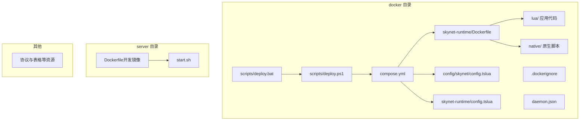
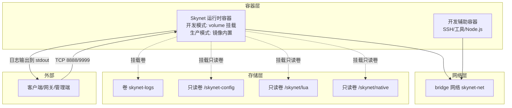
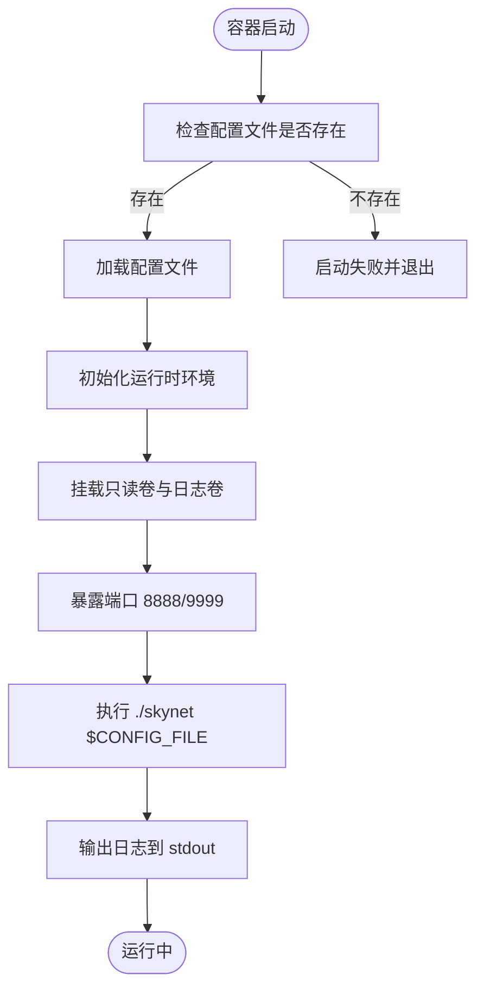
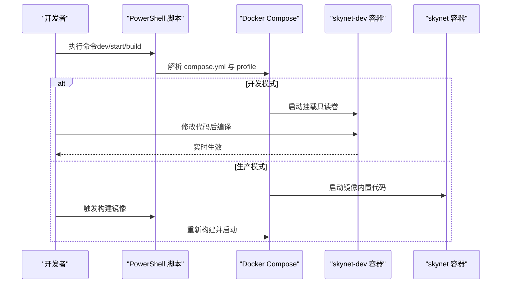
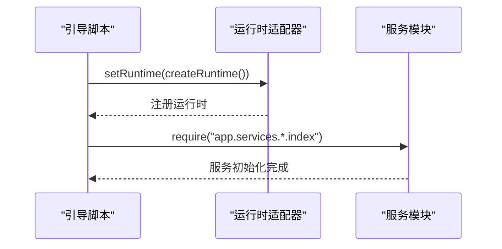
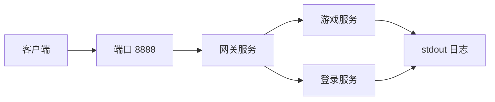
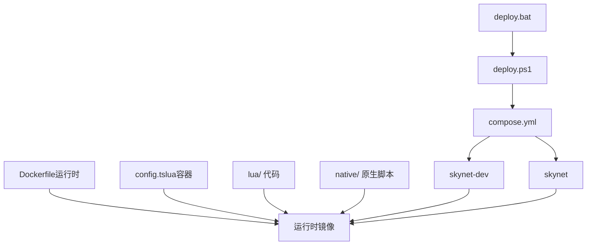

# 容器化架构设计

<cite>
**本文引用的文件**
- [Dockerfile（Skynet 运行时）](file://docker/skynet-runtime/Dockerfile)
- [Dockerfile（Server 开发镜像）](file://server/Dockerfile)
- [Compose 编排文件](file://docker/compose.yml)
- [Docker 构建忽略规则](file://docker/.dockerignore)
- [Docker 守护进程配置](file://docker/daemon.json)
- [Skynet 运行时默认配置](file://docker/skynet-runtime/config.tslua)
- [Skynet 容器配置](file://docker/config/skynet/config.tslua)
- [部署脚本（PowerShell）](file://docker/scripts/deploy.ps1)
- [部署脚本（批处理）](file://docker/scripts/deploy.bat)
- [Server 启动脚本](file://server/start.sh)
- [Skynet 引导（Node 模式）](file://docker/lua/app/bootstrap-node.lua)
- [Skynet 引导（Skynet 模式）](file://docker/lua/app/bootstrap-skynet.lua)
</cite>

## 目录
1. [引言](#引言)
2. [项目结构](#项目结构)
3. [核心组件](#核心组件)
4. [架构总览](#架构总览)
5. [详细组件分析](#详细组件分析)
6. [依赖关系分析](#依赖关系分析)
7. [性能考量](#性能考量)
8. [故障排查指南](#故障排查指南)
9. [结论](#结论)
10. [附录](#附录)

## 引言
本文件系统性阐述 TS-Skynet 的容器化架构设计，覆盖单容器与多容器部署模式、Skynet 运行时容器的组成与职责、开发与生产模式差异、容器网络拓扑与数据流、安全与资源限制、健康检查以及 Docker Compose 编排的最佳实践。目标是帮助读者快速理解并高效落地该容器化方案。

## 项目结构
围绕容器化，仓库在 docker/ 目录下提供了完整的运行时镜像构建、编排与运维脚本；server/ 目录提供开发辅助镜像与启动脚本；协议与表格等资源位于各自顶层目录，便于统一构建与发布。

图表来源
- [Dockerfile（Skynet 运行时）:1-91](file://docker/skynet-runtime/Dockerfile#L1-L91)
- [Compose 编排文件:1-70](file://docker/compose.yml#L1-L70)
- [Docker 构建忽略规则:1-48](file://docker/.dockerignore#L1-L48)
- [Docker 守护进程配置:1-17](file://docker/daemon.json#L1-L17)
- [Skynet 容器配置:1-54](file://docker/config/skynet/config.tslua#L1-L54)
- [Skynet 运行时默认配置:1-35](file://docker/skynet-runtime/config.tslua#L1-L35)
- [部署脚本（PowerShell）:1-430](file://docker/scripts/deploy.ps1#L1-L430)
- [部署脚本（批处理）:1-58](file://docker/scripts/deploy.bat#L1-L58)
- [Server 启动脚本:1-66](file://server/start.sh#L1-L66)

章节来源
- [Dockerfile（Skynet 运行时）:1-91](file://docker/skynet-runtime/Dockerfile#L1-L91)
- [Compose 编排文件:1-70](file://docker/compose.yml#L1-L70)
- [Docker 构建忽略规则:1-48](file://docker/.dockerignore#L1-L48)
- [Docker 守护进程配置:1-17](file://docker/daemon.json#L1-L17)
- [Skynet 容器配置:1-54](file://docker/config/skynet/config.tslua#L1-L54)
- [Skynet 运行时默认配置:1-35](file://docker/skynet-runtime/config.tslua#L1-L35)
- [部署脚本（PowerShell）:1-430](file://docker/scripts/deploy.ps1#L1-L430)
- [部署脚本（批处理）:1-58](file://docker/scripts/deploy.bat#L1-L58)
- [Server 启动脚本:1-66](file://server/start.sh#L1-L66)

## 核心组件
- Skynet 运行时容器
  - 基于分阶段构建的精简运行时镜像，仅包含运行所需二进制与库，降低攻击面与体积。
  - 通过环境变量与挂载卷实现配置与代码解耦，支持开发与生产两种模式。
- 开发辅助容器
  - 提供 SSH、常用工具与 Node.js 环境，便于本地开发与联调。
- Compose 编排
  - 定义开发与生产两个服务，共享网络与卷，简化多组件协同。
- 配置与代码挂载
  - 配置文件通过只读卷挂载，代码通过只读卷挂载或构建时复制，满足不同场景需求。
- 部署脚本
  - PowerShell 脚本封装环境检测、镜像构建、容器启停、日志查看、热部署等常用操作。

章节来源
- [Dockerfile（Skynet 运行时）:1-91](file://docker/skynet-runtime/Dockerfile#L1-L91)
- [Dockerfile（Server 开发镜像）:1-51](file://server/Dockerfile#L1-L51)
- [Compose 编排文件:1-70](file://docker/compose.yml#L1-L70)
- [Skynet 容器配置:1-54](file://docker/config/skynet/config.tslua#L1-L54)
- [Skynet 运行时默认配置:1-35](file://docker/skynet-runtime/config.tslua#L1-L35)
- [部署脚本（PowerShell）:1-430](file://docker/scripts/deploy.ps1#L1-L430)

## 架构总览
TS-Skynet 的容器化采用“单容器运行时 + 多容器编排”的混合模式：
- 单容器：Skynet 运行时容器承载游戏服务核心逻辑，支持开发（volume 挂载）与生产（镜像内置）两种模式。
- 多容器：通过 Compose 将运行时容器与开发辅助容器组合，形成可扩展的服务编排。

图表来源
- [Compose 编排文件:6-70](file://docker/compose.yml#L6-L70)
- [Dockerfile（Skynet 运行时）:74-91](file://docker/skynet-runtime/Dockerfile#L74-L91)
- [Skynet 容器配置:1-54](file://docker/config/skynet/config.tslua#L1-L54)

## 详细组件分析

### 组件一：Skynet 运行时容器（单容器模式）
- 设计理念
  - 分阶段构建：第一阶段编译 Skynet 与 lua-protobuf，第二阶段仅复制运行时产物，最小化镜像体积与攻击面。
  - 非 root 用户运行，提升安全性。
  - 通过环境变量与只读卷解耦配置与代码，支持开发与生产双模式。
- 关键特性
  - 端口暴露：8888（游戏端口）、9999（调试/管理端口）。
  - 启动流程：启动脚本读取配置文件并执行 Skynet 主程序。
  - 配置优先级：容器内默认配置可被宿主机挂载覆盖。
- 数据流
  - 配置文件（只读卷）→ Skynet 运行时 → 服务模块加载 → 应用逻辑执行 → stdout 日志输出。

图表来源
- [Dockerfile（Skynet 运行时）:77-91](file://docker/skynet-runtime/Dockerfile#L77-L91)
- [Skynet 容器配置:1-54](file://docker/config/skynet/config.tslua#L1-L54)
- [Skynet 运行时默认配置:1-35](file://docker/skynet-runtime/config.tslua#L1-L35)

章节来源
- [Dockerfile（Skynet 运行时）:1-91](file://docker/skynet-runtime/Dockerfile#L1-L91)
- [Skynet 容器配置:1-54](file://docker/config/skynet/config.tslua#L1-L54)
- [Skynet 运行时默认配置:1-35](file://docker/skynet-runtime/config.tslua#L1-L35)

### 组件二：开发与生产模式对比
- 开发模式（skynet-dev）
  - 通过只读卷挂载配置、原生脚本与 Lua 代码，修改后无需重建镜像，适合迭代开发。
  - 通过 profiles: dev 与 Compose 文件配合，实现按需启用。
- 生产模式（skynet）
  - 代码在镜像内，自包含部署，适合稳定环境与 CI/CD。
  - 通过环境变量指定配置文件路径，支持外部挂载覆盖。

图表来源
- [Compose 编排文件:6-70](file://docker/compose.yml#L6-L70)
- [部署脚本（PowerShell）:242-275](file://docker/scripts/deploy.ps1#L242-L275)
- [部署脚本（PowerShell）:214-238](file://docker/scripts/deploy.ps1#L214-L238)

章节来源
- [Compose 编排文件:6-70](file://docker/compose.yml#L6-L70)
- [部署脚本（PowerShell）:214-275](file://docker/scripts/deploy.ps1#L214-L275)

### 组件三：运行时引导与服务管理
- 引导脚本
  - Node 模式引导：直接加载服务模块并设置运行时为 Node。
  - Skynet 模式引导：设置运行时为 Skynet，并加载网关服务模块。
- 服务管理
  - 通过配置文件指定启动模块与脚本，Skynet 依据模块名加载对应服务。
  - Lua 服务路径优先级：native/ > lua/ > service/，保证原生脚本与业务代码的可控加载顺序。

图表来源
- [Skynet 引导（Node 模式）:1-17](file://docker/lua/app/bootstrap-node.lua#L1-L17)
- [Skynet 引导（Skynet 模式）:1-12](file://docker/lua/app/bootstrap-skynet.lua#L1-L12)

章节来源
- [Skynet 引导（Node 模式）:1-17](file://docker/lua/app/bootstrap-node.lua#L1-L17)
- [Skynet 引导（Skynet 模式）:1-12](file://docker/lua/app/bootstrap-skynet.lua#L1-L12)
- [Skynet 容器配置:16-27](file://docker/config/skynet/config.tslua#L16-L27)

### 组件四：网络拓扑与数据流向
- 网络
  - 使用 bridge 驱动的自定义网络，隔离容器间通信，便于扩展与维护。
- 端口
  - 8888：对外游戏服务端口。
  - 9999：内部调试/管理端口。
- 数据流
  - 客户端请求 → 容器网络 → Skynet 网关服务 → 业务服务 → 日志输出至 stdout。

图表来源
- [Compose 编排文件:17-50](file://docker/compose.yml#L17-L50)
- [Skynet 容器配置:46-50](file://docker/config/skynet/config.tslua#L46-L50)

章节来源
- [Compose 编排文件:17-50](file://docker/compose.yml#L17-L50)
- [Skynet 容器配置:46-50](file://docker/config/skynet/config.tslua#L46-L50)

### 组件五：安全配置与资源限制
- 安全
  - 非 root 用户运行，降低权限风险。
  - 只读卷挂载，防止运行时篡改配置与代码。
  - 通过环境变量与只读卷实现配置注入，避免硬编码敏感信息。
- 资源限制
  - 建议在 Compose 中添加资源限制（CPU/内存），结合监控与告警保障稳定性。
- 健康检查
  - 建议增加健康检查探针，探测端口与关键服务状态，实现自动恢复。

章节来源
- [Dockerfile（Skynet 运行时）:49-91](file://docker/skynet-runtime/Dockerfile#L49-L91)
- [Compose 编排文件:16-62](file://docker/compose.yml#L16-L62)

### 组件六：Docker Compose 编排优势与最佳实践
- 优势
  - 统一定义服务、网络、卷与环境变量，便于团队协作与 CI/CD。
  - 支持 profile 与多环境配置，灵活切换开发与生产。
- 最佳实践
  - 将配置与代码分离，使用只读卷挂载配置与代码。
  - 使用独立网络隔离服务，明确端口映射与访问边界。
  - 结合日志卷与日志驱动，集中收集与分析日志。
  - 在生产环境启用资源限制与健康检查。

章节来源
- [Compose 编排文件:6-70](file://docker/compose.yml#L6-L70)
- [Docker 构建忽略规则:1-48](file://docker/.dockerignore#L1-L48)

## 依赖关系分析
- 组件耦合
  - 运行时容器对配置与代码的依赖通过只读卷解耦，降低耦合度。
  - 引导脚本与服务模块通过运行时适配器解耦，便于替换运行时。
- 外部依赖
  - Docker 与 Docker Compose 版本要求，Windows 环境建议使用 WSL2 后端。
  - 镜像构建缓存与 registry mirrors 配置影响构建效率。

图表来源
- [Dockerfile（Skynet 运行时）:1-91](file://docker/skynet-runtime/Dockerfile#L1-L91)
- [Skynet 容器配置:1-54](file://docker/config/skynet/config.tslua#L1-L54)
- [Compose 编排文件:6-70](file://docker/compose.yml#L6-L70)
- [部署脚本（PowerShell）:1-430](file://docker/scripts/deploy.ps1#L1-L430)
- [部署脚本（批处理）:1-58](file://docker/scripts/deploy.bat#L1-L58)

章节来源
- [Dockerfile（Skynet 运行时）:1-91](file://docker/skynet-runtime/Dockerfile#L1-L91)
- [Skynet 容器配置:1-54](file://docker/config/skynet/config.tslua#L1-L54)
- [Compose 编排文件:6-70](file://docker/compose.yml#L6-L70)
- [部署脚本（PowerShell）:1-430](file://docker/scripts/deploy.ps1#L1-L430)
- [部署脚本（批处理）:1-58](file://docker/scripts/deploy.bat#L1-L58)

## 性能考量
- 镜像体积与启动时间
  - 分阶段构建与精简运行时可显著降低镜像体积与启动时间。
- I/O 与网络
  - 使用只读卷减少写放大，合理规划端口与网络拓扑。
- 资源分配
  - 根据业务负载设置 CPU/内存限制，避免资源争抢。
- 构建优化
  - 配置 registry mirrors 与构建缓存，提升构建效率。

章节来源
- [Dockerfile（Skynet 运行时）:1-91](file://docker/skynet-runtime/Dockerfile#L1-L91)
- [Docker 守护进程配置:1-17](file://docker/daemon.json#L1-L17)

## 故障排查指南
- 环境问题
  - Docker 未启动：检查 Docker Desktop 与 WSL2 后端。
  - 端口冲突：修改 compose.yml 中的端口映射。
- 配置问题
  - 配置文件未找到：确认只读卷挂载路径与文件名一致。
  - 日志为空：确认 logger 未被禁用且容器以非守护进程方式启动。
- 部署问题
  - 生产模式代码未生效：确认镜像已重新构建并启动。
  - 开发模式代码未同步：确认 volume 挂载为只读卷且容器处于开发模式。

章节来源
- [部署脚本（PowerShell）:98-143](file://docker/scripts/deploy.ps1#L98-L143)
- [Dockerfile（Skynet 运行时）:77-91](file://docker/skynet-runtime/Dockerfile#L77-L91)
- [Skynet 容器配置:32-40](file://docker/config/skynet/config.tslua#L32-L40)

## 结论
TS-Skynet 的容器化架构通过“单容器运行时 + 多容器编排”实现了开发与生产的灵活切换，配合只读卷挂载、非 root 运行与分阶段构建等安全与性能优化措施，形成了高可用、易维护的部署方案。建议在生产环境中进一步完善资源限制、健康检查与监控告警体系，以提升系统的稳定性与可观测性。

## 附录
- 常用命令
  - 初始化环境：执行部署脚本的 setup 命令。
  - 开发模式：dev 命令，支持前台/后台运行。
  - 生产模式：build 与 start 命令，先构建镜像再启动。
  - 查看状态与日志：status 与 logs 命令。
  - 热部署：deploy 命令，编译后自动部署到运行中的容器。
- 参考文件
  - 运行时镜像构建：见运行时 Dockerfile。
  - 开发镜像与启动脚本：见 server 目录。
  - 配置与编排：见 docker/config 与 compose.yml。

章节来源
- [部署脚本（PowerShell）:416-429](file://docker/scripts/deploy.ps1#L416-L429)
- [Server 启动脚本:1-66](file://server/start.sh#L1-L66)