# 平台部署指南

<cite>
**本文档引用的文件**
- [docker/compose.yml](file://docker/compose.yml)
- [docker/scripts/deploy.ps1](file://docker/scripts/deploy.ps1)
- [docker/scripts/deploy.bat](file://docker/scripts/deploy.bat)
- [docker/skynet-runtime/Dockerfile](file://docker/skynet-runtime/Dockerfile)
- [docker/skynet-runtime/config.tslua](file://docker/skynet-runtime/config.tslua)
- [docker/daemon.json](file://docker/daemon.json)
- [docker/.dockerignore](file://docker/.dockerignore)
- [start.sh](file://start.sh)
- [start.bat](file://start.bat)
- [start.ps1](file://start.ps1)
</cite>

## 目录
1. [简介](#简介)
2. [项目结构](#项目结构)
3. [核心组件](#核心组件)
4. [架构概览](#架构概览)
5. [详细组件分析](#详细组件分析)
6. [跨平台部署差异](#跨平台部署差异)
7. [Windows平台特殊配置](#windows平台特殊配置)
8. [PowerShell和批处理脚本使用](#powershell和批处理脚本使用)
9. [路径处理和权限设置](#路径处理和权限设置)
10. [性能优化](#性能优化)
11. [故障排除指南](#故障排除指南)
12. [一键部署脚本](#一键部署脚本)
13. [容器间数据共享](#容器间数据共享)
14. [结论](#结论)

## 简介

本指南提供了TS-Skynet跨平台Docker部署的详细说明，涵盖Windows、Linux和macOS三大平台的部署差异、特殊要求和最佳实践。项目采用多阶段Docker构建策略，支持开发模式和生产模式两种部署方式，通过Volume挂载实现代码热更新，通过环境变量配置实现灵活的运行时定制。

## 项目结构

TS-Skynet项目采用模块化的Docker部署架构，主要由以下核心组件构成：

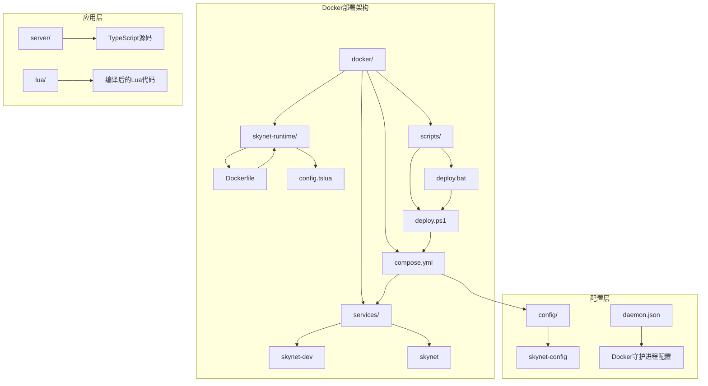

**图表来源**
- [docker/compose.yml:1-70](file://docker/compose.yml#L1-L70)
- [docker/skynet-runtime/Dockerfile:1-91](file://docker/skynet-runtime/Dockerfile#L1-L91)

**章节来源**
- [docker/compose.yml:1-70](file://docker/compose.yml#L1-L70)
- [docker/skynet-runtime/Dockerfile:1-91](file://docker/skynet-runtime/Dockerfile#L1-L91)

## 核心组件

### Docker Compose配置

项目使用单一compose.yml文件管理两个主要服务：开发模式的skynet-dev和生产模式的skynet。每个服务都配置了完整的网络、卷挂载和环境变量。

### Skynet运行时镜像

Dockerfile采用两阶段构建策略：
- **构建阶段**：使用Ubuntu 22.04编译Skynet核心和lua-protobuf
- **运行阶段**：使用精简的Ubuntu基础镜像，仅包含运行时必需组件

### 部署脚本系统

提供完整的PowerShell和批处理脚本支持，涵盖环境检查、镜像构建、容器管理、日志监控等功能。

**章节来源**
- [docker/compose.yml:6-63](file://docker/compose.yml#L6-L63)
- [docker/skynet-runtime/Dockerfile:7-91](file://docker/skynet-runtime/Dockerfile#L7-L91)
- [docker/scripts/deploy.ps1:1-430](file://docker/scripts/deploy.ps1#L1-L430)

## 架构概览

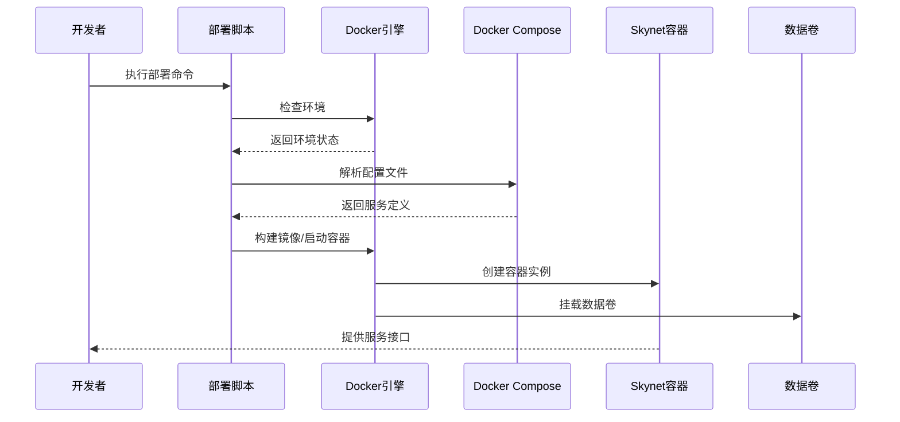

**图表来源**
- [docker/scripts/deploy.ps1:101-143](file://docker/scripts/deploy.ps1#L101-L143)
- [docker/compose.yml:11-63](file://docker/compose.yml#L11-L63)

## 详细组件分析

### Skynet运行时Dockerfile分析

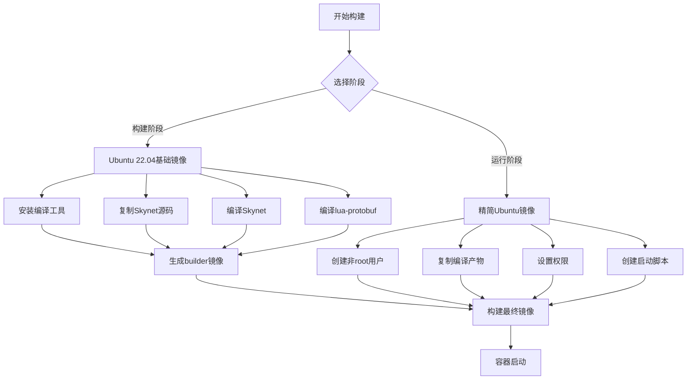

**图表来源**
- [docker/skynet-runtime/Dockerfile:7-91](file://docker/skynet-runtime/Dockerfile#L7-L91)

#### 关键特性分析

**多阶段构建优化**
- 构建阶段使用完整开发环境，确保编译依赖齐全
- 运行阶段仅包含最小化运行时组件，减少镜像大小和攻击面

**安全配置**
- 使用非root用户运行Skynet进程
- 严格的文件权限控制
- 最小权限原则的应用

**性能考虑**
- 分离编译和运行环境，避免运行时不必要的依赖
- 优化的包管理器配置

**章节来源**
- [docker/skynet-runtime/Dockerfile:7-91](file://docker/skynet-runtime/Dockerfile#L7-L91)

### Docker Compose服务配置

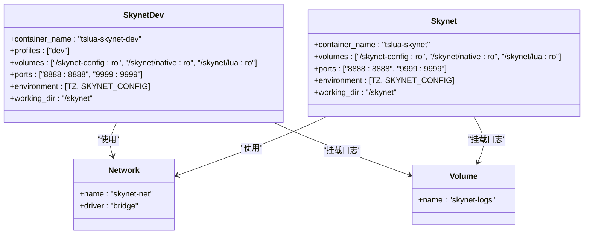

**图表来源**
- [docker/compose.yml:11-63](file://docker/compose.yml#L11-L63)

#### 服务差异化配置

**开发模式特点**
- Volume挂载实现代码热更新
- 专门的开发配置文件
- 支持开发者调试需求

**生产模式特点**
- 代码嵌入镜像，自包含部署
- 优化的性能配置
- 稳定的版本控制

**章节来源**
- [docker/compose.yml:6-63](file://docker/compose.yml#L6-L63)

## 跨平台部署差异

### Windows平台部署

Windows平台部署具有以下特殊要求：

**Docker Desktop配置**
- 必须使用WSL2后端以获得最佳性能
- 需要足够的内存和CPU资源分配
- 文件系统性能优化设置

**路径处理差异**
- Windows路径分隔符使用反斜杠
- 驱动器字母映射到WSL2虚拟机
- 大小写敏感性问题处理

**权限模型**
- NTFS权限继承机制
- UAC权限提升要求
- 防病毒软件兼容性

### Linux平台部署

Linux平台部署相对简单，主要考虑：

**文件系统性能**
- ext4/其他现代文件系统的优化
- 符号链接支持
- 硬链接限制

**权限管理**
- POSIX权限模型
- sudo权限配置
- SELinux/AppArmor兼容性

### macOS平台部署

macOS平台部署的特殊考虑：

**文件系统差异**
- HFS+文件系统特性
- 大小写不敏感文件系统
- 符号链接处理

**性能优化**
- 桌面环境资源竞争
- 睡眠/唤醒状态处理
- 磁盘空间管理

## Windows平台特殊配置

### Docker Desktop WSL2集成

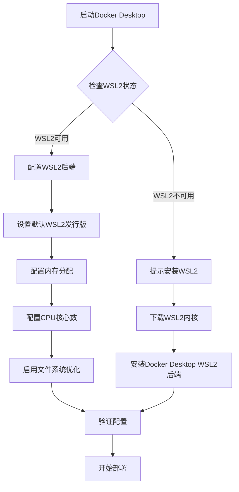

**图表来源**
- [docker/scripts/deploy.ps1:134-143](file://docker/scripts/deploy.ps1#L134-L143)

#### WSL2配置要点

**内存分配**
- 建议至少分配4GB内存给WSL2
- 根据项目规模调整CPU核心数
- 配置适当的交换空间

**文件系统优化**
- 启用WSL2文件系统优化
- 配置合适的磁盘大小
- 定期清理临时文件

**网络配置**
- 确保Docker网络桥接正常
- 配置防火墙规则
- 处理代理服务器设置

**章节来源**
- [docker/scripts/deploy.ps1:134-143](file://docker/scripts/deploy.ps1#L134-L143)

### 文件权限处理

Windows平台的文件权限处理具有以下特点：

**NTFS权限模型**
- 继承权限链
- DACL访问控制列表
- SACL审计权限

**Docker容器权限**
- 映射Windows用户到容器用户
- 处理文件所有权问题
- 配置执行权限

**常见问题解决**
- 权限拒绝错误
- 文件锁定问题
- 网络驱动器权限

## PowerShell和批处理脚本使用

### PowerShell脚本功能详解

PowerShell脚本提供了完整的Docker部署生命周期管理：

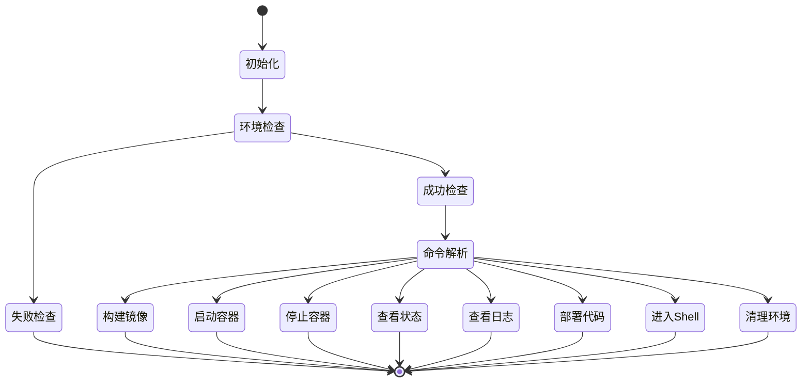

**图表来源**
- [docker/scripts/deploy.ps1:416-429](file://docker/scripts/deploy.ps1#L416-L429)

#### 核心命令功能

**环境初始化**
- 检查Docker安装状态
- 验证Docker Compose可用性
- 创建必要的目录结构

**镜像构建**
- 支持缓存禁用选项
- 多阶段构建优化
- 错误处理和回滚

**容器管理**
- 开发模式和生产模式切换
- 后台和前台运行模式
- 容器状态监控

**代码部署**
- TypeScript编译集成
- 自动代码同步
- 容器内文件复制

**章节来源**
- [docker/scripts/deploy.ps1:1-430](file://docker/scripts/deploy.ps1#L1-L430)

### 批处理脚本简化入口

批处理脚本提供简化的命令行接口：

**功能特点**
- 参数转发到PowerShell脚本
- 统一的错误处理
- 用户友好的帮助信息

**使用场景**
- 快速部署场景
- 系统集成需求
- 兼容性要求

**章节来源**
- [docker/scripts/deploy.bat:1-58](file://docker/scripts/deploy.bat#L1-L58)

## 路径处理和权限设置

### 跨平台路径映射

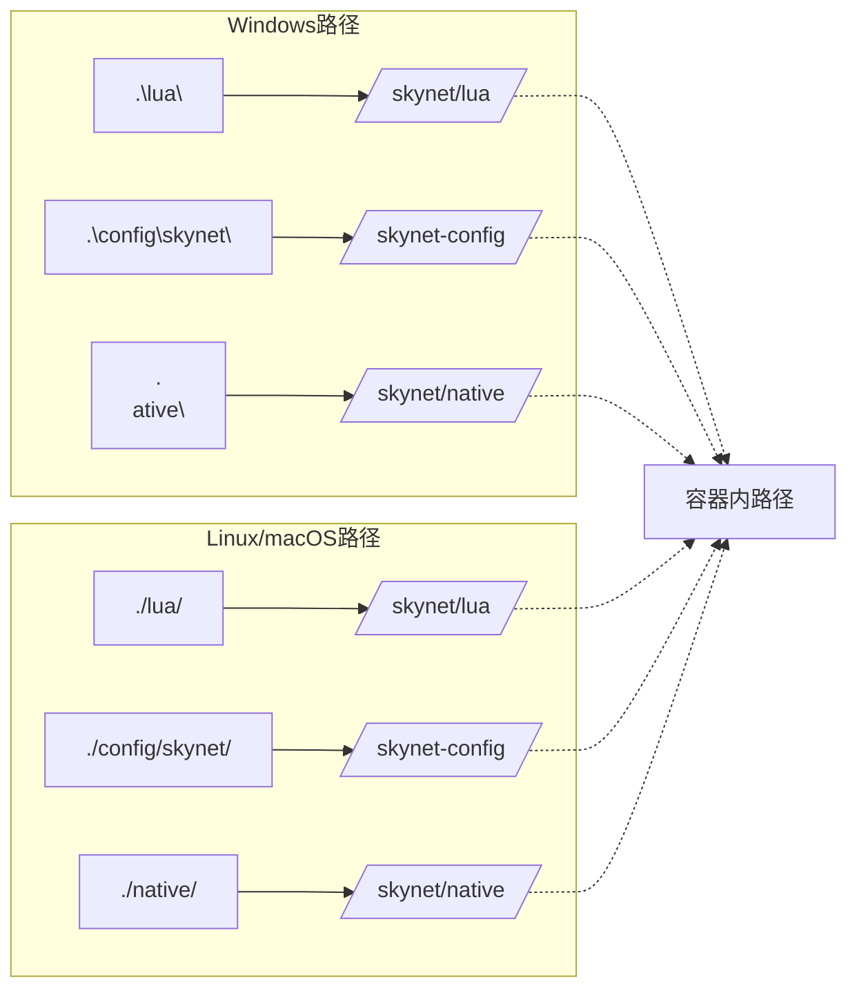

**图表来源**
- [docker/scripts/deploy.ps1:86-89](file://docker/scripts/deploy.ps1#L86-L89)

#### 路径处理策略

**Windows特殊处理**
- 驱动器字母转换
- 路径分隔符标准化
- 大小写敏感性处理

**权限继承**
- 继承父目录权限
- 设置默认文件权限
- 处理执行权限

**符号链接处理**
- 跨平台符号链接支持
- 链接目标解析
- 循环链接检测

### 权限设置最佳实践

**文件权限模型**
- 644读权限，755执行权限
- 目录权限755
- 特殊文件权限1777

**用户映射**
- 容器内非root用户
- 权限降级策略
- 安全上下文隔离

## 性能优化

### Docker守护进程优化

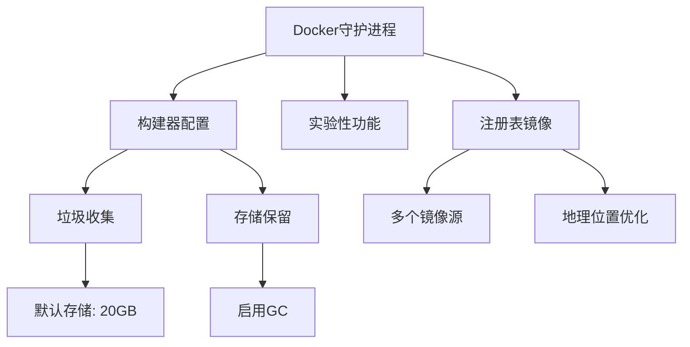

**图表来源**
- [docker/daemon.json:1-17](file://docker/daemon.json#L1-L17)

#### 关键优化配置

**构建器优化**
- 启用垃圾收集机制
- 设置合理的存储保留策略
- 优化构建缓存使用

**网络优化**
- 多注册表镜像源
- 地理位置优化的镜像源
- 减少网络延迟

**存储管理**
- 定期清理无用镜像
- 优化容器存储使用
- 监控存储空间使用

### 容器性能调优

**资源限制**
- CPU配额和限制
- 内存限制和交换
- 网络带宽限制

**文件系统优化**
- 使用合适的存储驱动
- 优化卷挂载性能
- 减少文件系统I/O

**网络优化**
- 端口映射优化
- 网络模式选择
- DNS配置优化

**章节来源**
- [docker/daemon.json:1-17](file://docker/daemon.json#L1-L17)

## 故障排除指南

### 常见问题诊断

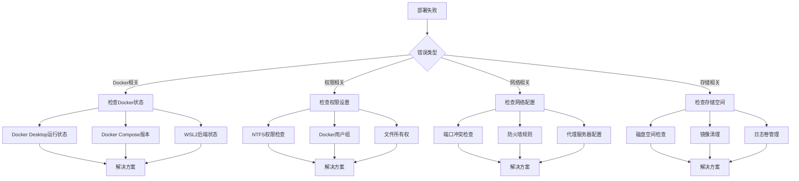

**图表来源**
- [docker/scripts/deploy.ps1:90-96](file://docker/scripts/deploy.ps1#L90-L96)

#### 详细故障排除步骤

**Docker环境问题**
- 验证Docker Desktop服务状态
- 检查Docker Compose版本兼容性
- 确认WSL2后端正确配置

**权限相关问题**
- 检查Windows用户权限
- 验证Docker Desktop权限设置
- 确认文件系统权限继承

**网络连接问题**
- 检查端口占用情况
- 验证防火墙规则
- 配置代理服务器支持

**存储空间问题**
- 监控Docker存储使用
- 清理无用镜像和容器
- 优化日志卷管理

**章节来源**
- [docker/scripts/deploy.ps1:90-96](file://docker/scripts/deploy.ps1#L90-L96)

### 平台特定故障排除

**Windows平台特有问题**
- WSL2性能问题
- 文件系统权限问题
- 防病毒软件冲突

**Linux平台特有问题**
- SELinux/AppArmor配置
- 文件描述符限制
- 系统资源限制

**macOS平台特有问题**
- 文件系统大小写处理
- 磁盘空间管理
- 睡眠/唤醒状态处理

## 一键部署脚本

### 脚本架构设计

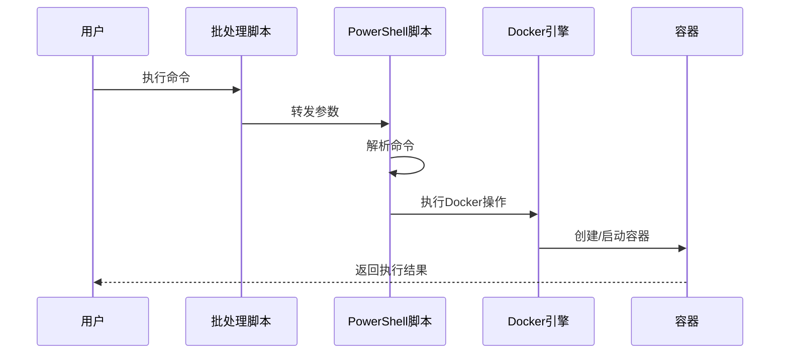

**图表来源**
- [docker/scripts/deploy.bat:20-22](file://docker/scripts/deploy.bat#L20-L22)

#### 脚本功能特性

**命令解析**
- 参数验证和处理
- 命令路由和分发
- 错误处理和恢复

**环境适配**
- 跨平台路径处理
- 权限模型适配
- 文件系统差异处理

**用户交互**
- 进度指示和状态反馈
- 错误信息格式化
- 帮助信息提供

**章节来源**
- [docker/scripts/deploy.bat:1-58](file://docker/scripts/deploy.bat#L1-L58)
- [docker/scripts/deploy.ps1:1-430](file://docker/scripts/deploy.ps1#L1-L430)

### 自定义配置选项

**部署配置参数**
- 环境变量配置
- 端口映射自定义
- 存储卷配置
- 网络配置选项

**性能调优参数**
- 资源限制配置
- 缓存策略设置
- 日志级别配置
- 监控参数配置

**扩展性配置**
- 插件系统配置
- 外部服务集成
- 自定义启动脚本
- 环境特定配置

## 容器间数据共享

### Volume挂载策略

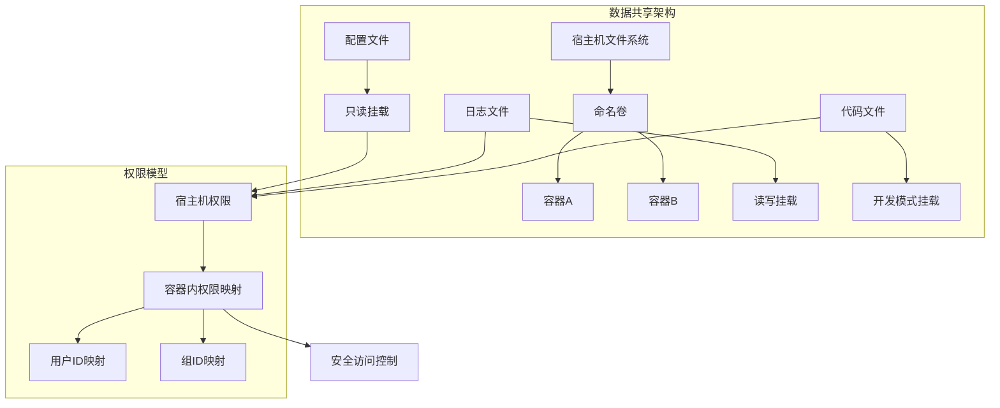

**图表来源**
- [docker/compose.yml:20-28](file://docker/compose.yml#L20-L28)

#### 数据同步机制

**开发模式数据同步**
- 实时文件监听
- 自动代码更新
- 热重载支持

**生产模式数据管理**
- 预编译代码部署
- 版本控制和回滚
- 数据备份和恢复

**跨平台兼容性**
- 路径分隔符处理
- 文件权限继承
- 符号链接支持

### 文件同步策略

**增量同步**
- 文件变更检测
- 增量传输优化
- 冲突解决机制

**批量同步**
- 定时同步任务
- 批处理优化
- 错误恢复机制

**实时同步**
- 文件系统事件监听
- 实时通知机制
- 同步状态跟踪

**章节来源**
- [docker/compose.yml:20-28](file://docker/compose.yml#L20-L28)

## 结论

TS-Skynet的跨平台Docker部署方案提供了完整的开发和生产环境支持。通过精心设计的多阶段构建、灵活的配置管理和强大的脚本工具，实现了在Windows、Linux和macOS平台上的无缝部署体验。

**关键优势总结**

**开发效率**
- 实时代码热更新
- 统一的开发环境
- 快速的部署流程

**运维便利性**
- 完整的生命周期管理
- 详细的故障排除指南
- 自动化的监控和日志

**平台兼容性**
- 统一的API接口
- 平台特定的优化
- 跨平台的最佳实践

**未来发展方向**
- 更智能的资源调度
- 增强的安全特性
- 更完善的监控体系

通过遵循本指南提供的最佳实践和配置建议，用户可以在任何支持Docker的平台上快速部署和运行TS-Skynet应用，享受现代化容器化部署带来的便利和效率。