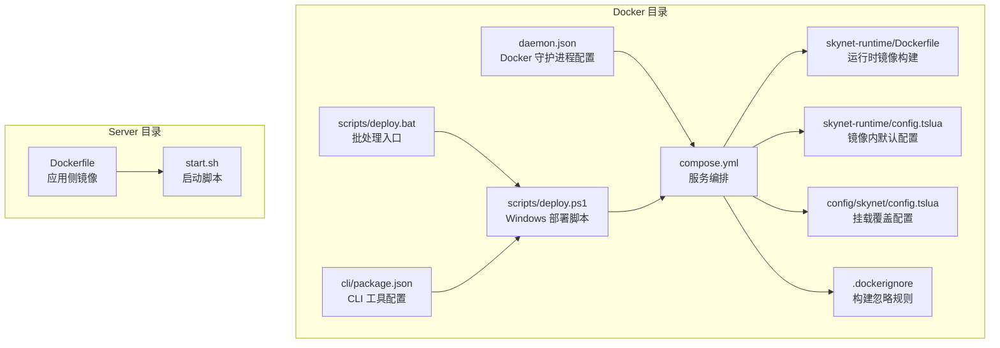
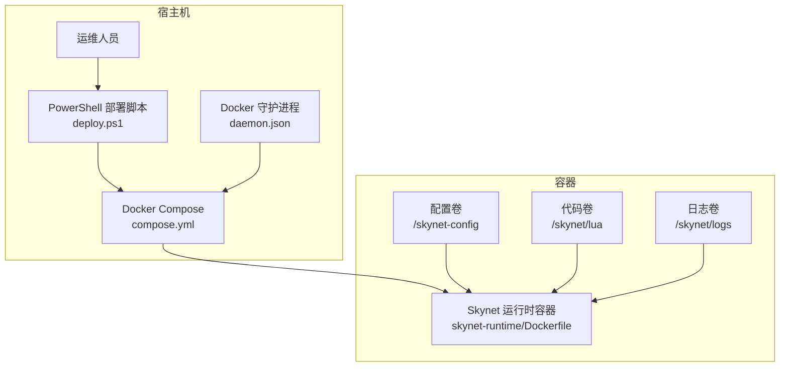
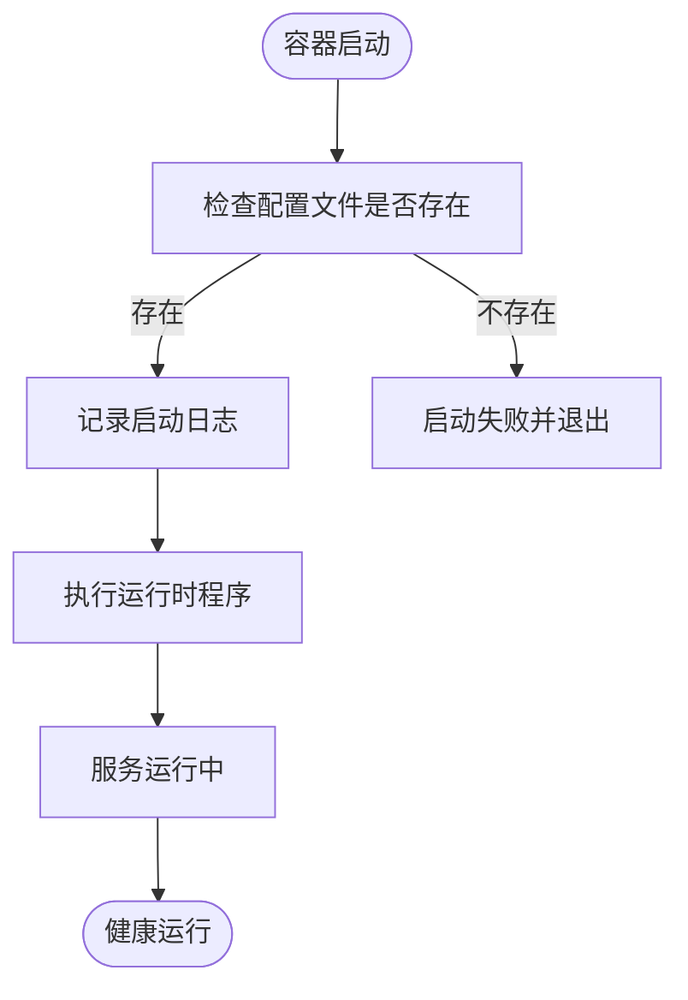
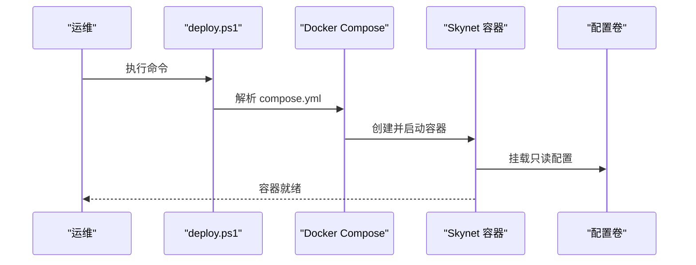
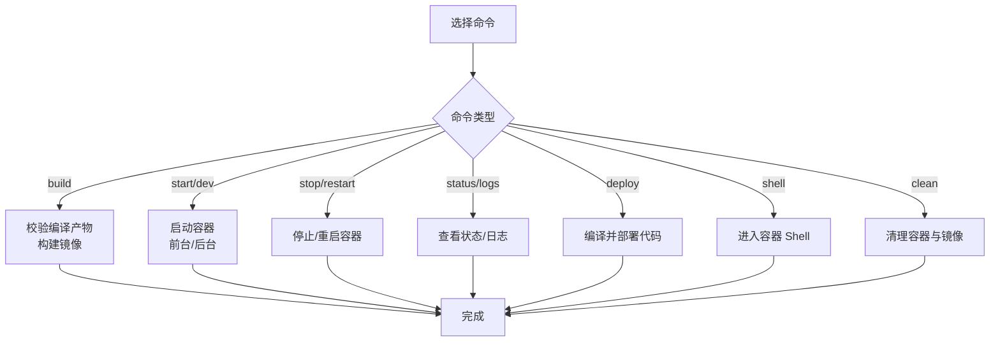
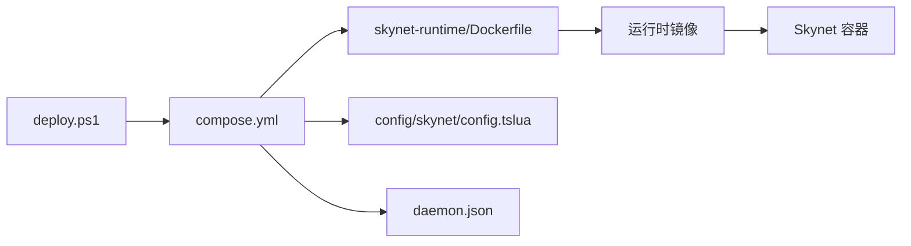

# 生产环境优化

<cite>
**本文引用的文件**
- [docker/compose.yml](file://docker/compose.yml)
- [docker/skynet-runtime/Dockerfile](file://docker/skynet-runtime/Dockerfile)
- [docker/skynet-runtime/config.tslua](file://docker/skynet-runtime/config.tslua)
- [docker/config/skynet/config.tslua](file://docker/config/skynet/config.tslua)
- [docker/.dockerignore](file://docker/.dockerignore)
- [docker/daemon.json](file://docker/daemon.json)
- [docker/scripts/deploy.ps1](file://docker/scripts/deploy.ps1)
- [docker/scripts/deploy.bat](file://docker/scripts/deploy.bat)
- [server/Dockerfile](file://server/Dockerfile)
- [server/start.sh](file://server/start.sh)
- [docker/cli/package.json](file://docker/cli/package.json)
</cite>

## 目录
1. [简介](#简介)
2. [项目结构](#项目结构)
3. [核心组件](#核心组件)
4. [架构总览](#架构总览)
5. [详细组件分析](#详细组件分析)
6. [依赖关系分析](#依赖关系分析)
7. [性能考虑](#性能考虑)
8. [故障排查指南](#故障排查指南)
9. [结论](#结论)
10. [附录](#附录)

## 简介
本指南面向生产环境的 Docker 部署优化，结合仓库现有配置与脚本，系统阐述资源限制、内存管理、CPU 亲和性等性能调优策略；容器安全加固（用户权限、网络隔离、文件系统只读）；日志与监控集成；高可用与容灾（负载均衡、故障转移、数据备份）；以及部署流水线与自动化运维工具的集成方式。同时提供性能基准测试与容量规划建议，帮助评估与优化部署效果。

## 项目结构
该仓库采用分层组织：顶层为业务与工具脚本，docker 目录包含完整的容器化部署配置与运行时镜像构建；server 目录提供应用侧镜像与启动脚本；config 目录提供 Skynet 运行时配置；scripts 目录提供 Windows 平台一键部署脚本。

**图表来源**
- [docker/compose.yml:1-70](file://docker/compose.yml#L1-L70)
- [docker/skynet-runtime/Dockerfile:1-91](file://docker/skynet-runtime/Dockerfile#L1-L91)
- [docker/skynet-runtime/config.tslua:1-35](file://docker/skynet-runtime/config.tslua#L1-L35)
- [docker/config/skynet/config.tslua:1-54](file://docker/config/skynet/config.tslua#L1-L54)
- [docker/.dockerignore:1-48](file://docker/.dockerignore#L1-L48)
- [docker/daemon.json:1-17](file://docker/daemon.json#L1-L17)
- [docker/scripts/deploy.ps1:1-430](file://docker/scripts/deploy.ps1#L1-L430)
- [docker/scripts/deploy.bat:1-58](file://docker/scripts/deploy.bat#L1-L58)
- [docker/cli/package.json:1-15](file://docker/cli/package.json#L1-L15)
- [server/Dockerfile:1-51](file://server/Dockerfile#L1-L51)
- [server/start.sh:1-66](file://server/start.sh#L1-L66)

**章节来源**
- [docker/compose.yml:1-70](file://docker/compose.yml#L1-L70)
- [docker/skynet-runtime/Dockerfile:1-91](file://docker/skynet-runtime/Dockerfile#L1-L91)
- [docker/config/skynet/config.tslua:1-54](file://docker/config/skynet/config.tslua#L1-L54)
- [docker/.dockerignore:1-48](file://docker/.dockerignore#L1-L48)
- [docker/daemon.json:1-17](file://docker/daemon.json#L1-L17)
- [docker/scripts/deploy.ps1:1-430](file://docker/scripts/deploy.ps1#L1-L430)
- [docker/scripts/deploy.bat:1-58](file://docker/scripts/deploy.bat#L1-L58)
- [server/Dockerfile:1-51](file://server/Dockerfile#L1-L51)
- [server/start.sh:1-66](file://server/start.sh#L1-L66)
- [docker/cli/package.json:1-15](file://docker/cli/package.json#L1-L15)

## 核心组件
- 运行时镜像与服务编排
  - 运行时镜像基于多阶段构建，分离编译与运行时环境，最终以非 root 用户运行，暴露必要端口，内置启动脚本。
  - Compose 定义了开发与生产两种 profile 的服务，分别挂载配置与代码目录，支持日志卷持久化与网络隔离。
- 应用侧镜像与启动脚本
  - 应用侧镜像提供开发与运维所需的工具链与 SSH 服务，便于远程调试与维护。
  - 启动脚本封装常用命令，支持编译、热更新、状态查询、日志查看等。
- 部署脚本与 CLI
  - Windows 平台提供 PowerShell 一键部署脚本，支持环境检查、镜像构建、容器启停、日志查看、代码部署、Shell 进入、清理等。
  - CLI 工具配置文件声明了可执行入口，便于扩展远程管理能力。

**章节来源**
- [docker/skynet-runtime/Dockerfile:1-91](file://docker/skynet-runtime/Dockerfile#L1-L91)
- [docker/compose.yml:1-70](file://docker/compose.yml#L1-L70)
- [server/Dockerfile:1-51](file://server/Dockerfile#L1-L51)
- [server/start.sh:1-66](file://server/start.sh#L1-L66)
- [docker/scripts/deploy.ps1:1-430](file://docker/scripts/deploy.ps1#L1-L430)
- [docker/cli/package.json:1-15](file://docker/cli/package.json#L1-L15)

## 架构总览
生产环境采用“运行时容器 + 配置卷 + 代码卷”的解耦架构，通过 Compose 统一编排，结合守护进程重启策略与日志输出到标准流，满足生产环境的可观测性与稳定性要求。

**图表来源**
- [docker/scripts/deploy.ps1:1-430](file://docker/scripts/deploy.ps1#L1-L430)
- [docker/compose.yml:1-70](file://docker/compose.yml#L1-L70)
- [docker/daemon.json:1-17](file://docker/daemon.json#L1-L17)
- [docker/skynet-runtime/Dockerfile:1-91](file://docker/skynet-runtime/Dockerfile#L1-L91)

## 详细组件分析

### 运行时镜像与启动流程
- 多阶段构建
  - 第一阶段：安装编译依赖，拷贝纯净 skynet 源码，编译生成可执行文件与 Lua/C 扩展模块。
  - 第二阶段：仅安装运行时依赖，创建非 root 用户，复制编译产物与默认配置，设置启动脚本与工作目录。
- 启动脚本
  - 读取配置文件路径变量，校验配置存在性，输出启动日志并执行运行时程序。
- 安全与权限
  - 使用非 root 用户运行，限定工作目录权限，避免特权提升风险。
- 端口与日志
  - 暴露游戏端口与调试端口；通过配置将日志输出到标准流，便于容器平台采集。

**图表来源**
- [docker/skynet-runtime/Dockerfile:77-90](file://docker/skynet-runtime/Dockerfile#L77-L90)
- [docker/skynet-runtime/config.tslua:1-35](file://docker/skynet-runtime/config.tslua#L1-L35)

**章节来源**
- [docker/skynet-runtime/Dockerfile:1-91](file://docker/skynet-runtime/Dockerfile#L1-L91)
- [docker/skynet-runtime/config.tslua:1-35](file://docker/skynet-runtime/config.tslua#L1-L35)

### 服务编排与配置覆盖
- 服务定义
  - 开发模式与生产模式分别对应两个服务，均挂载配置卷与代码卷，使用独立网络隔离。
  - 通过环境变量传递时区与配置路径，实现跨环境一致性。
- 配置覆盖
  - 镜像内提供默认配置文件，生产环境通过挂载外部配置文件进行覆盖，避免硬编码。
- 卷与网络
  - 日志卷持久化，便于离线分析；网络驱动为桥接网络，便于容器间通信。

**图表来源**
- [docker/scripts/deploy.ps1:214-238](file://docker/scripts/deploy.ps1#L214-L238)
- [docker/compose.yml:6-62](file://docker/compose.yml#L6-L62)
- [docker/config/skynet/config.tslua:1-54](file://docker/config/skynet/config.tslua#L1-L54)

**章节来源**
- [docker/compose.yml:1-70](file://docker/compose.yml#L1-L70)
- [docker/config/skynet/config.tslua:1-54](file://docker/config/skynet/config.tslua#L1-L54)

### 部署脚本与自动化运维
- 环境检查
  - 检查 Docker 命令、Docker Compose、WSL2 后端状态，确保运行环境正确。
- 镜像构建
  - 校验编译产物存在性，支持禁用缓存构建，保证镜像一致性。
- 容器启停与状态
  - 支持前台/后台启动、停止、重启、状态查询、日志查看、Shell 进入、清理等。
- 代码部署
  - 开发模式通过卷挂载自动同步；生产模式通过复制到容器实现部署。

**图表来源**
- [docker/scripts/deploy.ps1:416-429](file://docker/scripts/deploy.ps1#L416-L429)

**章节来源**
- [docker/scripts/deploy.ps1:1-430](file://docker/scripts/deploy.ps1#L1-L430)
- [docker/scripts/deploy.bat:1-58](file://docker/scripts/deploy.bat#L1-L58)

### 应用侧镜像与启动脚本
- 应用侧镜像
  - 提供 SSH、HTTP 工具与 Node.js 环境，便于远程调试与运维。
- 启动脚本
  - 封装编译、热更新、状态查询、日志查看等常用命令，简化运维操作。

**章节来源**
- [server/Dockerfile:1-51](file://server/Dockerfile#L1-L51)
- [server/start.sh:1-66](file://server/start.sh#L1-L66)

## 依赖关系分析
- 组件耦合
  - 运行时镜像与配置文件松耦合：通过卷挂载实现配置覆盖，便于环境差异化。
  - 部署脚本与 Compose 强耦合：脚本解析 compose 文件并执行相应操作。
- 外部依赖
  - Docker 与 Docker Compose；Windows 平台依赖 WSL2 后端；镜像拉取依赖镜像加速配置。
- 潜在循环依赖
  - 当前结构为单向依赖（脚本 → Compose → 容器），无循环依赖风险。

**图表来源**
- [docker/scripts/deploy.ps1:1-430](file://docker/scripts/deploy.ps1#L1-L430)
- [docker/compose.yml:1-70](file://docker/compose.yml#L1-L70)
- [docker/skynet-runtime/Dockerfile:1-91](file://docker/skynet-runtime/Dockerfile#L1-L91)
- [docker/daemon.json:1-17](file://docker/daemon.json#L1-L17)

**章节来源**
- [docker/scripts/deploy.ps1:1-430](file://docker/scripts/deploy.ps1#L1-L430)
- [docker/compose.yml:1-70](file://docker/compose.yml#L1-L70)
- [docker/skynet-runtime/Dockerfile:1-91](file://docker/skynet-runtime/Dockerfile#L1-L91)
- [docker/daemon.json:1-17](file://docker/daemon.json#L1-L17)

## 性能考虑
- 资源限制与 CPU 亲和性
  - 在生产环境中，建议通过 Compose 的资源限制字段为容器设置 CPU 和内存上限，避免资源争用。
  - 使用调度约束与反亲和策略，将多个实例分散到不同节点，提升可用性。
- 内存管理
  - 结合 Skynet 配置文件的线程数与模块路径，合理分配内存，避免频繁 GC 抖动。
  - 使用只读文件系统与最小化依赖，降低容器启动与运行时内存占用。
- 端口与网络
  - 仅暴露必要端口，使用内部网络隔离，减少网络开销与攻击面。
- 构建优化
  - 使用 .dockerignore 过滤无关文件，缩短构建时间；在 CI 中缓存中间层以提升重复构建速度。
- 日志与监控
  - 将日志输出到标准流，配合集中式日志收集；在容器中暴露指标端点，接入 Prometheus/Grafana。
- 基准测试与容量规划
  - 通过压测工具模拟并发场景，记录 QPS、延迟、内存与 CPU 使用率，据此调整容器副本数与资源配置。

[本节为通用性能指导，不直接分析具体文件，故无“章节来源”]

## 故障排查指南
- 环境问题
  - Docker 未启动：检查 Docker Desktop 与 WSL2 后端状态。
  - 端口冲突：修改 compose.yml 中的端口映射。
  - 权限错误：以管理员身份运行 PowerShell。
- 配置问题
  - 配置文件缺失：确认挂载的配置卷路径与文件名正确。
  - 线程数与模块路径：根据 CPU 核心数与模块数量调整配置。
- 镜像与容器问题
  - 镜像构建失败：检查编译产物是否存在，必要时禁用缓存重新构建。
  - 容器无法启动：查看日志，确认配置文件存在且可读。
- 运维操作
  - 进入容器：使用脚本提供的 Shell 命令。
  - 清理环境：谨慎使用清理命令，确认镜像与卷清理范围。

**章节来源**
- [docker/scripts/deploy.ps1:90-142](file://docker/scripts/deploy.ps1#L90-L142)
- [docker/scripts/deploy.ps1:175-211](file://docker/scripts/deploy.ps1#L175-L211)
- [docker/scripts/deploy.ps1:214-238](file://docker/scripts/deploy.ps1#L214-L238)
- [docker/scripts/deploy.ps1:324-327](file://docker/scripts/deploy.ps1#L324-L327)
- [docker/scripts/deploy.ps1:371-386](file://docker/scripts/deploy.ps1#L371-L386)
- [docker/scripts/deploy.ps1:391-402](file://docker/scripts/deploy.ps1#L391-L402)

## 结论
本指南基于仓库现有配置与脚本，提出了生产环境 Docker 部署的优化方向：通过资源限制与亲和性策略提升性能与稳定性；通过只读文件系统与最小化依赖强化安全；通过标准流日志与集中式监控增强可观测性；通过多副本与网络隔离实现高可用与容灾；并通过自动化脚本与 CLI 工具提升运维效率。建议在实际生产中结合基准测试结果持续迭代优化。

[本节为总结性内容，不直接分析具体文件，故无“章节来源”]

## 附录
- 高可用与容灾建议
  - 负载均衡：使用反向代理或云负载均衡，将流量分发至多个容器实例。
  - 故障转移：配置健康检查与自动重启策略，结合外部监控触发故障切换。
  - 数据备份：对配置卷与日志卷定期快照备份，确保故障恢复。
- 部署流水线与自动化
  - CI/CD：在流水线中集成构建、测试、镜像推送与部署步骤。
  - 声明式编排：将 Compose 配置纳入版本控制，配合 GitOps 实现变更审计。
  - CLI 扩展：利用 CLI 工具配置文件扩展远程管理能力，统一运维入口。

[本节为概念性内容，不直接分析具体文件，故无“章节来源”]