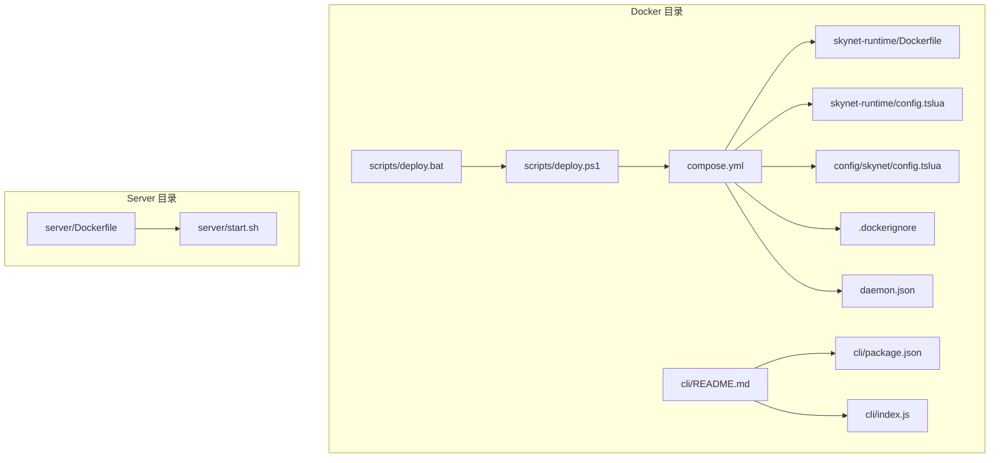
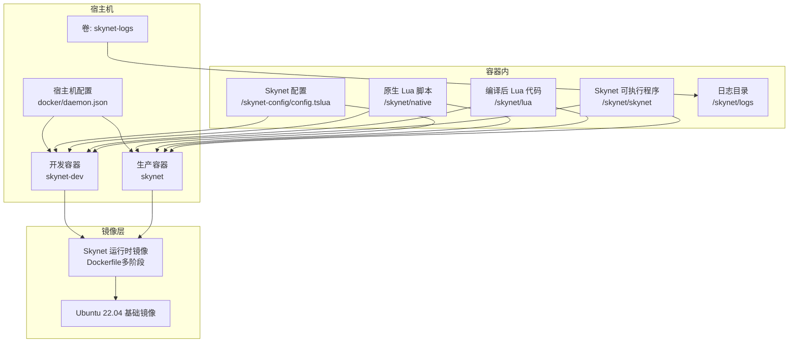
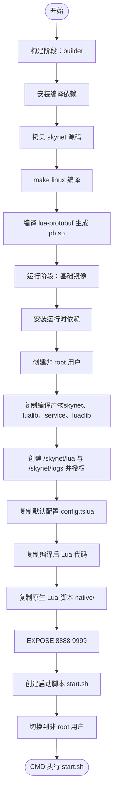
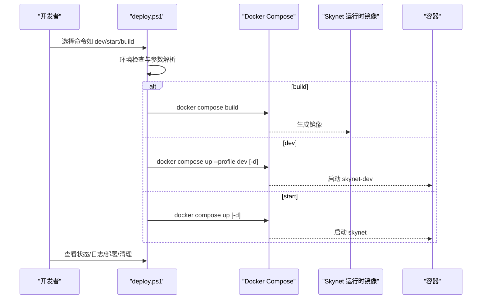
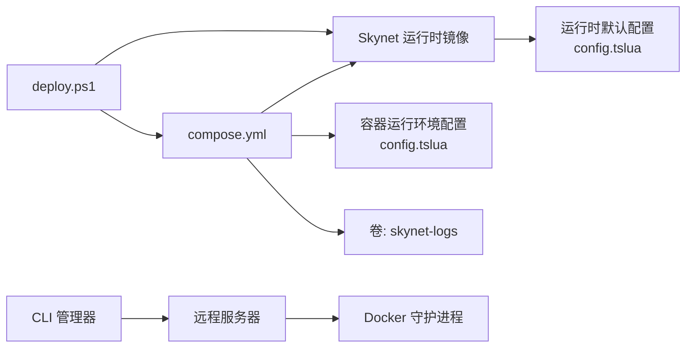

# 部署配置详解

<cite>
**本文引用的文件**   
- [compose.yml](file://docker/compose.yml)
- [Dockerfile（Skynet 运行时）](file://docker/skynet-runtime/Dockerfile)
- [config.tslua（运行时默认配置）](file://docker/skynet-runtime/config.tslua)
- [.dockerignore（docker/ 目录专用）](file://docker/.dockerignore)
- [daemon.json](file://docker/daemon.json)
- [config.tslua（容器运行环境配置）](file://docker/config/skynet/config.tslua)
- [deploy.ps1](file://docker/scripts/deploy.ps1)
- [deploy.bat](file://docker/scripts/deploy.bat)
- [Dockerfile（Server 开发镜像）](file://server/Dockerfile)
- [start.sh（Server 快速启动）](file://server/start.sh)
- [README.md（CLI 工具）](file://docker/cli/README.md)
- [package.json（CLI 工具）](file://docker/cli/package.json)
- [index.js（CLI 工具实现）](file://docker/cli/index.js)
</cite>

## 目录
1. [简介](#简介)
2. [项目结构](#项目结构)
3. [核心组件](#核心组件)
4. [架构总览](#架构总览)
5. [详细组件分析](#详细组件分析)
6. [依赖关系分析](#依赖关系分析)
7. [性能考量](#性能考量)
8. [故障排查指南](#故障排查指南)
9. [结论](#结论)
10. [附录](#附录)

## 简介
本指南面向希望使用 Docker 部署 TS-Skynet 的工程团队，系统讲解以下内容：
- Docker Compose 配置文件的各项参数与作用（服务定义、端口映射、卷挂载、环境变量、网络与卷声明等）
- Skynet 配置文件的关键参数与设置方法（线程数、启动模块、路径配置、日志与守护进程等）
- Dockerfile 的构建流程（多阶段构建、基础镜像、依赖安装、代码复制、启动脚本等）
- 不同部署场景的配置模板（开发、测试、生产）
- 配置验证方法与常见错误排查

## 项目结构
本项目的 Docker 相关资产集中在 docker/ 目录，包含：
- 运行时镜像构建：docker/skynet-runtime/Dockerfile
- 运行时默认配置：docker/skynet-runtime/config.tslua
- 容器运行环境配置：docker/config/skynet/config.tslua
- Compose 编排：docker/compose.yml
- 构建与运维脚本：docker/scripts/deploy.ps1、docker/scripts/deploy.bat
- 构建忽略规则：docker/.dockerignore
- Docker 守护进程配置：docker/daemon.json
- CLI 远程管理工具：docker/cli/（README、package.json、index.js）

图表来源
- [compose.yml:1-70](file://docker/compose.yml#L1-L70)
- [Dockerfile（Skynet 运行时）:1-91](file://docker/skynet-runtime/Dockerfile#L1-L91)
- [config.tslua（运行时默认配置）:1-35](file://docker/skynet-runtime/config.tslua#L1-L35)
- [config.tslua（容器运行环境配置）:1-54](file://docker/config/skynet/config.tslua#L1-L54)
- [.dockerignore（docker/ 目录专用）:1-48](file://docker/.dockerignore#L1-L48)
- [daemon.json:1-17](file://docker/daemon.json#L1-L17)
- [deploy.ps1:1-430](file://docker/scripts/deploy.ps1#L1-L430)
- [deploy.bat:1-58](file://docker/scripts/deploy.bat#L1-L58)
- [README.md（CLI 工具）:1-177](file://docker/cli/README.md#L1-L177)
- [package.json（CLI 工具）:1-15](file://docker/cli/package.json#L1-L15)
- [index.js（CLI 工具实现）:53-103](file://docker/cli/index.js#L53-L103)
- [Dockerfile（Server 开发镜像）:1-51](file://server/Dockerfile#L1-L51)
- [start.sh（Server 快速启动）:1-66](file://server/start.sh#L1-L66)

章节来源
- [compose.yml:1-70](file://docker/compose.yml#L1-L70)
- [Dockerfile（Skynet 运行时）:1-91](file://docker/skynet-runtime/Dockerfile#L1-L91)
- [config.tslua（容器运行环境配置）:1-54](file://docker/config/skynet/config.tslua#L1-L54)

## 核心组件
- Docker Compose 编排：定义 skynet-dev（开发）与 skynet（生产）两个服务，统一网络与卷，分别通过 volume 挂载或镜像内置方式提供 Lua 代码与配置。
- Skynet 运行时镜像：采用多阶段构建，第一阶段编译 Skynet 与 lua-protobuf，第二阶段仅拷贝运行时所需文件，最小化镜像体积。
- 运行时配置：提供默认 config.tslua 与容器运行环境专用 config.tslua，后者优先挂载覆盖。
- 部署脚本：PowerShell 脚本封装了环境检查、镜像构建、容器启停、日志查看、代码部署、Shell 进入、清理等常用操作。

章节来源
- [compose.yml:6-70](file://docker/compose.yml#L6-L70)
- [Dockerfile（Skynet 运行时）:7-91](file://docker/skynet-runtime/Dockerfile#L7-L91)
- [config.tslua（运行时默认配置）:1-35](file://docker/skynet-runtime/config.tslua#L1-L35)
- [config.tslua（容器运行环境配置）:1-54](file://docker/config/skynet/config.tslua#L1-L54)
- [deploy.ps1:1-430](file://docker/scripts/deploy.ps1#L1-L430)

## 架构总览
下图展示了 Docker Compose 服务、镜像构建、配置挂载与日志持久化的整体关系。

图表来源
- [compose.yml:11-63](file://docker/compose.yml#L11-L63)
- [Dockerfile（Skynet 运行时）:7-91](file://docker/skynet-runtime/Dockerfile#L7-L91)
- [config.tslua（容器运行环境配置）:1-54](file://docker/config/skynet/config.tslua#L1-L54)
- [config.tslua（运行时默认配置）:1-35](file://docker/skynet-runtime/config.tslua#L1-L35)
- [daemon.json:1-17](file://docker/daemon.json#L1-L17)

## 详细组件分析

### Docker Compose 配置详解
- 服务定义
  - skynet-dev：开发模式，使用 volume 挂载配置、原生 Lua 与编译后 Lua 代码，便于热更新；工作目录为 /skynet，profiles 标记为 dev。
  - skynet：生产模式，镜像内置 Lua 代码，通过只读挂载配置与原生脚本，日志卷持久化。
- 端口映射
  - 8888：游戏服务端口
  - 9999：调试/管理端口
- 卷挂载
  - /skynet-config：挂载容器运行环境配置（只读）
  - /skynet/native：挂载原生 Lua 脚本（只读）
  - /skynet/lua：挂载编译后 Lua 代码（只读）
  - skynet-logs：命名卷，持久化日志
- 环境变量
  - TZ：时区设置
  - SKYNET_CONFIG：指定 Skynet 配置文件路径
- 网络与卷
  - 自定义 bridge 网络 skynet-net
  - 命名卷 skynet-logs

章节来源
- [compose.yml:11-63](file://docker/compose.yml#L11-L63)

### Skynet 配置文件参数说明
- 基本参数
  - thread：线程数，建议根据 CPU 核心数调整
  - bootstrap：启动模块，通常为 snlua bootstrap
  - start：启动脚本名称，开发环境使用 ts_bootstrap，生产环境使用 app_main
- 路径配置
  - luaservice/lualoader：服务与加载器路径，开发环境优先 native，再 lua，最后 service
  - lua_path/lua_cpath：Lua 模块与 C 扩展库路径
  - cpath：C 服务路径
- 运行模式
  - harbor：单节点模式（0），不开启集群
- 日志与守护进程
  - logger：nil 表示输出到 stdout，适合 Docker 环境
  - daemon：nil 表示非守护进程，由 Docker 管理生命周期
- 可选参数
  - game_port/debug_port：对外暴露的游戏与调试端口
  - loglevel：日志级别（可选）

章节来源
- [config.tslua（容器运行环境配置）:6-54](file://docker/config/skynet/config.tslua#L6-L54)
- [config.tslua（运行时默认配置）:7-35](file://docker/skynet-runtime/config.tslua#L7-L35)

### Dockerfile 构建流程
- 多阶段构建
  - 第一阶段（builder）：基于 Ubuntu 22.04，安装编译依赖，拷贝 skynet 源码，make linux 编译；随后克隆 lua-protobuf 并编译生成 pb.so，复制到 /build/luaclib 与 /build/lualib
  - 第二阶段：仅安装运行时依赖，创建非 root 用户 skynet，复制编译产物（skynet、lualib、service、luaclib），创建 /skynet/lua 与 /skynet/logs 目录并授权
- 启动脚本
  - 通过环境变量 SKYNET_CONFIG 指定配置文件路径，若文件不存在则报错退出；否则打印配置路径并执行 ./skynet "$CONFIG_FILE"
- 端口与用户
  - EXPOSE 8888 9999
  - CMD 使用非 root 用户运行

图表来源
- [Dockerfile（Skynet 运行时）:7-91](file://docker/skynet-runtime/Dockerfile#L7-L91)

章节来源
- [Dockerfile（Skynet 运行时）:7-91](file://docker/skynet-runtime/Dockerfile#L7-L91)

### 部署脚本与运维流程
- deploy.ps1 提供的命令与行为
  - setup：检查 Docker 环境、创建必要目录
  - build：构建镜像，必要时检查编译后的 Lua 代码是否存在
  - dev：启动开发容器，支持 -Daemon 后台运行
  - start：启动生产容器，若镜像不存在则先构建
  - stop/restart/status/logs：容器生命周期与状态查看
  - deploy：编译 TypeScript 后部署到运行中的容器（开发模式自动同步，生产模式通过 docker cp）
  - shell：进入容器 Shell
  - clean：清理容器与镜像
- deploy.bat 作为 Windows 批处理入口，调用 deploy.ps1

图表来源
- [deploy.ps1:175-275](file://docker/scripts/deploy.ps1#L175-L275)
- [compose.yml:11-63](file://docker/compose.yml#L11-L63)

章节来源
- [deploy.ps1:1-430](file://docker/scripts/deploy.ps1#L1-L430)
- [deploy.bat:1-58](file://docker/scripts/deploy.bat#L1-L58)

### CLI 远程管理工具
- 功能概述：在 Windows 命令行中管理远程 Linux 服务器上的 Docker 容器，支持一键同步代码、查看日志、进入 Shell、构建镜像提示等
- 配置文件：docker/cli/config.json，包含远程 SSH 连接信息与容器路径映射
- 工作流程：初始化配置 → 启动管理器 → 选择菜单项执行相应操作

章节来源
- [README.md（CLI 工具）:1-177](file://docker/cli/README.md#L1-L177)
- [package.json（CLI 工具）:1-15](file://docker/cli/package.json#L1-L15)
- [index.js（CLI 工具实现）:53-103](file://docker/cli/index.js#L53-L103)

## 依赖关系分析
- 组件耦合
  - compose.yml 依赖 Dockerfile（Skynet 运行时）构建镜像
  - 容器运行依赖 config.tslua（容器运行环境配置）与默认配置（运行时镜像内）
  - 部署脚本依赖 Compose 文件与镜像标签
- 外部依赖
  - Docker Desktop（Windows，WSL2 后端更佳）
  - Docker Compose
  - 远程服务器（CLI 场景）

图表来源
- [compose.yml:6-70](file://docker/compose.yml#L6-L70)
- [Dockerfile（Skynet 运行时）:7-91](file://docker/skynet-runtime/Dockerfile#L7-L91)
- [config.tslua（容器运行环境配置）:1-54](file://docker/config/skynet/config.tslua#L1-L54)
- [config.tslua（运行时默认配置）:1-35](file://docker/skynet-runtime/config.tslua#L1-L35)
- [deploy.ps1:1-430](file://docker/scripts/deploy.ps1#L1-L430)
- [README.md（CLI 工具）:1-177](file://docker/cli/README.md#L1-L177)

章节来源
- [compose.yml:6-70](file://docker/compose.yml#L6-L70)
- [deploy.ps1:1-430](file://docker/scripts/deploy.ps1#L1-L430)

## 性能考量
- 镜像大小与启动速度
  - 多阶段构建仅保留运行时产物，减少镜像体积，提升拉取与启动速度
- 端口与网络
  - 仅暴露必要端口（8888/9999），避免安全风险
- 日志输出
  - 将日志输出到 stdout，配合 Docker 日志驱动，便于集中收集与分析
- 构建缓存
  - 使用 .dockerignore 排除无关文件，提升构建缓存命中率
- 守护进程与进程模型
  - Skynet 在容器内以非守护进程方式运行，由 Docker 管理生命周期，避免僵尸进程

章节来源
- [Dockerfile（Skynet 运行时）:7-91](file://docker/skynet-runtime/Dockerfile#L7-L91)
- [config.tslua（容器运行环境配置）:32-40](file://docker/config/skynet/config.tslua#L32-L40)
- [.dockerignore（docker/ 目录专用）:1-48](file://docker/.dockerignore#L1-L48)
- [daemon.json:1-17](file://docker/daemon.json#L1-L17)

## 故障排查指南
- Docker 环境问题
  - 症状：无法执行 docker 或 docker compose
  - 排查：确认 Docker Desktop 已启动，WSL2 后端可用；检查 docker info 与 docker compose version
- 端口冲突
  - 症状：容器启动失败或端口占用
  - 排查：修改 compose.yml 中的端口映射或释放宿主机端口
- 权限错误
  - 症状：容器内写入失败或日志目录权限不足
  - 排查：确认卷挂载目录权限，或使用只读挂载（开发模式）
- 配置文件缺失
  - 症状：启动脚本报错“配置文件未找到”
  - 排查：确认 SKYNET_CONFIG 环境变量指向的路径存在，或通过 volume 挂载覆盖
- 生产镜像缺少 Lua 代码
  - 症状：生产容器启动但业务逻辑未生效
  - 排查：确保编译后的 Lua 代码已复制到 docker/lua/ 目录，或在构建前完成编译
- 日志查看
  - 使用 docker compose logs -f skynet 实时查看日志
- 清理与重置
  - 使用 docker compose down --rmi all --volumes 清理容器、镜像与卷

章节来源
- [deploy.ps1:101-143](file://docker/scripts/deploy.ps1#L101-L143)
- [compose.yml:17-28](file://docker/compose.yml#L17-L28)
- [Dockerfile（Skynet 运行时）:78-86](file://docker/skynet-runtime/Dockerfile#L78-L86)
- [deploy.ps1:180-194](file://docker/scripts/deploy.ps1#L180-L194)
- [deploy.ps1:324-327](file://docker/scripts/deploy.ps1#L324-L327)
- [deploy.ps1:391-402](file://docker/scripts/deploy.ps1#L391-L402)

## 结论
本指南围绕 Docker Compose、Skynet 配置与 Dockerfile 三部分展开，结合部署脚本与 CLI 工具，提供了从开发到生产的完整部署路径。通过合理配置端口、卷与环境变量，以及遵循多阶段构建与日志输出规范，可在保证安全性的同时获得良好的可观测性与可维护性。

## 附录

### 不同部署场景的配置模板
- 开发环境（skynet-dev）
  - 关键点：使用 volume 挂载配置与代码，便于热更新；设置 profiles: dev
  - 参考路径：[compose.yml:11-36](file://docker/compose.yml#L11-L36)
- 生产环境（skynet）
  - 关键点：镜像内置 Lua 代码，只读挂载配置与原生脚本；日志卷持久化
  - 参考路径：[compose.yml:42-63](file://docker/compose.yml#L42-L63)
- 容器运行环境配置
  - 关键点：优先挂载 /skynet-config/config.tslua；可选设置 game_port、debug_port、loglevel
  - 参考路径：[config.tslua（容器运行环境配置）:6-54](file://docker/config/skynet/config.tslua#L6-L54)
- 运行时默认配置
  - 关键点：线程数、启动模块、路径与日志输出到 stdout
  - 参考路径：[config.tslua（运行时默认配置）:7-35](file://docker/skynet-runtime/config.tslua#L7-L35)

### 配置验证清单
- Docker 环境
  - docker、docker compose 可用；WSL2 后端可用
- Compose 文件
  - 服务定义正确；端口映射无冲突；卷挂载路径存在且权限正确
- 配置文件
  - SKYNET_CONFIG 指向有效路径；容器内可读
- 镜像与容器
  - 镜像构建成功；容器启动后进程健康；日志输出正常
- 代码部署
  - 开发模式：修改 TS 后编译并自动同步；生产模式：通过 docker cp 部署

章节来源
- [deploy.ps1:101-143](file://docker/scripts/deploy.ps1#L101-L143)
- [compose.yml:17-28](file://docker/compose.yml#L17-L28)
- [config.tslua（容器运行环境配置）:6-54](file://docker/config/skynet/config.tslua#L6-L54)
- [config.tslua（运行时默认配置）:7-35](file://docker/skynet-runtime/config.tslua#L7-L35)
- [deploy.ps1:332-366](file://docker/scripts/deploy.ps1#L332-L366)