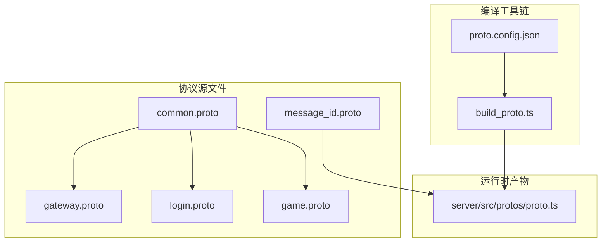
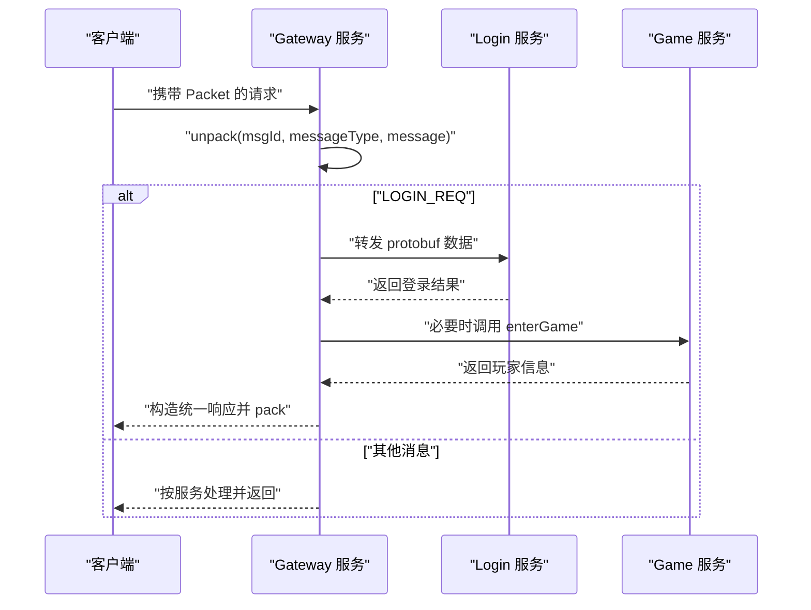
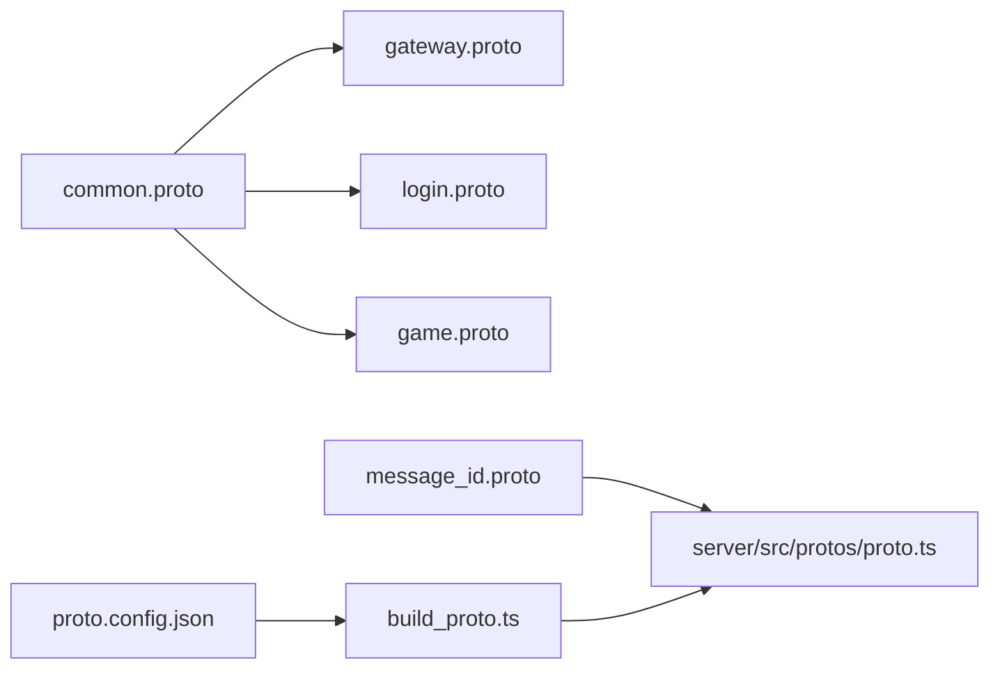

# Protobuf协议设计

<cite>
**本文引用的文件**
- [common.proto](file://protocols/proto/common.proto)
- [gateway.proto](file://protocols/proto/gateway.proto)
- [login.proto](file://protocols/proto/login.proto)
- [game.proto](file://protocols/proto/game.proto)
- [message_id.proto](file://protocols/proto/message_id.proto)
- [proto.config.json](file://protocols/proto.config.json)
- [build_proto.ts](file://protocols/scripts/build_proto.ts)
- [Protobuf 集成与应用指南.md](file://docs/Protobuf 集成与应用指南.md)
- [proto.ts](file://server/src/protos/proto.ts)
- [gateway/index.ts](file://server/src/app/services/gateway/index.ts)
- [README.md](file://protocols/README.md)
</cite>

## 目录
1. [简介](#简介)
2. [项目结构](#项目结构)
3. [核心组件](#核心组件)
4. [架构总览](#架构总览)
5. [详细组件分析](#详细组件分析)
6. [依赖关系分析](#依赖关系分析)
7. [性能考量](#性能考量)
8. [故障排查指南](#故障排查指南)
9. [结论](#结论)
10. [附录](#附录)

## 简介
本文件系统性阐述本项目的 Protobuf 协议设计与实现，覆盖协议文件的组织结构与命名规范、消息类型定义与字段约束、消息 ID 映射机制、版本控制与向后兼容策略，以及在 TypeScript 与 Lua 环境中的使用方式与最佳实践。目标是帮助开发者快速理解并正确扩展协议，保障跨语言、跨服务的稳定通信。

## 项目结构
协议相关的核心位置位于 protocols 目录，包含：
- 协议源文件：protocols/proto/*.proto
- 编译配置：protocols/proto.config.json
- 编译脚本：protocols/scripts/build_proto.ts
- 文档：protocols/README.md、docs/Protobuf 集成与应用指南.md
- 运行时生成的类型与消息映射：server/src/protos/proto.ts

**图表来源**
- [common.proto:1-39](file://protocols/proto/common.proto#L1-L39)
- [gateway.proto:1-70](file://protocols/proto/gateway.proto#L1-L70)
- [login.proto:1-83](file://protocols/proto/login.proto#L1-L83)
- [game.proto:1-141](file://protocols/proto/game.proto#L1-L141)
- [message_id.proto:1-48](file://protocols/proto/message_id.proto#L1-L48)
- [proto.config.json:1-15](file://protocols/proto.config.json#L1-L15)
- [build_proto.ts:1-245](file://protocols/scripts/build_proto.ts#L1-L245)
- [proto.ts:280-333](file://server/src/protos/proto.ts#L280-L333)

**章节来源**
- [README.md:1-176](file://protocols/README.md#L1-L176)
- [proto.config.json:1-15](file://protocols/proto.config.json#L1-L15)
- [build_proto.ts:1-245](file://protocols/scripts/build_proto.ts#L1-L245)

## 核心组件
- 通用层（common.proto）
  - Packet：统一消息包装，承载 msg_id、session、data、timestamp。
  - ErrorCode：统一错误码枚举。
  - Response：通用响应结构，包含 code、message、data。
- 服务层
  - gateway.proto：连接管理、心跳、断开通知等网关协议。
  - login.proto：登录、登出、Token校验、在线人数查询等登录协议。
  - game.proto：进入/离开游戏、玩家信息、经验/金币变更等游戏协议。
- 消息ID（message_id.proto）
  - 以分段区间为服务划分，便于路由与维护；包含系统消息、网关、登录、游戏四类消息ID。

**章节来源**
- [common.proto:1-39](file://protocols/proto/common.proto#L1-L39)
- [gateway.proto:1-70](file://protocols/proto/gateway.proto#L1-L70)
- [login.proto:1-83](file://protocols/proto/login.proto#L1-L83)
- [game.proto:1-141](file://protocols/proto/game.proto#L1-L141)
- [message_id.proto:1-48](file://protocols/proto/message_id.proto#L1-L48)

## 架构总览
协议在运行时通过统一的打包/解包接口进行传输，服务间通过消息ID进行路由，最终由各服务的消息处理器解析并执行业务逻辑。

**图表来源**
- [proto.ts:287-330](file://server/src/protos/proto.ts#L287-L330)
- [gateway/index.ts:140-167](file://server/src/app/services/gateway/index.ts#L140-L167)
- [Protobuf 集成与应用指南.md:374-437](file://docs/Protobuf 集成与应用指南.md#L374-L437)

## 详细组件分析

### 通用层：common.proto
- Packet 字段
  - msg_id：消息ID，用于路由与匹配。
  - session：会话ID，用于请求-响应配对。
  - data：序列化后的消息体字节。
  - timestamp：时间戳，便于统计与日志追踪。
- ErrorCode 枚举
  - 覆盖常见错误场景，便于统一处理与前端展示。
- Response 结构
  - code、message、data，作为所有 RPC 响应的统一载体。

设计要点
- 所有消息均通过 Packet 包裹，保证路由与会话管理的一致性。
- 错误码集中定义，避免重复与歧义。
- data 字段采用 bytes，允许任意协议消息的透明传输。

**章节来源**
- [common.proto:9-38](file://protocols/proto/common.proto#L9-L38)

### 网关层：gateway.proto
- 心跳与连接
  - HeartbeatRequest/HeartbeatResponse：客户端与服务端时间戳与在线人数。
  - ConnectRequest/ConnectResponse：连接建立与返回连接ID、服务器时间。
  - DisconnectNotify：断开通知，含断开原因。
- 客户端信息
  - ClientInfo：IP、端口、版本、平台、设备ID。
- 消息类型枚举
  - MessageType：心跳、连接、断开、转发、广播、踢出。

字段约束与类型选择
- 时间戳使用 uint64，避免符号与溢出问题。
- 在线人数使用 uint32，满足计数范围。
- 字符串字段用于标识信息，遵循最小必要原则。

**章节来源**
- [gateway.proto:10-69](file://protocols/proto/gateway.proto#L10-L69)

### 登录层：login.proto
- 登录与登出
  - LoginRequest/LoginResponse：用户名、密码（建议密文）、设备ID、平台；返回用户信息与token。
  - LogoutRequest/LogoutResponse：登出请求与响应。
- Token 校验
  - ValidateTokenRequest/ValidateTokenResponse：校验token有效性与返回用户ID。
- 在线人数
  - GetOnlineCountRequest/GetOnlineCountResponse：查询在线人数。

字段约束与类型选择
- 用户ID使用 uint32，满足一般业务范围。
- 登录时间使用 uint64，便于跨语言时间处理。
- token 使用字符串，便于跨语言传递。

**章节来源**
- [login.proto:10-82](file://protocols/proto/login.proto#L10-L82)

### 游戏层：game.proto
- 玩家信息
  - PlayerInfo：用户ID、等级、经验值、金币、进入时间。
- 进入/离开游戏
  - EnterGameRequest/EnterGameResponse：携带用户ID与token。
  - LeaveGameRequest/LeaveGameResponse：离开游戏。
- 查询与更新
  - GetPlayerInfoRequest/GetPlayerInfoResponse：查询玩家信息。
  - UpdatePlayerRequest/UpdatePlayerResponse：批量更新玩家属性（使用 PlayerUpdate）。
- 在线玩家
  - GetOnlinePlayersRequest/GetOnlinePlayersResponse：返回在线玩家列表。
- 经验与金币
  - AddExpRequest/AddExpResponse：增加经验并返回是否升级。
  - AddGoldRequest/AddGoldResponse：增加金币。

字段约束与类型选择
- 属性值使用 uint64，避免负值与溢出风险。
- PlayerUpdate 采用“0 表示不更新”的策略，减少冗余字段。

**章节来源**
- [game.proto:10-140](file://protocols/proto/game.proto#L10-L140)

### 消息ID映射：message_id.proto 与运行时映射
- 分段区间
  - 系统消息：1-99
  - 网关消息：100-199
  - 登录消息：200-299
  - 游戏消息：300-399
- 运行时映射
  - MessageId：常量对象，键为消息名，值为数值ID。
  - MessageTypes：ID 到消息类型的字符串映射，用于解包与打包。

消息ID生成与使用
- 通过 MessageId 枚举在业务代码中引用，避免魔法数字。
- 与 MessageTypes 配合，实现统一的 pack/unpack 流程。

**章节来源**
- [message_id.proto:9-47](file://protocols/proto/message_id.proto#L9-L47)
- [proto.ts:287-330](file://server/src/protos/proto.ts#L287-L330)

## 依赖关系分析
- 协议依赖
  - gateway.proto、login.proto、game.proto 均依赖 common.proto（ErrorCode、Response）。
- 运行时依赖
  - 服务代码通过导入 server/src/protos/proto.ts 使用 MessageId 与消息类型。
- 编译依赖
  - build_proto.ts 读取 proto.config.json，扫描 proto 目录，生成 Lua 描述文件与 TypeScript 代码。

**图表来源**
- [common.proto:1-39](file://protocols/proto/common.proto#L1-L39)
- [gateway.proto:5-5](file://protocols/proto/gateway.proto#L5-L5)
- [login.proto:5-5](file://protocols/proto/login.proto#L5-L5)
- [game.proto:5-5](file://protocols/proto/game.proto#L5-L5)
- [message_id.proto:3-3](file://protocols/proto/message_id.proto#L3-L3)
- [proto.ts:287-330](file://server/src/protos/proto.ts#L287-L330)
- [proto.config.json:5-13](file://protocols/proto.config.json#L5-L13)
- [build_proto.ts:62-104](file://protocols/scripts/build_proto.ts#L62-L104)

**章节来源**
- [gateway.proto:5-5](file://protocols/proto/gateway.proto#L5-L5)
- [login.proto:5-5](file://protocols/proto/login.proto#L5-L5)
- [game.proto:5-5](file://protocols/proto/game.proto#L5-L5)
- [proto.ts:287-330](file://server/src/protos/proto.ts#L287-L330)
- [build_proto.ts:62-104](file://protocols/scripts/build_proto.ts#L62-L104)

## 性能考量
- 二进制编码优先：生产环境建议启用标准 Protobuf 二进制编码，以降低带宽与提升解析性能。
- 字段编号复用策略：在不破坏向后兼容的前提下，谨慎复用已弃用字段编号，避免冲突。
- 消息体大小控制：尽量使用更小的整型类型（如 uint32）与可选字段，减少冗余。
- 批量操作：对频繁更新的属性（如 PlayerUpdate）采用批量更新，减少消息数量。

[本节为通用指导，无需特定文件引用]

## 故障排查指南
- 编译失败
  - 检查 protoc 是否可用（系统 PATH、本地 bin、node_modules）。若缺失，脚本会跳过 .desc 生成。
- 类型缺失或报错
  - 确认已执行编译脚本生成 proto.js/.d.ts 或使用手写 proto.ts。
- 运行时解包异常
  - 核对 MessageId 与 MessageTypes 是否一致；确认消息ID与消息类型映射正确。
- 服务间通信异常
  - 检查 Gateway 是否正确转发 protobuf 数据；确认目标服务的消息处理器存在且可处理对应消息。

**章节来源**
- [build_proto.ts:107-127](file://protocols/scripts/build_proto.ts#L107-L127)
- [build_proto.ts:176-226](file://protocols/scripts/build_proto.ts#L176-L226)
- [gateway/index.ts:140-167](file://server/src/app/services/gateway/index.ts#L140-L167)
- [proto.ts:287-330](file://server/src/protos/proto.ts#L287-L330)

## 结论
本协议体系以 common.proto 为通用层，gateway/login/game 为服务层，message_id.proto 提供统一消息ID映射，配合编译脚本与运行时映射，实现了跨语言、可扩展、可热更新的通信框架。遵循字段编号分配、版本控制与向后兼容策略，可在演进过程中保持稳定性与一致性。

[本节为总结，无需特定文件引用]

## 附录

### 协议文件组织与命名规范
- 文件命名：服务名小写（如 gateway.proto、login.proto、game.proto），公共定义 common.proto。
- 包名：与服务名一致（如 package gateway）。
- 消息命名：PascalCase（如 LoginRequest、HeartbeatResponse）。
- 字段命名：snake_case（如 user_id、client_time）。
- 枚举命名：UPPER_SNAKE_CASE（如 LOGIN_LOGIN_REQ、HEARTBEAT）。

**章节来源**
- [README.md:140-150](file://protocols/README.md#L140-L150)

### 消息ID分配策略
- 每个服务预留 100 个ID（100-199、200-299、300-399）。
- 请求使用偶数，响应使用奇数（推荐），便于推导与维护。
- 新增消息时同步更新 message_id.proto 与运行时映射。

**章节来源**
- [README.md:147-150](file://protocols/README.md#L147-L150)
- [message_id.proto:10-47](file://protocols/proto/message_id.proto#L10-L47)
- [proto.ts:287-330](file://server/src/protos/proto.ts#L287-L330)

### 版本控制与向后兼容
- 不删除字段；不修改字段编号；新增字段使用新编号。
- 使用 optional/repeated 保证向后兼容；避免破坏旧客户端解析。

**章节来源**
- [README.md:152-156](file://protocols/README.md#L152-L156)

### 使用场景示例（路径指引）
- 在 TypeScript 中使用 proto 与 MessageId
  - [proto.ts:287-330](file://server/src/protos/proto.ts#L287-L330)
  - [Protobuf 集成与应用指南.md:89-110](file://docs/Protobuf 集成与应用指南.md#L89-L110)
- 在 Lua 中使用描述文件与编码解码
  - [Protobuf 集成与应用指南.md:112-138](file://docs/Protobuf 集成与应用指南.md#L112-L138)
- 服务间通信与消息路由
  - [gateway/index.ts:140-167](file://server/src/app/services/gateway/index.ts#L140-L167)
  - [Protobuf 集成与应用指南.md:439-479](file://docs/Protobuf 集成与应用指南.md#L439-L479)