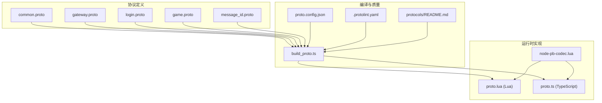
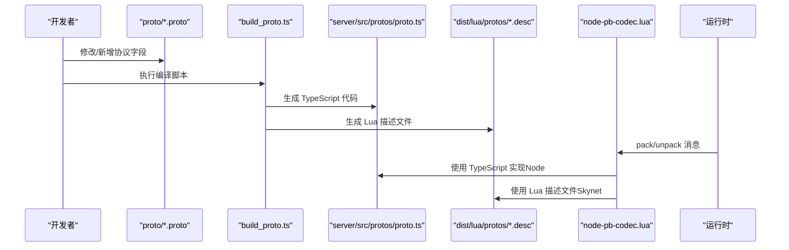
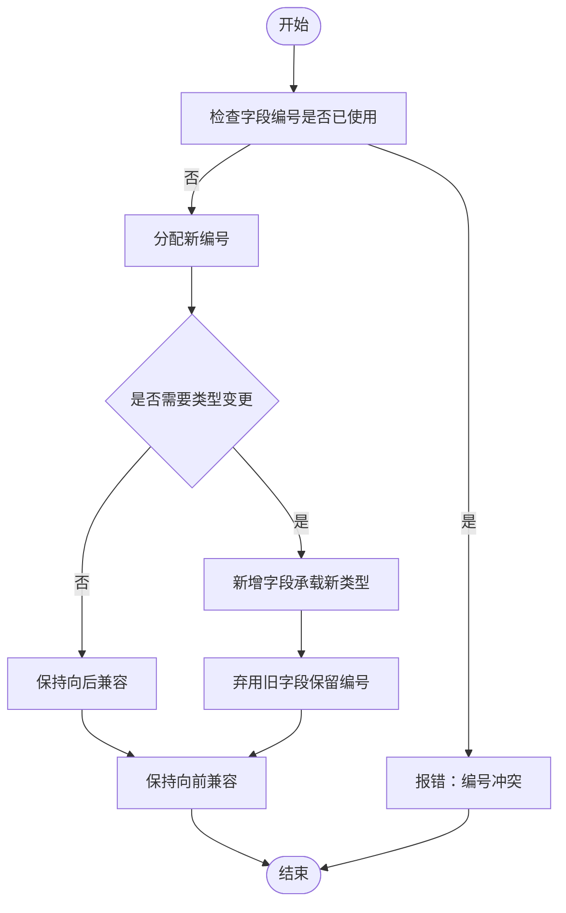
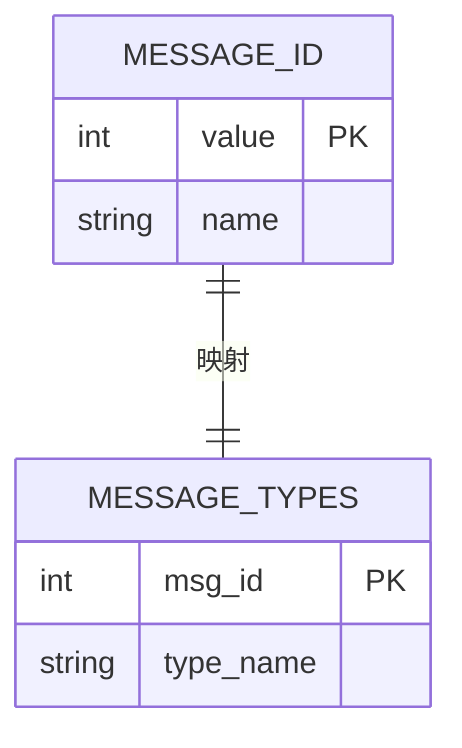
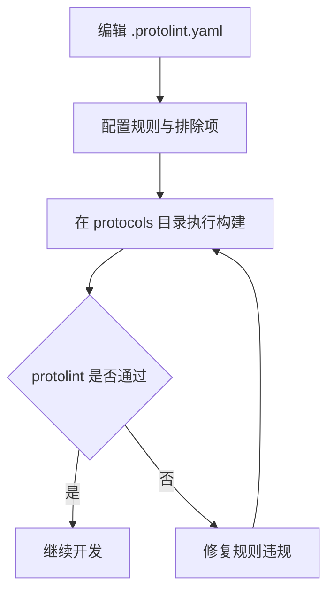
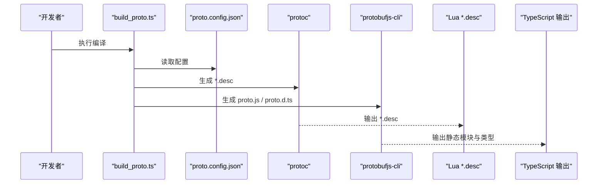
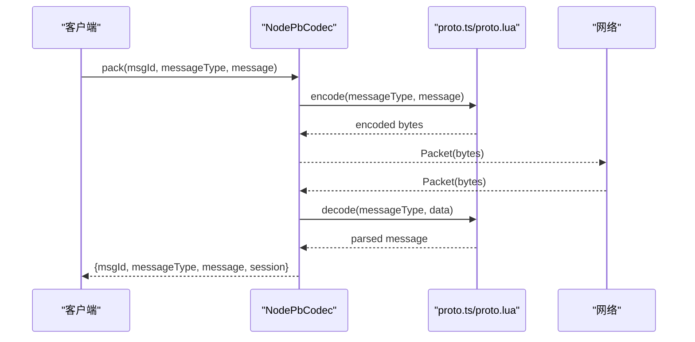
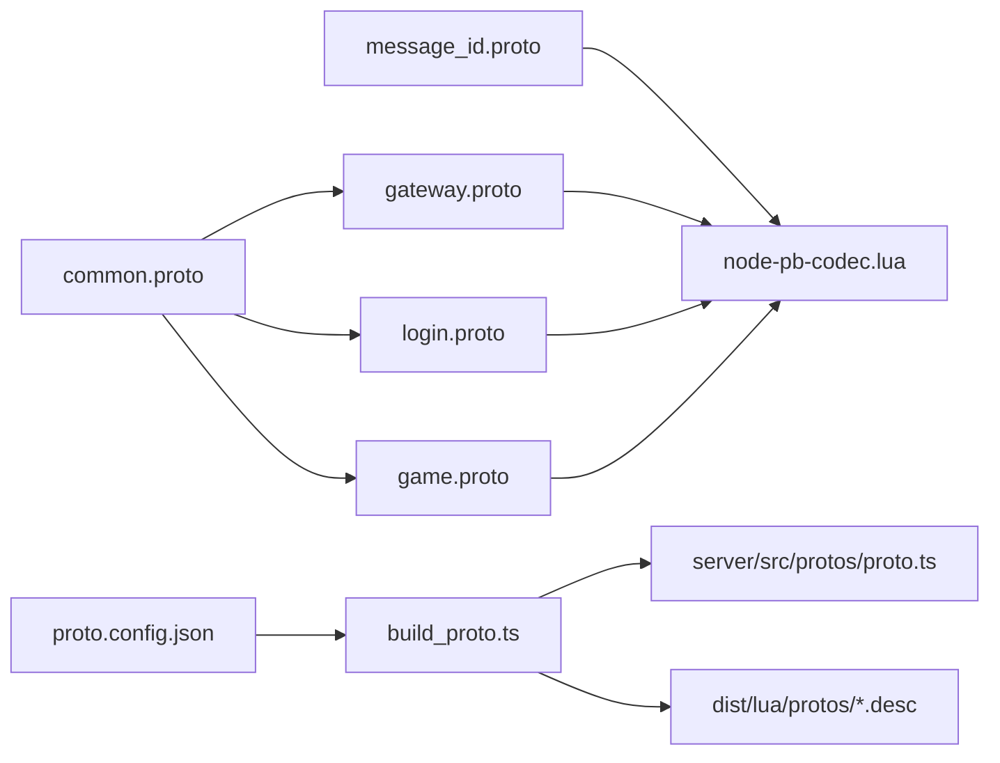

# 协议版本管理

<cite>
**本文档引用的文件**
- [protocols/.protolint.yaml](file://protocols/.protolint.yaml)
- [protocols/README.md](file://protocols/README.md)
- [protocols/proto.config.json](file://protocols/proto.config.json)
- [protocols/scripts/build_proto.ts](file://protocols/scripts/build_proto.ts)
- [protocols/proto/common.proto](file://protocols/proto/common.proto)
- [protocols/proto/gateway.proto](file://protocols/proto/gateway.proto)
- [protocols/proto/login.proto](file://protocols/proto/login.proto)
- [protocols/proto/game.proto](file://protocols/proto/game.proto)
- [protocols/proto/message_id.proto](file://protocols/proto/message_id.proto)
- [docker/lua/framework/runtime/node-pb-codec.lua](file://docker/lua/framework/runtime/node-pb-codec.lua)
- [docker/lua/protos/proto.lua](file://docker/lua/protos/proto.lua)
- [docker/lua/protos/index.lua](file://docker/lua/protos/index.lua)
- [server/src/protos/proto.ts](file://server/src/protos/proto.ts)
</cite>

## 目录
1. [简介](#简介)
2. [项目结构](#项目结构)
3. [核心组件](#核心组件)
4. [架构总览](#架构总览)
5. [详细组件分析](#详细组件分析)
6. [依赖关系分析](#依赖关系分析)
7. [性能考虑](#性能考虑)
8. [故障排查指南](#故障排查指南)
9. [结论](#结论)
10. [附录](#附录)

## 简介
本文件面向协议版本管理，系统性阐述 Protobuf 协议的版本控制策略与工程实践，覆盖向前/向后兼容设计原则、字段编号管理、新增/废弃/类型变更处理、protolint 规范检查与质量控制、版本升级最佳实践（渐进式迁移、双协议并行与回滚）、协议版本与服务版本的对应关系，以及生产环境安全升级与自动化工具链。文档以仓库现有实现为依据，结合代码结构与配置文件进行深入分析，并提供可视化图示帮助理解。

## 项目结构
协议相关的核心位置与职责如下：
- protocols：协议定义、编译脚本与质量配置
  - proto/*.proto：协议源文件（common、gateway、login、game、message_id）
  - scripts/build_proto.ts：跨平台编译脚本，生成 Lua 描述文件与 TypeScript 代码
  - proto.config.json：编译配置（输入/输出路径）
  - .protolint.yaml：协议规范检查规则
  - README.md：使用说明与规范
- server/src/protos：TypeScript 协议实现（fallback）
- docker/lua/protos：Lua 协议实现与消息ID映射
- docker/lua/framework/runtime/node-pb-codec.lua：消息打包解包与编码器

**图表来源**
- [protocols/scripts/build_proto.ts:1-245](file://protocols/scripts/build_proto.ts#L1-L245)
- [protocols/proto.config.json:1-15](file://protocols/proto.config.json#L1-L15)
- [protocols/.protolint.yaml:1-45](file://protocols/.protolint.yaml#L1-L45)
- [protocols/proto/common.proto:1-39](file://protocols/proto/common.proto#L1-L39)
- [protocols/proto/gateway.proto:1-70](file://protocols/proto/gateway.proto#L1-L70)
- [protocols/proto/login.proto:1-83](file://protocols/proto/login.proto#L1-L83)
- [protocols/proto/game.proto:1-141](file://protocols/proto/game.proto#L1-L141)
- [protocols/proto/message_id.proto:1-48](file://protocols/proto/message_id.proto#L1-L48)
- [docker/lua/framework/runtime/node-pb-codec.lua:1-185](file://docker/lua/framework/runtime/node-pb-codec.lua#L1-L185)
- [docker/lua/protos/proto.lua:1-199](file://docker/lua/protos/proto.lua#L1-L199)
- [server/src/protos/proto.ts:1-341](file://server/src/protos/proto.ts#L1-L341)

**章节来源**
- [protocols/README.md:1-176](file://protocols/README.md#L1-L176)
- [protocols/proto.config.json:1-15](file://protocols/proto.config.json#L1-L15)
- [protocols/scripts/build_proto.ts:1-245](file://protocols/scripts/build_proto.ts#L1-L245)

## 核心组件
- 协议定义层：按功能分层（通用层、服务层、消息ID），确保消息封装与路由清晰
- 编译与质量：自动编译生成多语言代码，配合 protolint 规范检查
- 运行时编码器：统一的 Pack/Unpack 流程，基于消息ID映射到具体消息类型
- 多语言实现：TypeScript fallback 与 Lua 描述文件并存，满足不同运行环境需求

**章节来源**
- [protocols/README.md:16-35](file://protocols/README.md#L16-L35)
- [protocols/scripts/build_proto.ts:107-160](file://protocols/scripts/build_proto.ts#L107-L160)
- [docker/lua/framework/runtime/node-pb-codec.lua:160-183](file://docker/lua/framework/runtime/node-pb-codec.lua#L160-L183)
- [server/src/protos/proto.ts:1-341](file://server/src/protos/proto.ts#L1-L341)

## 架构总览
下图展示从协议定义到运行时编码解码的整体流程，包括编译生成、消息打包解包与类型映射。

**图表来源**
- [protocols/scripts/build_proto.ts:107-160](file://protocols/scripts/build_proto.ts#L107-L160)
- [docker/lua/framework/runtime/node-pb-codec.lua:160-183](file://docker/lua/framework/runtime/node-pb-codec.lua#L160-L183)
- [server/src/protos/proto.ts:1-341](file://server/src/protos/proto.ts#L1-L341)

## 详细组件分析

### 组件A：协议版本控制策略与兼容性
- 向前兼容（客户端能解析旧协议）：新增字段使用新编号，保持已存在字段编号不变；使用 optional/repeated 字段类型，避免破坏旧客户端解析
- 向后兼容（服务端能解析新协议）：禁止删除/重用字段编号；新增字段默认可选，旧客户端忽略新字段
- 字段编号管理：严格维护字段编号唯一性，新增字段必须分配新编号；废弃字段保留编号但标记弃用注释，避免复用
- 类型变更：禁止修改字段类型；如需变更，采用新增字段+弃用旧字段的方式，配合消息版本号或包装字段

**图表来源**
- [protocols/README.md:152-157](file://protocols/README.md#L152-L157)

**章节来源**
- [protocols/README.md:152-157](file://protocols/README.md#L152-L157)

### 组件B：字段编号管理与消息ID映射
- 字段编号：在各服务 proto 中严格递增分配，避免重复与跳跃
- 消息ID映射：message_id.proto 提供集中式枚举，按服务区间划分（系统1-99、网关100-199、登录200-299、游戏300-399）
- 运行时映射：Lua/TypeScript 侧通过 MessageTypes 将消息ID映射到具体消息类型，实现解包与编码

**图表来源**
- [protocols/proto/message_id.proto:9-47](file://protocols/proto/message_id.proto#L9-L47)
- [docker/lua/protos/proto.lua:159-196](file://docker/lua/protos/proto.lua#L159-L196)
- [server/src/protos/proto.ts:291-338](file://server/src/protos/proto.ts#L291-L338)

**章节来源**
- [protocols/proto/message_id.proto:1-48](file://protocols/proto/message_id.proto#L1-L48)
- [docker/lua/protos/proto.lua:159-196](file://docker/lua/protos/proto.lua#L159-L196)
- [server/src/protos/proto.ts:291-338](file://server/src/protos/proto.ts#L291-L338)

### 组件C：protolint 工具配置与使用
- 规则集：启用命名规范（消息/字段/枚举/服务）、注释完整性、字段编号唯一性等基础规则；允许包名驼峰风格（通过排除项）
- 排除项：忽略特定语言生成文件（如 *.pb.go/*.pb.js/*.pb.ts）
- 使用方式：在 protocols 目录执行安装与构建，自动触发 lint 检查

**图表来源**
- [protocols/.protolint.yaml:1-45](file://protocols/.protolint.yaml#L1-L45)

**章节来源**
- [protocols/.protolint.yaml:1-45](file://protocols/.protolint.yaml#L1-L45)
- [protocols/README.md:38-63](file://protocols/README.md#L38-L63)

### 组件D：编译脚本与多语言生成
- 输入输出：通过 proto.config.json 指定 proto 源目录与输出目录
- 生成内容：
  - Lua 描述文件（*.desc）：供 Skynet 环境加载与编码
  - TypeScript 代码：生成静态模块与类型定义，优先使用 protobufjs-cli；若缺失则回退到手工实现
- 跨平台：自动检测系统 protoc、本地 bin 与 node_modules 中 protoc，提升可用性

**图表来源**
- [protocols/scripts/build_proto.ts:57-241](file://protocols/scripts/build_proto.ts#L57-L241)
- [protocols/proto.config.json:1-15](file://protocols/proto.config.json#L1-L15)

**章节来源**
- [protocols/scripts/build_proto.ts:57-241](file://protocols/scripts/build_proto.ts#L57-L241)
- [protocols/proto.config.json:1-15](file://protocols/proto.config.json#L1-L15)

### 组件E：运行时编码器与消息打包解包
- 统一包装：所有消息通过 common.Packet 进行封装，包含 msg_id、session、data、timestamp
- 类型映射：根据 msg_id 查询消息类型，再调用对应 encode/decode
- Node 环境：使用 TypeScript 实现的 proto.ts 进行编码解码
- Skynet/Lua 环境：使用 Lua 描述文件与 proto.lua 的简化实现

**图表来源**
- [docker/lua/framework/runtime/node-pb-codec.lua:160-183](file://docker/lua/framework/runtime/node-pb-codec.lua#L160-L183)
- [server/src/protos/proto.ts:1-341](file://server/src/protos/proto.ts#L1-L341)
- [docker/lua/protos/proto.lua:1-199](file://docker/lua/protos/proto.lua#L1-L199)

**章节来源**
- [docker/lua/framework/runtime/node-pb-codec.lua:160-183](file://docker/lua/framework/runtime/node-pb-codec.lua#L160-L183)
- [server/src/protos/proto.ts:1-341](file://server/src/protos/proto.ts#L1-L341)
- [docker/lua/protos/proto.lua:1-199](file://docker/lua/protos/proto.lua#L1-L199)

### 组件F：协议版本与服务版本对应关系
- 建议策略：协议版本与服务版本解耦，通过消息ID与字段兼容性保障平滑升级
- 协议版本标识：可在 message_id.proto 中引入版本字段或通过外部配置管理
- 服务版本策略：服务版本号用于灰度发布与回滚，协议版本号用于客户端/服务端兼容判断

**章节来源**
- [protocols/proto/message_id.proto:1-48](file://protocols/proto/message_id.proto#L1-L48)

## 依赖关系分析
- 协议定义依赖：各服务 proto 依赖 common.proto；message_id.proto 为全局映射
- 编译依赖：build_proto.ts 依赖 protoc 与 protobufjs-cli；输出依赖 proto.config.json
- 运行时依赖：node-pb-codec.lua 依赖 proto.ts（Node）或 Lua 描述文件（Skynet）

**图表来源**
- [protocols/proto/common.proto:1-39](file://protocols/proto/common.proto#L1-L39)
- [protocols/proto/gateway.proto:1-70](file://protocols/proto/gateway.proto#L1-L70)
- [protocols/proto/login.proto:1-83](file://protocols/proto/login.proto#L1-L83)
- [protocols/proto/game.proto:1-141](file://protocols/proto/game.proto#L1-L141)
- [protocols/proto/message_id.proto:1-48](file://protocols/proto/message_id.proto#L1-L48)
- [docker/lua/framework/runtime/node-pb-codec.lua:1-185](file://docker/lua/framework/runtime/node-pb-codec.lua#L1-L185)
- [protocols/proto.config.json:1-15](file://protocols/proto.config.json#L1-L15)
- [protocols/scripts/build_proto.ts:1-245](file://protocols/scripts/build_proto.ts#L1-L245)

**章节来源**
- [docker/lua/framework/runtime/node-pb-codec.lua:1-185](file://docker/lua/framework/runtime/node-pb-codec.lua#L1-L185)
- [protocols/scripts/build_proto.ts:1-245](file://protocols/scripts/build_proto.ts#L1-L245)

## 性能考虑
- 编译阶段：优先使用 protobufjs-cli 生成静态模块，减少运行时反射开销
- 运行时：Lua 环境通过描述文件加载，避免动态解析；Node 环境使用 TypeScript 实现，注意 JSON 序列化成本
- 消息大小：合理使用 optional/repeated 字段，避免不必要的字段填充
- 批量处理：对高频消息进行批量压缩或合并（需在应用层实现）

## 故障排查指南
- 编译失败
  - 检查 protoc 是否可用（系统 PATH、本地 bin、node_modules）
  - 确认 proto.config.json 路径正确
  - 参考：[编译脚本主流程:107-160](file://protocols/scripts/build_proto.ts#L107-L160)
- 运行时错误
  - 消息ID未映射：检查 MessageTypes 与 message_id.proto
  - 类型不存在：确认 proto.ts/proto.lua 与 proto/*.proto 同步
  - 参考：[消息打包解包流程:160-183](file://docker/lua/framework/runtime/node-pb-codec.lua#L160-L183)
- 规范检查失败
  - 按 .protolint.yaml 规则修正命名、注释与编号
  - 参考：[protolint 配置:1-45](file://protocols/.protolint.yaml#L1-L45)

**章节来源**
- [protocols/scripts/build_proto.ts:107-160](file://protocols/scripts/build_proto.ts#L107-L160)
- [docker/lua/framework/runtime/node-pb-codec.lua:160-183](file://docker/lua/framework/runtime/node-pb-codec.lua#L160-L183)
- [protocols/.protolint.yaml:1-45](file://protocols/.protolint.yaml#L1-L45)

## 结论
本项目通过严格的协议分层、字段编号管理与消息ID映射，结合 protolint 规范检查与自动化编译脚本，实现了良好的向前/向后兼容性与可维护性。建议在生产环境中遵循渐进式迁移、双协议并行与回滚机制，确保升级过程的安全与稳定。

## 附录

### 版本升级最佳实践清单
- 设计阶段
  - 明确协议版本与服务版本的对应关系
  - 制定字段编号分配与废弃策略
- 开发阶段
  - 新增字段使用新编号，保持类型兼容
  - 为重要字段添加注释与文档
  - 使用 protolint 持续检查规范
- 发布阶段
  - 双协议并行运行一段时间
  - 准备回滚方案（保留旧协议版本）
- 生产阶段
  - 监控消息ID映射与编码错误率
  - 建立灰度发布与快速回滚流程

### 自动化工具与检查清单
- 工具
  - protoc：协议编译
  - protobufjs-cli：TypeScript 代码生成
  - protolint：协议规范检查
- 检查清单
  - 字段编号唯一性
  - 命名规范（PascalCase/snake_case/UPPER_SNAKE_CASE）
  - 注释完整性
  - 包名格式（允许驼峰）
  - 生成文件排除（*.pb.*）

**章节来源**
- [protocols/README.md:140-176](file://protocols/README.md#L140-L176)
- [protocols/.protolint.yaml:1-45](file://protocols/.protolint.yaml#L1-L45)
- [protocols/scripts/build_proto.ts:176-226](file://protocols/scripts/build_proto.ts#L176-L226)