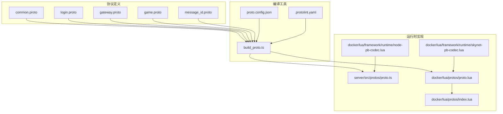
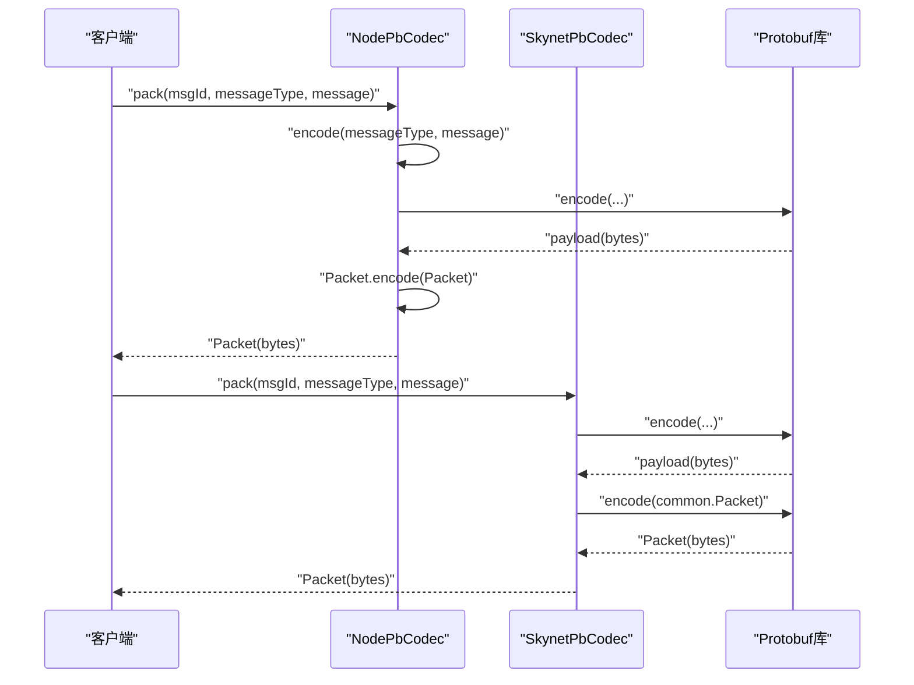
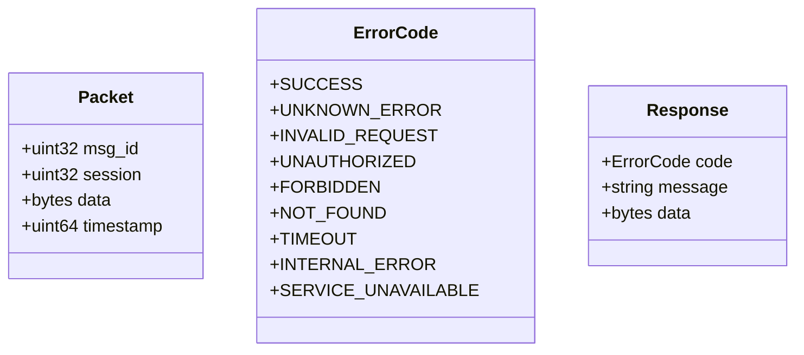
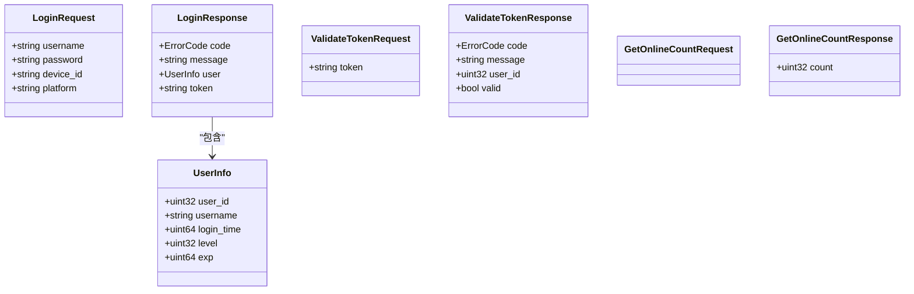
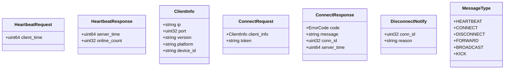
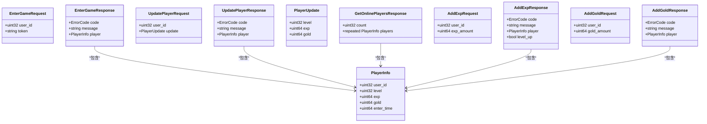
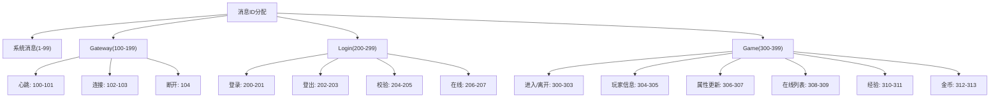
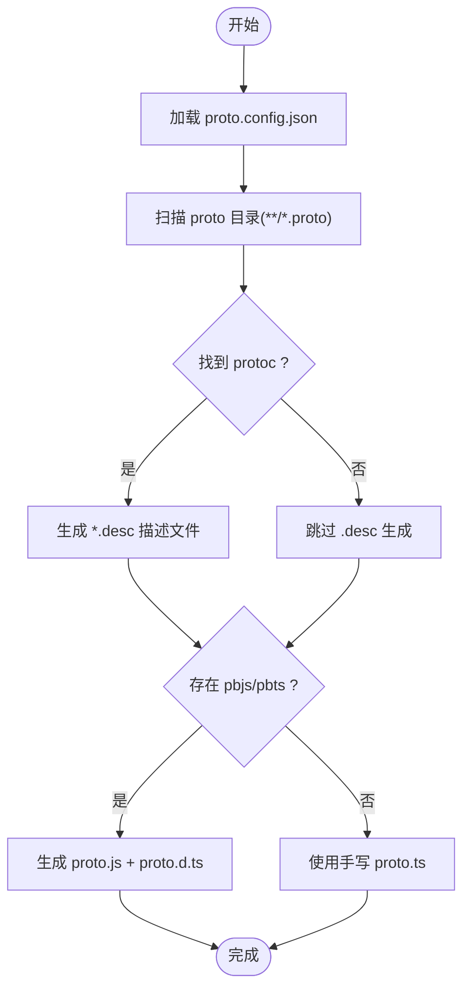
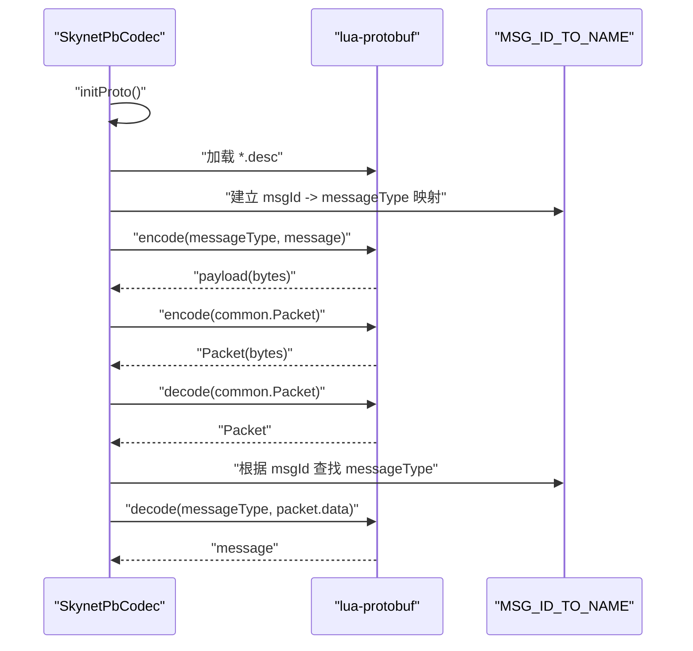
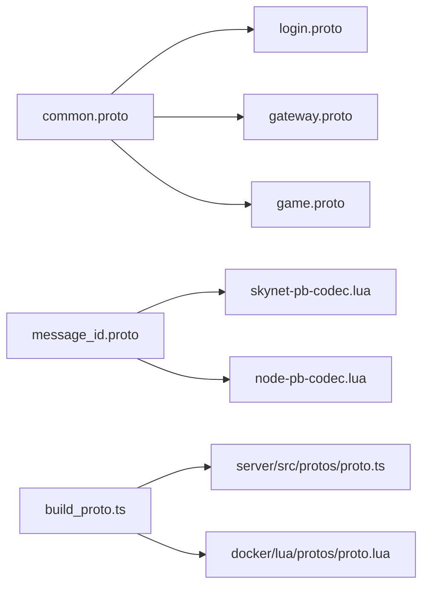

# 协议系统

<cite>
**本文引用的文件**
- [common.proto](file://protocols/proto/common.proto)
- [login.proto](file://protocols/proto/login.proto)
- [gateway.proto](file://protocols/proto/gateway.proto)
- [game.proto](file://protocols/proto/game.proto)
- [message_id.proto](file://protocols/proto/message_id.proto)
- [proto.config.json](file://protocols/proto.config.json)
- [build_proto.ts](file://protocols/scripts/build_proto.ts)
- [README.md](file://protocols/README.md)
- [.protolint.yaml](file://protocols/.protolint.yaml)
- [proto.ts](file://server/src/protos/proto.ts)
- [proto.lua](file://docker/lua/protos/proto.lua)
- [index.lua](file://docker/lua/protos/index.lua)
- [skynet-pb-codec.lua](file://docker/lua/framework/runtime/skynet-pb-codec.lua)
- [node-pb-codec.lua](file://docker/lua/framework/runtime/node-pb-codec.lua)
</cite>

## 目录
1. [简介](#简介)
2. [项目结构](#项目结构)
3. [核心组件](#核心组件)
4. [架构总览](#架构总览)
5. [详细组件分析](#详细组件分析)
6. [依赖关系分析](#依赖关系分析)
7. [性能考虑](#性能考虑)
8. [故障排查指南](#故障排查指南)
9. [结论](#结论)
10. [附录](#附录)

## 简介
本文件系统性地阐述协议系统的完整技术方案，涵盖基于 Protobuf 的消息序列化机制、协议定义与编译流程、运行时使用方式、消息 ID 映射与版本管理策略，并对各协议文件的功能进行逐项解析。文档同时提供编译配置说明、自定义选项、使用示例与错误处理建议，帮助开发者在多语言（TypeScript/Lua）环境下高效、安全地维护与扩展协议。

## 项目结构
协议系统由“协议定义 + 编译工具 + 运行时编码器 + 多语言实现”构成，核心目录与职责如下：
- protocols/proto：存放 .proto 协议定义文件，含通用消息、登录、网关、游戏与消息 ID 映射。
- protocols/scripts：协议编译脚本，负责扫描 proto、生成 Lua 描述文件与 TypeScript 代码。
- protocols/proto.config.json：编译配置，指定输入输出路径。
- server/src/protos：TypeScript 运行时简化实现（JSON 序列化），便于 Node 环境调试与开发。
- docker/lua/protos：Lua 运行时简化实现与打包入口。
- docker/lua/framework/runtime：Skynet 与 Node 的 Protobuf 编解码器，负责消息打包/解包与协议加载。

**图表来源**
- [common.proto:1-39](file://protocols/proto/common.proto#L1-L39)
- [login.proto:1-83](file://protocols/proto/login.proto#L1-L83)
- [gateway.proto:1-70](file://protocols/proto/gateway.proto#L1-L70)
- [game.proto:1-141](file://protocols/proto/game.proto#L1-L141)
- [message_id.proto:1-48](file://protocols/proto/message_id.proto#L1-L48)
- [build_proto.ts:1-245](file://protocols/scripts/build_proto.ts#L1-L245)
- [proto.config.json:1-15](file://protocols/proto.config.json#L1-L15)
- [.protolint.yaml:1-45](file://protocols/.protolint.yaml#L1-L45)
- [proto.ts:1-333](file://server/src/protos/proto.ts#L1-L333)
- [proto.lua:1-199](file://docker/lua/protos/proto.lua#L1-L199)
- [index.lua:1-14](file://docker/lua/protos/index.lua#L1-L14)
- [skynet-pb-codec.lua:1-164](file://docker/lua/framework/runtime/skynet-pb-codec.lua#L1-L164)
- [node-pb-codec.lua:1-185](file://docker/lua/framework/runtime/node-pb-codec.lua#L1-L185)

**章节来源**
- [README.md:1-176](file://protocols/README.md#L1-L176)
- [proto.config.json:1-15](file://protocols/proto.config.json#L1-L15)

## 核心组件
- 通用消息与错误码：统一的 Packet 包装结构与 ErrorCode 枚举，确保所有消息以一致格式传输与返回。
- 服务协议：login、gateway、game 分别覆盖认证、连接与心跳、游戏业务。
- 消息 ID 映射：集中定义消息编号区间与枚举，支撑路由与识别。
- 编译脚本：自动扫描 proto、生成 Lua 描述文件与 TypeScript 代码，支持跨平台。
- 运行时编码器：Skynet 与 Node 环境下的 Protobuf 编解码器，负责消息打包/解包与协议加载。

**章节来源**
- [common.proto:1-39](file://protocols/proto/common.proto#L1-L39)
- [login.proto:1-83](file://protocols/proto/login.proto#L1-L83)
- [gateway.proto:1-70](file://protocols/proto/gateway.proto#L1-L70)
- [game.proto:1-141](file://protocols/proto/game.proto#L1-L141)
- [message_id.proto:1-48](file://protocols/proto/message_id.proto#L1-L48)
- [build_proto.ts:1-245](file://protocols/scripts/build_proto.ts#L1-L245)
- [skynet-pb-codec.lua:1-164](file://docker/lua/framework/runtime/skynet-pb-codec.lua#L1-L164)
- [node-pb-codec.lua:1-185](file://docker/lua/framework/runtime/node-pb-codec.lua#L1-L185)

## 架构总览
协议系统采用“定义即契约”的设计：先定义 .proto，再通过编译脚本生成多语言代码；运行时根据消息 ID 将二进制数据映射到具体消息类型，完成打包与解包。

**图表来源**
- [node-pb-codec.lua:160-183](file://docker/lua/framework/runtime/node-pb-codec.lua#L160-L183)
- [skynet-pb-codec.lua:127-161](file://docker/lua/framework/runtime/skynet-pb-codec.lua#L127-L161)

## 详细组件分析

### 通用消息与错误码（common.proto）
- Packet：统一消息包装，包含 msg_id、session、data、timestamp，所有消息均以此结构承载。
- ErrorCode：统一错误码集合，便于前后端一致处理。
- Response：通用响应结构，包含 code、message、data。

**图表来源**
- [common.proto:9-38](file://protocols/proto/common.proto#L9-L38)

**章节来源**
- [common.proto:1-39](file://protocols/proto/common.proto#L1-L39)

### 登录协议（login.proto）
- LoginRequest/LoginResponse：用户名、密码、设备信息与登录 token。
- UserInfo：用户基础信息。
- LogoutRequest/LogoutResponse：登出流程。
- ValidateTokenRequest/ValidateTokenResponse：Token 校验与有效性判断。
- GetOnlineCountRequest/GetOnlineCountResponse：获取在线人数。

**图表来源**
- [login.proto:10-82](file://protocols/proto/login.proto#L10-L82)

**章节来源**
- [login.proto:1-83](file://protocols/proto/login.proto#L1-L83)

### 网关协议（gateway.proto）
- HeartbeatRequest/HeartbeatResponse：心跳请求与响应，携带时间戳与在线人数。
- ClientInfo：客户端连接信息（IP、端口、版本、平台、设备 ID）。
- ConnectRequest/ConnectResponse：连接请求与响应，支持可选 token。
- DisconnectNotify：断开连接通知。
- MessageType：消息类型枚举（心跳、连接、断开、转发、广播、踢出）。

**图表来源**
- [gateway.proto:10-69](file://protocols/proto/gateway.proto#L10-L69)

**章节来源**
- [gateway.proto:1-70](file://protocols/proto/gateway.proto#L1-L70)

### 游戏协议（game.proto）
- PlayerInfo：玩家基础属性（等级、经验、金币、进入时间）。
- EnterGameRequest/EnterGameResponse：进入游戏流程。
- LeaveGameRequest/LeaveGameResponse：离开游戏流程。
- GetPlayerInfoRequest/GetPlayerInfoResponse：查询玩家信息。
- PlayerUpdate：属性增量更新（等级、经验、金币）。
- UpdatePlayerRequest/UpdatePlayerResponse：更新玩家信息。
- GetOnlinePlayersRequest/GetOnlinePlayersResponse：在线玩家列表。
- AddExpRequest/AddExpResponse：增加经验与升级判定。
- AddGoldRequest/AddGoldResponse：增加金币。

**图表来源**
- [game.proto:10-140](file://protocols/proto/game.proto#L10-L140)

**章节来源**
- [game.proto:1-141](file://protocols/proto/game.proto#L1-L141)

### 消息 ID 映射（message_id.proto）
- 系统消息：1-99（示例：PING/PONG）。
- Gateway：100-199（心跳、连接、断开等）。
- Login：200-299（登录、登出、Token 校验、在线人数等）。
- Game：300-399（进入/离开游戏、玩家信息、属性更新、在线玩家、经验/金币等）。

**图表来源**
- [message_id.proto:9-47](file://protocols/proto/message_id.proto#L9-L47)

**章节来源**
- [message_id.proto:1-48](file://protocols/proto/message_id.proto#L1-L48)

### 编译配置与脚本（build_proto.ts）
- 配置文件 proto.config.json：定义 proto 输入目录与 TypeScript/Lua 输出目录。
- 编译脚本 build_proto.ts：扫描 proto、生成 Lua 描述文件（*.desc）、生成 TypeScript 静态模块与类型定义，支持跨平台（系统 protoc、本地 bin、node_modules）。
- .protolint.yaml：协议风格与注释规范，确保一致性与可读性。

**图表来源**
- [build_proto.ts:57-241](file://protocols/scripts/build_proto.ts#L57-L241)
- [proto.config.json:5-14](file://protocols/proto.config.json#L5-L14)
- [.protolint.yaml:4-44](file://protocols/.protolint.yaml#L4-L44)

**章节来源**
- [build_proto.ts:1-245](file://protocols/scripts/build_proto.ts#L1-L245)
- [proto.config.json:1-15](file://protocols/proto.config.json#L1-L15)
- [.protolint.yaml:1-45](file://protocols/.protolint.yaml#L1-L45)

### 运行时使用（TypeScript 与 Lua）
- TypeScript（server/src/protos/proto.ts）：提供简化版 proto 对象，包含 create/encode/decode 方法，便于 Node 环境直接使用。
- Lua（docker/lua/protos/proto.lua + index.lua）：提供等价实现，配合 lualib_bundle 使用。
- Skynet/Node 编解码器（skynet-pb-codec.lua、node-pb-codec.lua）：负责协议加载、消息打包/解包、消息类型与 ID 的双向映射。

**图表来源**
- [skynet-pb-codec.lua:59-161](file://docker/lua/framework/runtime/skynet-pb-codec.lua#L59-L161)
- [node-pb-codec.lua:61-183](file://docker/lua/framework/runtime/node-pb-codec.lua#L61-L183)

**章节来源**
- [proto.ts:1-333](file://server/src/protos/proto.ts#L1-L333)
- [proto.lua:1-199](file://docker/lua/protos/proto.lua#L1-L199)
- [index.lua:1-14](file://docker/lua/protos/index.lua#L1-L14)
- [skynet-pb-codec.lua:1-164](file://docker/lua/framework/runtime/skynet-pb-codec.lua#L1-L164)
- [node-pb-codec.lua:1-185](file://docker/lua/framework/runtime/node-pb-codec.lua#L1-L185)

## 依赖关系分析
- 协议文件间依赖：login、gateway、game 均 import common.proto；message_id.proto 提供全局消息 ID。
- 编译阶段依赖：build_proto.ts 依赖 protoc 与 protobufjs（pbjs/pbts）。
- 运行时依赖：Skynet 环境依赖 lua-protobuf；Node 环境依赖 server/src/protos/proto.ts 或 docker/lua/protos/proto.lua。

**图表来源**
- [login.proto](file://protocols/proto/login.proto#L5)
- [gateway.proto](file://protocols/proto/gateway.proto#L5)
- [game.proto](file://protocols/proto/game.proto#L5)
- [message_id.proto](file://protocols/proto/message_id.proto#L3)
- [build_proto.ts:130-226](file://protocols/scripts/build_proto.ts#L130-L226)
- [skynet-pb-codec.lua:26-50](file://docker/lua/framework/runtime/skynet-pb-codec.lua#L26-L50)
- [node-pb-codec.lua:20-52](file://docker/lua/framework/runtime/node-pb-codec.lua#L20-L52)

**章节来源**
- [login.proto:1-83](file://protocols/proto/login.proto#L1-L83)
- [gateway.proto:1-70](file://protocols/proto/gateway.proto#L1-L70)
- [game.proto:1-141](file://protocols/proto/game.proto#L1-L141)
- [message_id.proto:1-48](file://protocols/proto/message_id.proto#L1-L48)
- [build_proto.ts:1-245](file://protocols/scripts/build_proto.ts#L1-L245)

## 性能考虑
- 序列化开销：Protobuf 二进制序列化相比 JSON 更小更快；在高并发场景优先使用。
- 消息大小：合理拆分大消息，避免单包过大导致网络拥塞与延迟。
- 字段复用：遵循 Protobuf 最佳实践，不删除字段、不变更编号，新增字段使用新编号。
- 编解码器选择：Skynet 环境使用 lua-protobuf；Node 环境可使用简化实现或 protobufjs。
- 缓存与批量：对频繁请求进行缓存与批量处理，减少序列化次数。

## 故障排查指南
- 编译失败
  - 症状：找不到 protoc 或 pbjs/pbts。
  - 处理：确认已安装 protoc 并加入 PATH；或使用本地 bin 与 node_modules；确保安装 protobufjs 相关工具。
- 运行时错误
  - 症状：Unknown msgId 或 Unknown message type。
  - 处理：检查消息 ID 映射表是否与编译产物一致；确认协议文件已正确加载。
- 数据不一致
  - 症状：字段缺失或类型不匹配。
  - 处理：遵循向后兼容规则，不要删除/变更字段编号；新增字段使用 optional/repeated。
- 环境差异
  - 症状：Node 与 Skynet 行为不一致。
  - 处理：统一使用编解码器封装，确保消息打包/解包逻辑一致。

**章节来源**
- [build_proto.ts:107-127](file://protocols/scripts/build_proto.ts#L107-L127)
- [skynet-pb-codec.lua:142-161](file://docker/lua/framework/runtime/skynet-pb-codec.lua#L142-L161)
- [node-pb-codec.lua:169-183](file://docker/lua/framework/runtime/node-pb-codec.lua#L169-L183)

## 结论
本协议系统以 Protobuf 为核心，结合编译脚本与多语言运行时实现，形成从定义到运行的完整闭环。通过集中式消息 ID 映射与严格的版本兼容策略，系统具备良好的扩展性与稳定性。建议在新增或变更协议时严格遵循命名规范与兼容性原则，并通过 .protolint.yaml 与编译脚本保障质量与一致性。

## 附录

### 协议版本管理最佳实践
- 向前兼容：新增字段使用新编号，保持旧字段不变。
- 向后兼容：不删除字段、不变更编号；使用 optional/repeated。
- 版本号：可在 Packet 中携带协议版本字段，便于灰度与回滚。
- 发布策略：先发布服务端，再发布客户端；或通过双版本过渡期。

**章节来源**
- [README.md:152-156](file://protocols/README.md#L152-L156)

### 协议编译配置与自定义选项
- proto_dirs：指定 proto 源文件目录。
- output_lua：Lua 描述文件输出目录。
- output_ts：TypeScript 代码输出目录。
- 自定义选项：可通过修改 build_proto.ts 与 .protolint.yaml 增强规则与输出行为。

**章节来源**
- [proto.config.json:5-14](file://protocols/proto.config.json#L5-L14)
- [.protolint.yaml:4-44](file://protocols/.protolint.yaml#L4-L44)

### 实际使用示例与错误处理
- TypeScript 示例：导入 proto.ts，创建消息、序列化、反序列化，使用 MessageId 与 MessageTypes。
- Lua 示例：加载 desc 文件，使用 pb.encode/pb.decode，结合编解码器进行打包/解包。
- 错误处理：捕获 Unknown msgId、Unknown message type、编码/解码失败等异常，记录日志并返回通用错误码。

**章节来源**
- [README.md:89-138](file://protocols/README.md#L89-L138)
- [proto.ts:154-331](file://server/src/protos/proto.ts#L154-L331)
- [proto.lua:34-158](file://docker/lua/protos/proto.lua#L34-L158)
- [skynet-pb-codec.lua:91-161](file://docker/lua/framework/runtime/skynet-pb-codec.lua#L91-L161)
- [node-pb-codec.lua:76-183](file://docker/lua/framework/runtime/node-pb-codec.lua#L76-L183)