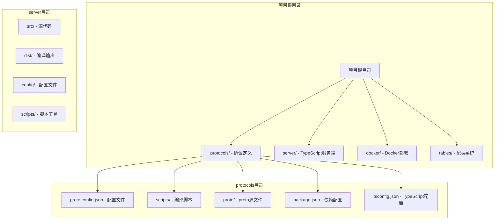
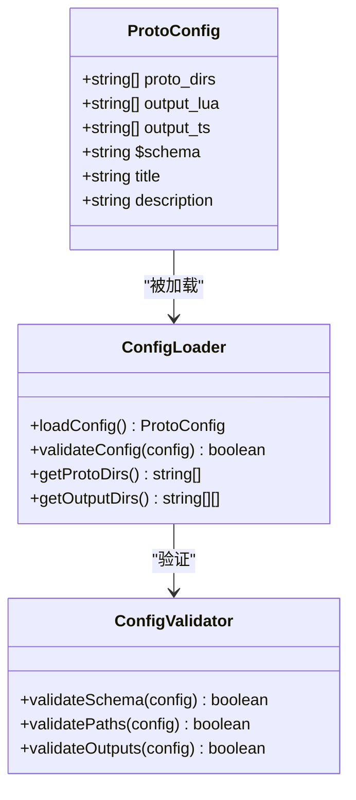
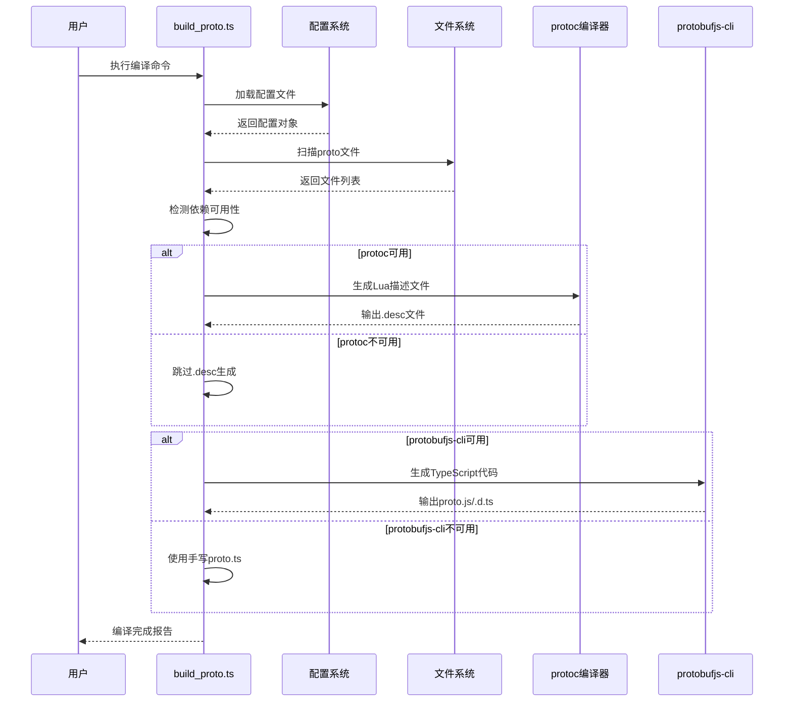
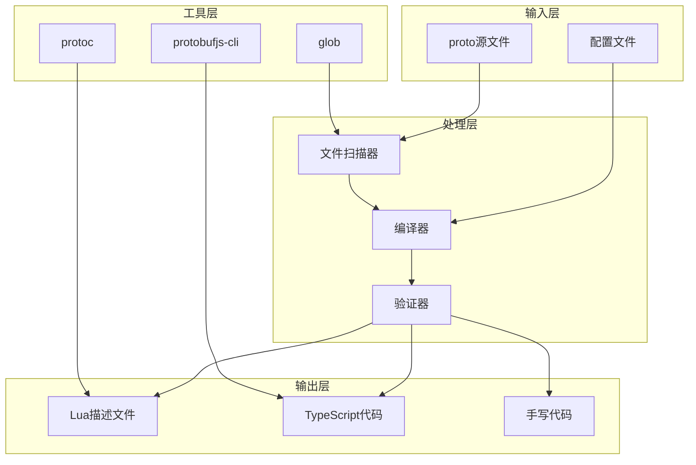
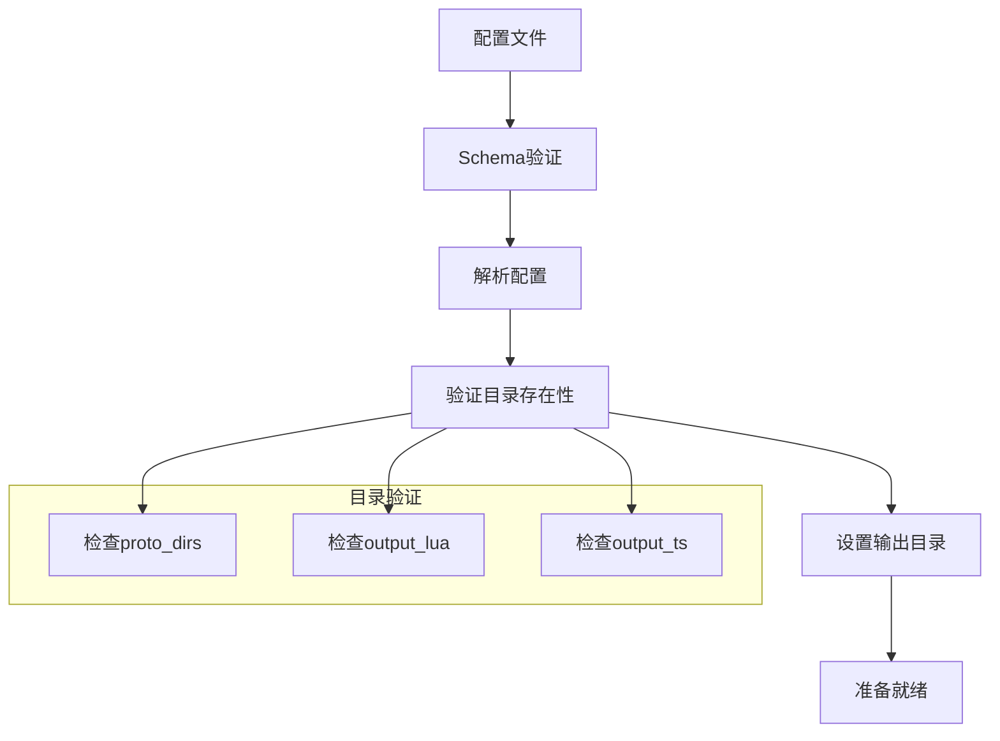
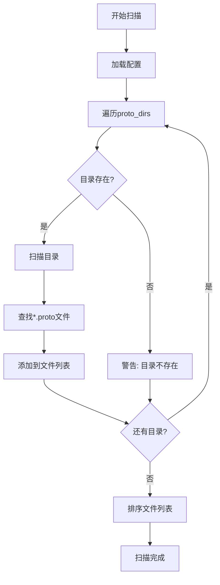
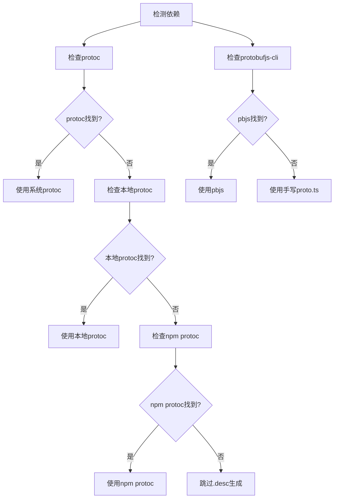
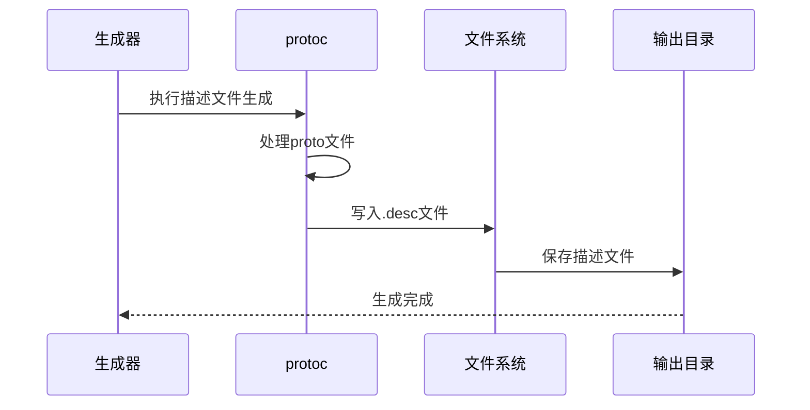
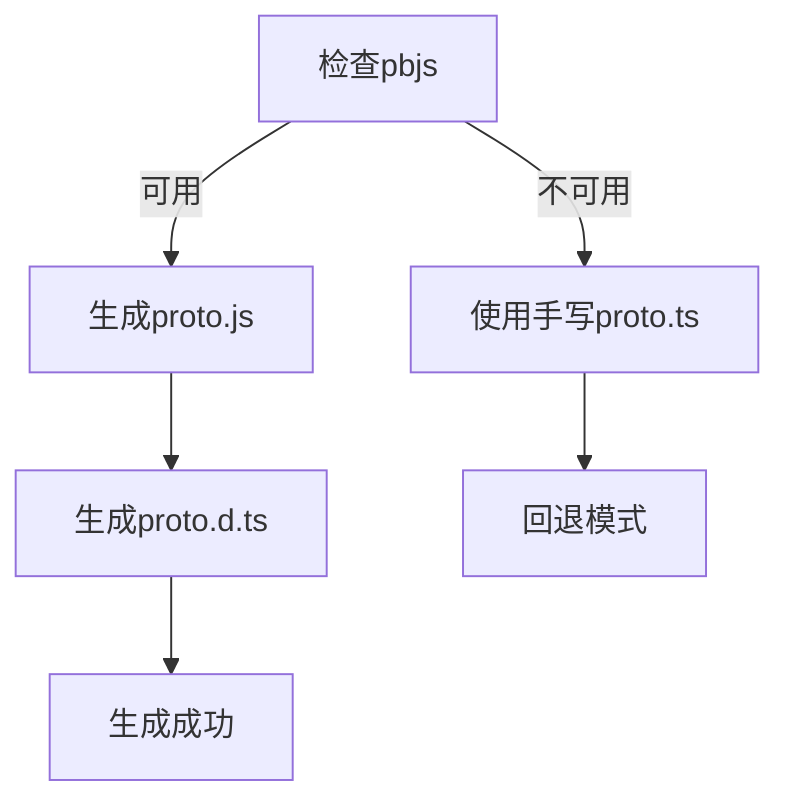
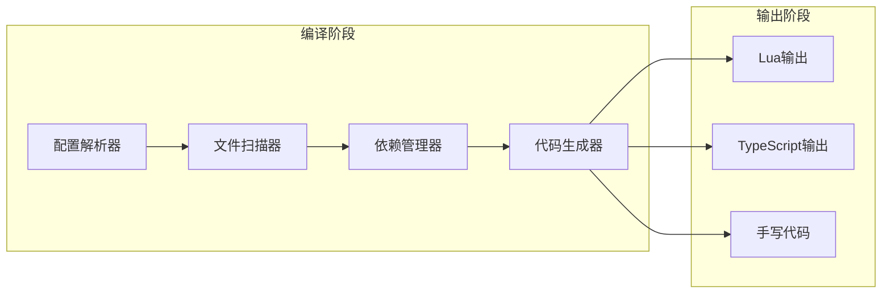

# 协议编译配置

<cite>
**本文档引用的文件**
- [proto.config.json](file://protocols/proto.config.json)
- [build_proto.ts](file://protocols/scripts/build_proto.ts)
- [package.json](file://protocols/package.json)
- [tsconfig.json](file://protocols/tsconfig.json)
- [README.md](file://protocols/README.md)
- [common.proto](file://protocols/proto/common.proto)
- [message_id.proto](file://protocols/proto/message_id.proto)
- [login.proto](file://protocols/proto/login.proto)
- [proto.ts](file://server/src/protos/proto.ts)
- [index.lua](file://docker/lua/protos/index.lua)
- [proto.lua](file://docker/lua/protos/proto.lua)
- [package.json](file://package.json)
- [package.json](file://server/package.json)
- [config.tslua](file://docker/skynet-runtime/config.tslua)
</cite>

## 目录
1. [简介](#简介)
2. [项目结构](#项目结构)
3. [核心组件](#核心组件)
4. [架构概览](#架构概览)
5. [详细组件分析](#详细组件分析)
6. [依赖关系分析](#依赖关系分析)
7. [性能考虑](#性能考虑)
8. [故障排除指南](#故障排除指南)
9. [结论](#结论)
10. [附录](#附录)

## 简介

本项目实现了TypeScript与Lua双端协议编译系统，基于Protocol Buffers标准，提供完整的跨语言通信解决方案。该系统支持自动发现proto文件、生成TypeScript和Lua代码，并具备完善的依赖管理和版本控制机制。

系统采用分层架构设计，包含协议定义层、编译脚本层、生成代码层和运行时适配层，确保TypeScript前端与Lua后端能够高效协作。

## 项目结构

项目采用多工作区架构，主要包含以下核心目录：



**图表来源**
- [package.json:6-10](file://package.json#L6-L10)
- [proto.config.json:1-15](file://protocols/proto.config.json#L1-L15)

**章节来源**
- [package.json:6-10](file://package.json#L6-L10)
- [README.md:76-87](file://protocols/README.md#L76-L87)

## 核心组件

### 配置管理系统

配置系统采用JSON Schema验证机制，确保配置文件的完整性和正确性：



**图表来源**
- [build_proto.ts:21-25](file://protocols/scripts/build_proto.ts#L21-L25)
- [proto.config.json:1-15](file://protocols/proto.config.json#L1-L15)

### 编译脚本引擎

编译脚本采用TypeScript实现，具备跨平台支持和智能依赖检测功能：



**图表来源**
- [build_proto.ts:57-245](file://protocols/scripts/build_proto.ts#L57-L245)

**章节来源**
- [build_proto.ts:1-245](file://protocols/scripts/build_proto.ts#L1-L245)
- [proto.config.json:1-15](file://protocols/proto.config.json#L1-L15)

## 架构概览

系统整体架构采用分层设计，确保各组件职责清晰、耦合度低：



**图表来源**
- [build_proto.ts:78-226](file://protocols/scripts/build_proto.ts#L78-L226)
- [package.json:18-26](file://protocols/package.json#L18-L26)

## 详细组件分析

### 配置文件解析器

配置文件采用严格的JSON Schema验证，确保配置的完整性和正确性：

#### 配置参数详解

| 参数名 | 类型 | 必需 | 默认值 | 描述 |
|--------|------|------|--------|------|
| `$schema` | string | 是 | - | JSON Schema定义，用于验证配置格式 |
| `title` | string | 是 | - | 配置文件标题 |
| `description` | string | 是 | - | 配置文件描述 |
| `proto_dirs` | string[] | 是 | - | proto源文件目录数组 |
| `output_lua` | string[] | 是 | - | Lua输出目录数组 |
| `output_ts` | string[] | 是 | - | TypeScript输出目录数组 |

#### 配置文件结构分析

配置文件采用分层组织方式，支持多个proto目录和输出目录：



**图表来源**
- [proto.config.json:1-15](file://protocols/proto.config.json#L1-L15)
- [build_proto.ts:62-70](file://protocols/scripts/build_proto.ts#L62-L70)

**章节来源**
- [proto.config.json:1-15](file://protocols/proto.config.json#L1-L15)

### 文件扫描器

文件扫描器负责自动发现和收集所有proto文件：

#### 扫描策略



**图表来源**
- [build_proto.ts:78-94](file://protocols/scripts/build_proto.ts#L78-L94)

#### 文件发现机制

系统支持递归扫描所有指定目录，使用glob模式匹配所有proto文件：

**章节来源**
- [build_proto.ts:78-94](file://protocols/scripts/build_proto.ts#L78-L94)

### 依赖管理器

依赖管理器负责检测和配置各种编译工具：

#### 依赖检测流程



**图表来源**
- [build_proto.ts:107-127](file://protocols/scripts/build_proto.ts#L107-L127)
- [build_proto.ts:176-188](file://protocols/scripts/build_proto.ts#L176-L188)

**章节来源**
- [build_proto.ts:107-127](file://protocols/scripts/build_proto.ts#L107-L127)
- [build_proto.ts:176-188](file://protocols/scripts/build_proto.ts#L176-L188)

### Lua代码生成器

Lua代码生成器负责将proto文件转换为Lua描述文件：

#### 生成流程



**图表来源**
- [build_proto.ts:129-160](file://protocols/scripts/build_proto.ts#L129-L160)

#### 输出格式

每个proto文件生成对应的`.desc`文件，文件命名规则为`{proto_name}_pb.desc`。

**章节来源**
- [build_proto.ts:129-160](file://protocols/scripts/build_proto.ts#L129-L160)

### TypeScript代码生成器

TypeScript代码生成器提供两种生成模式：

#### 自动代码生成模式

当protobufjs-cli可用时，使用pbjs和pbts生成完整的TypeScript代码：



**图表来源**
- [build_proto.ts:190-226](file://protocols/scripts/build_proto.ts#L190-L226)

#### 手写代码回退模式

当自动生成功能不可用时，系统使用预定义的手写proto.ts文件：

**章节来源**
- [build_proto.ts:190-226](file://protocols/scripts/build_proto.ts#L190-L226)
- [proto.ts:1-341](file://server/src/protos/proto.ts#L1-L341)

## 依赖关系分析

### 外部依赖

系统依赖以下外部工具和库：

```mermaid
graph TB
subgraph "编译工具"
Protoc[protoc v33.5+]
Pbjs[protobufjs-cli]
Glob[glob]
Tsx[tsx]
end
subgraph "运行时库"
NodeTypes[@types/node]
Typescript[typescript]
end
subgraph "项目内部"
BuildScript[build_proto.ts]
ConfigFile[proto.config.json]
ProtoFiles[proto源文件]
end
BuildScript --> Protoc
BuildScript --> Pbjs
BuildScript --> Glob
BuildScript --> Tsx
BuildScript --> NodeTypes
BuildScript --> Typescript
ConfigFile --> ProtoFiles
```

**图表来源**
- [package.json:18-26](file://protocols/package.json#L18-L26)
- [README.md:165-169](file://protocols/README.md#L165-L169)

### 内部依赖关系



**图表来源**
- [build_proto.ts:57-245](file://protocols/scripts/build_proto.ts#L57-L245)

**章节来源**
- [package.json:18-26](file://protocols/package.json#L18-L26)
- [build_proto.ts:57-245](file://protocols/scripts/build_proto.ts#L57-L245)

## 性能考虑

### 编译性能优化

1. **并行处理**: 系统支持同时处理多个proto文件，提高编译效率
2. **缓存机制**: 利用TypeScript的增量编译特性，减少重复编译时间
3. **智能检测**: 自动检测依赖可用性，避免不必要的工具调用
4. **增量更新**: 只对变更的proto文件重新生成代码

### 内存使用优化

- 使用流式处理方式处理大型proto文件
- 及时释放不再使用的内存
- 优化文件读取和写入操作

### 磁盘I/O优化

- 批量文件操作减少磁盘访问次数
- 合理的文件组织结构
- 避免重复的文件写入操作

## 故障排除指南

### 常见问题及解决方案

#### 1. protoc未找到

**问题症状**: 编译过程中出现protoc相关错误

**解决方案**:
- 确保protoc已正确安装并添加到PATH环境变量
- 或者将protoc.exe放置在protocols/bin目录下
- 或者通过npm安装protobuf工具链

**章节来源**
- [build_proto.ts:107-127](file://protocols/scripts/build_proto.ts#L107-L127)

#### 2. protobufjs-cli不可用

**问题症状**: TypeScript代码生成失败，使用手写proto.ts

**解决方案**:
- 安装protobufjs-cli: `npm install protobufjs-cli`
- 或者确保全局安装了pbjs工具
- 检查npm包的安装状态

**章节来源**
- [build_proto.ts:176-188](file://protocols/scripts/build_proto.ts#L176-L188)

#### 3. proto文件扫描失败

**问题症状**: 未找到任何proto文件

**解决方案**:
- 检查proto.config.json中的proto_dirs配置
- 确认proto目录结构正确
- 验证proto文件扩展名是否为".proto"

**章节来源**
- [build_proto.ts:78-94](file://protocols/scripts/build_proto.ts#L78-L94)

#### 4. 输出目录权限问题

**问题症状**: 无法写入生成的文件

**解决方案**:
- 检查输出目录的写入权限
- 确保目标目录存在且可访问
- 以管理员权限运行编译脚本

**章节来源**
- [build_proto.ts:135-172](file://protocols/scripts/build_proto.ts#L135-L172)

### 调试技巧

1. **启用详细日志**: 在编译脚本中添加调试输出
2. **检查文件路径**: 验证所有文件路径的正确性
3. **验证配置格式**: 使用JSON Schema验证配置文件
4. **测试工具链**: 单独测试每个依赖工具的可用性

## 结论

本协议编译配置系统提供了完整的TypeScript与Lua双端协议解决方案。通过精心设计的配置管理、智能的依赖检测和高效的代码生成机制，系统能够满足复杂项目的通信需求。

系统的主要优势包括：
- 跨平台兼容性
- 自动化程度高
- 错误处理完善
- 性能优化良好
- 易于维护和扩展

未来可以考虑的功能增强：
- 支持更多输出格式
- 增强错误诊断能力
- 优化编译性能
- 提供图形化配置界面

## 附录

### 配置文件示例

完整的proto.config.json配置示例如下：

```json
{
  "$schema": "https://json-schema.org/draft/2020-12/schema",
  "title": "Protocol Buffers 编译配置",
  "description": "配置 proto 源文件目录和输出目录",
  "proto_dirs": ["proto"],
  "output_lua": ["../server/dist/lua/protos"],
  "output_ts": ["../server/src/protos"]
}
```

### 支持的输出格式

系统当前支持以下输出格式：
- **Lua描述文件**: `.desc`文件，用于Lua运行时
- **TypeScript代码**: `proto.js`和`proto.d.ts`文件
- **手写回退代码**: `proto.ts`文件

### 版本兼容性

- **Node.js**: >= 16.0.0
- **TypeScript**: >= 5.3.0
- **protobufjs-cli**: >= 2.0.0
- **protoc**: >= 33.5

### 最佳实践

1. **保持配置简洁**: 只包含必要的配置项
2. **定期清理输出**: 定期清理旧的生成文件
3. **版本控制**: 将proto文件纳入版本控制
4. **测试验证**: 编译后进行功能测试
5. **文档更新**: 更新相关文档以反映配置变更