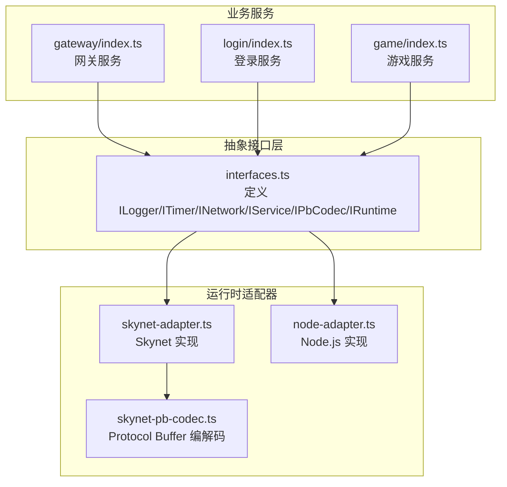
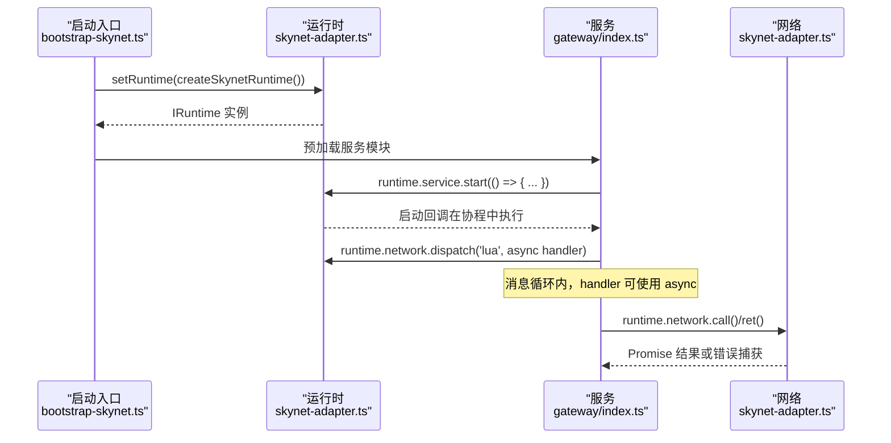
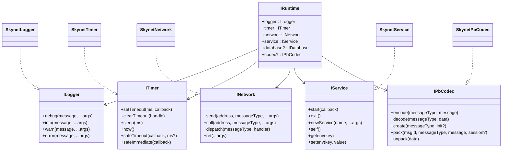
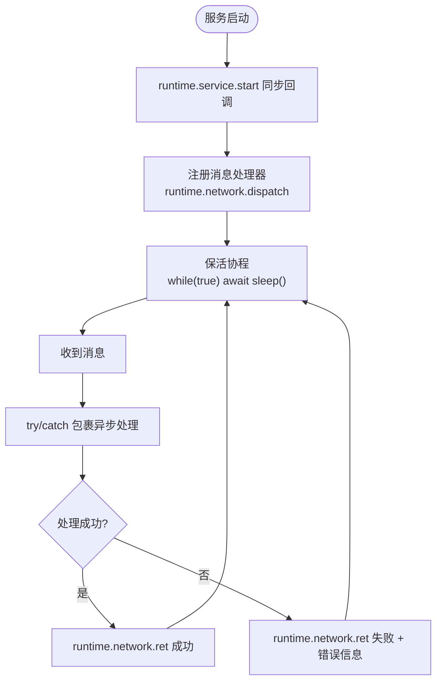
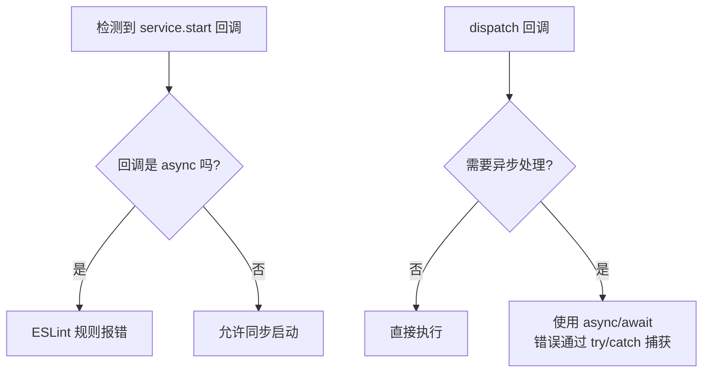
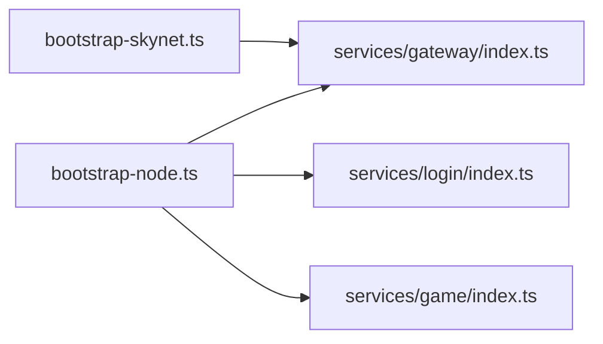
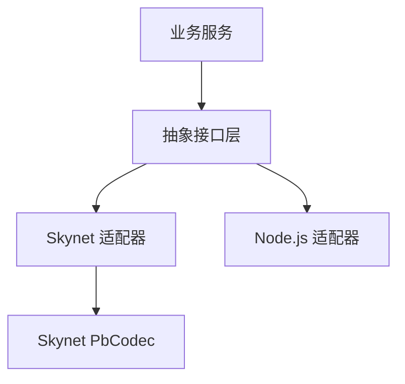

# 代码编写规范

<cite>
**本文档引用的文件**
- [TS-Skynet 异步编程规范.md](file://docs/TS-Skynet 异步编程规范.md)
- [interfaces.ts](file://server/src/framework/core/interfaces.ts)
- [skynet-adapter.ts](file://server/src/framework/runtime/skynet-adapter.ts)
- [node-adapter.ts](file://server/src/framework/runtime/node-adapter.ts)
- [skynet-pb-codec.ts](file://server/src/framework/runtime/skynet-pb-codec.ts)
- [index.ts（游戏服务）](file://server/src/app/services/game/index.ts)
- [index.ts（网关服务）](file://server/src/app/services/gateway/index.ts)
- [index.ts（登录服务）](file://server/src/app/services/login/index.ts)
- [bootstrap-node.ts](file://server/src/app/bootstrap-node.ts)
- [bootstrap-skynet.ts](file://server/src/app/bootstrap-skynet.ts)
- [.eslintrc.cjs](file://server/.eslintrc.cjs)
- [eslint.config.mjs](file://server/eslint.config.mjs)
- [no-async-in-service-start.js](file://server/eslint/rules/no-async-in-service-start.js)
- [package.json](file://server/package.json)
</cite>

## 目录
1. [简介](#简介)
2. [项目结构](#项目结构)
3. [核心组件](#核心组件)
4. [架构总览](#架构总览)
5. [详细组件分析](#详细组件分析)
6. [依赖关系分析](#依赖关系分析)
7. [性能考虑](#性能考虑)
8. [故障排查指南](#故障排查指南)
9. [结论](#结论)
10. [附录](#附录)

## 简介
本规范旨在为基于 TypeScriptToLua（TSTL）在 Skynet 环境运行的混合型游戏服务器提供一套完整的代码编写标准与最佳实践。内容涵盖：
- TypeScript 编码规范（命名、格式、注释）
- 抽象接口层的使用与约束
- 服务开发标准模板与模式（初始化、消息处理、错误处理）
- 异步编程最佳实践（async/await、错误传播、超时处理）
- 代码组织结构、模块导入规范、类型定义最佳实践
- 实际示例与反面案例对比

## 项目结构
项目采用“抽象接口层 + 运行时适配器 + 业务服务”的分层架构：
- 抽象接口层：定义 ILogger、ITimer、INetwork、IService、IPbCodec、IRuntime 等接口，业务代码只依赖接口，不直接依赖底层 API
- 运行时适配器：分别实现 Skynet 与 Node.js 的具体运行时，负责将接口映射到底层能力
- 业务服务：各领域服务（网关、登录、游戏）遵循统一模板，使用 runtime 抽象层进行交互

**图表来源**
- [interfaces.ts:1-226](file://server/src/framework/core/interfaces.ts#L1-L226)
- [skynet-adapter.ts:1-221](file://server/src/framework/runtime/skynet-adapter.ts#L1-L221)
- [node-adapter.ts:1-194](file://server/src/framework/runtime/node-adapter.ts#L1-L194)
- [skynet-pb-codec.ts:1-184](file://server/src/framework/runtime/skynet-pb-codec.ts#L1-L184)
- [index.ts（网关服务）:1-206](file://server/src/app/services/gateway/index.ts#L1-L206)
- [index.ts（登录服务）:1-154](file://server/src/app/services/login/index.ts#L1-L154)
- [index.ts（游戏服务）:1-136](file://server/src/app/services/game/index.ts#L1-L136)

**章节来源**
- [interfaces.ts:1-226](file://server/src/framework/core/interfaces.ts#L1-L226)
- [skynet-adapter.ts:1-221](file://server/src/framework/runtime/skynet-adapter.ts#L1-L221)
- [node-adapter.ts:1-194](file://server/src/framework/runtime/node-adapter.ts#L1-L194)
- [skynet-pb-codec.ts:1-184](file://server/src/framework/runtime/skynet-pb-codec.ts#L1-L184)
- [index.ts（网关服务）:1-206](file://server/src/app/services/gateway/index.ts#L1-L206)
- [index.ts（登录服务）:1-154](file://server/src/app/services/login/index.ts#L1-L154)
- [index.ts（游戏服务）:1-136](file://server/src/app/services/game/index.ts#L1-L136)

## 核心组件
- 抽象接口层：统一日志、定时器、网络、服务、数据库、协议编解码等能力，业务代码仅依赖接口
- 运行时适配器：Skynet 与 Node.js 的具体实现，屏蔽平台差异
- 服务模板：统一的启动、消息分发、错误处理、保活协程模式

关键要点：
- 业务代码必须通过 runtime.* 访问能力，不得直接使用底层 API
- 服务启动回调必须同步完成；消息处理回调可在消息循环内使用 async
- 使用 async/await 替代 Promise.then 链式调用
- 使用 protobuf 编解码进行跨服务通信

**章节来源**
- [interfaces.ts:1-226](file://server/src/framework/core/interfaces.ts#L1-L226)
- [skynet-adapter.ts:1-221](file://server/src/framework/runtime/skynet-adapter.ts#L1-L221)
- [node-adapter.ts:1-194](file://server/src/framework/runtime/node-adapter.ts#L1-L194)
- [index.ts（网关服务）:169-206](file://server/src/app/services/gateway/index.ts#L169-L206)
- [index.ts（登录服务）:123-154](file://server/src/app/services/login/index.ts#L123-L154)
- [index.ts（游戏服务）:108-136](file://server/src/app/services/game/index.ts#L108-L136)

## 架构总览
下图展示了服务启动、消息分发与错误处理的关键流程。

**图表来源**
- [bootstrap-skynet.ts:1-20](file://server/src/app/bootstrap-skynet.ts#L1-L20)
- [skynet-adapter.ts:132-150](file://server/src/framework/runtime/skynet-adapter.ts#L132-L150)
- [index.ts（网关服务）:170-193](file://server/src/app/services/gateway/index.ts#L170-L193)

**章节来源**
- [bootstrap-skynet.ts:1-20](file://server/src/app/bootstrap-skynet.ts#L1-L20)
- [skynet-adapter.ts:132-150](file://server/src/framework/runtime/skynet-adapter.ts#L132-L150)
- [index.ts（网关服务）:170-193](file://server/src/app/services/gateway/index.ts#L170-L193)

## 详细组件分析

### 抽象接口层与运行时适配器
- 接口职责清晰：日志、定时器、网络、服务、数据库、编解码
- 适配器实现：Skynet 与 Node.js 的具体实现，保证业务代码可移植
- 编解码器：基于 lua-protobuf 的 Pack/Unpack、Encode/Decode

**图表来源**
- [interfaces.ts:9-196](file://server/src/framework/core/interfaces.ts#L9-L196)
- [skynet-adapter.ts:28-221](file://server/src/framework/runtime/skynet-adapter.ts#L28-L221)
- [skynet-pb-codec.ts:65-184](file://server/src/framework/runtime/skynet-pb-codec.ts#L65-L184)

**章节来源**
- [interfaces.ts:1-226](file://server/src/framework/core/interfaces.ts#L1-L226)
- [skynet-adapter.ts:1-221](file://server/src/framework/runtime/skynet-adapter.ts#L1-L221)
- [skynet-pb-codec.ts:1-184](file://server/src/framework/runtime/skynet-pb-codec.ts#L1-L184)

### 服务开发标准模板与模式
- 服务启动：runtime.service.start 回调必须同步完成；内部可启动异步流程
- 消息处理：runtime.network.dispatch 注册的 handler 在消息循环内执行，可使用 async
- 错误处理：try/catch 包裹异步逻辑，统一通过 runtime.network.ret 返回
- 保活协程：使用 runtime.timer.sleep 构建无限循环，维持服务活跃

**图表来源**
- [index.ts（网关服务）:170-206](file://server/src/app/services/gateway/index.ts#L170-L206)
- [index.ts（登录服务）:123-154](file://server/src/app/services/login/index.ts#L123-L154)
- [index.ts（游戏服务）:108-136](file://server/src/app/services/game/index.ts#L108-L136)

**章节来源**
- [index.ts（网关服务）:1-206](file://server/src/app/services/gateway/index.ts#L1-L206)
- [index.ts（登录服务）:1-154](file://server/src/app/services/login/index.ts#L1-L154)
- [index.ts（游戏服务）:1-136](file://server/src/app/services/game/index.ts#L1-L136)

### 异步编程最佳实践
- 禁止使用 Promise.then 链式调用；改用 async/await
- 服务启动回调禁止使用 async；如需异步初始化，应在同步回调内启动异步流程并捕获错误
- dispatch 回调可使用 async；内部 await 会在协程中正确执行
- 使用 runtime.timer.safeTimeout/safeImmediate 替代 setTimeout/setImmediate，确保在协程中执行

**图表来源**
- [eslint.config.mjs:19-21](file://server/eslint.config.mjs#L19-L21)
- [no-async-in-service-start.js:1-81](file://server/eslint/rules/no-async-in-service-start.js#L1-L81)
- [skynet-adapter.ts:139-150](file://server/src/framework/runtime/skynet-adapter.ts#L139-L150)

**章节来源**
- [TS-Skynet 异步编程规范.md:1-1154](file://docs/TS-Skynet 异步编程规范.md#L1-L1154)
- [eslint.config.mjs:1-40](file://server/eslint.config.mjs#L1-L40)
- [no-async-in-service-start.js:1-81](file://server/eslint/rules/no-async-in-service-start.js#L1-L81)
- [skynet-adapter.ts:139-150](file://server/src/framework/runtime/skynet-adapter.ts#L139-L150)

### 代码组织结构与模块导入规范
- 业务服务按领域划分：gateway、login、game
- 服务入口文件遵循统一模板：导入 runtime、数据层、逻辑层、注册消息处理器、启动保活协程
- 启动入口：Skynet 通过 bootstrap-skynet.ts 初始化运行时并预加载服务；Node.js 通过 bootstrap-node.ts 初始化运行时并导入服务

**图表来源**
- [bootstrap-node.ts:1-22](file://server/src/app/bootstrap-node.ts#L1-L22)
- [bootstrap-skynet.ts:1-20](file://server/src/app/bootstrap-skynet.ts#L1-L20)
- [index.ts（网关服务）:1-206](file://server/src/app/services/gateway/index.ts#L1-L206)
- [index.ts（登录服务）:1-154](file://server/src/app/services/login/index.ts#L1-L154)
- [index.ts（游戏服务）:1-136](file://server/src/app/services/game/index.ts#L1-L136)

**章节来源**
- [bootstrap-node.ts:1-22](file://server/src/app/bootstrap-node.ts#L1-L22)
- [bootstrap-skynet.ts:1-20](file://server/src/app/bootstrap-skynet.ts#L1-L20)
- [index.ts（网关服务）:1-206](file://server/src/app/services/gateway/index.ts#L1-L206)
- [index.ts（登录服务）:1-154](file://server/src/app/services/login/index.ts#L1-L154)
- [index.ts（游戏服务）:1-136](file://server/src/app/services/game/index.ts#L1-L136)

### 类型定义最佳实践
- 使用接口定义能力边界，避免直接依赖具体实现
- 通过 setRuntime 注入运行时，保证可替换性
- 在 Node.js 环境下，可通过 createNodeRuntime 进行测试与开发验证

**章节来源**
- [interfaces.ts:216-226](file://server/src/framework/core/interfaces.ts#L216-L226)
- [node-adapter.ts:177-194](file://server/src/framework/runtime/node-adapter.ts#L177-L194)

## 依赖关系分析
- 业务服务依赖抽象接口层，不直接依赖 Skynet/Node.js API
- 运行时适配器实现接口，屏蔽平台差异
- 编解码器依赖 lua-protobuf，提供跨服务通信能力

**图表来源**
- [interfaces.ts:1-226](file://server/src/framework/core/interfaces.ts#L1-L226)
- [skynet-adapter.ts:1-221](file://server/src/framework/runtime/skynet-adapter.ts#L1-L221)
- [node-adapter.ts:1-194](file://server/src/framework/runtime/node-adapter.ts#L1-L194)
- [skynet-pb-codec.ts:1-184](file://server/src/framework/runtime/skynet-pb-codec.ts#L1-L184)

**章节来源**
- [interfaces.ts:1-226](file://server/src/framework/core/interfaces.ts#L1-L226)
- [skynet-adapter.ts:1-221](file://server/src/framework/runtime/skynet-adapter.ts#L1-L221)
- [node-adapter.ts:1-194](file://server/src/framework/runtime/node-adapter.ts#L1-L194)
- [skynet-pb-codec.ts:1-184](file://server/src/framework/runtime/skynet-pb-codec.ts#L1-L184)

## 性能考虑
- 避免在 service.start 中进行耗时操作；如需初始化，应使用异步流程并在同步回调中启动
- 使用 runtime.timer.safeTimeout 替代频繁的 setTimeout，减少协程创建开销
- protobuf 编解码在 Skynet 环境中通过 lua-protobuf 实现，注意消息大小与序列化成本
- 保活协程应合理设置休眠间隔，避免过度唤醒

## 故障排查指南
- 启动失败：确认 service.start 回调未使用 async；如需异步初始化，应在回调内启动异步流程并捕获错误
- 消息处理异常：在 dispatch 回调中使用 try/catch，并通过 runtime.network.ret 返回错误信息
- 空值判断：使用 == null 或 != null 进行兼容性检查，避免隐式 falsy 判断导致的跨环境差异
- 时间处理：使用 Date.now()/Date.parse/new Date 等 API，注意时区与格式限制

**章节来源**
- [TS-Skynet 异步编程规范.md:473-516](file://docs/TS-Skynet 异步编程规范.md#L473-L516)
- [index.ts（网关服务）:180-193](file://server/src/app/services/gateway/index.ts#L180-L193)
- [index.ts（登录服务）:133-139](file://server/src/app/services/login/index.ts#L133-L139)
- [index.ts（游戏服务）:118-124](file://server/src/app/services/game/index.ts#L118-L124)

## 结论
通过抽象接口层与运行时适配器的分离，项目实现了跨平台可移植性与强约束的编码规范。遵循本文档的命名、格式、注释、异步与错误处理等最佳实践，可显著提升代码质量与维护性，并确保在 Skynet 环境下的稳定运行。

## 附录

### TypeScript 编码规范清单
- 命名约定
  - 接口以 I 前缀命名（如 ILogger、ITimer）
  - 类名使用 PascalCase（如 SkynetLogger、SkynetTimer）
  - 变量与函数使用 camelCase（如 runtime.service.start）
- 代码格式
  - 统一使用分号结尾与大括号风格
  - 异步函数使用 async/await，避免 Promise.then 链式调用
- 注释规范
  - 关键函数与类添加 JSDoc 注释，说明用途、参数与返回值
  - 业务服务入口文件添加模块级注释，说明职责与热更新支持

**章节来源**
- [interfaces.ts:1-226](file://server/src/framework/core/interfaces.ts#L1-L226)
- [skynet-adapter.ts:1-221](file://server/src/framework/runtime/skynet-adapter.ts#L1-L221)
- [node-adapter.ts:1-194](file://server/src/framework/runtime/node-adapter.ts#L1-L194)

### 异步编程规则摘要
- 禁止：Promise.then/catch
- 允许：async/await
- 服务启动：禁止 async
- 消息处理：允许 async
- 超时处理：使用 runtime.timer.safeTimeout/safeImmediate

**章节来源**
- [TS-Skynet 异步编程规范.md:20-166](file://docs/TS-Skynet 异步编程规范.md#L20-L166)
- [eslint.config.mjs:19-31](file://server/eslint.config.mjs#L19-L31)

### 服务开发模板（步骤）
- 导入 runtime 与数据/逻辑层
- 在 runtime.service.start 中注册消息处理器
- 在 dispatch 中使用 async 处理消息
- 使用 try/catch 捕获错误并通过 runtime.network.ret 返回
- 启动保活协程，维持服务活跃

**章节来源**
- [index.ts（网关服务）:1-206](file://server/src/app/services/gateway/index.ts#L1-L206)
- [index.ts（登录服务）:1-154](file://server/src/app/services/login/index.ts#L1-L154)
- [index.ts（游戏服务）:1-136](file://server/src/app/services/game/index.ts#L1-L136)