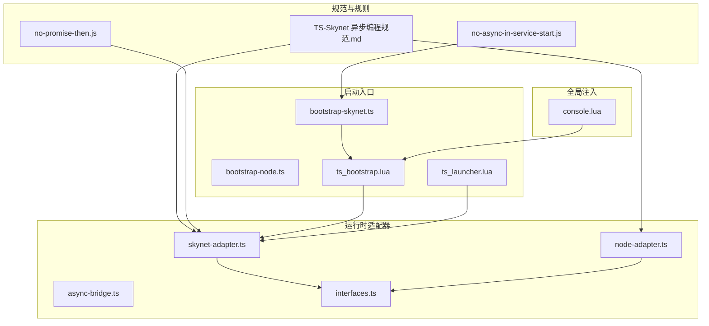
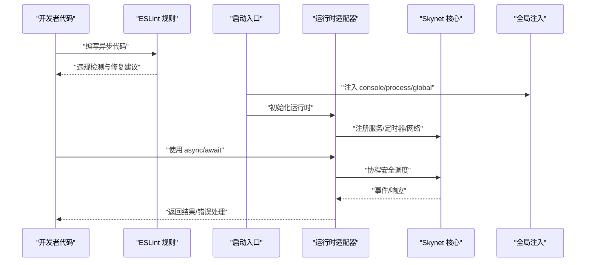
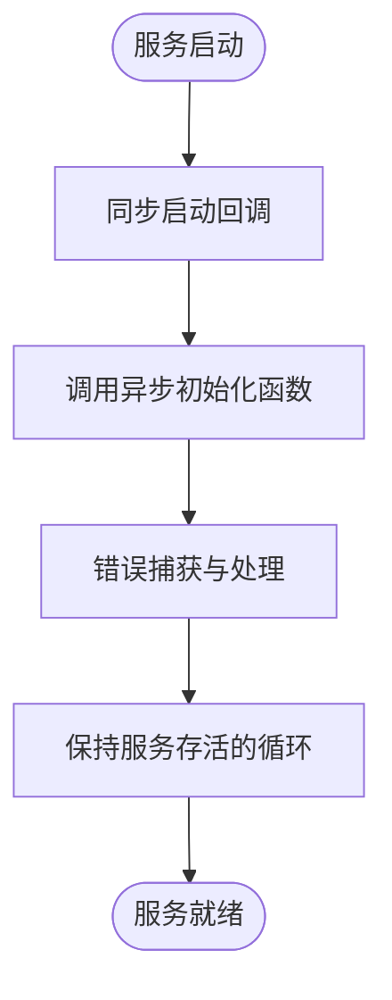
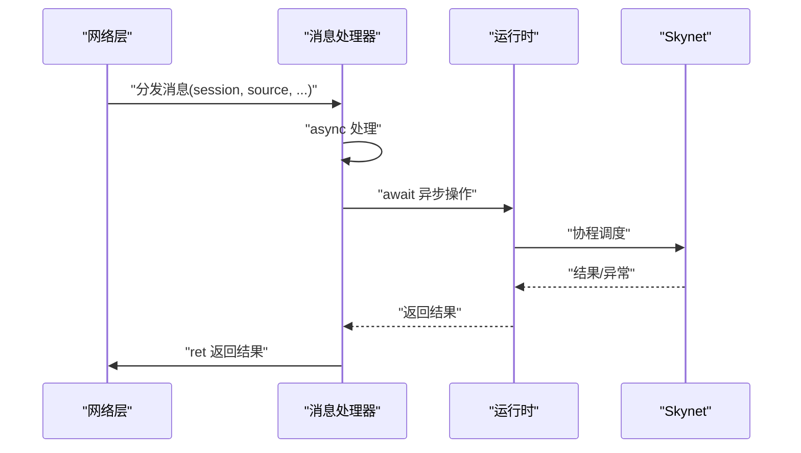
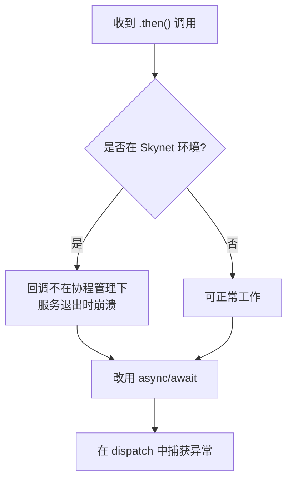
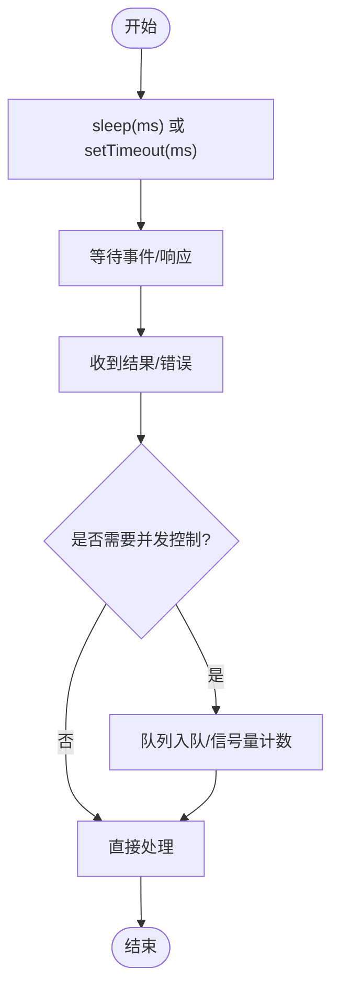
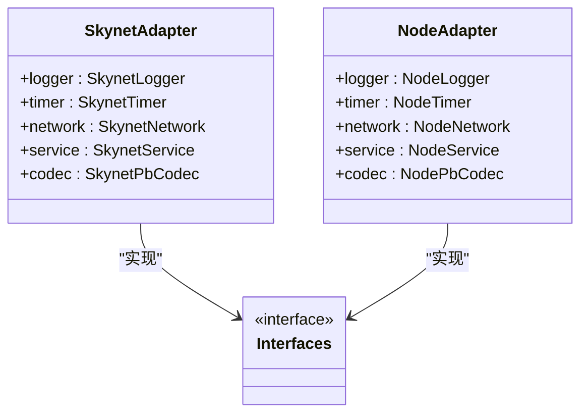
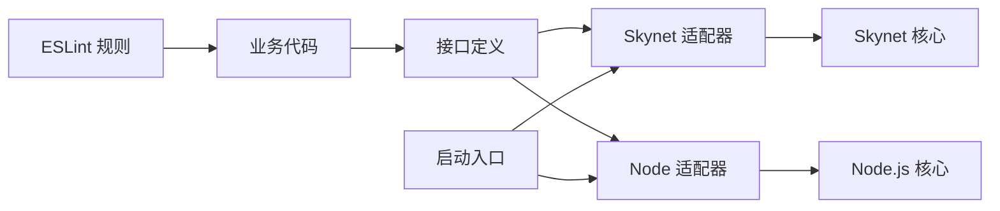

# 异步编程规范

<cite>
**本文引用的文件**
- [TS-Skynet 异步编程规范.md](file://docs/TS-Skynet 异步编程规范.md)
- [skynet-adapter.ts](file://server/src/framework/runtime/skynet-adapter.ts)
- [node-adapter.ts](file://server/src/framework/runtime/node-adapter.ts)
- [async-bridge.ts](file://server/src/framework/runtime/async-bridge.ts)
- [interfaces.ts](file://server/src/framework/core/interfaces.ts)
- [ts_launcher.lua](file://docker/native/ts_launcher.lua)
- [ts_bootstrap.lua](file://docker/native/ts_bootstrap.lua)
- [console.lua](file://docker/native/console.lua)
- [no-async-in-service-start.js](file://server/eslint/rules/no-async-in-service-start.js)
- [no-promise-then.js](file://server/eslint/rules/no-promise-then.js)
- [bootstrap-node.ts](file://server/src/app/bootstrap-node.ts)
- [bootstrap-skynet.ts](file://server/src/app/bootstrap-skynet.ts)
</cite>

## 目录
1. [简介](#简介)
2. [项目结构](#项目结构)
3. [核心组件](#核心组件)
4. [架构总览](#架构总览)
5. [详细组件分析](#详细组件分析)
6. [依赖关系分析](#依赖关系分析)
7. [性能考虑](#性能考虑)
8. [故障排查指南](#故障排查指南)
9. [结论](#结论)
10. [附录](#附录)

## 简介
本规范面向在 Skynet 环境中使用 TypeScriptToLua (TSTL) 编译运行的项目，系统阐述异步编程最佳实践。重点覆盖：
- async/await 在服务启动与消息处理中的正确使用
- Promise 使用规范与错误处理策略
- 超时处理、并发控制、内存管理等高级技巧
- TypeScriptToLua 转译对异步代码的影响与注意事项
- 具体代码示例与性能优化建议

## 项目结构
围绕异步编程的关键文件组织如下：
- 规范文档：集中说明异步编程规则、约束与替代方案
- 运行时适配器：封装 Skynet/Node.js 的异步能力，提供统一接口
- ESLint 规则：强制约束禁止使用的写法，保障一致性
- 启动入口：Node/Skynet 环境的启动流程，体现异步生命周期
- 全局注入：为 Skynet 注入 console、process、global 等全局对象，便于调试与日志

**图表来源**
- [TS-Skynet 异步编程规范.md:1-1154](file://docs/TS-Skynet 异步编程规范.md#L1-L1154)
- [skynet-adapter.ts:1-221](file://server/src/framework/runtime/skynet-adapter.ts#L1-L221)
- [node-adapter.ts:1-194](file://server/src/framework/runtime/node-adapter.ts#L1-L194)
- [async-bridge.ts:1-200](file://server/src/framework/runtime/async-bridge.ts#L1-L200)
- [interfaces.ts:1-200](file://server/src/framework/core/interfaces.ts#L1-L200)
- [bootstrap-node.ts:1-22](file://server/src/app/bootstrap-node.ts#L1-L22)
- [bootstrap-skynet.ts:1-20](file://server/src/app/bootstrap-skynet.ts#L1-L20)
- [ts_launcher.lua:1-26](file://docker/native/ts_launcher.lua#L1-L26)
- [ts_bootstrap.lua:1-33](file://docker/native/ts_bootstrap.lua#L1-L33)
- [console.lua:1-98](file://docker/native/console.lua#L1-L98)

**章节来源**
- [TS-Skynet 异步编程规范.md:1-1154](file://docs/TS-Skynet 异步编程规范.md#L1-L1154)
- [bootstrap-node.ts:1-22](file://server/src/app/bootstrap-node.ts#L1-L22)
- [bootstrap-skynet.ts:1-20](file://server/src/app/bootstrap-skynet.ts#L1-L20)

## 核心组件
- 运行时接口与实现
  - Skynet 运行时：封装 Skynet 的日志、定时器、网络、服务与编码器能力，提供协程安全的异步接口
  - Node.js 运行时：封装 Node.js 原生 API，提供等价的异步接口，便于本地测试
  - 接口定义：统一抽象，屏蔽平台差异
- 启动与生命周期
  - Skynet 启动：通过入口脚本注入全局对象、初始化运行时、加载服务模块
  - Node.js 启动：通过入口脚本设置运行时并导入服务模块
- ESLint 规则
  - 禁止在服务启动回调中使用 async
  - 禁止使用 Promise.then() 链式调用

**章节来源**
- [skynet-adapter.ts:1-221](file://server/src/framework/runtime/skynet-adapter.ts#L1-L221)
- [node-adapter.ts:1-194](file://server/src/framework/runtime/node-adapter.ts#L1-L194)
- [interfaces.ts:1-200](file://server/src/framework/core/interfaces.ts#L1-L200)
- [bootstrap-node.ts:1-22](file://server/src/app/bootstrap-node.ts#L1-L22)
- [bootstrap-skynet.ts:1-20](file://server/src/app/bootstrap-skynet.ts#L1-L20)
- [ts_launcher.lua:1-26](file://docker/native/ts_launcher.lua#L1-L26)
- [ts_bootstrap.lua:1-33](file://docker/native/ts_bootstrap.lua#L1-L33)
- [no-async-in-service-start.js:1-81](file://server/eslint/rules/no-async-in-service-start.js#L1-L81)
- [no-promise-then.js:1-76](file://server/eslint/rules/no-promise-then.js#L1-L76)

## 架构总览
下图展示异步编程在不同环境中的关键交互：规范约束、运行时适配、启动流程与全局注入。

**图表来源**
- [TS-Skynet 异步编程规范.md:1-1154](file://docs/TS-Skynet 异步编程规范.md#L1-L1154)
- [skynet-adapter.ts:1-221](file://server/src/framework/runtime/skynet-adapter.ts#L1-L221)
- [node-adapter.ts:1-194](file://server/src/framework/runtime/node-adapter.ts#L1-L194)
- [ts_bootstrap.lua:1-33](file://docker/native/ts_bootstrap.lua#L1-L33)
- [console.lua:1-98](file://docker/native/console.lua#L1-L98)

## 详细组件分析

### 服务启动时的异步限制
- 约束要点
  - Skynet 的服务启动回调必须同步完成，不能返回 Promise
  - 若需执行异步初始化，应将异步逻辑放入独立函数，并在同步回调中调用
- 正确模式
  - 同步回调启动异步流程，使用错误捕获与服务退出策略
  - 保持服务存活的无限循环（如心跳）
- 反例与风险
  - 在启动回调中直接使用 async，服务可能在初始化未完成时退出

**图表来源**
- [TS-Skynet 异步编程规范.md:94-130](file://docs/TS-Skynet 异步编程规范.md#L94-L130)
- [bootstrap-skynet.ts:1-20](file://server/src/app/bootstrap-skynet.ts#L1-L20)
- [skynet-adapter.ts:160-174](file://server/src/framework/runtime/skynet-adapter.ts#L160-L174)

**章节来源**
- [TS-Skynet 异步编程规范.md:94-130](file://docs/TS-Skynet 异步编程规范.md#L94-L130)
- [no-async-in-service-start.js:1-81](file://server/eslint/rules/no-async-in-service-start.js#L1-L81)
- [bootstrap-skynet.ts:1-20](file://server/src/app/bootstrap-skynet.ts#L1-L20)
- [skynet-adapter.ts:160-174](file://server/src/framework/runtime/skynet-adapter.ts#L160-L174)

### 消息处理中的异步灵活性
- 约束要点
  - dispatch 回调在消息循环内执行，协程管理机制已就绪，可安全使用 async
  - 需要对异常进行捕获，避免未处理的 Promise 拒绝导致服务崩溃
- 正确模式
  - 将消息处理器声明为 async，并在 try/catch 中包裹异步逻辑
  - 使用 ret 返回结果或错误信息

**图表来源**
- [TS-Skynet 异步编程规范.md:142-166](file://docs/TS-Skynet 异步编程规范.md#L142-L166)
- [skynet-adapter.ts:139-150](file://server/src/framework/runtime/skynet-adapter.ts#L139-L150)

**章节来源**
- [TS-Skynet 异步编程规范.md:142-166](file://docs/TS-Skynet 异步编程规范.md#L142-L166)
- [skynet-adapter.ts:139-150](file://server/src/framework/runtime/skynet-adapter.ts#L139-L150)

### Promise 使用规范与错误处理策略
- 禁止使用 Promise.then() 链式调用
  - 原因：在 Skynet 环境中，.then() 回调不在协程管理下，服务退出时会导致“无法恢复死协程”错误
  - 替代：使用 async/await + try/catch
- 消息处理中的错误捕获
  - dispatch 回调若返回 Promise，需捕获异常，防止未处理拒绝
- 定时器安全
  - 使用 safeTimeout/safeImmediate 包装回调，确保在协程中执行

**图表来源**
- [TS-Skynet 异步编程规范.md:20-70](file://docs/TS-Skynet 异步编程规范.md#L20-L70)
- [no-promise-then.js:1-76](file://server/eslint/rules/no-promise-then.js#L1-L76)
- [skynet-adapter.ts:100-121](file://server/src/framework/runtime/skynet-adapter.ts#L100-L121)

**章节来源**
- [TS-Skynet 异步编程规范.md:20-70](file://docs/TS-Skynet 异步编程规范.md#L20-L70)
- [no-promise-then.js:1-76](file://server/eslint/rules/no-promise-then.js#L1-L76)
- [skynet-adapter.ts:100-121](file://server/src/framework/runtime/skynet-adapter.ts#L100-L121)

### 超时处理与并发控制
- 定时器与睡眠
  - 使用 runtime.timer.sleep 实现非阻塞等待
  - 使用 safeTimeout/safeImmediate 实现协程安全的延时与立即执行
- 并发控制
  - 使用队列与信号量控制并发度
  - 对高频定时器调用进行性能评估（每次创建新协程可能带来开销）

**图表来源**
- [skynet-adapter.ts:81-121](file://server/src/framework/runtime/skynet-adapter.ts#L81-L121)
- [TS-Skynet 异步编程规范.md:318-344](file://docs/TS-Skynet 异步编程规范.md#L318-L344)

**章节来源**
- [skynet-adapter.ts:81-121](file://server/src/framework/runtime/skynet-adapter.ts#L81-L121)
- [TS-Skynet 异步编程规范.md:318-344](file://docs/TS-Skynet 异步编程规范.md#L318-L344)

### 内存管理与资源释放
- 避免动态模块加载
  - 禁止使用动态路径 require，TSTL 编译时无法解析
  - 使用静态导入与映射表替代动态加载
- 资源释放
  - 在服务退出时清理定时器、网络连接与监听器
  - 使用 try/finally 确保资源释放

**章节来源**
- [TS-Skynet 异步编程规范.md:355-400](file://docs/TS-Skynet 异步编程规范.md#L355-L400)
- [skynet-adapter.ts:176-198](file://server/src/framework/runtime/skynet-adapter.ts#L176-L198)

### TypeScriptToLua 转译对异步的影响
- async/await 编译为协程
  - TSTL 将 async/await 编译为协程管理，由 Skynet 正确调度
- Promise.then() 编译为普通回调
  - 导致回调不在协程管理下，服务退出时崩溃
- 全局对象与 API 注入
  - console、process、global、Date、String、Buffer 等通过 Lua 注入实现
- 定时器插件转换
  - setTimeout/setImmediate 在编译期自动转换为 safeTimeout/safeImmediate

**图表来源**
- [skynet-adapter.ts:204-221](file://server/src/framework/runtime/skynet-adapter.ts#L204-L221)
- [node-adapter.ts:177-194](file://server/src/framework/runtime/node-adapter.ts#L177-L194)
- [interfaces.ts:1-200](file://server/src/framework/core/interfaces.ts#L1-L200)

**章节来源**
- [TS-Skynet 异步编程规范.md:64-90](file://docs/TS-Skynet 异步编程规范.md#L64-L90)
- [console.lua:1-98](file://docker/native/console.lua#L1-L98)
- [ts_bootstrap.lua:1-33](file://docker/native/ts_bootstrap.lua#L1-L33)
- [ts_launcher.lua:1-26](file://docker/native/ts_launcher.lua#L1-L26)

## 依赖关系分析
- 规则驱动的约束
  - ESLint 规则对特定文件路径豁免（框架底层），其余代码强制约束
- 运行时耦合
  - 业务代码依赖统一接口，具体实现由运行时适配器提供
- 启动流程
  - Skynet 启动入口负责注入全局对象、初始化运行时并加载服务模块

**图表来源**
- [no-async-in-service-start.js:1-81](file://server/eslint/rules/no-async-in-service-start.js#L1-L81)
- [no-promise-then.js:1-76](file://server/eslint/rules/no-promise-then.js#L1-L76)
- [interfaces.ts:1-200](file://server/src/framework/core/interfaces.ts#L1-L200)
- [skynet-adapter.ts:1-221](file://server/src/framework/runtime/skynet-adapter.ts#L1-L221)
- [node-adapter.ts:1-194](file://server/src/framework/runtime/node-adapter.ts#L1-L194)
- [bootstrap-skynet.ts:1-20](file://server/src/app/bootstrap-skynet.ts#L1-L20)
- [bootstrap-node.ts:1-22](file://server/src/app/bootstrap-node.ts#L1-L22)

**章节来源**
- [no-async-in-service-start.js:1-81](file://server/eslint/rules/no-async-in-service-start.js#L1-L81)
- [no-promise-then.js:1-76](file://server/eslint/rules/no-promise-then.js#L1-L76)
- [interfaces.ts:1-200](file://server/src/framework/core/interfaces.ts#L1-L200)
- [skynet-adapter.ts:1-221](file://server/src/framework/runtime/skynet-adapter.ts#L1-L221)
- [node-adapter.ts:1-194](file://server/src/framework/runtime/node-adapter.ts#L1-L194)
- [bootstrap-skynet.ts:1-20](file://server/src/app/bootstrap-skynet.ts#L1-L20)
- [bootstrap-node.ts:1-22](file://server/src/app/bootstrap-node.ts#L1-L22)

## 性能考虑
- 避免高频定时器
  - 每次调用 safeTimeout 会创建新协程，频繁调用可能影响性能
- 合理使用 sleep
  - 将多个等待合并为更长的 sleep，减少调度开销
- 并发控制
  - 使用队列与信号量限制并发度，避免资源争用
- 日志与调试
  - 使用 console.time/timeEnd 进行性能测量，注意在生产环境关闭冗余日志

[本节为通用指导，无需列出具体文件来源]

## 故障排查指南
- “无法恢复死协程”错误
  - 检查是否存在 .then() 链式调用，替换为 async/await
  - 确认 dispatch 回调返回的 Promise 已被捕获
- 服务启动后立即退出
  - 检查是否在 runtime.service.start 回调中使用了 async
  - 将异步逻辑迁移到独立函数并通过同步回调启动
- 定时器未生效
  - 确认使用 runtime.timer.sleep 或 safeTimeout
  - 避免在回调中直接使用 Node.js 原生定时器 API

**章节来源**
- [TS-Skynet 异步编程规范.md:20-70](file://docs/TS-Skynet 异步编程规范.md#L20-L70)
- [skynet-adapter.ts:81-121](file://server/src/framework/runtime/skynet-adapter.ts#L81-L121)
- [skynet-adapter.ts:160-174](file://server/src/framework/runtime/skynet-adapter.ts#L160-L174)
- [console.lua:76-93](file://docker/native/console.lua#L76-L93)

## 结论
在 Skynet 环境中使用 TSTL 进行异步编程，必须严格遵循规范：服务启动回调必须同步、消息处理可使用 async、禁止 Promise.then() 链式调用。通过运行时适配器提供的统一接口与 ESLint 规则的强制约束，可以有效避免协程管理不当导致的崩溃与性能问题。结合并发控制、内存管理与性能测量，能够构建稳定高效的异步系统。

[本节为总结性内容，无需列出具体文件来源]

## 附录
- 示例与最佳实践
  - 服务启动：将异步初始化拆分为独立函数，在同步回调中启动并捕获错误
  - 消息处理：将处理器声明为 async，使用 try/catch 包裹异步逻辑
  - 超时与并发：使用 runtime.timer 与 safeTimeout 控制调度；通过队列与信号量控制并发度
- 相关文件路径
  - 规范文档：docs/TS-Skynet 异步编程规范.md
  - 运行时适配器：server/src/framework/runtime/*.ts
  - 启动入口：server/src/app/*.ts 与 docker/native/*.lua
  - ESLint 规则：server/eslint/rules/*.js

[本节为补充信息，无需列出具体文件来源]