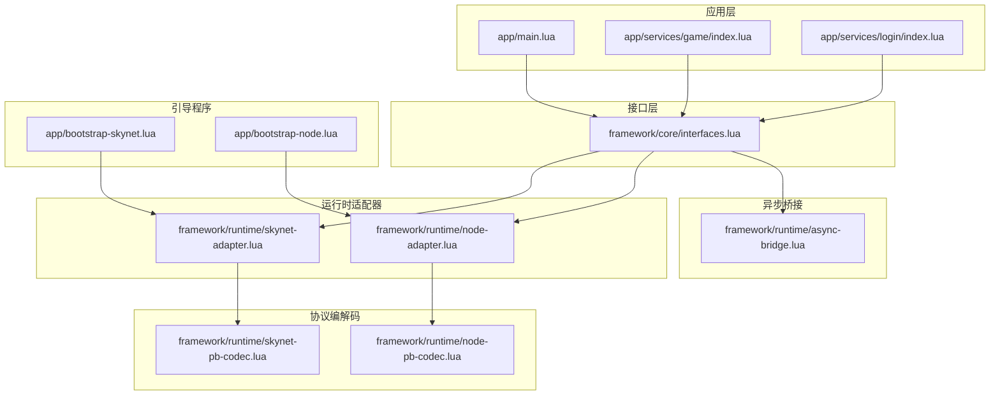
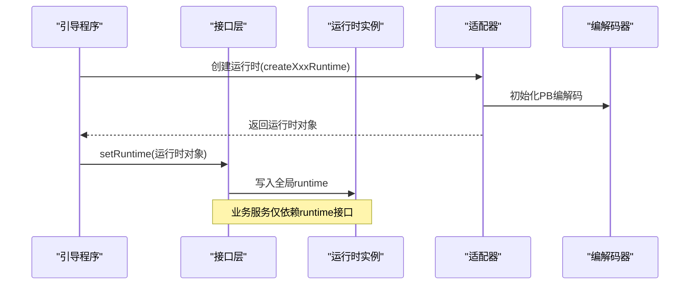
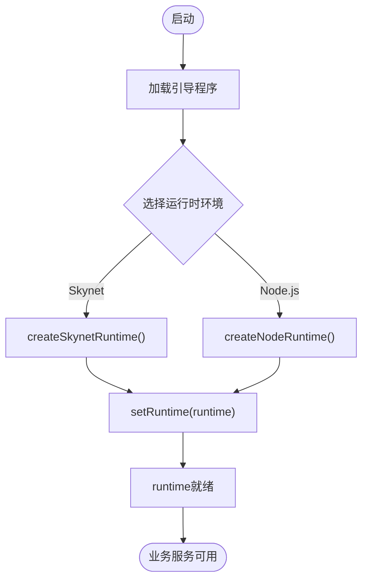
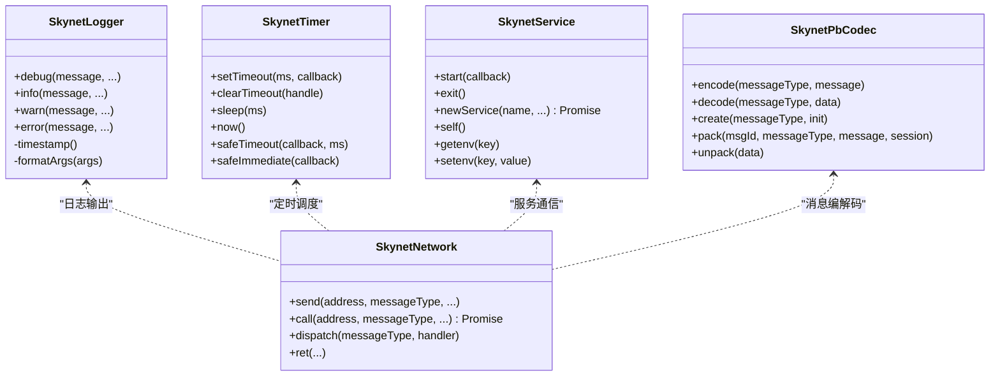
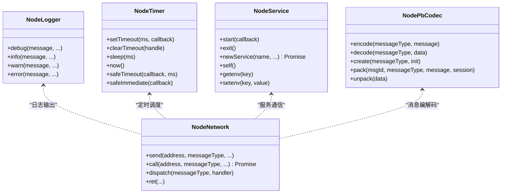
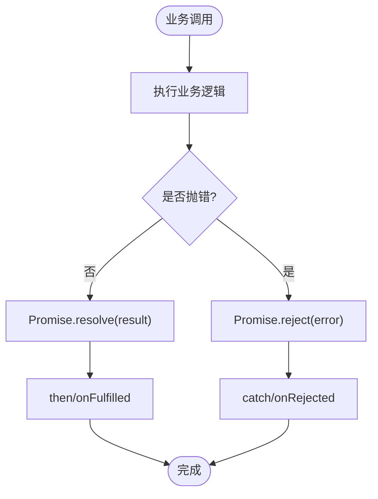
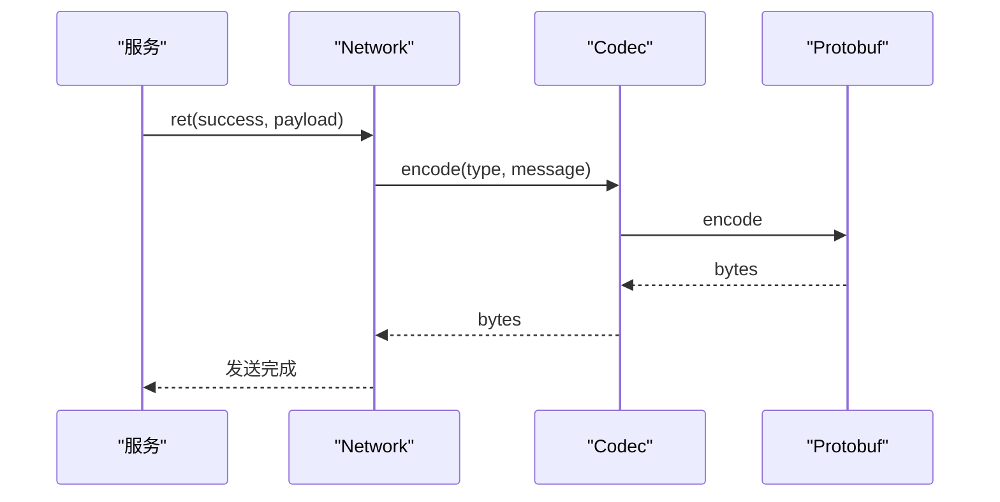
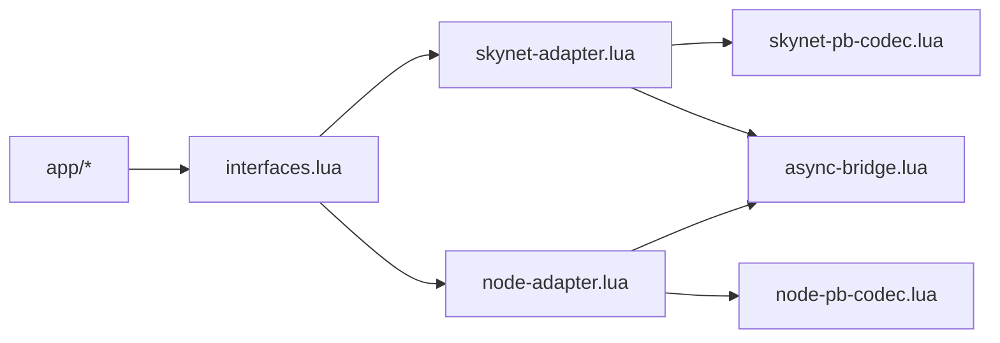

# 接口使用规范

<cite>
**本文档引用的文件**
- [interfaces.lua](file://docker/lua/framework/core/interfaces.lua)
- [skynet-adapter.lua](file://docker/lua/framework/runtime/skynet-adapter.lua)
- [node-adapter.lua](file://docker/lua/framework/runtime/node-adapter.lua)
- [async-bridge.lua](file://docker/lua/framework/runtime/async-bridge.lua)
- [skynet-pb-codec.lua](file://docker/lua/framework/runtime/skynet-pb-codec.lua)
- [node-pb-codec.lua](file://docker/lua/framework/runtime/node-pb-codec.lua)
- [bootstrap-node.lua](file://docker/lua/app/bootstrap-node.lua)
- [bootstrap-skynet.lua](file://docker/lua/app/bootstrap-skynet.lua)
- [main.lua](file://docker/lua/app/main.lua)
- [game/index.lua](file://docker/lua/app/services/game/index.lua)
- [login/index.lua](file://docker/lua/app/services/login/index.lua)
- [proto.lua](file://docker/lua/protos/proto.lua)
</cite>

## 目录
1. [简介](#简介)
2. [项目结构](#项目结构)
3. [核心组件](#核心组件)
4. [架构总览](#架构总览)
5. [详细组件分析](#详细组件分析)
6. [依赖关系分析](#依赖关系分析)
7. [性能考量](#性能考量)
8. [故障排查指南](#故障排查指南)
9. [结论](#结论)
10. [附录](#附录)

## 简介
本规范系统阐述了抽象接口层的使用方法与约束条件，重点说明 runtime 接口的设计理念与使用规范，强调不得直接使用底层 Skynet API 的原则，并提供在不同运行时环境（Skynet 与 Node.js）下的接口差异与兼容性考虑。文档同时给出最佳实践、调用流程、参数与返回值处理规范、常见错误案例以及可视化图示，帮助开发者在不暴露底层实现细节的前提下，稳定地构建跨平台的网络与服务框架。

## 项目结构
抽象接口层位于框架的核心目录，围绕 interfaces.lua 提供统一的运行时入口，通过适配器模式分别对接 Skynet 与 Node.js 的运行时能力，并通过异步桥接支持 TypeScript/JavaScript 的 async/await 语法转换为 Lua 协程。

**图表来源**
- [interfaces.lua:1-24](file://docker/lua/framework/core/interfaces.lua#L1-L24)
- [skynet-adapter.lua:1-227](file://docker/lua/framework/runtime/skynet-adapter.lua#L1-L227)
- [node-adapter.lua:1-207](file://docker/lua/framework/runtime/node-adapter.lua#L1-L207)
- [async-bridge.lua:1-243](file://docker/lua/framework/runtime/async-bridge.lua#L1-L243)
- [skynet-pb-codec.lua:1-164](file://docker/lua/framework/runtime/skynet-pb-codec.lua#L1-L164)
- [node-pb-codec.lua:1-185](file://docker/lua/framework/runtime/node-pb-codec.lua#L1-L185)
- [bootstrap-node.lua:1-17](file://docker/lua/app/bootstrap-node.lua#L1-L17)
- [bootstrap-skynet.lua:1-12](file://docker/lua/app/bootstrap-skynet.lua#L1-L12)
- [main.lua:1-91](file://docker/lua/app/main.lua#L1-L91)
- [game/index.lua:1-156](file://docker/lua/app/services/game/index.lua#L1-L156)
- [login/index.lua:1-162](file://docker/lua/app/services/login/index.lua#L1-L162)

**章节来源**
- [interfaces.lua:1-24](file://docker/lua/framework/core/interfaces.lua#L1-L24)
- [bootstrap-node.lua:1-17](file://docker/lua/app/bootstrap-node.lua#L1-L17)
- [bootstrap-skynet.lua:1-12](file://docker/lua/app/bootstrap-skynet.lua#L1-L12)
- [main.lua:1-91](file://docker/lua/app/main.lua#L1-L91)

## 核心组件
- 抽象接口入口
  - runtime 对象：全局唯一运行时实例，通过 setRuntime 注入具体实现。
  - RuntimeEnvironment：运行时环境枚举（node、skynet），用于区分行为差异。
- 运行时适配器
  - SkynetAdapter：封装 Skynet 的日志、定时器、网络、服务与 PB 编解码。
  - NodeAdapter：封装 Node.js 的日志、定时器、网络、服务与 PB 编解码。
- 异步桥接
  - Promise 实现与协程包装，确保 async/await 在两种环境一致工作。
- 协议编解码
  - SkynetPbCodec：基于 lua-protobuf 的生产级编解码。
  - NodePbCodec：基于 protos.proto 的 Node.js 环境编解码（JSON/Text 转换）。

**章节来源**
- [interfaces.lua:5-22](file://docker/lua/framework/core/interfaces.lua#L5-L22)
- [skynet-adapter.lua:20-225](file://docker/lua/framework/runtime/skynet-adapter.lua#L20-L225)
- [node-adapter.lua:15-204](file://docker/lua/framework/runtime/node-adapter.lua#L15-L204)
- [async-bridge.lua:17-241](file://docker/lua/framework/runtime/async-bridge.lua#L17-L241)
- [skynet-pb-codec.lua:51-162](file://docker/lua/framework/runtime/skynet-pb-codec.lua#L51-L162)
- [node-pb-codec.lua:53-183](file://docker/lua/framework/runtime/node-pb-codec.lua#L53-L183)

## 架构总览
抽象接口层通过 setRuntime 将具体运行时注入到全局 runtime 中，业务服务仅依赖 runtime 接口，不感知底层实现。引导程序根据部署环境选择对应适配器创建运行时并注入。

**图表来源**
- [bootstrap-node.lua:10-12](file://docker/lua/app/bootstrap-node.lua#L10-L12)
- [bootstrap-skynet.lua:8-9](file://docker/lua/app/bootstrap-skynet.lua#L8-L9)
- [interfaces.lua:14-22](file://docker/lua/framework/core/interfaces.lua#L14-L22)
- [skynet-adapter.lua:205-225](file://docker/lua/framework/runtime/skynet-adapter.lua#L205-L225)
- [node-adapter.lua:185-205](file://docker/lua/framework/runtime/node-adapter.lua#L185-L205)

## 详细组件分析

### 接口层与运行时注入
- 设计要点
  - 使用可变对象保存 runtime，避免模块缓存导致的单例覆盖问题。
  - setRuntime 以统一字段集合注入 logger、timer、network、service、database、codec。
  - RuntimeEnvironment 提供环境标识，便于差异化行为。
- 使用规范
  - 业务服务必须通过接口层获取 runtime，禁止直接 require 底层模块。
  - 引导程序负责在启动阶段调用 setRuntime，确保 runtime 可用。

**图表来源**
- [interfaces.lua:10-22](file://docker/lua/framework/core/interfaces.lua#L10-L22)
- [bootstrap-node.lua:10-12](file://docker/lua/app/bootstrap-node.lua#L10-L12)
- [bootstrap-skynet.lua:8-9](file://docker/lua/app/bootstrap-skynet.lua#L8-L9)

**章节来源**
- [interfaces.lua:5-22](file://docker/lua/framework/core/interfaces.lua#L5-L22)
- [bootstrap-node.lua:5-12](file://docker/lua/app/bootstrap-node.lua#L5-L12)
- [bootstrap-skynet.lua:5-9](file://docker/lua/app/bootstrap-skynet.lua#L5-L9)

### Skynet 运行时适配器
- 能力映射
  - Logger：统一 debug/info/warn/error 输出，带时间戳与参数格式化。
  - Timer：毫秒到厘秒转换、安全超时与立即执行封装。
  - Network：send/call/dispatch/ret，内部使用 skynet.call/dispatch 等。
  - Service：start/newService/self/getenv/setenv/exit。
  - Codec：SkynetPbCodec，基于 lua-protobuf。
- 关键约束
  - 时间单位：Skynet 使用厘秒（1/100秒），Timer 实现需进行换算。
  - 错误处理：回调中的 Promise 需捕获异常并记录。
  - PB 编解码：未安装 lua-protobuf 时会降级或报错。

**图表来源**
- [skynet-adapter.lua:20-225](file://docker/lua/framework/runtime/skynet-adapter.lua#L20-L225)
- [skynet-pb-codec.lua:51-162](file://docker/lua/framework/runtime/skynet-pb-codec.lua#L51-L162)

**章节来源**
- [skynet-adapter.lua:19-225](file://docker/lua/framework/runtime/skynet-adapter.lua#L19-L225)
- [skynet-pb-codec.lua:59-162](file://docker/lua/framework/runtime/skynet-pb-codec.lua#L59-L162)

### Node.js 运行时适配器
- 能力映射
  - Logger：基于 console 的调试输出。
  - Timer：基于 setTimeout/setImmediate，支持安全执行。
  - Network：基于 Map 的简单事件模拟，call 返回 mock Promise。
  - Service：基于进程环境变量，self 为服务标识。
  - Codec：基于 protos.proto 的 JSON 文本编解码。
- 关键约束
  - Network 为演示用途，实际应替换为真实 RPC 框架。
  - PB 编解码不可用时会发出警告并降级。

**图表来源**
- [node-adapter.lua:15-204](file://docker/lua/framework/runtime/node-adapter.lua#L15-L204)
- [node-pb-codec.lua:53-183](file://docker/lua/framework/runtime/node-pb-codec.lua#L53-L183)

**章节来源**
- [node-adapter.lua:14-204](file://docker/lua/framework/runtime/node-adapter.lua#L14-L204)
- [node-pb-codec.lua:61-183](file://docker/lua/framework/runtime/node-pb-codec.lua#L61-L183)

### 异步桥接与 Promise 实现
- 设计目标
  - 在 Skynet 环境下提供自定义 Promise，支持 then/catch/all。
  - wrapSkynetCoroutine 将业务函数包裹为可抛错的协程执行。
  - sleep 统一两种环境的异步等待。
- 使用建议
  - 优先使用 runtime.timer:sleep 而非原生 setTimeout。
  - 所有异步回调均需处理异常，避免未捕获错误导致服务崩溃。

**图表来源**
- [async-bridge.lua:17-166](file://docker/lua/framework/runtime/async-bridge.lua#L17-L166)

**章节来源**
- [async-bridge.lua:17-241](file://docker/lua/framework/runtime/async-bridge.lua#L17-L241)

### 协议编解码器
- SkynetPbCodec
  - 依赖 lua-protobuf，加载 .desc 文件后进行 encode/decode/pack/unpack。
  - 未安装时禁用并记录错误。
- NodePbCodec
  - 依赖 protos.proto，基于 JSON 文本进行编码解码。
  - 未加载时发出警告并降级。
- 使用规范
  - 仅在 runtime.codec 存在时进行消息编解码，否则回退到原始数据传输。
  - pack/unpack 时注意 msgId 与消息类型的映射一致性。

**图表来源**
- [game/index.lua:29-44](file://docker/lua/app/services/game/index.lua#L29-L44)
- [login/index.lua:45-52](file://docker/lua/app/services/login/index.lua#L45-L52)
- [skynet-pb-codec.lua:91-106](file://docker/lua/framework/runtime/skynet-pb-codec.lua#L91-L106)
- [node-pb-codec.lua:76-103](file://docker/lua/framework/runtime/node-pb-codec.lua#L76-L103)

**章节来源**
- [skynet-pb-codec.lua:59-162](file://docker/lua/framework/runtime/skynet-pb-codec.lua#L59-L162)
- [node-pb-codec.lua:61-183](file://docker/lua/framework/runtime/node-pb-codec.lua#L61-L183)
- [game/index.lua:29-44](file://docker/lua/app/services/game/index.lua#L29-L44)
- [login/index.lua:45-52](file://docker/lua/app/services/login/index.lua#L45-L52)

## 依赖关系分析
- 耦合与内聚
  - 业务服务仅依赖 interfaces.runtime，耦合度低，内聚于运行时能力。
  - 适配器与编解码器相互独立，便于替换与扩展。
- 外部依赖
  - Skynet 环境依赖 lua-protobuf；Node.js 环境依赖 protos.proto。
- 循环依赖
  - 引导程序 -> 适配器 -> 编解码器；接口层 -> 适配器；无循环依赖风险。

**图表来源**
- [interfaces.lua:1-24](file://docker/lua/framework/core/interfaces.lua#L1-L24)
- [skynet-adapter.lua:1-227](file://docker/lua/framework/runtime/skynet-adapter.lua#L1-L227)
- [node-adapter.lua:1-207](file://docker/lua/framework/runtime/node-adapter.lua#L1-L207)
- [async-bridge.lua:1-243](file://docker/lua/framework/runtime/async-bridge.lua#L1-L243)
- [skynet-pb-codec.lua:1-164](file://docker/lua/framework/runtime/skynet-pb-codec.lua#L1-L164)
- [node-pb-codec.lua:1-185](file://docker/lua/framework/runtime/node-pb-codec.lua#L1-L185)

**章节来源**
- [interfaces.lua:1-24](file://docker/lua/framework/core/interfaces.lua#L1-L24)
- [skynet-adapter.lua:1-227](file://docker/lua/framework/runtime/skynet-adapter.lua#L1-L227)
- [node-adapter.lua:1-207](file://docker/lua/framework/runtime/node-adapter.lua#L1-L207)
- [async-bridge.lua:1-243](file://docker/lua/framework/runtime/async-bridge.lua#L1-L243)
- [skynet-pb-codec.lua:1-164](file://docker/lua/framework/runtime/skynet-pb-codec.lua#L1-L164)
- [node-pb-codec.lua:1-185](file://docker/lua/framework/runtime/node-pb-codec.lua#L1-L185)

## 性能考量
- 时间单位换算
  - Skynet 使用厘秒，Timer 实现需将毫秒换算为厘秒，避免精度损失。
- 异步等待
  - 优先使用 runtime.timer:sleep，避免阻塞主线程。
- 编解码开销
  - PB 编解码在 Skynet 下性能更优；Node.js 下 JSON 文本编解码需控制消息大小。
- 并发与错误处理
  - safeTimeout/safeImmediate 自动捕获回调异常，减少服务崩溃风险。

[本节为通用指导，无需特定文件引用]

## 故障排查指南
- 常见错误与定位
  - PB 编解码不可用：检查 lua-protobuf 是否安装（Skynet）或 protos.proto 是否加载（Node.js）。
  - 网络调用失败：确认 runtime.network:call 的地址与消息类型匹配。
  - 时间单位错误：确认传入毫秒而非厘秒（Skynet）。
- 最佳实践
  - 所有异步回调均使用 runtime.logger 记录错误堆栈。
  - 在 service:start 回调中使用 try/catch 包裹启动逻辑。
  - 使用 runtime.timer:sleep 替代原生定时器，保证跨环境一致性。

**章节来源**
- [skynet-pb-codec.lua:22-24](file://docker/lua/framework/runtime/skynet-pb-codec.lua#L22-L24)
- [node-pb-codec.lua:62-74](file://docker/lua/framework/runtime/node-pb-codec.lua#L62-L74)
- [skynet-adapter.lua:109-127](file://docker/lua/framework/runtime/skynet-adapter.lua#L109-L127)
- [node-adapter.lua:64-86](file://docker/lua/framework/runtime/node-adapter.lua#L64-L86)

## 结论
抽象接口层通过统一的 runtime 接口屏蔽底层差异，使业务服务能够在 Skynet 与 Node.js 之间无缝切换。遵循本文规范，可有效避免直接依赖底层 API 带来的耦合与迁移成本，提升系统的可维护性与可移植性。

[本节为总结，无需特定文件引用]

## 附录

### 使用规范与最佳实践
- 正确调用 runtime 方法
  - 获取 runtime：local runtime = require("framework.core.interfaces").runtime
  - 使用 logger：runtime.logger:info("...")，避免直接使用 print
  - 使用 timer：runtime.timer:sleep(ms)，而非 setTimeout
  - 使用 network：runtime.network:send/call/dispatch/ret
  - 使用 service：runtime.service:start/newService/self/getenv/setenv/exit
  - 使用 codec：仅在 runtime.codec 存在时进行 encode/decode/pack/unpack
- 参数传递规范
  - call 的参数按顺序传递，ret 的返回值按约定格式返回（成功标志 + 数据）
  - 编解码时确保消息类型与 msgId 映射一致
- 返回值处理
  - 所有异步调用使用 Promise 链式处理，catch 捕获错误
  - dispatch 中的回调若返回 Promise，需确保异常被捕获
- 不同运行时环境的差异
  - Skynet：使用 lua-protobuf，时间单位为厘秒，日志输出到 skynet.error
  - Node.js：使用 protos.proto（JSON 文本），时间单位为毫秒，日志输出到 console
- 兼容性考虑
  - codec 可能不可用时，应回退到原始数据传输
  - 网络层在 Node.js 下为演示实现，生产环境需替换为真实 RPC 框架

**章节来源**
- [interfaces.lua:10-22](file://docker/lua/framework/core/interfaces.lua#L10-L22)
- [skynet-adapter.lua:78-127](file://docker/lua/framework/runtime/skynet-adapter.lua#L78-L127)
- [node-adapter.lua:32-86](file://docker/lua/framework/runtime/node-adapter.lua#L32-L86)
- [skynet-pb-codec.lua:91-162](file://docker/lua/framework/runtime/skynet-pb-codec.lua#L91-L162)
- [node-pb-codec.lua:76-183](file://docker/lua/framework/runtime/node-pb-codec.lua#L76-L183)

### 具体代码示例与路径
- 引导程序设置运行时
  - [bootstrap-node.lua:10-12](file://docker/lua/app/bootstrap-node.lua#L10-L12)
  - [bootstrap-skynet.lua:8-9](file://docker/lua/app/bootstrap-skynet.lua#L8-L9)
- 业务服务使用 runtime
  - [main.lua:28-34](file://docker/lua/app/main.lua#L28-L34)
  - [game/index.lua:29-44](file://docker/lua/app/services/game/index.lua#L29-L44)
  - [login/index.lua:45-52](file://docker/lua/app/services/login/index.lua#L45-L52)
- 协议编解码使用
  - [proto.lua:34-158](file://docker/lua/protos/proto.lua#L34-L158)
  - [skynet-pb-codec.lua:127-162](file://docker/lua/framework/runtime/skynet-pb-codec.lua#L127-L162)
  - [node-pb-codec.lua:160-183](file://docker/lua/framework/runtime/node-pb-codec.lua#L160-L183)

**章节来源**
- [bootstrap-node.lua:10-12](file://docker/lua/app/bootstrap-node.lua#L10-L12)
- [bootstrap-skynet.lua:8-9](file://docker/lua/app/bootstrap-skynet.lua#L8-L9)
- [main.lua:28-34](file://docker/lua/app/main.lua#L28-L34)
- [game/index.lua:29-44](file://docker/lua/app/services/game/index.lua#L29-L44)
- [login/index.lua:45-52](file://docker/lua/app/services/login/index.lua#L45-L52)
- [proto.lua:34-158](file://docker/lua/protos/proto.lua#L34-L158)
- [skynet-pb-codec.lua:127-162](file://docker/lua/framework/runtime/skynet-pb-codec.lua#L127-L162)
- [node-pb-codec.lua:160-183](file://docker/lua/framework/runtime/node-pb-codec.lua#L160-L183)

### 常见错误案例
- 直接使用底层 API
  - 在业务服务中直接 require("skynet") 或使用 setTimeout，违反抽象接口层约束
- 时间单位错误
  - 在 Skynet 中传入毫秒而非厘秒，导致定时器不生效
- 编解码未初始化
  - 未检测 runtime.codec 存在即直接调用 encode/decode，导致错误
- 网络调用异常未捕获
  - dispatch 回调未使用 catch，导致异常传播至系统层

**章节来源**
- [skynet-adapter.lua:85-88](file://docker/lua/framework/runtime/skynet-adapter.lua#L85-L88)
- [node-adapter.lua:38-42](file://docker/lua/framework/runtime/node-adapter.lua#L38-L42)
- [skynet-pb-codec.lua:91-106](file://docker/lua/framework/runtime/skynet-pb-codec.lua#L91-L106)
- [node-pb-codec.lua:76-103](file://docker/lua/framework/runtime/node-pb-codec.lua#L76-L103)