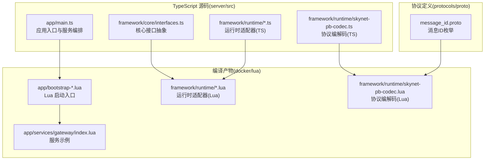
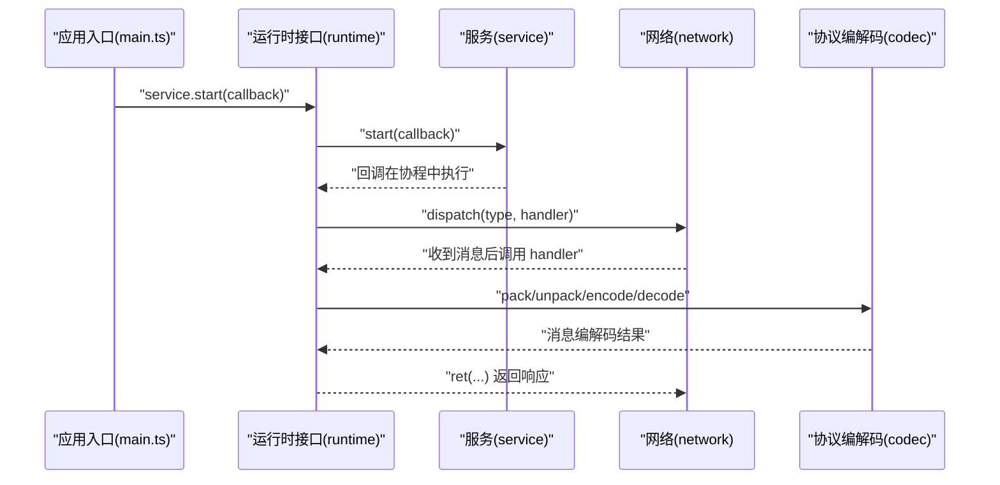
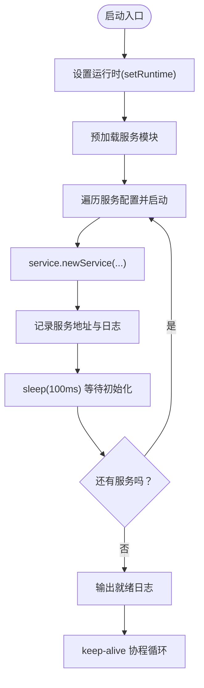
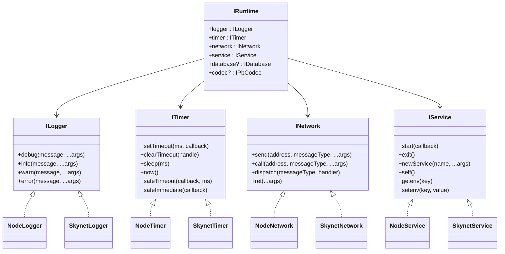
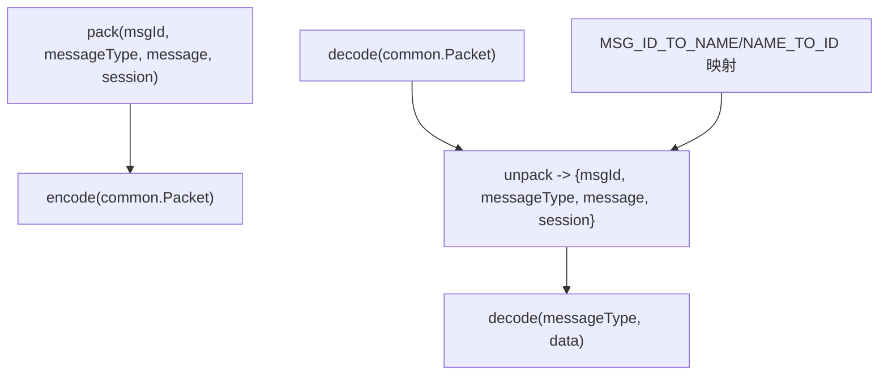
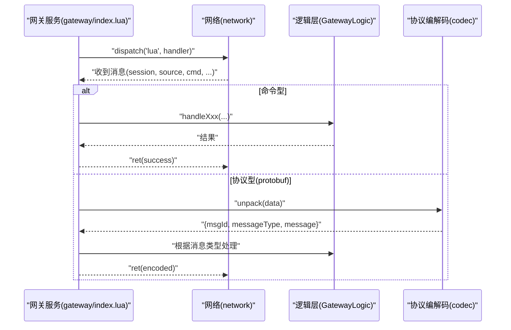
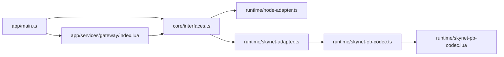

# 服务开发模式

<cite>
**本文引用的文件**
- [server/src/app/bootstrap-node.ts](file://server/src/app/bootstrap-node.ts)
- [server/src/app/bootstrap-skynet.ts](file://server/src/app/bootstrap-skynet.ts)
- [server/src/app/main.ts](file://server/src/app/main.ts)
- [docker/lua/app/bootstrap-node.lua](file://docker/lua/app/bootstrap-node.lua)
- [docker/lua/app/bootstrap-skynet.lua](file://docker/lua/app/bootstrap-skynet.lua)
- [server/src/framework/core/interfaces.ts](file://server/src/framework/core/interfaces.ts)
- [server/src/framework/runtime/node-adapter.ts](file://server/src/framework/runtime/node-adapter.ts)
- [server/src/framework/runtime/skynet-adapter.ts](file://server/src/framework/runtime/skynet-adapter.ts)
- [docker/lua/framework/runtime/node-adapter.lua](file://docker/lua/framework/runtime/node-adapter.lua)
- [docker/lua/framework/runtime/skynet-pb-codec.lua](file://docker/lua/framework/runtime/skynet-pb-codec.lua)
- [server/src/framework/runtime/skynet-pb-codec.ts](file://server/src/framework/runtime/skynet-pb-codec.ts)
- [protocols/proto/message_id.proto](file://protocols/proto/message_id.proto)
- [docker/lua/app/services/gateway/index.lua](file://docker/lua/app/services/gateway/index.lua)
</cite>

## 目录
1. [引言](#引言)
2. [项目结构](#项目结构)
3. [核心组件](#核心组件)
4. [架构总览](#架构总览)
5. [详细组件分析](#详细组件分析)
6. [依赖关系分析](#依赖关系分析)
7. [性能考量](#性能考量)
8. [故障排查指南](#故障排查指南)
9. [结论](#结论)
10. [附录](#附录)

## 引言
本文件面向服务开发者，系统性阐述基于 TypeScriptToLua（TSTL）与 Skynet 的服务开发标准模板与设计模式，覆盖以下主题：
- 服务初始化的标准流程：数据层与逻辑层的创建顺序与职责划分
- 消息处理器的注册与使用：同步与异步处理差异及最佳实践
- 服务生命周期管理：keep-alive 机制、资源清理、错误处理策略
- 提供可复用的服务开发模板与实际项目的代码示例路径

## 项目结构
该仓库采用“TypeScript 逻辑 + TSTL 编译为 Lua + Skynet 运行时”的混合架构。核心组织方式如下：
- server/src：TypeScript 源码，包含运行时适配器、核心接口、应用入口与协议编解码
- docker/lua：编译产物与运行时脚本，包含 Lua 版本的运行时适配器、服务示例与协议描述
- protocols/proto：消息协议定义（含消息 ID 映射）

**图表来源**
- [server/src/app/main.ts:1-106](file://server/src/app/main.ts#L1-L106)
- [server/src/framework/core/interfaces.ts:1-226](file://server/src/framework/core/interfaces.ts#L1-L226)
- [server/src/framework/runtime/node-adapter.ts:1-194](file://server/src/framework/runtime/node-adapter.ts#L1-L194)
- [server/src/framework/runtime/skynet-adapter.ts:1-221](file://server/src/framework/runtime/skynet-adapter.ts#L1-L221)
- [server/src/framework/runtime/skynet-pb-codec.ts:1-184](file://server/src/framework/runtime/skynet-pb-codec.ts#L1-L184)
- [docker/lua/app/bootstrap-node.lua:1-17](file://docker/lua/app/bootstrap-node.lua#L1-L17)
- [docker/lua/app/bootstrap-skynet.lua:1-12](file://docker/lua/app/bootstrap-skynet.lua#L1-L12)
- [docker/lua/app/services/gateway/index.lua:1-225](file://docker/lua/app/services/gateway/index.lua#L1-L225)
- [docker/lua/framework/runtime/skynet-pb-codec.lua:1-164](file://docker/lua/framework/runtime/skynet-pb-codec.lua#L1-L164)
- [protocols/proto/message_id.proto:1-48](file://protocols/proto/message_id.proto#L1-L48)

**章节来源**
- [server/src/app/main.ts:1-106](file://server/src/app/main.ts#L1-L106)
- [server/src/framework/core/interfaces.ts:1-226](file://server/src/framework/core/interfaces.ts#L1-L226)
- [server/src/framework/runtime/node-adapter.ts:1-194](file://server/src/framework/runtime/node-adapter.ts#L1-L194)
- [server/src/framework/runtime/skynet-adapter.ts:1-221](file://server/src/framework/runtime/skynet-adapter.ts#L1-L221)
- [server/src/framework/runtime/skynet-pb-codec.ts:1-184](file://server/src/framework/runtime/skynet-pb-codec.ts#L1-L184)
- [docker/lua/app/bootstrap-node.lua:1-17](file://docker/lua/app/bootstrap-node.lua#L1-L17)
- [docker/lua/app/bootstrap-skynet.lua:1-12](file://docker/lua/app/bootstrap-skynet.lua#L1-L12)
- [docker/lua/app/services/gateway/index.lua:1-225](file://docker/lua/app/services/gateway/index.lua#L1-L225)
- [docker/lua/framework/runtime/skynet-pb-codec.lua:1-164](file://docker/lua/framework/runtime/skynet-pb-codec.lua#L1-L164)
- [protocols/proto/message_id.proto:1-48](file://protocols/proto/message_id.proto#L1-L48)

## 核心组件
- 运行时接口层：统一日志、定时器、网络、服务、数据库、协议编解码等能力抽象，屏蔽 Node.js 与 Skynet 差异
- 运行时适配器：分别为 Node.js 与 Skynet 提供具体实现，保证上层逻辑一致
- 应用入口：负责服务编排、启动与生命周期管理
- 协议编解码：基于 lua-protobuf 的消息打包/解包与类型映射
- 服务示例：网关服务展示消息注册、处理、跨服务调用与 keep-alive

**章节来源**
- [server/src/framework/core/interfaces.ts:1-226](file://server/src/framework/core/interfaces.ts#L1-L226)
- [server/src/framework/runtime/node-adapter.ts:1-194](file://server/src/framework/runtime/node-adapter.ts#L1-L194)
- [server/src/framework/runtime/skynet-adapter.ts:1-221](file://server/src/framework/runtime/skynet-adapter.ts#L1-L221)
- [server/src/framework/runtime/skynet-pb-codec.ts:1-184](file://server/src/framework/runtime/skynet-pb-codec.ts#L1-L184)
- [docker/lua/framework/runtime/skynet-pb-codec.lua:1-164](file://docker/lua/framework/runtime/skynet-pb-codec.lua#L1-L164)

## 架构总览
下图展示了从应用入口到服务运行、消息处理与协议编解码的整体流程。

**图表来源**
- [server/src/app/main.ts:82-105](file://server/src/app/main.ts#L82-L105)
- [server/src/framework/core/interfaces.ts:108-138](file://server/src/framework/core/interfaces.ts#L108-L138)
- [server/src/framework/runtime/skynet-adapter.ts:139-155](file://server/src/framework/runtime/skynet-adapter.ts#L139-L155)
- [server/src/framework/runtime/skynet-pb-codec.ts:146-182](file://server/src/framework/runtime/skynet-pb-codec.ts#L146-L182)

## 详细组件分析

### 应用入口与服务编排
- Node.js 与 Skynet 双环境入口分别设置运行时并预加载服务
- 主入口负责按配置批量启动服务实例，记录地址并输出启动日志
- 通过 keep-alive 协程维持主服务存活，避免 Skynet 自动退出

**图表来源**
- [server/src/app/bootstrap-node.ts:5-22](file://server/src/app/bootstrap-node.ts#L5-L22)
- [server/src/app/bootstrap-skynet.ts:6-20](file://server/src/app/bootstrap-skynet.ts#L6-L20)
- [server/src/app/main.ts:31-87](file://server/src/app/main.ts#L31-L87)

**章节来源**
- [server/src/app/bootstrap-node.ts:1-22](file://server/src/app/bootstrap-node.ts#L1-L22)
- [server/src/app/bootstrap-skynet.ts:1-20](file://server/src/app/bootstrap-skynet.ts#L1-L20)
- [server/src/app/main.ts:1-106](file://server/src/app/main.ts#L1-L106)
- [docker/lua/app/bootstrap-node.lua:1-17](file://docker/lua/app/bootstrap-node.lua#L1-L17)
- [docker/lua/app/bootstrap-skynet.lua:1-12](file://docker/lua/app/bootstrap-skynet.lua#L1-L12)

### 运行时接口与适配器
- 接口层定义了日志、定时器、网络、服务、数据库、协议编解码等统一能力
- Node.js 适配器：使用 Node 原生 API 实现，提供协程安全的定时器包装
- Skynet 适配器：封装 Skynet 的 Lua API，提供协程安全的回调执行与消息派发

**图表来源**
- [server/src/framework/core/interfaces.ts:9-196](file://server/src/framework/core/interfaces.ts#L9-L196)
- [server/src/framework/runtime/node-adapter.ts:19-194](file://server/src/framework/runtime/node-adapter.ts#L19-L194)
- [server/src/framework/runtime/skynet-adapter.ts:28-221](file://server/src/framework/runtime/skynet-adapter.ts#L28-L221)

**章节来源**
- [server/src/framework/core/interfaces.ts:1-226](file://server/src/framework/core/interfaces.ts#L1-L226)
- [server/src/framework/runtime/node-adapter.ts:1-194](file://server/src/framework/runtime/node-adapter.ts#L1-L194)
- [server/src/framework/runtime/skynet-adapter.ts:1-221](file://server/src/framework/runtime/skynet-adapter.ts#L1-L221)
- [docker/lua/framework/runtime/node-adapter.lua:1-207](file://docker/lua/framework/runtime/node-adapter.lua#L1-L207)

### 协议编解码与消息映射
- 基于 lua-protobuf 的消息打包/解包，支持消息 ID 与消息类型的双向映射
- 支持在服务间传递编码后的二进制消息，提升传输效率
- 提供 pack/unpack/encode/decode/create 等统一接口

**图表来源**
- [server/src/framework/runtime/skynet-pb-codec.ts:146-182](file://server/src/framework/runtime/skynet-pb-codec.ts#L146-L182)
- [docker/lua/framework/runtime/skynet-pb-codec.lua:127-162](file://docker/lua/framework/runtime/skynet-pb-codec.lua#L127-L162)
- [protocols/proto/message_id.proto:9-47](file://protocols/proto/message_id.proto#L9-L47)

**章节来源**
- [server/src/framework/runtime/skynet-pb-codec.ts:1-184](file://server/src/framework/runtime/skynet-pb-codec.ts#L1-L184)
- [docker/lua/framework/runtime/skynet-pb-codec.lua:1-164](file://docker/lua/framework/runtime/skynet-pb-codec.lua#L1-L164)
- [protocols/proto/message_id.proto:1-48](file://protocols/proto/message_id.proto#L1-L48)

### 网关服务示例：消息注册与处理
- 服务通过 runtime.service.start 注册启动回调
- 使用 runtime.network.dispatch 注册消息处理器，区分命令型与协议型消息
- 支持同步处理（ret 直接返回）与异步处理（await 后再 ret）
- 通过 keep-alive 协程维持服务活跃

**图表来源**
- [docker/lua/app/services/gateway/index.lua:184-211](file://docker/lua/app/services/gateway/index.lua#L184-L211)
- [docker/lua/app/services/gateway/index.lua:19-21](file://docker/lua/app/services/gateway/index.lua#L19-L21)

**章节来源**
- [docker/lua/app/services/gateway/index.lua:1-225](file://docker/lua/app/services/gateway/index.lua#L1-L225)

## 依赖关系分析
- 应用入口依赖运行时接口与服务实现，通过 service.newService 启动子服务
- 服务实现依赖网络接口进行消息派发与响应
- 协议编解码依赖 lua-protobuf，提供消息打包/解包能力
- Node.js 与 Skynet 适配器均实现同一套接口，保证上层逻辑可移植

**图表来源**
- [server/src/app/main.ts:1-106](file://server/src/app/main.ts#L1-L106)
- [server/src/framework/core/interfaces.ts:1-226](file://server/src/framework/core/interfaces.ts#L1-L226)
- [server/src/framework/runtime/node-adapter.ts:1-194](file://server/src/framework/runtime/node-adapter.ts#L1-L194)
- [server/src/framework/runtime/skynet-adapter.ts:1-221](file://server/src/framework/runtime/skynet-adapter.ts#L1-L221)
- [server/src/framework/runtime/skynet-pb-codec.ts:1-184](file://server/src/framework/runtime/skynet-pb-codec.ts#L1-L184)
- [docker/lua/framework/runtime/skynet-pb-codec.lua:1-164](file://docker/lua/framework/runtime/skynet-pb-codec.lua#L1-L164)
- [docker/lua/app/services/gateway/index.lua:1-225](file://docker/lua/app/services/gateway/index.lua#L1-L225)

**章节来源**
- [server/src/app/main.ts:1-106](file://server/src/app/main.ts#L1-L106)
- [server/src/framework/core/interfaces.ts:1-226](file://server/src/framework/core/interfaces.ts#L1-L226)
- [server/src/framework/runtime/node-adapter.ts:1-194](file://server/src/framework/runtime/node-adapter.ts#L1-L194)
- [server/src/framework/runtime/skynet-adapter.ts:1-221](file://server/src/framework/runtime/skynet-adapter.ts#L1-L221)
- [server/src/framework/runtime/skynet-pb-codec.ts:1-184](file://server/src/framework/runtime/skynet-pb-codec.ts#L1-L184)
- [docker/lua/framework/runtime/skynet-pb-codec.lua:1-164](file://docker/lua/framework/runtime/skynet-pb-codec.lua#L1-L164)
- [docker/lua/app/services/gateway/index.lua:1-225](file://docker/lua/app/services/gateway/index.lua#L1-L225)

## 性能考量
- 使用协程安全的定时器（safeTimeout/safeImmediate）避免阻塞事件循环
- 通过 sleep(100ms) 等待服务初始化，平衡启动时序与资源占用
- keep-alive 协程周期性输出调试日志，便于监控与定位问题
- 协议编解码采用二进制传输，减少序列化开销

[本节为通用指导，无需列出章节来源]

## 故障排查指南
- 启动失败：检查 runtime.service.start 的回调是否抛出异常；主服务需保持存活，否则 Skynet 会退出
- 消息处理异常：在 handler 内部使用 try/catch 包裹异步逻辑，确保错误被捕获并记录
- 协程与 Promise：Skynet 适配器对 Promise 的错误进行了捕获与日志输出，避免未处理拒绝导致崩溃
- Node.js 环境：safeTimeout/safeImmediate 会检查返回值并捕获 Promise 错误，便于定位

**章节来源**
- [server/src/app/main.ts:91-105](file://server/src/app/main.ts#L91-L105)
- [server/src/framework/runtime/skynet-adapter.ts:100-121](file://server/src/framework/runtime/skynet-adapter.ts#L100-L121)
- [server/src/framework/runtime/node-adapter.ts:60-84](file://server/src/framework/runtime/node-adapter.ts#L60-L84)
- [docker/lua/app/services/gateway/index.lua:198-208](file://docker/lua/app/services/gateway/index.lua#L198-L208)

## 结论
本项目通过“接口抽象 + 运行时适配器 + 协议编解码”的架构，实现了跨 Node.js 与 Skynet 的服务开发模式。遵循本文所述的初始化流程、消息处理模式与生命周期管理实践，可快速构建稳定、可维护的分布式服务。

[本节为总结性内容，无需列出章节来源]

## 附录

### 服务初始化标准流程（模板步骤）
- 设置运行时：在入口文件中调用 setRuntime 并传入对应适配器
- 预加载服务：在 Node.js 环境中通过 import，在 Skynet 环境中通过 _G.require 预加载
- 启动服务：在主入口中遍历服务配置，逐个调用 service.newService 并记录地址
- 输出日志：打印服务启动信息与最终就绪状态
- 保持存活：使用 keep-alive 协程定期 sleep 并输出调试日志

**章节来源**
- [server/src/app/bootstrap-node.ts:5-22](file://server/src/app/bootstrap-node.ts#L5-L22)
- [server/src/app/bootstrap-skynet.ts:6-20](file://server/src/app/bootstrap-skynet.ts#L6-L20)
- [server/src/app/main.ts:31-87](file://server/src/app/main.ts#L31-L87)
- [docker/lua/app/bootstrap-node.lua:1-17](file://docker/lua/app/bootstrap-node.lua#L1-L17)
- [docker/lua/app/bootstrap-skynet.lua:1-12](file://docker/lua/app/bootstrap-skynet.lua#L1-L12)

### 消息处理器注册与使用（同步 vs 异步）
- 同步处理：handler 内直接计算并调用 ret 返回
- 异步处理：使用 await 等待 Promise 完成后再 ret
- 协议型消息：先通过 codec.unpack 获取消息类型，再路由到对应处理逻辑

**章节来源**
- [server/src/framework/core/interfaces.ts:75-83](file://server/src/framework/core/interfaces.ts#L75-L83)
- [server/src/framework/runtime/skynet-adapter.ts:139-150](file://server/src/framework/runtime/skynet-adapter.ts#L139-L150)
- [docker/lua/app/services/gateway/index.lua:184-211](file://docker/lua/app/services/gateway/index.lua#L184-L211)

### 生命周期管理最佳实践
- 启动阶段：在 service.start 的回调中完成初始化，避免阻塞
- 运行阶段：使用 keep-alive 协程维持服务活跃，输出周期性日志
- 退出阶段：在错误场景调用 service.exit 或返回失败响应
- 资源清理：在服务退出前释放连接、定时器与订阅

**章节来源**
- [server/src/framework/runtime/skynet-adapter.ts:160-179](file://server/src/framework/runtime/skynet-adapter.ts#L160-L179)
- [server/src/framework/runtime/node-adapter.ts:133-152](file://server/src/framework/runtime/node-adapter.ts#L133-L152)
- [server/src/app/main.ts:91-105](file://server/src/app/main.ts#L91-L105)

### 服务开发模板与示例路径
- 应用入口模板：[server/src/app/main.ts:1-106](file://server/src/app/main.ts#L1-L106)
- Node.js 启动入口：[server/src/app/bootstrap-node.ts:1-22](file://server/src/app/bootstrap-node.ts#L1-L22)
- Skynet 启动入口：[server/src/app/bootstrap-skynet.ts:1-20](file://server/src/app/bootstrap-skynet.ts#L1-L20)
- 网关服务示例：[docker/lua/app/services/gateway/index.lua:1-225](file://docker/lua/app/services/gateway/index.lua#L1-L225)
- 协议消息 ID：[protocols/proto/message_id.proto:1-48](file://protocols/proto/message_id.proto#L1-L48)