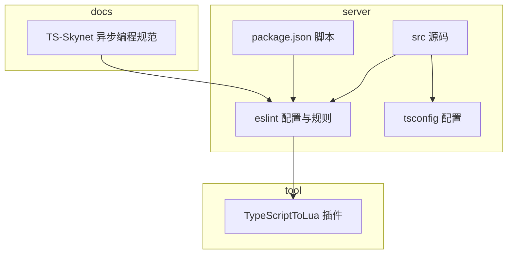
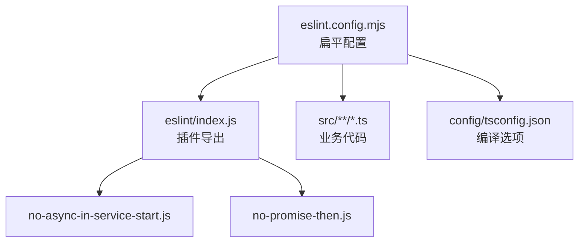
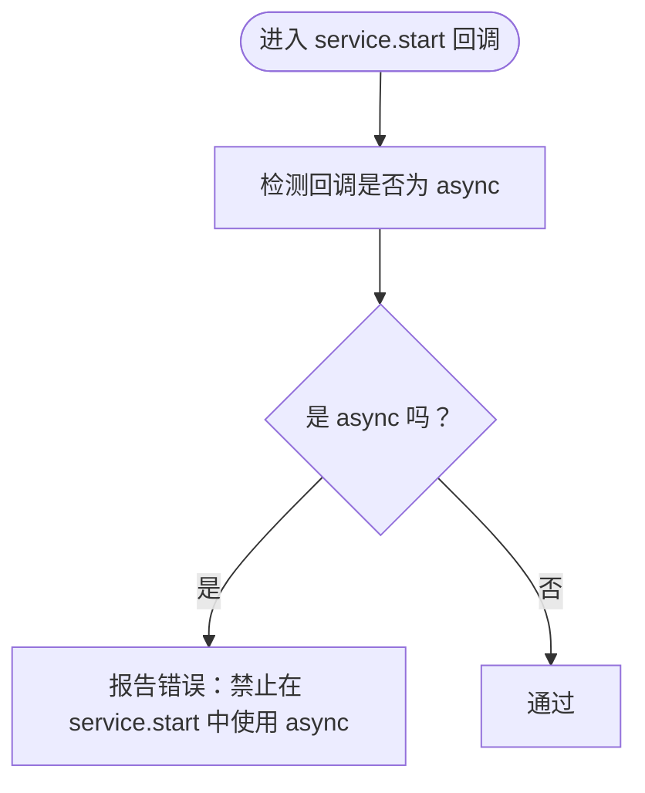
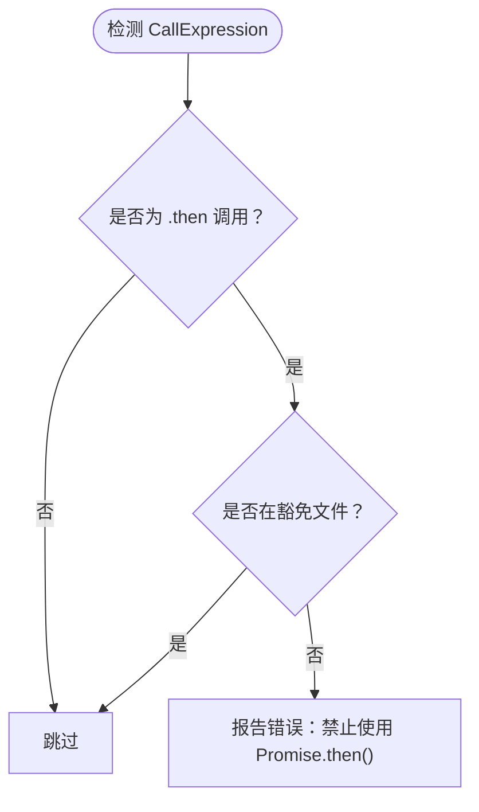
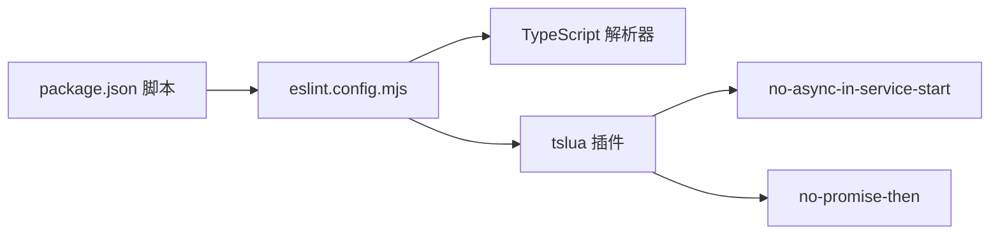

# 编码规范

<cite>
**本文引用的文件**   
- [server/.eslintrc.cjs](file://server/.eslintrc.cjs)
- [server/eslint.config.mjs](file://server/eslint.config.mjs)
- [server/eslint/index.js](file://server/eslint/index.js)
- [server/eslint/rules/no-async-in-service-start.js](file://server/eslint/rules/no-async-in-service-start.js)
- [server/eslint/rules/no-promise-then.js](file://server/eslint/rules/no-promise-then.js)
- [server/package.json](file://server/package.json)
- [server/config/tsconfig.json](file://server/config/tsconfig.json)
- [server/src/app/main.ts](file://server/src/app/main.ts)
- [server/src/framework/runtime/skynet-adapter.ts](file://server/src/framework/runtime/skynet-adapter.ts)
- [docs/TS-Skynet 异步编程规范.md](file://docs/TS-Skynet 异步编程规范.md)
- [tool/TypeScriptToLua_skynet/.editorconfig](file://tool/TypeScriptToLua_skynet/.editorconfig)
</cite>

## 目录
1. [简介](#简介)
2. [项目结构](#项目结构)
3. [核心组件](#核心组件)
4. [架构总览](#架构总览)
5. [详细组件分析](#详细组件分析)
6. [依赖关系分析](#依赖关系分析)
7. [性能考量](#性能考量)
8. [故障排查指南](#故障排查指南)
9. [结论](#结论)
10. [附录](#附录)

## 简介
本规范面向 TS-Skynet 混合开发框架的 TypeScript 代码，聚焦于在 TypeScript 编译至 Lua 的约束下，确保代码在 Skynet 协程模型与运行时环境下稳定、可维护地工作。内容涵盖命名约定、缩进与格式、注释与文档注释、ESLint 规则配置与使用、风格检查与自动修复流程，并结合项目中的自定义规则与最佳实践，给出正反面示例的定位路径，便于团队统一风格与质量。

## 项目结构
本项目采用“前端/后端/工具链”三层组织：
- server：TypeScript 源码、ESLint 配置与自定义规则、构建与运行脚本
- tool/TypeScriptToLua_skynet：TypeScriptToLua 插件与相关工具
- docs：框架与规范文档
- protocols/tables：协议与配置表生成工具链

**图示来源**
- [server/.eslintrc.cjs:1-35](file://server/.eslintrc.cjs#L1-L35)
- [server/eslint.config.mjs:1-40](file://server/eslint.config.mjs#L1-L40)
- [server/config/tsconfig.json:1-26](file://server/config/tsconfig.json#L1-L26)
- [server/package.json:1-51](file://server/package.json#L1-L51)
- [docs/TS-Skynet 异步编程规范.md:1-1154](file://docs/TS-Skynet 异步编程规范.md#L1-L1154)

**章节来源**
- [server/.eslintrc.cjs:1-35](file://server/.eslintrc.cjs#L1-L35)
- [server/eslint.config.mjs:1-40](file://server/eslint.config.mjs#L1-L40)
- [server/config/tsconfig.json:1-26](file://server/config/tsconfig.json#L1-L26)
- [server/package.json:1-51](file://server/package.json#L1-L51)

## 核心组件
- ESLint 配置与插件
  - 采用扁平配置（eslint.config.mjs）与插件化规则集（eslint/index.js），启用 TypeScript 推荐规则与自定义规则。
  - 关键规则：禁止在 service.start 中使用 async、禁止使用 Promise.then、禁止动态 require、禁止 BigInt、禁止字符串 length、禁止 NaN 作为 Map 键等。
- TypeScript 编译配置
  - 严格模式、CommonJS 目标、Node 解析、声明文件生成、SourceMap 等，确保与运行时兼容。
- 运行时与异步模型
  - 通过 skynet-adapter.ts 封装日志、定时器、网络、服务等能力；强调 service.start 必须同步、dispatch 回调可使用 async。
- CLI 与脚本
  - 通过 package.json 的 lint/lint:fix 脚本进行风格检查与自动修复。

**章节来源**
- [server/eslint.config.mjs:1-40](file://server/eslint.config.mjs#L1-L40)
- [server/eslint/index.js:1-52](file://server/eslint/index.js#L1-L52)
- [server/.eslintrc.cjs:1-35](file://server/.eslintrc.cjs#L1-L35)
- [server/config/tsconfig.json:1-26](file://server/config/tsconfig.json#L1-L26)
- [server/src/framework/runtime/skynet-adapter.ts:1-221](file://server/src/framework/runtime/skynet-adapter.ts#L1-L221)
- [server/package.json:1-51](file://server/package.json#L1-L51)

## 架构总览
下图展示 ESLint 配置、自定义规则与源码的关系，以及与 TypeScript 编译配置的衔接。

**图示来源**
- [server/eslint.config.mjs:1-40](file://server/eslint.config.mjs#L1-L40)
- [server/eslint/index.js:1-52](file://server/eslint/index.js#L1-L52)
- [server/eslint/rules/no-async-in-service-start.js:1-81](file://server/eslint/rules/no-async-in-service-start.js#L1-L81)
- [server/eslint/rules/no-promise-then.js:1-76](file://server/eslint/rules/no-promise-then.js#L1-L76)
- [server/config/tsconfig.json:1-26](file://server/config/tsconfig.json#L1-L26)

## 详细组件分析

### 命名约定
- 变量与函数
  - 使用 camelCase，语义清晰且避免缩写。
  - 异步函数以 async/await 为主，避免 .then 链。
- 类与接口
  - 类名使用 PascalCase；接口名使用 I 前缀 + PascalCase，如 ILogger、ITimer。
- 常量
  - 使用 UPPER_SNAKE_CASE，如 MAX_RETRY。
- 文件与模块
  - 源文件使用 .ts；测试文件 .spec.ts；配置文件按用途命名（如 tsconfig.json）。
- 路径别名
  - 使用 @/* 作为 src 根路径别名，提升可读性与迁移灵活性。

**章节来源**
- [server/config/tsconfig.json:19-21](file://server/config/tsconfig.json#L19-L21)

### 代码缩进与格式
- 缩进与空格
  - 统一使用 4 空格缩进；YAML/Markdown 使用 2 空格缩进。
  - 行尾换行使用 LF；末尾插入换行；去除尾随空白。
- 字符集与编码
  - 统一 UTF-8；保留最终换行。
- EditorConfig 与 Prettier
  - 仓库提供 .editorconfig 与 .prettierrc/.prettierignore（位于工具链目录），建议在 IDE 中启用 EditorConfig 与保存时格式化。

**章节来源**
- [tool/TypeScriptToLua_skynet/.editorconfig:1-13](file://tool/TypeScriptToLua_skynet/.editorconfig#L1-L13)

### 注释规范与文档注释
- 单行注释
  - 使用 //，注释与代码之间保留一个空格；简要说明逻辑意图或风险。
- 多行注释
  - 使用 /* ... */，用于复杂算法或跨模块说明。
- JSDoc 文档注释
  - 对公共接口、类、函数、枚举、类型别名等使用 JSDoc 注释，包含 @param、@returns、@throws、@example 等标签。
- 特殊注释
  - @noSelfInFile 用于模块文件顶部，避免 this 指针污染。
  - TODO/FIXME 使用统一格式，标注责任人与截止日期。

**章节来源**
- [server/src/app/main.ts:1-106](file://server/src/app/main.ts#L1-L106)

### ESLint 规则配置与使用
- 配置文件
  - 扁平配置：eslint.config.mjs，启用官方推荐规则与自定义插件。
  - 传统配置：.eslintrc.cjs，兼容旧版 ESLint。
- 插件与规则
  - 插件名称：tslua；规则集合由 eslint/index.js 导出。
  - 核心规则：
    - no-async-in-service-start：禁止在 service.start 回调中使用 async。
    - no-promise-then：禁止使用 Promise.then，推荐 async/await。
    - no-dynamic-require：禁止动态 require 路径。
    - no-bigint：禁止 BigInt（Lua 不支持）。
    - no-string-length：禁止使用 str.length（字节 vs 字符）。
    - no-nan-map-key：禁止 NaN 作为 Map 键。
    - no-conditional-require：条件 require 警告。
    - no-advanced-regex：高级正则特性警告。
    - no-strict-null-compare / no-implicit-null-check：空值判断警告。
- 规则等级
  - error：no-async-in-service-start、no-promise-then、no-dynamic-require、no-bigint、no-string-length、no-nan-map-key。
  - warn：no-conditional-require、no-advanced-regex、no-strict-null-compare、no-implicit-null-check、no-floating-point-compare。

**章节来源**
- [server/eslint.config.mjs:1-40](file://server/eslint.config.mjs#L1-L40)
- [server/eslint/index.js:1-52](file://server/eslint/index.js#L1-L52)
- [server/.eslintrc.cjs:1-35](file://server/.eslintrc.cjs#L1-L35)

### 自定义规则详解

#### no-async-in-service-start
- 目的：Skynet 服务初始化阶段要求同步完成，async 会导致服务启动后立即退出。
- 检测范围：runtime.service.start 或 service.start 的回调参数。
- 修复建议：将异步引导逻辑提取为独立 async 函数，同步回调中调用该函数并捕获错误，必要时退出服务。

**图示来源**
- [server/eslint/rules/no-async-in-service-start.js:24-80](file://server/eslint/rules/no-async-in-service-start.js#L24-L80)

**章节来源**
- [server/eslint/rules/no-async-in-service-start.js:1-81](file://server/eslint/rules/no-async-in-service-start.js#L1-L81)
- [server/src/app/main.ts:89-105](file://server/src/app/main.ts#L89-L105)

#### no-promise-then
- 目的：Skynet 环境中 .then 回调不在协程管理下，服务退出时会导致“无法恢复死协程”错误。
- 检测范围：所有 .then 调用。
- 例外：框架底层文件（Promise polyfill 与接口定义）豁免。
- 修复建议：改用 async/await；若必须使用 then，请在框架底层实现中处理。

**图示来源**
- [server/eslint/rules/no-promise-then.js:37-75](file://server/eslint/rules/no-promise-then.js#L37-L75)

**章节来源**
- [server/eslint/rules/no-promise-then.js:1-76](file://server/eslint/rules/no-promise-then.js#L1-L76)

### 代码风格检查与自动修复流程
- 检查命令
  - npm run lint：对 src 下 .ts 文件进行风格检查。
  - npm run lint:fix：在允许自动修复的规则范围内进行自动修复。
- 流程建议
  - 提交前执行 lint:fix，确保 CI 通过。
  - 对于不可自动修复的规则（如 no-async-in-service-start、no-promise-then），需手动调整代码结构。

**章节来源**
- [server/package.json:24-25](file://server/package.json#L24-L25)

### 具体示例与反面案例
- 正面案例（定位路径）
  - 服务启动与保活：[server/src/app/main.ts:89-105](file://server/src/app/main.ts#L89-L105)
  - dispatch 回调使用 async：[server/src/framework/runtime/skynet-adapter.ts:139-150](file://server/src/framework/runtime/skynet-adapter.ts#L139-L150)
  - 异步编程规范与替代写法：[docs/TS-Skynet 异步编程规范.md:20-166](file://docs/TS-Skynet 异步编程规范.md#L20-L166)
- 反面案例（定位路径）
  - 在 service.start 中使用 async：[server/src/app/main.ts](file://server/src/app/main.ts#L91)
  - 使用 Promise.then：[docs/TS-Skynet 异步编程规范.md:20-41](file://docs/TS-Skynet 异步编程规范.md#L20-L41)
  - 动态 require：[docs/TS-Skynet 异步编程规范.md:355-400](file://docs/TS-Skynet 异步编程规范.md#L355-L400)
  - 使用 BigInt：[docs/TS-Skynet 异步编程规范.md:594-610](file://docs/TS-Skynet 异步编程规范.md#L594-L610)
  - 使用 str.length：[docs/TS-Skynet 异步编程规范.md:650-714](file://docs/TS-Skynet 异步编程规范.md#L650-L714)
  - NaN 作为 Map 键：[docs/TS-Skynet 异步编程规范.md:716-783](file://docs/TS-Skynet 异步编程规范.md#L716-L783)

**章节来源**
- [server/src/app/main.ts:89-105](file://server/src/app/main.ts#L89-L105)
- [server/src/framework/runtime/skynet-adapter.ts:139-150](file://server/src/framework/runtime/skynet-adapter.ts#L139-L150)
- [docs/TS-Skynet 异步编程规范.md:20-166](file://docs/TS-Skynet 异步编程规范.md#L20-L166)

## 依赖关系分析
- ESLint 与 TypeScript
  - eslint.config.mjs 通过 TypeScript ESLint 解析器与推荐规则，结合自定义插件与规则集。
- 规则与运行时
  - 自定义规则针对 Skynet 协程模型与 TSTL 编译特性，避免运行时崩溃与跨语言差异。
- 脚本与流程
  - package.json 的 lint/lint:fix 与 start.sh 脚本配合，形成开发与部署流程中的质量门禁。

**图示来源**
- [server/eslint.config.mjs:1-40](file://server/eslint.config.mjs#L1-L40)
- [server/eslint/index.js:1-52](file://server/eslint/index.js#L1-L52)
- [server/package.json:24-25](file://server/package.json#L24-L25)

**章节来源**
- [server/eslint.config.mjs:1-40](file://server/eslint.config.mjs#L1-L40)
- [server/eslint/index.js:1-52](file://server/eslint/index.js#L1-L52)
- [server/package.json:1-51](file://server/package.json#L1-L51)

## 性能考量
- 避免高频创建协程
  - 使用 safeTimeout/safeImmediate 时注意性能影响，避免过度使用导致协程开销增大。
- 选择合适的异步模式
  - dispatch 回调可使用 async/await；service.start 必须同步，避免阻塞消息循环。
- 编译与运行时差异
  - 遵循规范文档中的跨语言差异说明，减少运行时错误与调试成本。

[本节为通用指导，无需特定文件来源]

## 故障排查指南
- ESLint 报错
  - no-async-in-service-start：将异步引导逻辑移出 service.start 回调，改为同步启动并在内部调用异步函数。
  - no-promise-then：替换为 async/await；若确需 then，请在框架底层实现中处理。
  - no-dynamic-require/no-conditional-require：改为静态导入或映射表。
  - no-bigint/no-string-length/no-nan-map-key：遵循替代方案与类型约束。
- 运行时崩溃
  - 若出现“无法恢复死协程”，检查是否存在 .then 回调在服务退出时仍在运行。
- 编译错误
  - 确认 tsconfig.json 的 strict、module、target 等选项与运行时兼容。

**章节来源**
- [server/eslint/rules/no-async-in-service-start.js:1-81](file://server/eslint/rules/no-async-in-service-start.js#L1-L81)
- [server/eslint/rules/no-promise-then.js:1-76](file://server/eslint/rules/no-promise-then.js#L1-L76)
- [docs/TS-Skynet 异步编程规范.md:1-1154](file://docs/TS-Skynet 异步编程规范.md#L1-L1154)

## 结论
本规范以 ESLint 自定义规则为核心，结合 TypeScriptToLua 与 Skynet 的运行时特性，明确了命名、格式、注释与风格检查流程。通过正反面示例与自动修复脚本，确保团队在跨语言编译与协程模型下编写高质量、可维护的代码。

[本节为总结，无需特定文件来源]

## 附录
- 相关文件清单
  - ESLint 配置与规则：[server/eslint.config.mjs:1-40](file://server/eslint.config.mjs#L1-L40)、[server/eslint/index.js:1-52](file://server/eslint/index.js#L1-L52)、[server/eslint/rules/no-async-in-service-start.js:1-81](file://server/eslint/rules/no-async-in-service-start.js#L1-L81)、[server/eslint/rules/no-promise-then.js:1-76](file://server/eslint/rules/no-promise-then.js#L1-L76)
  - TypeScript 配置：[server/config/tsconfig.json:1-26](file://server/config/tsconfig.json#L1-L26)
  - 示例与规范：[server/src/app/main.ts:1-106](file://server/src/app/main.ts#L1-L106)、[server/src/framework/runtime/skynet-adapter.ts:1-221](file://server/src/framework/runtime/skynet-adapter.ts#L1-L221)、[docs/TS-Skynet 异步编程规范.md:1-1154](file://docs/TS-Skynet 异步编程规范.md#L1-L1154)
  - 脚本与工具：[server/package.json:1-51](file://server/package.json#L1-L51)、[tool/TypeScriptToLua_skynet/.editorconfig:1-13](file://tool/TypeScriptToLua_skynet/.editorconfig#L1-L13)

[本节为附录，无需特定文件来源]