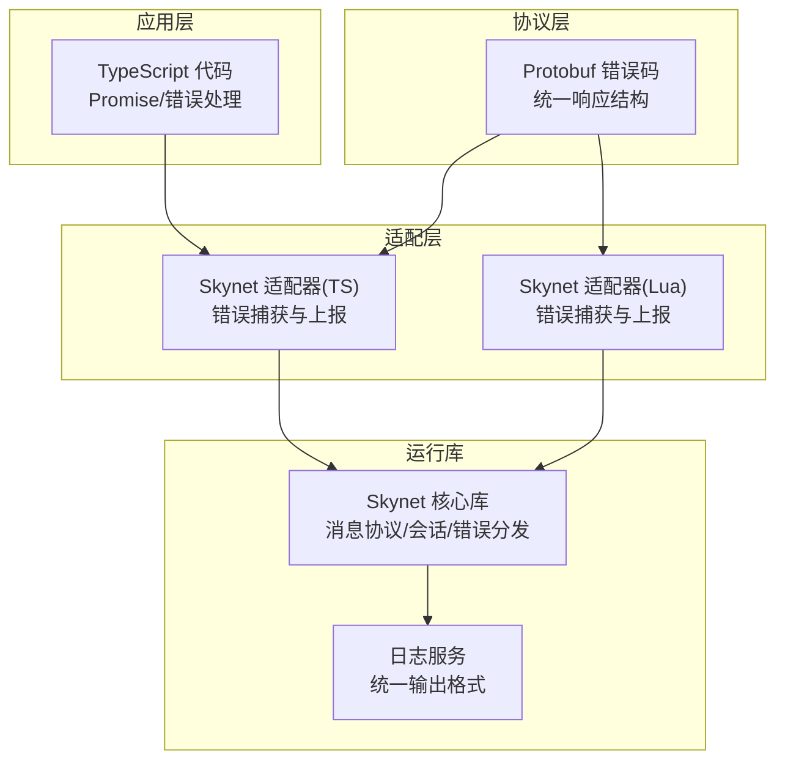
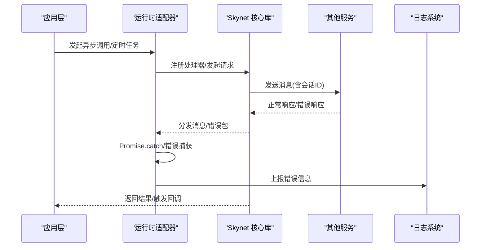
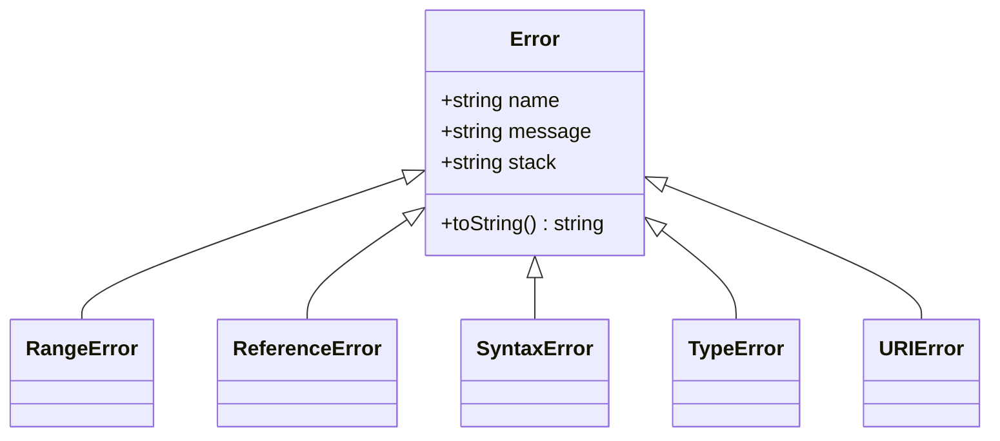
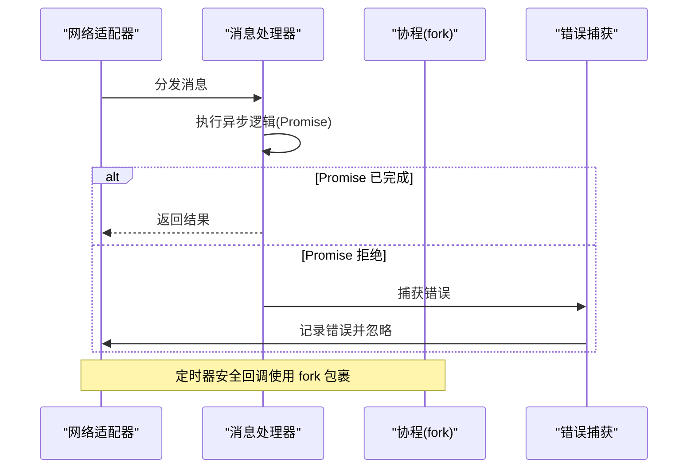
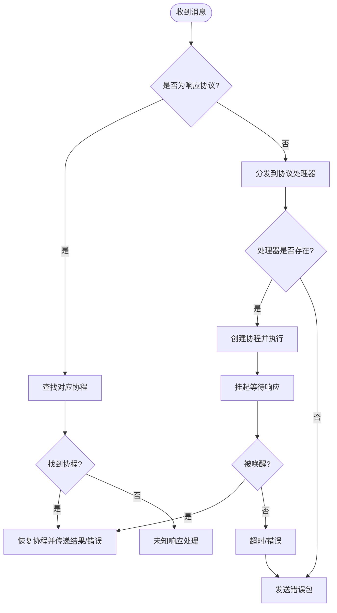
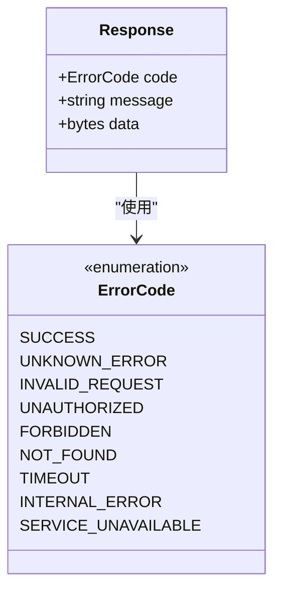
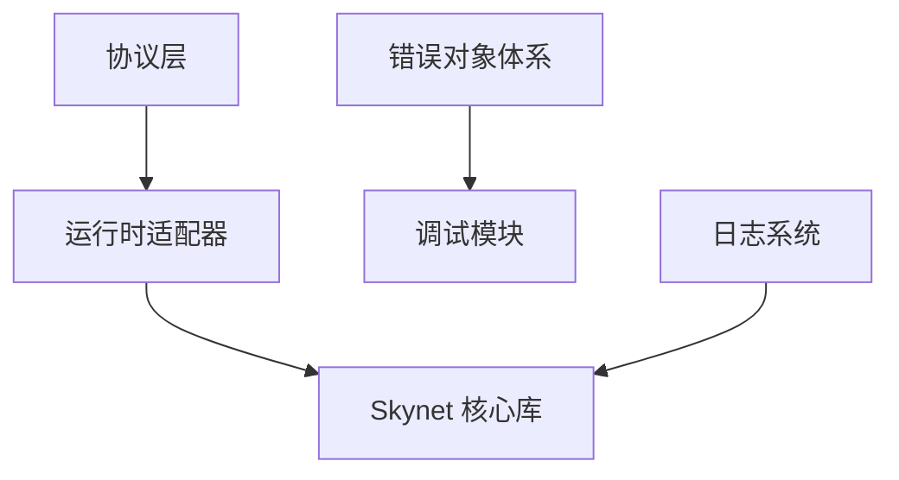

# 错误处理规范

<cite>
**本文档引用的文件**
- [skynet-adapter.ts](file://server/src/framework/runtime/skynet-adapter.ts)
- [skynet.lua](file://docker/skynet/lualib/skynet.lua)
- [Error.ts](file://tool/TypeScriptToLua_skynet/src/lualib/Error.ts)
- [common.proto](file://protocols/proto/common.proto)
- [skynet-adapter.lua](file://docker/lua/framework/runtime/skynet-adapter.lua)
- [SetTimeoutSkynet.ts](file://tool/TypeScriptToLua_skynet/src/lualib/SetTimeoutSkynet.ts)
- [service_logger.c](file://docker/skynet/service-src/service_logger.c)
- [ldo.c](file://docker/skynet/3rd/lua/ldo.c)
- [async-bridge.ts](file://server/src/framework/runtime/async-bridge.ts)
- [Promise.ts](file://tool/TypeScriptToLua_skynet/src/lualib/Promise.ts)
- [PromiseAny.ts](file://tool/TypeScriptToLua_skynet/src/lualib/PromiseAny.ts)
- [error.spec.ts](file://tool/TypeScriptToLua_skynet/test/unit/error.spec.ts)
</cite>

## 目录
1. [简介](#简介)
2. [项目结构](#项目结构)
3. [核心组件](#核心组件)
4. [架构概览](#架构概览)
5. [详细组件分析](#详细组件分析)
6. [依赖关系分析](#依赖关系分析)
7. [性能考虑](#性能考虑)
8. [故障排查指南](#故障排查指南)
9. [结论](#结论)

## 简介
本规范旨在建立完整的错误处理与异常管理标准，覆盖业务错误、系统错误、网络错误等各类错误的分类与处理策略，统一错误对象定义与错误码规范，明确错误传播机制与恢复策略，并提供日志记录与错误报告的最佳实践。文档同时包含错误处理的代码模板与常见错误场景的解决方案，帮助开发者在 TypeScript 到 Lua 的 Skynet 项目中构建一致、可靠且可维护的错误处理体系。

## 项目结构
本项目的错误处理涉及多个层面：
- 运行时适配层：Skynet 运行时适配器负责将 TypeScript 的 Promise 与 Skynet 的协程模型对接，并统一错误上报。
- 核心运行库：Skynet Lua 核心库提供消息协议、会话管理、错误分发与协程调度机制。
- 类型转换层：TypeScriptToLua 将 TypeScript 的错误与 Promise 语义转换为 Lua 的错误栈与协程处理。
- 协议层：Protobuf 定义统一的错误码枚举与响应结构，确保跨语言一致性。
- 日志层：Skynet 日志服务与自定义日志实现提供统一的日志输出与格式化能力。

**图表来源**
- [skynet-adapter.ts:139-150](file://server/src/framework/runtime/skynet-adapter.ts#L139-L150)
- [skynet.lua:1050-1056](file://docker/skynet/lualib/skynet.lua#L1050-L1056)
- [common.proto:19-38](file://protocols/proto/common.proto#L19-L38)

**章节来源**
- [skynet-adapter.ts:1-221](file://server/src/framework/runtime/skynet-adapter.ts#L1-L221)
- [skynet.lua:1-1190](file://docker/skynet/lualib/skynet.lua#L1-L1190)
- [common.proto:1-38](file://protocols/proto/common.proto#L1-L38)

## 核心组件
本节概述错误处理的关键组件及其职责：
- 错误对象与类体系：基于 TypeScriptToLua 的错误类实现，提供标准的 Error、RangeError、ReferenceError、SyntaxError、TypeError、URIError 等类型，支持堆栈追踪与 toString 格式化。
- 运行时适配器：在 Skynet 环境中捕获 Promise 错误并统一上报；在定时器回调中进行错误保护；在网络调用中对异步处理进行错误捕获。
- 核心运行库：Skynet 提供 PTYPE_ERROR 协议与错误分发机制，当服务间通信出现异常或超时时，系统自动发送错误包并触发错误处理流程。
- 协议与错误码：Protobuf 中定义了统一的错误码枚举与响应结构，确保前后端一致的错误语义。
- 日志系统：Skynet 日志服务与自定义日志实现提供统一的时间戳、级别与参数格式化输出。

**章节来源**
- [Error.ts:59-93](file://tool/TypeScriptToLua_skynet/src/lualib/Error.ts#L59-L93)
- [skynet-adapter.ts:28-63](file://server/src/framework/runtime/skynet-adapter.ts#L28-L63)
- [skynet.lua:1050-1056](file://docker/skynet/lualib/skynet.lua#L1050-L1056)
- [common.proto:19-38](file://protocols/proto/common.proto#L19-L38)
- [service_logger.c:48-69](file://docker/skynet/service-src/service_logger.c#L48-L69)

## 架构概览
下图展示了从应用层到运行库的错误处理流程，包括错误捕获、传播与恢复的关键节点：

**图表来源**
- [skynet-adapter.ts:139-150](file://server/src/framework/runtime/skynet-adapter.ts#L139-L150)
- [skynet.lua:901-961](file://docker/skynet/lualib/skynet.lua#L901-L961)
- [service_logger.c:48-69](file://docker/skynet/service-src/service_logger.c#L48-L69)

## 详细组件分析

### 组件A：错误对象与类体系
- 设计要点
  - 基于元表重写 __tostring，结合堆栈追踪，确保错误信息包含上下文。
  - 支持标准 JavaScript 错误类型，便于与现有工具链兼容。
  - 在 TypeScriptToLua 编译后，错误对象在 Lua 环境中保持一致的行为与格式。
- 复杂度与性能
  - 错误构造与堆栈生成存在 O(n) 开销，建议仅在必要时启用详细堆栈。
- 依赖关系
  - 依赖调试模块获取堆栈信息；在不同 Lua 版本下采用不同的追踪策略。

**图表来源**
- [Error.ts:59-93](file://tool/TypeScriptToLua_skynet/src/lualib/Error.ts#L59-L93)

**章节来源**
- [Error.ts:38-93](file://tool/TypeScriptToLua_skynet/src/lualib/Error.ts#L38-L93)
- [error.spec.ts:301-308](file://tool/TypeScriptToLua_skynet/test/unit/error.spec.ts#L301-L308)

### 组件B：运行时适配器的错误处理
- 设计要点
  - 在网络分发中对 Promise 回调进行错误捕获，避免未处理的拒绝导致进程异常。
  - 在定时器安全回调中包裹 fork 协程，确保回调中的异步操作在受控环境中执行。
  - 在服务启动阶段对 Promise 错误进行捕获并上报，防止启动失败影响服务生命周期。
- 处理策略
  - 对于 Promise 拒绝：统一捕获并记录错误，避免抛出到全局。
  - 对于定时器回调：在 fork 协程内执行，隔离错误影响范围。
  - 对于网络调用：在分发处理器中捕获错误，保证消息循环稳定。

**图表来源**
- [skynet-adapter.ts:139-150](file://server/src/framework/runtime/skynet-adapter.ts#L139-L150)
- [skynet-adapter.ts:100-122](file://server/src/framework/runtime/skynet-adapter.ts#L100-L122)
- [skynet-adapter.ts:161-174](file://server/src/framework/runtime/skynet-adapter.ts#L161-L174)

**章节来源**
- [skynet-adapter.ts:139-174](file://server/src/framework/runtime/skynet-adapter.ts#L139-L174)
- [SetTimeoutSkynet.ts:33-58](file://tool/TypeScriptToLua_skynet/src/lualib/SetTimeoutSkynet.ts#L33-L58)

### 组件C：Skynet 核心库的错误传播机制
- 设计要点
  - PTYPE_ERROR 协议用于服务间传递错误信息，当目标服务不可达或响应失败时，系统自动发送错误包。
  - 错误分发通过会话映射与队列机制实现，确保错误能够正确路由到等待方。
  - 协程挂起与恢复过程中，错误会触发堆栈追踪与资源清理。
- 处理策略
  - 未知请求/响应：记录详细信息并抛出错误，防止静默失败。
  - 服务终止：向所有相关方发送错误包，确保调用方感知失败。
  - 超时与唤醒：通过会话队列与唤醒队列协调，避免资源泄漏。

**图表来源**
- [skynet.lua:901-961](file://docker/skynet/lualib/skynet.lua#L901-L961)
- [skynet.lua:1050-1056](file://docker/skynet/lualib/skynet.lua#L1050-L1056)

**章节来源**
- [skynet.lua:901-961](file://docker/skynet/lualib/skynet.lua#L901-L961)
- [skynet.lua:1050-1056](file://docker/skynet/lualib/skynet.lua#L1050-L1056)

### 组件D：协议与错误码规范
- 设计要点
  - Protobuf 中定义统一的错误码枚举，涵盖成功、未知错误、无效请求、未授权、禁止访问、未找到、超时、内部错误、服务不可用等场景。
  - 响应结构包含错误码、错误信息与数据载荷，便于客户端统一解析。
- 使用建议
  - 业务层应优先使用预定义的错误码，避免自定义错误码破坏一致性。
  - 错误信息应简洁明确，避免泄露敏感信息。

**图表来源**
- [common.proto:19-38](file://protocols/proto/common.proto#L19-L38)

**章节来源**
- [common.proto:19-38](file://protocols/proto/common.proto#L19-L38)

### 组件E：日志记录与错误报告最佳实践
- 设计要点
  - 自定义日志实现提供统一的时间戳、级别与参数格式化输出。
  - Skynet 日志服务支持文本协议与文件输出，便于生产环境持久化。
- 最佳实践
  - 错误日志应包含时间戳、服务标识、错误码、错误信息与堆栈摘要。
  - 对于高频错误，建议采用采样或聚合策略，避免日志风暴。
  - 敏感信息不应直接写入日志，需进行脱敏处理。

**章节来源**
- [skynet-adapter.ts:28-63](file://server/src/framework/runtime/skynet-adapter.ts#L28-L63)
- [service_logger.c:48-69](file://docker/skynet/service-src/service_logger.c#L48-L69)

## 依赖关系分析
- 组件耦合
  - 运行时适配器依赖 Skynet 核心库的消息协议与协程机制。
  - 错误对象与类体系依赖调试模块以生成堆栈信息。
  - 协议层为上层提供统一的错误语义，降低跨语言差异。
- 外部依赖
  - Skynet 核心库提供底层的协程、会话与消息分发能力。
  - TypeScriptToLua 提供 TypeScript 到 Lua 的编译与运行时支持。

**图表来源**
- [skynet-adapter.ts:1-221](file://server/src/framework/runtime/skynet-adapter.ts#L1-L221)
- [Error.ts:59-93](file://tool/TypeScriptToLua_skynet/src/lualib/Error.ts#L59-L93)
- [common.proto:19-38](file://protocols/proto/common.proto#L19-L38)
- [service_logger.c:48-69](file://docker/skynet/service-src/service_logger.c#L48-L69)

**章节来源**
- [skynet-adapter.ts:1-221](file://server/src/framework/runtime/skynet-adapter.ts#L1-L221)
- [Error.ts:59-93](file://tool/TypeScriptToLua_skynet/src/lualib/Error.ts#L59-L93)
- [common.proto:19-38](file://protocols/proto/common.proto#L19-L38)
- [service_logger.c:48-69](file://docker/skynet/service-src/service_logger.c#L48-L69)

## 性能考虑
- 错误对象构造与堆栈生成可能带来额外开销，建议仅在开发与调试阶段启用详细堆栈。
- Promise 错误捕获与日志上报应尽量轻量，避免阻塞事件循环。
- 在高并发场景下，错误日志应采用异步写入或缓冲策略，减少 I/O 压力。

## 故障排查指南
- 常见问题
  - 未处理的 Promise 拒绝：检查运行时适配器中的错误捕获逻辑，确保所有 Promise 都有 catch 或 await。
  - 服务间通信失败：确认 PTYPE_ERROR 协议是否正确分发，检查会话映射与队列状态。
  - 超时与资源泄漏：验证超时与唤醒队列的协调机制，确保超时后及时清理资源。
- 排查步骤
  - 启用详细日志，定位错误发生的服务与时间点。
  - 检查错误码与错误信息，确认是否符合预期。
  - 复核协议定义与消息序列化，排除协议不一致导致的问题。

**章节来源**
- [skynet-adapter.ts:139-174](file://server/src/framework/runtime/skynet-adapter.ts#L139-L174)
- [skynet.lua:901-961](file://docker/skynet/lualib/skynet.lua#L901-L961)
- [async-bridge.ts:47-71](file://server/src/framework/runtime/async-bridge.ts#L47-L71)

## 结论
通过统一的错误对象体系、运行时适配器的错误捕获与上报、Skynet 核心库的错误传播机制以及协议层的错误码规范，本项目建立了完整且可扩展的错误处理框架。遵循本文档的规范与最佳实践，可以在 TypeScript 到 Lua 的 Skynet 环境中实现一致、可靠且高效的错误管理，提升系统的稳定性与可观测性。