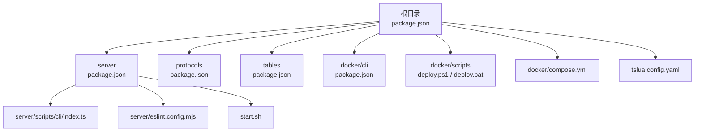
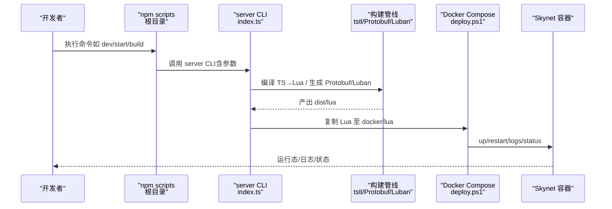
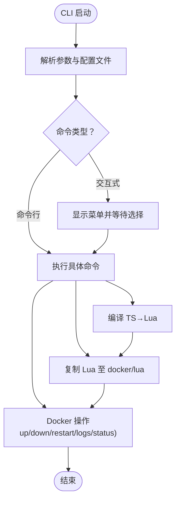
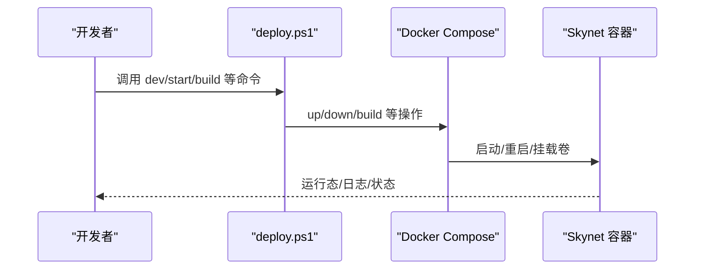
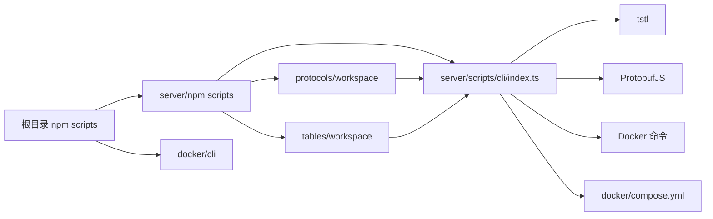

# 工作流自动化

<cite>
**本文引用的文件**   
- [package.json](file://package.json)
- [server/package.json](file://server/package.json)
- [protocols/package.json](file://protocols/package.json)
- [tables/package.json](file://tables/package.json)
- [docker/cli/package.json](file://docker/cli/package.json)
- [server/scripts/cli/index.ts](file://server/scripts/cli/index.ts)
- [docker/cli/index.js](file://docker/cli/index.js)
- [docker/scripts/deploy.ps1](file://docker/scripts/deploy.ps1)
- [docker/scripts/deploy.bat](file://docker/scripts/deploy.bat)
- [start.sh](file://start.sh)
- [tslua.config.yaml](file://tslua.config.yaml)
- [server/eslint.config.mjs](file://server/eslint.config.mjs)
- [docker/compose.yml](file://docker/compose.yml)
</cite>

## 目录
1. [简介](#简介)
2. [项目结构](#项目结构)
3. [核心组件](#核心组件)
4. [架构总览](#架构总览)
5. [详细组件分析](#详细组件分析)
6. [依赖关系分析](#依赖关系分析)
7. [性能考虑](#性能考虑)
8. [故障排查指南](#故障排查指南)
9. [结论](#结论)
10. [附录](#附录)

## 简介
本指南面向开发团队，系统性介绍本项目的“工作流自动化”实施方案，涵盖以下方面：
- npm scripts 的使用与自定义：常用命令组合、别名设置与最佳实践
- CLI 工具的功能与使用：跨平台命令行工具、交互式菜单与参数传递
- Git 钩子配置：pre-commit、pre-push 等自动化检查建议
- CI/CD 流水线：GitHub Actions、Jenkins 等平台集成方案与步骤
- 代码质量与测试：ESLint 规则、类型检查与自动化测试流程
- 自动化部署：Docker Compose、Windows PowerShell 脚本与跨平台启动
- 工作流优化与性能调优：并行任务、缓存策略与日志可观测性

## 项目结构
项目采用多工作区（monorepo）组织方式，核心目录与职责如下：
- 根目录：聚合脚本与顶层 npm scripts，统一入口与别名
- server：TypeScript 源码、CLI 工具、构建与运行脚本
- protocols：Protobuf 定义与生成脚本
- tables：Luban 配置表与生成脚本
- docker：Docker 镜像构建、Compose 配置与部署脚本
- docs：项目文档与使用说明

**图表来源**
- [package.json:11-37](file://package.json#L11-L37)
- [server/package.json:6-26](file://server/package.json#L6-L26)
- [protocols/package.json:6-9](file://protocols/package.json#L6-L9)
- [tables/package.json:6-9](file://tables/package.json#L6-L9)
- [docker/cli/package.json:1-15](file://docker/cli/package.json#L1-L15)
- [docker/scripts/deploy.ps1:1-430](file://docker/scripts/deploy.ps1#L1-L430)
- [docker/scripts/deploy.bat:1-58](file://docker/scripts/deploy.bat#L1-L58)
- [docker/compose.yml:1-70](file://docker/compose.yml#L1-L70)
- [tslua.config.yaml:1-52](file://tslua.config.yaml#L1-L52)

**章节来源**
- [package.json:11-37](file://package.json#L11-L37)
- [server/package.json:6-26](file://server/package.json#L6-L26)
- [docker/compose.yml:1-70](file://docker/compose.yml#L1-L70)

## 核心组件
- 根级 npm scripts：提供统一入口与别名，便于跨平台使用
- server CLI 工具：TypeScript 实现的跨平台命令行工具，支持交互菜单与多种命令
- Protobuf/Luban 构建：分别在 protocols 与 tables 工作区内执行生成
- Docker 部署：Windows PowerShell 脚本与 Compose 配置，支持开发/生产双模式
- ESLint 规则：针对 TypeScript 与 Skynet 运行时约束的定制规则集

**章节来源**
- [package.json:11-37](file://package.json#L11-L37)
- [server/scripts/cli/index.ts:301-354](file://server/scripts/cli/index.ts#L301-L354)
- [server/eslint.config.mjs:1-40](file://server/eslint.config.mjs#L1-L40)
- [docker/scripts/deploy.ps1:416-429](file://docker/scripts/deploy.ps1#L416-L429)
- [docker/compose.yml:64-70](file://docker/compose.yml#L64-L70)

## 架构总览
下图展示从开发者命令到容器运行的整体工作流：

**图表来源**
- [package.json:11-37](file://package.json#L11-L37)
- [server/scripts/cli/index.ts:547-571](file://server/scripts/cli/index.ts#L547-L571)
- [docker/scripts/deploy.ps1:332-366](file://docker/scripts/deploy.ps1#L332-L366)
- [docker/compose.yml:6-63](file://docker/compose.yml#L6-L63)

## 详细组件分析

### npm scripts 使用与自定义
- 常用命令组合
  - 开发：根目录脚本通过切换工作区并调用 server 内部脚本，形成统一入口
  - 构建：分别构建 TypeScript、Protobuf、配置表，再由 CLI 自动复制至 docker/lua
  - Docker：提供 init/build/start/stop/status/logs/copy 等命令，Windows 使用 PowerShell 脚本封装
- 别名设置
  - 将常用组合封装为别名，例如将“构建+启动”、“构建+部署”组合为单一命令
  - 在 CI 中通过环境变量或参数传递覆盖默认行为（如覆盖配置文件路径）

最佳实践
- 将“检查依赖→编译→复制→启动”的链路固化为单一命令，减少出错概率
- 对 Windows 用户提供 .bat/.ps1 包装脚本，Linux/macOS 使用 shell 脚本
- 在 CI 中使用“只在需要时才构建/拉起容器”的策略，避免重复开销

**章节来源**
- [package.json:11-37](file://package.json#L11-L37)
- [server/package.json:6-26](file://server/package.json#L6-L26)
- [docker/scripts/deploy.ps1:1-430](file://docker/scripts/deploy.ps1#L1-L430)
- [docker/scripts/deploy.bat:1-58](file://docker/scripts/deploy.bat#L1-L58)
- [start.sh:1-7](file://start.sh#L1-L7)

### CLI 工具功能与使用
- 功能概览
  - 交互式菜单：快速选择常用操作（启动/停止/重启/状态/日志/编译/构建/清理/热更新）
  - 命令行模式：支持直接传参执行（如 quick、status、build:ts 等）
  - 配置管理：支持 YAML/JSON 配置文件，可通过命令行覆盖路径
  - 跨平台：内部使用 spawn 与 shell，兼容 Windows CMD 与类 Unix bash
- 常用命令
  - quick：智能启动（检查依赖→编译→镜像/容器检查→启动）
  - build:ts：编译 TypeScript→Lua，并自动复制到 docker/lua
  - build:all：依次执行 Protobuf/Luban/TS 构建
  - start/stop/restart/status/logs：Docker 服务生命周期管理
  - hotfix：热更新服务代码（编译后复制到运行中的容器）
  - setup：初始化项目环境（创建目录、安装依赖、检查 Docker）
- 参数与配置
  - --config 指定配置文件；--paths.server/--build.sourceDir 等可覆盖路径
  - 支持环境变量 TSLUA_CONFIG 指向配置文件

**图表来源**
- [server/scripts/cli/index.ts:93-119](file://server/scripts/cli/index.ts#L93-L119)
- [server/scripts/cli/index.ts:122-193](file://server/scripts/cli/index.ts#L122-L193)
- [server/scripts/cli/index.ts:301-354](file://server/scripts/cli/index.ts#L301-L354)
- [server/scripts/cli/index.ts:427-496](file://server/scripts/cli/index.ts#L427-L496)
- [server/scripts/cli/index.ts:547-571](file://server/scripts/cli/index.ts#L547-L571)
- [server/scripts/cli/index.ts:694-707](file://server/scripts/cli/index.ts#L694-L707)

**章节来源**
- [server/scripts/cli/index.ts:1-745](file://server/scripts/cli/index.ts#L1-L745)
- [tslua.config.yaml:1-52](file://tslua.config.yaml#L1-L52)

### Git 钩子配置与使用
建议在 pre-commit 阶段执行：
- 代码格式化与静态检查（ESLint、类型检查）
- 单元测试与集成测试（根据项目实际）
- Protobuf/Luban 生成（如需在提交前生成）

在 pre-push 阶段执行：
- 全量测试与安全扫描
- 生成物校验（确保 dist/lua/ 等产物存在且符合预期）

最佳实践
- 使用 husky 或 githooks 管理钩子，避免在 CI 之外遗漏检查
- 将耗时任务拆分为多个小钩子，提升反馈速度
- 对大型变更使用“增量检查”，仅对改动文件运行相关检查

[本节为通用实践指导，不直接分析特定文件，故无“章节来源”]

### CI/CD 流水线配置建议
- GitHub Actions
  - 作业阶段建议：安装依赖 → TypeScript 类型检查 → ESLint → 单元测试 → Protobuf/Luban 生成 → 构建镜像 → 部署/推送镜像
  - 使用缓存策略：缓存 node_modules 与 Docker 层，减少重复构建时间
  - 安全与审计：启用依赖漏洞扫描与许可证检查
- Jenkins
  - 使用 Pipeline Script 或 Declarative Pipeline，分阶段执行构建、测试与部署
  - 结合 Docker Plugin 与 Kubernetes Plugin 实现弹性部署
- 多平台支持
  - Windows：使用 PowerShell 脚本（deploy.ps1）与 .bat 包装
  - Linux/macOS：使用 shell 脚本（start.sh）与 Compose

[本节为通用实践指导，不直接分析特定文件，故无“章节来源”]

### 代码质量检查与自动化测试
- ESLint 规则
  - 关闭对底层框架必要的 any 类型警告，开启 Skynet 运行时约束规则
  - 建议在 CI 中强制执行，失败即阻断合并
- 类型检查
  - 使用 TypeScript 编译器进行全量类型检查，确保跨语言转换（TS→Lua）的正确性
- 自动化测试
  - 在 server 工作区内配置测试框架（如 Jest），在 CI 中执行
  - 对 Protobuf/Luban 生成物进行回归测试，确保数据一致性

**章节来源**
- [server/eslint.config.mjs:1-40](file://server/eslint.config.mjs#L1-L40)

### 自动化部署流程
- 开发模式（volume 挂载）
  - 通过 Compose 的 dev profile 挂载 server/dist/lua → /skynet/lua，修改即生效
- 生产模式（镜像内嵌）
  - 先构建镜像，再启动容器；代码更新时通过 docker cp 部署
- Windows 部署脚本
  - deploy.ps1 提供 setup/build/start/dev/stop/restart/status/logs/deploy/shell/clean 等命令
  - deploy.bat 作为简化入口，调用 PowerShell 脚本

**图表来源**
- [docker/scripts/deploy.ps1:416-429](file://docker/scripts/deploy.ps1#L416-L429)
- [docker/compose.yml:6-63](file://docker/compose.yml#L6-L63)

**章节来源**
- [docker/scripts/deploy.ps1:1-430](file://docker/scripts/deploy.ps1#L1-L430)
- [docker/scripts/deploy.bat:1-58](file://docker/scripts/deploy.bat#L1-L58)
- [docker/compose.yml:1-70](file://docker/compose.yml#L1-L70)

## 依赖关系分析
- 根目录 npm scripts 依赖 server 内部脚本与 docker/cli 工具
- server CLI 依赖 TypeScriptToLua（tstl）、ProtobufJS、Docker 命令
- Protobuf/Luban 构建分别在各自工作区内执行，最终由 server CLI 复制到 docker/lua
- Docker Compose 定义了开发/生产两种运行模式，分别挂载不同路径

**图表来源**
- [package.json:11-37](file://package.json#L11-L37)
- [server/package.json:6-26](file://server/package.json#L6-L26)
- [docker/cli/package.json:1-15](file://docker/cli/package.json#L1-L15)
- [server/scripts/cli/index.ts:547-571](file://server/scripts/cli/index.ts#L547-L571)
- [docker/compose.yml:6-63](file://docker/compose.yml#L6-L63)

**章节来源**
- [package.json:11-37](file://package.json#L11-L37)
- [server/package.json:6-26](file://server/package.json#L6-L26)
- [docker/compose.yml:1-70](file://docker/compose.yml#L1-L70)

## 性能考虑
- 并行化构建
  - 将 Protobuf 与 Luban 生成与 TypeScript 编译并行执行，缩短总时长
- 缓存策略
  - CI 中缓存 node_modules 与 Docker 层；本地开发中复用已有依赖
- 增量构建
  - 仅对变更文件执行类型检查与测试，减少 CI 时间
- 容器优化
  - 开发模式使用 volume 挂载，避免频繁复制；生产模式预置代码，减少启动延迟
- 日志与可观测性
  - 在 CI 中收集构建日志与测试报告，便于定位问题

[本节提供通用性能建议，不直接分析特定文件，故无“章节来源”]

## 故障排查指南
- Docker 相关
  - 症状：Docker 未启动/Compose 不可用
  - 处理：检查 Docker Desktop 与 WSL2 后端；使用 deploy.ps1 的 help 查看路径说明
- TypeScript 编译
  - 症状：tstl 依赖缺失
  - 处理：在 server 目录安装依赖；确认 tsconfig.lua.json 存在并正确
- CLI 配置
  - 症状：路径解析错误
  - 处理：通过 --config 指定配置文件；或使用 --paths.* 覆盖路径
- 日志查看
  - 使用 CLI 的 logs 命令或 deploy.ps1 的 logs 命令查看实时日志

**章节来源**
- [docker/scripts/deploy.ps1:101-143](file://docker/scripts/deploy.ps1#L101-L143)
- [server/scripts/cli/index.ts:547-571](file://server/scripts/cli/index.ts#L547-L571)
- [tslua.config.yaml:1-52](file://tslua.config.yaml#L1-L52)

## 结论
本项目通过“根级 npm scripts + server CLI + Docker Compose + PowerShell 脚本”的组合，实现了跨平台、可扩展的工作流自动化。结合 ESLint 类型检查与 Protobuf/Luban 生成，形成了从开发到部署的一体化流程。建议在 CI 中进一步强化质量门禁与缓存策略，持续优化构建与部署效率。

[本节为总结性内容，不直接分析特定文件，故无“章节来源”]

## 附录

### 常用命令速查
- 开发：npm run dev
- 启动服务：npm run server:start
- 停止服务：npm run server:stop
- 重启服务：npm run server:restart
- 查看状态：npm run server:status
- 查看日志：npm run server:logs
- 完整构建：npm run build:all
- 编译 TS→Lua：npm run build:ts
- 热更新：npm run hotfix
- 初始化：npm run setup
- 清理：npm run clean

**章节来源**
- [package.json:11-37](file://package.json#L11-L37)
- [server/package.json:6-26](file://server/package.json#L6-L26)