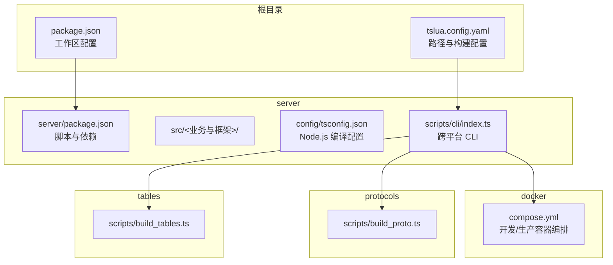
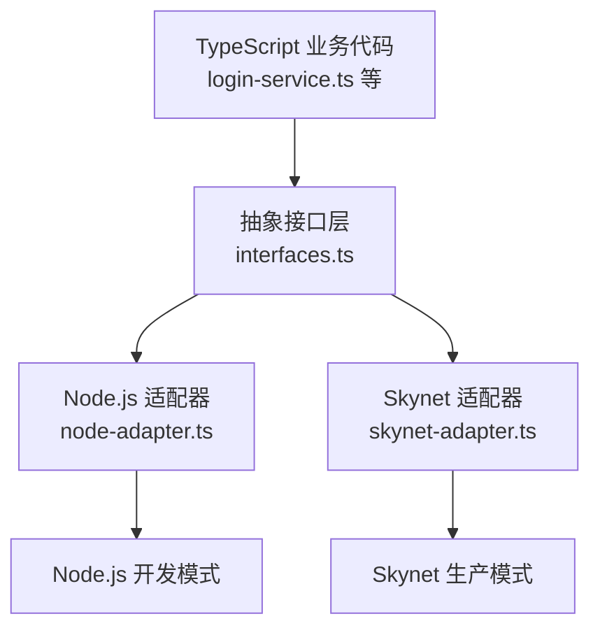
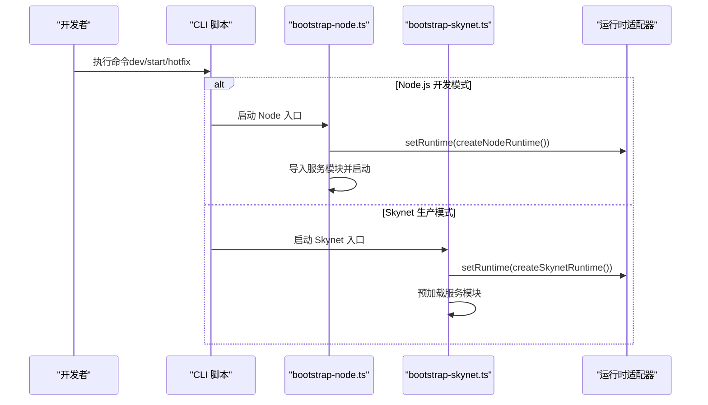
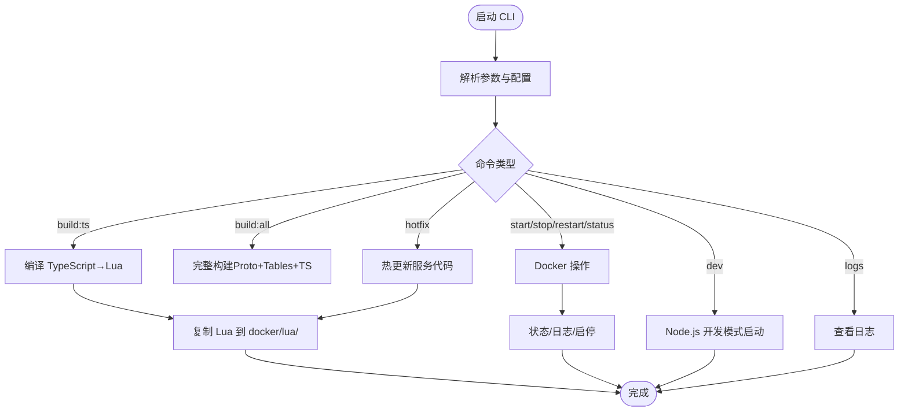
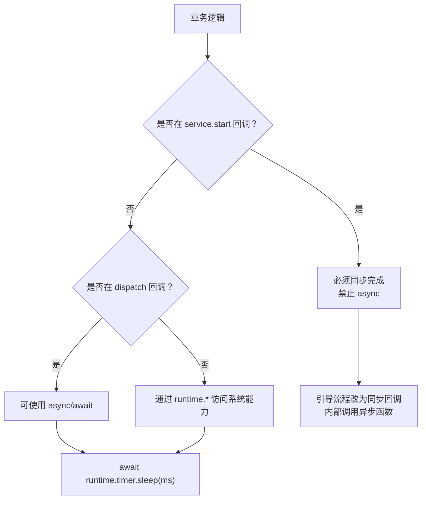
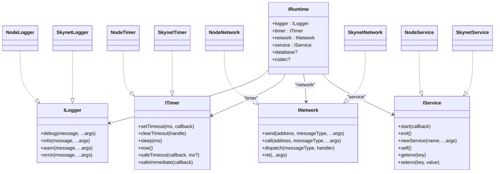
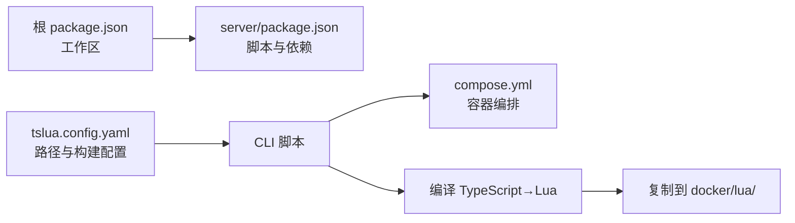

# 开发工作流

<cite>
**本文引用的文件**
- [README.md](file://README.md)
- [package.json](file://package.json)
- [tslua.config.yaml](file://tslua.config.yaml)
- [server/package.json](file://server/package.json)
- [docker/compose.yml](file://docker/compose.yml)
- [server/src/app/bootstrap-node.ts](file://server/src/app/bootstrap-node.ts)
- [server/src/app/bootstrap-skynet.ts](file://server/src/app/bootstrap-skynet.ts)
- [server/src/framework/core/interfaces.ts](file://server/src/framework/core/interfaces.ts)
- [server/src/framework/runtime/node-adapter.ts](file://server/src/framework/runtime/node-adapter.ts)
- [server/src/framework/runtime/skynet-adapter.ts](file://server/src/framework/runtime/skynet-adapter.ts)
- [server/config/tsconfig.json](file://server/config/tsconfig.json)
- [server/scripts/cli/index.ts](file://server/scripts/cli/index.ts)
- [docs/TS-Skynet 异步编程规范.md](file://docs/TS-Skynet 异步编程规范.md)
</cite>

## 目录
1. [简介](#简介)
2. [项目结构](#项目结构)
3. [核心组件](#核心组件)
4. [架构总览](#架构总览)
5. [详细组件分析](#详细组件分析)
6. [依赖关系分析](#依赖关系分析)
7. [性能考虑](#性能考虑)
8. [故障排查指南](#故障排查指南)
9. [结论](#结论)
10. [附录](#附录)

## 简介
本指南面向使用 TypeScript 与 Skynet 的混合开发团队，提供从环境搭建、代码编写、测试验证、构建部署到调试优化的完整工作流。项目支持 Node.js 单机开发与 Skynet 生产部署双模式运行，通过抽象接口层屏蔽底层差异，实现“一套代码，双环境运行”。文档重点涵盖：
- VS Code 调试配置（断点、源码映射、远程调试）
- TypeScript 开发最佳实践（代码组织、模块导入、类型定义）
- Node.js 与 Skynet 运行模式差异与切换
- 性能优化与调试技巧
- 版本控制与团队协作建议
- 常见问题与解决方案

## 项目结构
项目采用多工作区布局，核心目录与职责如下：
- server：TypeScript 源码与构建配置，包含业务服务、框架适配层、协议与表格生成脚本
- docker：Skynet 运行时与 Docker 编排，提供开发与生产两种容器模式
- protocols：Protocol Buffers 协议定义与生成脚本
- tables：配置表（Luban）定义与生成脚本
- docs：开发规范与使用指南
- 根目录脚本：跨平台 CLI 与快捷命令

**图表来源**
- [package.json:11-29](file://package.json#L11-L29)
- [tslua.config.yaml:11-43](file://tslua.config.yaml#L11-L43)
- [server/package.json:6-26](file://server/package.json#L6-L26)
- [docker/compose.yml:6-63](file://docker/compose.yml#L6-L63)

**章节来源**
- [README.md:136-193](file://README.md#L136-L193)
- [package.json:6-10](file://package.json#L6-L10)
- [tslua.config.yaml:11-43](file://tslua.config.yaml#L11-L43)

## 核心组件
- 抽象接口层（interfaces.ts）：定义 ILogger、ITimer、INetwork、IService、IPbCodec、IRuntime 等统一接口，业务代码仅依赖该层
- Node.js 适配器（node-adapter.ts）：在 Node.js 环境下实现日志、定时器、网络、服务与 PB 编解码
- Skynet 适配器（skynet-adapter.ts）：在 Skynet 环境下封装 Lua API，提供协程安全的定时器与网络调用
- 启动入口（bootstrap-node.ts、bootstrap-skynet.ts）：分别设置运行时并加载服务模块
- 跨平台 CLI（scripts/cli/index.ts）：提供一键启动、编译、热更新、状态查询、日志查看等命令

**章节来源**
- [server/src/framework/core/interfaces.ts:9-226](file://server/src/framework/core/interfaces.ts#L9-L226)
- [server/src/framework/runtime/node-adapter.ts:19-194](file://server/src/framework/runtime/node-adapter.ts#L19-L194)
- [server/src/framework/runtime/skynet-adapter.ts:28-221](file://server/src/framework/runtime/skynet-adapter.ts#L28-L221)
- [server/src/app/bootstrap-node.ts:5-22](file://server/src/app/bootstrap-node.ts#L5-L22)
- [server/src/app/bootstrap-skynet.ts:6-20](file://server/src/app/bootstrap-skynet.ts#L6-L20)
- [server/scripts/cli/index.ts:301-354](file://server/scripts/cli/index.ts#L301-L354)

## 架构总览
下图展示“TypeScript 业务代码 → 抽象接口层 → 运行时适配器（Node.js/Skynet）”的双环境统一架构。

**图表来源**
- [server/src/framework/core/interfaces.ts:189-226](file://server/src/framework/core/interfaces.ts#L189-L226)
- [server/src/framework/runtime/node-adapter.ts:177-194](file://server/src/framework/runtime/node-adapter.ts#L177-L194)
- [server/src/framework/runtime/skynet-adapter.ts:204-221](file://server/src/framework/runtime/skynet-adapter.ts#L204-L221)

**章节来源**
- [README.md:111-134](file://README.md#L111-L134)

## 详细组件分析

### 组件 A：运行时切换与启动流程
- Node.js 模式：通过 bootstrap-node.ts 设置 Node 运行时，自动导入服务模块并启动
- Skynet 模式：通过 bootstrap-skynet.ts 设置 Skynet 运行时，预加载服务并通过 runtime.service.start 启动

**图表来源**
- [server/src/app/bootstrap-node.ts:5-22](file://server/src/app/bootstrap-node.ts#L5-L22)
- [server/src/app/bootstrap-skynet.ts:6-20](file://server/src/app/bootstrap-skynet.ts#L6-L20)
- [server/src/framework/runtime/node-adapter.ts:177-194](file://server/src/framework/runtime/node-adapter.ts#L177-L194)
- [server/src/framework/runtime/skynet-adapter.ts:204-221](file://server/src/framework/runtime/skynet-adapter.ts#L204-L221)

**章节来源**
- [server/src/app/bootstrap-node.ts:5-22](file://server/src/app/bootstrap-node.ts#L5-L22)
- [server/src/app/bootstrap-skynet.ts:6-20](file://server/src/app/bootstrap-skynet.ts#L6-L20)

### 组件 B：跨平台 CLI 工具
CLI 提供菜单与命令，负责依赖检查、编译、镜像构建、容器启停、日志查看与热更新。

**图表来源**
- [server/scripts/cli/index.ts:301-354](file://server/scripts/cli/index.ts#L301-L354)
- [server/scripts/cli/index.ts:427-496](file://server/scripts/cli/index.ts#L427-L496)
- [server/scripts/cli/index.ts:547-571](file://server/scripts/cli/index.ts#L547-L571)
- [server/scripts/cli/index.ts:694-707](file://server/scripts/cli/index.ts#L694-L707)

**章节来源**
- [server/scripts/cli/index.ts:301-354](file://server/scripts/cli/index.ts#L301-L354)
- [server/scripts/cli/index.ts:427-496](file://server/scripts/cli/index.ts#L427-L496)
- [server/scripts/cli/index.ts:547-571](file://server/scripts/cli/index.ts#L547-L571)
- [server/scripts/cli/index.ts:694-707](file://server/scripts/cli/index.ts#L694-L707)

### 组件 C：异步模型与最佳实践
- 统一使用 async/await；禁止 Promise.then 链式调用，避免协程生命周期问题
- service.start 回调必须同步完成；dispatch 消息处理器可使用 async
- 通过 runtime 抽象层访问系统功能，避免直接使用 Node.js 或浏览器 API

**图表来源**
- [docs/TS-Skynet 异步编程规范.md:20-62](file://docs/TS-Skynet 异步编程规范.md#L20-L62)
- [docs/TS-Skynet 异步编程规范.md:94-130](file://docs/TS-Skynet 异步编程规范.md#L94-L130)
- [docs/TS-Skynet 异步编程规范.md:142-156](file://docs/TS-Skynet 异步编程规范.md#L142-L156)

**章节来源**
- [docs/TS-Skynet 异步编程规范.md:11-17](file://docs/TS-Skynet 异步编程规范.md#L11-L17)
- [docs/TS-Skynet 异步编程规范.md:20-62](file://docs/TS-Skynet 异步编程规范.md#L20-L62)
- [docs/TS-Skynet 异步编程规范.md:94-130](file://docs/TS-Skynet 异步编程规范.md#L94-L130)
- [docs/TS-Skynet 异步编程规范.md:142-156](file://docs/TS-Skynet 异步编程规范.md#L142-L156)

### 组件 D：Node.js 与 Skynet 运行时差异
- Node.js 适配器：使用原生 Node.js API（console、setTimeout、Promise），适合快速验证与本地调试
- Skynet 适配器：封装 skynet.* API，使用协程与 timeout/fork 管理异步，定时器单位为厘秒（1/100 秒）

**图表来源**
- [server/src/framework/core/interfaces.ts:9-196](file://server/src/framework/core/interfaces.ts#L9-L196)
- [server/src/framework/runtime/node-adapter.ts:19-194](file://server/src/framework/runtime/node-adapter.ts#L19-L194)
- [server/src/framework/runtime/skynet-adapter.ts:28-221](file://server/src/framework/runtime/skynet-adapter.ts#L28-L221)

**章节来源**
- [server/src/framework/runtime/node-adapter.ts:19-194](file://server/src/framework/runtime/node-adapter.ts#L19-L194)
- [server/src/framework/runtime/skynet-adapter.ts:28-221](file://server/src/framework/runtime/skynet-adapter.ts#L28-L221)

## 依赖关系分析
- 根 package.json 通过工作区配置聚合 server、protocols、tables 三个子项目
- server/package.json 定义开发脚本与依赖，包括 TypeScript、ts-node、tsx、TypeScriptToLua 等
- CLI 脚本根据配置文件路径与构建目标，协调编译、复制与 Docker 操作

**图表来源**
- [package.json:6-10](file://package.json#L6-L10)
- [server/package.json:6-26](file://server/package.json#L6-L26)
- [tslua.config.yaml:20-29](file://tslua.config.yaml#L20-L29)
- [server/scripts/cli/index.ts:573-613](file://server/scripts/cli/index.ts#L573-L613)
- [docker/compose.yml:6-63](file://docker/compose.yml#L6-L63)

**章节来源**
- [package.json:6-10](file://package.json#L6-L10)
- [server/package.json:6-26](file://server/package.json#L6-L26)
- [tslua.config.yaml:20-29](file://tslua.config.yaml#L20-L29)
- [server/scripts/cli/index.ts:573-613](file://server/scripts/cli/index.ts#L573-L613)

## 性能考虑
- 使用 runtime.timer.safeTimeout/safeImmediate 替代原生 setTimeout/setImmediate，确保在 Skynet 协程中执行，避免协程泄漏
- 避免高频创建协程（如每帧大量 setTimeout），可通过合并任务或使用固定周期定时器降低开销
- Protobuf 编解码尽量复用 codec 实例，减少重复初始化
- Node.js 模式下使用 sourceMap 与声明映射进行精准定位，Skynet 模式下通过编译后的 Lua 代码与 SourceMap 定位问题

[本节为通用指导，无需具体文件引用]

## 故障排查指南
- 编译失败：确认已安装依赖并使用正确的 tsconfig（Node.js 与 TSTL 配置分别位于 server/config 与 server/config/tsconfig.lua.json）
- Docker 未安装或未启动：CLI 会在启动时检测并提示
- 容器未运行：使用 status 命令查看容器状态，必要时执行 restart
- 热更新失败：确认容器正在运行且已编译 TS→Lua，CLI 会自动复制到容器并提示完成
- 异步链式调用导致协程崩溃：请改用 async/await，并遵循 service.start 与 dispatch 的异步约束

**章节来源**
- [server/scripts/cli/index.ts:427-496](file://server/scripts/cli/index.ts#L427-L496)
- [server/scripts/cli/index.ts:516-526](file://server/scripts/cli/index.ts#L516-L526)
- [server/scripts/cli/index.ts:694-707](file://server/scripts/cli/index.ts#L694-L707)
- [docs/TS-Skynet 异步编程规范.md:20-62](file://docs/TS-Skynet 异步编程规范.md#L20-L62)

## 结论
本工作流通过抽象接口层与双运行时适配器，实现了 TypeScript 在 Node.js 与 Skynet 的无缝切换。配合跨平台 CLI、Docker 编排与严格异步规范，团队可在本地高效开发、快速验证并在生产环境稳定运行。建议在日常开发中坚持规范、善用 CLI、重视异步模型与调试技巧，持续提升开发效率与系统稳定性。

[本节为总结，无需具体文件引用]

## 附录

### VS Code 调试配置（断点、源码映射、远程调试）
- Node.js 模式调试：在 launch.json 中配置 program 指向 Node 入口，使用 preLaunchTask 编译 tsconfig.json，outFiles 指向 dist/nodejs 输出，即可断点调试
- Skynet 模式调试：启用 TSTL SourceMap（已在 tsconfig.tstl.json 中配置），编译后查看 dist/lua 中的对应 Lua 文件，结合日志与容器日志定位问题
- 远程调试：通过 Docker 容器日志与端口映射（8888/9999）接入外部调试工具或附加调试器

**章节来源**
- [README.md:370-389](file://README.md#L370-L389)

### TypeScript 开发最佳实践
- 代码组织：按业务域划分 services（login/gateway/game），通过 interfaces.ts 与 runtime 解耦
- 模块导入：优先静态导入，避免动态 require；使用映射表替代动态路径
- 类型定义：统一使用 runtime.* 接口，避免直接依赖 Node.js/浏览器 API
- 异步处理：严格遵循 async/await 规范，service.start 同步、dispatch 可异步

**章节来源**
- [server/src/framework/core/interfaces.ts:9-196](file://server/src/framework/core/interfaces.ts#L9-L196)
- [docs/TS-Skynet 异步编程规范.md:355-391](file://docs/TS-Skynet 异步编程规范.md#L355-L391)

### Node.js 与 Skynet 模式切换
- 切换方式：通过 CLI 命令 dev（Node.js）与 server:start（Skynet）进行模式切换
- 启动入口：Node.js 使用 bootstrap-node.ts，Skynet 使用 bootstrap-skynet.ts
- 运行时差异：Skynet 使用协程与特定时间单位，需遵循适配器提供的 API

**章节来源**
- [server/src/app/bootstrap-node.ts:5-22](file://server/src/app/bootstrap-node.ts#L5-L22)
- [server/src/app/bootstrap-skynet.ts:6-20](file://server/src/app/bootstrap-skynet.ts#L6-L20)
- [server/src/framework/runtime/skynet-adapter.ts:69-122](file://server/src/framework/runtime/skynet-adapter.ts#L69-L122)

### 版本控制与团队协作建议
- 使用 Git 提交规范与分支策略（如 Feature/Fix/Hotfix），在 PR 中附带变更说明与测试要点
- 通过 ESLint 规则与 TSTL 限制约束代码质量，减少跨环境差异带来的问题
- 在 CI 中集成 CLI 的一键启动与构建流程，确保本地与流水线一致性

**章节来源**
- [docs/TS-Skynet 异步编程规范.md:11-17](file://docs/TS-Skynet 异步编程规范.md#L11-L17)