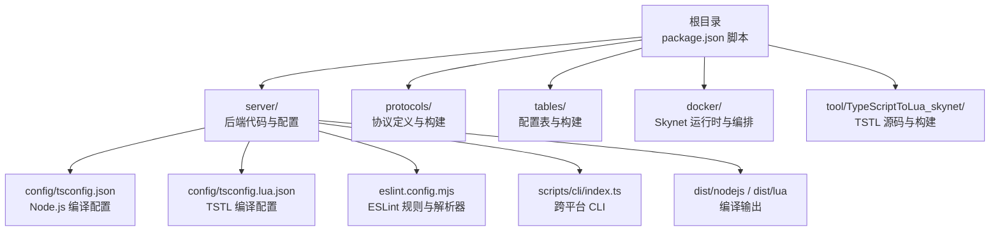
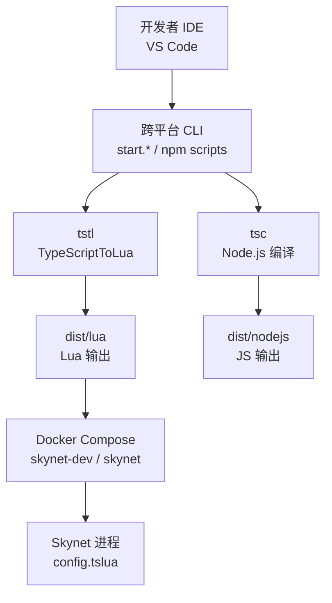
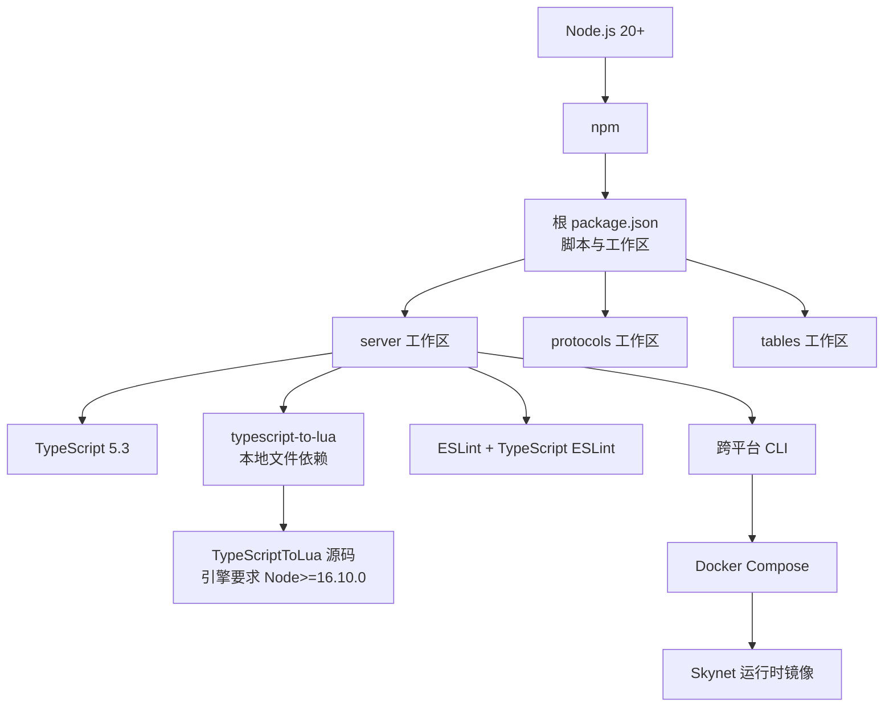

# 开发环境配置

<cite>
**本文引用的文件**
- [package.json](file://package.json)
- [server/package.json](file://server/package.json)
- [tool/TypeScriptToLua_skynet/package.json](file://tool/TypeScriptToLua_skynet/package.json)
- [server/config/tsconfig.json](file://server/config/tsconfig.json)
- [server/config/tsconfig.lua.json](file://server/config/tsconfig.lua.json)
- [protocols/tsconfig.json](file://protocols/tsconfig.json)
- [tables/tsconfig.json](file://tables/tsconfig.json)
- [server/.eslintrc.cjs](file://server/.eslintrc.cjs)
- [server/eslint.config.mjs](file://server/eslint.config.mjs)
- [start.sh](file://start.sh)
- [start.bat](file://start.bat)
- [start.ps1](file://start.ps1)
- [tslua.config.yaml](file://tslua.config.yaml)
- [README.md](file://README.md)
- [docker/skynet-runtime/Dockerfile](file://docker/skynet-runtime/Dockerfile)
- [docker/compose.yml](file://docker/compose.yml)
</cite>

## 目录
1. [引言](#引言)
2. [项目结构](#项目结构)
3. [核心组件](#核心组件)
4. [架构总览](#架构总览)
5. [详细组件分析](#详细组件分析)
6. [依赖关系分析](#依赖关系分析)
7. [性能考虑](#性能考虑)
8. [故障排查指南](#故障排查指南)
9. [结论](#结论)
10. [附录](#附录)

## 引言
本指南面向首次参与 TS-Skynet 混合开发框架的开发者，提供从零搭建开发环境的完整步骤，涵盖 Node.js、TypeScript、TypeScriptToLua（TSTL）等核心依赖的安装与配置；详述 IDE（尤其是 VS Code）的插件与配置建议；解释 tsconfig.json 与 tsconfig.lua.json 的差异与用途；给出 Windows、Linux、macOS 三类操作系统的具体配置要点；说明环境变量与 PATH 的设置；最后提供常见问题的排查与解决思路。

## 项目结构
该仓库采用多工作区（workspaces）组织方式，核心目录与职责如下：
- 根目录：聚合脚本与顶层命令转发，便于跨平台统一入口。
- server：后端业务代码与配置，包含 Node.js 与 Lua 双重编译配置。
- protocols：Protocol Buffers 协议定义与构建脚本。
- tables：Luban 配置表定义与构建脚本。
- docker：Skynet 运行时镜像与 Compose 编排。
- tool/TypeScriptToLua_skynet：本地化的 TSTL 源码与构建配置。
- docs：项目文档与使用说明。

图表来源
- [package.json:11-37](file://package.json#L11-L37)
- [server/package.json:6-26](file://server/package.json#L6-L26)
- [server/config/tsconfig.json:1-26](file://server/config/tsconfig.json#L1-L26)
- [server/config/tsconfig.lua.json:1-23](file://server/config/tsconfig.lua.json#L1-L23)
- [server/eslint.config.mjs:1-40](file://server/eslint.config.mjs#L1-L40)

章节来源
- [README.md:136-193](file://README.md#L136-L193)

## 核心组件
- Node.js 与包管理：使用 Node.js 20+ 与 npm，根与各工作区均提供脚本与依赖声明。
- TypeScript：版本 5.3，Node.js 侧使用 tsc 编译，Lua 侧使用 TSTL（TypeScriptToLua）。
- TypeScriptToLua（TSTL）：本地以文件依赖形式引入，引擎要求 Node.js >= 16.10.0，TypeScript 版本 5.9.3。
- ESLint：基于 TypeScript ESLint，配合自定义规则集，保障跨平台一致性。
- 跨平台 CLI：统一入口脚本，支持 Windows CMD、PowerShell、Linux/macOS 三种方式。
- Docker：提供 Skynet 运行时镜像与 Compose 编排，支持开发与生产两种模式。

章节来源
- [package.json:1-48](file://package.json#L1-L48)
- [server/package.json:36-49](file://server/package.json#L36-L49)
- [tool/TypeScriptToLua_skynet/package.json:41-46](file://tool/TypeScriptToLua_skynet/package.json#L41-L46)
- [server/eslint.config.mjs:1-40](file://server/eslint.config.mjs#L1-L40)
- [start.sh:1-7](file://start.sh#L1-L7)
- [start.bat:1-39](file://start.bat#L1-L39)
- [start.ps1:1-36](file://start.ps1#L1-L36)

## 架构总览
下图展示开发环境的关键组件与交互关系，包括 Node.js 开发、TypeScript 编译、TSTL 转译、Docker 部署等环节。

图表来源
- [start.sh:1-7](file://start.sh#L1-L7)
- [start.bat:1-39](file://start.bat#L1-L39)
- [start.ps1:1-36](file://start.ps1#L1-L36)
- [server/config/tsconfig.json:1-26](file://server/config/tsconfig.json#L1-L26)
- [server/config/tsconfig.lua.json:1-23](file://server/config/tsconfig.lua.json#L1-L23)
- [docker/compose.yml:6-63](file://docker/compose.yml#L6-L63)

## 详细组件分析

### Node.js 与包管理
- 版本要求：Node.js 20+；TSTL 本地源码要求 Node.js >= 16.10.0。
- 包管理：使用 npm；根目录与 server 工作区均提供脚本，便于跨平台统一入口。
- 依赖安装：在项目根目录执行安装，会同时安装 server、protocols、tables 等工作区依赖。

章节来源
- [README.md:199-204](file://README.md#L199-L204)
- [tool/TypeScriptToLua_skynet/package.json:41-46](file://tool/TypeScriptToLua_skynet/package.json#L41-L46)
- [package.json:6-10](file://package.json#L6-L10)

### TypeScript 与编译配置
- Node.js 编译配置：位于 server/config/tsconfig.json，输出至 dist/nodejs，启用 strict、declaration、sourceMap 等。
- Lua 编译配置：位于 server/config/tsconfig.lua.json，输出至 dist/lua，启用 TSTL 特定选项如 luaTarget、luaLibImport、sourceMapTraceback 等。
- 协议与配置表的 TypeScript 配置：protocols/ 与 tables/ 分别提供独立 tsconfig.json，用于各自脚本构建。

章节来源
- [server/config/tsconfig.json:1-26](file://server/config/tsconfig.json#L1-L26)
- [server/config/tsconfig.lua.json:1-23](file://server/config/tsconfig.lua.json#L1-L23)
- [protocols/tsconfig.json:1-20](file://protocols/tsconfig.json#L1-L20)
- [tables/tsconfig.json:1-18](file://tables/tsconfig.json#L1-L18)

### TypeScriptToLua（TSTL）与 Skynet 兼容
- 本地化依赖：server/package.json 中将 typescript-to-lua 以文件依赖形式指向 tool/TypeScriptToLua_skynet，确保与项目适配版本一致。
- TSTL 关键选项：luaTarget 设为 5.4，luaLibImport 使用 require，开启 sourceMapTraceback 以便调试，启用 skynetCompat 以适配 Skynet 运行时。
- 引擎与类型：TSTL 源码声明 TypeScript 5.9.3，Node.js 引擎要求 >= 16.10.0。

章节来源
- [server/package.json:48-48](file://server/package.json#L48-L48)
- [tool/TypeScriptToLua_skynet/package.json:41-46](file://tool/TypeScriptToLua_skynet/package.json#L41-L46)
- [server/config/tsconfig.lua.json:12-19](file://server/config/tsconfig.lua.json#L12-L19)

### ESLint 与代码质量
- 解析器与规则：使用 @typescript-eslint/parser 与推荐规则集；自定义规则集通过 server/eslint/index.js 提供。
- Node.js 规则：server/.eslintrc.cjs 与 server/eslint.config.mjs 配置了针对 Skynet 的若干禁用或警告规则（如禁止在 service.start 中使用 async、禁止 Promise.then、禁止动态 require 等）。
- 解析器配置：eslint.config.mjs 指向 server/config/tsconfig.json，确保规则解析正确。

章节来源
- [server/.eslintrc.cjs:1-35](file://server/.eslintrc.cjs#L1-L35)
- [server/eslint.config.mjs:1-40](file://server/eslint.config.mjs#L1-L40)

### 跨平台 CLI 与启动脚本
- 统一入口：start.sh（Linux/macOS）、start.bat（Windows CMD）、start.ps1（Windows PowerShell）均调用 npm run cli，实现命令一致。
- 环境变量：Windows 脚本通过 TSLUA_CONFIG 指定配置文件路径；Linux/macOS 通过环境变量或脚本参数传递。
- 常用命令：quick、build:ts、start、stop、restart、status、logs、dev、setup、hotfix 等。

章节来源
- [start.sh:1-7](file://start.sh#L1-L7)
- [start.bat:1-39](file://start.bat#L1-L39)
- [start.ps1:1-36](file://start.ps1#L1-L36)
- [README.md:17-92](file://README.md#L17-L92)

### Docker 与部署
- 运行时镜像：docker/skynet-runtime/Dockerfile 基于 Ubuntu 22.04，编译 Skynet 并预置 lua-protobuf，最终以非 root 用户运行。
- Compose 编排：docker/compose.yml 定义 skynet-dev（开发模式，挂载代码与配置）与 skynet（生产模式，代码嵌入镜像）两个服务。
- 环境变量：SKYNET_CONFIG 指向 /skynet/config.tslua；时区 TZ=Asia/Shanghai。

章节来源
- [docker/skynet-runtime/Dockerfile:1-91](file://docker/skynet-runtime/Dockerfile#L1-L91)
- [docker/compose.yml:6-70](file://docker/compose.yml#L6-L70)

### TypeScript 配置文件对比与用途
- tsconfig.json（Node.js）：用于 tsc 编译为 JS，输出到 dist/nodejs，启用 declaration、declarationMap、sourceMap，便于 Node.js 开发与调试。
- tsconfig.lua.json（TSTL）：用于 tstl 编译为 Lua，输出到 dist/lua，启用 luaTarget=5.4、luaLibImport=require、sourceMapTraceback、skynetCompat 等，确保与 Skynet 运行时兼容。
- protocols/tsconfig.json 与 tables/tsconfig.json：分别用于协议与配置表的脚本构建，独立工作区，避免污染主业务编译。

章节来源
- [server/config/tsconfig.json:1-26](file://server/config/tsconfig.json#L1-L26)
- [server/config/tsconfig.lua.json:1-23](file://server/config/tsconfig.lua.json#L1-L23)
- [protocols/tsconfig.json:1-20](file://protocols/tsconfig.json#L1-L20)
- [tables/tsconfig.json:1-18](file://tables/tsconfig.json#L1-L18)

## 依赖关系分析
下图展示开发环境关键依赖与耦合关系，突出 Node.js、TypeScript、TSTL、ESLint、Docker 等模块之间的依赖方向。

图表来源
- [package.json:6-10](file://package.json#L6-L10)
- [server/package.json:36-49](file://server/package.json#L36-L49)
- [tool/TypeScriptToLua_skynet/package.json:41-46](file://tool/TypeScriptToLua_skynet/package.json#L41-L46)
- [server/eslint.config.mjs:1-40](file://server/eslint.config.mjs#L1-L40)
- [docker/compose.yml:6-63](file://docker/compose.yml#L6-L63)

章节来源
- [package.json:1-48](file://package.json#L1-L48)
- [server/package.json:1-51](file://server/package.json#L1-L51)
- [tool/TypeScriptToLua_skynet/package.json:1-76](file://tool/TypeScriptToLua_skynet/package.json#L1-L76)

## 性能考虑
- 编译缓存：利用 TSTL 的 watch 模式进行增量编译，减少重复构建时间。
- 输出分离：Node.js 与 Lua 分别输出到不同目录，避免相互干扰。
- Docker 开发模式：挂载代码与配置，热更新更快，适合迭代开发。
- SourceMap：启用 sourceMapTraceback 与 sourceMap，提升调试效率，降低定位成本。

章节来源
- [server/package.json:12-12](file://server/package.json#L12-L12)
- [server/config/tsconfig.lua.json:15-15](file://server/config/tsconfig.lua.json#L15-L15)
- [server/config/tsconfig.json:14-14](file://server/config/tsconfig.json#L14-L14)
- [docker/compose.yml:20-26](file://docker/compose.yml#L20-L26)

## 故障排查指南
- Node.js 版本不匹配
  - 现象：安装失败或 TSTL 启动报错。
  - 处理：升级 Node.js 至 20+；若需编译 TSTL 源码，确保 Node.js >= 16.10.0。
  - 参考来源
    - [tool/TypeScriptToLua_skynet/package.json:41-46](file://tool/TypeScriptToLua_skynet/package.json#L41-L46)

- TypeScript 版本不匹配
  - 现象：TSTL 报告类型系统不兼容。
  - 处理：保持 server 与 TSTL 源码的 TypeScript 版本一致（5.9.3）。
  - 参考来源
    - [tool/TypeScriptToLua_skynet/package.json:72-72](file://tool/TypeScriptToLua_skynet/package.json#L72-L72)

- TSTL 未找到或不可执行
  - 现象：执行 npm run build:ts 报错找不到命令。
  - 处理：确认 server/package.json 中 typescript-to-lua 为本地文件依赖；先在 tool/TypeScriptToLua_skynet 目录执行构建后再回到根目录安装。
  - 参考来源
    - [server/package.json:48-48](file://server/package.json#L48-L48)

- ESLint 规则冲突
  - 现象：编辑器报错或 CI 失败。
  - 处理：使用 server/eslint.config.mjs 指定的 tsconfig.json；按规则集修正代码（如禁用 service.start 中的 async、禁止 Promise.then 等）。
  - 参考来源
    - [server/eslint.config.mjs:35-36](file://server/eslint.config.mjs#L35-L36)
    - [server/.eslintrc.cjs:24-25](file://server/.eslintrc.cjs#L24-L25)

- 跨平台 CLI 参数传递
  - 现象：Windows CMD/PowerShell 无法正确传参。
  - 处理：使用 start.bat 或 start.ps1；必要时显式设置 TSLUA_CONFIG 环境变量。
  - 参考来源
    - [start.bat:18-29](file://start.bat#L18-L29)
    - [start.ps1:17-27](file://start.ps1#L17-L27)

- Docker 启动失败
  - 现象：容器启动即退出或找不到配置。
  - 处理：确认 SKYNET_CONFIG 指向有效配置文件；检查卷挂载路径与权限；开发模式使用 skynet-dev。
  - 参考来源
    - [docker/compose.yml:29-31](file://docker/compose.yml#L29-L31)
    - [docker/skynet-runtime/Dockerfile:78-86](file://docker/skynet-runtime/Dockerfile#L78-L86)

## 结论
本指南围绕 TS-Skynet 混合开发框架的开发环境配置，系统梳理了 Node.js、TypeScript、TSTL、ESLint、Docker 等关键组件的安装与配置要点，并结合跨平台 CLI 与 Docker 编排，给出了 Windows、Linux、macOS 的落地步骤与常见问题排查方案。遵循本文建议，可快速搭建稳定、可维护的开发与部署环境。

## 附录

### IDE 配置（VS Code）
- 插件推荐
  - ESLint：与项目 ESLint 配置联动，实时提示规则问题。
  - Prettier：统一格式化风格。
  - TypeScript Importer：辅助导入与类型提示。
  - Docker：可视化管理容器与镜像。
- 设置要点
  - 使用工作区根目录打开项目，确保 VS Code 识别多工作区。
  - 在 settings 中启用 ESLint 自动修复与保存时格式化。
  - Node.js 调试：参考 README.md 中的 launch.json 配置，指向 dist/nodejs 输出。
- 参考来源
  - [README.md:370-382](file://README.md#L370-L382)

### 环境变量与 PATH
- Windows
  - CMD：通过 start.bat 设置 TSLUA_CONFIG；确保 npm 与 node 在 PATH 中。
  - PowerShell：通过 start.ps1 设置 $env:TSLUA_CONFIG；确保 npm 与 node 在 PATH 中。
- Linux/macOS
  - 通过 shell rc 文件（如 ~/.bashrc 或 ~/.zshrc）添加 Node.js 与 npm 的 PATH。
  - Docker 相关命令需确保 docker 与 docker-compose 在 PATH 中。
- 参考来源
  - [start.bat:18-19](file://start.bat#L18-L19)
  - [start.ps1:17-18](file://start.ps1#L17-L18)
  - [docker/compose.yml:6-63](file://docker/compose.yml#L6-L63)

### 不同操作系统下的环境搭建步骤

- Windows
  - 安装 Node.js 20+ 与 Git。
  - 在项目根目录执行 npm install。
  - 使用 start.ps1 或 start.bat 运行 CLI；必要时设置 TSLUA_CONFIG。
  - 如需 Docker：安装 Docker Desktop，使用 docker-compose 启动服务。
  - 参考来源
    - [start.ps1:1-36](file://start.ps1#L1-L36)
    - [start.bat:1-39](file://start.bat#L1-L39)
    - [docker/compose.yml:6-63](file://docker/compose.yml#L6-L63)

- Linux/macOS
  - 安装 Node.js 20+ 与 Git。
  - 在项目根目录执行 npm install。
  - 使用 ./start.sh 运行 CLI；或直接使用 npm run 脚本。
  - 如需 Docker：安装 Docker Engine 与 docker-compose，使用 compose 文件启动。
  - 参考来源
    - [start.sh:1-7](file://start.sh#L1-L7)
    - [docker/compose.yml:6-63](file://docker/compose.yml#L6-L63)

### tsconfig.json 与 tsconfig.lua.json 的区别与用途
- tsconfig.json（Node.js）
  - 作用：tsc 编译为 JS，输出到 dist/nodejs，适用于 Node.js 开发与测试。
  - 关键点：启用 strict、declaration、declarationMap、sourceMap，baseUrl 与 paths 便于模块别名。
- tsconfig.lua.json（TSTL）
  - 作用：tstl 编译为 Lua，输出到 dist/lua，适用于 Skynet 生产部署。
  - 关键点：luaTarget=5.4、luaLibImport=require、sourceMapTraceback、skynetCompat、noImplicitSelf、noHeader。
- 参考来源
  - [server/config/tsconfig.json:1-26](file://server/config/tsconfig.json#L1-L26)
  - [server/config/tsconfig.lua.json:1-23](file://server/config/tsconfig.lua.json#L1-L23)