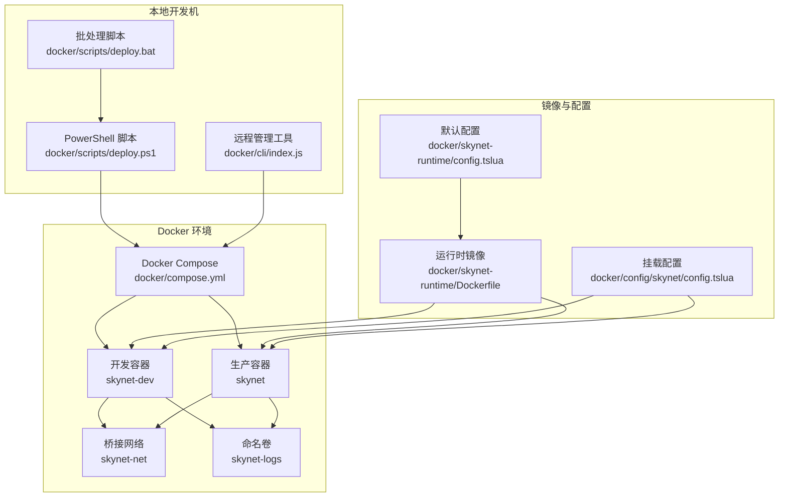
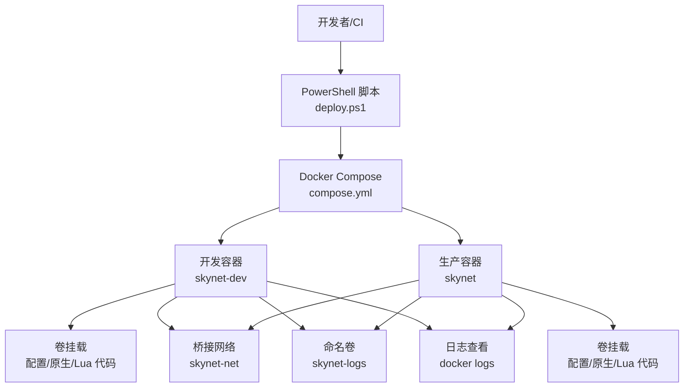
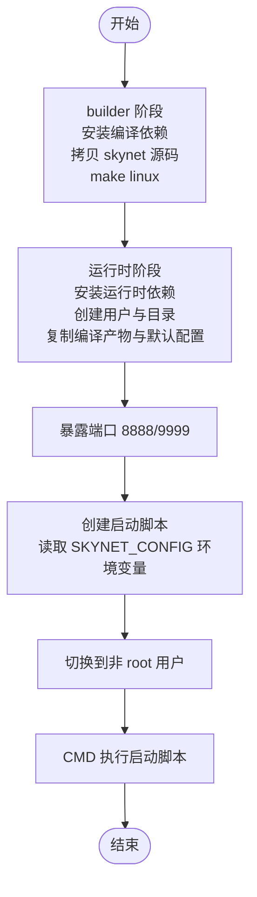
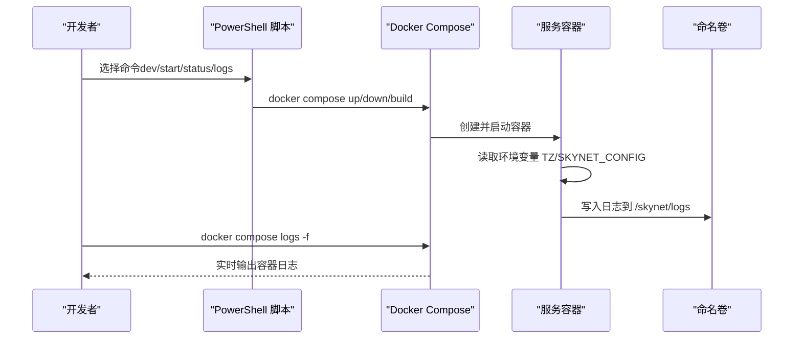
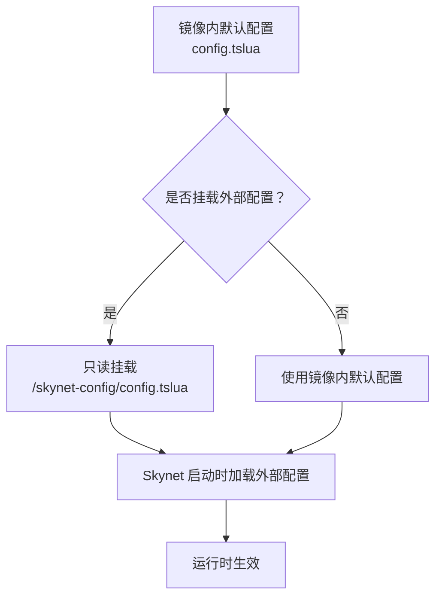
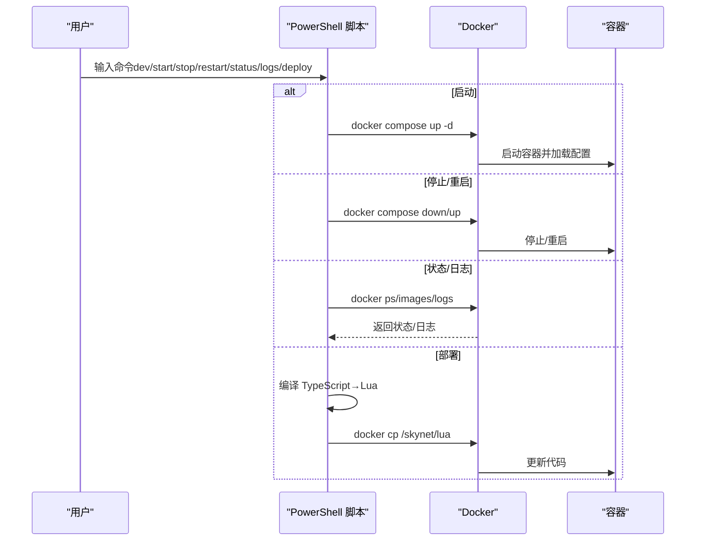
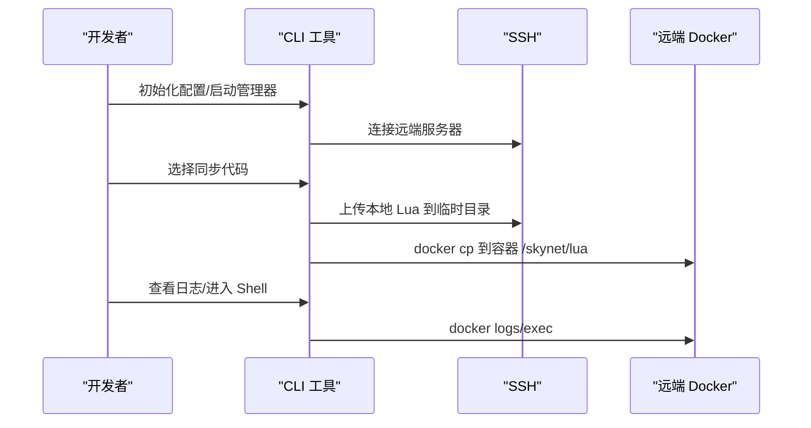
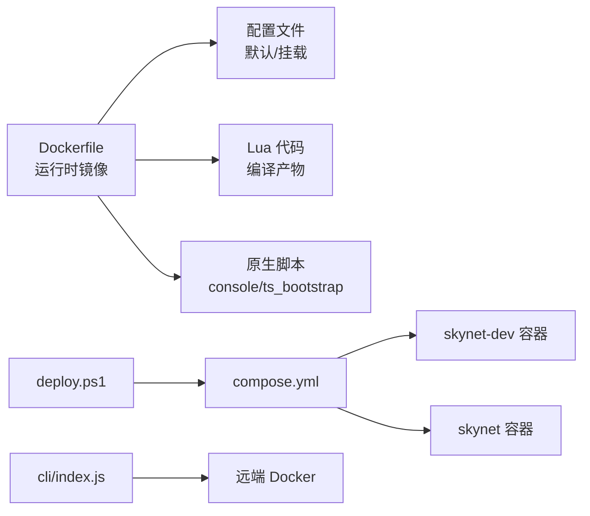

# Docker部署

<cite>
**本文引用的文件**
- [docker/compose.yml](file://docker/compose.yml)
- [docker/skynet-runtime/Dockerfile](file://docker/skynet-runtime/Dockerfile)
- [docker/skynet-runtime/config.tslua](file://docker/skynet-runtime/config.tslua)
- [docker/config/skynet/config.tslua](file://docker/config/skynet/config.tslua)
- [docker/.dockerignore](file://docker/.dockerignore)
- [docker/daemon.json](file://docker/daemon.json)
- [docker/scripts/deploy.ps1](file://docker/scripts/deploy.ps1)
- [docker/scripts/deploy.bat](file://docker/scripts/deploy.bat)
- [docker/cli/README.md](file://docker/cli/README.md)
- [docker/cli/package.json](file://docker/cli/package.json)
- [docker/cli/index.js](file://docker/cli/index.js)
- [server/Dockerfile](file://server/Dockerfile)
- [server/start.sh](file://server/start.sh)
</cite>

## 目录
1. [简介](#简介)
2. [项目结构](#项目结构)
3. [核心组件](#核心组件)
4. [架构总览](#架构总览)
5. [详细组件分析](#详细组件分析)
6. [依赖关系分析](#依赖关系分析)
7. [性能考虑](#性能考虑)
8. [故障排查指南](#故障排查指南)
9. [结论](#结论)
10. [附录](#附录)

## 简介
本指南面向希望使用 Docker 对 TS-Skynet 服务进行容器化部署的工程师与运维人员。内容覆盖镜像构建流程、Docker Compose 编排配置、容器启停重启标准流程、环境变量与配置文件挂载方法、日志查看与健康检查建议、资源限制与生产最佳实践及安全配置建议。文档同时提供基于 PowerShell 的 Windows 部署脚本说明与远程管理工具使用指引。

## 项目结构
仓库采用“多层容器”思路：
- 运行时镜像：基于 Ubuntu 22.04，构建并打包 Skynet 运行时与 Lua 服务代码，暴露游戏与调试端口，以非 root 用户运行。
- 编排文件：通过 docker-compose 定义开发与生产两种模式的服务，分别挂载配置、原生 Lua 脚本与编译后的 Lua 代码，统一接入桥接网络。
- 部署脚本：提供 Windows 环境下的 PowerShell 脚本，封装构建、启动、停止、重启、状态查询、日志查看、代码部署、Shell 进入、清理等常用操作。
- 远程管理工具：提供 Node.js 实现的 CLI，支持 SSH 远程管理 Docker 容器，一键同步本地编译后的 Lua 代码到远端容器。

图表来源
- [docker/compose.yml:1-70](file://docker/compose.yml#L1-L70)
- [docker/skynet-runtime/Dockerfile:1-91](file://docker/skynet-runtime/Dockerfile#L1-L91)
- [docker/skynet-runtime/config.tslua:1-35](file://docker/skynet-runtime/config.tslua#L1-L35)
- [docker/config/skynet/config.tslua:1-54](file://docker/config/skynet/config.tslua#L1-L54)

章节来源
- [docker/compose.yml:1-70](file://docker/compose.yml#L1-L70)
- [docker/skynet-runtime/Dockerfile:1-91](file://docker/skynet-runtime/Dockerfile#L1-L91)
- [docker/.dockerignore:1-48](file://docker/.dockerignore#L1-L48)
- [docker/daemon.json:1-17](file://docker/daemon.json#L1-L17)

## 核心组件
- 运行时镜像构建
  - 分阶段构建：builder 阶段拉取并编译 Skynet 源码与 lua-protobuf；运行时镜像仅保留运行所需二进制与共享库，最小化体积。
  - 非 root 用户运行，设置工作目录与启动脚本，暴露端口，内置默认配置文件。
- 编排服务
  - 开发模式：通过卷挂载实现代码热更新，便于开发调试。
  - 生产模式：将编译后的 Lua 代码与原生脚本复制进镜像，自包含部署。
- 配置与挂载
  - 默认配置打包在镜像内；生产环境通过只读卷挂载外部配置文件覆盖。
- 部署脚本
  - 封装构建、启动、停止、重启、状态、日志、部署代码、Shell、清理等操作，支持后台运行与缓存控制。
- 远程管理工具
  - 通过 SSH 远程执行 Docker 命令，一键同步本地 Lua 代码到远端容器，查看日志，进入 Shell。

章节来源
- [docker/skynet-runtime/Dockerfile:1-91](file://docker/skynet-runtime/Dockerfile#L1-L91)
- [docker/compose.yml:6-70](file://docker/compose.yml#L6-L70)
- [docker/config/skynet/config.tslua:1-54](file://docker/config/skynet/config.tslua#L1-L54)
- [docker/skynet-runtime/config.tslua:1-35](file://docker/skynet-runtime/config.tslua#L1-L35)
- [docker/scripts/deploy.ps1:1-430](file://docker/scripts/deploy.ps1#L1-L430)
- [docker/scripts/deploy.bat:1-58](file://docker/scripts/deploy.bat#L1-L58)
- [docker/cli/README.md:1-177](file://docker/cli/README.md#L1-L177)
- [docker/cli/index.js:1-310](file://docker/cli/index.js#L1-L310)

## 架构总览
下图展示容器化部署的整体交互：本地脚本驱动 Compose，创建开发/生产容器，挂载配置与代码，通过桥接网络互通，日志写入命名卷并通过 docker logs 查看。

图表来源
- [docker/compose.yml:6-70](file://docker/compose.yml#L6-L70)
- [docker/scripts/deploy.ps1:214-275](file://docker/scripts/deploy.ps1#L214-L275)
- [docker/scripts/deploy.ps1:216-238](file://docker/scripts/deploy.ps1#L216-L238)

## 详细组件分析

### 组件一：运行时镜像构建（分阶段 Dockerfile）
- 基础镜像与依赖
  - builder 阶段：Ubuntu 22.04，安装编译工具链与 Git，拉取 skynet 源码并 make linux 编译。
  - 运行时阶段：仅安装 CA 证书，创建非 root 用户，复制编译产物与默认配置，创建工作目录与日志目录。
- 关键行为
  - 暴露端口 8888（游戏端口）、9999（调试/管理端口）。
  - 启动脚本根据环境变量 SKYNET_CONFIG 加载配置文件，若缺失则退出。
  - CMD 执行启动脚本，以非 root 用户运行。
- 最佳实践
  - 保持 builder 阶段与运行时阶段的最小差异，减少攻击面。
  - 通过只读卷挂载外部配置，避免镜像内硬编码敏感信息。

图表来源
- [docker/skynet-runtime/Dockerfile:7-91](file://docker/skynet-runtime/Dockerfile#L7-L91)

章节来源
- [docker/skynet-runtime/Dockerfile:1-91](file://docker/skynet-runtime/Dockerfile#L1-L91)

### 组件二：Docker Compose 编排配置
- 服务定义
  - skynet-dev：开发模式，挂载配置、原生脚本、Lua 代码与日志卷，暴露端口，设置时区与配置文件路径环境变量。
  - skynet：生产模式，挂载相同内容，但通过卷挂载实现代码热更新或在容器内直接使用镜像内的 Lua 代码。
- 网络与卷
  - 使用 bridge 驱动的自定义网络 skynet-net，便于服务间通信。
  - 命名卷 skynet-logs 用于持久化日志。
- 环境变量
  - TZ：设置容器时区。
  - SKYNET_CONFIG：指定 Skynet 配置文件路径（默认指向挂载的 /skynet-config/config.tslua）。
- 工作目录与工作流
  - working_dir 设为 /skynet，便于相对路径引用。
  - 开发模式通过 profiles: dev 控制启用。

图表来源
- [docker/compose.yml:6-70](file://docker/compose.yml#L6-L70)
- [docker/scripts/deploy.ps1:299-327](file://docker/scripts/deploy.ps1#L299-L327)

章节来源
- [docker/compose.yml:6-70](file://docker/compose.yml#L6-L70)

### 组件三：配置文件与挂载策略
- 默认配置
  - 镜像内默认配置文件提供线程数、启动模块、Lua/C 服务路径、单节点模式、日志输出到 stdout、关闭守护进程等基础项。
- 外部挂载配置
  - 生产环境通过只读卷挂载 docker/config/skynet/config.tslua，覆盖默认配置，便于动态调整。
- 配置项说明（节选）
  - thread：线程数，按 CPU 核心数调整。
  - bootstrap/start：启动模块与入口脚本。
  - luaservice/lualoader/lua_path/lua_cpath/cpath：服务与模块路径优先级。
  - harbor：单节点模式。
  - logger/daemon：Docker 环境下推荐输出到 stdout，关闭守护进程。
  - game_port/debug_port/root：可选自定义端口与工作目录。

图表来源
- [docker/skynet-runtime/config.tslua:1-35](file://docker/skynet-runtime/config.tslua#L1-L35)
- [docker/config/skynet/config.tslua:1-54](file://docker/config/skynet/config.tslua#L1-L54)
- [docker/compose.yml:29-31](file://docker/compose.yml#L29-L31)

章节来源
- [docker/skynet-runtime/config.tslua:1-35](file://docker/skynet-runtime/config.tslua#L1-L35)
- [docker/config/skynet/config.tslua:1-54](file://docker/config/skynet/config.tslua#L1-L54)

### 组件四：容器启动/停止/重启标准流程
- 开发模式
  - 启动：使用 PowerShell 脚本 dev 命令，支持前台/后台运行。
  - 停止：stop 命令。
  - 重启：restart 命令。
- 生产模式
  - 启动：start 命令，支持后台运行。
  - 停止/重启：同上。
- 状态与日志
  - status：查看容器与镜像列表。
  - logs：实时查看容器日志。
- 代码部署
  - deploy：编译 TypeScript→Lua 后，同步到运行中的容器（开发模式自动挂载，生产模式通过 docker cp）。

图表来源
- [docker/scripts/deploy.ps1:214-275](file://docker/scripts/deploy.ps1#L214-L275)
- [docker/scripts/deploy.ps1:277-294](file://docker/scripts/deploy.ps1#L277-L294)
- [docker/scripts/deploy.ps1:296-327](file://docker/scripts/deploy.ps1#L296-L327)
- [docker/scripts/deploy.ps1:329-366](file://docker/scripts/deploy.ps1#L329-L366)

章节来源
- [docker/scripts/deploy.ps1:1-430](file://docker/scripts/deploy.ps1#L1-L430)

### 组件五：环境变量与配置文件挂载
- 环境变量
  - TZ：设置时区（如 Asia/Shanghai）。
  - SKYNET_CONFIG：指定 Skynet 配置文件路径（默认 /skynet/config.tslua，可通过卷挂载覆盖）。
- 卷挂载
  - 配置卷：/skynet-config → 挂载 docker/config/skynet/。
  - 原生脚本卷：/skynet/native → 挂载 docker/native/。
  - Lua 代码卷：/skynet/lua → 挂载 docker/lua/（开发模式可挂载编译产物，生产模式可复制进镜像）。
  - 日志卷：/skynet/logs → 命名卷 skynet-logs。
- .dockerignore
  - 排除构建上下文中不必要的文件与目录，加速构建并减小镜像体积。

章节来源
- [docker/compose.yml:29-31](file://docker/compose.yml#L29-L31)
- [docker/compose.yml:20-28](file://docker/compose.yml#L20-L28)
- [docker/.dockerignore:1-48](file://docker/.dockerignore#L1-L48)

### 组件六：日志查看、健康检查与资源限制
- 日志查看
  - 使用 docker compose logs -f 实时查看容器日志。
  - Dockerfile 中默认将 logger 设为 nil，使日志输出到 stdout，便于 docker logs 收集。
- 健康检查（建议）
  - 可在 compose 中添加 healthcheck，探测游戏端口或内部健康接口，实现自动重启与监控。
- 资源限制（建议）
  - 在 compose 中设置 deploy.resources.limits 和 reservations，限制 CPU/内存，保障宿主稳定性。

章节来源
- [docker/skynet-runtime/config.tslua:31-35](file://docker/skynet-runtime/config.tslua#L31-L35)
- [docker/scripts/deploy.ps1:321-327](file://docker/scripts/deploy.ps1#L321-L327)

### 组件七：远程管理工具（CLI）
- 功能概览
  - SSH 连接远程服务器，远程执行 Docker 命令，查看状态、启动/停止/重启容器、查看日志、进入 Shell、同步本地 Lua 代码到远端容器。
- 使用流程
  - 初始化配置文件，编辑远程主机与容器信息。
  - 启动管理器，选择同步代码、查看日志、进入 Shell 等操作。
- 适用场景
  - 无图形界面的 Linux 服务器，或需要跨主机管理容器的团队。

图表来源
- [docker/cli/README.md:76-105](file://docker/cli/README.md#L76-L105)
- [docker/cli/index.js:115-132](file://docker/cli/index.js#L115-L132)
- [docker/cli/index.js:229-234](file://docker/cli/index.js#L229-L234)

章节来源
- [docker/cli/README.md:1-177](file://docker/cli/README.md#L1-L177)
- [docker/cli/index.js:1-310](file://docker/cli/index.js#L1-L310)

## 依赖关系分析
- 组件耦合
  - 运行时镜像与配置文件解耦：默认配置打包在镜像内，外部配置通过卷挂载覆盖。
  - Compose 与脚本解耦：脚本负责高层操作编排，Compose 负责容器生命周期与网络/卷。
- 外部依赖
  - Docker 与 Docker Compose（Windows 使用 Docker Desktop + WSL2 后端）。
  - 远程管理工具依赖 SSH 与远端 Docker。
- 潜在循环依赖
  - 无直接循环依赖，但需注意卷挂载路径与权限一致性。

图表来源
- [docker/skynet-runtime/Dockerfile:65-75](file://docker/skynet-runtime/Dockerfile#L65-L75)
- [docker/compose.yml:11-62](file://docker/compose.yml#L11-L62)
- [docker/scripts/deploy.ps1:416-429](file://docker/scripts/deploy.ps1#L416-L429)
- [docker/cli/index.js:72-133](file://docker/cli/index.js#L72-L133)

章节来源
- [docker/skynet-runtime/Dockerfile:1-91](file://docker/skynet-runtime/Dockerfile#L1-L91)
- [docker/compose.yml:1-70](file://docker/compose.yml#L1-L70)
- [docker/scripts/deploy.ps1:1-430](file://docker/scripts/deploy.ps1#L1-L430)
- [docker/cli/index.js:1-310](file://docker/cli/index.js#L1-L310)

## 性能考虑
- 构建优化
  - 使用 .dockerignore 排除无关文件，减少构建上下文大小。
  - builder 阶段与运行时阶段分离，缩小最终镜像体积。
  - registry mirrors 提升镜像拉取速度。
- 运行优化
  - 线程数 thread 与 CPU 核心匹配，避免过度并发导致上下文切换开销。
  - 日志输出到 stdout，结合日志收集系统（如 Fluentd/ELK）集中处理。
  - 端口映射与网络隔离，避免不必要的暴露。

章节来源
- [docker/.dockerignore:1-48](file://docker/.dockerignore#L1-L48)
- [docker/daemon.json:1-17](file://docker/daemon.json#L1-L17)
- [docker/skynet-runtime/config.tslua:7-8](file://docker/skynet-runtime/config.tslua#L7-L8)

## 故障排查指南
- Docker 环境问题
  - 未找到 Docker 命令或 Docker Desktop 未启动：检查 Docker Desktop 与 WSL2 后端配置。
  - Docker Compose 不可用：确认已安装并可用。
- 端口冲突
  - 端口被占用：修改 compose.yml 中的端口映射。
- 权限与路径
  - 权限错误：以管理员身份运行 PowerShell。
  - 卷挂载路径不一致：确认 Windows 路径与容器内路径映射正确。
- 远程管理
  - SSH 连接失败：检查主机可达性、密钥/密码配置与路径格式。
  - 同步代码失败：确认本地 Lua 已编译且容器处于运行状态。

章节来源
- [docker/scripts/deploy.ps1:98-143](file://docker/scripts/deploy.ps1#L98-L143)
- [docker/scripts/deploy.ps1:329-366](file://docker/scripts/deploy.ps1#L329-L366)
- [docker/cli/README.md:151-177](file://docker/cli/README.md#L151-L177)

## 结论
本指南提供了从镜像构建到容器编排、从本地部署到远程管理的完整路径。通过分阶段构建与卷挂载策略，既满足开发期的快速迭代，也满足生产期的自包含与可维护性。配合日志与健康检查建议、资源限制与安全配置，可在生产环境中稳定运行。

## 附录
- Windows 部署脚本
  - deploy.bat：简化入口，调用 deploy.ps1。
  - deploy.ps1：提供 setup/build/dev/start/stop/restart/status/logs/deploy/shell/clean 等命令，支持后台运行与缓存控制。
- 远程管理工具
  - CLI 通过 SSH 远程管理容器，支持同步代码、查看日志、进入 Shell、自定义命令与配置编辑。
- 其他
  - server/Dockerfile：提供包含 Node.js、Python、SSH 等工具的基础镜像（非运行时镜像），可用于开发或运维场景。
  - server/start.sh：提供本地开发常用命令入口（编译、表格、状态、日志等）。

章节来源
- [docker/scripts/deploy.bat:1-58](file://docker/scripts/deploy.bat#L1-L58)
- [docker/scripts/deploy.ps1:1-430](file://docker/scripts/deploy.ps1#L1-L430)
- [docker/cli/README.md:1-177](file://docker/cli/README.md#L1-L177)
- [docker/cli/package.json:1-15](file://docker/cli/package.json#L1-L15)
- [docker/cli/index.js:1-310](file://docker/cli/index.js#L1-L310)
- [server/Dockerfile:1-51](file://server/Dockerfile#L1-L51)
- [server/start.sh:1-66](file://server/start.sh#L1-L66)