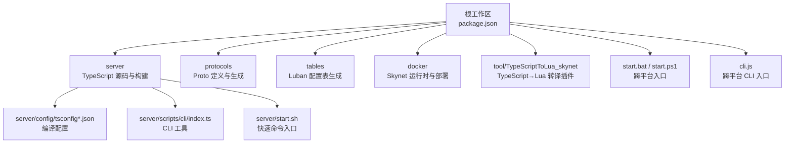
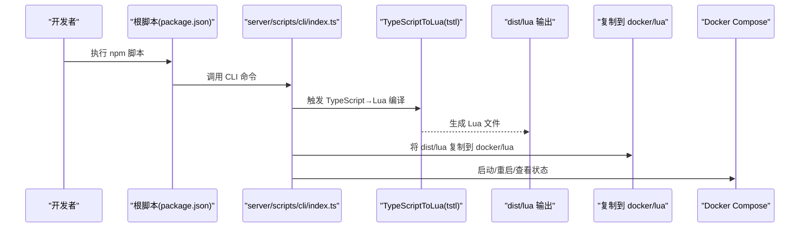
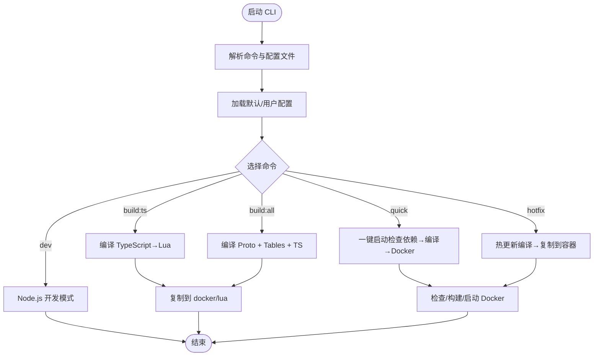
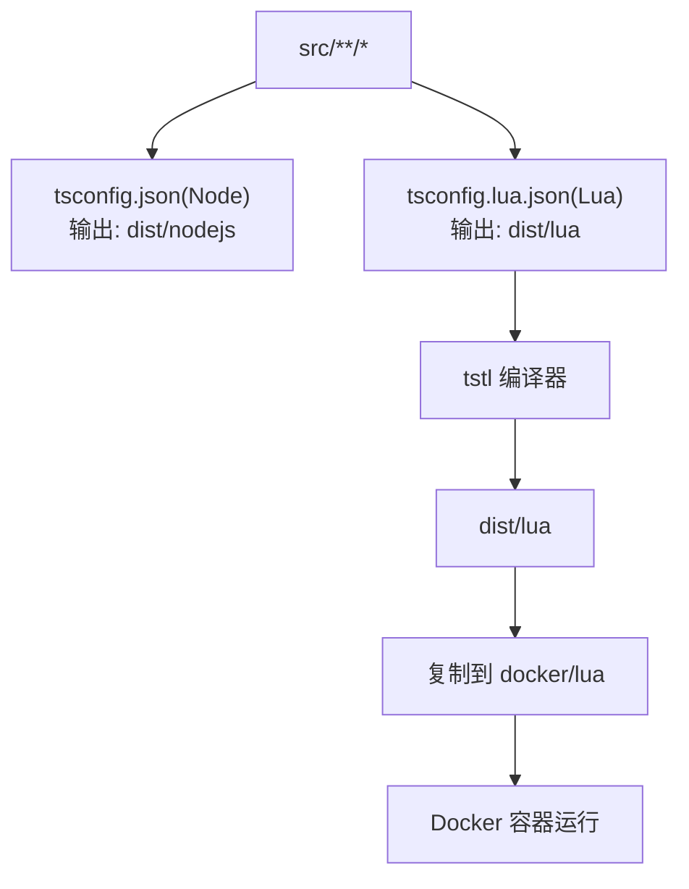
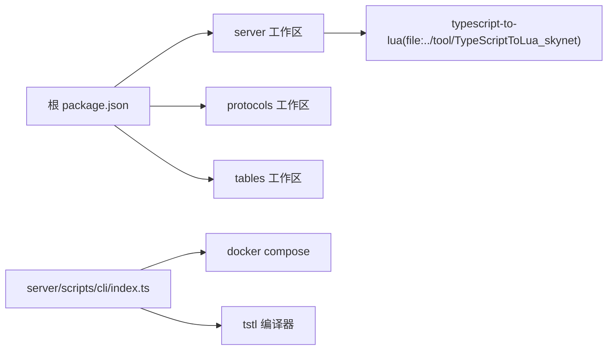

# 本地构建

<cite>
**本文引用的文件**
- [package.json](file://package.json)
- [server/package.json](file://server/package.json)
- [protocols/package.json](file://protocols/package.json)
- [tables/package.json](file://tables/package.json)
- [cli.js](file://cli.js)
- [server/config/tsconfig.json](file://server/config/tsconfig.json)
- [server/config/tsconfig.lua.json](file://server/config/tsconfig.lua.json)
- [server/config/tsconfig.incremental.json](file://server/config/tsconfig.incremental.json)
- [protocols/tsconfig.json](file://protocols/tsconfig.json)
- [tables/tsconfig.json](file://tables/tsconfig.json)
- [server/scripts/cli/index.ts](file://server/scripts/cli/index.ts)
- [server/start.sh](file://server/start.sh)
- [start.bat](file://start.bat)
- [start.ps1](file://start.ps1)
- [tslua.config.yaml](file://tslua.config.yaml)
</cite>

## 目录
1. [简介](#简介)
2. [项目结构](#项目结构)
3. [核心组件](#核心组件)
4. [架构总览](#架构总览)
5. [详细组件分析](#详细组件分析)
6. [依赖关系分析](#依赖关系分析)
7. [性能考虑](#性能考虑)
8. [故障排查指南](#故障排查指南)
9. [结论](#结论)
10. [附录](#附录)

## 简介
本指南面向需要在本地搭建与运行“TypeScript 到 Skynet Lua 运行时”的混合开发框架的工程师。内容涵盖：
- Node.js 环境准备与依赖安装
- TypeScript 编译配置与命令使用
- 构建命令详解（build、clean、dev、node 等）
- TypeScript 到 Lua 的转译流程与关键配置项
- 开发模式与生产/容器模式的差异
- 常见问题排查与最佳实践

## 项目结构
该仓库采用多工作区（workspaces）组织方式，核心模块包括：
- 根工作区：统一脚本与依赖管理
- server：TypeScript 源码与构建配置
- protocols：Protocol Buffers 定义与生成脚本
- tables：Luban 配置表工具链与生成脚本
- docker：Skynet 运行时与部署脚本
- tool：TypeScriptToLua_skynet 插件（本地开发时以文件形式链接）

图表来源
- [package.json:1-52](file://package.json#L1-L52)
- [server/package.json:1-51](file://server/package.json#L1-L51)
- [protocols/package.json:1-28](file://protocols/package.json#L1-L28)
- [tables/package.json:1-23](file://tables/package.json#L1-L23)

章节来源
- [package.json:1-52](file://package.json#L1-L52)
- [server/package.json:1-51](file://server/package.json#L1-L51)
- [protocols/package.json:1-28](file://protocols/package.json#L1-L28)
- [tables/package.json:1-23](file://tables/package.json#L1-L23)

## 核心组件
- 跨平台 CLI 入口：通过 [cli.js:1-58](file://cli.js#L1-L58) 与 [server/scripts/cli/index.ts:1-745](file://server/scripts/cli/index.ts#L1-L745) 提供统一命令行体验，支持 Windows、Linux、macOS。
- 构建命令体系：根与 server 的 scripts 提供 build、dev、clean、server:* 等命令；配合 [start.sh:1-66](file://server/start.sh#L1-L66)、[start.bat:1-32](file://start.bat#L1-L32)、[start.ps1:1-36](file://start.ps1#L1-L36) 实现跨平台快速命令。
- TypeScript 编译配置：server 下的 tsconfig.*.json 决定 Node.js 与 Lua 两套编译目标；其中 [server/config/tsconfig.lua.json:1-23](file://server/config/tsconfig.lua.json#L1-L23) 是 TypeScript→Lua 的关键配置。
- 依赖与工作区：根 [package.json:6-10](file://package.json#L6-L10) 声明 workspaces，server [server/package.json:6-26](file://server/package.json#L6-L26) 定义脚本与本地插件链接。

章节来源
- [cli.js:1-58](file://cli.js#L1-L58)
- [server/scripts/cli/index.ts:1-745](file://server/scripts/cli/index.ts#L1-L745)
- [server/start.sh:1-66](file://server/start.sh#L1-L66)
- [start.bat:1-32](file://start.bat#L1-L32)
- [start.ps1:1-36](file://start.ps1#L1-L36)
- [server/config/tsconfig.lua.json:1-23](file://server/config/tsconfig.lua.json#L1-L23)
- [package.json:6-10](file://package.json#L6-L10)
- [server/package.json:6-26](file://server/package.json#L6-L26)

## 架构总览
下图展示从命令到实际构建与部署的关键路径：

图表来源
- [package.json:11-37](file://package.json#L11-L37)
- [server/scripts/cli/index.ts:547-571](file://server/scripts/cli/index.ts#L547-L571)
- [server/scripts/cli/index.ts:573-613](file://server/scripts/cli/index.ts#L573-L613)
- [server/config/tsconfig.lua.json:12-19](file://server/config/tsconfig.lua.json#L12-L19)

## 详细组件分析

### CLI 工具与命令体系
- 菜单与命令注册：CLI 提供交互式菜单与多种命令，如 quick、start、stop、restart、status、logs、build:ts、build:all、build:clean、dev、setup、hotfix。
- 跨平台执行：内部通过子进程调用 bash/cmd 并继承 stdio，保证日志与错误可见。
- 配置加载：支持 YAML/JSON 配置文件（默认读取项目根 tslua.config.yaml），并允许命令行参数覆盖路径与构建参数。
- Docker 集成：自动检查镜像与容器状态，必要时构建镜像并启动容器；支持热更新将 dist/lua 部署到容器。

图表来源
- [server/scripts/cli/index.ts:301-354](file://server/scripts/cli/index.ts#L301-L354)
- [server/scripts/cli/index.ts:427-496](file://server/scripts/cli/index.ts#L427-L496)
- [server/scripts/cli/index.ts:547-571](file://server/scripts/cli/index.ts#L547-L571)
- [server/scripts/cli/index.ts:615-626](file://server/scripts/cli/index.ts#L615-L626)
- [server/scripts/cli/index.ts:694-707](file://server/scripts/cli/index.ts#L694-L707)

章节来源
- [server/scripts/cli/index.ts:1-745](file://server/scripts/cli/index.ts#L1-L745)
- [tslua.config.yaml:1-52](file://tslua.config.yaml#L1-L52)

### TypeScript 编译配置与转译流程
- Node.js 目标（开发）：[server/config/tsconfig.json:1-26](file://server/config/tsconfig.json#L1-L26) 面向 Node.js 运行时，输出至 dist/nodejs，便于 dev 模式调试。
- Lua 目标（生产/容器）：[server/config/tsconfig.lua.json:1-23](file://server/config/tsconfig.lua.json#L1-L23) 面向 Lua 5.4，启用 skynet 兼容模式与 sourceMapTraceback，输出至 dist/lua。
- 增量编译：[server/config/tsconfig.incremental.json:1-8](file://server/config/tsconfig.incremental.json#L1-L8) 在 Lua 配置基础上开启增量编译与 tsbuildinfo 文件缓存。
- Protobuf 与配置表：分别由 [protocols/package.json:6-9](file://protocols/package.json#L6-L9) 与 [tables/package.json:6-9](file://tables/package.json#L6-L9) 管理构建脚本。

图表来源
- [server/config/tsconfig.json:1-26](file://server/config/tsconfig.json#L1-L26)
- [server/config/tsconfig.lua.json:1-23](file://server/config/tsconfig.lua.json#L1-L23)
- [server/config/tsconfig.incremental.json:1-8](file://server/config/tsconfig.incremental.json#L1-L8)
- [server/scripts/cli/index.ts:547-571](file://server/scripts/cli/index.ts#L547-L571)

章节来源
- [server/config/tsconfig.json:1-26](file://server/config/tsconfig.json#L1-L26)
- [server/config/tsconfig.lua.json:1-23](file://server/config/tsconfig.lua.json#L1-L23)
- [server/config/tsconfig.incremental.json:1-8](file://server/config/tsconfig.incremental.json#L1-L8)
- [protocols/package.json:6-9](file://protocols/package.json#L6-L9)
- [tables/package.json:6-9](file://tables/package.json#L6-L9)

### 跨平台启动脚本
- Linux/macOS：通过 [server/start.sh:1-66](file://server/start.sh#L1-L66) 提供 build、tables、clean、status、stop、restart、hotfix、node、logs 等命令。
- Windows：通过 [start.bat:1-32](file://start.bat#L1-L32) 与 [start.ps1:1-36](file://start.ps1#L1-L36) 设置默认配置文件并转发到 npm run cli。
- 根入口：[cli.js:1-58](file://cli.js#L1-L58) 自动检测 tsx/ts-node 并回退到 npx，确保跨平台可用。

章节来源
- [server/start.sh:1-66](file://server/start.sh#L1-L66)
- [start.bat:1-32](file://start.bat#L1-L32)
- [start.ps1:1-36](file://start.ps1#L1-L36)
- [cli.js:1-58](file://cli.js#L1-L58)

## 依赖关系分析
- 根工作区依赖 server、protocols、tables 三个工作区，脚本通过 npm run 转发到对应目录。
- server 本地链接 TypeScriptToLua_skynet 插件，确保编译器能力来自本地工具链。
- CLI 依赖 js-yaml 读取配置，exec/spawn 调用 Docker 与构建命令。

图表来源
- [package.json:6-10](file://package.json#L6-L10)
- [server/package.json:48-48](file://server/package.json#L48-L48)
- [server/scripts/cli/index.ts:498-545](file://server/scripts/cli/index.ts#L498-L545)

章节来源
- [package.json:6-10](file://package.json#L6-L10)
- [server/package.json:48-48](file://server/package.json#L48-L48)
- [server/scripts/cli/index.ts:498-545](file://server/scripts/cli/index.ts#L498-L545)

## 性能考虑
- 增量编译：在 Lua 目标配置中启用增量编译与 tsbuildinfo，可显著缩短二次构建时间。
- Watch 模式：server 提供 TypeScript→Lua 的 watch 模式，适合开发阶段持续编译。
- 构建产物清理：CLI 在编译完成后清理 dist 目录，减少磁盘占用并保持工作区整洁。

章节来源
- [server/config/tsconfig.incremental.json:1-8](file://server/config/tsconfig.incremental.json#L1-L8)
- [server/package.json:12-13](file://server/package.json#L12-L13)
- [server/scripts/cli/index.ts:631-637](file://server/scripts/cli/index.ts#L631-L637)

## 故障排查指南
- 依赖缺失
  - 症状：CLI 报错提示缺少依赖或无法启动。
  - 排查：确认已在 server 目录安装依赖；根入口 [cli.js:51-55](file://cli.js#L51-L55) 会在启动失败时提示安装依赖。
  - 处理：在根目录执行安装命令，或在 server 目录执行安装。
- Docker 未安装/未启动
  - 症状：quick 或 server:* 命令失败。
  - 排查：CLI 会检测 docker --version；若无输出则报错。
  - 处理：安装并启动 Docker Desktop/Engine。
- 编译失败
  - 症状：build:ts 返回非零退出码。
  - 排查：检查 [server/config/tsconfig.lua.json:12-19](file://server/config/tsconfig.lua.json#L12-L19) 中的 tstl 选项是否正确；确认本地插件已安装。
  - 处理：修复类型错误或调整配置项后重试。
- 热更新未生效
  - 症状：hotfix 成功但容器内代码未更新。
  - 排查：确认容器正在运行且名称匹配；CLI 会尝试复制 dist/lua 至容器。
  - 处理：重启容器或手动检查容器内目标路径。

章节来源
- [cli.js:51-55](file://cli.js#L51-L55)
- [server/scripts/cli/index.ts:449-453](file://server/scripts/cli/index.ts#L449-L453)
- [server/scripts/cli/index.ts:547-571](file://server/scripts/cli/index.ts#L547-L571)
- [server/scripts/cli/index.ts:694-707](file://server/scripts/cli/index.ts#L694-L707)

## 结论
通过本指南，您可以在本地完成从 Node.js 开发到 Docker 容器部署的完整构建流程。建议：
- 使用 CLI 的 quick 命令进行首次启动验证
- 开发阶段结合 watch 模式与 dev 命令提升迭代效率
- 生产/容器阶段使用 build:all 与 build:ts 确保产物一致性
- 遇到问题优先检查依赖、Docker 状态与编译配置

## 附录

### 构建命令速查
- 根脚本（根目录执行）
  - npm run cli / npm run menu：打开交互式菜单
  - npm run dev：Node.js 开发模式
  - npm run build：完整构建（委托给 server）
  - npm run build:ts：仅编译 TypeScript→Lua
  - npm run build:proto：编译 Protobuf
  - npm run build:tables：编译 Luban 配置表
  - npm run clean：清理构建产物
  - npm run server:start/stop/restart/status/logs：Docker 服务控制
- server 脚本（server 目录执行）
  - npm run cli：CLI 工具入口
  - npm run dev：Node.js 开发模式
  - npm run build：完整构建
  - npm run build:ts / build:ts:watch：TypeScript→Lua 编译与监听
  - npm run build:proto / build:tables：各自子系统的构建
  - npm run clean：清理构建产物
- 跨平台快速命令
  - Linux/macOS：./server/start.sh [命令]
  - Windows：start.bat / start.ps1 [命令]

章节来源
- [package.json:11-37](file://package.json#L11-L37)
- [server/package.json:6-26](file://server/package.json#L6-L26)
- [server/start.sh:7-37](file://server/start.sh#L7-L37)
- [start.bat:25-31](file://start.bat#L25-L31)
- [start.ps1:29-35](file://start.ps1#L29-L35)

### TypeScript 到 Lua 的转译配置要点
- 目标语言与模块：Lua 5.4，模块解析策略适配 bundler。
- 关键选项（摘自 [server/config/tsconfig.lua.json:12-19](file://server/config/tsconfig.lua.json#L12-L19)）：
  - luaTarget：5.4
  - luaLibImport：require
  - sourceMapTraceback：开启堆栈追踪
  - noImplicitSelf：严格 self 语义
  - noHeader：禁用头部注释
  - skynetCompat：启用 Skynet 兼容层
- 输出与输入：
  - outDir：dist/lua
  - rootDir：src
  - include：src/**/*

章节来源
- [server/config/tsconfig.lua.json:12-19](file://server/config/tsconfig.lua.json#L12-L19)