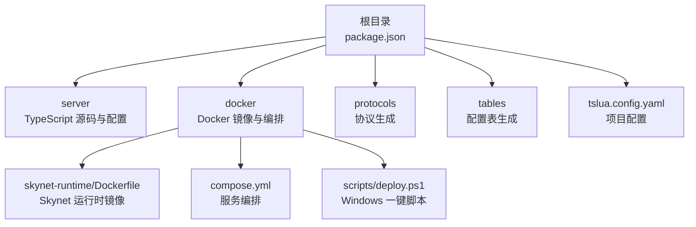
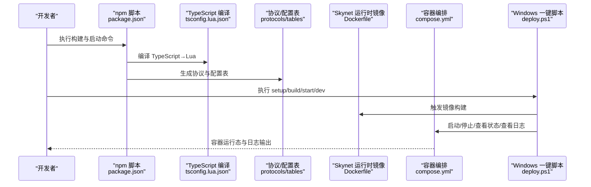
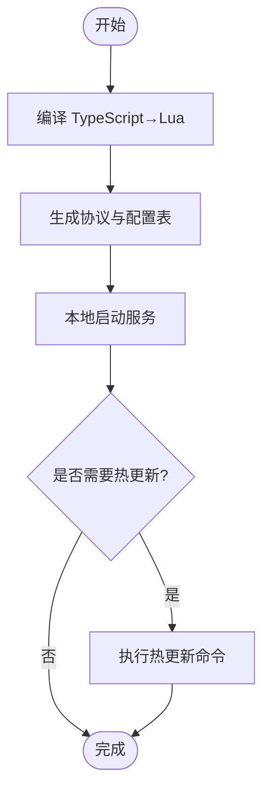
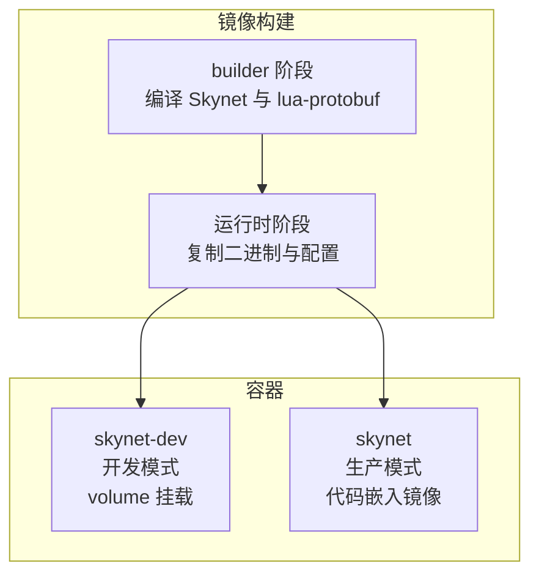
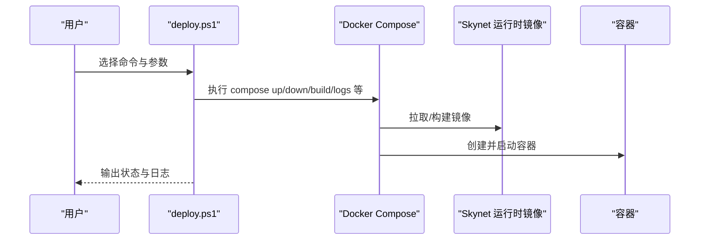
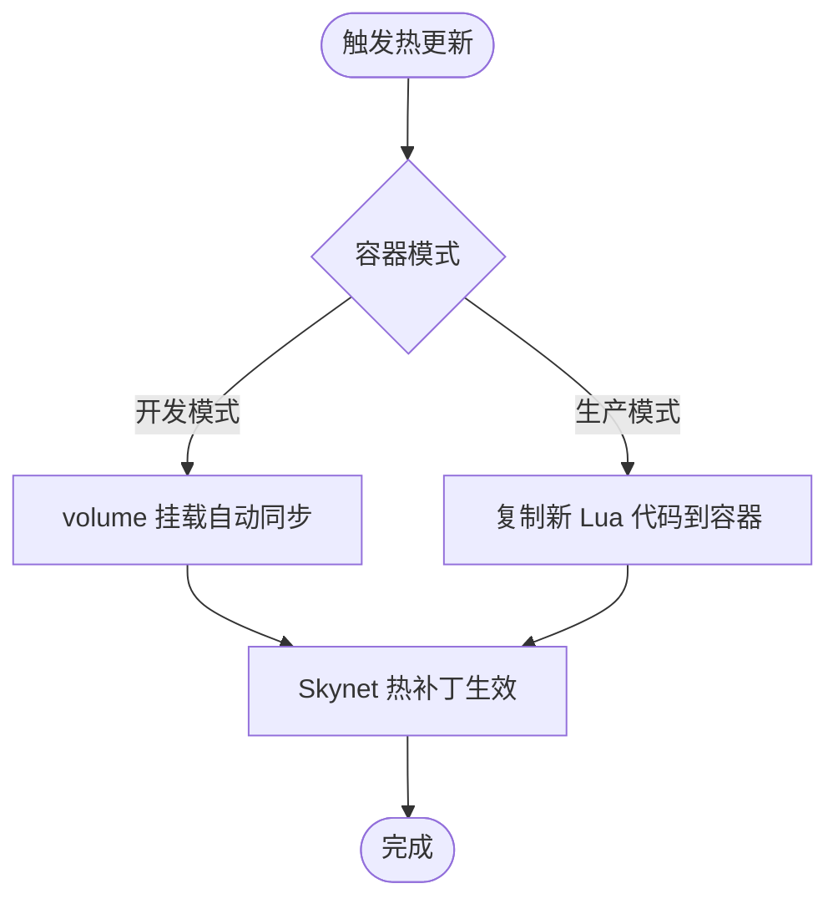
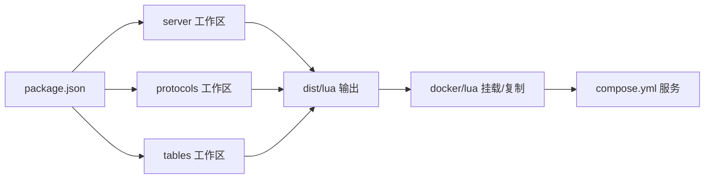

# 构建与部署

<cite>
**本文引用的文件**
- [compose.yml](file://docker/compose.yml)
- [Dockerfile（Skynet 运行时）](file://docker/skynet-runtime/Dockerfile)
- [Dockerfile（Server 开发镜像）](file://server/Dockerfile)
- [package.json](file://package.json)
- [deploy.ps1](file://docker/scripts/deploy.ps1)
- [deploy.bat](file://docker/scripts/deploy.bat)
- [start.sh（根）](file://start.sh)
- [start.sh（server）](file://server/start.sh)
- [tslua.config.yaml](file://tslua.config.yaml)
- [config.tslua](file://docker/config/skynet/config.tslua)
- [tsconfig.json（NodeJS）](file://server/config/tsconfig.json)
- [tsconfig.lua.json（TypeScript→Lua）](file://server/config/tsconfig.lua.json)
</cite>

## 目录
1. [简介](#简介)
2. [项目结构](#项目结构)
3. [核心组件](#核心组件)
4. [架构总览](#架构总览)
5. [详细组件分析](#详细组件分析)
6. [依赖关系分析](#依赖关系分析)
7. [性能考量](#性能考量)
8. [故障排查指南](#故障排查指南)
9. [结论](#结论)
10. [附录](#附录)

## 简介
本指南面向从本地开发到生产部署的完整流程，覆盖以下内容：
- 本地构建：TypeScript 编译为 Lua、协议与配置表生成、本地服务启动
- Docker 容器化：Skynet 运行时镜像构建、开发/生产容器编排、环境变量与挂载
- 生产部署：镜像构建、容器启动、日志与状态监控、一键脚本使用
- 热更新机制：基于 Skynet 的热补丁能力与容器部署配合
- 回滚与故障恢复：镜像版本管理、日志审计与容器回退策略

## 项目结构
项目采用多工作区与容器化双轨并行的组织方式：
- 根目录提供统一的 npm 脚本与一键命令入口
- server 目录包含 TypeScript 源码与编译配置
- docker 目录包含 Skynet 运行时镜像、容器编排与 Windows 部署脚本
- protocols 与 tables 目录分别负责协议与配置表的生成

图表来源
- [package.json:11-37](file://package.json#L11-L37)
- [compose.yml:6-70](file://docker/compose.yml#L6-L70)
- [Dockerfile（Skynet 运行时）:1-91](file://docker/skynet-runtime/Dockerfile#L1-L91)
- [deploy.ps1:1-430](file://docker/scripts/deploy.ps1#L1-L430)
- [tslua.config.yaml:11-44](file://tslua.config.yaml#L11-L44)

章节来源
- [package.json:11-37](file://package.json#L11-L37)
- [tslua.config.yaml:11-44](file://tslua.config.yaml#L11-L44)

## 核心组件
- 本地构建链路
  - TypeScript → Lua：通过 server/config/tsconfig.lua.json 控制编译目标与 Lua 目标版本
  - 协议与配置表：通过 protocols 与 tables 工作区的构建脚本生成
  - 本地启动：server/start.sh 提供菜单与常用命令
- Docker 部署链路
  - Skynet 运行时镜像：基于 Ubuntu 22.04，分阶段构建，包含编译好的 Skynet 与 lua-protobuf
  - 容器编排：compose.yml 定义开发与生产两种模式，支持 volume 挂载与只读挂载
  - Windows 一键脚本：deploy.ps1 提供 setup/build/start/dev/stop/restart/status/logs/deploy/shell/clean 等命令

章节来源
- [tsconfig.lua.json:1-23](file://server/config/tsconfig.lua.json#L1-L23)
- [start.sh（server）:7-65](file://server/start.sh#L7-L65)
- [Dockerfile（Skynet 运行时）:1-91](file://docker/skynet-runtime/Dockerfile#L1-L91)
- [compose.yml:6-70](file://docker/compose.yml#L6-L70)
- [deploy.ps1:416-429](file://docker/scripts/deploy.ps1#L416-L429)

## 架构总览
下图展示从代码到生产环境的端到端流程，包括本地构建、镜像构建、容器编排与部署。

图表来源
- [package.json:11-37](file://package.json#L11-L37)
- [tsconfig.lua.json:10-18](file://server/config/tsconfig.lua.json#L10-L18)
- [Dockerfile（Skynet 运行时）:18-73](file://docker/skynet-runtime/Dockerfile#L18-L73)
- [compose.yml:11-63](file://docker/compose.yml#L11-L63)
- [deploy.ps1:416-429](file://docker/scripts/deploy.ps1#L416-L429)

## 详细组件分析

### 本地构建与启动
- TypeScript → Lua
  - 使用 server/config/tsconfig.lua.json 控制输出目录与 Lua 目标版本
  - 通过 server/start.sh 或根目录 npm 脚本触发编译
- 协议与配置表
  - protocols 与 tables 工作区提供独立构建脚本，生成运行时所需的二进制或序列化数据
- 本地服务启动
  - server/start.sh 提供菜单与常用命令，包括启动、停止、重启、热更新、日志查看等

图表来源
- [tsconfig.lua.json:10-18](file://server/config/tsconfig.lua.json#L10-L18)
- [start.sh（server）:7-65](file://server/start.sh#L7-L65)

章节来源
- [tsconfig.lua.json:10-18](file://server/config/tsconfig.lua.json#L10-L18)
- [start.sh（server）:7-65](file://server/start.sh#L7-L65)

### Docker 镜像与容器编排
- Skynet 运行时镜像
  - 分阶段构建：builder 阶段编译 Skynet 与 lua-protobuf；运行时阶段仅复制必要文件，最小化镜像体积
  - 暴露端口 8888（游戏端口）、9999（调试/管理端口），默认启动脚本读取 SKYNET_CONFIG 环境变量
- 容器编排
  - 开发模式（skynet-dev）：使用 volume 挂载，代码修改即时生效，适合迭代开发
  - 生产模式（skynet）：代码嵌入镜像，自包含部署，适合线上稳定运行
  - 网络与卷：定义桥接网络与日志卷，便于日志持久化与容器间通信

图表来源
- [Dockerfile（Skynet 运行时）:7-91](file://docker/skynet-runtime/Dockerfile#L7-L91)
- [compose.yml:11-63](file://docker/compose.yml#L11-L63)

章节来源
- [Dockerfile（Skynet 运行时）:7-91](file://docker/skynet-runtime/Dockerfile#L7-L91)
- [compose.yml:11-63](file://docker/compose.yml#L11-L63)

### Windows 一键部署脚本
- 功能概览
  - setup：检查 Docker 环境、创建必要目录
  - build：构建镜像（支持 --no-cache）
  - start/dev：启动生产/开发容器（支持 -Daemon 后台运行）
  - stop/restart/status/logs：容器生命周期与状态查看
  - deploy：编译 TypeScript 并部署到运行中的容器
  - shell：进入容器 Shell
  - clean：清理容器与镜像
- 参数与行为
  - -Daemon：后台运行
  - -NoCache：构建时不使用缓存
  - -Help：显示帮助

图表来源
- [deploy.ps1:416-429](file://docker/scripts/deploy.ps1#L416-L429)
- [compose.yml:11-63](file://docker/compose.yml#L11-L63)

章节来源
- [deploy.ps1:7-15](file://docker/scripts/deploy.ps1#L7-L15)
- [deploy.ps1:416-429](file://docker/scripts/deploy.ps1#L416-L429)

### 热更新机制
- 实现原理
  - 基于 Skynet 的热补丁能力，通过服务层的动态加载与替换实现局部更新
  - 在开发模式下，volume 挂载使 Lua 代码变更即时生效；生产模式下可通过部署脚本将新代码复制到容器
- 使用方法
  - 通过 server/start.sh 的 hotfix 子命令触发特定服务的热更新
  - 在容器环境中，结合 deploy.ps1 的 deploy 命令完成代码更新与热补丁

图表来源
- [start.sh（server）:29-31](file://server/start.sh#L29-L31)
- [deploy.ps1:332-366](file://docker/scripts/deploy.ps1#L332-L366)

章节来源
- [start.sh（server）:29-31](file://server/start.sh#L29-L31)
- [deploy.ps1:332-366](file://docker/scripts/deploy.ps1#L332-L366)

### 环境配置差异（开发/测试/生产）
- 开发环境
  - 使用 skynet-dev 服务，volume 挂载 server/dist/lua 到 /skynet/lua，便于实时调试
  - 端口映射：8888（游戏）、9999（调试）
  - 配置文件通过环境变量 SKYNET_CONFIG 指向 /skynet-config/config.tslua
- 测试环境
  - 可复用生产镜像，但使用不同的配置文件与网络隔离
  - 建议通过 compose 的覆盖文件或环境变量切换配置
- 生产环境
  - 使用 skynet 服务，代码嵌入镜像，减少运行时依赖
  - 日志输出到 stdout，便于容器日志收集

章节来源
- [compose.yml:8-36](file://docker/compose.yml#L8-L36)
- [compose.yml:39-63](file://docker/compose.yml#L39-L63)
- [config.tslua:6-40](file://docker/config/skynet/config.tslua#L6-L40)

## 依赖关系分析
- npm 脚本与工作区
  - 根 package.json 将 server、protocols、tables 设为 workspaces，统一管理构建与脚本
  - 通过 npm run docker:* 与 docker/cli/index.js 协同，提供 Docker 管理能力
- TypeScript 编译配置
  - server/config/tsconfig.lua.json 指定 Lua 输出目录与目标版本，确保与 Skynet 运行时兼容
- Docker 配置
  - compose.yml 与 tslua.config.yaml 协同，定义服务名、容器名、挂载路径与复制目标

图表来源
- [package.json:6-10](file://package.json#L6-L10)
- [tsconfig.lua.json:10-18](file://server/config/tsconfig.lua.json#L10-L18)
- [tslua.config.yaml:20-23](file://tslua.config.yaml#L20-L23)
- [compose.yml:20-28](file://docker/compose.yml#L20-L28)

章节来源
- [package.json:6-10](file://package.json#L6-L10)
- [tslua.config.yaml:20-23](file://tslua.config.yaml#L20-L23)

## 性能考量
- 镜像体积与启动时间
  - 运行时镜像仅复制必要文件，避免安装开发工具链，缩短构建与启动时间
- 端口与网络
  - 通过 compose.yml 的端口映射与桥接网络，减少容器间通信延迟
- 日志输出
  - 生产环境将日志输出到 stdout，便于容器日志收集与分析

章节来源
- [Dockerfile（Skynet 运行时）:44-47](file://docker/skynet-runtime/Dockerfile#L44-L47)
- [config.tslua:34-40](file://docker/config/skynet/config.tslua#L34-L40)

## 故障排查指南
- Docker 环境问题
  - 症状：无法执行 docker 命令或 docker info 报错
  - 排查：确认 Docker Desktop 已安装且以 WSL2 后端运行
- 端口冲突
  - 症状：容器启动失败或端口占用
  - 排查：修改 compose.yml 中的端口映射
- 镜像构建失败
  - 症状：构建过程中报错
  - 排查：使用 -NoCache 参数重新构建，或检查 server/dist/lua 是否存在
- 容器无法启动
  - 症状：容器启动即退出
  - 排查：查看日志（docker compose logs -f skynet），确认配置文件路径与权限

章节来源
- [deploy.ps1:101-143](file://docker/scripts/deploy.ps1#L101-L143)
- [deploy.ps1:175-211](file://docker/scripts/deploy.ps1#L175-L211)
- [deploy.ps1:324-327](file://docker/scripts/deploy.ps1#L324-L327)

## 结论
本指南提供了从本地开发到生产部署的一体化流程，结合 TypeScript→Lua 编译、协议与配置表生成、Skynet 运行时镜像构建与容器编排，以及 Windows 一键脚本，实现了高效、可重复的交付过程。通过热更新机制与日志体系，可在不中断服务的前提下进行快速修复与迭代。

## 附录

### 一键启动脚本使用方法与参数
- 常用命令
  - setup：初始化环境（检查依赖、创建目录）
  - build：构建镜像（支持 -NoCache）
  - start：启动生产容器（支持 -Daemon）
  - dev：启动开发容器（支持 -Daemon）
  - stop/restart/status/logs：容器生命周期与状态查看
  - deploy：编译 TypeScript 并部署到运行中的容器
  - shell：进入容器 Shell
  - clean：清理容器与镜像
- 示例
  - 开发模式前台运行：.\docker-deploy.ps1 dev
  - 开发模式后台运行：.\docker-deploy.ps1 dev -Daemon
  - 生产模式构建并启动：.\docker-deploy.ps1 build && \docker-deploy.ps1 start -Daemon
  - 查看状态与日志：.\docker-deploy.ps1 status && \docker-deploy.ps1 logs

章节来源
- [deploy.ps1:48-84](file://docker/scripts/deploy.ps1#L48-L84)
- [deploy.ps1:416-429](file://docker/scripts/deploy.ps1#L416-L429)

### 部署前检查清单
- 本地构建
  - TypeScript 已成功编译至 dist/lua
  - 协议与配置表已生成
- Docker 环境
  - Docker Desktop 已启动，WSL2 后端可用
  - compose.yml 与 config.tslua 配置正确
- 镜像与容器
  - 镜像构建成功
  - 容器启动成功，端口映射正常

章节来源
- [deploy.ps1:175-211](file://docker/scripts/deploy.ps1#L175-L211)
- [compose.yml:11-63](file://docker/compose.yml#L11-L63)
- [config.tslua:6-40](file://docker/config/skynet/config.tslua#L6-L40)

### 部署后验证方法
- 状态检查
  - 使用 status 命令查看容器与镜像状态
- 日志检查
  - 使用 logs 命令查看容器日志，确认服务正常启动
- 功能验证
  - 通过游戏端口与调试端口进行连通性测试

章节来源
- [deploy.ps1:299-327](file://docker/scripts/deploy.ps1#L299-L327)

### 回滚策略与故障恢复
- 回滚策略
  - 使用不同标签的镜像进行快速回滚
  - 通过 compose 的服务升级/降级能力进行版本切换
- 故障恢复
  - 清理环境：使用 clean 命令删除容器与镜像后重新构建
  - 日志审计：通过 docker compose logs 定位问题
  - 配置恢复：检查 config.tslua 与 compose.yml 的配置项

章节来源
- [deploy.ps1:391-402](file://docker/scripts/deploy.ps1#L391-L402)
- [config.tslua:34-40](file://docker/config/skynet/config.tslua#L34-L40)