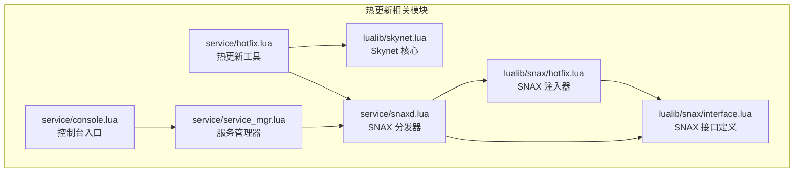
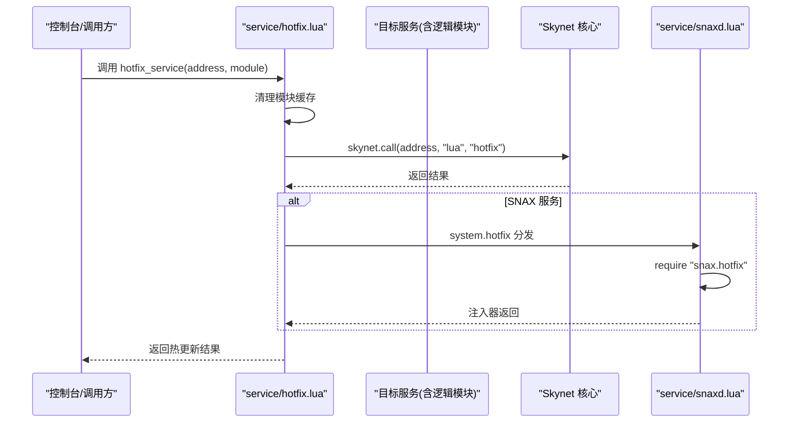
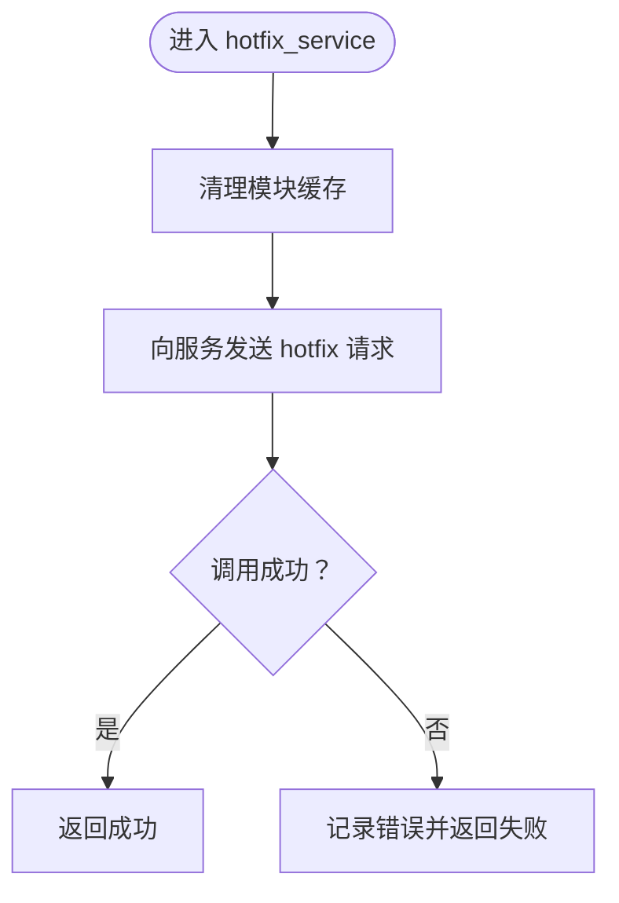
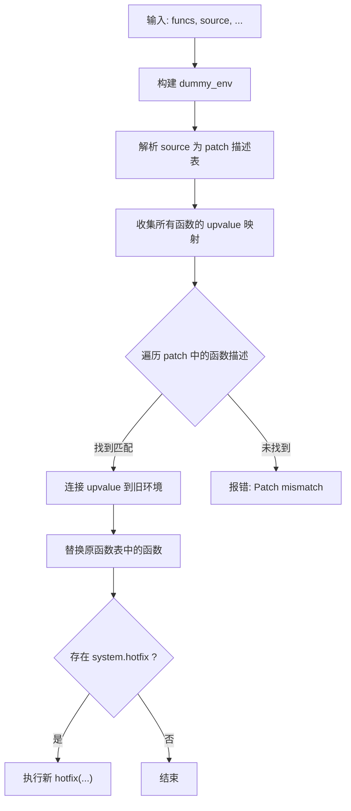
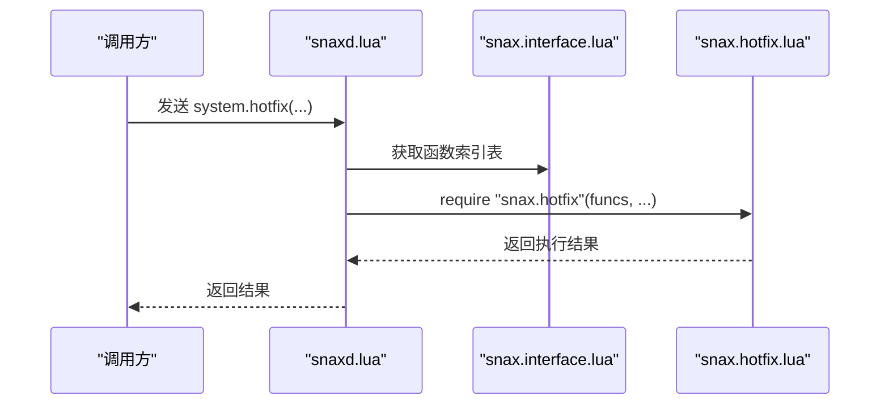
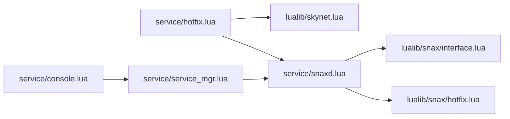

# 热更新机制

<cite>
**本文引用的文件**
- [hotfix.lua](file://docker/skynet/service/hotfix.lua)
- [hotfix.lua](file://docker/skynet/lualib/snax/hotfix.lua)
- [snaxd.lua](file://docker/skynet/service/snaxd.lua)
- [interface.lua](file://docker/skynet/lualib/snax/interface.lua)
- [service_mgr.lua](file://docker/skynet/service/service_mgr.lua)
- [console.lua](file://docker/skynet/service/console.lua)
- [skynet.lua](file://docker/skynet/lualib/skynet.lua)
</cite>

## 目录
1. [引言](#引言)
2. [项目结构](#项目结构)
3. [核心组件](#核心组件)
4. [架构总览](#架构总览)
5. [详细组件分析](#详细组件分析)
6. [依赖关系分析](#依赖关系分析)
7. [性能考量](#性能考量)
8. [故障排查指南](#故障排查指南)
9. [结论](#结论)
10. [附录](#附录)

## 引言
本文件系统性阐述 Skynet 框架在 TS（TypeScript）编译为 Lua 的工程中实现的热更新机制，覆盖服务替换、状态保持与无缝切换的关键技术点；详解 hotfix 命令的使用方法与参数选项；给出从代码修改到服务替换的完整流程；解释热更新过程中的数据一致性保障与异常处理；并总结版本管理、回滚策略与测试验证的最佳实践及常见问题诊断。

## 项目结构
围绕热更新的相关模块主要分布在以下位置：
- 服务侧热更新入口与批量操作：docker/skynet/service/hotfix.lua
- SNAX 热更新注入器与系统方法：docker/skynet/lualib/snax/hotfix.lua、docker/skynet/lualib/snax/interface.lua
- SNAX 服务管理器分发器：docker/skynet/service/snaxd.lua
- 通用服务管理器：docker/skynet/service/service_mgr.lua
- 控制台命令入口（示例）：docker/skynet/service/console.lua
- Skynet 核心库（消息协议、调用模型等）：docker/skynet/lualib/skynet.lua

图表来源
- [hotfix.lua:1-72](file://docker/skynet/service/hotfix.lua#L1-L72)
- [hotfix.lua:1-119](file://docker/skynet/lualib/snax/hotfix.lua#L1-L119)
- [interface.lua:1-90](file://docker/skynet/lualib/snax/interface.lua#L1-L90)
- [snaxd.lua:1-91](file://docker/skynet/service/snaxd.lua#L1-L91)
- [service_mgr.lua:1-229](file://docker/skynet/service/service_mgr.lua#L1-L229)
- [console.lua:1-30](file://docker/skynet/service/console.lua#L1-L30)
- [skynet.lua:1-200](file://docker/skynet/lualib/skynet.lua#L1-L200)

章节来源
- [hotfix.lua:1-72](file://docker/skynet/service/hotfix.lua#L1-L72)
- [hotfix.lua:1-119](file://docker/skynet/lualib/snax/hotfix.lua#L1-L119)
- [interface.lua:1-90](file://docker/skynet/lualib/snax/interface.lua#L1-L90)
- [snaxd.lua:1-91](file://docker/skynet/service/snaxd.lua#L1-L91)
- [service_mgr.lua:1-229](file://docker/skynet/service/service_mgr.lua#L1-L229)
- [console.lua:1-30](file://docker/skynet/service/console.lua#L1-L30)
- [skynet.lua:1-200](file://docker/skynet/lualib/skynet.lua#L1-L200)

## 核心组件
- 热更新工具（服务侧）
  - 提供模块缓存清理与重载能力，支持单服务热更新与批量热更新。
  - 关键函数：clear_module、reload_module、hotfix_service、hotfix_services。
- SNAX 热更新注入器
  - 基于 upvalue 收集与连接，实现函数级热替换，保留环境变量与闭包引用。
  - 关键函数：inject、patch_func、collect_all_uv、_patch。
- SNAX 接口与分发器
  - 定义 system 方法（含 hotfix），并由 snaxd 统一分发。
  - 关键结构：system 方法表、分发器 dispatcher。
- 服务管理器
  - 统一的服务生命周期与查询接口，支撑热更新前后的服务定位与状态查询。
- 控制台入口
  - 示例展示如何通过命令行触发服务创建或调用，便于热更新流程集成。

章节来源
- [hotfix.lua:10-71](file://docker/skynet/service/hotfix.lua#L10-L71)
- [hotfix.lua:17-118](file://docker/skynet/lualib/snax/hotfix.lua#L17-L118)
- [interface.lua:50-79](file://docker/skynet/lualib/snax/interface.lua#L50-L79)
- [snaxd.lua:49-84](file://docker/skynet/service/snaxd.lua#L49-L84)
- [service_mgr.lua:78-96](file://docker/skynet/service/service_mgr.lua#L78-L96)
- [console.lua:13-25](file://docker/skynet/service/console.lua#L13-L25)

## 架构总览
热更新在 Skynet 中分为两条路径：
- 服务侧热更新：通过 service/hotfix.lua 对目标服务地址发送 "hotfix" 请求，同时清理逻辑模块缓存后重载。
- SNAX 热更新：通过 snaxd.lua 的 system.hotfix 分发，借助 lualib/snax/hotfix.lua 的注入器完成函数级替换。

图表来源
- [hotfix.lua:34-51](file://docker/skynet/service/hotfix.lua#L34-L51)
- [snaxd.lua:54-58](file://docker/skynet/service/snaxd.lua#L54-L58)
- [skynet.lua:1-200](file://docker/skynet/lualib/skynet.lua#L1-L200)

## 详细组件分析

### 服务侧热更新工具（service/hotfix.lua）
- 模块缓存清理
  - 通过 package.loaded[module] = nil 清除缓存，避免旧模块影响重载。
- 模块重载
  - 使用 pcall(require, module_name) 触发重载，失败时记录错误并返回。
- 单服务热更新
  - 对指定服务地址发送 "lua" 协议的 "hotfix" 请求，等待返回。
- 批量热更新
  - 遍历服务列表逐个执行热更新，统计成功与失败数量。

图表来源
- [hotfix.lua:17-51](file://docker/skynet/service/hotfix.lua#L17-L51)

章节来源
- [hotfix.lua:10-71](file://docker/skynet/service/hotfix.lua#L10-L71)

### SNAX 热更新注入器（lualib/snax/hotfix.lua）
- upvalue 收集与连接
  - 递归收集函数的 upvalue，识别 _ENV 并建立 upvalueid 映射，确保新函数能正确连接到旧环境。
- 函数级替换
  - 将 patch 中的新函数替换到原函数表对应位置，必要时递归处理嵌套函数。
- 注入流程
  - 通过 loader(source) 加载补丁源码，构建 patch 描述表，按组名与方法名匹配并替换，最后可选执行 system.hotfix。

图表来源
- [hotfix.lua:55-118](file://docker/skynet/lualib/snax/hotfix.lua#L55-L118)

章节来源
- [hotfix.lua:1-119](file://docker/skynet/lualib/snax/hotfix.lua#L1-L119)

### SNAX 接口与分发器（lualib/snax/interface.lua、service/snaxd.lua）
- 接口定义
  - 通过 snax.interface 生成函数索引表，定义 system 方法集合（init、exit、hotfix、profile）。
- 分发器
  - snaxd.lua 在收到 system 命令时，根据命令类型分发至相应处理逻辑；hotfix 命令交由 snax.hotfix 注入器执行。

图表来源
- [interface.lua:50-79](file://docker/skynet/lualib/snax/interface.lua#L50-L79)
- [snaxd.lua:54-58](file://docker/skynet/service/snaxd.lua#L54-L58)

章节来源
- [interface.lua:1-90](file://docker/skynet/lualib/snax/interface.lua#L1-L90)
- [snaxd.lua:49-84](file://docker/skynet/service/snaxd.lua#L49-L84)

### 服务管理器（service/service_mgr.lua）
- 服务生命周期
  - 统一处理服务创建、查询与状态上报，支持本地与全局服务名解析。
- 与热更新的关系
  - 通过 SERVICE 服务进行远程服务查询与启动，便于在热更新前后定位服务状态。

章节来源
- [service_mgr.lua:78-96](file://docker/skynet/service/service_mgr.lua#L78-L96)

### 控制台入口（service/console.lua）
- 命令解析
  - 将输入按空白分割，支持以 "snax" 开头创建 SNAX 服务，或直接创建普通服务。
- 与热更新结合
  - 可作为热更新流程的前端入口，配合 service_mgr 进行服务管理与状态查询。

章节来源
- [console.lua:5-25](file://docker/skynet/service/console.lua#L5-L25)

## 依赖关系分析
- 模块耦合
  - service/hotfix.lua 依赖 Skynet 核心的 call 机制与 package.loaded 缓存。
  - lualib/snax/hotfix.lua 依赖 snax.interface 的函数索引表与 upvalue 操作。
  - service/snaxd.lua 依赖 snax.interface 的 system 方法表与 require 机制。
- 外部依赖
  - 依赖 Skynet 的消息协议与调度模型（见 lualib/skynet.lua）。

图表来源
- [hotfix.lua:6-31](file://docker/skynet/service/hotfix.lua#L6-L31)
- [hotfix.lua:1-15](file://docker/skynet/lualib/snax/hotfix.lua#L1-L15)
- [snaxd.lua:1-10](file://docker/skynet/service/snaxd.lua#L1-L10)
- [interface.lua:1-20](file://docker/skynet/lualib/snax/interface.lua#L1-L20)
- [service_mgr.lua:1-5](file://docker/skynet/service/service_mgr.lua#L1-L5)
- [console.lua:1-5](file://docker/skynet/service/console.lua#L1-L5)
- [skynet.lua:1-50](file://docker/skynet/lualib/skynet.lua#L1-L50)

章节来源
- [skynet.lua:1-200](file://docker/skynet/lualib/skynet.lua#L1-L200)

## 性能考量
- 模块重载成本
  - 清理缓存与重新加载会带来 CPU 与内存开销，建议在低峰期执行或分批进行。
- upvalue 连接复杂度
  - 递归收集与连接 upvalue 的代价与函数闭包层级成正比，应避免过度复杂的闭包结构。
- 批量热更新策略
  - 采用分批与限速策略，避免集中式热更新导致的抖动。

## 故障排查指南
- 热更新失败
  - 检查模块是否被其他协程持有引用；确认逻辑模块已清理缓存并可重载。
  - 查看服务日志，定位 skynet.call 返回的错误信息。
- SNAX 注入失败
  - 确认 patch 中的方法名与组名与接口定义一致；检查 system.hotfix 是否存在。
- 服务不可达
  - 使用 service_mgr 查询服务状态，确认服务地址与名称解析正确。
- 控制台命令无效
  - 确认命令格式与参数，检查 console.lua 的命令解析逻辑。

章节来源
- [hotfix.lua:24-28](file://docker/skynet/service/hotfix.lua#L24-L28)
- [hotfix.lua:93-97](file://docker/skynet/lualib/snax/hotfix.lua#L93-L97)
- [snaxd.lua:54-58](file://docker/skynet/service/snaxd.lua#L54-L58)
- [service_mgr.lua:98-131](file://docker/skynet/service/service_mgr.lua#L98-L131)
- [console.lua:5-11](file://docker/skynet/service/console.lua#L5-L11)

## 结论
Skynet 的热更新机制通过“服务侧热更新工具 + SNAX 注入器”的双通道设计，在不中断业务的前提下实现模块与函数级的动态替换。其关键在于：
- 清理模块缓存与重载，确保新代码生效；
- 通过 upvalue 收集与连接，维持闭包与环境的一致性；
- 以 system.hotfix 为统一入口，结合 snaxd 分发器完成注入；
- 通过服务管理器与控制台入口，形成完整的热更新闭环。

## 附录

### hotfix 命令使用与参数
- 单服务热更新
  - 参数：服务地址、逻辑模块名
  - 流程：清理模块缓存 → 向服务发送 "hotfix" 请求 → 返回结果
- 批量热更新
  - 参数：服务地址列表、逻辑模块名
  - 流程：逐个执行单服务热更新 → 统计成功/失败数
- SNAX 热更新
  - 参数：SNAX 服务句柄、补丁源码
  - 流程：snaxd 接收 system.hotfix → 调用 snax.hotfix 注入器 → 替换函数并可选执行新 hotfix

章节来源
- [hotfix.lua:34-69](file://docker/skynet/service/hotfix.lua#L34-L69)
- [snaxd.lua:54-58](file://docker/skynet/service/snaxd.lua#L54-L58)
- [hotfix.lua:99-118](file://docker/skynet/lualib/snax/hotfix.lua#L99-L118)

### 数据一致性与异常处理
- 一致性
  - 通过清理模块缓存与 upvalue 连接，尽量保证替换前后状态一致。
- 异常处理
  - 使用 pcall 包裹 require 与 skynet.call，捕获错误并记录日志。
  - 注入器内部对 patch 不匹配进行断言与错误提示。

章节来源
- [hotfix.lua:17-32](file://docker/skynet/service/hotfix.lua#L17-L32)
- [hotfix.lua:93-97](file://docker/skynet/lualib/snax/hotfix.lua#L93-L97)

### 最佳实践
- 版本管理
  - 为每次热更新打标签，记录变更内容与影响范围。
- 回滚策略
  - 保留上一个版本的模块缓存，失败时快速回退。
- 测试验证
  - 在预生产环境先行验证，确保热更新不会破坏现有状态。
- 发布节奏
  - 选择低峰时段执行热更新，分批推进并监控指标。

### 常见问题与解决方案
- 服务无法响应 "hotfix"
  - 检查服务是否实现了 "hotfix" 协议或 system.hotfix 分发逻辑。
- 模块重载失败
  - 确认模块无循环依赖，且未被外部协程长期持有。
- 注入器报错
  - 核对 patch 中的方法名与组名与接口定义一致。