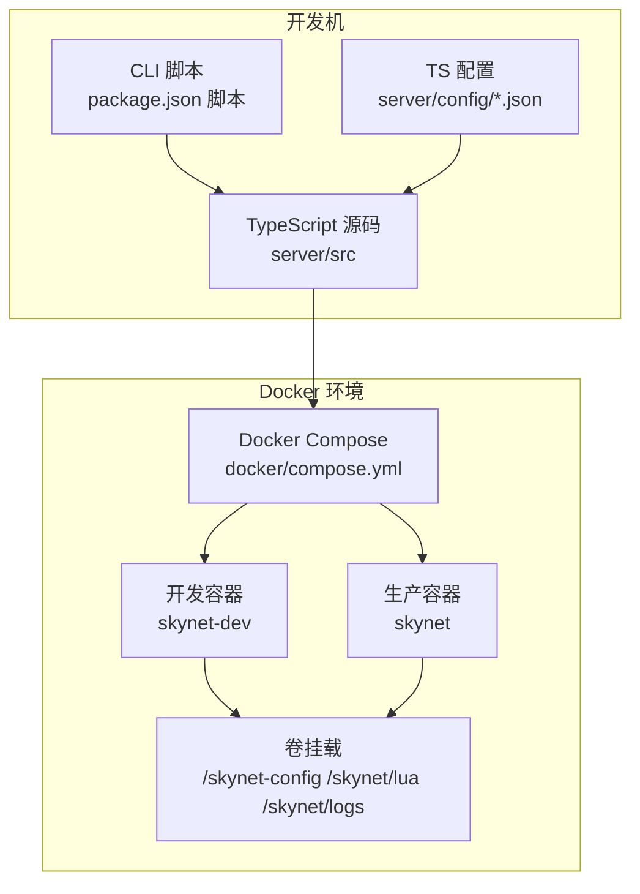
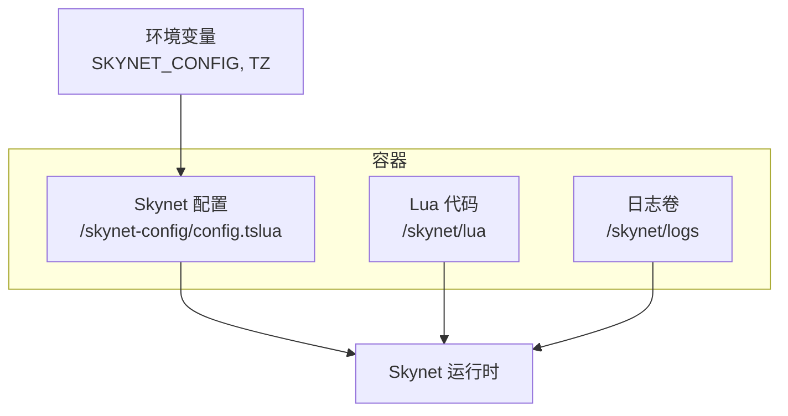
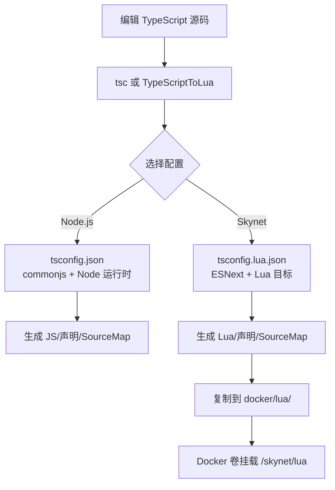
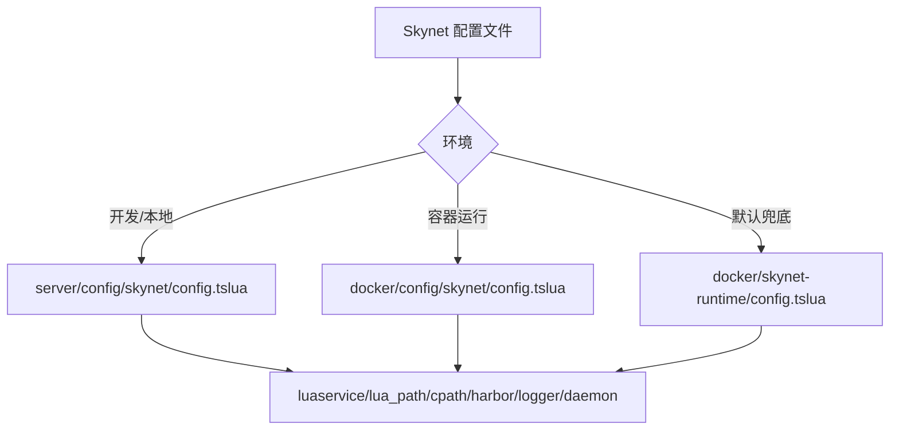
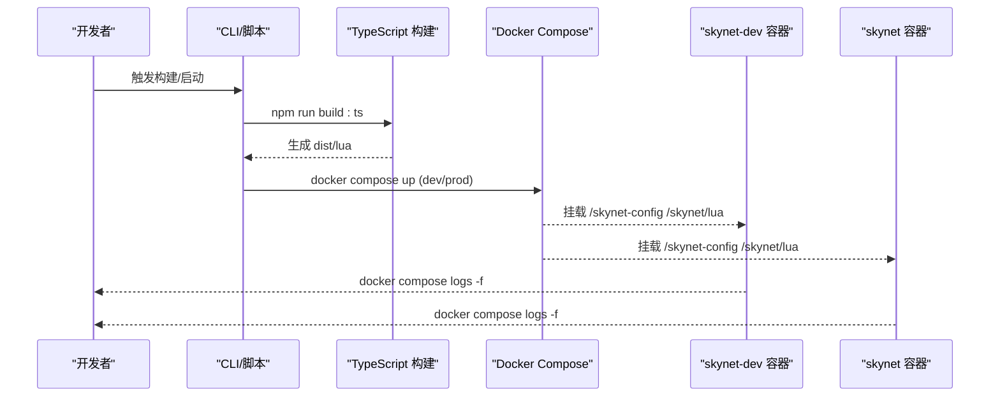
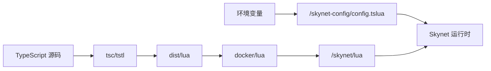

# 环境配置

<cite>
**本文引用的文件**
- [server/config/tsconfig.json](file://server/config/tsconfig.json)
- [server/config/tsconfig.lua.json](file://server/config/tsconfig.lua.json)
- [server/config/tsconfig.incremental.json](file://server/config/tsconfig.incremental.json)
- [server/config/skynet/config.tslua](file://server/config/skynet/config.tslua)
- [docker/config/skynet/config.tslua](file://docker/config/skynet/config.tslua)
- [docker/skynet-runtime/config.tslua](file://docker/skynet-runtime/config.tslua)
- [tslua.config.yaml](file://tslua.config.yaml)
- [package.json](file://package.json)
- [docker/compose.yml](file://docker/compose.yml)
- [docker/scripts/deploy.ps1](file://docker/scripts/deploy.ps1)
- [docker/scripts/deploy.bat](file://docker/scripts/deploy.bat)
- [server/start.sh](file://server/start.sh)
- [start.sh](file://start.sh)
- [server/Dockerfile](file://server/Dockerfile)
</cite>

## 目录
1. [引言](#引言)
2. [项目结构](#项目结构)
3. [核心组件](#核心组件)
4. [架构总览](#架构总览)
5. [详细组件分析](#详细组件分析)
6. [依赖关系分析](#依赖关系分析)
7. [性能考量](#性能考量)
8. [故障排查指南](#故障排查指南)
9. [结论](#结论)
10. [附录](#附录)

## 引言
本指南围绕多环境配置管理展开，系统性说明开发、测试、生产等不同环境的配置差异与设置方法；详解 TypeScript 配置文件的各项选项及其对构建的影响；深入解析 Skynet 配置文件的关键参数（服务注册、网络、日志等）；给出环境变量的使用方式与敏感信息安全管理建议；总结配置文件的版本控制与团队协作最佳实践，并提供配置验证与故障排查方法。

## 项目结构
本项目采用“多工作区 + Docker 多环境”的组织方式：
- server：TypeScript 源码与构建配置
- protocols：协议定义与生成配置
- tables：配置表与生成配置
- docker：Docker 部署与运行时配置
- tool：TypeScriptToLua 工具链（可选）

图表来源
- [package.json:11-36](file://package.json#L11-L36)
- [docker/compose.yml:6-70](file://docker/compose.yml#L6-L70)

章节来源
- [package.json:1-52](file://package.json#L1-L52)
- [docker/compose.yml:1-70](file://docker/compose.yml#L1-L70)

## 核心组件
- TypeScript 构建配置
  - 面向 Node.js 的 tsconfig.json：严格类型、声明文件、SourceMap、路径别名等
  - 面向 Skynet 的 tsconfig.lua.json：ESNext 模块、bundler 解析、TypeScriptToLua 选项、Lua 5.4 目标
  - 增量构建 tsconfig.incremental.json：基于扩展的增量编译与构建信息文件
- Skynet 运行时配置
  - server/config/skynet/config.tslua：开发/本地运行时配置
  - docker/config/skynet/config.tslua：容器运行时配置（与框架分离）
  - docker/skynet-runtime/config.tslua：默认运行时兜底配置（镜像内）
- 项目级配置
  - tslua.config.yaml：项目元信息、目录路径、构建输出、Docker 服务名等
- 部署与脚本
  - docker/scripts/deploy.ps1：Windows Docker 部署与运维脚本
  - docker/scripts/deploy.bat：简化入口
  - server/start.sh / start.sh：跨平台启动与辅助命令

章节来源
- [server/config/tsconfig.json:1-26](file://server/config/tsconfig.json#L1-L26)
- [server/config/tsconfig.lua.json:1-23](file://server/config/tsconfig.lua.json#L1-L23)
- [server/config/tsconfig.incremental.json:1-8](file://server/config/tsconfig.incremental.json#L1-L8)
- [server/config/skynet/config.tslua:1-53](file://server/config/skynet/config.tslua#L1-L53)
- [docker/config/skynet/config.tslua:1-54](file://docker/config/skynet/config.tslua#L1-L54)
- [docker/skynet-runtime/config.tslua:1-35](file://docker/skynet-runtime/config.tslua#L1-L35)
- [tslua.config.yaml:1-52](file://tslua.config.yaml#L1-L52)
- [docker/scripts/deploy.ps1:1-430](file://docker/scripts/deploy.ps1#L1-L430)
- [docker/scripts/deploy.bat:1-58](file://docker/scripts/deploy.bat#L1-L58)
- [server/start.sh:1-66](file://server/start.sh#L1-L66)
- [start.sh:1-7](file://start.sh#L1-L7)

## 架构总览
多环境配置通过“配置文件 + 环境变量 + Docker 卷挂载”实现解耦与隔离：
- 开发环境：Compose 使用 dev profile，挂载配置与 Lua 代码，便于热迭代
- 生产环境：镜像内含默认配置，通过卷挂载覆盖，守护进程关闭，日志输出至 stdout
- 环境变量：通过 SKYNET_CONFIG 指定运行时配置路径，TZ 控制时区

图表来源
- [docker/compose.yml:29-31](file://docker/compose.yml#L29-L31)
- [docker/compose.yml:51-56](file://docker/compose.yml#L51-L56)
- [docker/skynet-runtime/config.tslua:31-35](file://docker/skynet-runtime/config.tslua#L31-L35)

章节来源
- [docker/compose.yml:1-70](file://docker/compose.yml#L1-L70)
- [docker/skynet-runtime/config.tslua:1-35](file://docker/skynet-runtime/config.tslua#L1-L35)

## 详细组件分析

### TypeScript 配置文件详解
- 面向 Node.js 的 tsconfig.json
  - 目标与模块：ES2020 + commonjs，适合 Node.js 运行时
  - 严格模式与检查：严格类型、跳过库检查、大小写一致性
  - 输出与源码：outDir、rootDir、baseUrl + 路径映射 @/*
  - SourceMap 与声明：生成 .map 与 .d.ts，便于调试与发布
  - include/exclude：仅编译 src，排除 node_modules、dist、测试文件
- 面向 Skynet 的 tsconfig.lua.json
  - 目标与模块：ES2020 + ESNext，bundler 解析
  - TypeScriptToLua 选项：luaTarget=5.4、require 导入、traceback、skynet 兼容
  - 输出：dist/lua，便于直接部署到 Skynet
- 增量构建 tsconfig.incremental.json
  - 继承基础 ts 配置，启用增量编译与 .tsbuildinfo，提升二次构建速度

图表来源
- [server/config/tsconfig.json:1-26](file://server/config/tsconfig.json#L1-L26)
- [server/config/tsconfig.lua.json:1-23](file://server/config/tsconfig.lua.json#L1-L23)
- [server/config/tsconfig.incremental.json:1-8](file://server/config/tsconfig.incremental.json#L1-L8)

章节来源
- [server/config/tsconfig.json:1-26](file://server/config/tsconfig.json#L1-L26)
- [server/config/tsconfig.lua.json:1-23](file://server/config/tsconfig.lua.json#L1-L23)
- [server/config/tsconfig.incremental.json:1-8](file://server/config/tsconfig.incremental.json#L1-L8)

### Skynet 配置文件详解
- 关键参数说明
  - thread：线程数，按 CPU 核心数调整
  - bootstrap/start：引导模块与启动脚本（TS 编译后的 Lua 入口）
  - luaservice/lualoader：服务与加载器路径（优先级与容器内路径）
  - lua_path/lua_cpath/cpath：模块与 C 服务路径
  - harbor：单节点模式（0），不启用集群
  - logger/daemon：日志输出到 stdout，Docker 环境关闭守护进程
  - 可选参数：game_port、debug_port、root（工作目录）
- 环境差异
  - 开发/本地：server/config/skynet/config.tslua
  - 容器运行：docker/config/skynet/config.tslua（与框架分离）
  - 默认兜底：docker/skynet-runtime/config.tslua（镜像内）

图表来源
- [server/config/skynet/config.tslua:1-53](file://server/config/skynet/config.tslua#L1-L53)
- [docker/config/skynet/config.tslua:1-54](file://docker/config/skynet/config.tslua#L1-L54)
- [docker/skynet-runtime/config.tslua:1-35](file://docker/skynet-runtime/config.tslua#L1-L35)

章节来源
- [server/config/skynet/config.tslua:1-53](file://server/config/skynet/config.tslua#L1-L53)
- [docker/config/skynet/config.tslua:1-54](file://docker/config/skynet/config.tslua#L1-L54)
- [docker/skynet-runtime/config.tslua:1-35](file://docker/skynet-runtime/config.tslua#L1-L35)

### 环境变量与敏感信息管理
- 环境变量
  - TZ：容器时区（Asia/Shanghai）
  - SKYNET_CONFIG：指向 /skynet-config/config.tslua，实现配置覆盖
- 敏感信息管理建议
  - 将数据库密码、第三方密钥等放入 Docker secrets 或 CI/CD 变量
  - 通过 Compose 的 secrets/vault 注入，避免硬编码在配置文件中
  - 对外暴露的端口与调试端口仅在开发环境开放

章节来源
- [docker/compose.yml:29-31](file://docker/compose.yml#L29-L31)
- [docker/compose.yml:48-50](file://docker/compose.yml#L48-L50)

### 配置验证与部署流程
- 验证步骤
  - 构建 TypeScript 并生成 Lua：npm run build:ts
  - 检查 docker/lua 是否存在编译产物
  - 启动开发容器（dev profile）或生产容器
  - 通过 docker compose logs -f 观察日志
- 部署脚本
  - Windows：deploy.ps1（PowerShell）与 deploy.bat（简化入口）
  - Linux/macOS：npm run docker:* 或直接调用 docker/cli/index.js
  - 跨平台 CLI：start.sh（根目录）与 server/start.sh（服务侧）

图表来源
- [package.json:11-36](file://package.json#L11-L36)
- [docker/scripts/deploy.ps1:332-366](file://docker/scripts/deploy.ps1#L332-L366)
- [docker/compose.yml:6-70](file://docker/compose.yml#L6-L70)

章节来源
- [package.json:1-52](file://package.json#L1-L52)
- [docker/scripts/deploy.ps1:1-430](file://docker/scripts/deploy.ps1#L1-L430)
- [docker/scripts/deploy.bat:1-58](file://docker/scripts/deploy.bat#L1-L58)
- [docker/compose.yml:1-70](file://docker/compose.yml#L1-L70)

### 版本控制与团队协作最佳实践
- 配置分层
  - 默认配置：docker/skynet-runtime/config.tslua（镜像内）
  - 环境覆盖：docker/config/skynet/config.tslua（卷挂载）
  - 本地覆盖：server/config/skynet/config.tslua（开发机）
- 分支策略
  - 将环境无关的默认配置纳入主分支
  - 环境特定配置（如端口、调试端口）放入受控分支或密钥管理
- 团队协作
  - 使用 .dockerignore 与 .gitignore 避免误提交敏感文件
  - 在 CI/CD 中使用环境变量注入，避免硬编码
  - 文档化每个配置项的作用与取值范围

章节来源
- [docker/skynet-runtime/config.tslua:1-35](file://docker/skynet-runtime/config.tslua#L1-L35)
- [docker/config/skynet/config.tslua:1-54](file://docker/config/skynet/config.tslua#L1-L54)
- [server/config/skynet/config.tslua:1-53](file://server/config/skynet/config.tslua#L1-L53)

## 依赖关系分析
- 构建链路
  - TypeScript 源码 → tsc/TypeScriptToLua → dist/lua → docker/lua → 容器卷挂载
- 运行链路
  - 环境变量（SKYNET_CONFIG/TZ） → 挂载配置 → Skynet 运行时 → Lua 服务
- 脚本链路
  - package.json 脚本 → CLI/部署脚本 → Docker Compose

图表来源
- [server/config/tsconfig.lua.json:10-11](file://server/config/tsconfig.lua.json#L10-L11)
- [docker/compose.yml:20-28](file://docker/compose.yml#L20-L28)
- [docker/compose.yml:51-56](file://docker/compose.yml#L51-L56)

章节来源
- [server/config/tsconfig.lua.json:1-23](file://server/config/tsconfig.lua.json#L1-L23)
- [docker/compose.yml:1-70](file://docker/compose.yml#L1-L70)

## 性能考量
- 构建性能
  - 启用增量编译（tsconfig.incremental.json）减少二次构建时间
  - 使用 bundler 模块解析（tsconfig.lua.json）优化模块打包
- 运行性能
  - 线程数（thread）与 CPU 核心匹配，避免过度并发
  - Harbor 关闭（单节点）降低集群通信开销
  - Lua 5.4 目标与 require 导入策略提升运行时效率

章节来源
- [server/config/tsconfig.incremental.json:1-8](file://server/config/tsconfig.incremental.json#L1-L8)
- [server/config/tsconfig.lua.json:12-19](file://server/config/tsconfig.lua.json#L12-L19)
- [server/config/skynet/config.tslua:6-7](file://server/config/skynet/config.tslua#L6-L7)
- [docker/skynet-runtime/config.tslua:28-29](file://docker/skynet-runtime/config.tslua#L28-L29)

## 故障排查指南
- 常见问题与定位
  - 未找到 Lua 代码：确认已执行构建并复制到 docker/lua
  - 容器未启动：检查 Docker Desktop/WASM 后端、端口占用
  - 配置未生效：确认 SKYNET_CONFIG 指向正确路径，卷挂载权限
  - 日志为空：Docker 环境下日志输出到 stdout，使用 docker compose logs -f
- 排障步骤
  - 状态查看：docker compose ps / status
  - 日志查看：docker compose logs -f skynet
  - Shell 进入：docker exec -it 容器 /bin/bash
  - 清理重建：docker compose down --rmi all --volumes

章节来源
- [docker/scripts/deploy.ps1:299-327](file://docker/scripts/deploy.ps1#L299-L327)
- [docker/scripts/deploy.ps1:371-386](file://docker/scripts/deploy.ps1#L371-L386)
- [docker/scripts/deploy.ps1:391-402](file://docker/scripts/deploy.ps1#L391-L402)
- [docker/compose.yml:64-70](file://docker/compose.yml#L64-L70)

## 结论
本项目通过“分层配置 + 环境变量 + Docker 卷挂载”的方式实现了开发、测试、生产的灵活切换与安全隔离。配合 TypeScriptToLua 的专用配置与增量构建，既保证了开发效率也兼顾了运行时性能。建议团队在实际落地中严格遵循敏感信息管理与版本控制规范，并结合 CI/CD 实现自动化验证与部署。

## 附录
- 跨平台启动入口
  - Windows：start.bat → deploy.ps1
  - Linux/macOS：start.sh → npm run cli
- 开发机 Dockerfile（示例）
  - 提供 Node、Python、SSH 等工具链，便于本地调试与运维

章节来源
- [start.sh:1-7](file://start.sh#L1-L7)
- [server/Dockerfile:1-51](file://server/Dockerfile#L1-L51)