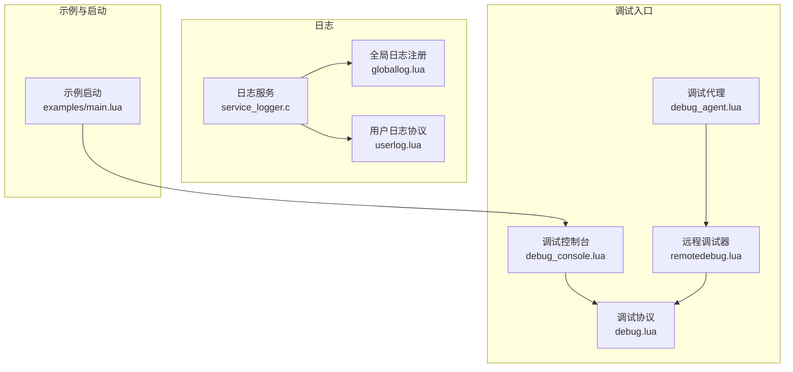
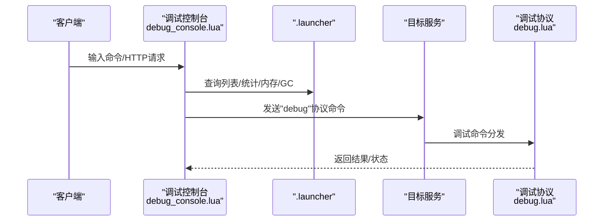
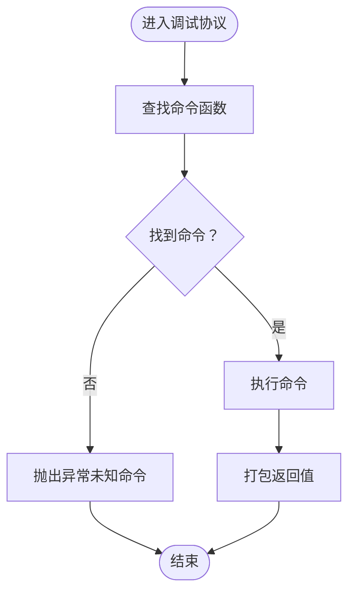
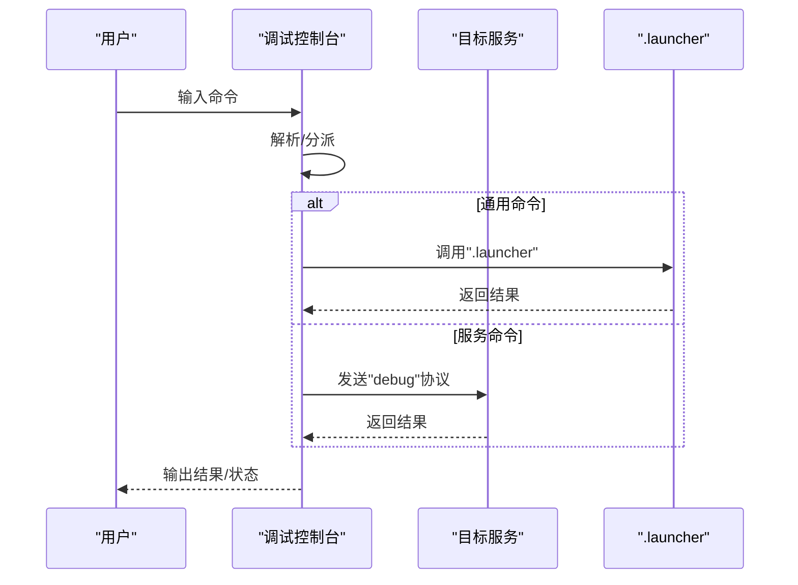
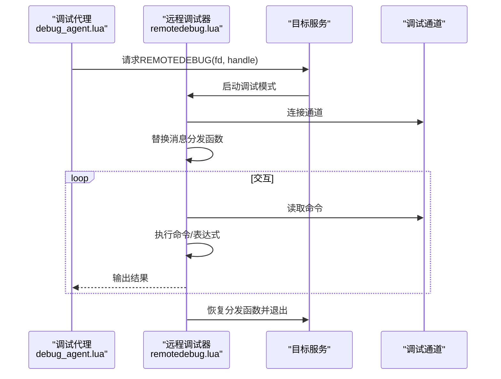
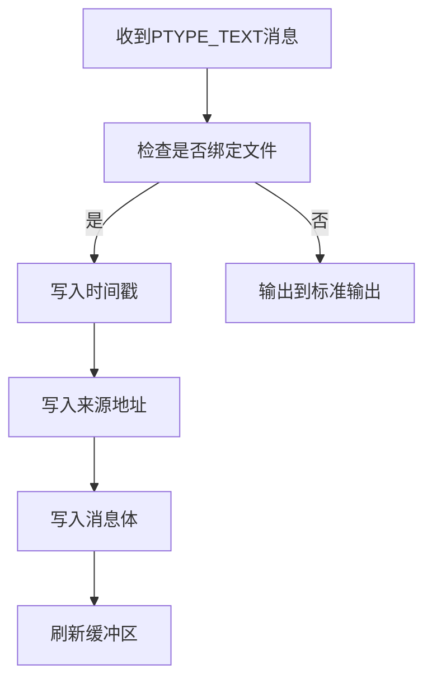
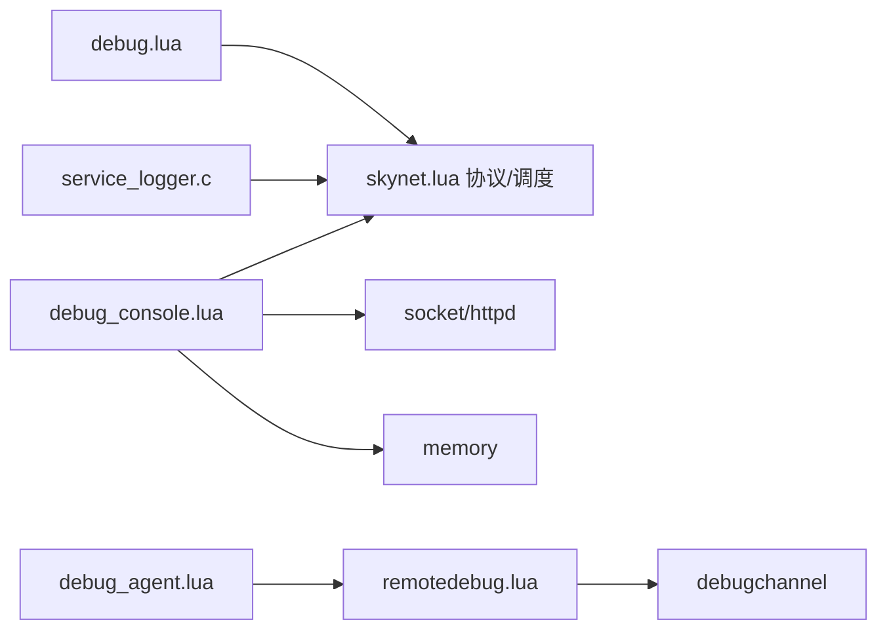

# Skynet调试

<cite>
**本文引用的文件**
- [docker\skynet\lualib\skynet\debug.lua](file://docker\skynet\lualib\skynet\debug.lua)
- [docker\skynet\service\dbg.lua](file://docker\skynet\service\dbg.lua)
- [docker\skynet\service\debug_console.lua](file://docker\skynet\service\debug_console.lua)
- [docker\skynet\service\debug_agent.lua](file://docker\skynet\service\debug_agent.lua)
- [docker\skynet\lualib\skynet\remotedebug.lua](file://docker\skynet\lualib\skynet\remotedebug.lua)
- [docker\skynet\service-src\service_logger.c](file://docker\skynet\service-src\service_logger.c)
- [docker\skynet\examples\main.lua](file://docker\skynet\examples\main.lua)
- [docker\skynet\examples\globallog.lua](file://docker\skynet\examples\globallog.lua)
- [docker\skynet\examples\userlog.lua](file://docker\skynet\examples\userlog.lua)
- [docker\skynet\lualib\skynet.lua](file://docker\skynet\lualib\skynet.lua)
</cite>

## 目录
1. [简介](#简介)
2. [项目结构](#项目结构)
3. [核心组件](#核心组件)
4. [架构总览](#架构总览)
5. [详细组件分析](#详细组件分析)
6. [依赖关系分析](#依赖关系分析)
7. [性能考量](#性能考量)
8. [故障排查指南](#故障排查指南)
9. [结论](#结论)
10. [附录](#附录)

## 简介
本指南聚焦于Skynet运行时的调试与可观测性，覆盖以下主题：
- 日志系统使用与配置
- 服务生命周期管理与状态监控
- 错误追踪与堆栈分析
- 性能分析（内存、CPU）
- 服务间通信与消息传递问题定位
- 分布式调试技巧
- 常见问题诊断与解决步骤
- 内置调试工具与API的使用

目标是帮助开发者在Skynet环境下快速定位问题、优化性能，并建立可重复的调试流程。

## 项目结构
Skynet调试能力由“调试协议”“调试控制台”“远程调试代理”“日志服务”等模块协同实现。典型启动流程中，调试控制台服务常作为示例被启用，便于连接与执行调试命令；日志服务负责输出系统级文本日志；调试协议为每个服务提供统一的调试入口。

图示来源
- [docker\skynet\lualib\skynet\debug.lua:1-150](file://docker\skynet\lualib\skynet\debug.lua#L1-L150)
- [docker\skynet\service\debug_console.lua:1-490](file://docker\skynet\service\debug_console.lua#L1-L490)
- [docker\skynet\service\debug_agent.lua:1-37](file://docker\skynet\service\debug_agent.lua#L1-L37)
- [docker\skynet\lualib\skynet\remotedebug.lua:1-271](file://docker\skynet\lualib\skynet\remotedebug.lua#L1-L271)
- [docker\skynet\service-src\service_logger.c:1-93](file://docker\skynet\service-src\service_logger.c#L1-L93)
- [docker\skynet\examples\main.lua:1-23](file://docker\skynet\examples\main.lua#L1-L23)
- [docker\skynet\examples\globallog.lua:1-11](file://docker\skynet\examples\globallog.lua#L1-L11)
- [docker\skynet\examples\userlog.lua:1-25](file://docker\skynet\examples\userlog.lua#L1-L25)

章节来源
- [docker\skynet\examples\main.lua:1-23](file://docker\skynet\examples\main.lua#L1-L23)

## 核心组件
- 调试协议：为每个服务暴露统一的调试命令集，如内存统计、任务查询、唯一任务、信息回调、退出、注入脚本、远程调试、协议跟踪开关等。
- 调试控制台：提供交互式命令行与HTTP接口，支持列出服务、统计、内存、GC、启动/停止服务、注入脚本、线程任务管理、网络统计、Jemalloc堆分析、环境变量读写等。
- 远程调试器：通过调试通道接管服务的消息分发，提供断点、单步、下一步、继续执行等调试能力，并可按协议条件触发断点。
- 日志服务：以C实现的日志服务，支持将系统文本消息写入文件或标准输出，带时间戳与来源地址标记。
- 示例启动：示例程序演示如何启动调试控制台与监听端口，便于本地联调。

章节来源
- [docker\skynet\lualib\skynet\debug.lua:1-150](file://docker\skynet\lualib\skynet\debug.lua#L1-L150)
- [docker\skynet\service\debug_console.lua:1-490](file://docker\skynet\service\debug_console.lua#L1-L490)
- [docker\skynet\lualib\skynet\remotedebug.lua:1-271](file://docker\skynet\lualib\skynet\remotedebug.lua#L1-L271)
- [docker\skynet\service-src\service_logger.c:1-93](file://docker\skynet\service-src\service_logger.c#L1-L93)
- [docker\skynet\examples\main.lua:1-23](file://docker\skynet\examples\main.lua#L1-L23)

## 架构总览
下图展示调试链路：客户端通过调试控制台发起命令，控制台调用“.launcher”或直接向目标服务发送“debug”协议消息；目标服务根据命令分发到调试协议处理函数；远程调试模式下，调试代理与远程调试器协作接管消息分发，实现交互式调试。

图示来源
- [docker\skynet\service\debug_console.lua:126-141](file://docker\skynet\service\debug_console.lua#L126-L141)
- [docker\skynet\lualib\skynet\debug.lua:126-140](file://docker\skynet\lualib\skynet\debug.lua#L126-L140)

## 详细组件分析

### 组件A：调试协议（debug.lua）
- 功能要点
  - 注册“debug”协议，接收调试命令。
  - 提供常用命令：MEM（Lua内存）、GC（强制GC并记录耗时）、STAT（任务/消息/CPU统计）、TASK/UNIQTASK（任务详情）、INFO（外部信息回调）、EXIT（优雅退出）、RUN（注入脚本）、TERM（终止服务）、REMOTEDEBUG（远程调试）、SUPPORT（协议支持检测）、PING/LINK（连通性测试）、TRACELOG（协议日志开关）。
  - 支持外部扩展命令注册。
- 关键数据与复杂度
  - 命令表按需懒加载，O(1)查找。
  - GC命令涉及一次完整GC周期，注意对实时性的影响。
- 错误处理
  - 未识别命令会抛出异常；外部回调缺失时返回空值。
- 性能影响
  - MEM/STAT/TRACELOG等命令开销较低；RUN/REMOTEDEBUG可能引入额外开销。

图示来源
- [docker\skynet\lualib\skynet\debug.lua:126-140](file://docker\skynet\lualib\skynet\debug.lua#L126-L140)

章节来源
- [docker\skynet\lualib\skynet\debug.lua:1-150](file://docker\skynet\lualib\skynet\debug.lua#L1-L150)

### 组件B：调试控制台（debug_console.lua）
- 功能要点
  - TCP监听，支持命令行与HTTP GET/POST两种输入方式。
  - 命令分类：通用（help/list/stat/mem/gc/clearcache/service）、服务管理（start/snax/log/kill/exit）、任务（task/uniqtask/killtask）、注入（inject/dbgcmd）、日志（logon/logoff/trace）、内存（cmem/jmem/dumpheap/profactive）、网络（netstat）、环境（getenv/setenv）。
  - 地址解析支持本地名与十六进制地址，自动补齐harbor位。
- 处理逻辑
  - 解析命令行，分派至COMMAND或COMMANDX；COMMANDX通常用于需要fd参数的场景。
  - 对部分命令封装为对“.launcher”的调用，或直接向目标服务发送“debug”协议。
- 错误处理
  - 使用pcall包装命令执行，捕获错误并输出提示。
  - HTTP请求解析失败时给出友好提示。

图示来源
- [docker\skynet\service\debug_console.lua:59-90](file://docker\skynet\service\debug_console.lua#L59-L90)
- [docker\skynet\service\debug_console.lua:234-300](file://docker\skynet\service\debug_console.lua#L234-L300)

章节来源
- [docker\skynet\service\debug_console.lua:1-490](file://docker\skynet\service\debug_console.lua#L1-L490)

### 组件C：远程调试器（remotedebug.lua）
- 功能要点
  - 通过调试通道接管目标服务的消息分发函数，替换为钩子版本。
  - 提供命令：s（step）、n（next）、c（continue），以及watch（按协议条件触发断点）。
  - 将print重定向到socket fd，实现交互式调试。
- 工作原理
  - 替换消息分发函数的内部upvalue，插入hook；根据协程上下文动态生成提示符。
  - 通过debugchannel读取命令，执行表达式或语句，支持在目标服务上下文中求值。
- 注意事项
  - 进入/退出调试模式时会替换/恢复分发函数，避免并发冲突。
  - 断点仅作用于当前协程，调试结束后清理hook。

图示来源
- [docker\skynet\service\debug_agent.lua:8-21](file://docker\skynet\service\debug_agent.lua#L8-L21)
- [docker\skynet\lualib\skynet\remotedebug.lua:260-268](file://docker\skynet\lualib\skynet\remotedebug.lua#L260-L268)
- [docker\skynet\lualib\skynet\remotedebug.lua:189-258](file://docker\skynet\lualib\skynet\remotedebug.lua#L189-L258)

章节来源
- [docker\skynet\service\debug_agent.lua:1-37](file://docker\skynet\service\debug_agent.lua#L1-L37)
- [docker\skynet\lualib\skynet\remotedebug.lua:1-271](file://docker\skynet\lualib\skynet\remotedebug.lua#L1-L271)

### 组件D：日志系统（service_logger.c 与示例）
- 日志服务
  - 以C实现，回调处理系统文本消息，支持文件落盘与刷新。
  - 时间戳基于skynet_now与启动时间计算，输出格式包含来源地址。
- 示例日志
  - globallog.lua：注册全局日志服务名称，打印所有发往该名称的消息。
  - userlog.lua：自定义“text”“SYSTEM”协议处理，打印带时间戳的消息与信号事件。
- 使用建议
  - 在开发阶段开启全局日志，结合调试控制台的logon/logoff切换目标服务日志。
  - 生产环境建议落盘并配合轮转策略。

图示来源
- [docker\skynet\service-src\service_logger.c:48-67](file://docker\skynet\service-src\service_logger.c#L48-L67)

章节来源
- [docker\skynet\service-src\service_logger.c:1-93](file://docker\skynet\service-src\service_logger.c#L1-L93)
- [docker\skynet\examples\globallog.lua:1-11](file://docker\skynet\examples\globallog.lua#L1-L11)
- [docker\skynet\examples\userlog.lua:1-25](file://docker\skynet\examples\userlog.lua#L1-L25)

### 组件E：服务生命周期与状态监控
- 生命周期
  - 服务启动：通过“.launcher”或直接newservice创建。
  - 服务退出：可通过调试协议的EXIT或控制台的exit/kill命令。
  - 服务终止：TERM命令可终止指定服务。
- 状态监控
  - 控制台stat/mem/gc命令可查询整体状态与内存情况。
  - TASK/UNIQTASK可查看服务内部任务与唯一任务详情。
  - TRACELOG可开启特定协议的跟踪日志。
- 可观测性
  - netstat查看网络层统计。
  - getenv/setenv读写运行时环境变量。

章节来源
- [docker\skynet\service\debug_console.lua:250-300](file://docker\skynet\service\debug_console.lua#L250-L300)
- [docker\skynet\lualib\skynet\debug.lua:38-78](file://docker\skynet\lualib\skynet\debug.lua#L38-L78)

## 依赖关系分析
- 调试协议依赖Skynet核心协议注册与消息分发机制。
- 调试控制台依赖socket、httpd、snax、memory等模块，以及“.launcher”提供的服务管理能力。
- 远程调试器依赖调试通道与Skynet调度器的挂起/恢复接口。
- 日志服务依赖C层回调与文件IO。

图示来源
- [docker\skynet\lualib\skynet.lua:1-200](file://docker\skynet\lualib\skynet.lua#L1-L200)
- [docker\skynet\service\debug_console.lua:1-20](file://docker\skynet\service\debug_console.lua#L1-L20)
- [docker\skynet\service\debug_agent.lua:1-6](file://docker\skynet\service\debug_agent.lua#L1-L6)
- [docker\skynet\lualib\skynet\remotedebug.lua:1-10](file://docker\skynet\lualib\skynet\remotedebug.lua#L1-L10)
- [docker\skynet\service-src\service_logger.c:1-10](file://docker\skynet\service-src\service_logger.c#L1-L10)

## 性能考量
- 内存分析
  - 使用MEM/STAT命令观察Lua内存与队列长度；GC命令可强制回收并记录耗时。
  - jmem/cmem查看C层与jemalloc内存统计；dumpheap/profactive进行堆分析。
- CPU性能
  - STAT命令返回CPU与消息计数，辅助定位热点服务。
  - netstat查看网络读写延迟与缓冲区大小。
- 注入与远程调试
  - RUN/REMOTEDEBUG可能引入额外开销，建议仅在问题定位阶段使用。
- 日志开销
  - 全局日志与高频trace会增加I/O与CPU消耗，生产环境应谨慎开启。

章节来源
- [docker\skynet\lualib\skynet\debug.lua:16-45](file://docker\skynet\lualib\skynet\debug.lua#L16-L45)
- [docker\skynet\service\debug_console.lua:363-489](file://docker\skynet\service\debug_console.lua#L363-L489)

## 故障排查指南
- 无法连接调试控制台
  - 检查IP/端口配置与防火墙；确认示例已启动调试控制台。
  - 参考示例启动流程，确保调试控制台服务已创建。
- 服务无响应
  - 使用PING命令测量往返时间；使用TASK/UNIQTASK查看阻塞任务。
  - 若怀疑死循环，尝试REMOTEDEBUG进入交互式调试。
- 内存泄漏/增长过快
  - 观察MEM/STAT趋势；执行GC命令后再次检查。
  - 使用jmem/cmem与dumpheap定位异常增长。
- 协议消息异常
  - 使用TRACELOG开启特定协议跟踪；结合netstat查看网络层状况。
  - 使用dbgcmd/info获取服务内部状态。
- 日志缺失
  - 使用logon/logoff切换目标服务日志；确认日志服务已注册。
  - 检查日志文件路径与权限。

章节来源
- [docker\skynet\examples\main.lua:12-21](file://docker\skynet\examples\main.lua#L12-L21)
- [docker\skynet\service\debug_console.lua:344-361](file://docker\skynet\service\debug_console.lua#L344-L361)
- [docker\skynet\examples\globallog.lua:1-11](file://docker\skynet\examples\globallog.lua#L1-L11)

## 结论
Skynet提供了完善的运行时调试与可观测性能力：统一的调试协议、交互式调试控制台、远程调试器、日志服务与丰富的性能分析工具。通过合理组合这些工具，可以高效定位服务生命周期问题、消息传递异常、内存与CPU瓶颈，并在分布式场景下实施有针对性的调试策略。

## 附录
- 快速命令清单（来自调试控制台）
  - 通用：help、list、stat、mem、gc、clearcache、service
  - 服务：start、snax、log、kill、exit、term
  - 任务：task、uniqtask、killtask
  - 注入：inject、dbgcmd
  - 日志：logon、logoff、trace
  - 内存：cmem、jmem、dumpheap、profactive
  - 环境：getenv、setenv
- 示例启动
  - 示例程序展示了如何启动调试控制台与监听端口，便于本地联调。

章节来源
- [docker\skynet\service\debug_console.lua:143-178](file://docker\skynet\service\debug_console.lua#L143-L178)
- [docker\skynet\examples\main.lua:1-23](file://docker\skynet\examples\main.lua#L1-L23)