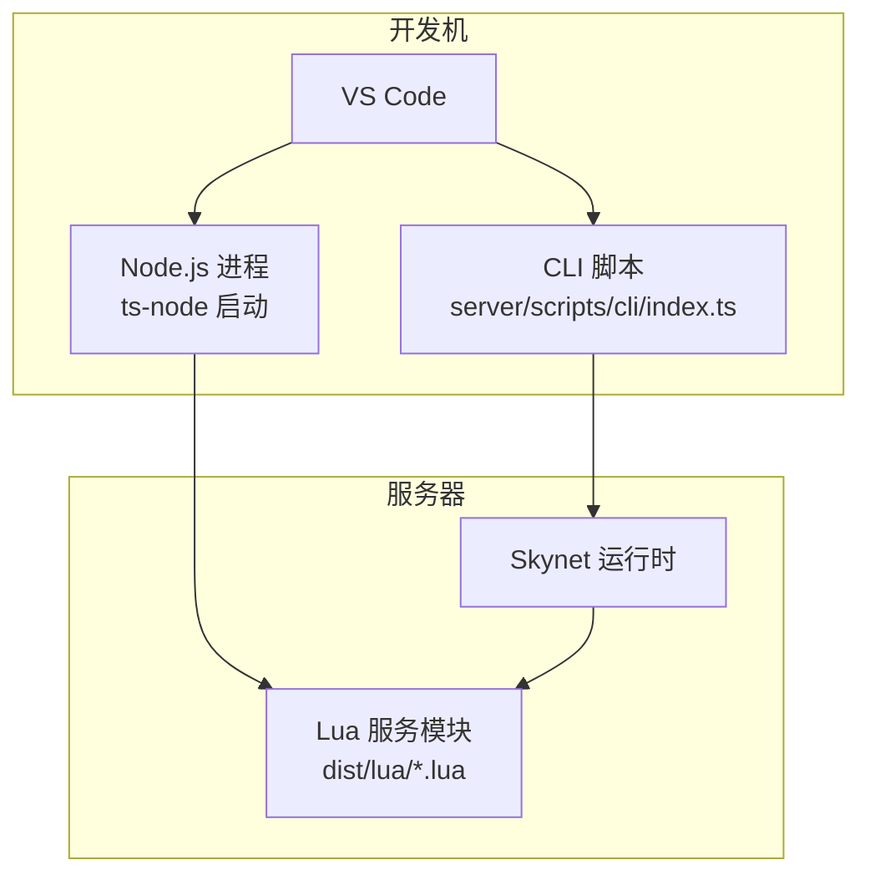
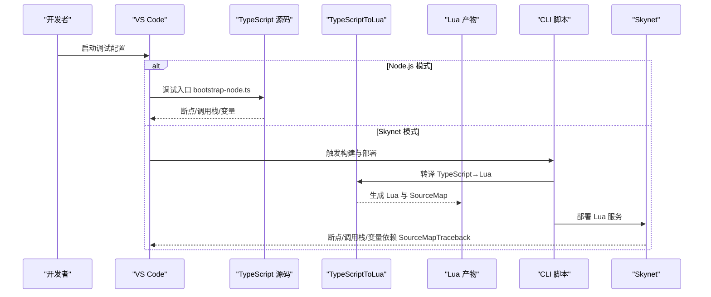
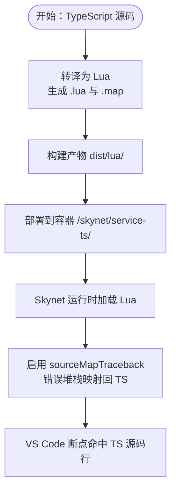
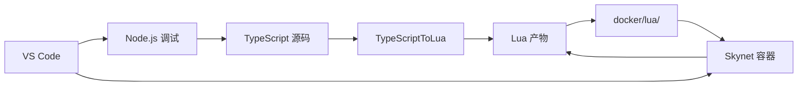

# VS Code调试

<cite>
**本文引用的文件**
- [package.json](file://package.json)
- [server/package.json](file://server/package.json)
- [server/config/tsconfig.json](file://server/config/tsconfig.json)
- [server/config/tsconfig.lua.json](file://server/config/tsconfig.lua.json)
- [server/src/app/bootstrap-node.ts](file://server/src/app/bootstrap-node.ts)
- [server/src/app/bootstrap-skynet.ts](file://server/src/app/bootstrap-skynet.ts)
- [server/src/app/main.ts](file://server/src/app/main.ts)
- [server/scripts/cli/index.ts](file://server/scripts/cli/index.ts)
- [docker/cli/package.json](file://docker/cli/package.json)
- [tool/TypeScriptToLua_skynet/.devcontainer/devcontainer.json](file://tool/TypeScriptToLua_skynet/.devcontainer/devcontainer.json)
</cite>

## 目录
1. [简介](#简介)
2. [项目结构](#项目结构)
3. [核心组件](#核心组件)
4. [架构总览](#架构总览)
5. [详细组件分析](#详细组件分析)
6. [依赖分析](#依赖分析)
7. [性能考虑](#性能考虑)
8. [故障排除指南](#故障排除指南)
9. [结论](#结论)
10. [附录](#附录)

## 简介
本指南面向使用 VS Code 调试基于 TypeScriptToLua 的混合型游戏服务器（TypeScript → Skynet Lua）的开发者，系统讲解以下内容：
- launch.json 的调试配置要点与示例思路（Node.js 与 Skynet/Lua 调试）
- 断点、监视变量、调用栈查看方法
- SourceMap 的作用与配置，帮助理解 TypeScript 源码与生成 Lua 代码的映射关系
- 调试 TypeScriptToLua 转译后的 Lua 代码（含 Skynet 适配）
- 条件断点、异常断点、日志断点等高级技巧
- 异步代码与 Promise 的调试策略
- 常见调试场景的操作步骤与解决方案

## 项目结构
该仓库采用多工作区组织，核心与调试相关的目录与文件如下：
- server：TypeScript 源码、构建配置与启动入口
- docker：Skynet 运行时与容器化部署
- tool/TypeScriptToLua_skynet：TypeScriptToLua 工具链与语言扩展
- protocols/tables：协议与配置表构建（与调试关联较小）

图表来源
- [server/scripts/cli/index.ts:547-571](file://server/scripts/cli/index.ts#L547-L571)
- [server/src/app/bootstrap-node.ts:1-22](file://server/src/app/bootstrap-node.ts#L1-L22)
- [server/src/app/bootstrap-skynet.ts:1-20](file://server/src/app/bootstrap-skynet.ts#L1-L20)

章节来源
- [package.json:11-36](file://package.json#L11-L36)
- [server/package.json:6-25](file://server/package.json#L6-L25)

## 核心组件
- TypeScript 编译配置（Node 与 Lua 双目标）
  - Node 目标：tsconfig.json，启用 declarationMap、sourceMap，便于 Node.js 环境调试
  - Lua 目标：tsconfig.lua.json，启用 sourceMapTraceback，便于 Skynet/Lua 环境调试
- 启动入口
  - Node 模式：bootstrap-node.ts，用于本地快速验证服务逻辑
  - Skynet 模式：bootstrap-skynet.ts，用于容器内运行
  - 主引导：main.ts，负责服务注册与生命周期管理
- CLI 工具：server/scripts/cli/index.ts，统一管理构建、启动、日志、热更新等流程

章节来源
- [server/config/tsconfig.json:12-14](file://server/config/tsconfig.json#L12-L14)
- [server/config/tsconfig.lua.json:12-19](file://server/config/tsconfig.lua.json#L12-L19)
- [server/src/app/bootstrap-node.ts:1-22](file://server/src/app/bootstrap-node.ts#L1-L22)
- [server/src/app/bootstrap-skynet.ts:1-20](file://server/src/app/bootstrap-skynet.ts#L1-L20)
- [server/src/app/main.ts:31-87](file://server/src/app/main.ts#L31-L87)
- [server/scripts/cli/index.ts:547-571](file://server/scripts/cli/index.ts#L547-L571)

## 架构总览
下图展示从 VS Code 发起到 Skynet 运行时的调试路径，涵盖 Node.js 与 Skynet 两种调试模式。

图表来源
- [server/src/app/bootstrap-node.ts:1-22](file://server/src/app/bootstrap-node.ts#L1-L22)
- [server/src/app/bootstrap-skynet.ts:1-20](file://server/src/app/bootstrap-skynet.ts#L1-L20)
- [server/scripts/cli/index.ts:547-571](file://server/scripts/cli/index.ts#L547-L571)
- [server/config/tsconfig.lua.json:12-19](file://server/config/tsconfig.lua.json#L12-L19)

## 详细组件分析

### Node.js 调试配置（launch.json）
适用场景：在本地 Node.js 环境调试 TypeScript 代码，无需 Skynet。

- 关键要点
  - 使用 ts-node 作为入口，直接运行 bootstrap-node.ts
  - 启用 sourceMap 与 declarationMap，确保断点命中与类型信息可用
  - 配置程序参数与工作目录，指向 server 目录
  - 可选：添加环境变量（如 TSTL 相关），便于本地联调

- 推荐配置思路（文本描述）
  - type: "node"
  - request: "launch"
  - name: "Node.js 调试"
  - program: "${workspaceFolder}/server/src/app/bootstrap-node.ts"
  - runtimeArgs: []
  - env: {}
  - console: "integratedTerminal"
  - internalConsoleOptions: "neverOpen"
  - cwd: "${workspaceFolder}/server"

- 断点与变量
  - 在 bootstrap-node.ts 与各服务文件中设置断点
  - 使用监视面板观察 runtime、service、logger 等对象
  - 利用调用栈定位异步链路

- 异步与 Promise 调试
  - 在异步函数入口设置断点，观察 pending 状态
  - 使用“遇到未处理拒绝”异常断点捕获 Promise 错误
  - 对于循环定时任务，使用条件断点限制次数

章节来源
- [server/package.json:9](file://server/package.json#L9)
- [server/config/tsconfig.json:12-14](file://server/config/tsconfig.json#L12-L14)
- [server/src/app/bootstrap-node.ts:1-22](file://server/src/app/bootstrap-node.ts#L1-L22)

### Skynet/Lua 调试配置（launch.json）
适用场景：在容器内运行 Skynet，调试转译后的 Lua 代码。

- 关键要点
  - 使用 TypeScriptToLua 的 Lua 目标配置（tsconfig.lua.json）
  - 启用 sourceMapTraceback，使 Lua 报错堆栈可映射回 TypeScript 源码
  - 通过 CLI 将 Lua 产物复制到 docker/lua 并部署到容器
  - 在 VS Code 中附加到 Skynet 进程（若支持），或利用日志与断点定位

- 推荐配置思路（文本描述）
  - type: "node"
  - request: "launch"
  - name: "Skynet 调试"
  - program: "${workspaceFolder}/server/scripts/cli/index.ts"
  - args: ["build:ts"]
  - console: "integratedTerminal"
  - internalConsoleOptions: "neverOpen"
  - cwd: "${workspaceFolder}/server"
  - env: { "TSTL_SOURCEMAP_TRACEBACK": "true" }

- 部署与热更新
  - 构建完成后，CLI 会复制 dist/lua 至 docker/lua
  - 使用 CLI 的热更新命令将新代码部署至容器服务目录

章节来源
- [server/config/tsconfig.lua.json:12-19](file://server/config/tsconfig.lua.json#L12-L19)
- [server/scripts/cli/index.ts:547-571](file://server/scripts/cli/index.ts#L547-L571)
- [server/scripts/cli/index.ts:694-707](file://server/scripts/cli/index.ts#L694-L707)

### TypeScriptToLua 转译与 SourceMap
- 作用
  - 将 TypeScript 源码转译为 Lua，并生成 SourceMap
  - 结合 sourceMapTraceback，使 Lua 运行时的错误堆栈可映射回 TypeScript 源码位置
- 关键配置
  - luaTarget、luaLibImport、sourceMapTraceback、skynetCompat 等
- 调试价值
  - 定位异常时，可直接跳转到原始 TypeScript 行号
  - 协助理解类继承、装饰器、泛型等特性在 Lua 中的映射形态

图表来源
- [server/config/tsconfig.lua.json:12-19](file://server/config/tsconfig.lua.json#L12-L19)
- [server/scripts/cli/index.ts:547-571](file://server/scripts/cli/index.ts#L547-L571)

章节来源
- [server/config/tsconfig.lua.json:12-19](file://server/config/tsconfig.lua.json#L12-L19)

### 断点、监视与调用栈
- 断点类型
  - 普通断点：在关键业务逻辑处设置
  - 条件断点：仅在满足条件时中断（如变量值、计数器）
  - 异常断点：捕获未处理异常（Node.js 与 Skynet）
  - 日志断点：记录信息但不中断（减少对执行流影响）
- 监视变量
  - 观察 runtime、service、timer、logger 等对象
  - 对数组/对象使用表达式监视，如数组长度、字段值
- 调用栈
  - 在异步回调中，利用调用栈定位上游调用链
  - 在 Skynet 模式下，结合 SourceMapTraceback 更准确地定位

章节来源
- [server/src/app/main.ts:31-87](file://server/src/app/main.ts#L31-L87)

### 异步与 Promise 调试
- 在 Node.js 模式
  - 使用 ts-node 启动，断点可直接命中异步函数
  - 设置“遇到未处理拒绝”异常断点，捕获 Promise 错误
- 在 Skynet 模式
  - 由于 Lua 协程模型差异，需关注 service.newService、timer.sleep 等 API 的异步语义
  - 使用条件断点限制循环次数，避免无限等待
  - 通过日志与断点配合，逐步缩小问题范围

章节来源
- [server/src/app/main.ts:82-105](file://server/src/app/main.ts#L82-L105)

### 常见调试场景与步骤
- 场景一：本地验证服务逻辑
  - 步骤：在 VS Code 中选择 Node.js 调试配置，启动 bootstrap-node.ts
  - 效果：断点命中，可直接观察服务初始化过程
- 场景二：验证转译后 Lua 行为
  - 步骤：在 VS Code 中选择 Skynet 调试配置，触发 build:ts；CLI 自动复制并部署
  - 效果：断点命中 Lua 产物，SourceMapTraceback 将堆栈映射回 TS 源码
- 场景三：排查服务启动失败
  - 步骤：在 main.ts 的 startAllServices 与 bootstrap 函数中设置断点；查看日志
  - 效果：定位服务地址分配、启动顺序与错误抛出点
- 场景四：热更新与快速迭代
  - 步骤：修改 TS 源码 → 触发 build:ts → CLI 热更新 → 观察容器日志
  - 效果：无需重启容器即可验证改动

章节来源
- [server/scripts/cli/index.ts:547-571](file://server/scripts/cli/index.ts#L547-L571)
- [server/scripts/cli/index.ts:694-707](file://server/scripts/cli/index.ts#L694-L707)
- [server/src/app/main.ts:31-87](file://server/src/app/main.ts#L31-L87)

## 依赖分析
- Node.js 与 TypeScript
  - ts-node：本地调试入口
  - tsconfig.json：启用 declarationMap、sourceMap
- TypeScriptToLua
  - tsconfig.lua.json：启用 sourceMapTraceback、skynetCompat
  - CLI 脚本：统一构建与部署
- Docker 与 Skynet
  - CLI 负责将 Lua 产物复制到 docker/lua 并部署
  - 容器内运行 Skynet，加载服务模块

图表来源
- [server/config/tsconfig.lua.json:12-19](file://server/config/tsconfig.lua.json#L12-L19)
- [server/scripts/cli/index.ts:547-571](file://server/scripts/cli/index.ts#L547-L571)

章节来源
- [server/package.json:36-48](file://server/package.json#L36-L48)
- [server/config/tsconfig.json:12-14](file://server/config/tsconfig.json#L12-L14)
- [server/config/tsconfig.lua.json:12-19](file://server/config/tsconfig.lua.json#L12-L19)
- [server/scripts/cli/index.ts:547-571](file://server/scripts/cli/index.ts#L547-L571)

## 性能考虑
- 构建优化
  - 使用增量构建配置（如 tsconfig.incremental.json）减少重复编译时间
  - 在 CI/本地流水线中缓存 node_modules 与 TypeScript 编译产物
- 调试效率
  - 优先使用条件断点与日志断点，降低对执行流的影响
  - 在 Skynet 模式下，合理拆分服务模块，缩短定位路径
- 资源占用
  - 避免在生产环境开启过多日志与断点
  - 控制热更新频率，防止频繁 IO 写入

## 故障排除指南
- 问题：断点不命中
  - 检查是否启用了 sourceMap 与 declarationMap
  - 确认 launch.json 的 program 与 cwd 指向正确路径
- 问题：SourceMapTraceback 无效
  - 确认 tsconfig.lua.json 中已启用 sourceMapTraceback
  - 确保 CLI 成功复制 dist/lua 至 docker/lua 并部署到容器
- 问题：Node.js 模式无法启动
  - 检查 ts-node 是否安装，以及 tsconfig.json 的 target/module 设置
- 问题：Skynet 模式日志为空
  - 使用 CLI 的 logs 命令查看容器日志
  - 确认服务已启动且保持存活（main.ts 中的 keepAlive 循环）

章节来源
- [server/config/tsconfig.json:12-14](file://server/config/tsconfig.json#L12-L14)
- [server/config/tsconfig.lua.json:12-19](file://server/config/tsconfig.lua.json#L12-L19)
- [server/scripts/cli/index.ts:547-571](file://server/scripts/cli/index.ts#L547-L571)
- [server/src/app/main.ts:99-104](file://server/src/app/main.ts#L99-L104)

## 结论
通过合理配置 VS Code 的 launch.json、启用 SourceMap 与 SourceMapTraceback，并结合 CLI 的构建与热更新能力，开发者可以在 Node.js 与 Skynet 两种环境下高效调试 TypeScriptToLua 项目。建议在日常开发中优先使用条件断点与日志断点，配合增量构建与热更新，提升迭代效率与问题定位速度。

## 附录
- 开发环境准备
  - 使用 devcontainer（tool/TypeScriptToLua_skynet/.devcontainer/devcontainer.json）获得一致的开发体验
  - 安装 TypeScriptToLua 扩展，提升 TS→Lua 调试体验
- 常用命令
  - 开发模式：npm run dev（Node.js）
  - 构建 TS→Lua：npm run build:ts 或 npm run cli -- build:ts
  - 启动 Skynet：npm run server:start 或 npm run cli -- start
  - 查看日志：npm run server:logs 或 npm run cli -- logs
  - 热更新：npm run cli -- hotfix

章节来源
- [tool/TypeScriptToLua_skynet/.devcontainer/devcontainer.json:1-12](file://tool/TypeScriptToLua_skynet/.devcontainer/devcontainer.json#L1-L12)
- [package.json:11-36](file://package.json#L11-L36)
- [server/package.json:6-25](file://server/package.json#L6-L25)
- [server/scripts/cli/index.ts:301-354](file://server/scripts/cli/index.ts#L301-L354)