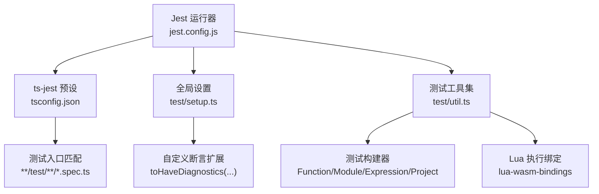
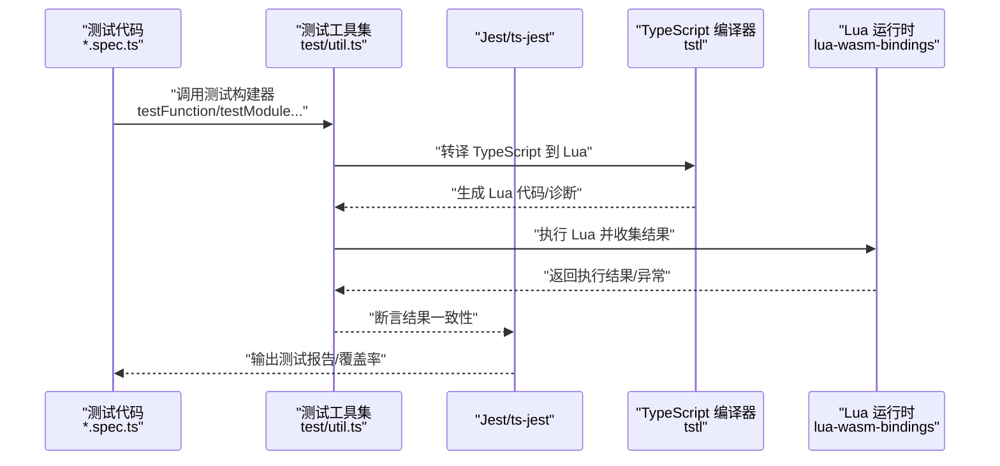
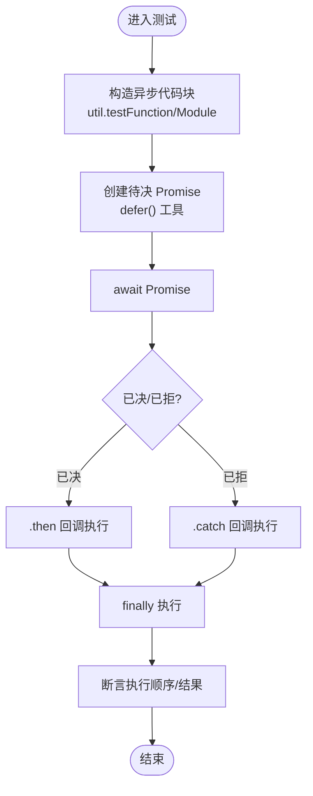
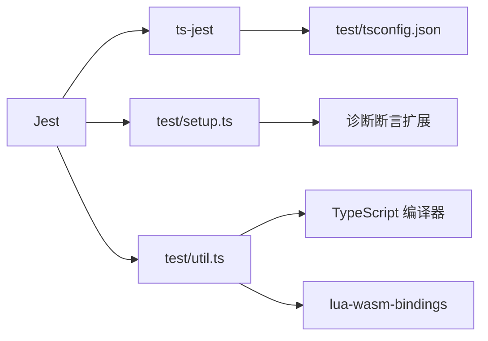

# 单元测试

<cite>
**本文引用的文件**
- [package.json](file://tool/TypeScriptToLua_skynet/package.json)
- [jest.config.js](file://tool/TypeScriptToLua_skynet/jest.config.js)
- [test/tsconfig.json](file://tool/TypeScriptToLua_skynet/test/tsconfig.json)
- [test/setup.ts](file://tool/TypeScriptToLua_skynet/test/setup.ts)
- [test/util.ts](file://tool/TypeScriptToLua_skynet/test/util.ts)
- [test/unit/builtins/async-await.spec.ts](file://tool/TypeScriptToLua_skynet/test/unit/builtins/async-await.spec.ts)
- [test/transpile/bundle.spec.ts](file://tool/TypeScriptToLua_skynet/test/transpile/bundle.spec.ts)
- [.codecov.yml](file://tool/TypeScriptToLua_skynet/.codecov.yml)
- [docker/lua/framework/runtime/node-adapter.lua](file://docker/lua/framework/runtime/node-adapter.lua)
- [docker/lua/framework/runtime/skynet-pb-codec.lua](file://docker/lua/framework/runtime/skynet-pb-codec.lua)
- [docker/lua/framework/runtime/node-pb-codec.lua](file://docker/lua/framework/runtime/node-pb-codec.lua)
- [docker/lua/framework/runtime/skynet-adapter.lua](file://docker/lua/framework/runtime/skynet-adapter.lua)
- [docker/lua/app/services/game/...](file://docker/lua/app/services/game/)
- [docker/lua/app/services/gateway/...](file://docker/lua/app/services/gateway/)
- [docker/lua/app/services/login/...](file://docker/lua/app/services/login/)
- [docker/skynet/service/gate.lua](file://docker/skynet/service/gate.lua)
- [docker/skynet/examples/proto.lua](file://docker/skynet/examples/proto.lua)
- [docker/skynet/lualib/sproto.lua](file://docker/skynet/lualib/sproto.lua)
</cite>

## 目录
1. [简介](#简介)
2. [项目结构](#项目结构)
3. [核心组件](#核心组件)
4. [架构总览](#架构总览)
5. [详细组件分析](#详细组件分析)
6. [依赖关系分析](#依赖关系分析)
7. [性能考量](#性能考量)
8. [故障排查指南](#故障排查指南)
9. [结论](#结论)
10. [附录](#附录)

## 简介
本指南面向 TypeScriptToLua 项目，系统化讲解如何编写高质量的单元测试，覆盖测试框架选择与配置、测试用例设计原则、Mock 策略、测试数据准备、异步与回调测试、覆盖率要求与最佳实践，并结合项目中的实际测试样例路径，给出可直接参考的示例与流程图。

## 项目结构
TypeScriptToLua 的测试体系位于 tool/TypeScriptToLua_skynet 下，采用 Jest + ts-jest 进行测试运行与类型支持；测试代码按功能域分层组织：unit（语言内置与转换）、transpile（打包与项目级转换）、cli（命令行）、translation（语义转换）等。测试运行器通过 jest.config.js 配置，使用 test/setup.ts 注入自定义断言扩展，利用 test/util.ts 提供统一的测试构建器与执行环境。

图表来源
- [jest.config.js:1-28](file://tool/TypeScriptToLua_skynet/jest.config.js#L1-L28)
- [test/tsconfig.json:1-19](file://tool/TypeScriptToLua_skynet/test/tsconfig.json#L1-L19)
- [test/setup.ts:1-49](file://tool/TypeScriptToLua_skynet/test/setup.ts#L1-L49)
- [test/util.ts:1-200](file://tool/TypeScriptToLua_skynet/test/util.ts#L1-L200)

章节来源
- [package.json:25-36](file://tool/TypeScriptToLua_skynet/package.json#L25-L36)
- [jest.config.js:1-28](file://tool/TypeScriptToLua_skynet/jest.config.js#L1-L28)
- [test/tsconfig.json:1-19](file://tool/TypeScriptToLua_skynet/test/tsconfig.json#L1-L19)
- [test/setup.ts:1-49](file://tool/TypeScriptToLua_skynet/test/setup.ts#L1-L49)
- [test/util.ts:1-200](file://tool/TypeScriptToLua_skynet/test/util.ts#L1-L200)

## 核心组件
- 测试框架与预设
  - 使用 Jest 作为测试运行器，preset 为 ts-jest，配合 ts-jest 的 tsconfig 指向 test/tsconfig.json，确保测试环境具备 Node 类型与 Jest 类型支持。
  - 收集覆盖率时排除 src/lualib 与特定入口文件，避免非业务代码影响覆盖率指标。
- 自定义断言扩展
  - 在 test/setup.ts 中扩展 toHaveDiagnostics 断言，用于验证 TypeScript 编译诊断是否符合预期，便于测试编译期行为。
- 测试工具集
  - test/util.ts 提供多种测试构建器（Function/Module/Expression/Project），统一处理 TypeScript -> Lua 转换、Lua 执行、断言结果一致性等。
  - 支持多 Lua 目标版本（Lua50/Lua51/Lua53/Lua54/LuaJIT 等）的测试封装与差异处理。

章节来源
- [jest.config.js:4-27](file://tool/TypeScriptToLua_skynet/jest.config.js#L4-L27)
- [test/setup.ts:14-48](file://tool/TypeScriptToLua_skynet/test/setup.ts#L14-L48)
- [test/util.ts:59-93](file://tool/TypeScriptToLua_skynet/test/util.ts#L59-L93)
- [test/util.ts:670-683](file://tool/TypeScriptToLua_skynet/test/util.ts#L670-L683)

## 架构总览
下图展示了测试从“测试代码”到“Lua 执行”的端到端流程，以及与编译器、Lua 运行时的交互关系。

图表来源
- [test/util.ts:16-Lua 绑定与执行:1-200](file://tool/TypeScriptToLua_skynet/test/util.ts#L1-L200)
- [jest.config.js:18-26](file://tool/TypeScriptToLua_skynet/jest.config.js#L18-L26)

## 详细组件分析

### 测试框架与配置
- 测试匹配规则
  - 仅匹配 test 目录下的 *.spec.ts 文件，保证测试隔离与清晰边界。
- ts-jest 预设与 tsconfig
  - ts-jest 使用 test/tsconfig.json，确保测试侧具备 Node 与 Jest 类型，同时排除部分大型或不参与测试的目录。
- 覆盖率收集
  - 收集 src 下除 lualib 外的源码，排除入口文件，聚焦业务逻辑覆盖率。
- CI 行为
  - 在 CI 环境下，诊断以警告形式输出，便于本地严格模式与 CI 宽松模式的平衡。

章节来源
- [jest.config.js:5](file://tool/TypeScriptToLua_skynet/jest.config.js#L5)
- [jest.config.js:6-11](file://tool/TypeScriptToLua_skynet/jest.config.js#L6-L11)
- [jest.config.js:17-26](file://tool/TypeScriptToLua_skynet/jest.config.js#L17-L26)
- [test/tsconfig.json:3-7](file://tool/TypeScriptToLua_skynet/test/tsconfig.json#L3-L7)
- [test/tsconfig.json:9-17](file://tool/TypeScriptToLua_skynet/test/tsconfig.json#L9-L17)

### 自定义断言 toHaveDiagnostics
- 功能
  - 对比诊断数量与代码，支持期望诊断集合与格式化输出，便于定位编译问题。
- 使用场景
  - 验证错误信息、缺失实现、目标平台不支持等编译期行为。
- 注意
  - 不支持 expect(actual).not.toHaveDiagnostics(expected) 形式，避免误用。

章节来源
- [test/setup.ts:14-48](file://tool/TypeScriptToLua_skynet/test/setup.ts#L14-L48)

### 测试工具集 test/util.ts
- 测试构建器
  - testFunction/testModule/testExpression/testProject：分别针对函数、模块、表达式与项目进行测试。
  - 支持设置 TypeScript/JavaScript/Lua 头部、额外文件、编译选项、主文件名等。
- Lua 执行与绑定
  - 通过 lua-wasm-bindings 在 Node 环境中执行 Lua，支持多 Lua 版本绑定，便于跨版本验证。
- 版本化测试
  - testEachVersion 与 expectEachVersionExceptJit 可对不同 Lua 目标版本批量执行测试，自动跳过不支持的版本（如 LuaJIT）。

章节来源
- [test/util.ts:670-683](file://tool/TypeScriptToLua_skynet/test/util.ts#L670-L683)
- [test/util.ts:59-93](file://tool/TypeScriptToLua_skynet/test/util.ts#L59-L93)
- [test/util.ts:28-51](file://tool/TypeScriptToLua_skynet/test/util.ts#L28-L51)

### 异步与回调测试
- 场景
  - 测试 async/await、Promise、回调链路、错误传播与 finally 行为。
- 方法
  - 使用 util.testFunction/Module 包裹异步代码，结合延迟解析/拒绝的 Promise 工具函数，断言执行顺序与最终状态。
  - 通过日志数组记录执行步骤，验证异步控制流。
- 示例参考
  - 链式 await 不栈溢出、已决/待决 Promise、错误捕获、try/catch/finally、返回值与对象展开等。

图表来源
- [test/unit/builtins/async-await.spec.ts:1-819](file://tool/TypeScriptToLua_skynet/test/unit/builtins/async-await.spec.ts#L1-L819)
- [test/util.ts:1-200](file://tool/TypeScriptToLua_skynet/test/util.ts#L1-L200)

章节来源
- [test/unit/builtins/async-await.spec.ts:1-819](file://tool/TypeScriptToLua_skynet/test/unit/builtins/async-await.spec.ts#L1-L819)
- [test/util.ts:1-200](file://tool/TypeScriptToLua_skynet/test/util.ts#L1-L200)

### 打包与源码映射测试
- 目标
  - 验证多文件打包为单 Lua 文件、源码映射正确性、错误消息映射到原始 TS 行列。
- 方法
  - 通过 util.testProject 加载 tsconfig，获取 Transpile 结果，断言输出文件数、名称、执行结果与 sourceMap 映射。
- 关键点
  - 排除宏字符串污染、校验映射文件与行号一致性。

章节来源
- [test/transpile/bundle.spec.ts:1-133](file://tool/TypeScriptToLua_skynet/test/transpile/bundle.spec.ts#L1-L133)

### 协议编解码测试（基于项目现有能力）
- 背景
  - 项目包含 Skynet 与 sproto 的协议定义与编解码实现，可用于验证协议层的编码/解码正确性。
- 建议
  - 使用 Node/PbCodec 或 Skynet-Pb-Codec 的适配器，构造请求/响应数据，断言 encode/decode 的对称性与默认值填充。
  - 可参考 node-adapter.lua 与 skynet-adapter.lua 的初始化流程，确保 codec 实例可用。
- 示例参考路径
  - Node 适配器初始化与 codec 获取：[node-adapter.lua:187-206](file://docker/lua/framework/runtime/node-adapter.lua#L187-L206)
  - Skynet PbCodec 实现：[skynet-pb-codec.lua](file://docker/lua/framework/runtime/skynet-pb-codec.lua)
  - Node PbCodec 实现：[node-pb-codec.lua](file://docker/lua/framework/runtime/node-pb-codec.lua)
  - 协议定义与 sproto 接口：[proto.lua](file://docker/skynet/examples/proto.lua)，[sproto.lua](file://docker/skynet/lualib/sproto.lua)

章节来源
- [docker/lua/framework/runtime/node-adapter.lua:187-206](file://docker/lua/framework/runtime/node-adapter.lua#L187-L206)
- [docker/lua/framework/runtime/skynet-pb-codec.lua](file://docker/lua/framework/runtime/skynet-pb-codec.lua)
- [docker/lua/framework/runtime/node-pb-codec.lua](file://docker/lua/framework/runtime/node-pb-codec.lua)
- [docker/skynet/examples/proto.lua:1-46](file://docker/skynet/examples/proto.lua#L1-L46)
- [docker/skynet/lualib/sproto.lua:131-196](file://docker/skynet/lualib/sproto.lua#L131-L196)

### 服务层测试（网关/登录/游戏）
- 设计原则
  - 将服务逻辑与网络/协议解耦，优先测试纯函数与状态机逻辑。
  - 使用 Mock 适配器替换底层网络与存储，集中断言业务规则。
- 网关服务
  - 关注连接建立、消息路由、断线回收、心跳与超时。
  - 可参考 gate 服务与 sproto 协议，模拟客户端请求与服务端响应。
- 登录服务
  - 关注鉴权流程、令牌发放/校验、会话管理与错误分支。
- 游戏服务
  - 关注状态同步、事件广播、规则校验与回滚。
- 示例参考路径
  - 网关服务：[gate.lua](file://docker/skynet/service/gate.lua)
  - 登录服务：[login 服务目录](file://docker/lua/app/services/login/)
  - 游戏服务：[game 服务目录](file://docker/lua/app/services/game/)
  - 协议与 sproto：[proto.lua](file://docker/skynet/examples/proto.lua)，[sproto.lua](file://docker/skynet/lualib/sproto.lua)

章节来源
- [docker/skynet/service/gate.lua](file://docker/skynet/service/gate.lua)
- [docker/lua/app/services/login/...](file://docker/lua/app/services/login/)
- [docker/lua/app/services/game/...](file://docker/lua/app/services/game/)
- [docker/skynet/examples/proto.lua:1-46](file://docker/skynet/examples/proto.lua#L1-L46)
- [docker/skynet/lualib/sproto.lua:131-196](file://docker/skynet/lualib/sproto.lua#L131-L196)

### 接口层测试（HTTP/WebSocket 等）
- 设计原则
  - 通过适配器抽象网络层，使用 Mock 请求/响应对象，断言序列化/反序列化与路由分发。
- 建议
  - 对于 WebSocket/HTTP，构造最小化请求体与头部，验证错误码与返回结构。
  - 结合协议编解码测试，确保接口与协议一致。

章节来源
- [docker/lua/framework/runtime/skynet-adapter.lua](file://docker/lua/framework/runtime/skynet-adapter.lua)
- [docker/skynet/examples/proto.lua:1-46](file://docker/skynet/examples/proto.lua#L1-L46)
- [docker/skynet/lualib/sproto.lua:131-196](file://docker/skynet/lualib/sproto.lua#L131-L196)

### Mock 策略与测试数据准备
- Mock 策略
  - 使用 jest.mock 或自定义适配器替换外部依赖（网络、数据库、文件系统）。
  - 对于协议层，Mock sproto 编解码器，断言输入输出与默认值。
- 测试数据准备
  - 使用 test/util.ts 的 addExtraFile 与 setTsHeader/setLuaHeader 注入辅助数据与工具函数。
  - 对于异步场景，提供 defer 工具函数构造待决/已决/已拒 Promise。

章节来源
- [test/util.ts:193-198](file://tool/TypeScriptToLua_skynet/test/util.ts#L193-L198)
- [test/unit/builtins/async-await.spec.ts:7-25](file://tool/TypeScriptToLua_skynet/test/unit/builtins/async-await.spec.ts#L7-L25)

### 测试覆盖率与最佳实践
- 覆盖率目标
  - 项目配置目标为 90%，建议在本地与 CI 均启用覆盖率统计，关注业务核心路径。
- 最佳实践
  - 用例粒度：单一职责、明确输入输出、覆盖正常/异常/边界。
  - 断言风格：优先使用 toEqual/toBe 等精确断言，必要时使用正则/结构化断言。
  - 异步测试：使用延迟解析/拒绝的 Promise，断言执行顺序与最终状态。
  - 版本兼容：利用 testEachVersion 与 expectEachVersionExceptJit，覆盖多 Lua 目标版本。

章节来源
- [.codecov.yml:3-11](file://tool/TypeScriptToLua_skynet/.codecov.yml#L3-L11)
- [test/util.ts:59-93](file://tool/TypeScriptToLua_skynet/test/util.ts#L59-L93)

## 依赖关系分析
- 测试运行器依赖
  - Jest 与 ts-jest 作为核心运行与类型支持。
  - Node 环境下的 lua-wasm-bindings 用于执行 Lua。
- 断言扩展依赖
  - TypeScript 编译诊断格式化与比较。
- 工具集依赖
  - TypeScript 编译器、文件系统、路径处理、PrettyFormat 等。

图表来源
- [jest.config.js:17-26](file://tool/TypeScriptToLua_skynet/jest.config.js#L17-L26)
- [test/tsconfig.json:3-7](file://tool/TypeScriptToLua_skynet/test/tsconfig.json#L3-L7)
- [test/setup.ts:14-48](file://tool/TypeScriptToLua_skynet/test/setup.ts#L14-L48)
- [test/util.ts:1-200](file://tool/TypeScriptToLua_skynet/test/util.ts#L1-L200)

章节来源
- [jest.config.js:17-26](file://tool/TypeScriptToLua_skynet/jest.config.js#L17-L26)
- [test/setup.ts:14-48](file://tool/TypeScriptToLua_skynet/test/setup.ts#L14-L48)
- [test/util.ts:1-200](file://tool/TypeScriptToLua_skynet/test/util.ts#L1-L200)

## 性能考量
- 测试执行性能
  - 使用 lua-wasm-bindings 在 Node 环境执行 Lua，避免启动外部进程带来的开销。
  - 合理拆分测试文件，避免单测过大导致加载与执行时间过长。
- 覆盖率与性能
  - 覆盖率目标 90% 是项目基线，建议在 CI 中开启覆盖率检查，避免过度降低质量。

## 故障排查指南
- 常见问题
  - 诊断断言失败：检查 toHaveDiagnostics 的期望与实际诊断集合，确认是否遗漏或多余。
  - LuaJIT 不支持执行：当目标为 LuaJIT 时，无法使用 expectToMatchJsResult 或 executeLua，需切换到其他 Lua 版本。
  - 源码映射不正确：检查打包与 sourceMap 配置，确保映射文件与行号一致。
- 定位方法
  - 使用 test/util.ts 的调试输出与断言组合，逐步缩小问题范围。
  - 在 CI 环境下，查看诊断警告输出，定位编译期问题。

章节来源
- [test/setup.ts:14-48](file://tool/TypeScriptToLua_skynet/test/setup.ts#L14-L48)
- [test/util.ts:28-51](file://tool/TypeScriptToLua_skynet/test/util.ts#L28-L51)
- [test/transpile/bundle.spec.ts:68-131](file://tool/TypeScriptToLua_skynet/test/transpile/bundle.spec.ts#L68-L131)

## 结论
本指南提供了 TypeScriptToLua 项目的单元测试方法论与实操路径：以 Jest + ts-jest 为核心，借助 test/util.ts 的测试构建器与 lua-wasm-bindings 执行 Lua，结合 toHaveDiagnostics 断言与多版本测试策略，覆盖异步、协议、服务与接口层的关键场景。建议在团队内推广统一的测试模板与断言风格，持续提升覆盖率与稳定性。

## 附录
- 具体测试代码示例（路径）
  - 异步与 Promise 行为：[async-await.spec.ts](file://tool/TypeScriptToLua_skynet/test/unit/builtins/async-await.spec.ts)
  - 打包与源码映射：[bundle.spec.ts](file://tool/TypeScriptToLua_skynet/test/transpile/bundle.spec.ts)
  - 协议编解码适配器：[node-adapter.lua](file://docker/lua/framework/runtime/node-adapter.lua)，[skynet-pb-codec.lua](file://docker/lua/framework/runtime/skynet-pb-codec.lua)，[node-pb-codec.lua](file://docker/lua/framework/runtime/node-pb-codec.lua)
  - 协议定义与 sproto：[proto.lua](file://docker/skynet/examples/proto.lua)，[sproto.lua](file://docker/skynet/lualib/sproto.lua)
  - 服务层参考：[gate.lua](file://docker/skynet/service/gate.lua)，[login 服务](file://docker/lua/app/services/login/)，[game 服务](file://docker/lua/app/services/game/)