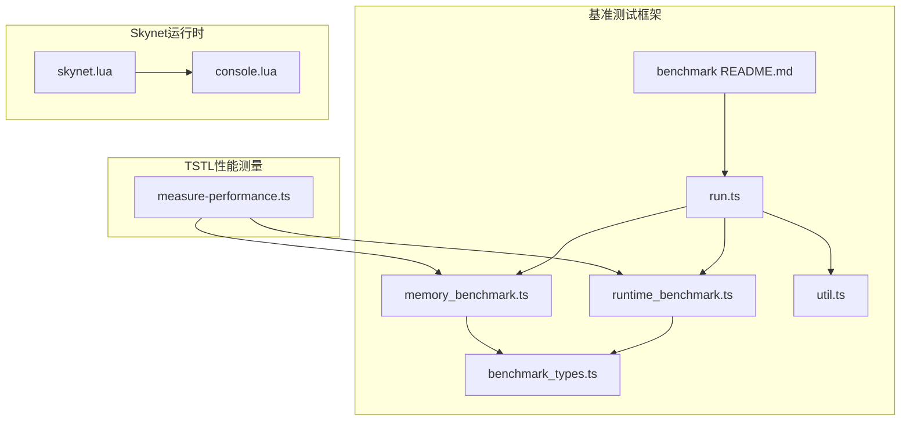
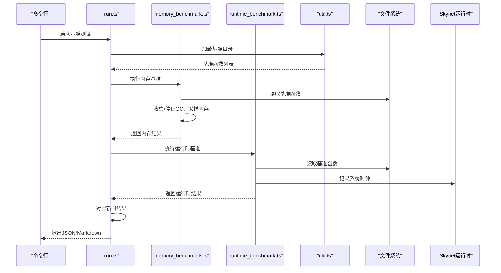
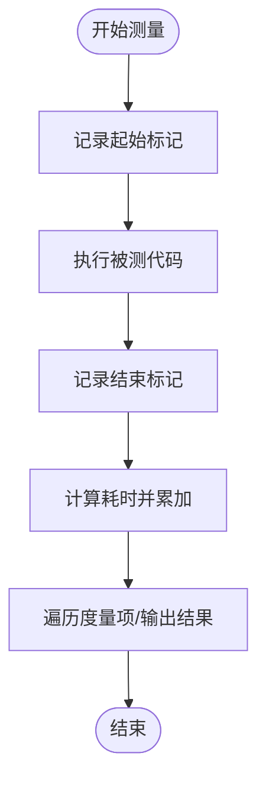
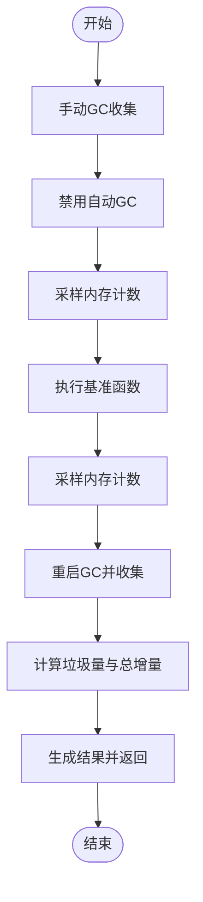
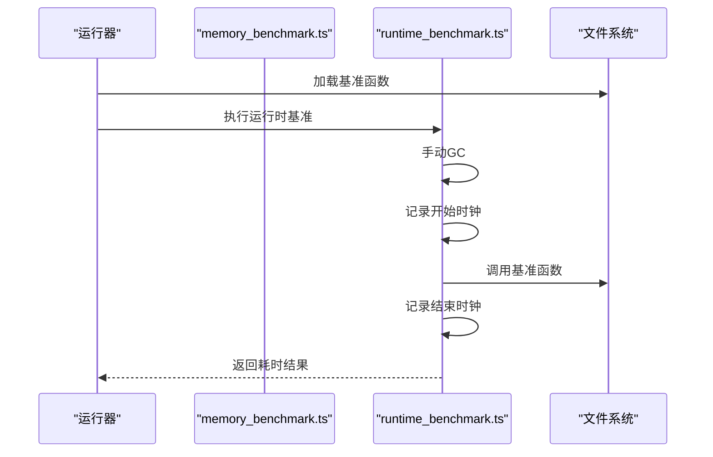
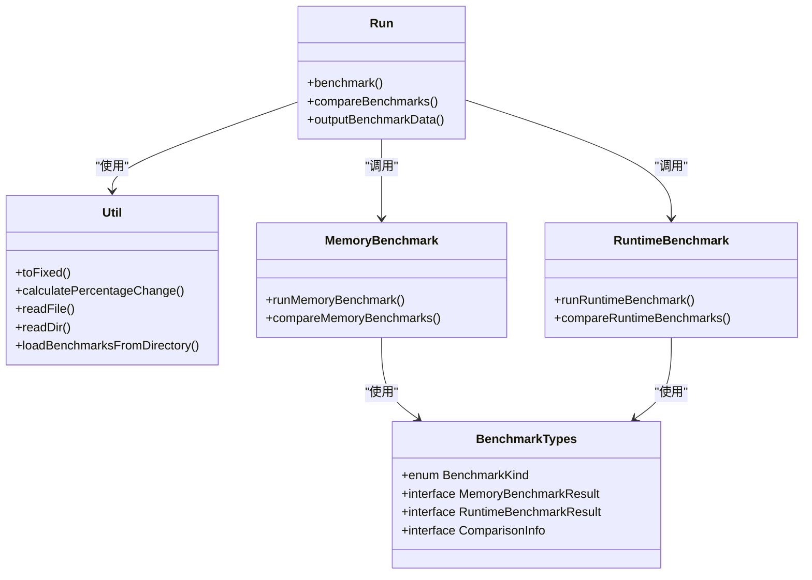
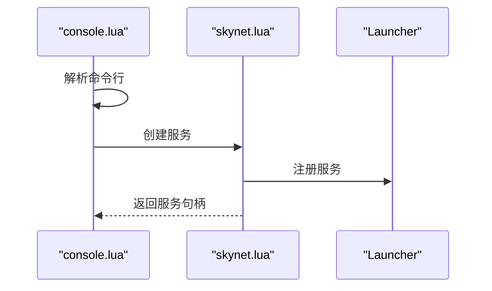
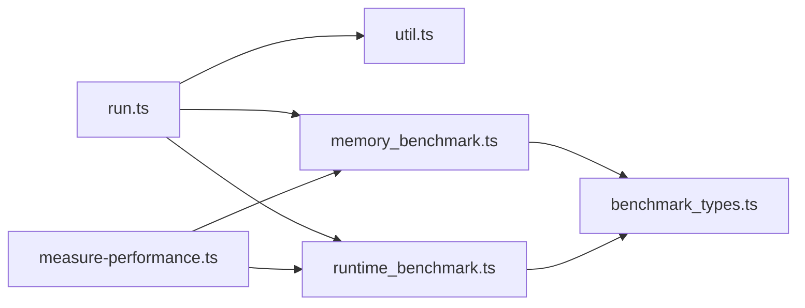

# 性能分析

<cite>
**本文引用的文件**
- [measure-performance.ts](file://tool\TypeScriptToLua_skynet\src\measure-performance.ts)
- [benchmark_types.ts](file://tool\TypeScriptToLua_skynet\benchmark\src\benchmark_types.ts)
- [memory_benchmark.ts](file://tool\TypeScriptToLua_skynet\benchmark\src\memory_benchmark.ts)
- [runtime_benchmark.ts](file://tool\TypeScriptToLua_skynet\benchmark\src\runtime_benchmark.ts)
- [run.ts](file://tool\TypeScriptToLua_skynet\benchmark\src\run.ts)
- [util.ts](file://tool\TypeScriptToLua_skynet\benchmark\src\util.ts)
- [benchmark README.md](file://tool\TypeScriptToLua_skynet\benchmark\README.md)
- [skynet.lua](file://docker\skynet\lualib\skynet.lua)
- [console.lua](file://docker\skynet\service\console.lua)
</cite>

## 目录
1. [引言](#引言)
2. [项目结构](#项目结构)
3. [核心组件](#核心组件)
4. [架构总览](#架构总览)
5. [详细组件分析](#详细组件分析)
6. [依赖关系分析](#依赖关系分析)
7. [性能考量](#性能考量)
8. [故障排查指南](#故障排查指南)
9. [结论](#结论)
10. [附录](#附录)

## 引言
本指南面向TypeScriptToLua（TSTL）在Skynet环境下的性能分析与优化实践，围绕以下目标展开：
- 使用基准测试工具分析TSTL的运行时与内存表现
- 内存分析：垃圾回收监控、内存泄漏检测思路
- CPU性能分析：热点函数识别、调用图分析
- 网络性能测试与优化建议
- Skynet服务性能瓶颈定位与监控
- 性能指标监控与告警设置
- 缓存策略与数据结构优化
- 性能回归测试实施
- 平衡TypeScript强类型检查与运行时性能

## 项目结构
本仓库包含TSTL核心实现、Skynet运行时、协议与表格构建工具、以及一套完整的基准测试框架。与性能分析直接相关的模块主要分布在：
- TSTL性能测量工具：用于在运行时记录分段耗时
- 基准测试子系统：内存与运行时两类基准，支持对比与输出报告
- Skynet运行时与控制台：提供服务生命周期、调度与调试能力

**图表来源**
- [measure-performance.ts:1-84](file://tool\TypeScriptToLua_skynet\src\measure-performance.ts#L1-L84)
- [runtime_benchmark.ts:1-44](file://tool\TypeScriptToLua_skynet\benchmark\src\runtime_benchmark.ts#L1-L44)
- [memory_benchmark.ts:1-72](file://tool\TypeScriptToLua_skynet\benchmark\src\memory_benchmark.ts#L1-L72)
- [benchmark_types.ts:1-39](file://tool\TypeScriptToLua_skynet\benchmark\src\benchmark_types.ts#L1-L39)
- [run.ts:1-106](file://tool\TypeScriptToLua_skynet\benchmark\src\run.ts#L1-L106)
- [util.ts:1-77](file://tool\TypeScriptToLua_skynet\benchmark\src\util.ts#L1-L77)
- [benchmark README.md:1-48](file://tool\TypeScriptToLua_skynet\benchmark\README.md#L1-L48)
- [skynet.lua:1-800](file://docker\skynet\lualib\skynet.lua#L1-L800)
- [console.lua:1-30](file://docker\skynet\service\console.lua#L1-L30)

**章节来源**
- [benchmark README.md:1-48](file://tool\TypeScriptToLua_skynet\benchmark\README.md#L1-L48)

## 核心组件
- 运行时性能测量工具：提供分段标记、测量累积耗时、启用/禁用开关与遍历回调，便于在关键路径埋点统计
- 内存基准：通过关闭GC、采集前后内存计数，计算“垃圾”与“总内存”增量，评估TSTL生成Lua代码的内存开销
- 运行时基准：使用系统时钟统计执行时间，标准化多次运行取稳定值
- 基准运行器：统一加载基准文件、执行并输出JSON或Markdown对比结果，支持与基线对比
- Skynet运行时与控制台：提供服务生命周期管理、协程调度、超时与追踪等能力，支撑性能观测与问题定位

**章节来源**
- [measure-performance.ts:1-84](file://tool\TypeScriptToLua_skynet\src\measure-performance.ts#L1-L84)
- [memory_benchmark.ts:1-72](file://tool\TypeScriptToLua_skynet\benchmark\src\memory_benchmark.ts#L1-L72)
- [runtime_benchmark.ts:1-44](file://tool\TypeScriptToLua_skynet\benchmark\src\runtime_benchmark.ts#L1-L44)
- [run.ts:1-106](file://tool\TypeScriptToLua_skynet\benchmark\src\run.ts#L1-L106)
- [skynet.lua:1-800](file://docker\skynet\lualib\skynet.lua#L1-L800)
- [console.lua:1-30](file://docker\skynet\service\console.lua#L1-L30)

## 架构总览
下图展示基准测试从入口到执行再到输出的端到端流程，以及与Skynet运行时的交互关系。

**图表来源**
- [run.ts:1-106](file://tool\TypeScriptToLua_skynet\benchmark\src\run.ts#L1-L106)
- [memory_benchmark.ts:1-72](file://tool\TypeScriptToLua_skynet\benchmark\src\memory_benchmark.ts#L1-L72)
- [runtime_benchmark.ts:1-44](file://tool\TypeScriptToLua_skynet\benchmark\src\runtime_benchmark.ts#L1-L44)
- [util.ts:1-77](file://tool\TypeScriptToLua_skynet\benchmark\src\util.ts#L1-L77)
- [skynet.lua:1-800](file://docker\skynet\lualib\skynet.lua#L1-L800)

## 详细组件分析

### 组件A：运行时性能测量工具
- 功能要点
  - 提供分段标记与测量接口，内部维护起止时间映射与累计时长
  - 可开启/关闭测量，清空状态，遍历度量项与计算总耗时
  - 调用Node性能API以确保Profiler可见性
- 典型用法
  - 在编译/运行关键阶段调用开始/结束接口，形成“start X/end X”的配对
  - 将度量结果汇总后输出，辅助定位热点与瓶颈
- 复杂度
  - 单次标记/测量为O(1)，累计遍历O(N)

**图表来源**
- [measure-performance.ts:1-84](file://tool\TypeScriptToLua_skynet\src\measure-performance.ts#L1-L84)

**章节来源**
- [measure-performance.ts:1-84](file://tool\TypeScriptToLua_skynet\src\measure-performance.ts#L1-L84)

### 组件B：内存基准测试
- 目标
  - 评估TSTL生成Lua代码的内存开销，重点跟踪“垃圾”与“总内存”
- 方法
  - 运行前手动GC，禁用自动GC，采样前后内存计数
  - 执行基准函数，返回有用结果避免被GC回收，仅统计无用临时对象
  - 恢复GC并再次采样，计算垃圾量与总增量
- 输出
  - 包含基准名称与两类内存指标，支持与基线对比

**图表来源**
- [memory_benchmark.ts:1-72](file://tool\TypeScriptToLua_skynet\benchmark\src\memory_benchmark.ts#L1-L72)

**章节来源**
- [memory_benchmark.ts:1-72](file://tool\TypeScriptToLua_skynet\benchmark\src\memory_benchmark.ts#L1-L72)
- [benchmark README.md:25-33](file://tool\TypeScriptToLua_skynet\benchmark\README.md#L25-L33)

### 组件C：运行时基准测试
- 目标
  - 测量TSTL生成Lua代码的执行时间
- 方法
  - 运行前手动GC，记录系统时钟，执行基准函数，计算差值
  - 通过调试信息获取基准函数短路径作为名称
- 输出
  - 包含基准名称与耗时，支持与基线对比

**图表来源**
- [runtime_benchmark.ts:1-44](file://tool\TypeScriptToLua_skynet\benchmark\src\runtime_benchmark.ts#L1-L44)
- [run.ts:1-106](file://tool\TypeScriptToLua_skynet\benchmark\src\run.ts#L1-L106)

**章节来源**
- [runtime_benchmark.ts:1-44](file://tool\TypeScriptToLua_skynet\benchmark\src\runtime_benchmark.ts#L1-L44)
- [run.ts:1-106](file://tool\TypeScriptToLua_skynet\benchmark\src\run.ts#L1-L106)

### 组件D：基准运行器与工具
- 运行器职责
  - 统一加载内存/运行时两类基准
  - 可选读取基线结果进行对比
  - 输出JSON或Markdown格式报告
- 工具函数
  - 文件读写、目录扫描、JSON编解码、平台兼容处理
- 类型定义
  - 明确基准种类、结果结构与比较信息

**图表来源**
- [benchmark_types.ts:1-39](file://tool\TypeScriptToLua_skynet\benchmark\src\benchmark_types.ts#L1-L39)
- [util.ts:1-77](file://tool\TypeScriptToLua_skynet\benchmark\src\util.ts#L1-L77)
- [run.ts:1-106](file://tool\TypeScriptToLua_skynet\benchmark\src\run.ts#L1-L106)
- [memory_benchmark.ts:1-72](file://tool\TypeScriptToLua_skynet\benchmark\src\memory_benchmark.ts#L1-L72)
- [runtime_benchmark.ts:1-44](file://tool\TypeScriptToLua_skynet\benchmark\src\runtime_benchmark.ts#L1-L44)

**章节来源**
- [run.ts:1-106](file://tool\TypeScriptToLua_skynet\benchmark\src\run.ts#L1-L106)
- [util.ts:1-77](file://tool\TypeScriptToLua_skynet\benchmark\src\util.ts#L1-L77)
- [benchmark_types.ts:1-39](file://tool\TypeScriptToLua_skynet\benchmark\src\benchmark_types.ts#L1-L39)

### 组件E：Skynet运行时与控制台
- 运行时能力
  - 协程池复用、会话管理、超时与睡眠、追踪与错误传播
  - 提供高精度计时与性能计数器，便于性能观测
- 控制台服务
  - 接收命令行输入，动态创建服务，辅助调试与压测

**图表来源**
- [console.lua:1-30](file://docker\skynet\service\console.lua#L1-L30)
- [skynet.lua:1-800](file://docker\skynet\lualib\skynet.lua#L1-L800)

**章节来源**
- [skynet.lua:1-800](file://docker\skynet\lualib\skynet.lua#L1-L800)
- [console.lua:1-30](file://docker\skynet\service\console.lua#L1-L30)

## 依赖关系分析
- 基准运行器依赖工具模块完成文件与目录操作，并根据类型定义组织结果
- 内存/运行时基准分别独立执行，最终由运行器统一比较与输出
- 性能测量工具可与基准测试结合，在关键路径埋点，形成更细粒度的耗时画像

**图表来源**
- [run.ts:1-106](file://tool\TypeScriptToLua_skynet\benchmark\src\run.ts#L1-L106)
- [util.ts:1-77](file://tool\TypeScriptToLua_skynet\benchmark\src\util.ts#L1-L77)
- [memory_benchmark.ts:1-72](file://tool\TypeScriptToLua_skynet\benchmark\src\memory_benchmark.ts#L1-L72)
- [runtime_benchmark.ts:1-44](file://tool\TypeScriptToLua_skynet\benchmark\src\runtime_benchmark.ts#L1-L44)
- [benchmark_types.ts:1-39](file://tool\TypeScriptToLua_skynet\benchmark\src\benchmark_types.ts#L1-L39)
- [measure-performance.ts:1-84](file://tool\TypeScriptToLua_skynet\src\measure-performance.ts#L1-L84)

**章节来源**
- [run.ts:1-106](file://tool\TypeScriptToLua_skynet\benchmark\src\run.ts#L1-L106)
- [util.ts:1-77](file://tool\TypeScriptToLua_skynet\benchmark\src\util.ts#L1-L77)
- [memory_benchmark.ts:1-72](file://tool\TypeScriptToLua_skynet\benchmark\src\memory_benchmark.ts#L1-L72)
- [runtime_benchmark.ts:1-44](file://tool\TypeScriptToLua_skynet\benchmark\src\runtime_benchmark.ts#L1-L44)
- [benchmark_types.ts:1-39](file://tool\TypeScriptToLua_skynet\benchmark\src\benchmark_types.ts#L1-L39)
- [measure-performance.ts:1-84](file://tool\TypeScriptToLua_skynet\src\measure-performance.ts#L1-L84)

## 性能考量
- 基准测试最佳实践
  - 固定输入规模与重复次数，避免抖动；必要时多次运行取中位数或分位数
  - 分离“冷启动”与“热运行”，在稳定状态下采集
  - 使用基线对比，设定阈值触发回归告警
- 内存分析
  - 关闭自动GC，精确测量“垃圾”与“总内存”增量
  - 通过返回有用结果避免误判，仅统计临时对象
  - 结合Skynet内存监控与日志，定位异常增长
- CPU分析
  - 利用性能测量工具在编译/运行关键路径打点，形成调用图
  - 结合Skynet追踪功能，观察协程切换与超时栈
- 网络性能
  - 使用Skynet内置计时与高精度计数器，量化请求往返与队列等待
  - 优化消息序列化与协议压缩，减少大包传输
- 缓存与数据结构
  - 复用协程池与对象池，降低频繁分配
  - 优先使用紧凑表与稀疏数组，减少键空间与哈希冲突
- 类型检查与性能权衡
  - 在生产构建中可考虑关闭严格模式或降级部分校验，但需配合完善的静态检查与回归测试
  - 对热点路径采用更轻量的校验策略，保留关键边界检查

[本节为通用指导，不直接分析具体文件]

## 故障排查指南
- 基准测试失败
  - 检查基准函数是否正确导出与命名，确认文件加载路径
  - 确认基线文件存在且可解析
- 内存异常
  - 确认已禁用自动GC并在采样前后均执行GC
  - 检查基准函数是否意外持有引用导致未释放
- 运行时异常
  - 查看基准函数短路径名，定位具体文件
  - 结合Skynet错误传播与追踪，定位异常来源
- Skynet服务问题
  - 使用控制台动态创建服务验证环境
  - 检查服务注册与会话管理，避免悬挂请求

**章节来源**
- [run.ts:1-106](file://tool\TypeScriptToLua_skynet\benchmark\src\run.ts#L1-L106)
- [memory_benchmark.ts:1-72](file://tool\TypeScriptToLua_skynet\benchmark\src\memory_benchmark.ts#L1-L72)
- [runtime_benchmark.ts:1-44](file://tool\TypeScriptToLua_skynet\benchmark\src\runtime_benchmark.ts#L1-L44)
- [skynet.lua:1-800](file://docker\skynet\lualib\skynet.lua#L1-L800)
- [console.lua:1-30](file://docker\skynet\service\console.lua#L1-L30)

## 结论
通过基准测试框架与Skynet运行时能力，可以系统地评估与优化TSTL在实际部署中的性能表现。建议将基准测试纳入CI，建立基线与回归告警，持续监控内存与CPU占用，结合调用图与追踪定位瓶颈，逐步完善缓存与数据结构策略，最终在保证质量的前提下提升运行效率。

[本节为总结，不直接分析具体文件]

## 附录
- 基准测试运行步骤
  - 生成基线：编译并运行基准，输出基线JSON
  - 生成更新：在改动后重新运行，输出对比结果
  - 可选输出Markdown便于本地查看
- 建议的性能指标
  - 内存：峰值内存、垃圾回收频率、分配速率
  - CPU：平均/95分位耗时、协程切换次数、阻塞比例
  - 网络：吞吐、延迟、丢包率、重传率
- 告警设置
  - 设定阈值与滑动窗口，超过阈值触发告警并附带最近一次基准报告链接

**章节来源**
- [benchmark README.md:38-48](file://tool\TypeScriptToLua_skynet\benchmark\README.md#L38-L48)