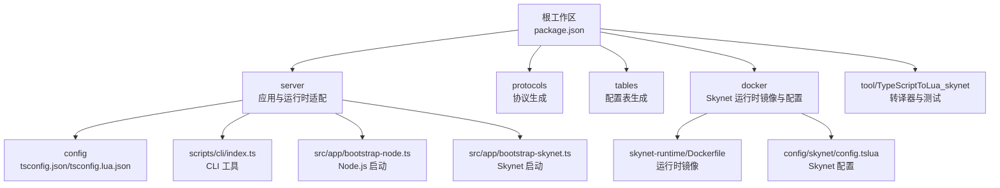
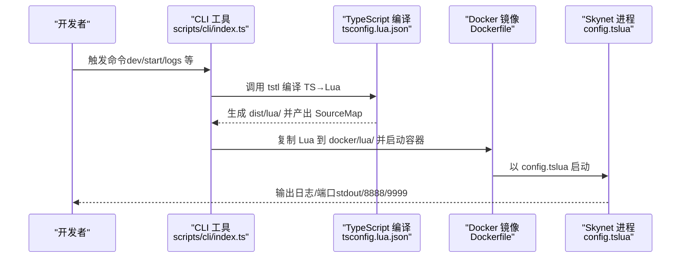
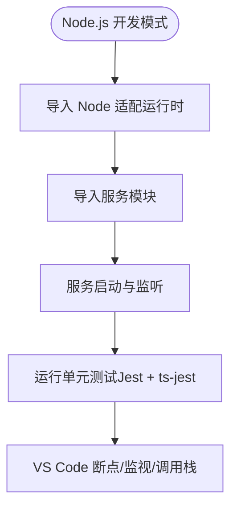
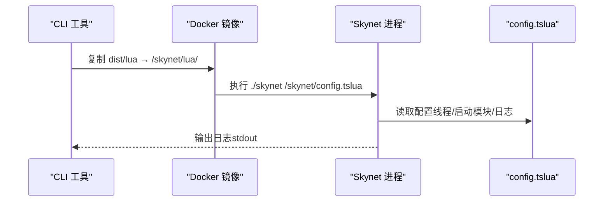
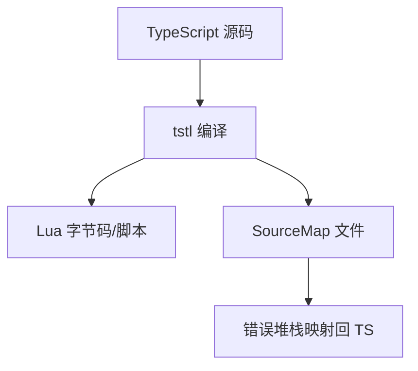
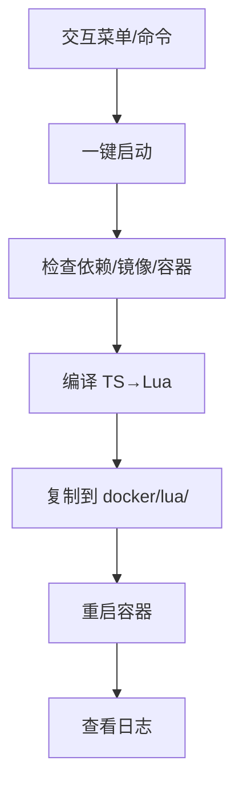
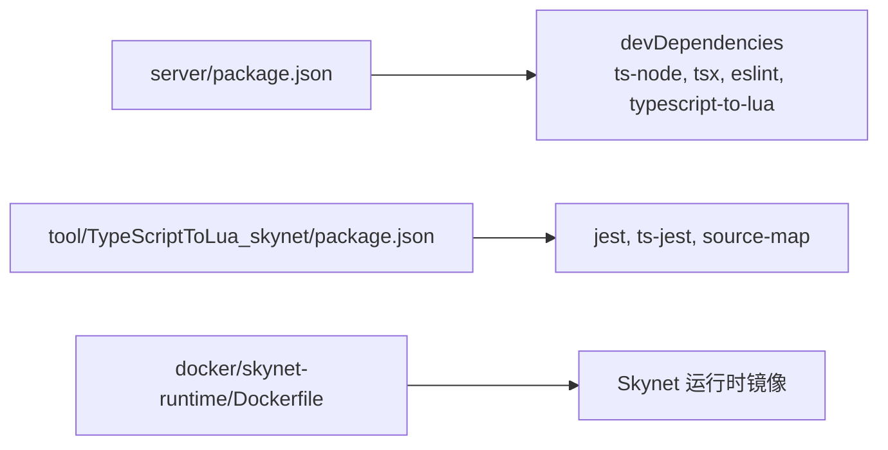

# 测试与调试

<cite>
**本文引用的文件**
- [package.json](file://package.json)
- [server/package.json](file://server/package.json)
- [tool/TypeScriptToLua_skynet/package.json](file://tool/TypeScriptToLua_skynet/package.json)
- [tslua.config.yaml](file://tslua.config.yaml)
- [docker/config/skynet/config.tslua](file://docker/config/skynet/config.tslua)
- [server/config/tsconfig.json](file://server/config/tsconfig.json)
- [server/config/tsconfig.lua.json](file://server/config/tsconfig.lua.json)
- [server/scripts/cli/index.ts](file://server/scripts/cli/index.ts)
- [server/src/app/bootstrap-node.ts](file://server/src/app/bootstrap-node.ts)
- [server/src/app/bootstrap-skynet.ts](file://server/src/app/bootstrap-skynet.ts)
- [docker/skynet-runtime/Dockerfile](file://docker/skynet-runtime/Dockerfile)
- [tool/TypeScriptToLua_skynet/jest.config.js](file://tool/TypeScriptToLua_skynet/jest.config.js)
</cite>

## 目录
1. [简介](#简介)
2. [项目结构](#项目结构)
3. [核心组件](#核心组件)
4. [架构总览](#架构总览)
5. [详细组件分析](#详细组件分析)
6. [依赖分析](#依赖分析)
7. [性能考虑](#性能考虑)
8. [故障排查指南](#故障排查指南)
9. [结论](#结论)
10. [附录](#附录)

## 简介
本指南面向在 Node.js 开发模式与 Skynet 模式下进行 TypeScript 到 Lua 的混合开发团队，系统阐述以下主题：
- 单元测试编写方法：测试框架选择、测试用例设计、Mock 策略
- VS Code 调试配置：断点、变量监视、调用栈分析
- SourceMap 作用与配置：帮助理解 TypeScript 到 Lua 的映射关系
- Skynet 模式调试技巧：日志分析、错误追踪、性能分析
- 常见问题与工具使用
- 自动化测试与持续集成建议

## 项目结构
本仓库采用多工作区组织方式，核心目录与职责如下：
- server：TypeScript 源码与 Node.js/Skynet 运行时适配层
- docker：Skynet 运行时镜像与配置
- protocols：Protobuf 定义与生成
- tables：Luban 配置表定义与生成
- tool/TypeScriptToLua_skynet：TypeScript 到 Lua 转译器（含测试与基准）

图表来源
- [package.json:11-37](file://package.json#L11-L37)
- [server/package.json:6-26](file://server/package.json#L6-L26)
- [tslua.config.yaml:11-44](file://tslua.config.yaml#L11-L44)

章节来源
- [package.json:1-48](file://package.json#L1-L48)
- [server/package.json:1-51](file://server/package.json#L1-L51)
- [tslua.config.yaml:1-52](file://tslua.config.yaml#L1-L52)

## 核心组件
- CLI 工具：统一管理构建、启动、日志、热更新等任务，支持交互菜单与命令行模式
- TypeScript 编译配置：分别针对 Node.js 与 Lua 输出，启用 SourceMap 与 Skynet 兼容
- 运行时适配：Node 与 Skynet 双环境启动入口，隔离服务初始化逻辑
- Docker 运行时：基于 Ubuntu 构建 Skynet 运行时镜像，内置日志与端口配置
- 测试框架：Jest + ts-jest，覆盖转译器与语言扩展的单元测试

章节来源
- [server/scripts/cli/index.ts:301-354](file://server/scripts/cli/index.ts#L301-L354)
- [server/config/tsconfig.json:1-26](file://server/config/tsconfig.json#L1-L26)
- [server/config/tsconfig.lua.json:1-23](file://server/config/tsconfig.lua.json#L1-L23)
- [server/src/app/bootstrap-node.ts:1-22](file://server/src/app/bootstrap-node.ts#L1-L22)
- [server/src/app/bootstrap-skynet.ts:1-20](file://server/src/app/bootstrap-skynet.ts#L1-L20)
- [docker/skynet-runtime/Dockerfile:1-91](file://docker/skynet-runtime/Dockerfile#L1-L91)
- [tool/TypeScriptToLua_skynet/jest.config.js:1-28](file://tool/TypeScriptToLua_skynet/jest.config.js#L1-L28)

## 架构总览
下图展示 Node.js 与 Skynet 两种运行模式的启动流程与关键交互点。

图表来源
- [server/scripts/cli/index.ts:547-571](file://server/scripts/cli/index.ts#L547-L571)
- [server/config/tsconfig.lua.json:12-19](file://server/config/tsconfig.lua.json#L12-L19)
- [docker/skynet-runtime/Dockerfile:68-90](file://docker/skynet-runtime/Dockerfile#L68-L90)
- [docker/config/skynet/config.tslua:10-18](file://docker/config/skynet/config.tslua#L10-L18)

## 详细组件分析

### Node.js 开发模式与单元测试
- 启动入口：Node.js 模式通过 bootstrap-node.ts 注入 Node 适配运行时并导入服务模块，适合本地快速验证与单元测试
- 编译配置：tsconfig.json 启用 declarationMap、sourceMap，便于调试与 IDE 支持
- 测试框架：Jest + ts-jest，测试匹配规则与 tsconfig 指向 test 目录

图表来源
- [server/src/app/bootstrap-node.ts:5-22](file://server/src/app/bootstrap-node.ts#L5-L22)
- [server/config/tsconfig.json:13-14](file://server/config/tsconfig.json#L13-L14)
- [tool/TypeScriptToLua_skynet/jest.config.js:5-27](file://tool/TypeScriptToLua_skynet/jest.config.js#L5-L27)

章节来源
- [server/src/app/bootstrap-node.ts:1-22](file://server/src/app/bootstrap-node.ts#L1-L22)
- [server/config/tsconfig.json:1-26](file://server/config/tsconfig.json#L1-L26)
- [tool/TypeScriptToLua_skynet/jest.config.js:1-28](file://tool/TypeScriptToLua_skynet/jest.config.js#L1-L28)

### Skynet 模式与调试要点
- 启动入口：bootstrap-skynet.ts 注入 Skynet 适配运行时，预加载服务并通过运行时启动
- 运行时镜像：Dockerfile 将编译产物复制到 /skynet/lua/，并以 config.tslua 启动
- 配置文件：config.tslua 指定线程数、启动模块、日志输出到 stdout，便于 docker logs 查看
- 端口与守护：默认暴露 8888/9999，生产环境关闭 daemon；可通过配置项自定义

图表来源
- [server/scripts/cli/index.ts:573-613](file://server/scripts/cli/index.ts#L573-L613)
- [docker/skynet-runtime/Dockerfile:68-90](file://docker/skynet-runtime/Dockerfile#L68-L90)
- [docker/config/skynet/config.tslua:6-40](file://docker/config/skynet/config.tslua#L6-L40)

章节来源
- [server/src/app/bootstrap-skynet.ts:1-20](file://server/src/app/bootstrap-skynet.ts#L1-L20)
- [docker/skynet-runtime/Dockerfile:1-91](file://docker/skynet-runtime/Dockerfile#L1-L91)
- [docker/config/skynet/config.tslua:1-54](file://docker/config/skynet/config.tslua#L1-L54)

### SourceMap 与类型映射
- Node.js：tsconfig.json 启用 declarationMap 与 sourceMap，便于调试与 IDE 类型提示
- Lua：tsconfig.lua.json 启用 sourceMapTraceback，使 Lua 抛错时可映射回 TypeScript 源码位置
- 转译器：TypeScriptToLua_skynet 依赖 source-map 库，确保 SourceMap 输出质量

图表来源
- [server/config/tsconfig.json:13-14](file://server/config/tsconfig.json#L13-L14)
- [server/config/tsconfig.lua.json:15](file://server/config/tsconfig.lua.json#L15)
- [tool/TypeScriptToLua_skynet/package.json:52](file://tool/TypeScriptToLua_skynet/package.json#L52)

章节来源
- [server/config/tsconfig.json:1-26](file://server/config/tsconfig.json#L1-L26)
- [server/config/tsconfig.lua.json:1-23](file://server/config/tsconfig.lua.json#L1-L23)
- [tool/TypeScriptToLua_skynet/package.json:1-76](file://tool/TypeScriptToLua_skynet/package.json#L1-L76)

### CLI 工具与自动化
- 命令体系：提供 quick、start、stop、restart、status、logs、build:ts、build:all、build:clean、dev、setup、hotfix 等
- 一键启动：自动检查依赖、编译 TS→Lua、构建/拉起 Docker、重启容器并输出日志指引
- 热更新：编译后将 dist/lua 内容复制到运行中容器的服务目录

图表来源
- [server/scripts/cli/index.ts:301-354](file://server/scripts/cli/index.ts#L301-L354)
- [server/scripts/cli/index.ts:427-496](file://server/scripts/cli/index.ts#L427-L496)
- [server/scripts/cli/index.ts:694-707](file://server/scripts/cli/index.ts#L694-L707)

章节来源
- [server/scripts/cli/index.ts:1-745](file://server/scripts/cli/index.ts#L1-L745)

## 依赖分析
- Node.js 开发：ts-node、tsx、eslint、typescript-to-lua（peer）等
- 转译器：TypeScriptToLua_skynet 内置 Jest、ts-jest、source-map 等
- Docker 运行时：Ubuntu 基础镜像、Skynet 源码编译、lua-protobuf 编译产物

图表来源
- [server/package.json:36-49](file://server/package.json#L36-L49)
- [tool/TypeScriptToLua_skynet/package.json:47-74](file://tool/TypeScriptToLua_skynet/package.json#L47-L74)
- [docker/skynet-runtime/Dockerfile:7-23](file://docker/skynet-runtime/Dockerfile#L7-L23)

章节来源
- [server/package.json:1-51](file://server/package.json#L1-L51)
- [tool/TypeScriptToLua_skynet/package.json:1-76](file://tool/TypeScriptToLua_skynet/package.json#L1-L76)
- [docker/skynet-runtime/Dockerfile:1-91](file://docker/skynet-runtime/Dockerfile#L1-L91)

## 性能考虑
- 编译性能：启用增量编译（tsconfig.incremental.json）可减少重复编译时间
- 运行时性能：Skynet 线程数根据 CPU 核心数调整（config.tslua），日志级别在生产环境可降级
- 镜像体积：运行时镜像仅复制必要二进制与库，降低启动与部署成本

章节来源
- [server/config/tsconfig.incremental.json:1-8](file://server/config/tsconfig.incremental.json#L1-L8)
- [docker/config/skynet/config.tslua:6-8](file://docker/config/skynet/config.tslua#L6-L8)

## 故障排查指南
- 编译失败
  - 症状：tstl 返回非零退出码
  - 排查：确认已安装依赖（server/package.json 的 devDependencies），检查 tsconfig.lua.json 的配置项（luaTarget、luaLibImport、sourceMapTraceback）
- Node.js 调试异常
  - 症状：断点不命中或无法查看源码
  - 排查：确保 tsconfig.json 启用 sourceMap 与 declarationMap；VS Code 使用 ts-node 启动
- Docker 启动失败
  - 症状：容器无法启动或立即退出
  - 排查：查看 docker logs 输出；确认 config.tslua 的路径与权限；检查 /skynet/lua/ 是否包含编译产物
- 热更新未生效
  - 症状：修改代码后容器未更新
  - 排查：确认 hotfix 步骤已执行；容器名是否匹配；复制路径是否正确

章节来源
- [server/package.json:36-49](file://server/package.json#L36-L49)
- [server/config/tsconfig.json:13-14](file://server/config/tsconfig.json#L13-L14)
- [server/config/tsconfig.lua.json:12-19](file://server/config/tsconfig.lua.json#L12-L19)
- [docker/config/skynet/config.tslua:32-40](file://docker/config/skynet/config.tslua#L32-L40)
- [server/scripts/cli/index.ts:694-707](file://server/scripts/cli/index.ts#L694-L707)

## 结论
本指南提供了从开发到生产的全链路测试与调试实践：Node.js 模式便于单元测试与快速迭代，Skynet 模式强调日志与配置可观测性，SourceMap 提升了跨语言调试体验。配合 CLI 工具与 Docker 运行时，可形成稳定高效的开发与运维闭环。

## 附录

### VS Code 调试配置建议
- Node.js 模式
  - 启动器：选择“当前文件”或“运行 ts-node”
  - 环境：NODE_OPTIONS 可设置为支持 SourceMap 的调试参数
  - 断点：在 TypeScript 源码处设置断点
  - 变量监视：启用“变量”面板，观察上下文与服务状态
  - 调用栈：切换到“调用栈”面板，定位异步调用链
- Skynet 模式
  - 启动器：通过 CLI 启动容器，使用 docker logs 实时查看日志
  - 断点：在 Lua 层面通过调试协议（如 debug_console）进行断点与变量检查
  - 调用栈：结合 SourceMapTraceBack 与日志定位到 TypeScript 源码位置

章节来源
- [server/config/tsconfig.json:13-14](file://server/config/tsconfig.json#L13-L14)
- [server/config/tsconfig.lua.json:15](file://server/config/tsconfig.lua.json#L15)
- [docker/config/skynet/config.tslua:32-37](file://docker/config/skynet/config.tslua#L32-L37)

### 自动化测试与 CI 建议
- 单元测试
  - 使用 Jest + ts-jest（tool/TypeScriptToLua_skynet/jest.config.js）
  - 测试匹配规则：testMatch 指向 test/**/*.spec.ts
  - 诊断控制：CI 环境下将诊断设为警告，避免阻塞流水线
- 覆盖率与质量
  - 收集范围：src/**/*（排除 lualib 与特定文件）
  - 严格模式：ts-jest 使用 tsconfig.test.json 控制编译与诊断
- 持续集成
  - 构建步骤：安装依赖 → 编译 TS→Lua → 运行测试 → 生成报告
  - 部署步骤：构建 Docker 镜像 → 启动容器 → 运行集成测试 → 发布

章节来源
- [tool/TypeScriptToLua_skynet/jest.config.js:1-28](file://tool/TypeScriptToLua_skynet/jest.config.js#L1-L28)