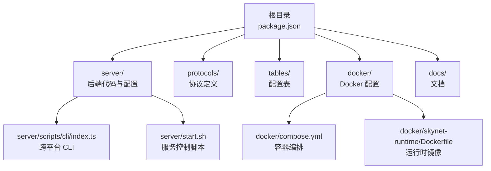
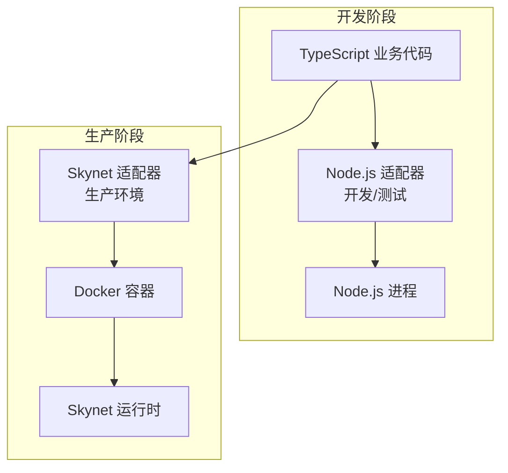
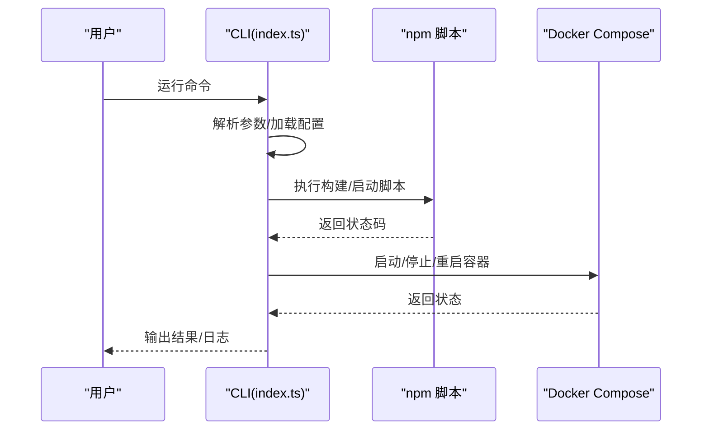
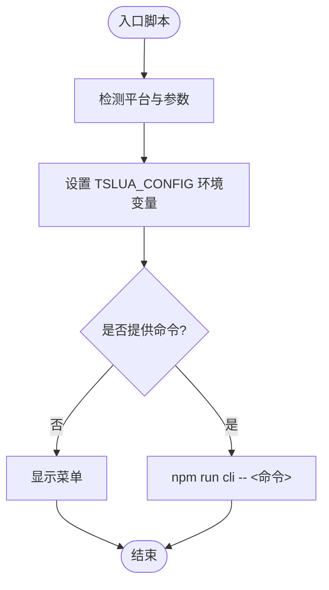
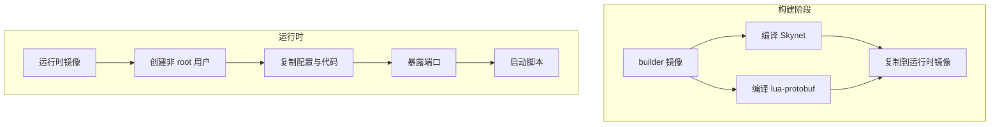
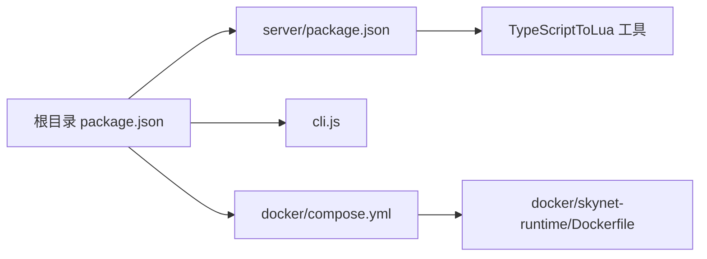

# 快速开始

<cite>
**本文引用的文件**
- [README.md](file://README.md)
- [docs/快速开始.md](file://docs/快速开始.md)
- [docs/CLI_USAGE.md](file://docs/CLI_USAGE.md)
- [docs/首次启动指南.md](file://docs/首次启动指南.md)
- [package.json](file://package.json)
- [server/package.json](file://server/package.json)
- [cli.js](file://cli.js)
- [server/scripts/cli/index.ts](file://server/scripts/cli/index.ts)
- [start.sh](file://start.sh)
- [start.ps1](file://start.ps1)
- [start.bat](file://start.bat)
- [docker/compose.yml](file://docker/compose.yml)
- [docker/skynet-runtime/Dockerfile](file://docker/skynet-runtime/Dockerfile)
- [tslua.config.yaml](file://tslua.config.yaml)
</cite>

## 目录
1. [简介](#简介)
2. [项目结构](#项目结构)
3. [核心组件](#核心组件)
4. [架构总览](#架构总览)
5. [详细组件分析](#详细组件分析)
6. [依赖分析](#依赖分析)
7. [性能考虑](#性能考虑)
8. [故障排除指南](#故障排除指南)
9. [结论](#结论)
10. [附录](#附录)

## 简介
本指南面向新用户，帮助你在30分钟内成功运行第一个 TS-Skynet 服务。内容涵盖：
- 跨平台环境安装（Windows、Linux、macOS）
- 依赖安装与版本要求
- 多种启动方式（跨平台 CLI、入口脚本、Docker 容器化）
- 常用命令速查与完整命令列表
- 实际命令示例与预期输出
- 常见问题与环境配置建议

## 项目结构
TS-Skynet 采用多工作区结构，核心目录与职责如下：
- server：TypeScript 后端源码、编译输出、运行时适配
- protocols：Protocol Buffers 协议定义与构建脚本
- tables：Luban 配置表定义与构建脚本
- docker：Docker 镜像与容器编排配置
- docs：官方文档与使用指南
- 根目录：跨平台 CLI 入口与顶层脚本

**图表来源**
- [package.json:11-37](file://package.json#L11-L37)
- [server/package.json:6-26](file://server/package.json#L6-L26)
- [docker/compose.yml:6-63](file://docker/compose.yml#L6-L63)
- [docker/skynet-runtime/Dockerfile:7-91](file://docker/skynet-runtime/Dockerfile#L7-L91)

**章节来源**
- [README.md:136-193](file://README.md#L136-L193)
- [package.json:6-10](file://package.json#L6-L10)

## 核心组件
- 跨平台 CLI：统一的命令入口，支持 Windows/Linux/macOS，提供菜单、一键启动、编译、启动、停止、状态、日志、热更新等功能。
- 入口脚本：start.sh（Linux/macOS）、start.ps1（PowerShell）、start.bat（CMD），均调用 CLI 实现一致命令体验。
- Docker 容器：通过 docker-compose 编排 Skynet 运行时，支持开发与生产两种模式，代码通过卷挂载或镜像内置方式部署。

**章节来源**
- [server/scripts/cli/index.ts:301-354](file://server/scripts/cli/index.ts#L301-L354)
- [start.sh:1-66](file://start.sh#L1-L66)
- [start.ps1:1-36](file://start.ps1#L1-L36)
- [start.bat:1-39](file://start.bat#L1-L39)
- [docker/compose.yml:6-63](file://docker/compose.yml#L6-L63)

## 架构总览
TS-Skynet 的运行时分为三层：
- TypeScript 层：业务逻辑与抽象接口
- 适配层：Node.js 适配器（开发/测试）与 Skynet 适配器（生产）
- Skynet 运行时：容器化部署，加载编译后的 Lua 代码

**图表来源**
- [README.md:111-134](file://README.md#L111-L134)
- [server/scripts/cli/index.ts:648-651](file://server/scripts/cli/index.ts#L648-L651)
- [docker/compose.yml:6-63](file://docker/compose.yml#L6-L63)

## 详细组件分析

### 跨平台 CLI 组件
- 功能：菜单交互、一键启动、编译 TS→Lua、启动/停止/重启服务、查看状态/日志、热更新、开发模式、环境初始化、清理构建产物。
- 路径解析：支持命令行参数与配置文件（YAML/JSON），默认读取项目根目录的 tslua.config.yaml。
- 执行机制：通过 Node.js child_process 跨平台执行命令，自动检测 tsx/ts-node/npx 等运行器。

**图表来源**
- [server/scripts/cli/index.ts:710-745](file://server/scripts/cli/index.ts#L710-L745)
- [server/scripts/cli/index.ts:427-496](file://server/scripts/cli/index.ts#L427-L496)
- [server/scripts/cli/index.ts:498-526](file://server/scripts/cli/index.ts#L498-L526)
- [docker/compose.yml:6-63](file://docker/compose.yml#L6-L63)

**章节来源**
- [server/scripts/cli/index.ts:301-354](file://server/scripts/cli/index.ts#L301-L354)
- [server/scripts/cli/index.ts:427-496](file://server/scripts/cli/index.ts#L427-L496)
- [server/scripts/cli/index.ts:498-526](file://server/scripts/cli/index.ts#L498-L526)
- [server/scripts/cli/index.ts:648-651](file://server/scripts/cli/index.ts#L648-L651)
- [server/scripts/cli/index.ts:653-692](file://server/scripts/cli/index.ts#L653-L692)
- [server/scripts/cli/index.ts:694-707](file://server/scripts/cli/index.ts#L694-L707)

### 入口脚本组件
- start.sh（Linux/macOS）：调用 npm run cli，提供菜单与常用命令别名。
- start.ps1（PowerShell）：设置环境变量 TSLUA_CONFIG，支持传入配置文件路径。
- start.bat（CMD）：设置环境变量 TSLUA_CONFIG，支持传入配置文件路径。

**图表来源**
- [start.sh:5-6](file://start.sh#L5-L6)
- [start.ps1:17-35](file://start.ps1#L17-L35)
- [start.bat:18-38](file://start.bat#L18-L38)

**章节来源**
- [start.sh:1-66](file://start.sh#L1-L66)
- [start.ps1:1-36](file://start.ps1#L1-L36)
- [start.bat:1-39](file://start.bat#L1-L39)

### Docker 容器组件
- compose.yml：定义开发（skynet-dev）与生产（skynet）两个服务，端口映射、卷挂载、网络与日志卷。
- Dockerfile：分阶段构建，先在 builder 镜像中编译 Skynet 与 lua-protobuf，再拷贝到运行时镜像，仅保留必要运行时依赖。
- 运行时：容器启动时加载配置文件，非 root 用户运行。

**图表来源**
- [docker/skynet-runtime/Dockerfile:7-91](file://docker/skynet-runtime/Dockerfile#L7-L91)
- [docker/compose.yml:6-63](file://docker/compose.yml#L6-L63)

**章节来源**
- [docker/compose.yml:6-63](file://docker/compose.yml#L6-L63)
- [docker/skynet-runtime/Dockerfile:7-91](file://docker/skynet-runtime/Dockerfile#L7-L91)

## 依赖分析
- Node.js 与 npm：根目录与 server 目录均需安装依赖；CLI 自动检测 tsx/ts-node/npx。
- TypeScriptToLua：通过本地工具路径引用，确保编译 Lua 的一致性。
- Docker：compose.yml 与 Dockerfile 定义了完整的运行时环境。

**图表来源**
- [package.json:11-37](file://package.json#L11-L37)
- [server/package.json:48-48](file://server/package.json#L48-L48)
- [cli.js:15-43](file://cli.js#L15-L43)
- [docker/compose.yml:6-63](file://docker/compose.yml#L6-L63)
- [docker/skynet-runtime/Dockerfile:7-91](file://docker/skynet-runtime/Dockerfile#L7-L91)

**章节来源**
- [package.json:11-37](file://package.json#L11-L37)
- [server/package.json:36-49](file://server/package.json#L36-L49)
- [cli.js:15-43](file://cli.js#L15-L43)

## 性能考虑
- 开发模式优先：使用 Node.js 适配器进行快速迭代与调试。
- 生产模式优化：通过 Docker 镜像内置 Lua 代码，减少启动时的 I/O 开销。
- 热更新：仅重新编译并复制 Lua 文件到容器，避免重启整个服务。

[本节为通用指导，无需特定文件来源]

## 故障排除指南
常见问题与解决方案：
- 命令未找到：确保已安装根目录与 server 目录依赖。
- Docker 命令失败：确认 Docker Desktop 已启动。
- Windows PowerShell 执行策略：调整执行策略或改用 CMD。

**章节来源**
- [docs/CLI_USAGE.md:133-154](file://docs/CLI_USAGE.md#L133-L154)
- [docs/首次启动指南.md:111-133](file://docs/首次启动指南.md#L111-L133)

## 结论
通过本指南，你可以在任意平台（Windows、Linux、macOS）上完成 TS-Skynet 的环境准备、依赖安装与服务启动，并掌握跨平台 CLI、入口脚本与 Docker 的多种启动方式。建议先使用 npm run quick 一键启动，随后根据需要切换到开发模式或容器化部署。

[本节为总结性内容，无需特定文件来源]

## 附录

### 环境安装步骤（跨平台）
- 安装根目录依赖与 server 目录依赖。
- 确保 Node.js 与 npm 版本满足要求。
- 如需容器化部署，确保 Docker Desktop 已安装并启动。

**章节来源**
- [docs/首次启动指南.md:5-13](file://docs/首次启动指南.md#L5-L13)
- [docs/CLI_USAGE.md:121-131](file://docs/CLI_USAGE.md#L121-L131)

### 启动方式与命令速查
- 跨平台 CLI（推荐）：npm run menu、npm run quick、npm run dev、npm run build:ts、npm run server:start、npm run server:stop、npm run server:status、npm run server:logs、npm run hotfix、npm run setup、npm run clean。
- 入口脚本：start.sh（Linux/macOS）、start.ps1（PowerShell）、start.bat（CMD）。
- Docker：docker-compose build/start/stop/logs。

**章节来源**
- [README.md:17-92](file://README.md#L17-L92)
- [docs/CLI_USAGE.md:17-31](file://docs/CLI_USAGE.md#L17-L31)
- [docs/CLI_USAGE.md:50-74](file://docs/CLI_USAGE.md#L50-L74)
- [docs/首次启动指南.md:15-68](file://docs/首次启动指南.md#L15-L68)

### 常用命令示例与预期输出
- 一键启动：npm run quick，预期输出包含“智能启动”、“编译完成”、“容器创建并启动成功”等信息。
- 查看状态：npm run server:status，预期输出包含容器状态与端口映射。
- 查看日志：npm run server:logs，预期输出包含最近日志条目。

**章节来源**
- [docs/CLI_USAGE.md:7-13](file://docs/CLI_USAGE.md#L7-L13)
- [docs/CLI_USAGE.md:40-48](file://docs/CLI_USAGE.md#L40-L48)
- [docs/首次启动指南.md:30-34](file://docs/首次启动指南.md#L30-L34)

### 配置文件与路径
- 默认配置文件：tslua.config.yaml，支持自定义 server、docker、protocols、tables 路径，以及构建与 Docker 相关配置。
- CLI 支持命令行参数覆盖配置文件中的路径设置。

**章节来源**
- [tslua.config.yaml:10-44](file://tslua.config.yaml#L10-L44)
- [server/scripts/cli/index.ts:227-242](file://server/scripts/cli/index.ts#L227-L242)