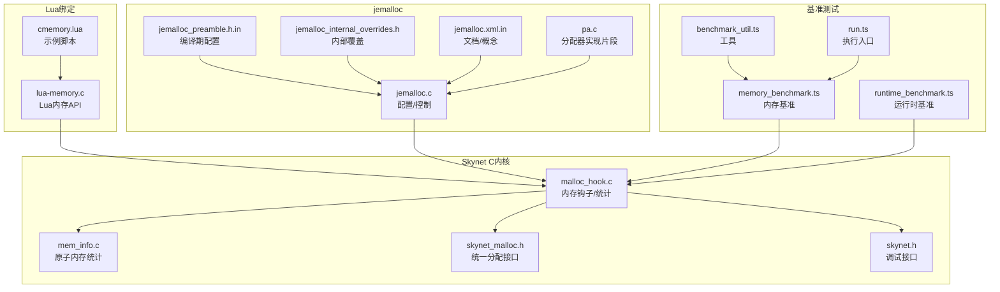
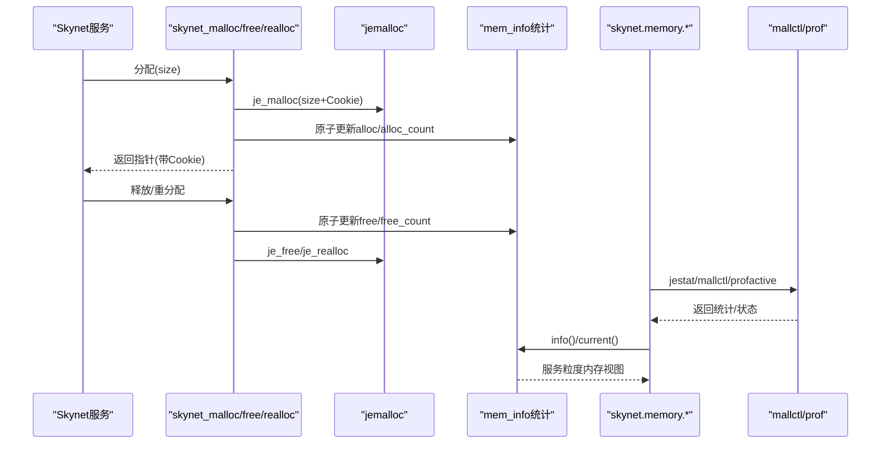
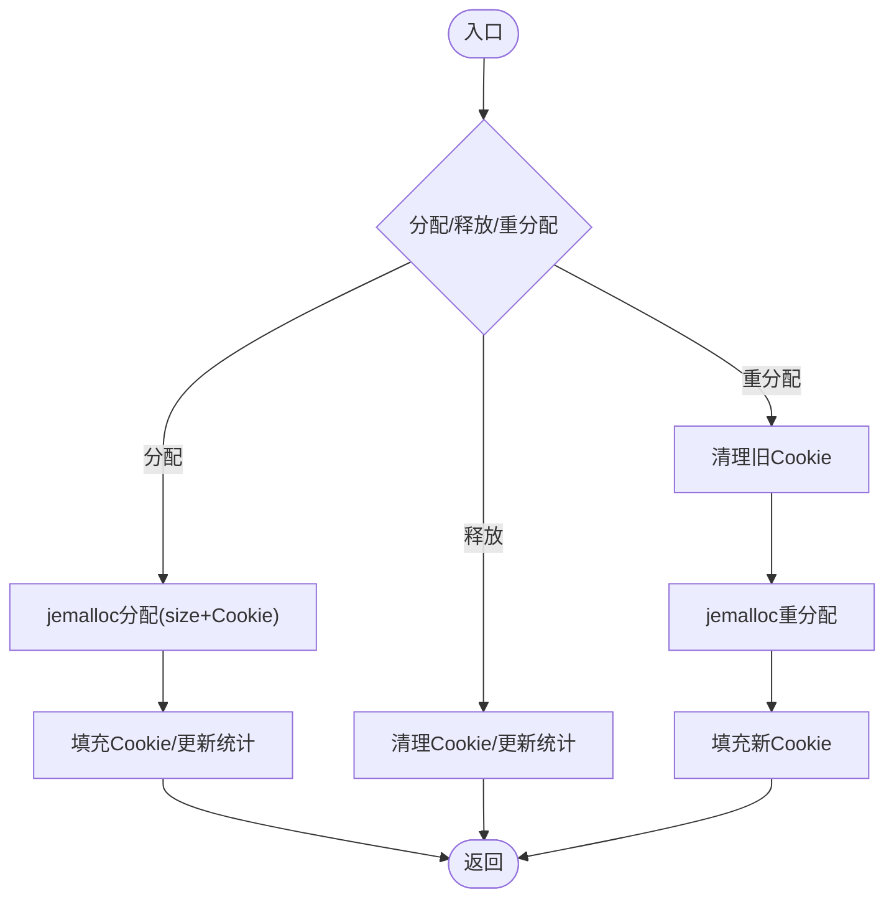
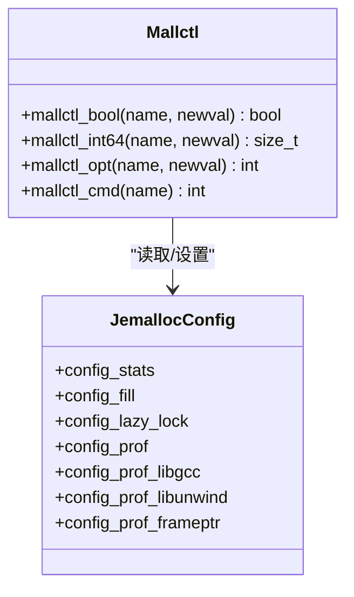
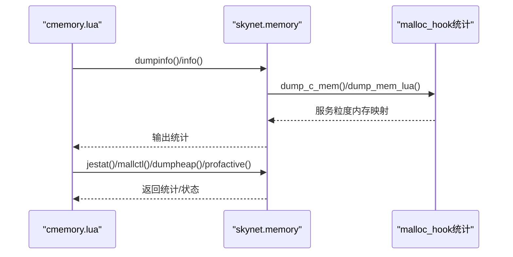
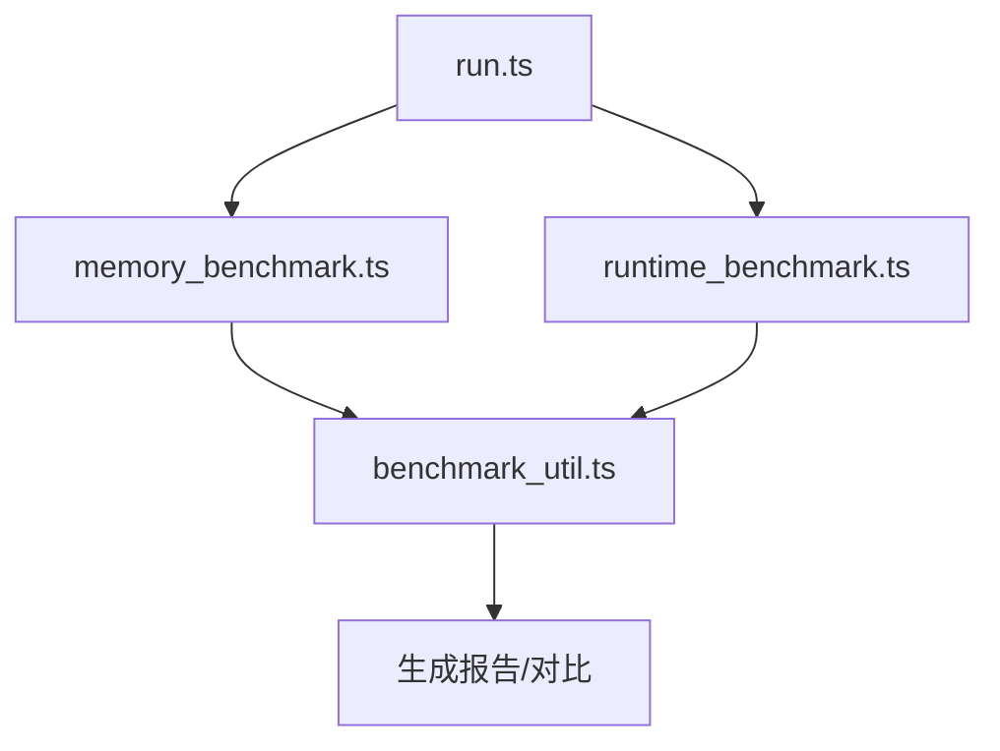
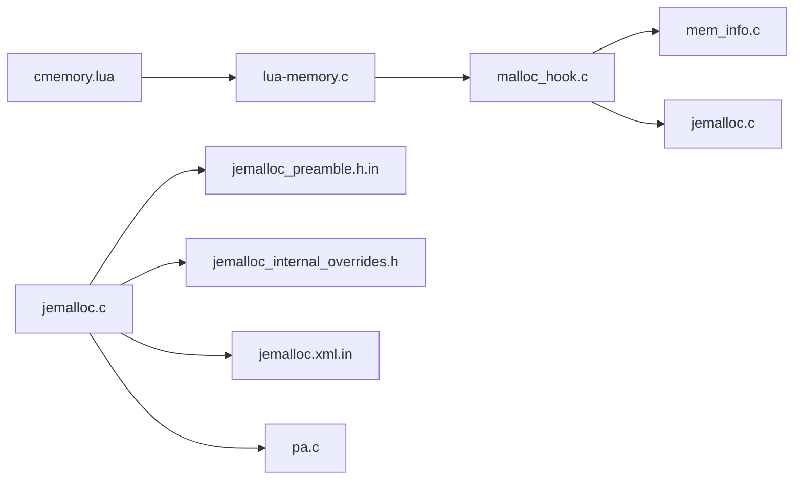

# 内存管理优化

<cite>
**本文引用的文件**
- [malloc_hook.c](file://docker/skynet/skynet-src/malloc_hook.c)
- [malloc_hook.h](file://docker/skynet/skynet-src/malloc_hook.h)
- [mem_info.c](file://docker/skynet/skynet-src/mem_info.c)
- [mem_info.h](file://docker/skynet/skynet-src/mem_info.h)
- [lua-memory.c](file://docker/skynet/lualib-src/lua-memory.c)
- [cmemory.lua](file://docker/skynet/service/cmemory.lua)
- [skynet.h](file://docker/skynet/skynet-src/skynet.h)
- [skynet_malloc.h](file://docker/skynet/skynet-src/skynet_malloc.h)
- [jemalloc.c](file://docker/skynet/3rd/jemalloc/src/jemalloc.c)
- [jemalloc_preamble.h.in](file://docker/skynet/3rd/jemalloc/include/jemalloc/internal/jemalloc_preamble.h.in)
- [jemalloc_internal_overrides.h](file://docker/skynet/3rd/jemalloc/include/jemalloc/internal/jemalloc_internal_overrides.h)
- [jemalloc.xml.in](file://docker/skynet/3rd/jemalloc/doc/jemalloc.xml.in)
- [pa.c](file://docker/skynet/3rd/jemalloc/src/pa.c)
- [benchmark/memory_benchmark.ts](file://tool/TypeScriptToLua_skynet/benchmark/src/memory_benchmarks/memory_benchmark.ts)
- [benchmark/memory_benchmarks/memory_benchmark.ts](file://tool/TypeScriptToLua_skynet/benchmark/src/memory_benchmarks/memory_benchmark.ts)
- [benchmark/runtime_benchmarks/runtime_benchmark.ts](file://tool/TypeScriptToLua_skynet/benchmark/src/runtime_benchmarks/runtime_benchmark.ts)
- [benchmark/benchmark_util.ts](file://tool/TypeScriptToLua_skynet/benchmark/src/benchmark_util.ts)
- [benchmark/run.ts](file://tool/TypeScriptToLua_skynet/benchmark/src/run.ts)
- [benchmark/tsconfig.json](file://tool/TypeScriptToLua_skynet/benchmark/tsconfig.json)
</cite>

## 目录
1. [引言](#引言)
2. [项目结构](#项目结构)
3. [核心组件](#核心组件)
4. [架构总览](#架构总览)
5. [详细组件分析](#详细组件分析)
6. [依赖关系分析](#依赖关系分析)
7. [性能考量](#性能考量)
8. [故障排查指南](#故障排查指南)
9. [结论](#结论)
10. [附录](#附录)

## 引言
本指南聚焦于TypeScriptToLua转译后在Skynet/Lua环境中的内存管理优化，系统阐述对象生命周期、垃圾回收机制、内存泄漏预防、jemalloc分配器的优化策略与配置、以及面向高性能场景的实践（对象池、循环引用处理、大对象管理）。同时提供内存监控工具链与性能分析方法，并给出常见问题的诊断与解决路径。

## 项目结构
围绕内存管理的关键模块分布如下：
- C层内存钩子与统计：malloc_hook.c、mem_info.c、skynet_malloc.h、skynet.h
- Lua层内存接口：lua-memory.c、cmemory.lua
- jemalloc集成与配置：jemalloc.c、jemalloc_preamble.h.in、jemalloc_internal_overrides.h、jemalloc.xml.in、pa.c
- TypeScriptToLua基准测试：benchmark目录下的内存与运行时基准

**图表来源**
- [malloc_hook.c:1-382](file://docker/skynet/skynet-src/malloc_hook.c#L1-L382)
- [mem_info.c:1-60](file://docker/skynet/skynet-src/mem_info.c#L1-L60)
- [skynet_malloc.h:1-24](file://docker/skynet/skynet-src/skynet_malloc.h#L1-L24)
- [skynet.h:1-45](file://docker/skynet/skynet-src/skynet.h#L1-L45)
- [lua-memory.c:1-117](file://docker/skynet/lualib-src/lua-memory.c#L1-L117)
- [cmemory.lua:1-15](file://docker/skynet/service/cmemory.lua#L1-L15)
- [jemalloc.c:28-1735](file://docker/skynet/3rd/jemalloc/src/jemalloc.c#L28-L1735)
- [jemalloc_preamble.h.in:69-152](file://docker/skynet/3rd/jemalloc/include/jemalloc/internal/jemalloc_preamble.h.in#L69-L152)
- [jemalloc_internal_overrides.h:1-21](file://docker/skynet/3rd/jemalloc/include/jemalloc/internal/jemalloc_internal_overrides.h#L1-L21)
- [jemalloc.xml.in:565-588](file://docker/skynet/3rd/jemalloc/doc/jemalloc.xml.in#L565-L588)
- [pa.c:115-154](file://docker/skynet/3rd/jemalloc/src/pa.c#L115-L154)
- [benchmark/memory_benchmark.ts](file://tool/TypeScriptToLua_skynet/benchmark/src/memory_benchmarks/memory_benchmark.ts)
- [benchmark/runtime_benchmark.ts](file://tool/TypeScriptToLua_skynet/benchmark/src/runtime_benchmarks/runtime_benchmark.ts)
- [benchmark/benchmark_util.ts](file://tool/TypeScriptToLua_skynet/benchmark/src/benchmark_util.ts)
- [benchmark/run.ts](file://tool/TypeScriptToLua_skynet/benchmark/src/run.ts)

**章节来源**
- [malloc_hook.c:1-382](file://docker/skynet/skynet-src/malloc_hook.c#L1-L382)
- [lua-memory.c:1-117](file://docker/skynet/lualib-src/lua-memory.c#L1-L117)
- [jemalloc.c:28-1735](file://docker/skynet/3rd/jemalloc/src/jemalloc.c#L28-L1735)

## 核心组件
- 内存钩子与统计
  - 统一的分配/释放接口封装，注入Cookie前缀以追踪来源服务句柄，支持原子统计与服务粒度内存快照。
  - 提供总使用量、块数、当前服务内存、统计导出、jemalloc mallctl访问等能力。
- jemalloc集成
  - 通过mallctl系列接口读取/设置统计与配置；支持prof.dump堆转储与prof.active开关。
- Lua内存接口
  - 暴露total/block/current/info/dump/jestat/mallctl等API，便于脚本侧观测与诊断。
- 基准测试
  - 提供内存与运行时基准，用于评估转译后代码的内存占用与分配热点。

**章节来源**
- [malloc_hook.c:173-244](file://docker/skynet/skynet-src/malloc_hook.c#L173-L244)
- [malloc_hook.h:10-19](file://docker/skynet/skynet-src/malloc_hook.h#L10-L19)
- [lua-memory.c:95-116](file://docker/skynet/lualib-src/lua-memory.c#L95-L116)
- [cmemory.lua:1-15](file://docker/skynet/service/cmemory.lua#L1-L15)
- [jemalloc.c:28-1735](file://docker/skynet/3rd/jemalloc/src/jemalloc.c#L28-L1735)

## 架构总览
下图展示从Skynet服务发起内存分配，到jemalloc底层分配、再到统计与Lua可观测性的完整链路。

**图表来源**
- [malloc_hook.c:173-244](file://docker/skynet/skynet-src/malloc_hook.c#L173-L244)
- [mem_info.c:18-40](file://docker/skynet/skynet-src/mem_info.c#L18-L40)
- [lua-memory.c:35-93](file://docker/skynet/lualib-src/lua-memory.c#L35-L93)
- [jemalloc.c:28-1735](file://docker/skynet/3rd/jemalloc/src/jemalloc.c#L28-L1735)

## 详细组件分析

### 组件A：内存钩子与统计（malloc_hook）
- 设计要点
  - Cookie前缀：在用户内存前后附加元信息（大小、服务句柄、cookie长度），用于释放校验与统计。
  - 哈希槽位：按服务句柄低位映射到固定大小槽位，原子更新统计，避免全局锁争用。
  - 原子统计：MemInfo/AtomicMemInfo分离alloc/free计数，按缓存行对齐，降低伪共享。
  - OOM处理：失败时记录并终止，避免悬挂状态。
- 关键流程
  - 分配：调用jemalloc并填充前缀；更新统计。
  - 释放：清理前缀、回填服务句柄、更新统计。
  - 重分配：先清理旧前缀，再调用realloc，最后填充新前缀。
- 服务粒度观测
  - 支持dump_c_mem输出各服务使用量，或通过Lua接口返回映射表。

**图表来源**
- [malloc_hook.c:71-109](file://docker/skynet/skynet-src/malloc_hook.c#L71-L109)
- [malloc_hook.c:173-244](file://docker/skynet/skynet-src/malloc_hook.c#L173-L244)

**章节来源**
- [malloc_hook.c:19-116](file://docker/skynet/skynet-src/malloc_hook.c#L19-L116)
- [mem_info.c:18-40](file://docker/skynet/skynet-src/mem_info.c#L18-L40)
- [mem_info.h:9-28](file://docker/skynet/skynet-src/mem_info.h#L9-L28)

### 组件B：jemalloc集成与配置
- mallctl接口族
  - bool/int64/cmd类型mallctl封装，支持读取/设置配置与触发命令（如prof.dump）。
- 配置项与特性
  - 通过jemalloc_preamble.h.in与jemalloc_internal_overrides.h暴露编译期/运行期配置宏，支持统计、填充、lazy_lock、profiling等。
- 文档与概念
  - jemalloc.xml.in描述了small/large对象分类、slab/extent模型、页面/量子对齐、以及多线程下的缓存行共享注意事项。

**图表来源**
- [malloc_hook.c:123-169](file://docker/skynet/skynet-src/malloc_hook.c#L123-L169)
- [jemalloc.c:28-1735](file://docker/skynet/3rd/jemalloc/src/jemalloc.c#L28-L1735)
- [jemalloc_preamble.h.in:69-152](file://docker/skynet/3rd/jemalloc/include/jemalloc/internal/jemalloc_preamble.h.in#L69-L152)
- [jemalloc_internal_overrides.h:1-21](file://docker/skynet/3rd/jemalloc/include/jemalloc/internal/jemalloc_internal_overrides.h#L1-L21)

**章节来源**
- [malloc_hook.c:123-169](file://docker/skynet/skynet-src/malloc_hook.c#L123-L169)
- [jemalloc.c:28-1735](file://docker/skynet/3rd/jemalloc/src/jemalloc.c#L28-L1735)
- [jemalloc_preamble.h.in:69-152](file://docker/skynet/3rd/jemalloc/include/jemalloc/internal/jemalloc_preamble.h.in#L69-L152)
- [jemalloc.xml.in:565-588](file://docker/skynet/3rd/jemalloc/doc/jemalloc.xml.in#L565-L588)

### 组件C：Lua内存观测接口
- 暴露API
  - total/block/current/info/dump/jestat/mallctl/dumpheap/profactive等。
- 使用方式
  - cmemory.lua演示如何打印各服务内存、总内存与块数，便于快速定位异常增长。

**图表来源**
- [cmemory.lua:1-15](file://docker/skynet/service/cmemory.lua#L1-L15)
- [lua-memory.c:95-116](file://docker/skynet/lualib-src/lua-memory.c#L95-L116)
- [malloc_hook.c:309-361](file://docker/skynet/skynet-src/malloc_hook.c#L309-L361)

**章节来源**
- [lua-memory.c:1-117](file://docker/skynet/lualib-src/lua-memory.c#L1-L117)
- [cmemory.lua:1-15](file://docker/skynet/service/cmemory.lua#L1-L15)

### 组件D：基准测试与性能分析
- 内存基准
  - memory_benchmark.ts定义了内存相关基准，结合benchmark_util.ts进行测量与报告。
- 运行时基准
  - runtime_benchmark.ts关注运行时开销，辅助评估转译后代码的分配模式与GC压力。
- 执行入口
  - run.ts协调基准执行，tsconfig.json确保编译配置正确。

**图表来源**
- [benchmark/run.ts](file://tool/TypeScriptToLua_skynet/benchmark/src/run.ts)
- [benchmark/memory_benchmark.ts](file://tool/TypeScriptToLua_skynet/benchmark/src/memory_benchmarks/memory_benchmark.ts)
- [benchmark/runtime_benchmark.ts](file://tool/TypeScriptToLua_skynet/benchmark/src/runtime_benchmarks/runtime_benchmark.ts)
- [benchmark/benchmark_util.ts](file://tool/TypeScriptToLua_skynet/benchmark/src/benchmark_util.ts)
- [benchmark/tsconfig.json](file://tool/TypeScriptToLua_skynet/benchmark/tsconfig.json)

**章节来源**
- [benchmark/run.ts](file://tool/TypeScriptToLua_skynet/benchmark/src/run.ts)
- [benchmark/memory_benchmark.ts](file://tool/TypeScriptToLua_skynet/benchmark/src/memory_benchmarks/memory_benchmark.ts)
- [benchmark/runtime_benchmark.ts](file://tool/TypeScriptToLua_skynet/benchmark/src/runtime_benchmarks/runtime_benchmark.ts)
- [benchmark/benchmark_util.ts](file://tool/TypeScriptToLua_skynet/benchmark/src/benchmark_util.ts)
- [benchmark/tsconfig.json](file://tool/TypeScriptToLua_skynet/benchmark/tsconfig.json)

## 依赖关系分析
- 内存钩子依赖jemalloc作为后端分配器，并通过mallctl接口与其交互。
- mem_info提供原子统计结构，被malloc_hook用于服务粒度统计。
- Lua内存模块依赖C层接口，提供统一观测入口。
- jemalloc内部实现（如pa.c）负责extent/slab管理与分配策略。

**图表来源**
- [malloc_hook.c:1-382](file://docker/skynet/skynet-src/malloc_hook.c#L1-L382)
- [mem_info.c:1-60](file://docker/skynet/skynet-src/mem_info.c#L1-L60)
- [lua-memory.c:1-117](file://docker/skynet/lualib-src/lua-memory.c#L1-L117)
- [cmemory.lua:1-15](file://docker/skynet/service/cmemory.lua#L1-L15)
- [jemalloc.c:28-1735](file://docker/skynet/3rd/jemalloc/src/jemalloc.c#L28-L1735)
- [jemalloc_preamble.h.in:69-152](file://docker/skynet/3rd/jemalloc/include/jemalloc/internal/jemalloc_preamble.h.in#L69-L152)
- [jemalloc_internal_overrides.h:1-21](file://docker/skynet/3rd/jemalloc/include/jemalloc/internal/jemalloc_internal_overrides.h#L1-L21)
- [jemalloc.xml.in:565-588](file://docker/skynet/3rd/jemalloc/doc/jemalloc.xml.in#L565-L588)
- [pa.c:115-154](file://docker/skynet/3rd/jemalloc/src/pa.c#L115-L154)

**章节来源**
- [malloc_hook.c:1-382](file://docker/skynet/skynet-src/malloc_hook.c#L1-L382)
- [lua-memory.c:1-117](file://docker/skynet/lualib-src/lua-memory.c#L1-L117)
- [jemalloc.c:28-1735](file://docker/skynet/3rd/jemalloc/src/jemalloc.c#L28-L1735)

## 性能考量
- 小对象分配
  - 利用jemalloc的slab与size class减少碎片；注意缓存行对齐，避免跨行争用。
- 大对象管理
  - large对象独立extent，避免slab紧凑布局带来的伪共享；必要时考虑内存池化。
- 分配器选择
  - 在多线程高并发场景，jemalloc的线程本地缓存与后台合并可显著降低锁竞争。
- 统计与采样
  - 使用jestat与mallctl观察活跃/保留/映射内存，结合prof.dump进行热点定位。
- 基准驱动优化
  - 通过memory_benchmark.ts与runtime_benchmark.ts持续验证优化效果，识别新增分配热点。

[本节为通用指导，无需特定文件来源]

## 故障排查指南
- 内存泄漏定位
  - 使用cmemory.lua打印服务粒度内存，结合dump_c_mem输出定位异常增长的服务。
  - 通过lua-memory.c提供的info/current/total/block接口进行交叉验证。
- OOM与重分配
  - 若出现OOM，检查分配路径与Cookie一致性；确认重分配流程是否正确清理旧前缀。
- jemalloc配置
  - 使用mallctl查询/设置统计与profiling开关；必要时触发prof.dump收集堆信息。
- 调试辅助
  - 使用skynet_debug_memory输出当前服务内存，配合日志定位问题。

**章节来源**
- [cmemory.lua:1-15](file://docker/skynet/service/cmemory.lua#L1-L15)
- [lua-memory.c:95-116](file://docker/skynet/lualib-src/lua-memory.c#L95-L116)
- [malloc_hook.c:111-116](file://docker/skynet/skynet-src/malloc_hook.c#L111-L116)
- [malloc_hook.c:309-326](file://docker/skynet/skynet-src/malloc_hook.c#L309-L326)
- [skynet.h:40-42](file://docker/skynet/skynet-src/skynet.h#L40-L42)

## 结论
通过统一的内存钩子、原子统计与jemalloc深度集成，本项目实现了服务粒度的内存可观测性与可控性。结合Lua侧API与基准测试体系，可在TypeScriptToLua转译后环境中系统地识别与缓解内存问题，提升整体稳定性与性能。

[本节为总结，无需特定文件来源]

## 附录
- jemalloc配置建议（基于源码暴露的宏与mallctl）
  - 开启统计与profiling以支持运行时分析。
  - 根据工作负载调整lazy_lock与填充策略，权衡CPU与内存安全。
- 对象池与循环引用
  - 对频繁创建/销毁的小对象采用对象池；对Lua侧长生命周期对象，避免相互引用导致的GC延迟，必要时显式解除强引用。
- 大对象与内存池
  - 大对象优先考虑复用与池化，减少jemalloc后台合并压力；对临时缓冲区使用栈式或局部池化策略。

[本节为通用指导，无需特定文件来源]