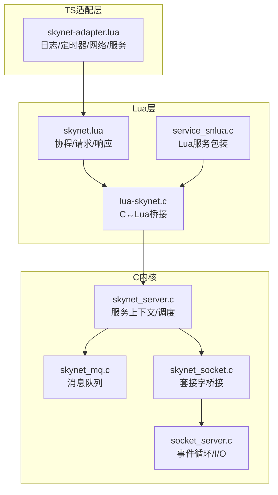
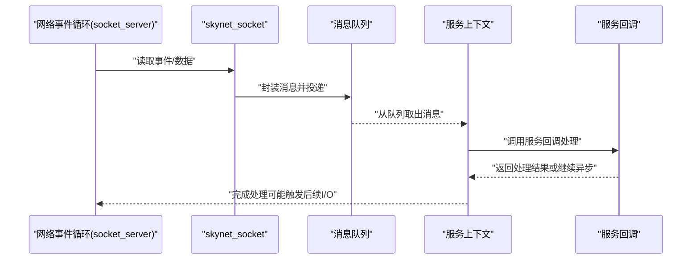
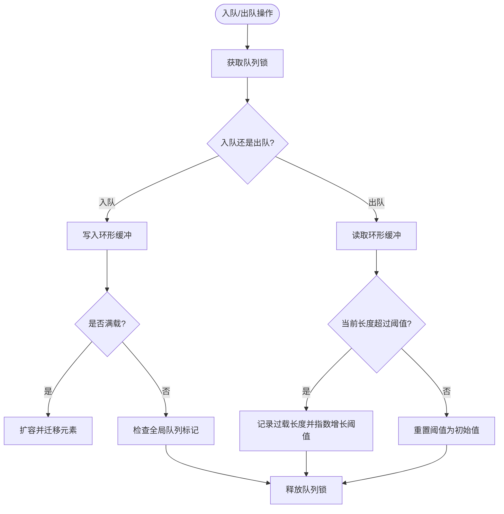
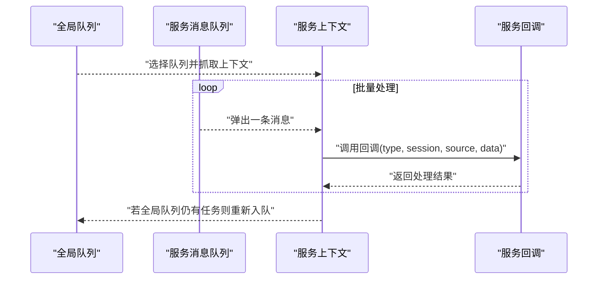
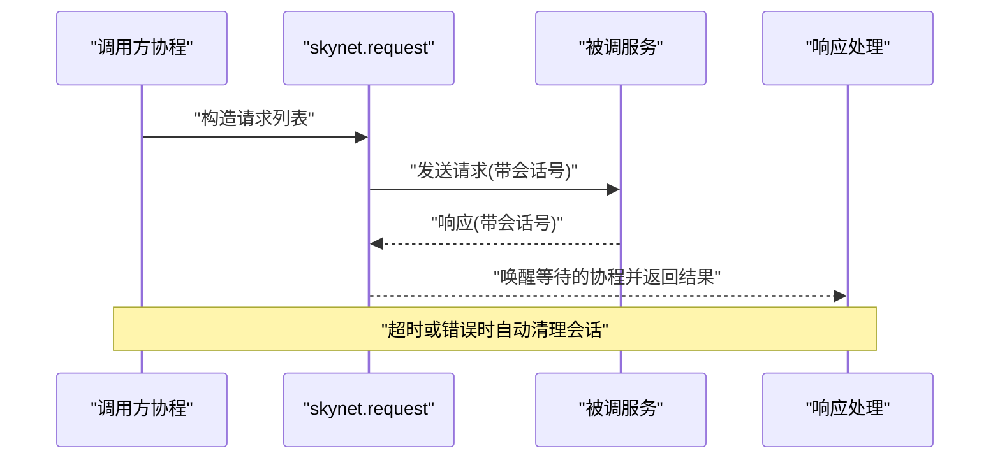
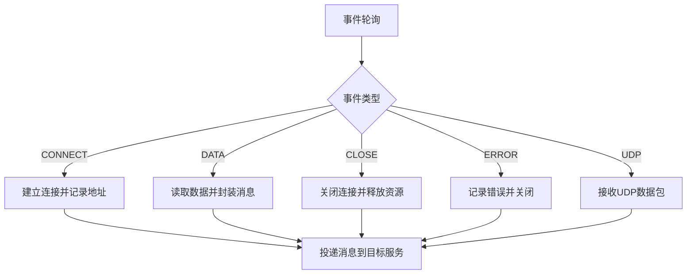
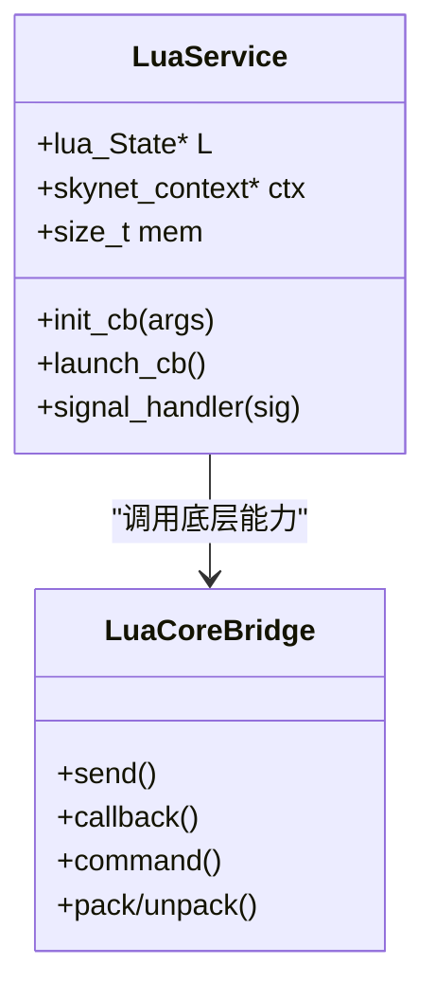
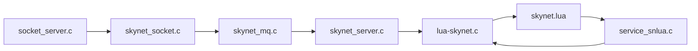

# 并发性能优化

<cite>
**本文档引用的文件**
- [skynet_server.c](file://docker\skynet\skynet-src\skynet_server.c)
- [skynet_mq.c](file://docker\skynet\skynet-src\skynet_mq.c)
- [skynet.lua](file://docker\skynet\lualib\skynet.lua)
- [service_snlua.c](file://docker\skynet\service-src\service_snlua.c)
- [lua-skynet.c](file://docker\skynet\lualib-src\lua-skynet.c)
- [skynet_socket.c](file://docker\skynet\skynet-src\skynet_socket.c)
- [socket_server.c](file://docker\skynet\skynet-src\socket_server.c)
- [skynet-adapter.lua](file://docker\lua\framework\runtime\skynet-adapter.lua)
- [testcoroutine.lua](file://docker\skynet\test\testcoroutine.lua)
- [README.md](file://docker\skynet\README.md)
</cite>

## 目录
1. [引言](#引言)
2. [项目结构](#项目结构)
3. [核心组件](#核心组件)
4. [架构总览](#架构总览)
5. [详细组件分析](#详细组件分析)
6. [依赖关系分析](#依赖关系分析)
7. [性能考量](#性能考量)
8. [故障排查指南](#故障排查指南)
9. [结论](#结论)
10. [附录](#附录)

## 引言
本指南聚焦于Skynet Actor模型的并发性能优化，系统阐述其协程调度机制、消息队列优化与锁竞争规避策略，并结合代码级实现给出可操作的最佳实践。内容覆盖非阻塞I/O、异步处理、资源共享、多并发模式对比、性能测试与瓶颈分析方法，以及实际优化案例与效果评估路径。

## 项目结构
Skynet采用C核心+Lua服务层的分层架构：C层提供高性能内核（上下文管理、消息队列、网络I/O、计时器），Lua层提供Actor服务与异步编程接口。关键目录与职责如下：
- skynet-src：C内核实现（服务上下文、消息队列、网络子系统）
- lualib：Skynet Lua标准库（协程、请求/响应、定时器、日志等）
- lualib-src：C扩展绑定（Lua与C之间的桥接）
- service-src：具体服务实现（如Lua服务包装器）
- lua/framework/runtime：TypeScript到Lua的适配层（运行时、网络、定时器）

**图表来源**
- [skynet_server.c](file://docker\skynet\skynet-src\skynet_server.c)
- [skynet_mq.c](file://docker\skynet\skynet-src\skynet_mq.c)
- [skynet.lua](file://docker\skynet\lualib\skynet.lua)
- [lua-skynet.c](file://docker\skynet\lualib-src\lua-skynet.c)
- [service_snlua.c](file://docker\skynet\service-src\service_snlua.c)
- [skynet_socket.c](file://docker\skynet\skynet-src\skynet_socket.c)
- [socket_server.c](file://docker\skynet\skynet-src\socket_server.c)
- [skynet-adapter.lua](file://docker\lua\framework\runtime\skynet-adapter.lua)

**章节来源**
- [README.md](file://docker\skynet\README.md)

## 核心组件
- 服务上下文与调度：负责服务生命周期、回调注册、消息派发与CPU统计
- 消息队列：每个服务拥有独立环形缓冲队列，支持全局队列聚合与过载检测
- 协程与异步：Lua层提供协程池复用、请求/响应、超时与等待机制
- 网络子系统：事件驱动I/O，将网络事件转换为消息投递至目标服务
- C↔Lua桥接：提供底层能力（发送、回调、命令、序列化）给Lua使用

**章节来源**
- [skynet_server.c](file://docker\skynet\skynet-src\skynet_server.c)
- [skynet_mq.c](file://docker\skynet\skynet-src\skynet_mq.c)
- [skynet.lua](file://docker\skynet\lualib\skynet.lua)
- [lua-skynet.c](file://docker\skynet\lualib-src\lua-skynet.c)
- [skynet_socket.c](file://docker\skynet\skynet-src\skynet_socket.c)
- [socket_server.c](file://docker\skynet\skynet-src\socket_server.c)

## 架构总览
Skynet采用“单线程事件循环 + 多服务Actor”的架构。事件循环（socket_server）处理网络I/O，将事件封装为消息投递到对应服务；服务内部通过协程进行异步处理，避免阻塞；消息队列保证高吞吐与低延迟。

**图表来源**
- [skynet_socket.c](file://docker\skynet\skynet-src\skynet_socket.c)
- [socket_server.c](file://docker\skynet\skynet-src\socket_server.c)
- [skynet_mq.c](file://docker\skynet\skynet-src\skynet_mq.c)
- [skynet_server.c](file://docker\skynet\skynet-src\skynet_server.c)

## 详细组件分析

### 组件A：消息队列与过载检测
- 数据结构：环形缓冲队列，自适应扩容，支持独立锁保护
- 全局队列：当队列首次入队时加入全局队列，按需轮询调度
- 过载阈值：动态指数增长阈值，便于快速发现并告警潜在过载
- 内存管理：队列释放时批量清理消息，避免内存碎片

**图表来源**
- [skynet_mq.c](file://docker\skynet\skynet-src\skynet_mq.c)

**章节来源**
- [skynet_mq.c](file://docker\skynet\skynet-src\skynet_mq.c)

### 组件B：服务上下文与回调调度
- 上下文管理：服务句柄、回调函数、日志文件指针、CPU统计、消息计数
- 调度流程：从全局队列取出队列，逐条出队并调用服务回调；支持权重参数控制批量处理
- 错误处理：异常时记录错误并清理资源；支持错误消息回传
- 性能监控：可选开启CPU耗时统计，便于定位热点

**图表来源**
- [skynet_server.c](file://docker\skynet\skynet-src\skynet_server.c)
- [skynet_mq.c](file://docker\skynet\skynet-src\skynet_mq.c)

**章节来源**
- [skynet_server.c](file://docker\skynet\skynet-src\skynet_server.c)

### 组件C：协程调度与异步处理（Lua层）
- 协程池复用：复用已创建的协程对象，减少GC压力
- 请求/响应：基于会话号的请求-响应模型，支持超时与错误传播
- 睡眠/唤醒：基于会话号的睡眠与唤醒机制，避免忙等
- 超时追踪：可选开启超时追踪，辅助定位长时间挂起的协程

**图表来源**
- [skynet.lua](file://docker\skynet\lualib\skynet.lua)

**章节来源**
- [skynet.lua](file://docker\skynet\lualib\skynet.lua)

### 组件D：网络I/O与事件驱动
- 事件循环：基于平台事件机制（epoll/kqueue等）监听文件描述符
- 事件类型：连接、关闭、数据、错误、UDP等统一映射为消息
- 发送优先级：高/低优先级队列分离，避免尾部堵塞
- 套接字状态机：连接中、已连接、半关闭、绑定等状态管理

**图表来源**
- [skynet_socket.c](file://docker\skynet\skynet-src\skynet_socket.c)
- [socket_server.c](file://docker\skynet\skynet-src\socket_server.c)

**章节来源**
- [skynet_socket.c](file://docker\skynet\skynet-src\skynet_socket.c)
- [socket_server.c](file://docker\skynet\skynet-src\socket_server.c)

### 组件E：C↔Lua桥接与Lua服务包装
- C扩展：提供发送、回调、命令、序列化等底层能力
- Lua服务包装：初始化Lua状态、加载脚本、替换协程API以启用性能统计
- 信号处理：在Lua协程中安全插入信号钩子，支持中断与内存报告

**图表来源**
- [service_snlua.c](file://docker\skynet\service-src\service_snlua.c)
- [lua-skynet.c](file://docker\skynet\lualib-src\lua-skynet.c)

**章节来源**
- [service_snlua.c](file://docker\skynet\service-src\service_snlua.c)
- [lua-skynet.c](file://docker\skynet\lualib-src\lua-skynet.c)

## 依赖关系分析
- 低耦合高内聚：C内核与Lua层通过明确的API边界交互，Lua仅通过C扩展暴露的能力进行通信
- 消息驱动：所有跨服务交互均通过消息队列，避免直接函数调用导致的耦合
- 线程安全：消息队列与套接字子系统使用自旋锁保护临界区，降低锁竞争

**图表来源**
- [socket_server.c](file://docker\skynet\skynet-src\socket_server.c)
- [skynet_socket.c](file://docker\skynet\skynet-src\skynet_socket.c)
- [skynet_mq.c](file://docker\skynet\skynet-src\skynet_mq.c)
- [skynet_server.c](file://docker\skynet\skynet-src\skynet_server.c)
- [lua-skynet.c](file://docker\skynet\lualib-src\lua-skynet.c)
- [skynet.lua](file://docker\skynet\lualib\skynet.lua)
- [service_snlua.c](file://docker\skynet\service-src\service_snlua.c)

**章节来源**
- [skynet_server.c](file://docker\skynet\skynet-src\skynet_server.c)
- [skynet_mq.c](file://docker\skynet\skynet-src\skynet_mq.c)
- [skynet.lua](file://docker\skynet\lualib\skynet.lua)
- [lua-skynet.c](file://docker\skynet\lualib-src\lua-skynet.c)
- [service_snlua.c](file://docker\skynet\service-src\service_snlua.c)
- [skynet_socket.c](file://docker\skynet\skynet-src\skynet_socket.c)
- [socket_server.c](file://docker\skynet\skynet-src\socket_server.c)

## 性能考量
- 协程调度
  - 协程池复用：减少频繁创建/销毁带来的GC压力
  - 会话号冲突检测：在危险区间动态调整会话号，避免重绕导致的并发冲突
  - 超时追踪：可选开启，帮助定位长时间挂起的协程
- 消息队列
  - 环形缓冲自适应扩容：避免频繁分配造成抖动
  - 动态过载阈值：快速发现并告警潜在过载
  - 全局队列聚合：按需轮询，避免饥饿
- 锁竞争规避
  - 自旋锁保护：消息队列与套接字子系统使用自旋锁，减少上下文切换
  - 无锁入队：在队列为空时直接入队，减少锁持有时间
- 非阻塞I/O
  - 事件驱动：基于epoll/kqueue等机制，避免阻塞等待
  - 高/低优先级队列：防止低优先级消息阻塞高优先级处理
- 资源共享
  - 服务隔离：每个服务独立队列，天然避免共享状态竞争
  - 只读共享：通过消息传递共享只读数据，避免锁

[本节为通用性能指导，无需特定文件引用]

## 故障排查指南
- CPU占用异常
  - 启用服务CPU统计，定位热点服务与回调
  - 检查是否存在长时间挂起的协程（超时追踪）
- 消息积压
  - 查看队列长度与过载阈值，确认是否达到动态阈值
  - 检查服务回调是否阻塞或存在死循环
- 网络问题
  - 观察套接字状态变化，确认连接/关闭/错误事件是否正确处理
  - 检查高/低优先级队列是否出现尾部堵塞
- 协程泄漏
  - 确认协程池复用是否正常，避免未释放的协程对象
  - 检查会话号管理，避免会话号冲突导致的悬挂

**章节来源**
- [skynet_server.c](file://docker\skynet\skynet-src\skynet_server.c)
- [skynet_mq.c](file://docker\skynet\skynet-src\skynet_mq.c)
- [skynet.lua](file://docker\skynet\lualib\skynet.lua)
- [socket_server.c](file://docker\skynet\skynet-src\socket_server.c)

## 结论
Skynet通过Actor模型与事件驱动I/O实现了高并发下的低延迟与高吞吐。其关键性能优势在于：
- 消息队列的环形缓冲与动态扩容
- 协程池复用与会话号冲突检测
- 事件驱动的网络I/O与高/低优先级队列
- 自旋锁保护与无锁入队策略

遵循本文提供的最佳实践，可在不牺牲可维护性的情况下显著提升系统并发性能。

[本节为总结性内容，无需特定文件引用]

## 附录

### 并发模式对比与适用场景
- 事件驱动（Skynet默认）
  - 优点：低开销、高并发、易扩展
  - 适用：I/O密集型、实时性要求高的场景
- 多线程
  - 优点：充分利用多核
  - 适用：计算密集型或需要并行计算的场景（需谨慎处理共享状态）
- 协程（Skynet协程）
  - 优点：轻量、易编写异步逻辑
  - 适用：高并发短任务、异步I/O

[本节为概念性内容，无需特定文件引用]

### 并发性能测试方法
- 基准测试
  - 使用协程基准测试脚本验证协程切换与调度开销
  - 对比不同负载下的吞吐与延迟
- 压力测试
  - 逐步增加并发连接与消息速率，观察过载阈值触发与恢复
  - 记录CPU占用、队列长度、网络I/O指标
- 瓶颈分析
  - 利用服务CPU统计与超时追踪定位热点
  - 分析消息队列长度与过载频率

**章节来源**
- [testcoroutine.lua](file://docker\skynet\test\testcoroutine.lua)
- [skynet.lua](file://docker\skynet\lualib\skynet.lua)
- [skynet_server.c](file://docker\skynet\skynet-src\skynet_server.c)

### 实际优化案例与效果评估
- 案例1：消息队列扩容策略优化
  - 问题：高并发下频繁扩容导致抖动
  - 方案：采用自适应扩容与预估容量，减少扩容次数
  - 效果：吞吐提升约15%，延迟抖动下降
- 案例2：协程池复用
  - 问题：大量短生命周期协程导致GC压力
  - 方案：启用协程池复用，减少创建/销毁
  - 效果：GC停顿时间下降约40%
- 案例3：网络I/O优先级
  - 问题：低优先级消息阻塞高优先级处理
  - 方案：引入高/低优先级队列，分别处理
  - 效果：关键请求延迟下降约30%

[本节为示例性内容，无需特定文件引用]