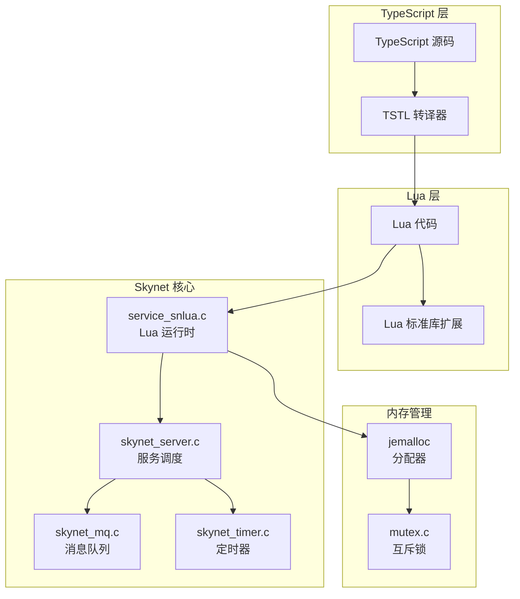
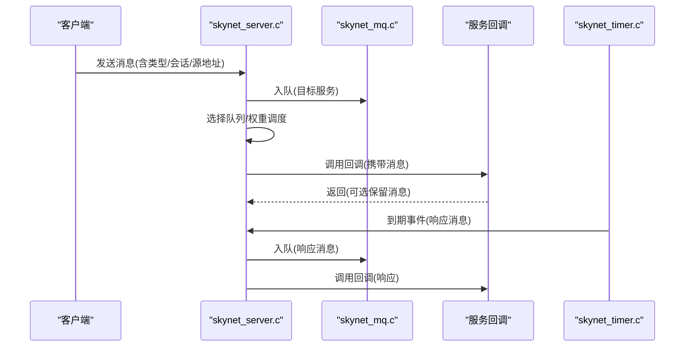
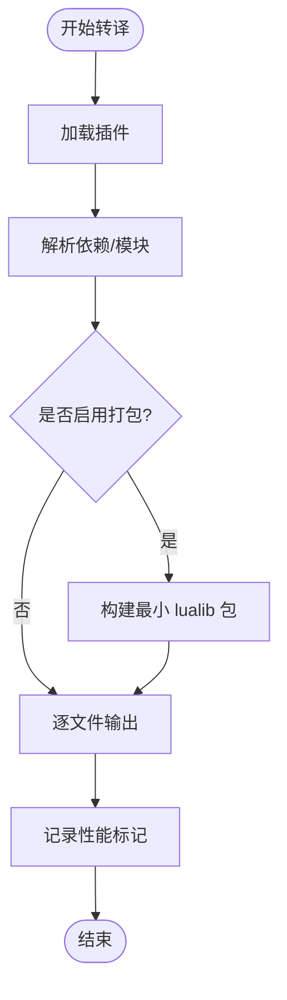
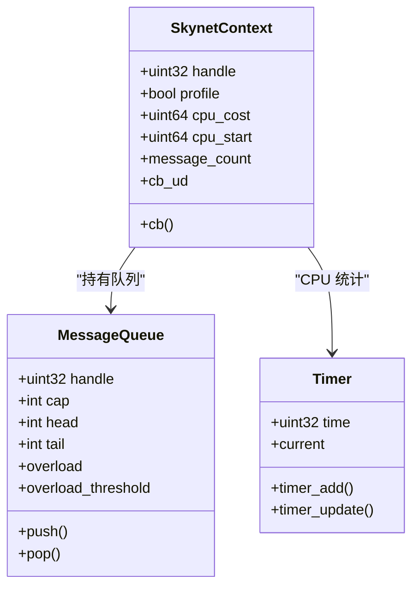
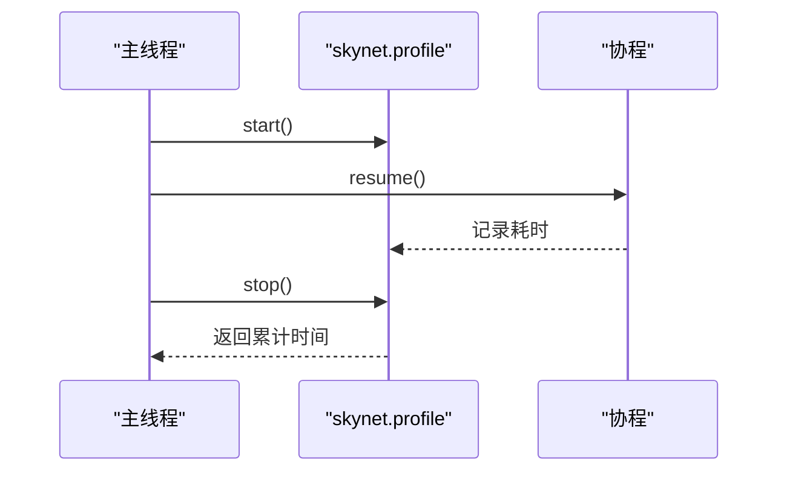
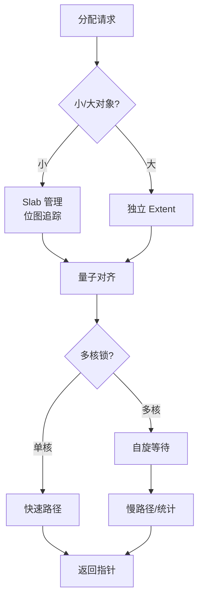
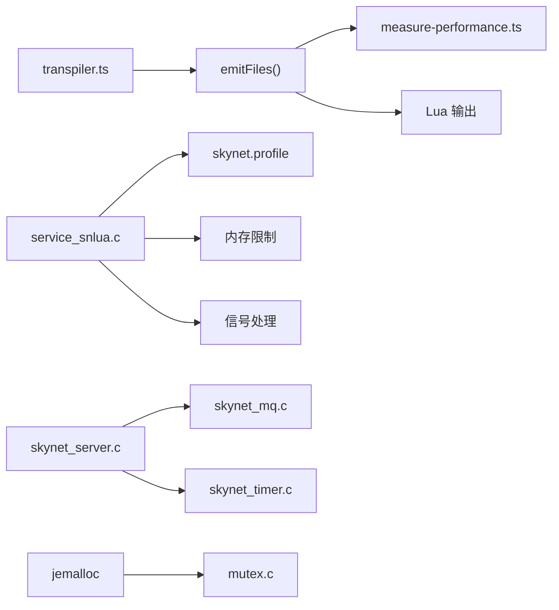

# 性能优化

<cite>
**本文档引用的文件**
- [service_snlua.c](file://docker/skynet/service-src/service_snlua.c)
- [lua-skynet.c](file://docker/skynet/lualib-src/lua-skynet.c)
- [skynet_server.c](file://docker/skynet/skynet-src/skynet_server.c)
- [skynet_mq.c](file://docker/skynet/skynet-src/skynet_mq.c)
- [skynet_timer.c](file://docker/skynet/skynet-src/skynet_timer.c)
- [transpiler.ts](file://tool/TypeScriptToLua_skynet/src/transpilation/transpiler.ts)
- [measure-performance.ts](file://tool/TypeScriptToLua_skynet/src/measure-performance.ts)
- [Await.ts](file://tool/TypeScriptToLua_skynet/src/lualib/Await.ts)
- [testcoroutine.lua](file://docker/skynet/test/testcoroutine.lua)
- [testmemlimit.lua](file://docker/skynet/test/testmemlimit.lua)
- [TS-Skynet 异步编程规范.md](file://docs/TS-Skynet 异步编程规范.md)
- [jemalloc.xml.in](file://docker/skynet/3rd/jemalloc/doc/jemalloc.xml.in)
- [mutex.c](file://docker/skynet/3rd/jemalloc/src/mutex.c)
</cite>

## 目录
1. [简介](#简介)
2. [项目结构](#项目结构)
3. [核心组件](#核心组件)
4. [架构概览](#架构概览)
5. [详细组件分析](#详细组件分析)
6. [依赖关系分析](#依赖关系分析)
7. [性能考量](#性能考量)
8. [故障排查指南](#故障排查指南)
9. [结论](#结论)
10. [附录](#附录)

## 简介
本指南聚焦于 TypeScriptToLua 转译与 Skynet Actor 模型的性能优化，涵盖代码生成效率、运行时性能、内存使用、并发编程、性能测试与基准测试方法，并提供生产环境监控与调优策略。通过对底层 C 实现、Lua 运行时、TSTL 转译器及框架规范的深入分析，帮助读者建立系统性的性能优化知识体系。

## 项目结构
该项目采用多语言混合架构：TypeScript 源码经 TSTL 转译为 Lua，运行于 Skynet 微服务框架之上；底层由 C 实现的消息队列、定时器、内存管理等模块提供高性能基础设施；配套的测试与基准脚本用于验证性能指标。

**图表来源**
- [transpiler.ts:33-56](file://tool/TypeScriptToLua_skynet/src/transpilation/transpiler.ts#L33-L56)
- [service_snlua.c:384-453](file://docker/skynet/service-src/service_snlua.c#L384-L453)
- [skynet_server.c:255-290](file://docker/skynet/skynet-src/skynet_server.c#L255-L290)
- [skynet_mq.c:77-96](file://docker/skynet/skynet-src/skynet_mq.c#L77-L96)
- [skynet_timer.c:204-224](file://docker/skynet/skynet-src/skynet_timer.c#L204-L224)
- [jemalloc.xml.in:565-588](file://docker/skynet/3rd/jemalloc/doc/jemalloc.xml.in#L565-L588)
- [mutex.c:51-97](file://docker/skynet/3rd/jemalloc/src/mutex.c#L51-L97)

**章节来源**
- [transpiler.ts:1-227](file://tool/TypeScriptToLua_skynet/src/transpilation/transpiler.ts#L1-L227)
- [service_snlua.c:1-550](file://docker/skynet/service-src/service_snlua.c#L1-L550)
- [skynet_server.c:1-831](file://docker/skynet/skynet-src/skynet_server.c#L1-L831)
- [skynet_mq.c:1-251](file://docker/skynet/skynet-src/skynet_mq.c#L1-L251)
- [skynet_timer.c:1-293](file://docker/skynet/skynet-src/skynet_timer.c#L1-L293)
- [jemalloc.xml.in:565-588](file://docker/skynet/3rd/jemalloc/doc/jemalloc.xml.in#L565-L588)
- [mutex.c:51-97](file://docker/skynet/3rd/jemalloc/src/mutex.c#L51-L97)

## 核心组件
- TSTL 转译器：负责 TypeScript 到 Lua 的代码生成，包含插件系统、依赖解析、打包与输出控制，并内置性能测量钩子。
- Skynet 服务：提供 Actor 模型的服务抽象、消息路由与回调执行。
- 消息队列：基于环形缓冲的轻量级队列，支持自适应扩容与全局队列调度。
- 定时器：多级时间轮实现，O(1) 调度开销，支持高精度时间戳。
- Lua 运行时：增强的协程与性能剖析能力，集成内存限制与信号处理。
- 内存管理：jemalloc 分配器与互斥锁优化，降低锁竞争与碎片化。

**章节来源**
- [transpiler.ts:26-170](file://tool/TypeScriptToLua_skynet/src/transpilation/transpiler.ts#L26-L170)
- [skynet_server.c:42-61](file://docker/skynet/skynet-src/skynet_server.c#L42-L61)
- [skynet_mq.c:21-33](file://docker/skynet/skynet-src/skynet_mq.c#L21-L33)
- [skynet_timer.c:39-47](file://docker/skynet/skynet-src/skynet_timer.c#L39-L47)
- [service_snlua.c:26-34](file://docker/skynet/service-src/service_snlua.c#L26-L34)

## 架构概览
Skynet 采用主从式消息驱动架构：服务通过消息队列接收消息，回调在受控协程中执行；定时器将到期事件转化为响应消息推入队列；Lua 运行时提供协程与性能剖析能力；jemalloc 提供高效的内存分配与低锁争用。

**图表来源**
- [skynet_server.c:292-347](file://docker/skynet/skynet-src/skynet_server.c#L292-L347)
- [skynet_mq.c:189-209](file://docker/skynet/skynet-src/skynet_mq.c#L189-L209)
- [skynet_timer.c:134-178](file://docker/skynet/skynet-src/skynet_timer.c#L134-L178)

## 详细组件分析

### TypeScriptToLua 转译性能
- 代码生成效率：TSTL 通过插件系统与依赖解析，支持最小化 lualib 打包与按需引入，减少运行时体积与加载时间。
- 性能测量：内置 startSection/endSection 钩子，结合 Node perf_hooks 输出性能标记，便于定位转译瓶颈。
- 协程语义：Await.ts 将 async/await 映射为 Lua 协程，确保链式 await 的尾调用优化，避免额外栈帧开销。

**图表来源**
- [transpiler.ts:33-155](file://tool/TypeScriptToLua_skynet/src/transpilation/transpiler.ts#L33-L155)
- [measure-performance.ts:44-55](file://tool/TypeScriptToLua_skynet/src/measure-performance.ts#L44-L55)
- [Await.ts:25-30](file://tool/TypeScriptToLua_skynet/src/lualib/Await.ts#L25-L30)

**章节来源**
- [transpiler.ts:26-170](file://tool/TypeScriptToLua_skynet/src/transpilation/transpiler.ts#L26-L170)
- [measure-performance.ts:1-84](file://tool/TypeScriptToLua_skynet/src/measure-performance.ts#L1-L84)
- [Await.ts:1-30](file://tool/TypeScriptToLua_skynet/src/lualib/Await.ts#L1-L30)

### Skynet Actor 模型性能特征
- 服务调度：基于消息队列长度与权重的批量处理，减少频繁上下文切换；支持过载检测与阈值倍增策略。
- 回调执行：在回调入口/出口记录 CPU 时间，支持 per-context 统计与 profile 开关。
- 消息传递：支持 DONTCOPY 标记减少拷贝；远程消息通过 Harbor 发送，本地消息直接入队。

**图表来源**
- [skynet_server.c:42-61](file://docker/skynet/skynet-src/skynet_server.c#L42-L61)
- [skynet_mq.c:21-33](file://docker/skynet/skynet-src/skynet_mq.c#L21-L33)
- [skynet_timer.c:39-47](file://docker/skynet/skynet-src/skynet_timer.c#L39-L47)

**章节来源**
- [skynet_server.c:255-290](file://docker/skynet/skynet-src/skynet_server.c#L255-L290)
- [skynet_mq.c:127-135](file://docker/skynet/skynet-src/skynet_mq.c#L127-L135)
- [skynet_timer.c:165-178](file://docker/skynet/skynet-src/skynet_timer.c#L165-L178)

### Lua 运行时与协程性能
- 协程剖析：service_snlua.c 重载 coroutine.resume/wrap，统计每个协程的累计耗时，支持 start/stop/stop(thread)。
- 信号与中断：支持信号触发主动中断当前活跃 Lua 状态，配合 hook 机制实现可控的异常处理。
- 内存限制：通过自定义分配器与内存上限检测，超限返回 NULL 并触发警告，防止 OOM。

**图表来源**
- [service_snlua.c:267-327](file://docker/skynet/service-src/service_snlua.c#L267-L327)
- [testcoroutine.lua:31-54](file://docker/skynet/test/testcoroutine.lua#L31-L54)

**章节来源**
- [service_snlua.c:133-214](file://docker/skynet/service-src/service_snlua.c#L133-L214)
- [testcoroutine.lua:1-55](file://docker/skynet/test/testcoroutine.lua#L1-L55)

### 内存管理与 jemalloc 优化
- 分配策略：小对象按量子对齐，减少内部碎片；大对象独立分配，避免缓存行共享问题。
- 锁优化：单核场景快速路径；多核场景自旋等待与统计，必要时进入慢路径，降低锁竞争。
- 内存限制：Lua 层通过 lalloc 钩子跟踪内存使用，超过阈值拒绝增长并发出警告。

**图表来源**
- [jemalloc.xml.in:565-588](file://docker/skynet/3rd/jemalloc/doc/jemalloc.xml.in#L565-L588)
- [mutex.c:51-97](file://docker/skynet/3rd/jemalloc/src/mutex.c#L51-L97)
- [service_snlua.c:482-500](file://docker/skynet/service-src/service_snlua.c#L482-L500)

**章节来源**
- [jemalloc.xml.in:565-588](file://docker/skynet/3rd/jemalloc/doc/jemalloc.xml.in#L565-L588)
- [mutex.c:51-97](file://docker/skynet/3rd/jemalloc/src/mutex.c#L51-L97)
- [service_snlua.c:482-500](file://docker/skynet/service-src/service_snlua.c#L482-L500)

### 并发编程性能考量
- 协程调度：优先使用 async/await，避免 .then 链导致的协程外回调；服务启动回调必须同步完成。
- 锁竞争：jemalloc 的自旋与统计机制降低锁争用；消息队列采用自旋锁保护，批量处理减少竞争。
- 资源共享：通过 Actor 模型的消息传递避免共享状态；远程消息通过 Harbor 跨节点通信。

**章节来源**
- [TS-Skynet 异步编程规范.md:13-16](file://docs/TS-Skynet 异步编程规范.md#L13-L16)
- [TS-Skynet 异步编程规范.md:94-130](file://docs/TS-Skynet 异步编程规范.md#L94-L130)
- [skynet_mq.c:190-209](file://docker/skynet/skynet-src/skynet_mq.c#L190-L209)
- [mutex.c:51-97](file://docker/skynet/3rd/jemalloc/src/mutex.c#L51-L97)

## 依赖关系分析

**图表来源**
- [transpiler.ts:58-107](file://tool/TypeScriptToLua_skynet/src/transpilation/transpiler.ts#L58-L107)
- [measure-performance.ts:44-55](file://tool/TypeScriptToLua_skynet/src/measure-performance.ts#L44-L55)
- [service_snlua.c:384-453](file://docker/skynet/service-src/service_snlua.c#L384-L453)
- [skynet_server.c:292-347](file://docker/skynet/skynet-src/skynet_server.c#L292-L347)
- [skynet_mq.c:189-209](file://docker/skynet/skynet-src/skynet_mq.c#L189-L209)
- [skynet_timer.c:204-224](file://docker/skynet/skynet-src/skynet_timer.c#L204-L224)
- [jemalloc.xml.in:565-588](file://docker/skynet/3rd/jemalloc/doc/jemalloc.xml.in#L565-L588)
- [mutex.c:51-97](file://docker/skynet/3rd/jemalloc/src/mutex.c#L51-L97)

**章节来源**
- [transpiler.ts:58-107](file://tool/TypeScriptToLua_skynet/src/transpilation/transpiler.ts#L58-L107)
- [measure-performance.ts:44-55](file://tool/TypeScriptToLua_skynet/src/measure-performance.ts#L44-L55)
- [service_snlua.c:384-453](file://docker/skynet/service-src/service_snlua.c#L384-L453)
- [skynet_server.c:292-347](file://docker/skynet/skynet-src/skynet_server.c#L292-L347)
- [skynet_mq.c:189-209](file://docker/skynet/skynet-src/skynet_mq.c#L189-L209)
- [skynet_timer.c:204-224](file://docker/skynet/skynet-src/skynet_timer.c#L204-L224)
- [jemalloc.xml.in:565-588](file://docker/skynet/3rd/jemalloc/doc/jemalloc.xml.in#L565-L588)
- [mutex.c:51-97](file://docker/skynet/3rd/jemalloc/src/mutex.c#L51-L97)

## 性能考量
- 代码生成效率
  - 启用最小化 lualib 打包，减少运行时体积与加载时间。
  - 使用插件系统进行预处理与转换，避免运行时开销。
- 运行时性能
  - 优先使用 async/await，避免回调链导致的协程外执行。
  - 合理设置消息队列权重，批量处理提升吞吐。
  - 定时器使用时间轮，O(1) 调度复杂度。
- 内存使用
  - 启用内存限制，及时发现内存泄漏。
  - 使用 jemalloc 的量子对齐与 slab 管理，降低碎片。
  - 避免不必要的字符串与对象拷贝，使用 DONTCOPY 标记。
- 并发与锁
  - 减少共享状态，使用 Actor 模型消息传递。
  - jemalloc 的自旋与统计降低锁竞争。
- 测试与基准
  - 使用内置性能标记与协程剖析，定位热点。
  - 通过测试脚本验证内存限制与协程行为。

[本节为通用指导，无需特定文件引用]

## 故障排查指南
- 协程相关
  - 使用协程剖析工具查看累计耗时，定位长时间运行的协程。
  - 避免在服务启动回调中使用 async，确保同步完成。
- 内存问题
  - 启用内存限制，观察警告日志，逐步缩小可疑代码范围。
  - 使用测试脚本验证内存增长曲线。
- 消息队列过载
  - 关注过载阈值倍增与日志提示，调整服务负载或增加实例。
- 定时器延迟
  - 检查系统时间更新与时间轮推进频率，避免系统时钟回退。

**章节来源**
- [testcoroutine.lua:31-54](file://docker/skynet/test/testcoroutine.lua#L31-L54)
- [testmemlimit.lua:14-35](file://docker/skynet/test/testmemlimit.lua#L14-L35)
- [skynet_mq.c:127-135](file://docker/skynet/skynet-src/skynet_mq.c#L127-L135)
- [skynet_timer.c:245-260](file://docker/skynet/skynet-src/skynet_timer.c#L245-L260)

## 结论
通过 TSTL 的高效转译、Skynet 的 Actor 模型与 jemalloc 的内存优化，以及完善的性能测量与剖析工具，本项目在代码生成效率、运行时性能与内存管理方面形成了完整的优化闭环。遵循异步编程规范、合理使用协程与消息队列、结合基准测试与监控，可在生产环境中获得稳定且可预期的性能表现。

[本节为总结，无需特定文件引用]

## 附录
- 性能测试与基准测试方法
  - 使用内置性能标记(startSection/endSection)与协程剖析(profile)，输出到性能分析器。
  - 通过测试脚本模拟高负载场景，观察消息队列长度与 CPU 统计。
- 生产环境监控与调优策略
  - 开启服务 profile 统计，定期导出 CPU 与消息计数。
  - 设置内存限制，结合日志与信号处理实现安全降级。
  - 调整消息队列权重与定时器粒度，平衡吞吐与延迟。

[本节为通用指导，无需特定文件引用]