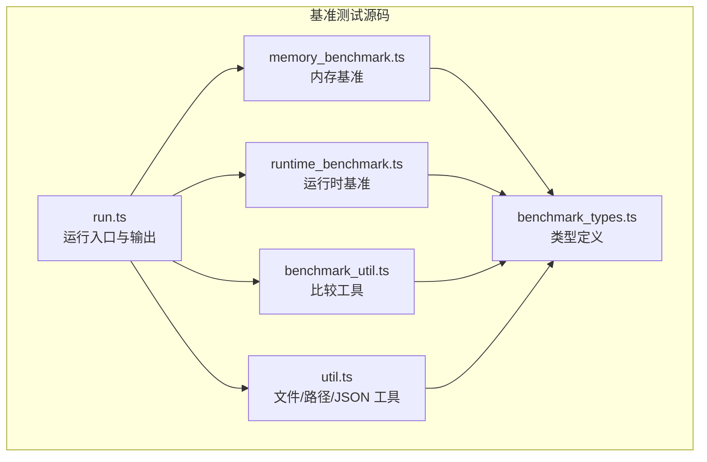
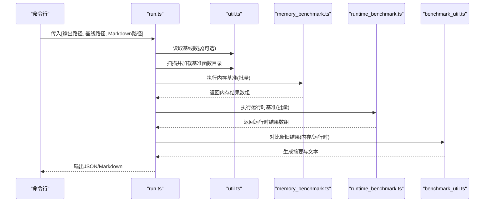
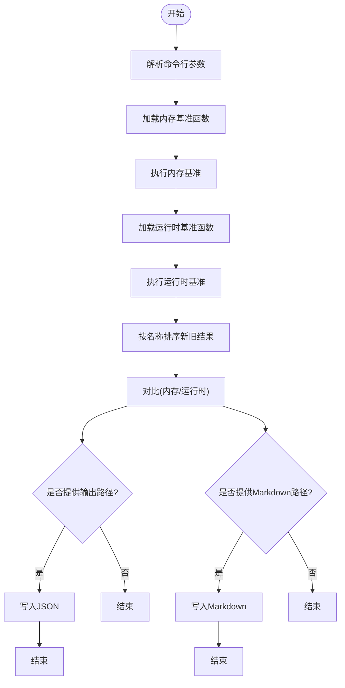
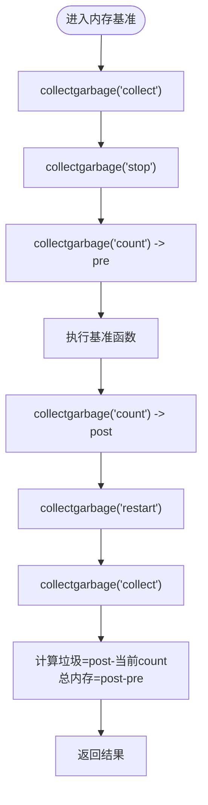
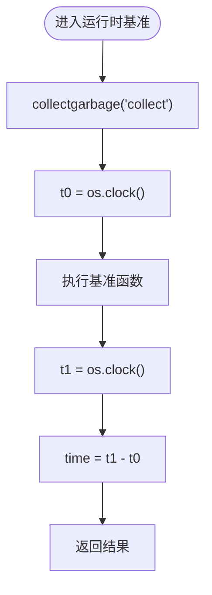
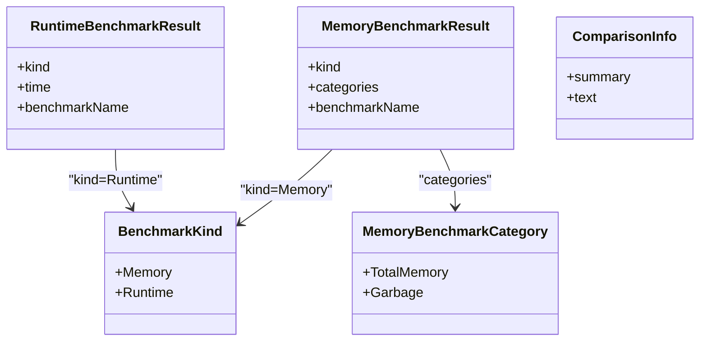
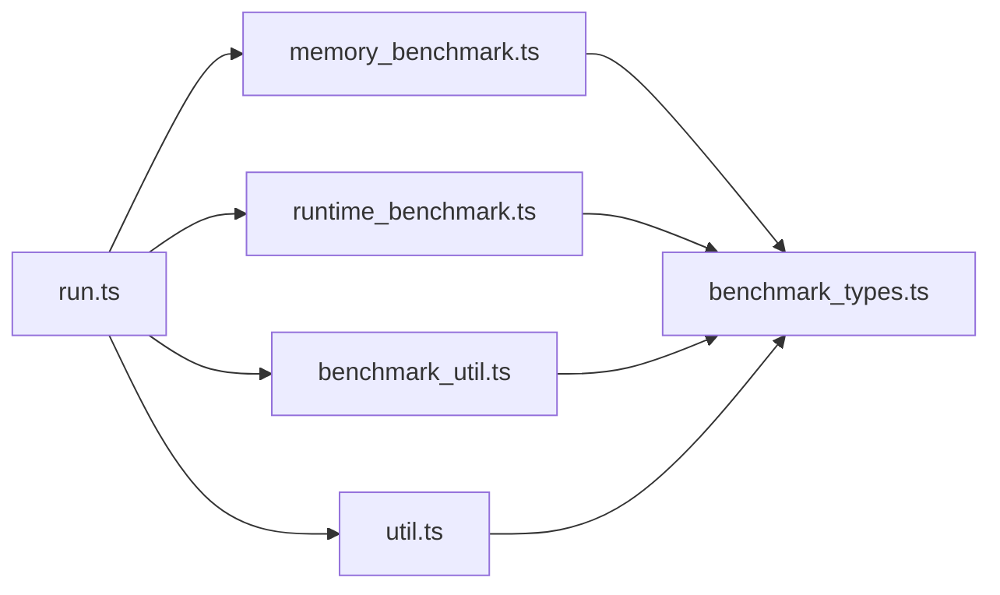

# 性能测试与基准

<cite>
**本文引用的文件**
- [benchmark/README.md](file://tool/TypeScriptToLua_skynet/benchmark/README.md)
- [benchmark/src/run.ts](file://tool/TypeScriptToLua_skynet/benchmark/src/run.ts)
- [benchmark/src/memory_benchmark.ts](file://tool/TypeScriptToLua_skynet/benchmark/src/memory_benchmark.ts)
- [benchmark/src/runtime_benchmark.ts](file://tool/TypeScriptToLua_skynet/benchmark/src/runtime_benchmark.ts)
- [benchmark/src/benchmark_types.ts](file://tool/TypeScriptToLua_skynet/benchmark/src/benchmark_types.ts)
- [benchmark/src/benchmark_util.ts](file://tool/TypeScriptToLua_skynet/benchmark/src/benchmark_util.ts)
- [benchmark/src/util.ts](file://tool/TypeScriptToLua_skynet/benchmark/src/util.ts)
- [benchmark/tsconfig.json](file://tool/TypeScriptToLua_skynet/benchmark/tsconfig.json)
- [benchmark/tsconfig.53.json](file://tool/TypeScriptToLua_skynet/benchmark/tsconfig.53.json)
</cite>

## 目录
1. [引言](#引言)
2. [项目结构](#项目结构)
3. [核心组件](#核心组件)
4. [架构总览](#架构总览)
5. [详细组件分析](#详细组件分析)
6. [依赖关系分析](#依赖关系分析)
7. [性能考虑](#性能考虑)
8. [故障排查指南](#故障排查指南)
9. [结论](#结论)
10. [附录](#附录)

## 引言
本指南面向在 TypeScriptToLua（TSTL）生态中进行性能测试与基准评测的工程师与质量保障人员。文档系统性阐述了内存基准、运行时基准、吞吐量测试的设计原则与实施方法，并结合仓库内已有的基准测试框架，给出可直接落地的测试环境搭建、测试用例编写、工具使用、指标采集与分析、性能回归测试策略以及自动化流程建议。读者无需深入 Lua 或 TSTL 实现细节，即可按步骤完成从“设计—执行—对比—回归—优化验证”的闭环。

## 项目结构
基准测试子模块位于 tool/TypeScriptToLua_skynet/benchmark，采用 TypeScript 编写并在本地通过 TSTL 转译为 Lua 后运行。核心结构如下：
- 源码目录：benchmark/src
  - 运行入口与比较输出：run.ts
  - 内存基准实现：memory_benchmark.ts
  - 运行时基准实现：runtime_benchmark.ts
  - 类型定义：benchmark_types.ts
  - 基准比较工具：benchmark_util.ts
  - 通用工具与文件读取：util.ts
- 配置文件：tsconfig.json、tsconfig.53.json
- 使用说明：benchmark/README.md

图表来源
- [benchmark/src/run.ts:1-106](file://tool/TypeScriptToLua_skynet/benchmark/src/run.ts#L1-L106)
- [benchmark/src/memory_benchmark.ts:1-72](file://tool/TypeScriptToLua_skynet/benchmark/src/memory_benchmark.ts#L1-L72)
- [benchmark/src/runtime_benchmark.ts:1-44](file://tool/TypeScriptToLua_skynet/benchmark/src/runtime_benchmark.ts#L1-L44)
- [benchmark/src/benchmark_types.ts:1-39](file://tool/TypeScriptToLua_skynet/benchmark/src/benchmark_types.ts#L1-L39)
- [benchmark/src/benchmark_util.ts:1-61](file://tool/TypeScriptToLua_skynet/benchmark/src/benchmark_util.ts#L1-L61)
- [benchmark/src/util.ts:1-77](file://tool/TypeScriptToLua_skynet/benchmark/src/util.ts#L1-L77)

章节来源
- [benchmark/README.md:1-48](file://tool/TypeScriptToLua_skynet/benchmark/README.md#L1-L48)
- [benchmark/src/run.ts:1-106](file://tool/TypeScriptToLua_skynet/benchmark/src/run.ts#L1-L106)

## 核心组件
- 运行入口与比较输出（run.ts）
  - 加载指定目录下的基准函数，分别执行内存与运行时基准
  - 可选读取基线结果，生成对比摘要与 JSON/Markdown 输出
  - 支持命令行参数：输出路径、基线路径、Markdown 输出路径
- 内存基准（memory_benchmark.ts）
  - 关闭自动 GC，先后两次采样，计算“垃圾”与“总内存”
  - 通过返回值避免“有用结果”被误计为垃圾
- 运行时基准（runtime_benchmark.ts）
  - 使用 os.clock() 计时，先触发一次 GC 归一化
- 类型系统（benchmark_types.ts）
  - 定义基准种类、结果结构、断言函数与比较信息
- 比较工具（benchmark_util.ts）
  - 生成 Markdown 表格，计算绝对变化与百分比变化，汇总求和
- 通用工具（util.ts）
  - 文件读取、目录扫描、JSON 编解码、平台判断、路径处理

章节来源
- [benchmark/src/run.ts:1-106](file://tool/TypeScriptToLua_skynet/benchmark/src/run.ts#L1-L106)
- [benchmark/src/memory_benchmark.ts:1-72](file://tool/TypeScriptToLua_skynet/benchmark/src/memory_benchmark.ts#L1-L72)
- [benchmark/src/runtime_benchmark.ts:1-44](file://tool/TypeScriptToLua_skynet/benchmark/src/runtime_benchmark.ts#L1-L44)
- [benchmark/src/benchmark_types.ts:1-39](file://tool/TypeScriptToLua_skynet/benchmark/src/benchmark_types.ts#L1-L39)
- [benchmark/src/benchmark_util.ts:1-61](file://tool/TypeScriptToLua_skynet/benchmark/src/benchmark_util.ts#L1-L61)
- [benchmark/src/util.ts:1-77](file://tool/TypeScriptToLua_skynet/benchmark/src/util.ts#L1-L77)

## 架构总览
下图展示基准测试从“加载—执行—比较—输出”的整体流程，映射到具体源码模块：

图表来源
- [benchmark/src/run.ts:20-44](file://tool/TypeScriptToLua_skynet/benchmark/src/run.ts#L20-L44)
- [benchmark/src/util.ts:66-76](file://tool/TypeScriptToLua_skynet/benchmark/src/util.ts#L66-L76)
- [benchmark/src/memory_benchmark.ts:5-43](file://tool/TypeScriptToLua_skynet/benchmark/src/memory_benchmark.ts#L5-L43)
- [benchmark/src/runtime_benchmark.ts:5-22](file://tool/TypeScriptToLua_skynet/benchmark/src/runtime_benchmark.ts#L5-L22)
- [benchmark/src/benchmark_util.ts:7-60](file://tool/TypeScriptToLua_skynet/benchmark/src/benchmark_util.ts#L7-L60)

## 详细组件分析

### 组件A：运行入口与比较输出（run.ts）
- 功能要点
  - 从命令行参数解析输出路径、基线路径、Markdown 输出路径
  - 分别加载并执行内存基准与运行时基准
  - 若提供基线，则对结果进行排序并对齐，生成对比摘要与 JSON 文本
  - 支持将对比结果输出为 Markdown，便于本地审阅
- 设计模式
  - 策略模式：根据基准种类选择不同的比较器
  - 工厂模式：通过目录扫描动态加载基准函数
- 错误处理
  - 基线文件读取失败会抛出异常
  - 结果排序与名称匹配用于对比，缺失项以占位符呈现
- 复杂度
  - 时间复杂度近似 O(N log N)（排序主导），空间复杂度 O(N)

图表来源
- [benchmark/src/run.ts:20-44](file://tool/TypeScriptToLua_skynet/benchmark/src/run.ts#L20-L44)
- [benchmark/src/run.ts:85-105](file://tool/TypeScriptToLua_skynet/benchmark/src/run.ts#L85-L105)

章节来源
- [benchmark/src/run.ts:1-106](file://tool/TypeScriptToLua_skynet/benchmark/src/run.ts#L1-L106)

### 组件B：内存基准（memory_benchmark.ts）
- 设计原则
  - 关闭自动 GC，确保测量期间的可控性
  - 先后两次采样，减去 GC 归零后的增量，得到“垃圾”与“总内存”
  - 通过返回值防止“有用结果”被误判为垃圾
- 数据结构
  - MemoryBenchmarkResult：包含基准名、类别（总内存、垃圾）与种类标识
- 处理逻辑
  - 采样前先强制 GC，保证起始状态一致
  - 执行目标函数后再次采样，恢复 GC 并再做一次 GC
  - 计算两类内存指标并填充结果对象
- 复杂度
  - 时间复杂度 O(1)，空间复杂度 O(1)

图表来源
- [benchmark/src/memory_benchmark.ts:5-43](file://tool/TypeScriptToLua_skynet/benchmark/src/memory_benchmark.ts#L5-L43)

章节来源
- [benchmark/src/memory_benchmark.ts:1-72](file://tool/TypeScriptToLua_skynet/benchmark/src/memory_benchmark.ts#L1-L72)

### 组件C：运行时基准（runtime_benchmark.ts）
- 设计原则
  - 使用 os.clock() 获取高精度 CPU 时间
  - 执行前先触发一次 GC，降低冷启动影响
- 数据结构
  - RuntimeBenchmarkResult：包含基准名、耗时与种类标识
- 处理逻辑
  - 记录开始时间，执行目标函数，计算差值作为耗时
  - 填充结果对象并返回
- 复杂度
  - 时间复杂度 O(1)，空间复杂度 O(1)

图表来源
- [benchmark/src/runtime_benchmark.ts:5-22](file://tool/TypeScriptToLua_skynet/benchmark/src/runtime_benchmark.ts#L5-L22)

章节来源
- [benchmark/src/runtime_benchmark.ts:1-44](file://tool/TypeScriptToLua_skynet/benchmark/src/runtime_benchmark.ts#L1-L44)

### 组件D：比较工具与类型系统（benchmark_util.ts、benchmark_types.ts）
- 类型系统
  - 定义基准种类枚举、结果接口、类型守卫与比较信息结构
- 比较工具
  - 生成 Markdown 表头与分隔行
  - 对应名称的结果逐项对比，计算变化与百分比
  - 汇总行显示总和与整体百分比变化
- 复杂度
  - 时间复杂度 O(N)，空间复杂度 O(N)

图表来源
- [benchmark/src/benchmark_types.ts:1-39](file://tool/TypeScriptToLua_skynet/benchmark/src/benchmark_types.ts#L1-L39)

章节来源
- [benchmark/src/benchmark_types.ts:1-39](file://tool/TypeScriptToLua_skynet/benchmark/src/benchmark_types.ts#L1-L39)
- [benchmark/src/benchmark_util.ts:1-61](file://tool/TypeScriptToLua_skynet/benchmark/src/benchmark_util.ts#L1-L61)

### 组件E：通用工具（util.ts）
- 文件与目录
  - readFile/readAll：安全读取文件内容
  - readDir：跨平台列出文件（Windows 与 Unix 差异处理）
  - loadBenchmarksFromDirectory：将文件路径转为模块点路径并 require 默认导出
- JSON 与格式化
  - json.encode/decode：封装标准库 JSON
  - toFixed/calculatePercentageChange：数值格式化与百分比计算
- 平台判断
  - isWindows：基于 package.config 判断 Windows

章节来源
- [benchmark/src/util.ts:1-77](file://tool/TypeScriptToLua_skynet/benchmark/src/util.ts#L1-L77)

## 依赖关系分析
- 模块耦合
  - run.ts 依赖 memory_benchmark.ts、runtime_benchmark.ts、benchmark_util.ts、util.ts
  - memory_benchmark.ts 与 runtime_benchmark.ts 仅依赖类型定义与工具函数
  - benchmark_util.ts 依赖类型定义与通用工具
- 外部依赖
  - Lua 标准库：os、collectgarbage、debug、json、io、string、package
  - TSTL 提供的 JIT/5.3 类型与语言扩展（编译期）

图表来源
- [benchmark/src/run.ts:1-12](file://tool/TypeScriptToLua_skynet/benchmark/src/run.ts#L1-L12)
- [benchmark/src/memory_benchmark.ts:1-3](file://tool/TypeScriptToLua_skynet/benchmark/src/memory_benchmark.ts#L1-L3)
- [benchmark/src/runtime_benchmark.ts:1-3](file://tool/TypeScriptToLua_skynet/benchmark/src/runtime_benchmark.ts#L1-L3)
- [benchmark/src/benchmark_util.ts:1-2](file://tool/TypeScriptToLua_skynet/benchmark/src/benchmark_util.ts#L1-L2)
- [benchmark/src/util.ts:1-17](file://tool/TypeScriptToLua_skynet/benchmark/src/util.ts#L1-L17)

章节来源
- [benchmark/src/run.ts:1-106](file://tool/TypeScriptToLua_skynet/benchmark/src/run.ts#L1-L106)

## 性能考虑
- 测量准确性
  - 内存基准关闭自动 GC 并在前后各做一次 GC，减少波动
  - 运行时基准执行前先 GC，降低首次分配开销
- 采样与统计
  - 建议多次重复取均值/中位数，减少抖动
  - 对极端值进行剔除或记录离群点
- 环境一致性
  - 固定 Lua 版本（如 5.3）与 TSTL 配置，避免编译器差异
  - 控制并发与系统负载，避免外部干扰
- 输出与报告
  - 基线与变更结果统一按名称排序，便于对比
  - 生成 Markdown 表格与 JSON，支持自动化审阅与归档

## 故障排查指南
- 常见问题
  - 基线文件无法打开：检查路径与权限；确认文件存在且可读
  - 目录扫描失败：确认基准目录存在且包含可加载的 Lua 模块
  - 结果不一致：检查是否在不同 Lua 版本或 TSTL 配置下运行
- 排查步骤
  - 单独运行内存/运行时基准，定位问题模块
  - 使用 Markdown 输出快速审阅对比表格
  - 核对命令行参数顺序与路径
- 建议
  - 在 CI 中固定 Lua 与 TSTL 版本，避免漂移
  - 将基准函数返回“有用结果”，避免被误计为垃圾

章节来源
- [benchmark/src/util.ts:19-39](file://tool/TypeScriptToLua_skynet/benchmark/src/util.ts#L19-L39)
- [benchmark/src/util.ts:41-64](file://tool/TypeScriptToLua_skynet/benchmark/src/util.ts#L41-L64)
- [benchmark/src/run.ts:85-105](file://tool/TypeScriptToLua_skynet/benchmark/src/run.ts#L85-L105)

## 结论
本指南基于仓库内的基准测试框架，给出了从设计到执行再到回归的完整流程。通过内存与运行时两类基准，结合对比工具与自动化输出，能够稳定地追踪性能变化。建议在团队内推广该流程，并在 CI 中固化执行步骤，以实现持续的性能治理。

## 附录

### A. 基准测试设计原则与实施方法
- 设计原则
  - 明确指标：内存（总内存、垃圾）、运行时（CPU 时间）、吞吐量（请求/秒）
  - 控制变量：Lua 版本、TSTL 配置、硬件环境、系统负载
  - 可重复：固定迭代次数、预热、多次采样
- 实施步骤
  - 编写基准函数：默认导出无参函数，必要时返回“有用结果”
  - 组织目录：将内存基准置于 memory_benchmarks，运行时基准置于 runtime_benchmarks
  - 生成基线：编译并运行，输出基准 JSON
  - 执行变更：修改代码后重新运行，与基线对比
  - 归档与告警：将结果与 Markdown 报告归档，超过阈值触发告警

章节来源
- [benchmark/README.md:5-33](file://tool/TypeScriptToLua_skynet/benchmark/README.md#L5-L33)
- [benchmark/README.md:34-48](file://tool/TypeScriptToLua_skynet/benchmark/README.md#L34-L48)

### B. 测试环境与工具使用
- 环境准备
  - 安装 Node.js 与 TSTL，确保 Lua 5.3 可用
  - 使用提供的 tsconfig 与 tsconfig.53.json
- 命令示例
  - 生成基线：编译后在 dist 目录执行 run.lua 并输出基准 JSON
  - 对比变更：提供基线路径，生成对比 JSON 与 Markdown
- 第三方工具建议
  - CPU/内存监控：系统自带工具（如任务管理器、top、htop）或专业工具（如 perf、Valgrind、火焰图工具）
  - 吞吐量测试：wrk、ab、JMeter 等
  - 日志与可视化：将基准结果导入数据库或可视化平台

章节来源
- [benchmark/README.md:38-48](file://tool/TypeScriptToLua_skynet/benchmark/README.md#L38-L48)
- [benchmark/tsconfig.json:1-16](file://tool/TypeScriptToLua_skynet/benchmark/tsconfig.json#L1-L16)
- [benchmark/tsconfig.53.json:1-10](file://tool/TypeScriptToLua_skynet/benchmark/tsconfig.53.json#L1-L10)

### C. 指标采集与分析方法
- 关键指标
  - 内存：总内存增量、垃圾增量（单位 MB）
  - 运行时：平均耗时、P95/P99 耗时（单位秒）
  - 吞吐量：每秒事务数（TPS）、每秒请求数（RPS）
- 采集方式
  - 内存：利用 Lua 的 collectgarbage 接口
  - 运行时：利用 os.clock() 或更高精度计时器
  - 吞吐量：在循环中记录开始/结束时间与完成数量
- 分析方法
  - 绝对变化与百分比变化：用于回归检测
  - 趋势分析：多版本对比，识别长期趋势
  - 分层分析：按功能模块拆分，定位热点

章节来源
- [benchmark/src/memory_benchmark.ts:45-71](file://tool/TypeScriptToLua_skynet/benchmark/src/memory_benchmark.ts#L45-L71)
- [benchmark/src/runtime_benchmark.ts:24-43](file://tool/TypeScriptToLua_skynet/benchmark/src/runtime_benchmark.ts#L24-L43)
- [benchmark/src/benchmark_util.ts:7-60](file://tool/TypeScriptToLua_skynet/benchmark/src/benchmark_util.ts#L7-L60)

### D. 性能回归测试与自动化
- 回归策略
  - 基线驱动：以基线 JSON 为权威参考
  - 自动化执行：CI 中固定步骤：编译 → 运行 → 对比 → 报告
  - 阈值告警：超过阈值的指标触发告警与阻断
- 流程建议
  - PR 触发：每次提交运行基准，生成报告
  - 主干合并：仅允许通过的基准合并
  - 周期性回归：定期运行长序列，观察趋势

章节来源
- [benchmark/src/run.ts:85-105](file://tool/TypeScriptToLua_skynet/benchmark/src/run.ts#L85-L105)
- [benchmark/README.md:38-48](file://tool/TypeScriptToLua_skynet/benchmark/README.md#L38-L48)

### E. 优化效果量化评估
- 方法
  - 以基线为对照，对比优化前后的内存与运行时指标
  - 计算绝对变化与百分比变化，关注 P95/P99 的改善
  - 通过吞吐量指标验证优化对业务的影响
- 报告
  - 生成 Markdown 表格与 JSON，便于审阅与归档
  - 在 CI 中保留历史报告，形成可追溯的性能档案

章节来源
- [benchmark/src/benchmark_util.ts:7-60](file://tool/TypeScriptToLua_skynet/benchmark/src/benchmark_util.ts#L7-L60)
- [benchmark/src/run.ts:73-83](file://tool/TypeScriptToLua_skynet/benchmark/src/run.ts#L73-L83)