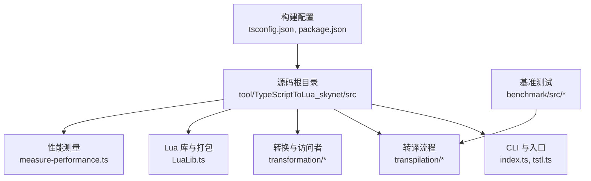
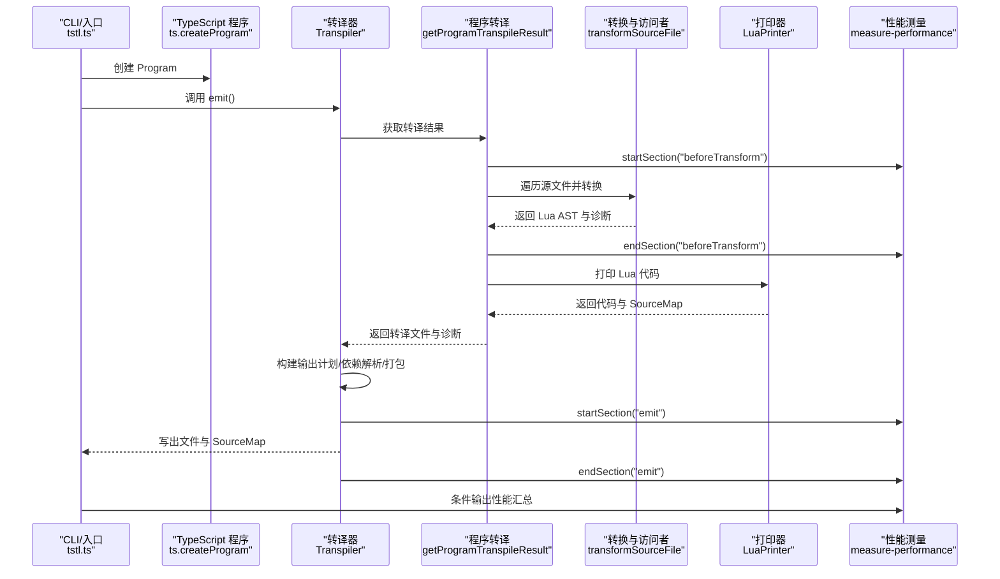
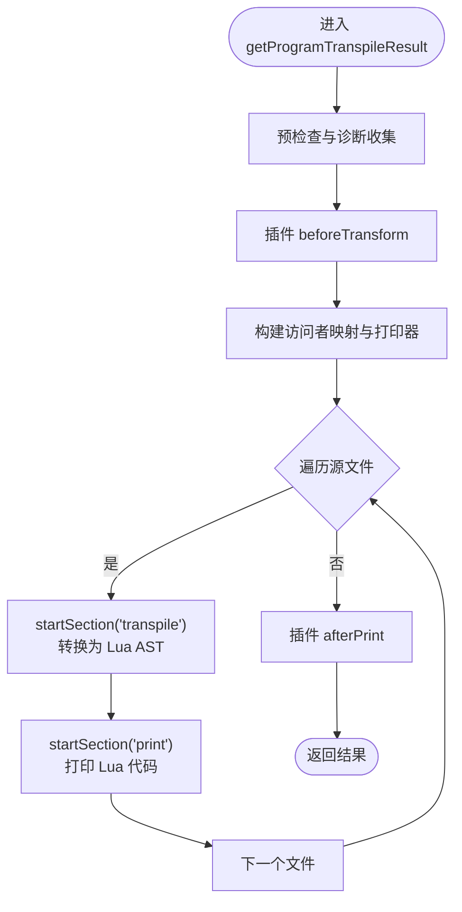
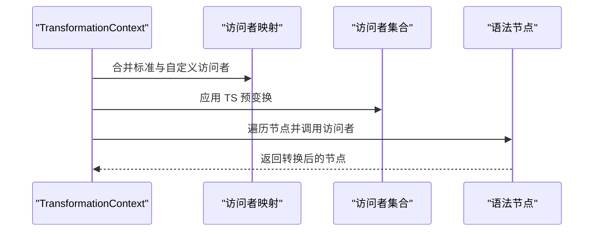
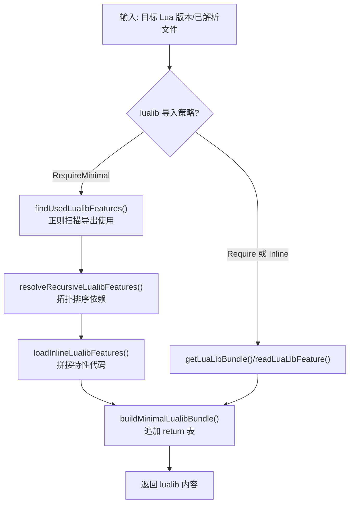
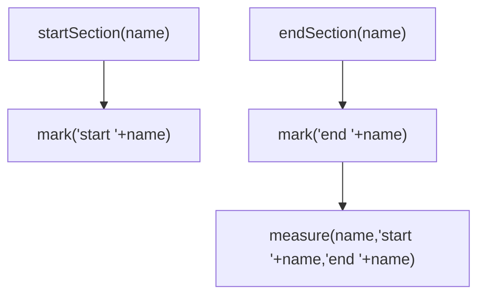
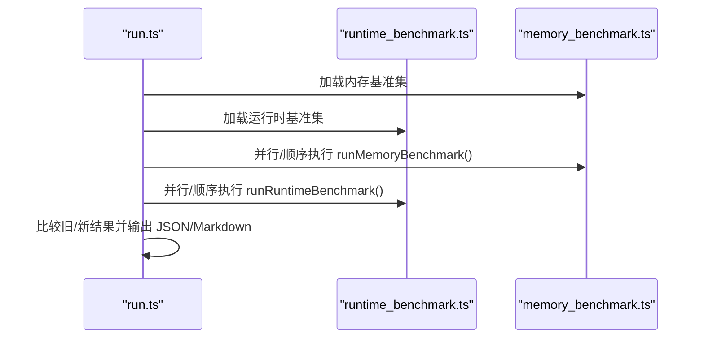
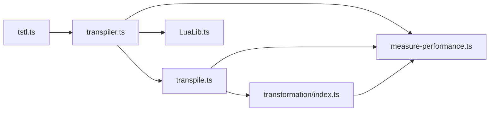

# 转译性能优化

<cite>
**本文引用的文件**
- [index.ts](file://tool/TypeScriptToLua_skynet/src/index.ts)
- [transpiler.ts](file://tool/TypeScriptToLua_skynet/src/transpilation/transpiler.ts)
- [transpile.ts](file://tool/TypeScriptToLua_skynet/src/transpilation/transpile.ts)
- [measure-performance.ts](file://tool/TypeScriptToLua_skynet/src/measure-performance.ts)
- [CompilerOptions.ts](file://tool/TypeScriptToLua_skynet/src/CompilerOptions.ts)
- [LuaLib.ts](file://tool/TypeScriptToLua_skynet/src/LuaLib.ts)
- [run.ts](file://tool/TypeScriptToLua_skynet/benchmark/src/run.ts)
- [runtime_benchmark.ts](file://tool/TypeScriptToLua_skynet/benchmark/src/runtime_benchmark.ts)
- [memory_benchmark.ts](file://tool/TypeScriptToLua_skynet/benchmark/src/memory_benchmark.ts)
- [package.json](file://tool/TypeScriptToLua_skynet/package.json)
- [tsconfig.json](file://tool/TypeScriptToLua_skynet/tsconfig.json)
- [tstl.ts](file://tool/TypeScriptToLua_skynet/src/tstl.ts)
- [transformation/index.ts](file://tool/TypeScriptToLua_skynet/src/transformation/index.ts)
</cite>

## 目录
1. [引言](#引言)
2. [项目结构](#项目结构)
3. [核心组件](#核心组件)
4. [架构总览](#架构总览)
5. [详细组件分析](#详细组件分析)
6. [依赖关系分析](#依赖关系分析)
7. [性能考量](#性能考量)
8. [故障排查指南](#故障排查指南)
9. [结论](#结论)
10. [附录](#附录)

## 引言
本指南聚焦于 TypeScriptToLua（TSTL）在转译过程中的性能优化，系统梳理从 AST 解析、转换、打印到输出的全流程，并结合内置性能测量与基准测试框架，给出可落地的优化策略与实践建议。内容覆盖：
- 性能瓶颈定位：代码转换效率、AST 处理开销、Lua 代码生成质量
- 不同转译策略影响：增量编译、缓存机制、并行处理
- 具体优化案例：数组操作、函数调用、类型检查
- 编译选项与配置选择：如何通过配置提升转译速度
- 性能测试与基准测试：测试方法与结果分析

## 项目结构
本项目采用“源码-构建产物-基准测试”三层组织方式：
- 源码位于 tool/TypeScriptToLua_skynet/src，包含 CLI、转译器、转换器、打印器、Lua 库打包与性能测量模块
- 基准测试位于 tool/TypeScriptToLua_skynet/benchmark，提供运行时与内存两类基准
- 构建配置位于 tsconfig.json 与 package.json，定义编译目标、严格模式与脚本



图示来源
- [index.ts:1-12](file://tool/TypeScriptToLua_skynet/src/index.ts#L1-L12)
- [transpiler.ts:1-227](file://tool/TypeScriptToLua_skynet/src/transpilation/transpiler.ts#L1-L227)
- [transpile.ts:1-159](file://tool/TypeScriptToLua_skynet/src/transpilation/transpile.ts#L1-L159)
- [LuaLib.ts:1-316](file://tool/TypeScriptToLua_skynet/src/LuaLib.ts#L1-L316)
- [measure-performance.ts:1-84](file://tool/TypeScriptToLua_skynet/src/measure-performance.ts#L1-L84)
- [tsconfig.json:1-23](file://tool/TypeScriptToLua_skynet/tsconfig.json#L1-L23)
- [package.json:1-76](file://tool/TypeScriptToLua_skynet/package.json#L1-L76)

章节来源
- [index.ts:1-12](file://tool/TypeScriptToLua_skynet/src/index.ts#L1-L12)
- [tsconfig.json:1-23](file://tool/TypeScriptToLua_skynet/tsconfig.json#L1-L23)
- [package.json:1-76](file://tool/TypeScriptToLua_skynet/package.json#L1-L76)

## 核心组件
- 转译器（Transpiler）：协调插件、解析依赖、决定是否打包、生成输出计划并写入文件
- 程序转译（getProgramTranspileResult）：执行 TS 预变换、遍历源文件、调用转换器与打印器
- 访问者映射与转换（TransformationContext/visitors）：基于语法树节点分派访问者进行转换
- Lua 库打包（LuaLib）：按需加载最小化 lualib 特性或整包导入
- 性能测量（measure-performance）：以标记/度量的方式统计各阶段耗时
- 基准测试（benchmark）：运行时与内存两类基准，支持对比与报告生成

章节来源
- [transpiler.ts:26-170](file://tool/TypeScriptToLua_skynet/src/transpilation/transpiler.ts#L26-L170)
- [transpile.ts:24-158](file://tool/TypeScriptToLua_skynet/src/transpilation/transpile.ts#L24-L158)
- [transformation/index.ts:34-45](file://tool/TypeScriptToLua_skynet/src/transformation/index.ts#L34-L45)
- [LuaLib.ts:7-127](file://tool/TypeScriptToLua_skynet/src/LuaLib.ts#L7-L127)
- [measure-performance.ts:44-83](file://tool/TypeScriptToLua_skynet/src/measure-performance.ts#L44-L83)
- [run.ts:20-45](file://tool/TypeScriptToLua_skynet/benchmark/src/run.ts#L20-L45)

## 架构总览
下图展示从 CLI 到输出的关键流程，以及性能测量点位。



图示来源
- [tstl.ts:101-128](file://tool/TypeScriptToLua_skynet/src/tstl.ts#L101-L128)
- [transpiler.ts:33-107](file://tool/TypeScriptToLua_skynet/src/transpilation/transpiler.ts#L33-L107)
- [transpile.ts:24-158](file://tool/TypeScriptToLua_skynet/src/transpilation/transpile.ts#L24-L158)
- [measure-performance.ts:44-55](file://tool/TypeScriptToLua_skynet/src/measure-performance.ts#L44-L55)

## 详细组件分析

### 组件一：转译器（Transpiler）
职责与流程要点：
- 合并与执行插件（beforeEmit/afterEmit）
- 生成输出计划（依赖解析、lualib 注入、打包决策）
- 写出 Lua 代码与 SourceMap
- 支持 verbose 输出与 BOM 控制

```mermaid
classDiagram
class Transpiler {
-emitHost : EmitHost
+emit(emitOptions) EmitResult
-emitFiles(program, plugins, emitPlan, writeFile) ts.Diagnostic[]
-getEmitPlan(program, diagnostics, files, plugins) { emitPlan }
-getLuaLibBundleContent(options, resolvedFiles) string
}
class EmitHost {
+readFile(path) string|undefined
+writeFile(path, data, ...args) void
}
class Plugin {
+beforeTransform(program, options, emitHost) ts.Diagnostic[]|null|undefined
+afterPrint(program, options, emitHost, files) ts.Diagnostic[]|null|undefined
+beforeEmit(program, options, emitHost, emitPlan) ts.Diagnostic[]|null|undefined
+afterEmit(program, options, emitHost, emitPlan) ts.Diagnostic[]|null|undefined
+visitors : Visitors
+printer : Printer
}
Transpiler --> EmitHost : "使用"
Transpiler --> Plugin : "组合"
```

图示来源
- [transpiler.ts:26-170](file://tool/TypeScriptToLua_skynet/src/transpilation/transpiler.ts#L26-L170)

章节来源
- [transpiler.ts:26-170](file://tool/TypeScriptToLua_skynet/src/transpilation/transpiler.ts#L26-L170)

### 组件二：程序转译（getProgramTranspileResult）
关键阶段与性能测量点：
- 预检查与诊断收集
- 插件 beforeTransform
- 访问者映射与打印器构建
- 单文件转换与打印（transpile/print）
- 插件 afterPrint
- noEmit/noEmitOnError 分支处理



图示来源
- [transpile.ts:24-158](file://tool/TypeScriptToLua_skynet/src/transpilation/transpile.ts#L24-L158)
- [measure-performance.ts:44-55](file://tool/TypeScriptToLua_skynet/src/measure-performance.ts#L44-L55)

章节来源
- [transpile.ts:24-158](file://tool/TypeScriptToLua_skynet/src/transpilation/transpile.ts#L24-L158)

### 组件三：转换与访问者（TransformationContext/visitors）
- 将标准与自定义访问者合并为按语法种类分派的映射
- 在转换前执行 TS 预变换（如 using 变换）
- 对每个节点调用对应访问者进行转换



图示来源
- [transformation/index.ts:8-31](file://tool/TypeScriptToLua_skynet/src/transformation/index.ts#L8-L31)
- [transformation/index.ts:34-45](file://tool/TypeScriptToLua_skynet/src/transformation/index.ts#L34-L45)

章节来源
- [transformation/index.ts:8-31](file://tool/TypeScriptToLua_skynet/src/transformation/index.ts#L8-L31)
- [transformation/index.ts:34-45](file://tool/TypeScriptToLua_skynet/src/transformation/index.ts#L34-L45)

### 组件四：Lua 库打包（LuaLib）
- 特性枚举与导出映射缓存
- 最小化特性集查找与递归依赖解析
- 内联/导入两种 lualib 加载策略
- 整包加载与按需注入



图示来源
- [LuaLib.ts:294-315](file://tool/TypeScriptToLua_skynet/src/LuaLib.ts#L294-L315)
- [LuaLib.ts:193-229](file://tool/TypeScriptToLua_skynet/src/LuaLib.ts#L193-L229)
- [LuaLib.ts:264-292](file://tool/TypeScriptToLua_skynet/src/LuaLib.ts#L264-L292)

章节来源
- [LuaLib.ts:7-127](file://tool/TypeScriptToLua_skynet/src/LuaLib.ts#L7-L127)
- [LuaLib.ts:193-229](file://tool/TypeScriptToLua_skynet/src/LuaLib.ts#L193-L229)
- [LuaLib.ts:264-292](file://tool/TypeScriptToLua_skynet/src/LuaLib.ts#L264-L292)
- [LuaLib.ts:294-315](file://tool/TypeScriptToLua_skynet/src/LuaLib.ts#L294-L315)

### 组件五：性能测量（measure-performance）
- 提供 startSection/endSection 包裹关键阶段
- 使用浏览器性能 API 记录 mark/measure
- 支持启用/禁用与遍历度量



图示来源
- [measure-performance.ts:44-55](file://tool/TypeScriptToLua_skynet/src/measure-performance.ts#L44-L55)

章节来源
- [measure-performance.ts:1-84](file://tool/TypeScriptToLua_skynet/src/measure-performance.ts#L1-L84)

### 组件六：基准测试（benchmark）
- 运行时基准：使用 os.clock 测量执行时间
- 内存基准：停止 GC、前后计数垃圾回收量与总内存
- 结果比较与 Markdown 输出



图示来源
- [run.ts:20-45](file://tool/TypeScriptToLua_skynet/benchmark/src/run.ts#L20-L45)
- [runtime_benchmark.ts:5-22](file://tool/TypeScriptToLua_skynet/benchmark/src/runtime_benchmark.ts#L5-L22)
- [memory_benchmark.ts:5-43](file://tool/TypeScriptToLua_skynet/benchmark/src/memory_benchmark.ts#L5-L43)

章节来源
- [run.ts:20-106](file://tool/TypeScriptToLua_skynet/benchmark/src/run.ts#L20-L106)
- [runtime_benchmark.ts:1-44](file://tool/TypeScriptToLua_skynet/benchmark/src/runtime_benchmark.ts#L1-L44)
- [memory_benchmark.ts:1-72](file://tool/TypeScriptToLua_skynet/benchmark/src/memory_benchmark.ts#L1-L72)

## 依赖关系分析
- CLI 与入口：tstl.ts 调用 createProgram 并委托 Transpiler.emit 完成转译
- 转译器依赖：插件系统、依赖解析、Lua 库打包、输出路径计算
- 转换层依赖：访问者映射、TS 预变换、打印器
- 性能测量：贯穿多个阶段，便于定位热点



图示来源
- [tstl.ts:101-128](file://tool/TypeScriptToLua_skynet/src/tstl.ts#L101-L128)
- [transpiler.ts:33-107](file://tool/TypeScriptToLua_skynet/src/transpilation/transpiler.ts#L33-L107)
- [transpile.ts:24-158](file://tool/TypeScriptToLua_skynet/src/transpilation/transpile.ts#L24-L158)
- [transformation/index.ts:34-45](file://tool/TypeScriptToLua_skynet/src/transformation/index.ts#L34-L45)
- [LuaLib.ts:264-292](file://tool/TypeScriptToLua_skynet/src/LuaLib.ts#L264-L292)
- [measure-performance.ts:44-55](file://tool/TypeScriptToLua_skynet/src/measure-performance.ts#L44-L55)

章节来源
- [index.ts:1-12](file://tool/TypeScriptToLua_skynet/src/index.ts#L1-L12)
- [package.json:38-40](file://tool/TypeScriptToLua_skynet/package.json#L38-L40)

## 性能考量

### 1. 性能瓶颈定位
- 转换阶段（transpile）：对每个源文件执行 TS 预变换与节点访问者转换，是 CPU 密集区
- 打印阶段（print）：将 Lua AST 打印为字符串，I/O 与字符串拼接成本较高
- 依赖解析与打包（getEmitPlan/resolveDependencies）：模块解析与 lualib 注入带来额外开销
- Lua 库加载策略：RequireMinimal 会引入正则扫描与依赖拓扑排序，但能显著减少代码体积

章节来源
- [transpile.ts:77-104](file://tool/TypeScriptToLua_skynet/src/transpilation/transpile.ts#L77-L104)
- [transpiler.ts:109-155](file://tool/TypeScriptToLua_skynet/src/transpilation/transpiler.ts#L109-L155)
- [LuaLib.ts:294-315](file://tool/TypeScriptToLua_skynet/src/LuaLib.ts#L294-L315)

### 2. 不同转译策略对性能的影响
- 增量编译与缓存
  - 利用 TypeScript 的 Program 与 watch 模式，避免重复解析与语义分析
  - 通过 emitHost 缓存读取 lualib 与模块内容，减少磁盘 IO
- 并行处理
  - 将源文件分片并行转换（注意访问者映射与上下文线程安全）
  - 并行执行打印与写出（确保并发写文件的原子性）
- 打包与模块化
  - 启用打包（luaBundle + luaBundleEntry）可减少 require 数量，降低运行时模块解析成本
  - RequireMinimal 可显著减少输出体积，但增加转换期扫描与依赖解析成本

章节来源
- [CompilerOptions.ts:82-83](file://tool/TypeScriptToLua_skynet/src/CompilerOptions.ts#L82-L83)
- [transpiler.ts:141-150](file://tool/TypeScriptToLua_skynet/src/transpilation/transpiler.ts#L141-L150)
- [LuaLib.ts:294-315](file://tool/TypeScriptToLua_skynet/src/LuaLib.ts#L294-L315)

### 3. 具体优化案例
- 数组操作
  - 使用 RequireMinimal 时，仅加载实际使用的数组方法（如 ArrayMap、ArrayFilter），避免整包导入
  - 在打印阶段减少临时字符串拼接，优先复用缓冲
- 函数调用
  - 合理拆分大函数，降低单次转换复杂度；利用访问者映射的优先级控制，减少不必要的重写
- 类型检查
  - 在 noEmitOnError 开启时尽早失败，避免无效的后续阶段
  - 通过插件 beforeTransform 提前收集诊断，减少重复检查

章节来源
- [LuaLib.ts:7-127](file://tool/TypeScriptToLua_skynet/src/LuaLib.ts#L7-L127)
- [transpile.ts:40-65](file://tool/TypeScriptToLua_skynet/src/transpilation/transpile.ts#L40-L65)

### 4. 编译选项与配置选择
- 关键选项
  - measurePerformance：开启后在 CLI 层输出性能汇总
  - luaLibImport：RequireMinimal 适合大型项目；Inline/Require 适合调试或小项目
  - luaBundle/luaBundleEntry：启用打包以减少模块数量
  - noEmitOnError：加速失败路径
  - tstlVerbose：辅助定位问题，但会增加 I/O
- 构建配置
  - tsconfig.json 中启用 strict、noUnusedLocals/Parameters，有助于早期发现潜在性能隐患

章节来源
- [CompilerOptions.ts:32-51](file://tool/TypeScriptToLua_skynet/src/CompilerOptions.ts#L32-L51)
- [CompilerOptions.ts:85-109](file://tool/TypeScriptToLua_skynet/src/CompilerOptions.ts#L85-L109)
- [tsconfig.json:16-19](file://tool/TypeScriptToLua_skynet/tsconfig.json#L16-L19)

### 5. 性能测试方法与基准测试
- 运行时基准
  - 使用 runtime_benchmark.ts 的 runRuntimeBenchmark 包裹待测函数，多次采样取稳定值
- 内存基准
  - 使用 memory_benchmark.ts 的 runMemoryBenchmark，在停止 GC 的前提下测量总内存与垃圾回收量
- 基准运行
  - run.ts 自动加载基准目录、比较历史数据、输出 JSON 与 Markdown 报告

章节来源
- [runtime_benchmark.ts:5-22](file://tool/TypeScriptToLua_skynet/benchmark/src/runtime_benchmark.ts#L5-L22)
- [memory_benchmark.ts:5-43](file://tool/TypeScriptToLua_skynet/benchmark/src/memory_benchmark.ts#L5-L43)
- [run.ts:20-106](file://tool/TypeScriptToLua_skynet/benchmark/src/run.ts#L20-L106)

## 故障排查指南
- 诊断与错误
  - noEmitOnError：当存在诊断时跳过 emit，避免产生不完整输出
  - validateOptions：检查 luaBundle 与 luaLibImport 的组合合法性
- 性能问题定位
  - 启用 measurePerformance 并在 CLI 层查看汇总，关注 transpile/print/getEmitPlan 等阶段耗时
  - 使用 tstlVerbose 观察文件级处理进度
- 输出问题
  - 检查 emitHost 的 readFile/writeFile 实现，确保 lualib 与模块路径正确
  - 确认打包与输出路径计算逻辑（getEmitPath/getEmitPathRelativeToOutDir）

章节来源
- [transpile.ts:40-65](file://tool/TypeScriptToLua_skynet/src/transpilation/transpile.ts#L40-L65)
- [CompilerOptions.ts:85-109](file://tool/TypeScriptToLua_skynet/src/CompilerOptions.ts#L85-L109)
- [measure-performance.ts:75-83](file://tool/TypeScriptToLua_skynet/src/measure-performance.ts#L75-L83)
- [transpiler.ts:172-226](file://tool/TypeScriptToLua_skynet/src/transpilation/transpiler.ts#L172-L226)

## 结论
通过对 TypeScriptToLua 转译流程的系统分析，可以得出以下优化主线：
- 在转换与打印阶段引入并行化与缓存，显著降低 CPU 与 I/O 成本
- 采用 RequireMinimal 与按需打包策略，平衡运行时性能与转译时间
- 借助内置性能测量与基准测试框架，持续监控与回归验证
- 通过合理的编译选项与配置，将潜在问题在早期暴露并修复

## 附录
- CLI 入口与导出
  - index.ts 暴露版本、命令行解析、TS 配置解析、编译选项、AST/打印器、转译管线与插件接口
- 构建与运行
  - package.json 定义了构建脚本与二进制入口（tstl）
  - tsconfig.json 指定严格模式与输出目录

章节来源
- [index.ts:1-12](file://tool/TypeScriptToLua_skynet/src/index.ts#L1-L12)
- [package.json:25-37](file://tool/TypeScriptToLua_skynet/package.json#L25-L37)
- [tsconfig.json:1-23](file://tool/TypeScriptToLua_skynet/tsconfig.json#L1-L23)