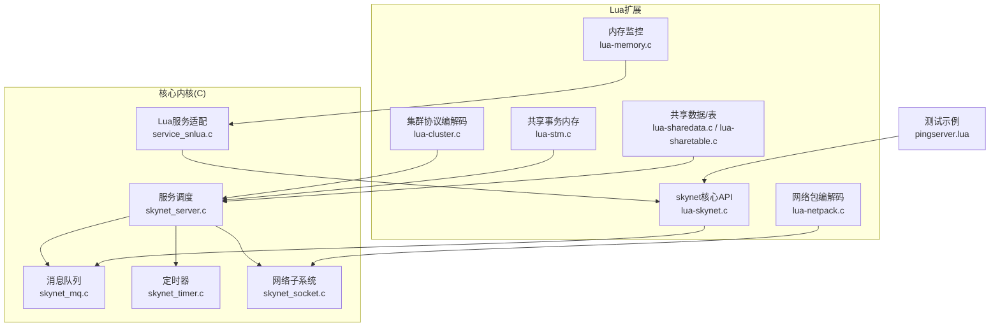
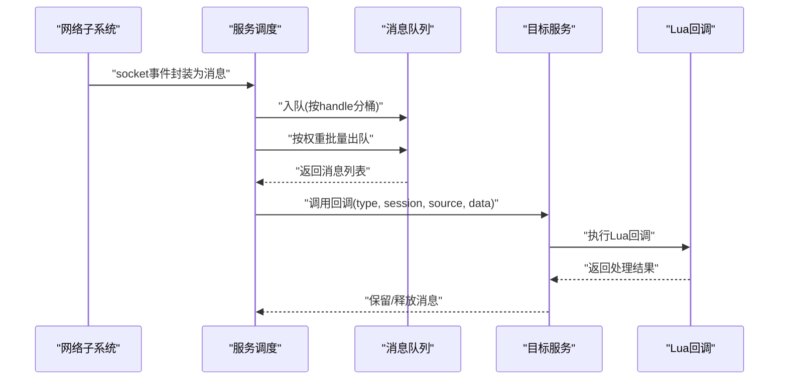
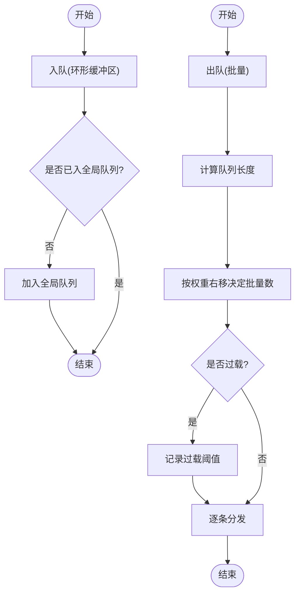
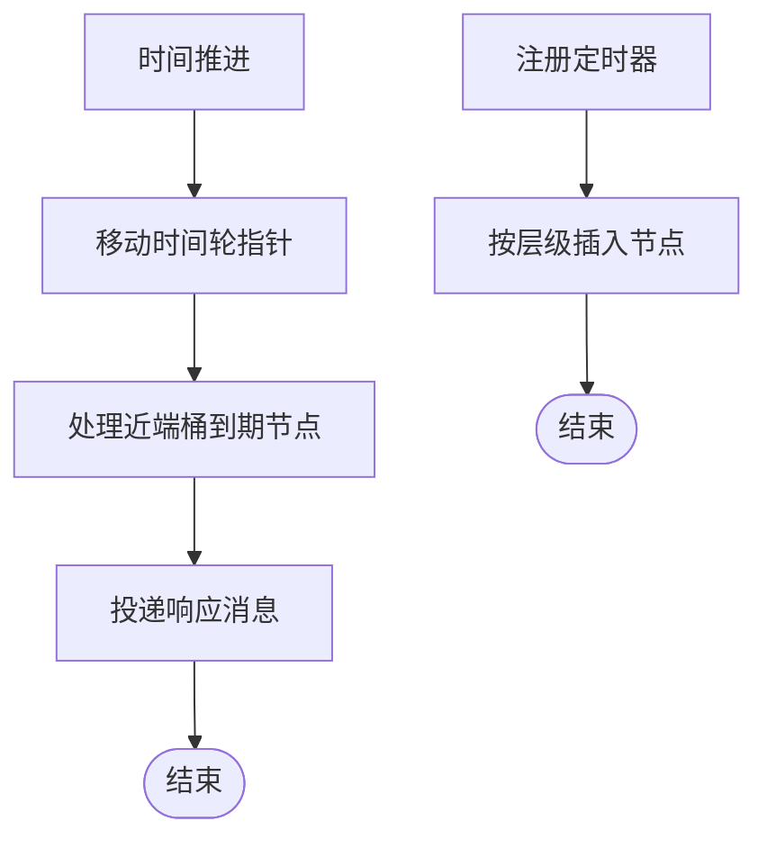
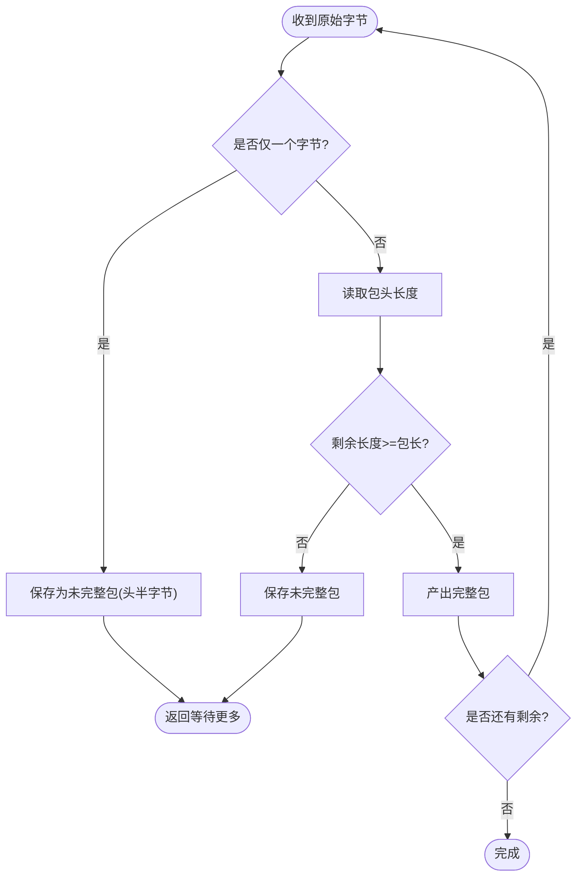
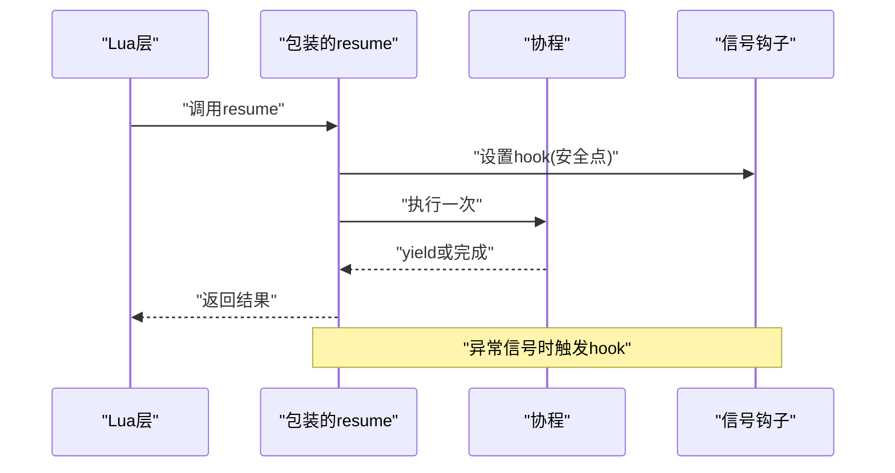
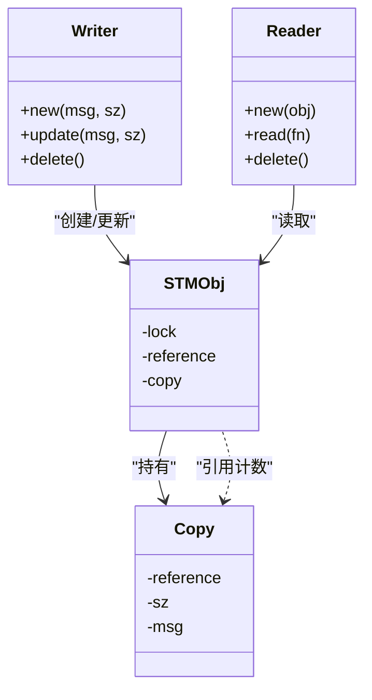
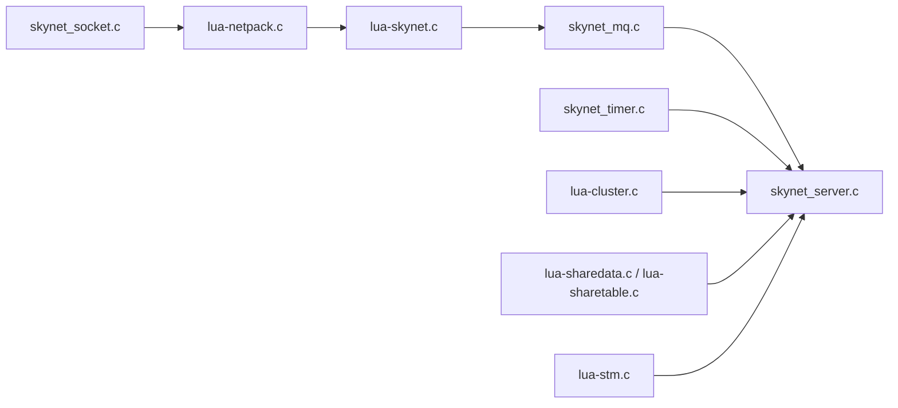

# 运行时性能优化

<cite>
**本文引用的文件**
- [service_snlua.c](file://docker/skynet/service-src/service_snlua.c)
- [skynet_server.c](file://docker/skynet/skynet-src/skynet_server.c)
- [skynet_mq.c](file://docker/skynet/skynet-src/skynet_mq.c)
- [lua-skynet.c](file://docker/skynet/lualib-src/lua-skynet.c)
- [lua-netpack.c](file://docker/skynet/lualib-src/lua-netpack.c)
- [skynet_socket.c](file://docker/skynet/skynet-src/skynet_socket.c)
- [skynet_timer.c](file://docker/skynet/skynet-src/skynet_timer.c)
- [lua-cluster.c](file://docker/skynet/lualib-src/lua-cluster.c)
- [lua-memory.c](file://docker/skynet/lualib-src/lua-memory.c)
- [lua-stm.c](file://docker/skynet/lualib-src/lua-stm.c)
- [lua-sharedata.c](file://docker/skynet/lualib-src/lua-sharedata.c)
- [lua-sharetable.c](file://docker/skynet/lualib-src/lua-sharetable.c)
- [pingserver.lua](file://docker/skynet/test/pingserver.lua)
</cite>

## 目录
1. [引言](#引言)
2. [项目结构](#项目结构)
3. [核心组件](#核心组件)
4. [架构总览](#架构总览)
5. [详细组件分析](#详细组件分析)
6. [依赖关系分析](#依赖关系分析)
7. [性能考量](#性能考量)
8. [故障排查指南](#故障排查指南)
9. [结论](#结论)
10. [附录](#附录)

## 引言
本指南聚焦于Skynet运行时在Actor模型下的性能优化，围绕消息传递效率、协程调度、内存分配与回收、锁竞争与资源共享、负载均衡等主题展开。文档同时对比Node.js与Skynet在并发模型与性能上的差异，给出可操作的优化策略与实测思路，并提供基于仓库现有组件的性能测试方法。

## 项目结构
Skynet由C语言实现的核心内核与Lua扩展组成，核心模块包括消息队列、定时器、网络子系统、服务生命周期管理等；Lua层提供消息发送、序列化、集群通信、共享数据与内存监控等能力。测试示例展示了Actor风格的消息处理与轻量级锁协作模式。

图示来源
- [skynet_server.c:256-347](file://docker/skynet/skynet-src/skynet_server.c#L256-L347)
- [skynet_mq.c:43-96](file://docker/skynet/skynet-src/skynet_mq.c#L43-L96)
- [skynet_timer.c:262-293](file://docker/skynet/skynet-src/skynet_timer.c#L262-L293)
- [skynet_socket.c:37-117](file://docker/skynet/skynet-src/skynet_socket.c#L37-L117)
- [service_snlua.c:384-454](file://docker/skynet/service-src/service_snlua.c#L384-L454)
- [lua-skynet.c:54-88](file://docker/skynet/lualib-src/lua-skynet.c#L54-L88)
- [lua-netpack.c:338-391](file://docker/skynet/lualib-src/lua-netpack.c#L338-L391)
- [lua-cluster.c:206-230](file://docker/skynet/lualib-src/lua-cluster.c#L206-L230)
- [lua-memory.c:9-33](file://docker/skynet/lualib-src/lua-memory.c#L9-L33)
- [lua-stm.c:118-150](file://docker/skynet/lualib-src/lua-stm.c#L118-L150)
- [lua-sharedata.c:406-457](file://docker/skynet/lualib-src/lua-sharedata.c#L406-L457)
- [lua-sharetable.c:172-241](file://docker/skynet/lualib-src/lua-sharetable.c#L172-L241)
- [pingserver.lua:1-54](file://docker/skynet/test/pingserver.lua#L1-L54)

章节来源
- [skynet_server.c:1-120](file://docker/skynet/skynet-src/skynet_server.c#L1-L120)
- [skynet_mq.c:1-80](file://docker/skynet/skynet-src/skynet_mq.c#L1-L80)
- [skynet_socket.c:1-60](file://docker/skynet/skynet-src/skynet_socket.c#L1-L60)
- [service_snlua.c:1-60](file://docker/skynet/service-src/service_snlua.c#L1-L60)

## 核心组件
- 消息队列与调度：支持按权重批量处理、过载检测与全局队列轮转，降低线程上下文切换与锁争用。
- 定时器：多级时间轮，O(1)到期分发，支持微基准计时以评估调度开销。
- 网络子系统：事件驱动，将网络事件封装为消息投递到目标服务，避免阻塞。
- Lua服务适配：替换协程API以统计协程耗时，提供内存限制与信号钩子，便于性能剖析。
- 内存与GC：集成jemalloc，提供内存使用统计、堆分析开关与当前内存查询。
- 共享数据与事务内存：无锁读路径与写者复制，减少锁竞争，适合高并发只读场景。

章节来源
- [skynet_mq.c:111-172](file://docker/skynet/skynet-src/skynet_mq.c#L111-L172)
- [skynet_timer.c:67-178](file://docker/skynet/skynet-src/skynet_timer.c#L67-L178)
- [skynet_socket.c:37-117](file://docker/skynet/skynet-src/skynet_socket.c#L37-L117)
- [service_snlua.c:133-229](file://docker/skynet/service-src/service_snlua.c#L133-L229)
- [lua-memory.c:9-33](file://docker/skynet/lualib-src/lua-memory.c#L9-L33)
- [lua-stm.c:106-115](file://docker/skynet/lualib-src/lua-stm.c#L106-L115)
- [lua-sharedata.c:406-457](file://docker/skynet/lualib-src/lua-sharedata.c#L406-L457)

## 架构总览
Skynet采用“服务即Actor”的模型：每个服务拥有独立消息队列与回调函数，消息通过统一入口进入，按权重批量出队处理，避免单条消息带来的频繁唤醒与锁竞争。网络事件被转换为消息后投递到对应服务，定时器到期也以消息形式触发回调。

图示来源
- [skynet_socket.c:37-117](file://docker/skynet/skynet-src/skynet_socket.c#L37-L117)
- [skynet_server.c:292-347](file://docker/skynet/skynet-src/skynet_server.c#L292-L347)
- [skynet_mq.c:137-172](file://docker/skynet/skynet-src/skynet_mq.c#L137-L172)
- [lua-skynet.c:54-88](file://docker/skynet/lualib-src/lua-skynet.c#L54-L88)

## 详细组件分析

### 组件A：消息队列与批量处理
- 批量权重：根据队列长度右移权重决定单次处理消息数，避免频繁唤醒与锁竞争。
- 过载阈值：动态指数增长阈值，配合日志告警，便于定位瓶颈。
- 入队/出队：环形缓冲区，必要时扩容；首次入队即加入全局队列，提升调度公平性。

图示来源
- [skynet_mq.c:189-209](file://docker/skynet/skynet-src/skynet_mq.c#L189-L209)
- [skynet_mq.c:137-172](file://docker/skynet/skynet-src/skynet_mq.c#L137-L172)
- [skynet_server.c:292-347](file://docker/skynet/skynet-src/skynet_server.c#L292-L347)

章节来源
- [skynet_mq.c:111-172](file://docker/skynet/skynet-src/skynet_mq.c#L111-L172)
- [skynet_server.c:292-347](file://docker/skynet/skynet-src/skynet_server.c#L292-L347)

### 组件B：定时器与CPU时间统计
- 多级时间轮：近端桶与时钟位分层组织，到期节点迁移至近端桶，O(1)分发。
- CPU时间：线程CPU时间基准用于服务回调耗时统计，支持按服务维度分析热点。

图示来源
- [skynet_timer.c:111-178](file://docker/skynet/skynet-src/skynet_timer.c#L111-L178)
- [skynet_timer.c:282-293](file://docker/skynet/skynet-src/skynet_timer.c#L282-L293)

章节来源
- [skynet_timer.c:67-178](file://docker/skynet/skynet-src/skynet_timer.c#L67-L178)
- [skynet_server.c:268-279](file://docker/skynet/skynet-src/skynet_server.c#L268-L279)

### 组件C：网络编解码与连接复用
- 包头格式：固定长度包头编码长度，支持小包合并与大包拆分。
- 未完整包缓存：fd哈希链表保存未完整包，拼装完成后一次性投递。
- Lua侧过滤：将socket消息转换为统一类型，便于上层业务处理。

图示来源
- [lua-netpack.c:189-216](file://docker/skynet/lualib-src/lua-netpack.c#L189-L216)
- [lua-netpack.c:228-308](file://docker/skynet/lualib-src/lua-netpack.c#L228-L308)
- [skynet_socket.c:37-117](file://docker/skynet/skynet-src/skynet_socket.c#L37-L117)

章节来源
- [lua-netpack.c:189-308](file://docker/skynet/lualib-src/lua-netpack.c#L189-L308)
- [skynet_socket.c:37-117](file://docker/skynet/skynet-src/skynet_socket.c#L37-L117)

### 组件D：Lua服务适配与协程剖析
- 协程包装：替换coroutine.resume/wrap，统计每次resume耗时与累计耗时。
- 内存限制：自定义分配器，超过阈值拒绝增长，避免内存雪崩。
- 信号钩子：捕获信号后设置hook，使协程在安全点退出。

图示来源
- [service_snlua.c:133-229](file://docker/skynet/service-src/service_snlua.c#L133-L229)
- [service_snlua.c:482-500](file://docker/skynet/service-src/service_snlua.c#L482-L500)
- [service_snlua.c:534-549](file://docker/skynet/service-src/service_snlua.c#L534-L549)

章节来源
- [service_snlua.c:133-229](file://docker/skynet/service-src/service_snlua.c#L133-L229)
- [service_snlua.c:482-500](file://docker/skynet/service-src/service_snlua.c#L482-L500)

### 组件E：共享数据与事务内存（STM）
- 读写分离：读者持有对象引用，拷贝持有引用计数，写者更新新拷贝，旧拷贝延迟释放。
- 低锁路径：读路径无锁，写路径仅在更新阶段加写锁，显著降低锁竞争。
- 适用场景：高并发只读共享配置、状态快照等。

图示来源
- [lua-stm.c:118-150](file://docker/skynet/lualib-src/lua-stm.c#L118-L150)
- [lua-stm.c:178-235](file://docker/skynet/lualib-src/lua-stm.c#L178-L235)

章节来源
- [lua-stm.c:106-115](file://docker/skynet/lualib-src/lua-stm.c#L106-L115)
- [lua-stm.c:178-235](file://docker/skynet/lualib-src/lua-stm.c#L178-L235)

### 组件F：共享数据与共享表
- 共享数据：将Lua表转换为紧凑内存布局，字符串去重索引，支持跨服务只读共享。
- 共享表：对表与字符串进行共享标记，减少复制与GC压力，适合静态配置矩阵。

章节来源
- [lua-sharedata.c:406-457](file://docker/skynet/lualib-src/lua-sharedata.c#L406-L457)
- [lua-sharetable.c:172-241](file://docker/skynet/lualib-src/lua-sharetable.c#L172-L241)

## 依赖关系分析
- 服务调度依赖消息队列与定时器，网络子系统通过socket_server将事件转化为消息投递。
- Lua核心API封装C回调，将消息参数映射为Lua函数调用，便于业务逻辑编写。
- 集群模块负责请求/响应打包与分片传输，配合共享数据实现跨节点共享。

图示来源
- [skynet_socket.c:37-117](file://docker/skynet/skynet-src/skynet_socket.c#L37-L117)
- [lua-netpack.c:338-391](file://docker/skynet/lualib-src/lua-netpack.c#L338-L391)
- [lua-skynet.c:54-88](file://docker/skynet/lualib-src/lua-skynet.c#L54-L88)
- [skynet_mq.c:43-96](file://docker/skynet/skynet-src/skynet_mq.c#L43-L96)
- [skynet_server.c:292-347](file://docker/skynet/skynet-src/skynet_server.c#L292-L347)
- [skynet_timer.c:165-178](file://docker/skynet/skynet-src/skynet_timer.c#L165-L178)
- [lua-cluster.c:206-230](file://docker/skynet/lualib-src/lua-cluster.c#L206-L230)
- [lua-sharedata.c:406-457](file://docker/skynet/lualib-src/lua-sharedata.c#L406-L457)
- [lua-sharetable.c:172-241](file://docker/skynet/lualib-src/lua-sharetable.c#L172-L241)
- [lua-stm.c:118-150](file://docker/skynet/lualib-src/lua-stm.c#L118-L150)

章节来源
- [skynet_server.c:292-347](file://docker/skynet/skynet-src/skynet_server.c#L292-L347)
- [skynet_mq.c:43-96](file://docker/skynet/skynet-src/skynet_mq.c#L43-L96)
- [skynet_timer.c:165-178](file://docker/skynet/skynet-src/skynet_timer.c#L165-L178)
- [skynet_socket.c:37-117](file://docker/skynet/skynet-src/skynet_socket.c#L37-L117)

## 性能考量
- 消息传递效率
  - 批量权重：通过消息队列长度右移确定批量数，减少调度次数与锁持有时间。
  - 过载检测：动态阈值与日志告警，帮助识别背压与热点服务。
  - 参考路径：[skynet_server.c:312-323](file://docker/skynet/skynet-src/skynet_server.c#L312-L323)、[skynet_mq.c:127-135](file://docker/skynet/skynet-src/skynet_mq.c#L127-L135)

- 协程调度与CPU时间
  - 时间轮定时器与线程CPU时间基准，支持服务回调耗时统计与热点定位。
  - 参考路径：[skynet_timer.c:282-293](file://docker/skynet/skynet-src/skynet_timer.c#L282-L293)

- 内存分配与回收
  - 自定义分配器与内存限制，防止内存泄漏导致的抖动。
  - jemalloc统计与堆分析开关，支持实时内存画像。
  - 参考路径：[service_snlua.c:482-500](file://docker/skynet/service-src/service_snlua.c#L482-L500)、[lua-memory.c:9-33](file://docker/skynet/lualib-src/lua-memory.c#L9-L33)

- 锁竞争与资源共享
  - STM读写分离与写者复制，降低锁竞争，适合高并发只读场景。
  - 共享数据/表减少复制与GC压力，适合静态配置共享。
  - 参考路径：[lua-stm.c:106-115](file://docker/skynet/lualib-src/lua-stm.c#L106-L115)、[lua-sharedata.c:406-457](file://docker/skynet/lualib-src/lua-sharedata.c#L406-L457)、[lua-sharetable.c:172-241](file://docker/skynet/lualib-src/lua-sharetable.c#L172-L241)

- 并发编程中的负载均衡
  - 全局队列轮转与按权重批量处理，避免单队列饥饿。
  - 参考路径：[skynet_server.c:336-346](file://docker/skynet/skynet-src/skynet_server.c#L336-L346)

- Node.js vs Skynet 对比要点
  - 并发模型：Node.js基于事件循环与单线程回调；Skynet基于多服务Actor模型，消息队列与批量处理更利于CPU亲和与锁粒度控制。
  - 调度特性：Skynet的时间轮与批量权重更适合高吞吐、低抖动场景；Node.js在I/O密集型任务中表现优异，但回调链深可能带来延迟抖动。
  - 内存管理：Skynet可结合jemalloc与自定义分配器进行更精细的内存控制；Node.js依赖V8 GC，适合短生命周期对象，长生命周期对象需谨慎管理。

## 故障排查指南
- 消息过载与积压
  - 观察队列长度与过载阈值日志，定位热点服务与慢消费者。
  - 参考路径：[skynet_mq.c:127-135](file://docker/skynet/skynet-src/skynet_mq.c#L127-L135)

- 回调耗时异常
  - 启用服务统计CPU耗时，结合协程剖析统计定位耗时点。
  - 参考路径：[skynet_server.c:268-279](file://docker/skynet/skynet-src/skynet_server.c#L268-L279)、[service_snlua.c:133-229](file://docker/skynet/service-src/service_snlua.c#L133-L229)

- 内存异常
  - 使用内存监控接口查看当前与峰值内存，开启堆分析导出。
  - 参考路径：[lua-memory.c:9-33](file://docker/skynet/lualib-src/lua-memory.c#L9-L33)

- 网络包解析问题
  - 检查包头长度与未完整包缓存逻辑，确认拼装后一次性投递。
  - 参考路径：[lua-netpack.c:189-308](file://docker/skynet/lualib-src/lua-netpack.c#L189-L308)

章节来源
- [skynet_mq.c:127-135](file://docker/skynet/skynet-src/skynet_mq.c#L127-L135)
- [skynet_server.c:268-279](file://docker/skynet/skynet-src/skynet_server.c#L268-L279)
- [service_snlua.c:133-229](file://docker/skynet/service-src/service_snlua.c#L133-L229)
- [lua-memory.c:9-33](file://docker/skynet/lualib-src/lua-memory.c#L9-L33)
- [lua-netpack.c:189-308](file://docker/skynet/lualib-src/lua-netpack.c#L189-L308)

## 结论
Skynet通过消息队列批量处理、多级时间轮定时器、网络事件消息化、协程剖析与内存控制等手段，在高并发场景下提供了稳定且可观测的性能基线。结合STM与共享数据/表，可在保证一致性的同时降低锁竞争。针对不同业务形态，建议优先优化消息批量权重、网络编解码路径与共享数据的访问模式，并建立完善的性能指标与告警体系。

## 附录
- 实际性能测试与优化建议
  - 基准测试思路：利用定时器基准与服务回调CPU时间统计，测量消息往返延迟分布与P99/P999；通过批量权重调整观察吞吐与抖动变化。
  - 优化策略：消息批处理、连接池复用、共享数据只读路径、STM写者复制、jemalloc参数调优。
  - 测试示例参考：Actor风格的sleep与锁协作，验证队列与锁的性能影响。
    - 参考路径：[pingserver.lua:16-34](file://docker/skynet/test/pingserver.lua#L16-L34)

章节来源
- [pingserver.lua:16-34](file://docker/skynet/test/pingserver.lua#L16-L34)