# 扩展开发

<cite>
**本文档引用的文件**
- [README.md](file://README.md)
- [架构设计文档.md](file://docs/架构设计文档.md)
- [interfaces.ts](file://server/src/framework/core/interfaces.ts)
- [async-bridge.ts](file://server/src/framework/runtime/async-bridge.ts)
- [node-adapter.lua](file://docker/lua/framework/runtime/node-adapter.lua)
- [skynet-adapter.lua](file://docker/lua/framework/runtime/skynet-adapter.lua)
- [node-pb-codec.lua](file://docker/lua/framework/runtime/node-pb-codec.lua)
- [skynet-pb-codec.lua](file://docker/lua/framework/runtime/skynet-pb-codec.lua)
- [proto.config.json](file://protocols/proto.config.json)
- [README.md](file://protocols/README.md)
- [config.tslua](file://docker/config/skynet/config.tslua)
- [tsconfig.lua.json](file://server/config/tsconfig.lua.json)
- [index.ts](file://server/scripts/cli/index.ts)
- [package.json](file://server/package.json)
</cite>

## 目录
1. [引言](#引言)
2. [项目结构](#项目结构)
3. [核心组件](#核心组件)
4. [架构概览](#架构概览)
5. [详细组件分析](#详细组件分析)
6. [依赖分析](#依赖分析)
7. [性能考虑](#性能考虑)
8. [故障排除指南](#故障排除指南)
9. [结论](#结论)
10. [附录](#附录)

## 引言

TS-Skynet 混合开发框架是一个创新的游戏服务端开发解决方案，它解决了 Skynet 性能卓越但 Lua 开发缺乏类型安全和现代工程化能力，以及 TypeScript 开发体验优秀但直接运行在 Node.js 缺乏 Skynet 的 Actor 模型之间的核心痛点。

本框架的核心价值在于：
- ✨ 使用 TypeScript 编写业务逻辑，享受类型安全和 IDE 智能提示
- 🧪 在 Node.js 环境下快速验证逻辑和运行单元测试
- 🚀 编译为 Lua 后在 Skynet 中高性能运行
- 🔄 一套代码，双环境运行

## 项目结构

项目采用模块化设计，主要分为以下几个核心部分：

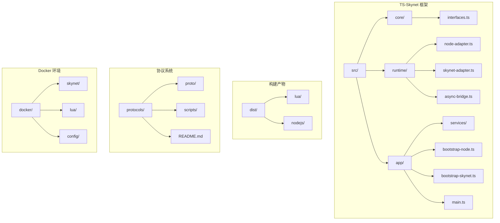

**图表来源**
- [README.md:136-193](file://README.md#L136-L193)
- [架构设计文档.md:17-77](file://docs/架构设计文档.md#L17-L77)

**章节来源**
- [README.md:136-193](file://README.md#L136-L193)
- [架构设计文档.md:17-77](file://docs/架构设计文档.md#L17-L77)

## 核心组件

### 抽象接口层

框架的核心是抽象接口层，它定义了跨平台兼容的接口规范：

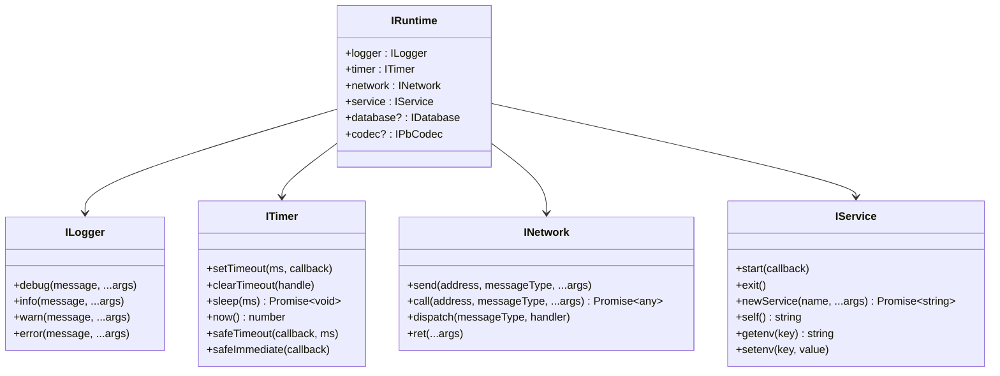

**图表来源**
- [interfaces.ts:9-196](file://server/src/framework/core/interfaces.ts#L9-L196)

### 运行时适配器

框架提供了两种运行时适配器，分别针对不同的执行环境：

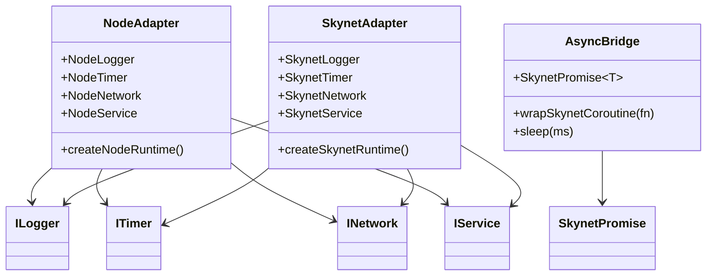

**图表来源**
- [node-adapter.lua:14-205](file://docker/lua/framework/runtime/node-adapter.lua#L14-L205)
- [skynet-adapter.lua:19-225](file://docker/lua/framework/runtime/skynet-adapter.lua#L19-L225)
- [async-bridge.ts:23-207](file://server/src/framework/runtime/async-bridge.ts#L23-L207)

**章节来源**
- [interfaces.ts:9-196](file://server/src/framework/core/interfaces.ts#L9-L196)
- [node-adapter.lua:14-205](file://docker/lua/framework/runtime/node-adapter.lua#L14-L205)
- [skynet-adapter.lua:19-225](file://docker/lua/framework/runtime/skynet-adapter.lua#L19-L225)
- [async-bridge.ts:23-207](file://server/src/framework/runtime/async-bridge.ts#L23-L207)

## 架构概览

框架采用分层架构设计，实现了跨平台的统一抽象：

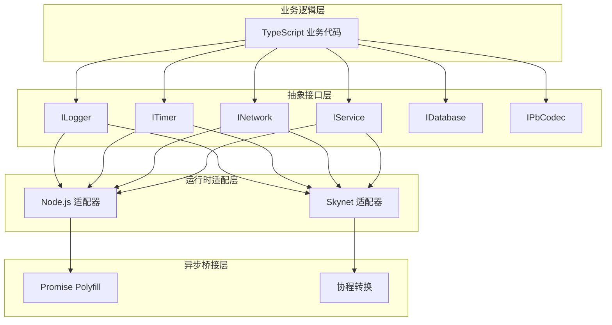

**图表来源**
- [架构设计文档.md:111-134](file://docs/架构设计文档.md#L111-L134)
- [README.md:283-326](file://README.md#L283-L326)

## 详细组件分析

### 自定义运行时适配器开发

#### 接口实现指南

要开发自定义运行时适配器，需要实现以下接口：

1. **日志接口实现**
```typescript
// 示例：自定义日志适配器
class CustomLogger implements ILogger {
    debug(message: string, ...args: any[]): void {
        // 实现自定义日志逻辑
    }
    
    info(message: string, ...args: any[]): void {
        // 实现自定义日志逻辑
    }
    
    warn(message: string, ...args: any[]): void {
        // 实现自定义日志逻辑
    }
    
    error(message: string, ...args: any[]): void {
        // 实现自定义日志逻辑
    }
}
```

2. **定时器接口实现**
```typescript
// 示例：自定义定时器适配器
class CustomTimer implements ITimer {
    setTimeout(ms: number, callback: () => void): any {
        // 实现自定义定时器逻辑
    }
    
    clearTimeout(handle: any): void {
        // 实现清除定时器逻辑
    }
    
    async sleep(ms: number): Promise<void> {
        // 实现异步睡眠逻辑
    }
    
    now(): number {
        // 返回当前时间戳
    }
}
```

3. **网络接口实现**
```typescript
// 示例：自定义网络适配器
class CustomNetwork implements INetwork {
    send(address: string, messageType: string, ...args: any[]): void {
        // 实现消息发送逻辑
    }
    
    async call(address: string, messageType: string, ...args: any[]): Promise<any> {
        // 实现远程调用逻辑
    }
    
    dispatch(messageType: string, handler: (session: number, source: string, ...args: any[]) => void | Promise<void>): void {
        // 实现消息处理器注册
    }
    
    ret(...args: any[]): void {
        // 实现响应返回逻辑
    }
}
```

4. **服务接口实现**
```typescript
// 示例：自定义服务适配器
class CustomService implements IService {
    start(callback: () => void | Promise<void>): void {
        // 实现服务启动逻辑
    }
    
    exit(): void {
        // 实现服务退出逻辑
    }
    
    async newService(name: string, ...args: any[]): Promise<string> {
        // 实现新服务创建逻辑
    }
    
    self(): string {
        // 返回当前服务地址
    }
    
    getenv(key: string): string | undefined {
        // 获取环境变量
    }
    
    setenv(key: string, value: string): void {
        // 设置环境变量
    }
}
```

#### 兼容性保证

为了确保适配器的兼容性，需要遵循以下原则：

1. **异步模型统一**
   - 所有异步操作必须返回 Promise
   - 遵循 async/await 语法规范

2. **接口契约**
   - 严格实现接口定义的方法签名
   - 保持方法参数和返回值类型一致

3. **错误处理**
   - 统一的错误处理机制
   - 明确的异常抛出策略

**章节来源**
- [interfaces.ts:9-196](file://server/src/framework/core/interfaces.ts#L9-L196)
- [node-adapter.lua:14-205](file://docker/lua/framework/runtime/node-adapter.lua#L14-L205)
- [skynet-adapter.lua:19-225](file://docker/lua/framework/runtime/skynet-adapter.lua#L19-L225)

### 新服务开发流程

#### 服务架构设计

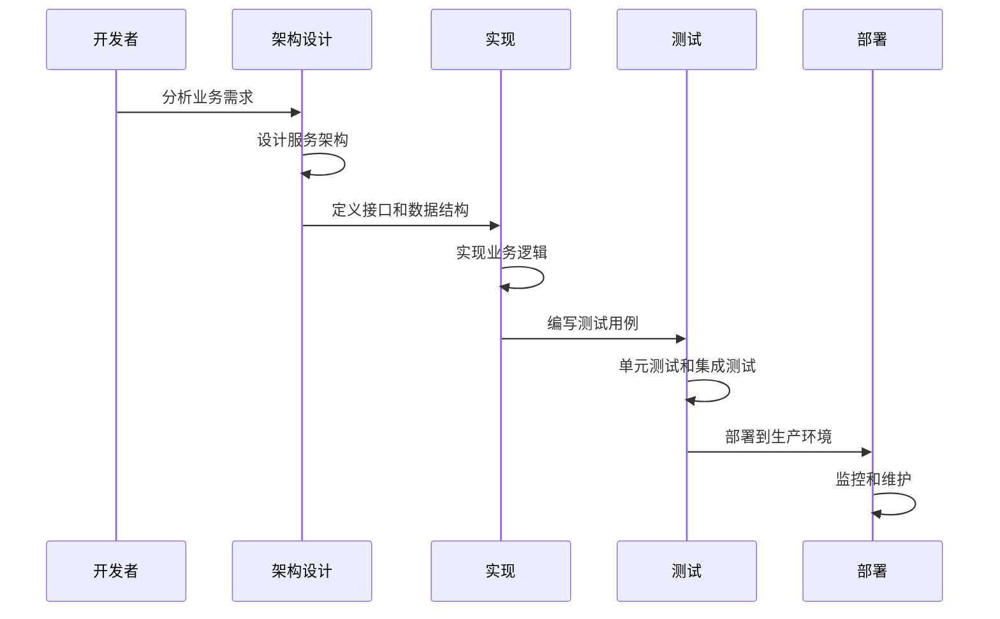

#### 接口定义

1. **服务接口定义**
```typescript
// 服务接口示例
export interface ILoginService {
    handleLogin(request: LoginRequest): Promise<LoginResponse>;
    handleLogout(userId: number): Promise<boolean>;
    validateToken(token: string): Promise<boolean>;
}

export interface LoginRequest {
    username: string;
    password: string;
    deviceId?: string;
    platform?: string;
}

export interface LoginResponse {
    success: boolean;
    user?: User;
    error?: string;
    token?: string;
}
```

2. **数据模型定义**
```typescript
export interface User {
    userId: number;
    username: string;
    email?: string;
    createdAt: number;
    lastLogin?: number;
    isActive: boolean;
}
```

#### 实现开发

1. **服务实现**
```typescript
export class LoginService implements ILoginService {
    private users: Map<number, User> = new Map();
    private nextUserId: number = 1;
    
    async handleLogin(request: LoginRequest): Promise<LoginResponse> {
        try {
            // 验证输入参数
            if (!request.username || !request.password) {
                return {
                    success: false,
                    error: '用户名和密码不能为空'
                };
            }
            
            // 模拟用户验证
            await runtime.timer.sleep(100);
            
            // 创建用户对象
            const user: User = {
                userId: this.nextUserId++,
                username: request.username,
                email: `${request.username}@example.com`,
                createdAt: runtime.timer.now(),
                lastLogin: runtime.timer.now(),
                isActive: true
            };
            
            this.users.set(user.userId, user);
            
            // 生成令牌
            const token = this.generateToken(user);
            
            return {
                success: true,
                user: user,
                token: token
            };
        } catch (error) {
            return {
                success: false,
                error: error instanceof Error ? error.message : '登录失败'
            };
        }
    }
    
    async handleLogout(userId: number): Promise<boolean> {
        return this.users.delete(userId);
    }
    
    validateToken(token: string): Promise<boolean> {
        // 实现令牌验证逻辑
        return Promise.resolve(true);
    }
    
    private generateToken(user: User): string {
        return `${user.username}_${user.userId}_${runtime.timer.now()}`;
    }
}
```

2. **服务启动**
```typescript
export async function main(): Promise<void> {
    const service = new LoginService();
    
    runtime.service.start(async () => {
        runtime.logger.info('=== Login Service Starting ===');
        await service.init();
        runtime.logger.info('=== Login Service Ready ===');
    });
}
```

#### 测试验证

1. **单元测试**
```typescript
describe('LoginService', () => {
    let service: LoginService;
    let mockRuntime: MockRuntime;
    
    beforeEach(() => {
        service = new LoginService();
        mockRuntime = createMockRuntime();
        setRuntime(mockRuntime);
    });
    
    it('should handle login successfully', async () => {
        const request: LoginRequest = {
            username: 'testuser',
            password: 'password123'
        };
        
        const result = await service.handleLogin(request);
        
        expect(result.success).toBe(true);
        expect(result.user).toBeDefined();
        expect(result.token).toBeDefined();
    });
    
    it('should handle invalid credentials', async () => {
        const request: LoginRequest = {
            username: '',
            password: ''
        };
        
        const result = await service.handleLogin(request);
        
        expect(result.success).toBe(false);
        expect(result.error).toBeDefined();
    });
});
```

2. **集成测试**
```typescript
describe('LoginService Integration', () => {
    let loginService: string;
    
    beforeAll(async () => {
        // 创建登录服务实例
        loginService = await runtime.service.newService('login');
    });
    
    it('should respond to login requests', async () => {
        const request: LoginRequest = {
            username: 'integration_user',
            password: 'test_password'
        };
        
        const response = await runtime.network.call(
            loginService,
            'lua',
            'login',
            request.username,
            request.password
        );
        
        expect(response).toBeDefined();
        expect(typeof response).toBe('object');
    });
});
```

**章节来源**
- [interfaces.ts:88-138](file://server/src/framework/core/interfaces.ts#L88-L138)
- [README.md:393-492](file://README.md#L393-L492)

### 插件系统扩展机制

#### 钩子函数实现

框架支持通过钩子函数实现插件扩展：

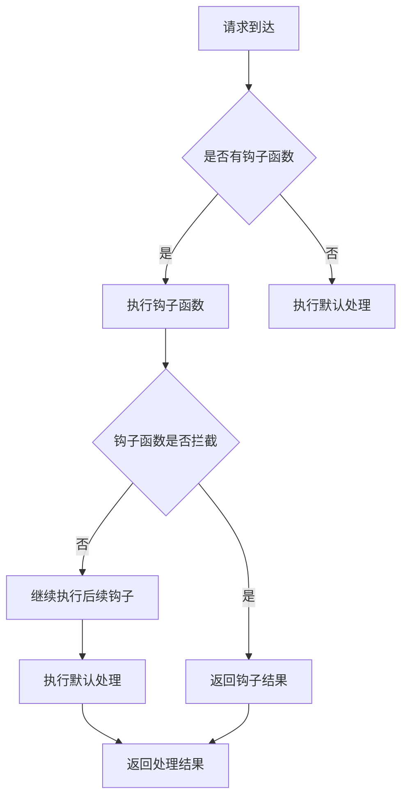

#### 事件系统

```typescript
// 事件总线接口
export interface IEventBus {
    subscribe(event: string, handler: EventCallback): void;
    unsubscribe(event: string, handler: EventCallback): void;
    publish(event: string, data?: any): void;
}

// 事件回调类型
export type EventCallback = (data?: any) => void | Promise<void>;

// 事件系统实现
export class EventBus implements IEventBus {
    private handlers: Map<string, EventCallback[]> = new Map();
    
    subscribe(event: string, handler: EventCallback): void {
        if (!this.handlers.has(event)) {
            this.handlers.set(event, []);
        }
        this.handlers.get(event)!.push(handler);
    }
    
    unsubscribe(event: string, handler: EventCallback): void {
        const eventHandlers = this.handlers.get(event);
        if (eventHandlers) {
            const index = eventHandlers.indexOf(handler);
            if (index > -1) {
                eventHandlers.splice(index, 1);
            }
        }
    }
    
    publish(event: string, data?: any): void {
        const eventHandlers = this.handlers.get(event);
        if (eventHandlers) {
            eventHandlers.forEach(handler => {
                try {
                    handler(data);
                } catch (error) {
                    runtime.logger.error(`Event handler error: ${error}`);
                }
            });
        }
    }
}
```

#### 中间件机制

```typescript
// 中间件接口
export interface IMiddleware {
    handle(context: MiddlewareContext, next: NextFunction): Promise<void>;
}

// 中间件上下文
export interface MiddlewareContext {
    request: any;
    response: any;
    service: string;
    method: string;
}

// 下一个中间件函数
export type NextFunction = () => Promise<void>;

// 中间件管道
export class MiddlewarePipeline {
    private middlewares: IMiddleware[] = [];
    
    use(middleware: IMiddleware): void {
        this.middlewares.push(middleware);
    }
    
    async execute(context: MiddlewareContext): Promise<void> {
        const executeMiddleware = async (index: number) => {
            if (index >= this.middlewares.length) {
                return;
            }
            
            const middleware = this.middlewares[index];
            await middleware.handle(context, () => executeMiddleware(index + 1));
        };
        
        await executeMiddleware(0);
    }
}
```

**章节来源**
- [interfaces.ts:189-226](file://server/src/framework/core/interfaces.ts#L189-L226)

### 自定义协议开发

#### 协议定义

1. **Protocol Buffers 定义**
```protobuf
// common.proto
syntax = "proto3";

package common;

// 通用响应结构
message Response {
    int32 code = 1;
    string message = 2;
    bytes data = 3;
}

// 消息包装
message Packet {
    int32 msg_id = 1;
    int32 session = 2;
    int64 timestamp = 3;
    bytes data = 4;
}

// 错误码定义
enum ErrorCode {
    SUCCESS = 0;
    UNKNOWN_ERROR = 1;
    INVALID_REQUEST = 2;
    AUTH_FAILED = 3;
}
```

2. **消息ID分配**
```protobuf
// message_id.proto
syntax = "proto3";

package common;

// 消息ID枚举
enum MessageId {
    // 系统消息: 1-99
    SYS_HEARTBEAT_REQ = 1;
    SYS_HEARTBEAT_RESP = 2;
    
    // 网关服务: 100-199
    GW_CONNECT_REQ = 100;
    GW_CONNECT_RESP = 101;
    GW_DISCONNECT_REQ = 102;
    GW_DISCONNECT_RESP = 103;
    
    // 登录服务: 200-299
    LOGIN_LOGIN_REQ = 200;
    LOGIN_LOGIN_RESP = 201;
    LOGIN_LOGOUT_REQ = 202;
    LOGIN_LOGOUT_RESP = 203;
    
    // 游戏服务: 300-399
    GAME_ENTER_GAME_REQ = 300;
    GAME_ENTER_GAME_RESP = 301;
    GAME_LEAVE_GAME_REQ = 302;
    GAME_LEAVE_GAME_RESP = 303;
}
```

#### 编解码实现

1. **Node.js 编解码器**
```typescript
// Node.js 协议编解码器
class NodePbCodec implements IPbCodec {
    private proto: any;
    private root: any;
    
    constructor() {
        this.initProto();
    }
    
    private initProto(): void {
        try {
            // 动态加载协议模块
            const protoModule = require('../../protos/proto');
            this.proto = protoModule.proto;
            this.root = protoModule;
        } catch (error) {
            console.warn('[NodePbCodec] Failed to load proto module:', error);
        }
    }
    
    encode(messageType: string, message: any): Uint8Array {
        if (!this.proto) {
            throw new Error('[NodePbCodec] Proto module not loaded');
        }
        
        const [namespace, typeName] = messageType.split('.');
        const type = this.proto[namespace][typeName];
        if (!type) {
            throw new Error(`[NodePbCodec] Unknown message type: ${messageType}`);
        }
        
        return type.encode(message).finish();
    }
    
    decode(messageType: string, data: Uint8Array): any {
        if (!this.proto) {
            throw new Error('[NodePbCodec] Proto module not loaded');
        }
        
        const [namespace, typeName] = messageType.split('.');
        const type = this.proto[namespace][typeName];
        if (!type) {
            throw new Error(`[NodePbCodec] Unknown message type: ${messageType}`);
        }
        
        return type.decode(data);
    }
    
    create(messageType: string, init?: any): any {
        if (!this.proto) {
            throw new Error('[NodePbCodec] Proto module not loaded');
        }
        
        const [namespace, typeName] = messageType.split('.');
        const type = this.proto[namespace][typeName];
        if (!type) {
            throw new Error(`[NodePbCodec] Unknown message type: ${messageType}`);
        }
        
        return type.create(init);
    }
    
    pack(msgId: number, messageType: string, message: any, session?: number): Uint8Array {
        const payload = this.encode(messageType, message);
        const timestamp = Math.floor(Date.now() / 1000);
        
        const packet = this.proto.common.Packet.create({
            msgId: msgId,
            session: session || 0,
            data: payload,
            timestamp: timestamp
        });
        
        return this.proto.common.Packet.encode(packet).finish();
    }
    
    unpack(data: Uint8Array): { msgId: number; messageType: string; message: any; session: number } {
        const packet = this.proto.common.Packet.decode(data);
        const messageType = MSG_ID_TO_NAME[packet.msgId];
        
        if (!messageType) {
            throw new Error(`[NodePbCodec] Unknown msgId: ${packet.msgId}`);
        }
        
        const message = this.decode(messageType, packet.data);
        
        return {
            msgId: packet.msgId,
            messageType: messageType,
            message: message,
            session: packet.session
        };
    }
}
```

2. **Skynet 编解码器**
```typescript
// Skynet 协议编解码器
class SkynetPbCodec implements IPbCodec {
    private initialized: boolean = false;
    private protoRoot: string = '';
    
    constructor() {
        this.initProto();
    }
    
    private initProto(): void {
        try {
            // 检查 Protobuf 库可用性
            const hasPb = pcall(() => {
                require('pb');
                require('protoc');
            });
            
            if (!hasPb) {
                console.warn('[SkynetPbCodec] Protobuf library not available');
                return;
            }
            
            this.protoRoot = './lua/protos';
            const protoFiles = [
                'common_pb.desc',
                'login_pb.desc',
                'game_pb.desc',
                'gateway_pb.desc',
                'message_id_pb.desc'
            ];
            
            // 加载协议描述文件
            protoFiles.forEach(file => {
                const filepath = this.protoRoot + '/' + file;
                const f = io.open(filepath, 'rb');
                if (f) {
                    const data = f.read('*all');
                    f.close();
                    const ok = pb.load(data);
                    if (ok) {
                        console.log('[SkynetPbCodec] Loaded ' + file);
                    }
                }
            });
            
            this.initialized = true;
            console.log('[SkynetPbCodec] Initialized');
        } catch (error) {
            console.error('[SkynetPbCodec] Initialization failed:', error);
        }
    }
    
    encode(messageType: string, message: any): Uint8Array {
        if (!this.initialized) {
            throw new Error('[SkynetPbCodec] Protobuf not available');
        }
        
        const encoded = pb.encode(messageType, message);
        if (!encoded) {
            throw new Error(`[SkynetPbCodec] Failed to encode ${messageType}`);
        }
        
        return encoded;
    }
    
    decode(messageType: string, data: Uint8Array): any {
        if (!this.initialized) {
            throw new Error('[SkynetPbCodec] Protobuf not available');
        }
        
        const decoded = pb.decode(messageType, data);
        if (!decoded) {
            throw new Error(`[SkynetPbCodec] Failed to decode ${messageType}`);
        }
        
        return decoded;
    }
    
    create(messageType: string, init?: any): any {
        return init || {};
    }
    
    pack(msgId: number, messageType: string, message: any, session?: number): Uint8Array {
        if (!this.initialized) {
            throw new Error('[SkynetPbCodec] Protobuf not available');
        }
        
        const payload = this.encode(messageType, message);
        const timestamp = skynet.time();
        
        const packet = {
            msgId: msgId,
            session: session || 0,
            data: payload,
            timestamp: timestamp
        };
        
        return this.encode('common.Packet', packet);
    }
    
    unpack(data: Uint8Array): { msgId: number; messageType: string; message: any; session: number } {
        if (!this.initialized) {
            throw new Error('[SkynetPbCodec] Protobuf not available');
        }
        
        const packet = this.decode('common.Packet', data);
        const messageType = MSG_ID_TO_NAME[packet.msgId];
        
        if (!messageType) {
            throw new Error(`[SkynetPbCodec] Unknown msgId: ${packet.msgId}`);
        }
        
        const message = this.decode(messageType, packet.data);
        
        return {
            msgId: packet.msgId,
            messageType: messageType,
            message: message,
            session: packet.session
        };
    }
}
```

#### 版本管理

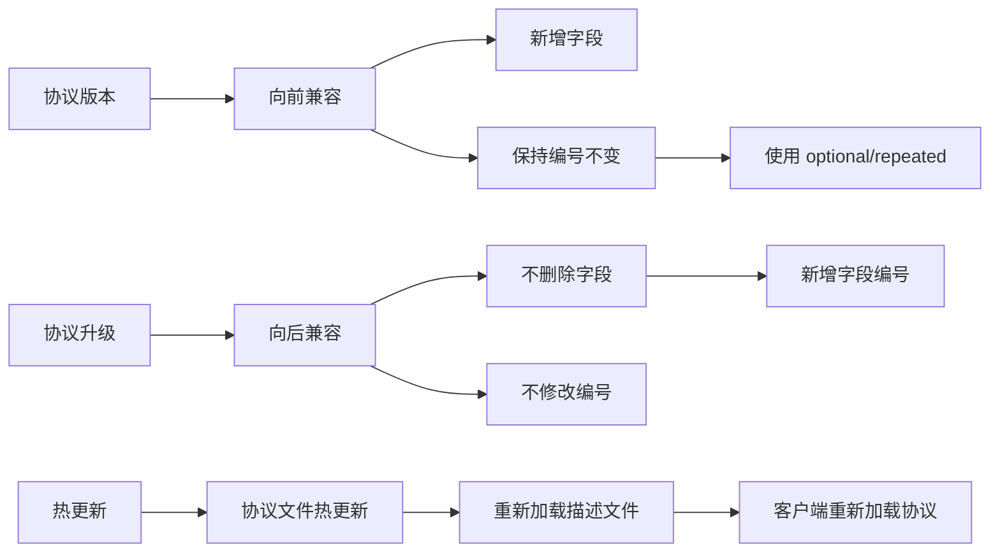

**章节来源**
- [proto.config.json:1-15](file://protocols/proto.config.json#L1-L15)
- [README.md:140-176](file://protocols/README.md#L140-L176)
- [node-pb-codec.lua:61-183](file://docker/lua/framework/runtime/node-pb-codec.lua#L61-L183)
- [skynet-pb-codec.lua:59-162](file://docker/lua/framework/runtime/skynet-pb-codec.lua#L59-L162)

### 代码规范和最佳实践

#### TypeScript 编码规范

1. **接口设计**
```typescript
// ✅ 好的做法：清晰的接口定义
export interface IUserService {
    getUserById(id: number): Promise<User>;
    createUser(user: CreateUserRequest): Promise<User>;
    updateUser(id: number, user: UpdateUserRequest): Promise<User>;
    deleteUser(id: number): Promise<boolean>;
}

// ❌ 避免的做法：过于宽泛的接口
export interface IGenericService {
    handle(action: string, ...args: any[]): Promise<any>;
}
```

2. **异步编程**
```typescript
// ✅ 好的做法：正确的异步处理
export async function processUserData(userId: number): Promise<UserData> {
    try {
        const user = await this.getUserById(userId);
        const profile = await this.getUserProfile(userId);
        
        return {
            ...user,
            ...profile,
            lastUpdated: Date.now()
        };
    } catch (error) {
        runtime.logger.error(`Failed to process user data: ${error}`);
        throw new Error('Processing failed');
    }
}

// ❌ 避免的做法：回调地狱
export function processUserDataBad(userId: number, callback: Callback): void {
    this.getUserById(userId, (userErr, user) => {
        if (userErr) {
            callback(userErr);
            return;
        }
        this.getUserProfile(userId, (profileErr, profile) => {
            if (profileErr) {
                callback(profileErr);
                return;
            }
            callback(null, { ...user, ...profile });
        });
    });
}
```

3. **错误处理**
```typescript
// ✅ 好的做法：结构化的错误处理
export class ServiceException extends Error {
    constructor(
        public readonly code: number,
        message: string,
        public readonly details?: any
    ) {
        super(message);
        this.name = 'ServiceException';
    }
}

// 使用示例
try {
    const result = await riskyOperation();
} catch (error) {
    if (error instanceof ServiceException) {
        runtime.logger.warn(`Service error ${error.code}: ${error.message}`);
        throw error; // 重新抛出业务异常
    } else {
        runtime.logger.error(`Unexpected error: ${error}`);
        throw new ServiceException(500, 'Internal server error');
    }
}
```

#### 构建配置

1. **TypeScript 配置**
```json
{
  "compilerOptions": {
    "target": "ES2020",
    "lib": ["ES2020"],
    "module": "ESNext",
    "moduleResolution": "bundler",
    "strict": true,
    "skipLibCheck": true,
    "rootDir": "../src",
    "outDir": "../dist/lua"
  },
  "tstl": {
    "luaTarget": "5.4",
    "luaLibImport": "require",
    "sourceMapTraceback": true,
    "noImplicitSelf": true,
    "noHeader": true,
    "skynetCompat": true
  },
  "include": ["../src/**/*"],
  "exclude": ["../node_modules", "../plugins", "../**/*.spec.ts"]
}
```

2. **CLI 工具配置**
```typescript
// CLI 命令定义
const commands: Record<string, { desc: string; fn: () => Promise<void> }> = {
    menu: {
        desc: '显示交互式菜单',
        fn: showMenu,
    },
    quick: {
        desc: '一键启动（自动检查 + 构建 + 启动）',
        fn: cmdQuickStart,
    },
    start: {
        desc: '启动 Skynet 服务',
        fn: cmdStart,
    },
    stop: {
        desc: '停止 Skynet 服务',
        fn: cmdStop,
    },
    restart: {
        desc: '重启 Skynet 服务',
        fn: cmdRestart,
    },
    status: {
        desc: '查看服务状态',
        fn: cmdStatus,
    },
    logs: {
        desc: '查看服务日志',
        fn: cmdLogs,
    },
    'build:ts': {
        desc: '编译 TypeScript → Lua',
        fn: async () => { await cmdBuildTS(); },
    },
    'build:all': {
        desc: '完整构建（Proto + Tables + TS）',
        fn: cmdBuildAll,
    },
    'build:clean': {
        desc: '清理构建产物',
        fn: cmdClean,
    },
    dev: {
        desc: 'Node.js 开发模式',
        fn: cmdDev,
    },
    setup: {
        desc: '初始化项目环境',
        fn: cmdSetup,
    },
    hotfix: {
        desc: '热更新服务代码',
        fn: cmdHotfix,
    },
};
```

**章节来源**
- [tsconfig.lua.json:1-23](file://server/config/tsconfig.lua.json#L1-L23)
- [index.ts:301-354](file://server/scripts/cli/index.ts#L301-L354)

### 扩展开发示例

#### 登录服务完整示例

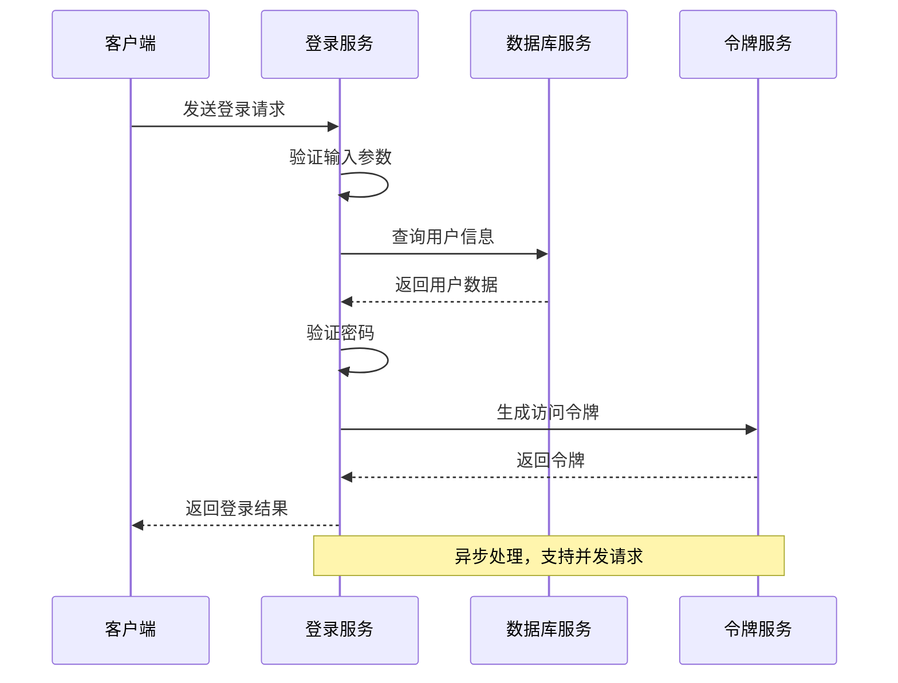

**图表来源**
- [README.md:393-492](file://README.md#L393-L492)

#### 网关服务示例

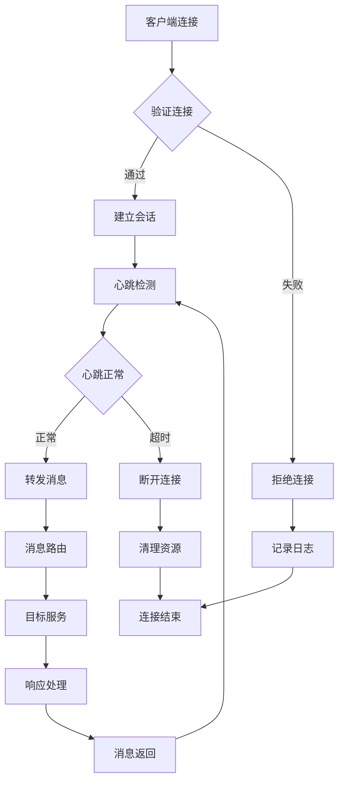

#### 游戏服务示例

```mermaid
stateDiagram-v2
[*] --> 空闲
空闲 --> 游戏中 : 进入游戏
游戏中 --> 空闲 : 离开游戏
游戏中 --> 游戏中 : 游戏逻辑处理
游戏中 --> 暂停 : 暂停游戏
暂停 --> 游戏中 : 继续游戏
state 游戏中 {
[*] --> 移动
移动 --> 攻击 : 触发攻击
攻击 --> 移动 : 攻击完成
攻击 --> 受伤 : 被攻击
受伤 --> 游戏中 : 恢复状态
}
```

**章节来源**
- [README.md:393-492](file://README.md#L393-L492)

### 测试和发布流程

#### 测试流程

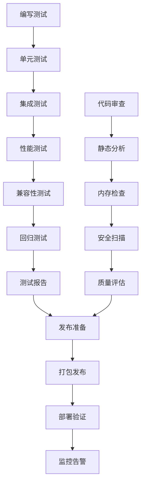

#### 发布流程

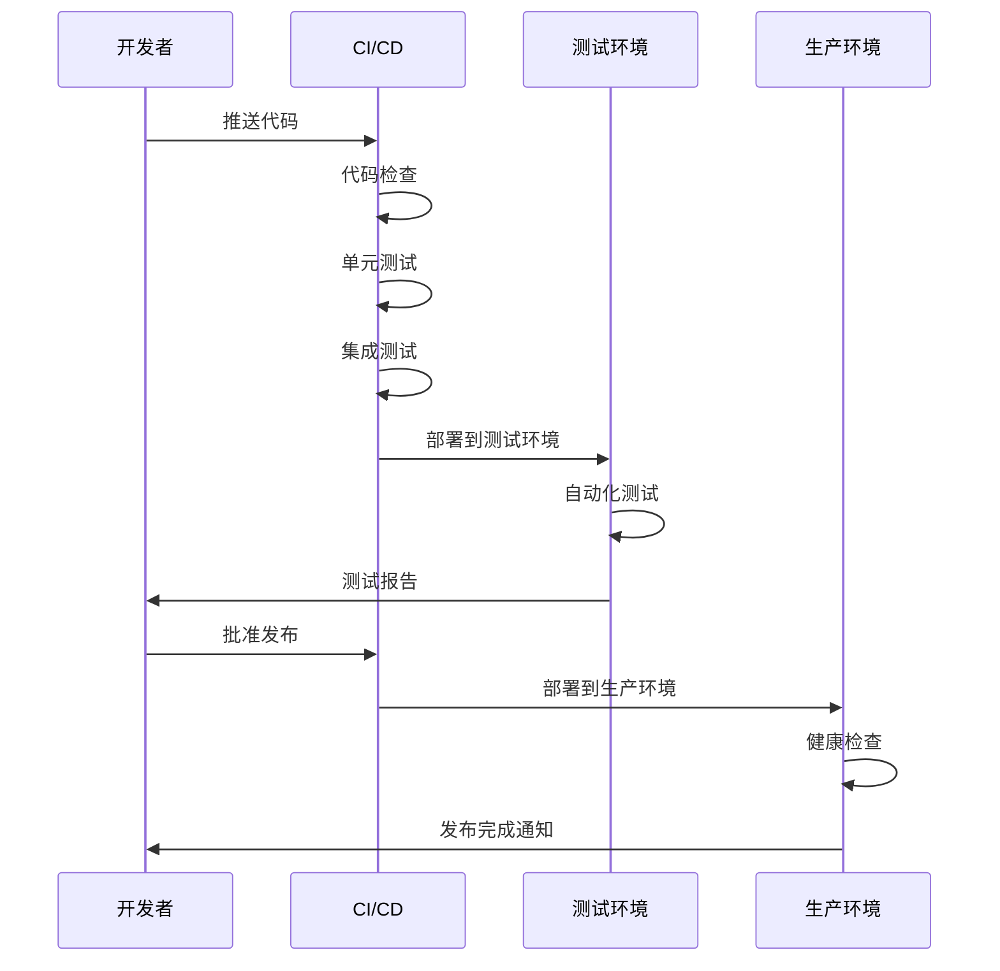

**章节来源**
- [index.ts:427-496](file://server/scripts/cli/index.ts#L427-L496)
- [package.json:6-26](file://server/package.json#L6-L26)

## 依赖分析

框架的依赖关系呈现清晰的层次结构：

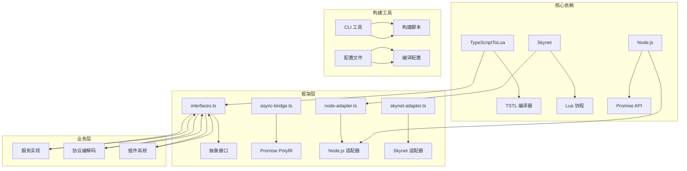

**图表来源**
- [架构设计文档.md:111-134](file://docs/架构设计文档.md#L111-L134)
- [README.md:283-326](file://README.md#L283-L326)

**章节来源**
- [架构设计文档.md:111-134](file://docs/架构设计文档.md#L111-L134)
- [README.md:283-326](file://README.md#L283-L326)

## 性能考虑

### 异步模型优化

框架通过 TypeScriptToLua 的 Promise Polyfill 实现了高效的异步处理：

1. **协程转换效率**
   - TSTL 将 async/await 转换为 Lua 协程
   - 避免了回调地狱和阻塞操作
   - 支持并发异步操作

2. **内存管理**
   - 使用对象池减少垃圾回收压力
   - 合理的生命周期管理
   - 避免内存泄漏

3. **网络优化**
   - 连接池管理
   - 批量消息处理
   - 压缩传输数据

### 编译优化

1. **TypeScript 编译配置**
```json
{
  "tstl": {
    "luaTarget": "5.4",
    "luaLibImport": "require",
    "sourceMapTraceback": true,
    "noImplicitSelf": true,
    "noHeader": true,
    "skynetCompat": true
  }
}
```

2. **运行时优化**
   - 模块缓存机制
   - 延迟加载策略
   - 资源预加载

## 故障排除指南

### 常见问题诊断

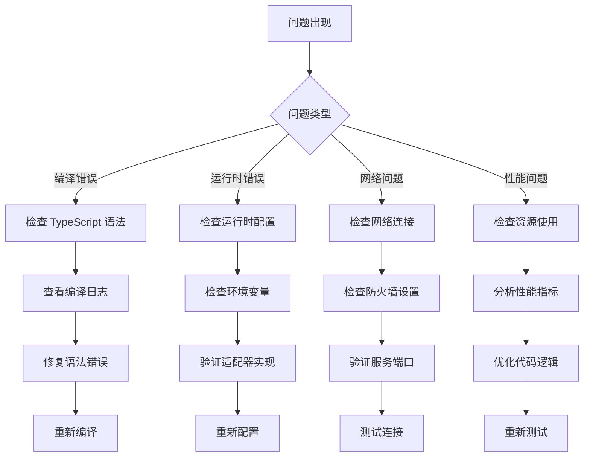

### 调试技巧

1. **开发模式调试**
```bash
# 启动 Node.js 开发模式
npm run dev

# 启用详细日志
export DEBUG=true
npm run dev
```

2. **生产环境调试**
```bash
# 查看服务状态
npm run server:status

# 查看服务日志
npm run server:logs

# 启用调试模式
export NODE_ENV=development
npm run server:start
```

3. **协议调试**
```bash
# 编译协议
npm run build:proto

# 检查协议文件
ls -la server/dist/lua/protos/

# 验证协议格式
node -e "require('./server/dist/lua/protos/proto.js')"
```

**章节来源**
- [index.ts:528-545](file://server/scripts/cli/index.ts#L528-L545)

## 结论

TS-Skynet 混合开发框架为游戏服务端开发提供了一个完整的解决方案，它成功地解决了 TypeScript 和 Skynet 之间的技术鸿沟。通过抽象接口层、运行时适配器和异步桥接机制，框架实现了真正的跨平台兼容性。

### 主要优势

1. **统一开发体验**：一套代码支持双环境运行
2. **类型安全保障**：TypeScript 提供编译时类型检查
3. **高性能运行**：编译为 Lua 后在 Skynet 中高效执行
4. **灵活扩展**：支持自定义运行时适配器和协议
5. **完整工具链**：提供 CLI 工具、测试框架和部署方案

### 未来发展方向

1. **增强数据库支持**：添加 MySQL、Redis、MongoDB 适配器
2. **HTTP/WebSocket 支持**：扩展网络通信协议
3. **配置管理系统**：提供动态配置更新能力
4. **热更新机制**：支持服务代码热更新
5. **监控分析工具**：集成性能监控和分析功能

该框架为开发者提供了一个坚实的基础，可以在此基础上构建复杂的游戏服务端应用，同时保持代码的可维护性和扩展性。

## 附录

### 快速开始指南

```bash
# 1. 安装依赖
npm install

# 2. 启动开发模式
npm run dev

# 3. 编译为 Lua
npm run build:ts

# 4. 启动 Docker 服务
npm run server:start

# 5. 查看日志
npm run server:logs
```

### 常用命令参考

| 命令 | 说明 | 用途 |
|------|------|------|
| `npm run quick` | 一键启动 | 自动检查 + 构建 + 启动 |
| `npm run dev` | 开发模式 | Node.js 环境调试 |
| `npm run build:ts` | 编译 TypeScript | 生成 Lua 代码 |
| `npm run server:start` | 启动服务 | Docker 环境运行 |
| `npm run server:status` | 查看状态 | 服务健康检查 |
| `npm run server:logs` | 查看日志 | 问题诊断 |
| `npm run hotfix` | 热更新 | 代码热替换 |

### 配置文件说明

1. **项目配置**
```yaml
# tslua.config.yaml
name: ts-skynet-hybrid
version: 1.0.0

paths:
  server: ./server
  docker: ./docker
  protocols: ./protocols
  tables: ./tables

build:
  sourceDir: ./server/dist/lua
  targetDir: ./docker/lua

docker:
  composeFile: ./docker/compose.yml
  serviceName: skynet
  containerName: tslua-skynet
```

2. **协议配置**
```json
{
  "proto_dirs": ["proto"],
  "output_lua": ["../server/dist/lua/protos"],
  "output_ts": ["../server/src/protos"]
}
```