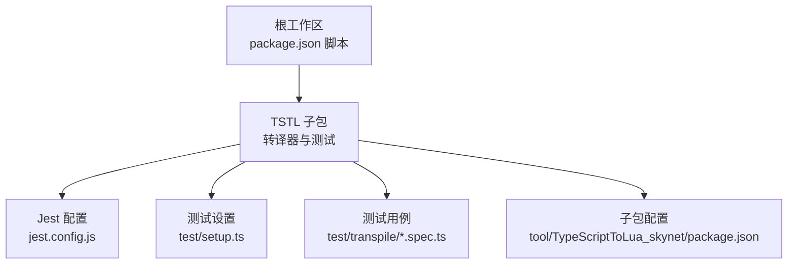
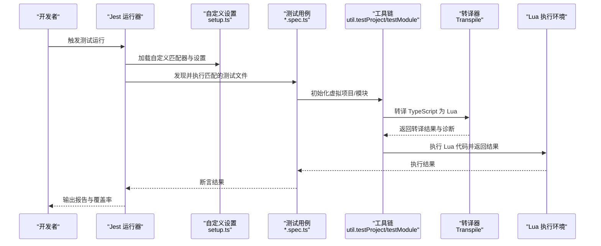
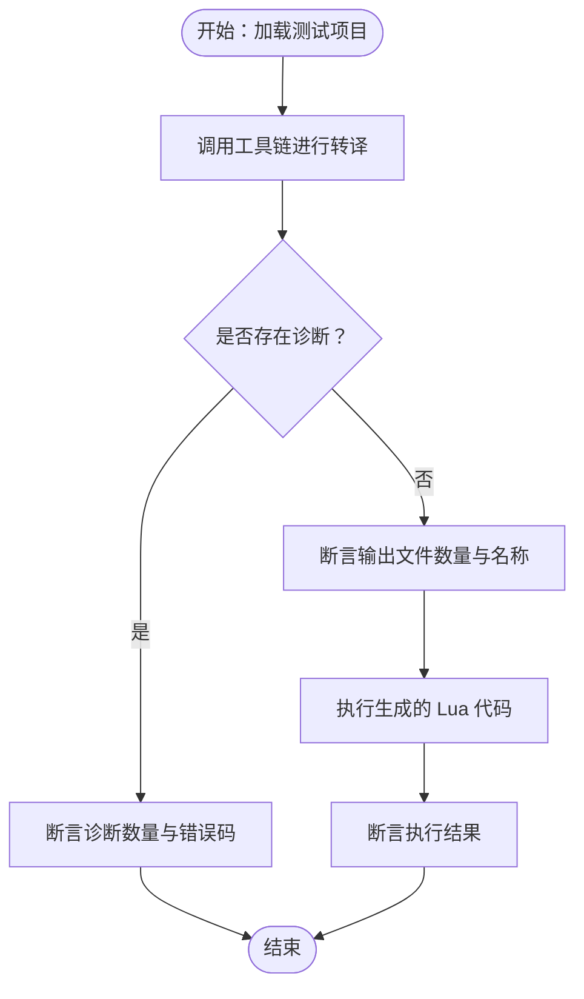
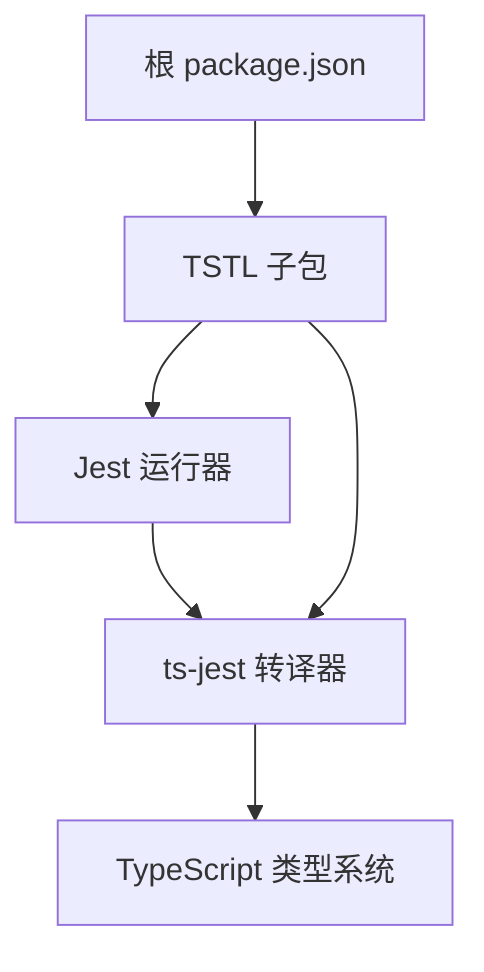

# 扩展测试

<cite>
**本文引用的文件**
- [package.json](file://package.json)
- [jest.config.js](file://tool\TypeScriptToLua_skynet\jest.config.js)
- [setup.ts](file://tool\TypeScriptToLua_skynet\test\setup.ts)
- [bundle.spec.ts](file://tool\TypeScriptToLua_skynet\test\transpile\bundle.spec.ts)
- [project.spec.ts](file://tool\TypeScriptToLua_skynet\test\transpile\project.spec.ts)
- [package.json](file://tool\TypeScriptToLua_skynet\package.json)
</cite>

## 目录
1. [引言](#引言)
2. [项目结构](#项目结构)
3. [核心组件](#核心组件)
4. [架构总览](#架构总览)
5. [详细组件分析](#详细组件分析)
6. [依赖分析](#依赖分析)
7. [性能考虑](#性能考虑)
8. [故障排查指南](#故障排查指南)
9. [结论](#结论)
10. [附录](#附录)

## 引言
本指南面向在 TypeScript 到 Lua 转换（TSTL）生态中进行“扩展测试”的开发者，系统阐述从单元测试、集成测试到端到端测试的策略与方法；覆盖测试环境搭建（框架选择、模拟对象、测试数据）、测试代码编写规范与最佳实践（用例设计、断言、覆盖率）、自动化流程（持续集成、自动化测试、测试报告），以及性能与压力测试（负载、并发、内存泄漏检测）。同时提供可直接复用的测试模板与脚本路径，帮助团队高效落地测试体系。

## 项目结构
该仓库采用多工作区（monorepo）组织方式，核心与测试分布在不同包中：
- 根工作区：提供统一脚本与顶层命令，协调各子包构建与运行。
- TSTL 子包：包含转译器源码、测试套件、Jest 配置与自定义匹配器，用于验证转译行为与诊断输出。
- 协作模式：通过根脚本统一触发子包构建与测试，确保跨模块一致性。

图表来源
- [package.json:11-36](file://package.json#L11-L36)
- [jest.config.js:1-28](file://tool\TypeScriptToLua_skynet\jest.config.js#L1-L28)
- [setup.ts:1-49](file://tool\TypeScriptToLua_skynet\test\setup.ts#L1-L49)
- [bundle.spec.ts:1-133](file://tool\TypeScriptToLua_skynet\test\transpile\bundle.spec.ts#L1-L133)
- [project.spec.ts:1-36](file://tool\TypeScriptToLua_skynet\test\transpile\project.spec.ts#L1-L36)
- [package.json:25-36](file://tool\TypeScriptToLua_skynet\package.json#L25-L36)

章节来源
- [package.json:11-36](file://package.json#L11-L36)
- [jest.config.js:1-28](file://tool\TypeScriptToLua_skynet\jest.config.js#L1-L28)

## 核心组件
- 测试框架与运行器
  - 使用 Jest 作为测试运行器与断言库，配合 ts-jest 进行 TypeScript 源码编译与类型检查。
  - 在 CI 环境下自动切换为仅警告模式，避免阻塞流水线。
- 自定义断言与诊断匹配器
  - 提供 toHaveDiagnostics 匹配器，支持断言诊断数量与错误码，便于验证转译阶段的诊断行为。
- 测试项目工具链
  - 提供 util.testProject 与 testModule 等工具，支持虚拟项目转译、Lua 代码执行与断言。
- 覆盖率与路径过滤
  - 收集覆盖率时排除 lualib 与特定入口文件，聚焦业务与核心逻辑。

章节来源
- [jest.config.js:4-26](file://tool\TypeScriptToLua_skynet\jest.config.js#L4-L26)
- [setup.ts:14-48](file://tool\TypeScriptToLua_skynet\test\setup.ts#L14-L48)
- [bundle.spec.ts:16-36](file://tool\TypeScriptToLua_skynet\test\transpile\bundle.spec.ts#L16-L36)
- [project.spec.ts:5-16](file://tool\TypeScriptToLua_skynet\test\transpile\project.spec.ts#L5-L16)

## 架构总览
下图展示了测试执行的关键路径：Jest 启动后加载自定义设置与匹配器，扫描匹配规则的测试文件，调用工具链对虚拟项目进行转译与执行，并基于断言生成结果与覆盖率。

图表来源
- [jest.config.js:14-26](file://tool\TypeScriptToLua_skynet\jest.config.js#L14-L26)
- [setup.ts:14-48](file://tool\TypeScriptToLua_skynet\test\setup.ts#L14-L48)
- [bundle.spec.ts:16-36](file://tool\TypeScriptToLua_skynet\test\transpile\bundle.spec.ts#L16-L36)
- [project.spec.ts:5-16](file://tool\TypeScriptToLua_skynet\test\transpile\project.spec.ts#L5-L16)

## 详细组件分析

### 组件一：Jest 配置与运行参数
- 测试发现与匹配
  - 通过 testMatch 定位 test 目录下的 *.spec.ts 文件，保证测试命名与组织规范。
- 路径与环境
  - setupFilesAfterEnv 指向自定义设置文件，确保匹配器与全局钩子在测试前加载。
  - testEnvironment 设为 node，适配 TypeScript/Node 生态。
- 转译与诊断
  - 使用 ts-jest 并指定 tsconfig，使测试在真实类型环境下运行。
  - 在非 CI 环境下将诊断标记为警告，CI 下则严格校验。
- 覆盖率收集
  - 收集 src 下除 lualib 与入口外的文件，聚焦核心逻辑覆盖率。

章节来源
- [jest.config.js:4-26](file://tool\TypeScriptToLua_skynet\jest.config.js#L4-L26)

### 组件二：自定义断言与诊断匹配器
- 匹配器能力
  - toHaveDiagnostics 支持断言诊断数量与逐条错误码，便于验证转译阶段的诊断行为。
  - 不支持 expect(actual).not.toHaveDiagnostics(expected) 的反向断言形式，避免误用。
- 诊断格式化
  - 使用 TypeScript 内置格式化工具输出带颜色与上下文的诊断信息，提升可读性。
- 与 Jest 扩展机制集成
  - 通过 expect.extend 注册匹配器，贯穿整个测试生命周期。

章节来源
- [setup.ts:14-48](file://tool\TypeScriptToLua_skynet\test\setup.ts#L14-L48)

### 组件三：转译与执行测试用例
- 用例一：打包与源码映射
  - 验证将多个 TS 文件打包为单个 Lua 文件的行为，断言无诊断、输出文件名符合 tsconfig 配置。
  - 通过执行 Lua 代码验证导出模块行为正确，并检查源码映射是否包含预期内容。
- 用例二：项目转译与详细输出
  - 使用虚拟项目配置进行转译，断言无诊断并生成快照以捕获输出文件列表。
  - 开启详细日志选项，捕获控制台输出并生成快照，便于回归验证。

图表来源
- [bundle.spec.ts:16-36](file://tool\TypeScriptToLua_skynet\test\transpile\bundle.spec.ts#L16-L36)
- [project.spec.ts:5-16](file://tool\TypeScriptToLua_skynet\test\transpile\project.spec.ts#L5-L16)

章节来源
- [bundle.spec.ts:16-36](file://tool\TypeScriptToLua_skynet\test\transpile\bundle.spec.ts#L16-L36)
- [project.spec.ts:5-16](file://tool\TypeScriptToLua_skynet\test\transpile\project.spec.ts#L5-L16)

### 组件四：测试数据与项目结构
- 虚拟项目
  - 通过 util.testProject 传入 tsconfig 路径，构建虚拟项目上下文，隔离真实文件系统。
- 模块执行
  - 通过 util.testModule 设置 Lua 头部与主代码块，执行并断言返回值。
- 快照与日志
  - 使用快照保存转译输出或控制台日志，便于回归对比。

章节来源
- [bundle.spec.ts:16-36](file://tool\TypeScriptToLua_skynet\test\transpile\bundle.spec.ts#L16-L36)
- [project.spec.ts:5-16](file://tool\TypeScriptToLua_skynet\test\transpile\project.spec.ts#L5-L16)

## 依赖分析
- 核心依赖
  - Jest 与 ts-jest：提供测试运行、类型检查与转译支持。
  - TypeScript：提供诊断格式化与类型系统支撑。
- 子包脚本
  - 子包提供 pretest/build-lualib/test 等脚本，确保测试前构建与语言扩展检查。
- 工作区脚本
  - 根 package.json 提供统一命令，协调子包构建与服务启动。

图表来源
- [jest.config.js:18-26](file://tool\TypeScriptToLua_skynet\jest.config.js#L18-L26)
- [package.json:25-36](file://tool\TypeScriptToLua_skynet\package.json#L25-L36)
- [package.json:11-36](file://package.json#L11-L36)

章节来源
- [package.json:25-36](file://tool\TypeScriptToLua_skynet\package.json#L25-L36)
- [package.json:11-36](file://package.json#L11-L36)

## 性能考虑
- 转译性能基准
  - TSTL 子包提供基准测试目录，包含内存与运行时基准，可用于评估转译器性能变化。
- 建议的性能测试实践
  - 对大型项目进行增量转译与全量转译对比，记录耗时与内存峰值。
  - 在 CI 中引入性能回归阈值，结合基准测试结果进行告警。
- 并发与负载
  - 将测试拆分为独立进程，避免共享状态干扰；对 Lua 执行环境进行隔离。
- 内存泄漏检测
  - 结合 Node.js 的内存采样与 Jest 的超时控制，定位异常增长点。

## 故障排查指南
- 诊断断言失败
  - 使用 toHaveDiagnostics 匹配器输出的彩色诊断信息定位问题；核对期望错误码与实际数量。
- 转译产物不一致
  - 使用快照对比转译输出文件列表与内容；确认 tsconfig 配置与输入文件变更。
- 日志与详细输出
  - 开启详细日志选项，捕获控制台输出并生成快照，辅助定位转译过程中的异常。
- CI 与本地差异
  - 在 CI 环境下将诊断设为警告模式，避免因严格模式导致的误报；本地开发使用严格模式提升质量。

章节来源
- [setup.ts:14-48](file://tool\TypeScriptToLua_skynet\test\setup.ts#L14-L48)
- [project.spec.ts:18-35](file://tool\TypeScriptToLua_skynet\test\transpile\project.spec.ts#L18-L35)

## 结论
通过 Jest + ts-jest 的测试体系、自定义诊断匹配器与工具链，TSTL 项目实现了对转译行为的全面验证。建议团队在此基础上扩展单元测试（针对转译器核心模块）、集成测试（跨模块交互）与端到端测试（与 Skynet/Lua 运行时联调），并结合性能基准与 CI 回归，形成完整的扩展测试闭环。

## 附录

### A. 测试策略与方法
- 单元测试
  - 针对转译器内部模块（如 visitor、transformer）编写单元测试，断言输入与输出的对应关系。
  - 使用虚拟项目与快照对比，确保小范围变更不会影响整体行为。
- 集成测试
  - 验证多个模块协作时的转译结果与诊断行为，关注边界条件与异常路径。
- 端到端测试
  - 将生成的 Lua 代码在 Lua 环境中执行，断言业务逻辑正确性；结合日志与覆盖率评估。

### B. 测试环境搭建
- 框架与依赖
  - 安装 Jest、ts-jest、TypeScript 与相关类型声明。
- 配置要点
  - 在 jest.config.js 中设置 tsconfig、诊断模式与覆盖率收集路径。
  - 在 setup.ts 中注册自定义匹配器，确保断言可用。
- 脚本与命令
  - 使用子包脚本进行预处理与测试；根脚本提供统一入口。

章节来源
- [jest.config.js:4-26](file://tool\TypeScriptToLua_skynet\jest.config.js#L4-L26)
- [setup.ts:14-48](file://tool\TypeScriptToLua_skynet\test\setup.ts#L14-L48)
- [package.json:25-36](file://tool\TypeScriptToLua_skynet\package.json#L25-L36)

### C. 测试代码编写规范与最佳实践
- 用例设计
  - 每个用例聚焦单一行为，使用明确的前置条件与断言点。
  - 对边界与异常场景进行专项覆盖，避免遗漏。
- 断言方法
  - 优先使用 toHaveDiagnostics 进行诊断断言；对执行结果使用标准断言。
  - 使用快照保存复杂输出，减少维护成本。
- 覆盖率
  - 关注核心逻辑覆盖率，排除无关文件；定期审查低覆盖率区域。

章节来源
- [setup.ts:14-48](file://tool\TypeScriptToLua_skynet\test\setup.ts#L14-L48)
- [bundle.spec.ts:20-23](file://tool\TypeScriptToLua_skynet\test\transpile\bundle.spec.ts#L20-L23)
- [project.spec.ts:13-15](file://tool\TypeScriptToLua_skynet\test\transpile\project.spec.ts#L13-L15)

### D. 自动化流程（CI/CD）
- 持续集成
  - 在 CI 中启用严格诊断模式，失败即阻断；本地开发使用警告模式提升效率。
- 自动化测试
  - 通过子包脚本与根脚本统一触发测试；在多平台矩阵中运行，确保兼容性。
- 测试报告
  - 生成覆盖率报告与测试日志，结合快照差异进行回归分析。

章节来源
- [jest.config.js:1-28](file://tool\TypeScriptToLua_skynet\jest.config.js#L1-L28)
- [package.json:25-36](file://tool\TypeScriptToLua_skynet\package.json#L25-L36)

### E. 性能测试与压力测试
- 负载测试
  - 对大型项目进行多次转译，统计平均耗时与方差，识别性能瓶颈。
- 并发测试
  - 并行运行多个测试任务，观察资源占用与稳定性。
- 内存泄漏检测
  - 在长时间运行的测试中监控内存曲线，结合断言与日志定位问题。

### F. 实际测试示例与模板代码
- 转译打包与执行
  - 参考路径：[bundle.spec.ts:16-36](file://tool\TypeScriptToLua_skynet\test\transpile\bundle.spec.ts#L16-L36)
- 项目转译与日志
  - 参考路径：[project.spec.ts:5-16](file://tool\TypeScriptToLua_skynet\test\transpile\project.spec.ts#L5-L16)
- 自定义断言
  - 参考路径：[setup.ts:14-48](file://tool\TypeScriptToLua_skynet\test\setup.ts#L14-L48)