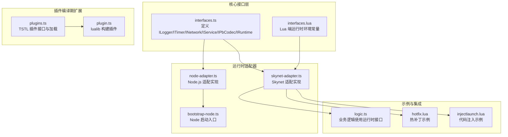
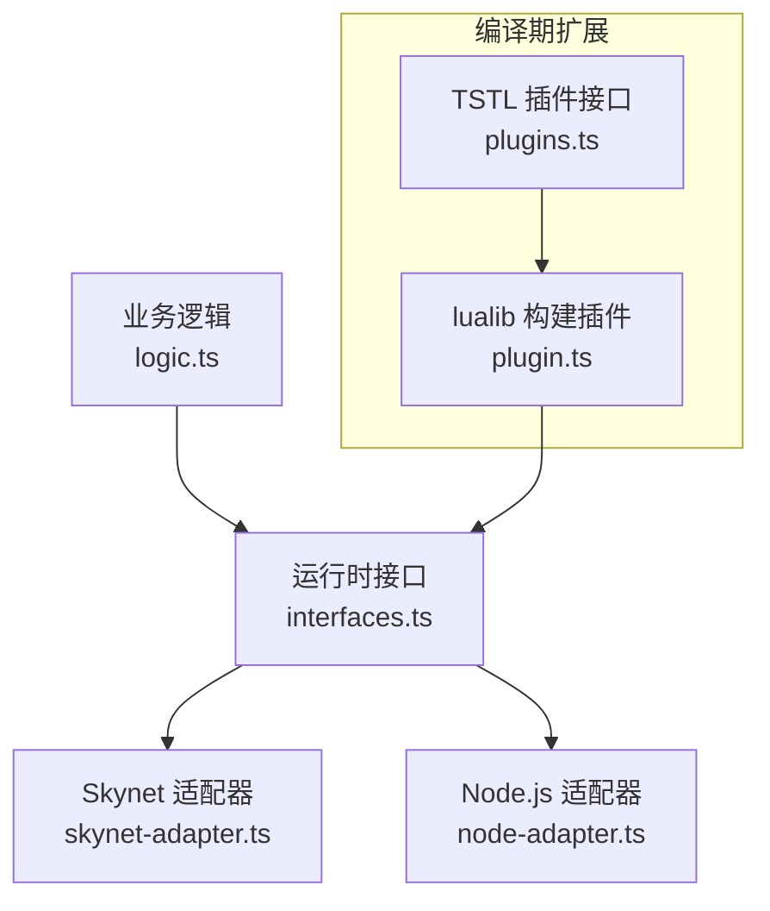
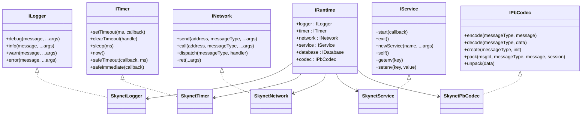
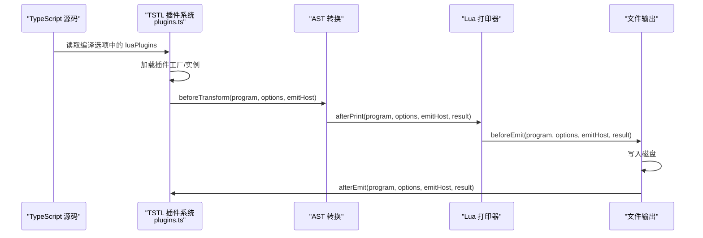
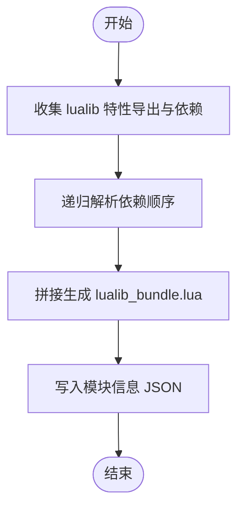
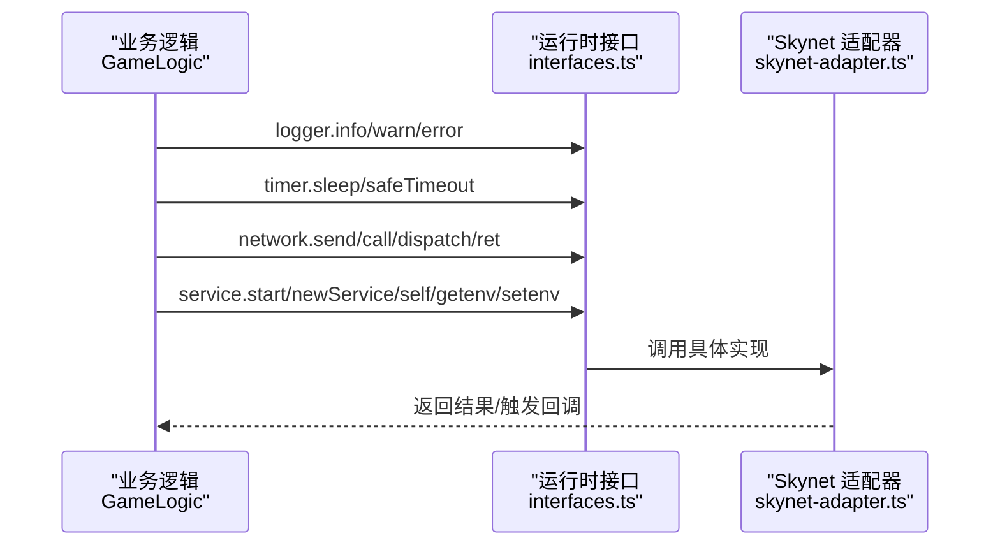
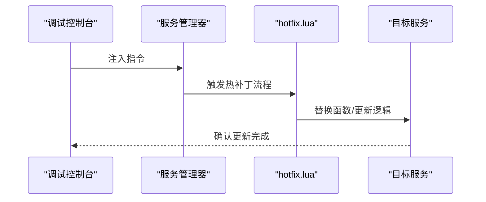
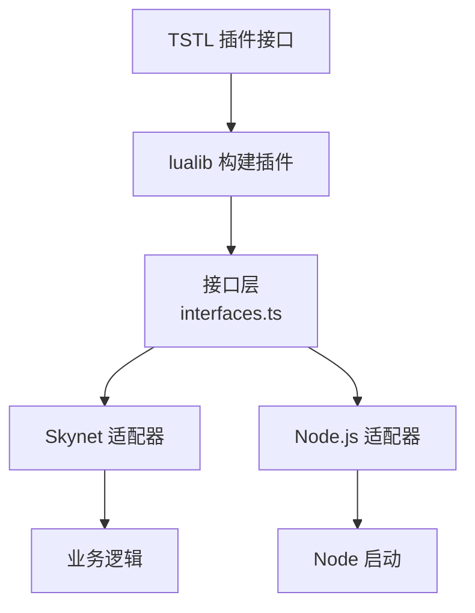

# 插件系统扩展

<cite>
**本文档引用的文件**
- [interfaces.ts](file://server/src/framework/core/interfaces.ts)
- [interfaces.lua](file://docker/lua/framework/core/interfaces.lua)
- [skynet-adapter.ts](file://server/src/framework/runtime/skynet-adapter.ts)
- [skynet-adapter.lua](file://docker/lua/framework/runtime/skynet-adapter.lua)
- [node-adapter.ts](file://server/src/framework/runtime/node-adapter.ts)
- [bootstrap-node.ts](file://server/src/app/bootstrap-node.ts)
- [plugins.ts](file://tool/TypeScriptToLua_skynet/src/transpilation/plugins.ts)
- [plugin.ts](file://tool/TypeScriptToLua_skynet/src/lualib-build/plugin.ts)
- [logic.ts](file://server/src/app/services/game/logic.ts)
- [injectlaunch.lua](file://docker/skynet/examples/injectlaunch.lua)
- [hotfix.lua](file://docker/skynet/lualib/snax/hotfix.lua)
</cite>

## 目录
1. [引言](#引言)
2. [项目结构](#项目结构)
3. [核心组件](#核心组件)
4. [架构总览](#架构总览)
5. [详细组件分析](#详细组件分析)
6. [依赖关系分析](#依赖关系分析)
7. [性能考虑](#性能考虑)
8. [故障排除指南](#故障排除指南)
9. [结论](#结论)
10. [附录](#附录)

## 引言
本技术文档面向希望在现有系统基础上扩展插件能力的开发者，系统化阐述插件系统的架构设计、加载机制、生命周期管理、依赖注入模式以及与核心系统的集成方式。文档同时提供插件开发标准流程、规范与实践示例，覆盖日志、监控、认证等常见场景，并给出安全与性能优化建议，确保插件系统的稳定性与高效性。

## 项目结构
围绕插件系统扩展，项目中与之相关的关键目录与文件如下：
- 核心接口层：定义统一的运行时抽象接口，屏蔽底层环境差异（Node.js 与 Skynet）。
- 运行时适配器：分别为 Node.js 与 Skynet 提供具体实现，统一对外能力。
- 插件编译期扩展：TypeScriptToLua 的插件机制，支持在转译阶段进行 AST 变换、打印定制与模块解析扩展。
- 示例服务与逻辑：展示如何在业务逻辑中通过运行时接口进行日志、定时、网络与服务交互。
- 热更新与注入：Skynet 的热补丁与注入示例，体现运行时扩展能力。

**图表来源**
- [interfaces.ts:1-226](file://server/src/framework/core/interfaces.ts#L1-L226)
- [interfaces.lua:1-24](file://docker/lua/framework/core/interfaces.lua#L1-L24)
- [skynet-adapter.ts:1-221](file://server/src/framework/runtime/skynet-adapter.ts#L1-L221)
- [node-adapter.ts:96-134](file://server/src/framework/runtime/node-adapter.ts#L96-L134)
- [bootstrap-node.ts:1-22](file://server/src/app/bootstrap-node.ts#L1-L22)
- [plugins.ts:1-111](file://tool/TypeScriptToLua_skynet/src/transpilation/plugins.ts#L1-L111)
- [plugin.ts:1-189](file://tool/TypeScriptToLua_skynet/src/lualib-build/plugin.ts#L1-L189)
- [logic.ts:1-162](file://server/src/app/services/game/logic.ts#L1-L162)
- [hotfix.lua:70-118](file://docker/skynet/lualib/snax/hotfix.lua#L70-L118)
- [injectlaunch.lua:1-19](file://docker/skynet/examples/injectlaunch.lua#L1-L19)

**章节来源**
- [interfaces.ts:1-226](file://server/src/framework/core/interfaces.ts#L1-L226)
- [interfaces.lua:1-24](file://docker/lua/framework/core/interfaces.lua#L1-L24)
- [skynet-adapter.ts:1-221](file://server/src/framework/runtime/skynet-adapter.ts#L1-L221)
- [node-adapter.ts:96-134](file://server/src/framework/runtime/node-adapter.ts#L96-L134)
- [bootstrap-node.ts:1-22](file://server/src/app/bootstrap-node.ts#L1-L22)
- [plugins.ts:1-111](file://tool/TypeScriptToLua_skynet/src/transpilation/plugins.ts#L1-L111)
- [plugin.ts:1-189](file://tool/TypeScriptToLua_skynet/src/lualib-build/plugin.ts#L1-L189)
- [logic.ts:1-162](file://server/src/app/services/game/logic.ts#L1-L162)
- [hotfix.lua:70-118](file://docker/skynet/lualib/snax/hotfix.lua#L70-L118)
- [injectlaunch.lua:1-19](file://docker/skynet/examples/injectlaunch.lua#L1-L19)

## 核心组件
- 运行时接口与抽象
  - ILogger/ITimer/INetwork/IService/IPbCodec/IRuntime 定义了跨环境一致的能力边界，业务代码仅依赖这些接口，避免直接耦合具体运行环境。
  - 运行时环境枚举 RuntimeEnvironment 支持 NODE 与 SKYNET 两种环境标识。
  - setRuntime 与全局 runtime 实例负责在启动时注入具体实现。

- 运行时适配器
  - Skynet 适配器：实现日志、定时器、网络、服务与 PB 编解码的具体逻辑，封装 Skynet Lua API。
  - Node.js 适配器：提供最小可用实现，便于本地测试与开发验证。

- 插件编译期扩展
  - TSTL 插件接口：支持 beforeTransform/afterPrint/beforeEmit/afterEmit/moduleResolution 等生命周期钩子。
  - lualib 构建插件：负责 lualib 特性的收集、依赖解析与打包输出。

**章节来源**
- [interfaces.ts:6-226](file://server/src/framework/core/interfaces.ts#L6-L226)
- [interfaces.lua:5-24](file://docker/lua/framework/core/interfaces.lua#L5-L24)
- [skynet-adapter.ts:28-221](file://server/src/framework/runtime/skynet-adapter.ts#L28-L221)
- [node-adapter.ts:96-134](file://server/src/framework/runtime/node-adapter.ts#L96-L134)
- [plugins.ts:9-111](file://tool/TypeScriptToLua_skynet/src/transpilation/plugins.ts#L9-L111)
- [plugin.ts:30-189](file://tool/TypeScriptToLua_skynet/src/lualib-build/plugin.ts#L30-L189)

## 架构总览
插件系统以“接口抽象 + 适配器 + 编译期插件”三层架构为核心：
- 接口抽象层：统一能力边界，屏蔽环境差异。
- 适配器层：按环境提供具体实现，保证业务逻辑可移植。
- 编译期插件：在转译阶段对 AST、打印与模块解析进行扩展，支撑运行时特性构建与打包。

**图表来源**
- [logic.ts:7-16](file://server/src/app/services/game/logic.ts#L7-L16)
- [interfaces.ts:189-226](file://server/src/framework/core/interfaces.ts#L189-L226)
- [skynet-adapter.ts:204-221](file://server/src/framework/runtime/skynet-adapter.ts#L204-L221)
- [node-adapter.ts:133-134](file://server/src/framework/runtime/node-adapter.ts#L133-L134)
- [plugins.ts:71-111](file://tool/TypeScriptToLua_skynet/src/transpilation/plugins.ts#L71-L111)
- [plugin.ts:39-76](file://tool/TypeScriptToLua_skynet/src/lualib-build/plugin.ts#L39-L76)

## 详细组件分析

### 组件A：运行时接口与适配器
- 设计要点
  - 通过接口隔离业务与环境，降低耦合度。
  - 适配器封装 Skynet/Lua API，提供 Promise/协程语义兼容。
  - 定时器提供协程安全的 safeTimeout/safeImmediate，避免阻塞事件循环。

**图表来源**
- [interfaces.ts:9-196](file://server/src/framework/core/interfaces.ts#L9-L196)
- [skynet-adapter.ts:28-221](file://server/src/framework/runtime/skynet-adapter.ts#L28-L221)

**章节来源**
- [interfaces.ts:9-196](file://server/src/framework/core/interfaces.ts#L9-L196)
- [skynet-adapter.ts:28-221](file://server/src/framework/runtime/skynet-adapter.ts#L28-L221)

### 组件B：插件编译期扩展（TSTL 插件）
- 生命周期钩子
  - beforeTransform：转译前对 Program/Options/EmitHost 进行预处理。
  - afterPrint：AST 转 Lua 后、依赖解析与打包前的后处理。
  - beforeEmit：依赖解析与打包后、写盘前的处理。
  - afterEmit：写盘后的后处理。
  - moduleResolution：自定义 require 解析逻辑。

**图表来源**
- [plugins.ts:27-57](file://tool/TypeScriptToLua_skynet/src/transpilation/plugins.ts#L27-L57)

**章节来源**
- [plugins.ts:9-111](file://tool/TypeScriptToLua_skynet/src/transpilation/plugins.ts#L9-L111)

### 组件C：lualib 构建插件
- 功能概述
  - 收集 lualib 特性导出与依赖关系。
  - 递归解析依赖顺序，生成 lualib_bundle.lua。
  - 输出模块信息 JSON，供后续流程使用。

**图表来源**
- [plugin.ts:39-76](file://tool/TypeScriptToLua_skynet/src/lualib-build/plugin.ts#L39-L76)

**章节来源**
- [plugin.ts:30-189](file://tool/TypeScriptToLua_skynet/src/lualib-build/plugin.ts#L30-L189)

### 组件D：业务逻辑中的运行时使用
- 使用模式
  - 业务逻辑通过 runtime.logger、runtime.timer、runtime.network、runtime.service 访问能力。
  - 该模式确保业务代码与具体运行环境解耦，便于在 Node.js 与 Skynet 间切换。

**图表来源**
- [logic.ts:22-38](file://server/src/app/services/game/logic.ts#L22-L38)
- [interfaces.ts:9-196](file://server/src/framework/core/interfaces.ts#L9-L196)
- [skynet-adapter.ts:127-221](file://server/src/framework/runtime/skynet-adapter.ts#L127-L221)

**章节来源**
- [logic.ts:1-162](file://server/src/app/services/game/logic.ts#L1-L162)
- [interfaces.ts:9-196](file://server/src/framework/core/interfaces.ts#L9-L196)
- [skynet-adapter.ts:127-221](file://server/src/framework/runtime/skynet-adapter.ts#L127-L221)

### 组件E：运行时扩展与热更新
- 热补丁（hotfix）
  - 通过 patch_func 将新函数替换到旧函数的 upvalue，实现无重启更新。
- 代码注入（injectlaunch）
  - 在运行时修改服务命令映射，演示注入式扩展。

**图表来源**
- [hotfix.lua:93-118](file://docker/skynet/lualib/snax/hotfix.lua#L93-L118)

**章节来源**
- [hotfix.lua:70-118](file://docker/skynet/lualib/snax/hotfix.lua#L70-L118)
- [injectlaunch.lua:1-19](file://docker/skynet/examples/injectlaunch.lua#L1-L19)

## 依赖关系分析
- 组件内聚与耦合
  - 业务逻辑仅依赖运行时接口，内聚高、耦合低。
  - 适配器与接口松耦合，便于替换与扩展。
  - 编译期插件与运行时实现解耦，通过生命周期钩子参与构建流程。

**图表来源**
- [interfaces.ts:189-226](file://server/src/framework/core/interfaces.ts#L189-L226)
- [skynet-adapter.ts:204-221](file://server/src/framework/runtime/skynet-adapter.ts#L204-L221)
- [node-adapter.ts:133-134](file://server/src/framework/runtime/node-adapter.ts#L133-L134)
- [plugins.ts:71-111](file://tool/TypeScriptToLua_skynet/src/transpilation/plugins.ts#L71-L111)
- [plugin.ts:39-76](file://tool/TypeScriptToLua_skynet/src/lualib-build/plugin.ts#L39-L76)

**章节来源**
- [interfaces.ts:189-226](file://server/src/framework/core/interfaces.ts#L189-L226)
- [skynet-adapter.ts:204-221](file://server/src/framework/runtime/skynet-adapter.ts#L204-L221)
- [node-adapter.ts:133-134](file://server/src/framework/runtime/node-adapter.ts#L133-L134)
- [plugins.ts:71-111](file://tool/TypeScriptToLua_skynet/src/transpilation/plugins.ts#L71-L111)
- [plugin.ts:39-76](file://tool/TypeScriptToLua_skynet/src/lualib-build/plugin.ts#L39-L76)

## 性能考虑
- 定时器与协程
  - 使用 safeTimeout/safeImmediate 确保回调在 Skynet 协程中执行，避免阻塞事件循环。
  - 定时器单位为厘秒（1/100 秒），注意转换精度。
- 网络调用
  - call 为异步等待，配合 Promise/协程语义，减少阻塞。
- 编译期优化
  - lualib 构建插件按依赖顺序拼接，减少运行时查找成本。
  - 插件在 afterPrint/beforeEmit 阶段进行最小必要修改，避免重复扫描。
- 运行时热更新
  - 热补丁仅替换函数指针，避免全量重启带来的抖动。

[本节为通用指导，无需列出具体文件来源]

## 故障排除指南
- 运行时未设置
  - 症状：业务逻辑调用 runtime.* 抛出未定义错误。
  - 处理：确保在启动时调用 setRuntime 并传入具体实现。
- Skynet PB 编解码不可用
  - 症状：创建 Skynet 运行时时记录告警。
  - 处理：检查 PB 相关模块是否可用，或降级使用无 codec 的运行时。
- Node.js 网络调用模拟
  - 症状：call 返回 mock 响应。
  - 处理：Node 适配器用于本地测试，生产请切换至 Skynet 适配器。
- 插件加载失败
  - 症状：编译时报错或诊断信息缺失。
  - 处理：检查 luaPlugins 配置项，确认插件工厂/名称与导入路径正确。

**章节来源**
- [interfaces.ts:216-226](file://server/src/framework/core/interfaces.ts#L216-L226)
- [skynet-adapter.ts:204-221](file://server/src/framework/runtime/skynet-adapter.ts#L204-L221)
- [node-adapter.ts:101-118](file://server/src/framework/runtime/node-adapter.ts#L101-L118)
- [plugins.ts:77-101](file://tool/TypeScriptToLua_skynet/src/transpilation/plugins.ts#L77-L101)

## 结论
通过接口抽象、适配器与编译期插件三层次设计，系统实现了对 Node.js 与 Skynet 的无缝支持，并提供了运行时扩展（热补丁/注入）与构建期扩展（AST/打印/模块解析）能力。遵循本文档的开发规范与最佳实践，可高效、安全地扩展插件系统，满足日志、监控、认证等多样化需求。

[本节为总结性内容，无需列出具体文件来源]

## 附录

### 插件开发标准流程与规范
- 接口定义与实现
  - 在 interfaces.ts 中定义插件所需能力接口，业务代码仅依赖接口。
  - 分别在 skynet-adapter.ts 与 node-adapter.ts 中提供具体实现。
- 生命周期管理
  - 在服务启动阶段注册网络处理器与定时任务。
  - 使用 safeTimeout/safeImmediate 确保协程安全。
- 依赖注入
  - 通过构造函数或工厂函数注入依赖（如数据访问层），保持业务逻辑无状态。
- 测试方法
  - 使用 Node 适配器进行本地单元测试，验证日志、定时与网络行为。
  - 在 Skynet 环境中进行集成测试，验证热更新与注入场景。

**章节来源**
- [interfaces.ts:6-226](file://server/src/framework/core/interfaces.ts#L6-L226)
- [skynet-adapter.ts:69-122](file://server/src/framework/runtime/skynet-adapter.ts#L69-L122)
- [node-adapter.ts:96-134](file://server/src/framework/runtime/node-adapter.ts#L96-L134)
- [bootstrap-node.ts:1-22](file://server/src/app/bootstrap-node.ts#L1-L22)

### 插件开发实际示例
- 日志插件
  - 通过实现 ILogger 接口，扩展日志级别、格式化与输出目标。
  - 在业务逻辑中统一使用 runtime.logger，确保日志一致性。
- 监控插件
  - 使用 ITimer 的 safeTimeout/sleep 记录关键路径耗时。
  - 通过 INetwork 的 send/call 统计请求量与延迟。
- 认证插件
  - 在 IService.newService/self/getenv/setenv 中实现服务间鉴权与令牌传递。
  - 结合 IPbCodec 进行消息体签名校验与解密。

**章节来源**
- [interfaces.ts:9-196](file://server/src/framework/core/interfaces.ts#L9-L196)
- [skynet-adapter.ts:127-221](file://server/src/framework/runtime/skynet-adapter.ts#L127-L221)
- [logic.ts:22-38](file://server/src/app/services/game/logic.ts#L22-L38)

### 安全考虑与性能优化策略
- 安全
  - 严格限制插件对全局状态的访问，优先通过接口注入依赖。
  - 对外部输入进行校验与限流，防止滥用网络与定时器。
  - 在热更新场景中，确保函数签名与返回值兼容，避免破坏调用链。
- 性能
  - 使用协程安全的定时器与网络调用，避免阻塞事件循环。
  - 在编译期通过插件进行必要的优化（如移除冗余导出、合并模块）。
  - 控制定时器频率与批处理大小，降低 CPU 与内存压力。

**章节来源**
- [skynet-adapter.ts:96-122](file://server/src/framework/runtime/skynet-adapter.ts#L96-L122)
- [plugin.ts:69-76](file://tool/TypeScriptToLua_skynet/src/lualib-build/plugin.ts#L69-L76)
- [hotfix.lua:93-118](file://docker/skynet/lualib/snax/hotfix.lua#L93-L118)