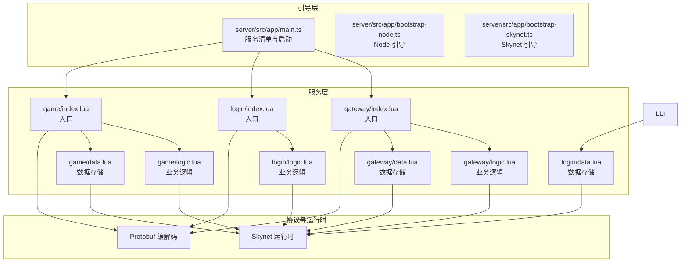
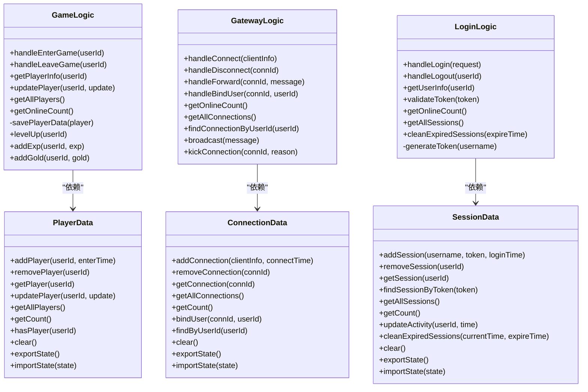
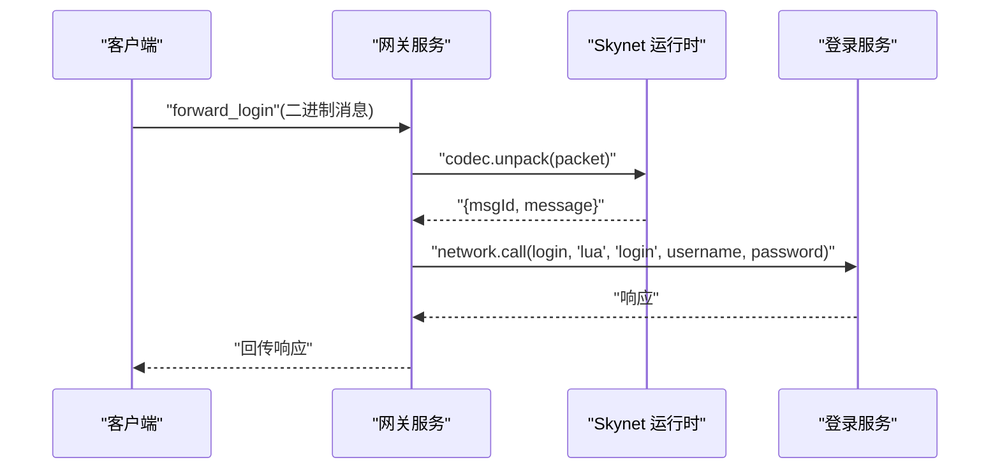
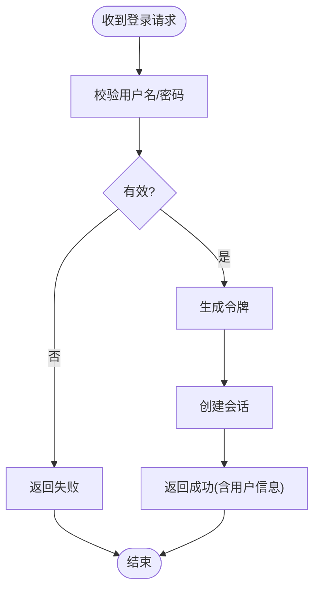
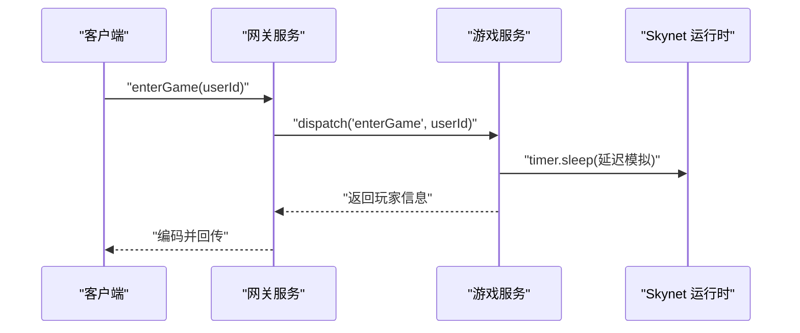
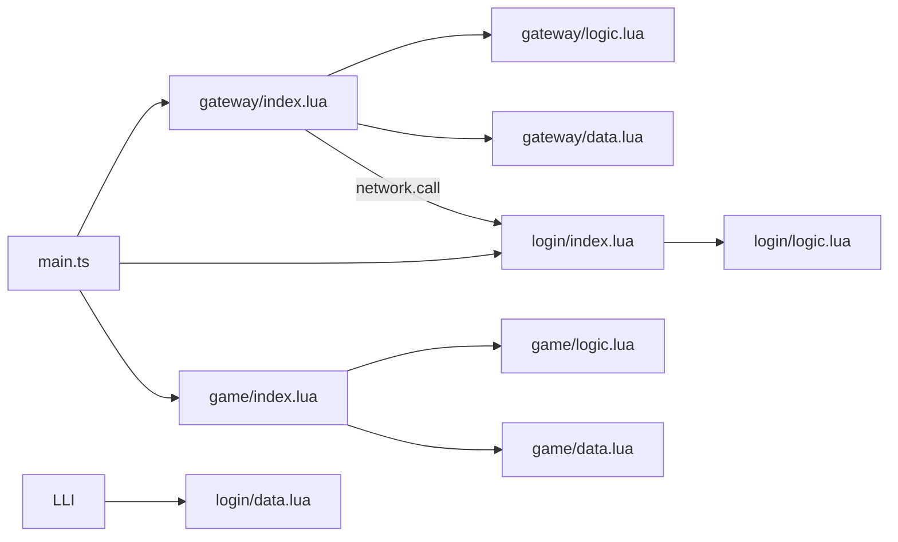

# 新服务开发

<cite>
**本文引用的文件**
- [server/src/app/main.ts](file://server/src/app/main.ts)
- [server/src/app/bootstrap-node.ts](file://server/src/app/bootstrap-node.ts)
- [server/src/app/bootstrap-skynet.ts](file://server/src/app/bootstrap-skynet.ts)
- [docker/lua/app/services/game/index.lua](file://docker/lua/app/services/game/index.lua)
- [docker/lua/app/services/game/logic.lua](file://docker/lua/app/services/game/logic.lua)
- [docker/lua/app/services/game/data.lua](file://docker/lua/app/services/game/data.lua)
- [docker/lua/app/services/gateway/index.lua](file://docker/lua/app/services/gateway/index.lua)
- [docker/lua/app/services/gateway/logic.lua](file://docker/lua/app/services/gateway/logic.lua)
- [docker/lua/app/services/gateway/data.lua](file://docker/lua/app/services/gateway/data.lua)
- [docker/lua/app/services/login/index.lua](file://docker/lua/app/services/login/index.lua)
- [docker/lua/app/services/login/logic.lua](file://docker/lua/app/services/login/logic.lua)
- [docker/lua/app/services/login/data.lua](file://docker/lua/app/services/login/data.lua)
- [server/src/app/services/game/types.ts](file://server/src/app/services/game/types.ts)
- [server/src/app/services/game/logic.ts](file://server/src/app/services/game/logic.ts)
- [server/src/app/services/game/data.ts](file://server/src/app/services/game/data.ts)
</cite>

## 目录
1. [简介](#简介)
2. [项目结构](#项目结构)
3. [核心组件](#核心组件)
4. [架构总览](#架构总览)
5. [详细组件分析](#详细组件分析)
6. [依赖关系分析](#依赖关系分析)
7. [性能考虑](#性能考虑)
8. [故障排查指南](#故障排查指南)
9. [结论](#结论)
10. [附录](#附录)

## 简介
本指南面向新服务开发，基于仓库中的服务架构与现有服务实现，系统阐述服务架构设计原则、职责划分、接口设计、数据模型定义、服务间通信机制、配置与部署方法，并提供标准开发流程与最佳实践，帮助开发者快速上手。

## 项目结构
该工程采用 TypeScript 与 Lua 混合架构，服务以“网关-登录-游戏”三层链路为主，配合 Skynet 运行时与 Protobuf 协议编解码，形成可扩展、可观测、可热更新的服务体系。

- 服务入口与引导
  - 主入口负责服务清单与批量启动
  - Node 环境与 Skynet 环境分别提供引导入口
- 服务实现
  - 每个服务包含 index（入口）、logic（业务逻辑）、data（数据访问）、types（类型定义）四部分
  - 业务逻辑无状态、可热更新；数据层有状态、不可热更新
- 通信与协议
  - 服务间通过 Skynet 网络层进行消息转发与远程调用
  - 通过 Protobuf 编解码实现跨语言/跨进程的消息契约

**图示来源**
- [server/src/app/main.ts:1-106](file://server/src/app/main.ts#L1-L106)
- [server/src/app/bootstrap-node.ts:1-22](file://server/src/app/bootstrap-node.ts#L1-L22)
- [server/src/app/bootstrap-skynet.ts:1-20](file://server/src/app/bootstrap-skynet.ts#L1-L20)
- [docker/lua/app/services/gateway/index.lua:1-225](file://docker/lua/app/services/gateway/index.lua#L1-L225)
- [docker/lua/app/services/login/index.lua:1-162](file://docker/lua/app/services/login/index.lua#L1-L162)
- [docker/lua/app/services/game/index.lua:1-156](file://docker/lua/app/services/game/index.lua#L1-L156)

**章节来源**
- [server/src/app/main.ts:1-106](file://server/src/app/main.ts#L1-L106)
- [server/src/app/bootstrap-node.ts:1-22](file://server/src/app/bootstrap-node.ts#L1-L22)
- [server/src/app/bootstrap-skynet.ts:1-20](file://server/src/app/bootstrap-skynet.ts#L1-L20)

## 核心组件
- 服务入口（index）
  - 负责注册网络回调、分发命令、处理心跳与服务间转发
  - 提供状态导出与保活日志
- 业务逻辑（logic）
  - 无状态、可热更新，封装业务规则与流程
  - 通过依赖注入的数据层进行读写
- 数据访问（data）
  - 有状态、不可热更新，负责数据持久化与状态迁移
- 类型定义（types）
  - 定义命令参数、返回值、数据结构，保证类型安全

**章节来源**
- [server/src/app/services/game/types.ts:1-56](file://server/src/app/services/game/types.ts#L1-L56)
- [server/src/app/services/game/logic.ts:1-162](file://server/src/app/services/game/logic.ts#L1-L162)
- [server/src/app/services/game/data.ts:1-113](file://server/src/app/services/game/data.ts#L1-L113)
- [docker/lua/app/services/gateway/index.lua:1-225](file://docker/lua/app/services/gateway/index.lua#L1-L225)
- [docker/lua/app/services/login/index.lua:1-162](file://docker/lua/app/services/login/index.lua#L1-L162)
- [docker/lua/app/services/game/index.lua:1-156](file://docker/lua/app/services/game/index.lua#L1-L156)

## 架构总览
服务采用“入口-逻辑-数据-类型”的分层设计，结合 Skynet 的网络与计时能力，以及 Protobuf 的消息契约，形成清晰的职责边界与可扩展的通信模型。

**图示来源**
- [server/src/app/services/game/logic.ts:1-162](file://server/src/app/services/game/logic.ts#L1-L162)
- [server/src/app/services/game/data.ts:1-113](file://server/src/app/services/game/data.ts#L1-L113)
- [docker/lua/app/services/gateway/logic.lua:1-110](file://docker/lua/app/services/gateway/logic.lua#L1-L110)
- [docker/lua/app/services/gateway/data.lua:1-74](file://docker/lua/app/services/gateway/data.lua#L1-L74)
- [docker/lua/app/services/login/logic.lua:1-106](file://docker/lua/app/services/login/logic.lua#L1-L106)
- [docker/lua/app/services/login/data.lua:1-92](file://docker/lua/app/services/login/data.lua#L1-L92)

## 详细组件分析

### 网关服务（Gateway）
- 职责
  - 维护连接生命周期（建立、断开、广播、封禁）
  - 用户绑定与查询
  - 心跳处理与服务间消息转发（如转发到登录服务）
- 关键流程
  - 命令分发：根据命令名路由到对应处理函数
  - 心跳：解码 Protobuf 请求，构造响应
  - 转发：解析消息 ID，定位目标服务并调用

**图示来源**
- [docker/lua/app/services/gateway/index.lua:142-180](file://docker/lua/app/services/gateway/index.lua#L142-L180)

**章节来源**
- [docker/lua/app/services/gateway/index.lua:1-225](file://docker/lua/app/services/gateway/index.lua#L1-L225)
- [docker/lua/app/services/gateway/logic.lua:1-110](file://docker/lua/app/services/gateway/logic.lua#L1-L110)
- [docker/lua/app/services/gateway/data.lua:1-74](file://docker/lua/app/services/gateway/data.lua#L1-L74)

### 登录服务（Login）
- 职责
  - 处理用户认证、令牌校验、会话管理
  - 定时清理过期会话
- 关键流程
  - 登录：校验凭据、生成令牌、创建会话
  - 注销：移除会话
  - 会话清理：周期性扫描并删除过期会话

**图示来源**
- [docker/lua/app/services/login/logic.lua:21-52](file://docker/lua/app/services/login/logic.lua#L21-L52)

**章节来源**
- [docker/lua/app/services/login/index.lua:1-162](file://docker/lua/app/services/login/index.lua#L1-L162)
- [docker/lua/app/services/login/logic.lua:1-106](file://docker/lua/app/services/login/logic.lua#L1-L106)
- [docker/lua/app/services/login/data.lua:1-92](file://docker/lua/app/services/login/data.lua#L1-L92)

### 游戏服务（Game）
- 职责
  - 玩家进入/离开游戏、属性更新、等级与经验管理
- 关键流程
  - 进入游戏：检查重复、异步加载后创建玩家
  - 属性更新：按需升级或仅更新数值
  - 离开游戏：保存数据后移除玩家

**图示来源**
- [docker/lua/app/services/game/index.lua:19-47](file://docker/lua/app/services/game/index.lua#L19-L47)

**章节来源**
- [docker/lua/app/services/game/index.lua:1-156](file://docker/lua/app/services/game/index.lua#L1-L156)
- [docker/lua/app/services/game/logic.lua:1-125](file://docker/lua/app/services/game/logic.lua#L1-L125)
- [docker/lua/app/services/game/data.lua:1-71](file://docker/lua/app/services/game/data.lua#L1-L71)

### 类型与接口设计（以游戏服务为例）
- 类型定义
  - 玩家数据结构与更新字段
  - 命令参数映射与命令名称类型
- 接口设计
  - 业务逻辑方法与数据层方法分离
  - 通过依赖注入实现解耦

**章节来源**
- [server/src/app/services/game/types.ts:1-56](file://server/src/app/services/game/types.ts#L1-L56)
- [server/src/app/services/game/logic.ts:1-162](file://server/src/app/services/game/logic.ts#L1-L162)
- [server/src/app/services/game/data.ts:1-113](file://server/src/app/services/game/data.ts#L1-L113)

## 依赖关系分析
- 服务启动依赖
  - 主入口维护服务清单，按配置批量启动
  - Node 与 Skynet 分别设置运行时并导入服务
- 服务内依赖
  - 入口依赖逻辑与数据模块
  - 逻辑依赖数据模块，不持有状态
- 服务间依赖
  - 网关向登录服务发起远程调用
  - 通过消息 ID 识别协议类型

**图示来源**
- [server/src/app/main.ts:22-26](file://server/src/app/main.ts#L22-L26)
- [docker/lua/app/services/gateway/index.lua:156-163](file://docker/lua/app/services/gateway/index.lua#L156-L163)

**章节来源**
- [server/src/app/main.ts:1-106](file://server/src/app/main.ts#L1-L106)
- [server/src/app/bootstrap-node.ts:1-22](file://server/src/app/bootstrap-node.ts#L1-L22)
- [server/src/app/bootstrap-skynet.ts:1-20](file://server/src/app/bootstrap-skynet.ts#L1-L20)

## 性能考虑
- 异步与保活
  - 所有服务均维持“保活”循环，避免被运行时回收
  - 异步操作使用运行时计时器进行非阻塞等待
- 状态与热更新
  - 数据层不可热更新，确保状态一致性
  - 逻辑层可热更新，便于迭代业务规则
- 通信开销
  - Protobuf 编解码在网关与登录服务中广泛使用，建议复用消息 ID 与消息体结构
- 并发与锁
  - 当前示例未展示显式锁，若引入外部存储，需考虑并发控制与事务

[本节为通用指导，无需列出具体文件来源]

## 故障排查指南
- 启动失败
  - 检查服务清单与路径是否正确
  - 查看引导日志输出，确认服务地址与启动顺序
- 命令未知
  - 入口分发处对未知命令会记录警告并返回失败
- 远程调用异常
  - 确认目标服务名称与命令名一致
  - 检查消息 ID 与协议版本匹配
- 状态不一致
  - 热更新后核对数据层状态导出/导入流程

**章节来源**
- [server/src/app/main.ts:31-77](file://server/src/app/main.ts#L31-L77)
- [docker/lua/app/services/gateway/index.lua:110-115](file://docker/lua/app/services/gateway/index.lua#L110-L115)
- [docker/lua/app/services/login/index.lua:98-101](file://docker/lua/app/services/login/index.lua#L98-L101)

## 结论
通过“入口-逻辑-数据-类型”的分层设计与 Skynet 运行时的协同，本项目实现了职责清晰、易于扩展与维护的服务架构。遵循本文的设计原则与开发流程，可高效构建新的业务服务。

[本节为总结性内容，无需列出具体文件来源]

## 附录

### 新服务开发标准流程
- 需求分析
  - 明确服务职责与边界
  - 定义命令集与消息契约（Protobuf）
- 设计阶段
  - 定义 types.ts 中的数据结构与命令参数
  - 设计 logic.ts 的业务方法与数据依赖
  - 设计 data.ts 的状态管理与持久化策略
- 实现阶段
  - 实现 index.lua 入口：注册网络回调、命令分发、心跳与服务间转发
  - 实现 logic.lua：封装业务规则，调用 data.lua
  - 实现 data.lua：维护状态，提供导出/导入能力
- 测试与验证
  - 单元测试：覆盖关键业务分支
  - 集成测试：端到端消息流与远程调用
- 配置与部署
  - 在主入口添加服务配置
  - 在 Skynet 或 Node 环境中验证启动与保活
- 上线与运维
  - 观察日志与状态导出
  - 制定热更新与回滚策略

[本节为流程性内容，无需列出具体文件来源]