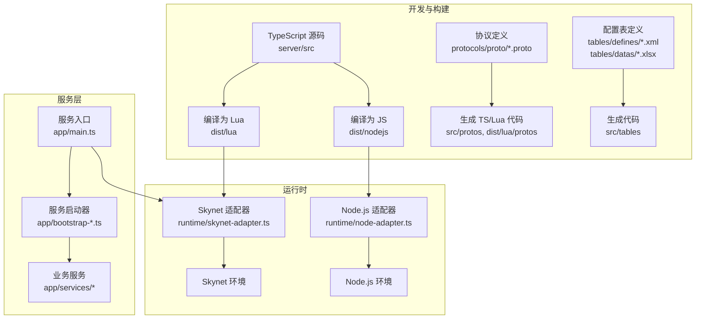
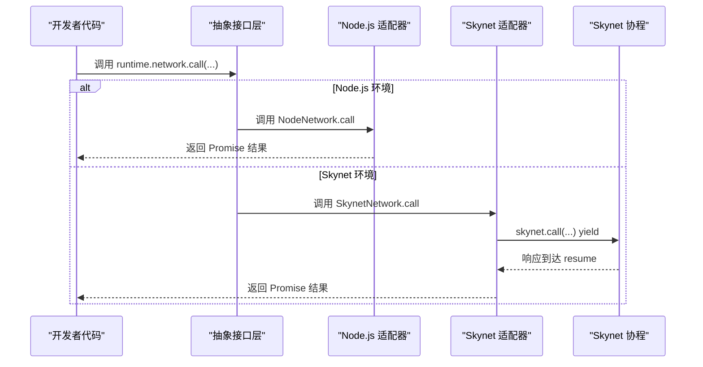
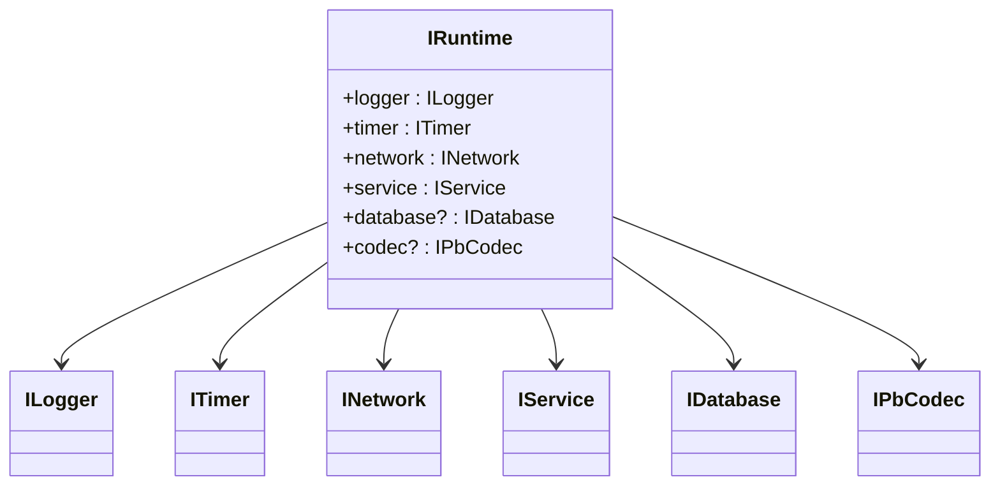
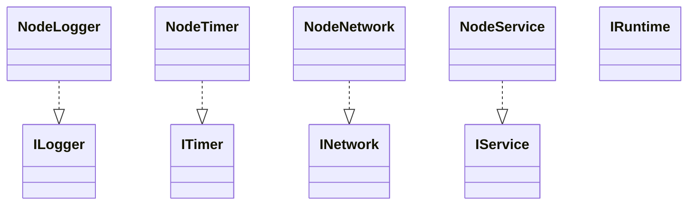
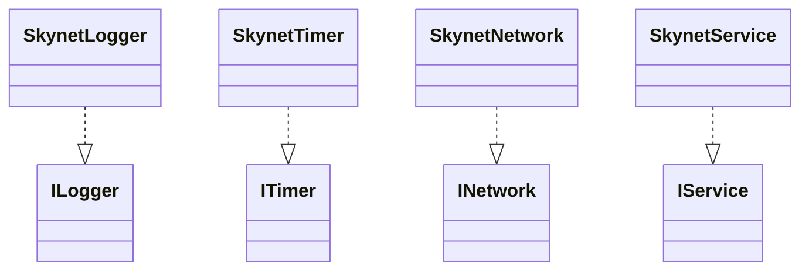
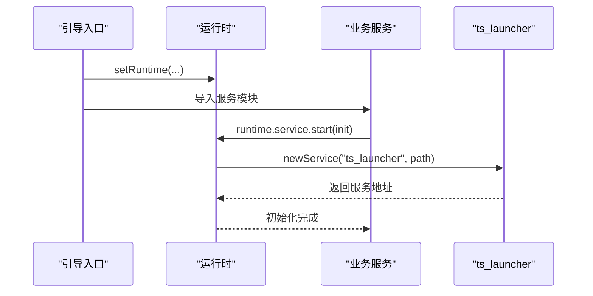
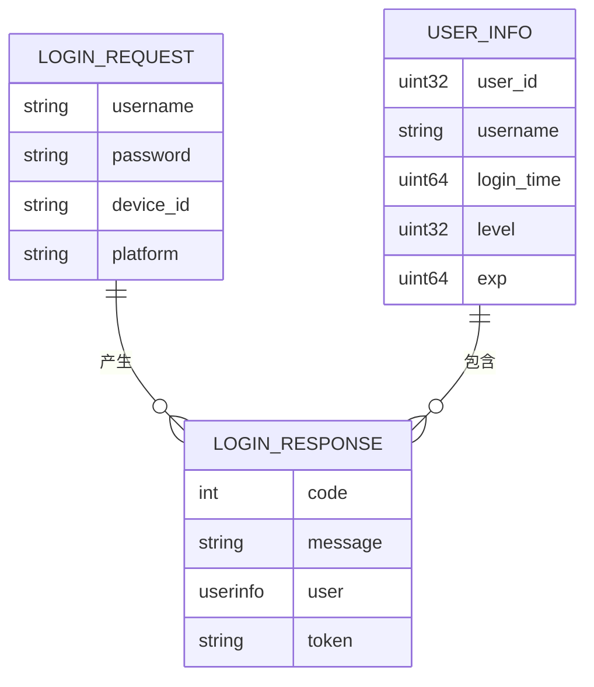
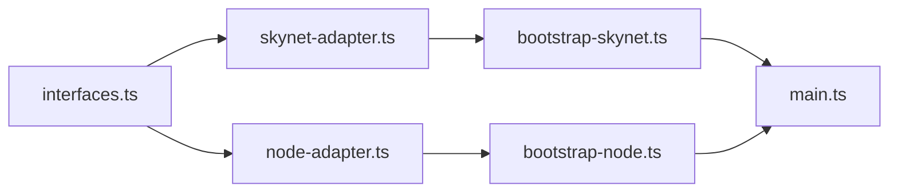

# 服务开发示例

<cite>
**本文引用的文件**
- [README.md](file://README.md)
- [目录结构说明.md](file://docs/目录结构说明.md)
- [架构设计文档.md](file://docs/架构设计文档.md)
- [interfaces.ts](file://server/src/framework/core/interfaces.ts)
- [node-adapter.ts](file://server/src/framework/runtime/node-adapter.ts)
- [skynet-adapter.ts](file://server/src/framework/runtime/skynet-adapter.ts)
- [bootstrap-node.ts](file://server/src/app/bootstrap-node.ts)
- [bootstrap-skynet.ts](file://server/src/app/bootstrap-skynet.ts)
- [main.ts](file://server/src/app/main.ts)
- [login.proto](file://protocols/proto/login.proto)
- [gateway.proto](file://protocols/proto/gateway.proto)
- [game.proto](file://protocols/proto/game.proto)
- [package.json](file://server/package.json)
- [tsconfig.json](file://server/config/tsconfig.json)
</cite>

## 目录
1. [引言](#引言)
2. [项目结构](#项目结构)
3. [核心组件](#核心组件)
4. [架构总览](#架构总览)
5. [详细组件分析](#详细组件分析)
6. [依赖分析](#依赖分析)
7. [性能考虑](#性能考虑)
8. [故障排查指南](#故障排查指南)
9. [结论](#结论)
10. [附录](#附录)

## 引言
本文件面向希望基于 TS-Skynet 混合开发框架创建新服务的开发者，提供从需求分析到最终部署的全流程示例，并覆盖网关服务、业务服务、数据服务等不同类型的实现差异。文档同时给出代码组织与命名规范、测试策略与调试技巧，以及可复用的脚手架思路与最佳实践。

## 项目结构
TS-Skynet 将 TypeScript 业务代码与 Skynet 生产运行时解耦，通过抽象接口层实现跨平台兼容；开发阶段可在 Node.js 环境快速验证，生产阶段编译为 Lua 在 Skynet 上运行。

**图表来源**
- [目录结构说明.md:1-174](file://docs/目录结构说明.md#L1-L174)
- [架构设计文档.md:1-834](file://docs/架构设计文档.md#L1-L834)

**章节来源**
- [目录结构说明.md:1-174](file://docs/目录结构说明.md#L1-L174)
- [架构设计文档.md:1-834](file://docs/架构设计文档.md#L1-L834)

## 核心组件
- 抽象接口层：统一日志、定时器、网络、服务、数据库、协议编解码等能力，确保业务代码与运行时解耦。
- 运行时适配器：分别为 Node.js 与 Skynet 提供具体实现，屏蔽异步模型差异。
- 服务引导与启动：在 Skynet 环境通过 runtime.service.start 启动服务，在 Node.js 环境通过 bootstrap-node.ts 触发服务初始化。
- 协议与配置表：通过 Protobuf 定义前后端消息契约，通过 Luban 生成多语言代码，支撑跨端一致性。

**章节来源**
- [interfaces.ts:1-226](file://server/src/framework/core/interfaces.ts#L1-L226)
- [node-adapter.ts:1-194](file://server/src/framework/runtime/node-adapter.ts#L1-L194)
- [skynet-adapter.ts:1-221](file://server/src/framework/runtime/skynet-adapter.ts#L1-L221)
- [bootstrap-node.ts:1-22](file://server/src/app/bootstrap-node.ts#L1-L22)
- [bootstrap-skynet.ts:1-20](file://server/src/app/bootstrap-skynet.ts#L1-L20)
- [main.ts:1-106](file://server/src/app/main.ts#L1-L106)

## 架构总览
TS-Skynet 的核心在于“统一抽象 + 双运行时适配 + 异步模型桥接”。开发者以 async/await 编写业务逻辑，Node.js 环境映射为 Promise，Skynet 环境由 TSTL 转换为协程 yield/resume，从而实现“一套代码，双环境运行”。

**图表来源**
- [架构设计文档.md:327-364](file://docs/架构设计文档.md#L327-L364)
- [skynet-adapter.ts:132-137](file://server/src/framework/runtime/skynet-adapter.ts#L132-L137)

**章节来源**
- [架构设计文档.md:180-384](file://docs/架构设计文档.md#L180-L384)

## 详细组件分析

### 抽象接口层设计
- ILogger/ITimer/INetwork/IService/IDatabase/IPbCodec：定义跨平台能力边界，业务代码仅依赖这些接口。
- IRuntime：聚合各子接口，setRuntime 用于注入具体实现。
- 设计要点：接口职责单一、返回统一为 Promise、支持协程安全的定时器回调。

**图表来源**
- [interfaces.ts:189-226](file://server/src/framework/core/interfaces.ts#L189-L226)

**章节来源**
- [interfaces.ts:1-226](file://server/src/framework/core/interfaces.ts#L1-L226)

### Node.js 适配器
- NodeLogger/NodeTimer/NodeNetwork/NodeService：在 Node.js 环境下提供最小可用实现，便于本地开发与测试。
- 特性：safeTimeout/safeImmediate 支持协程安全回调；NodeNetwork 模拟 call/ret/dispatch。

**图表来源**
- [node-adapter.ts:19-194](file://server/src/framework/runtime/node-adapter.ts#L19-L194)

**章节来源**
- [node-adapter.ts:1-194](file://server/src/framework/runtime/node-adapter.ts#L1-L194)

### Skynet 适配器
- SkynetLogger/SkynetTimer/SkynetNetwork/SkynetService：封装 skynet.* API，实现协程安全的定时器与网络调用。
- 关键点：sleep 使用 skynet.timeout 实现非阻塞等待；dispatch 内部使用 fork 确保回调在协程中执行。

**图表来源**
- [skynet-adapter.ts:28-221](file://server/src/framework/runtime/skynet-adapter.ts#L28-L221)

**章节来源**
- [skynet-adapter.ts:1-221](file://server/src/framework/runtime/skynet-adapter.ts#L1-L221)

### 服务引导与启动
- bootstrap-node.ts：设置 Node.js 运行时并导入服务模块，触发服务初始化。
- bootstrap-skynet.ts：设置 Skynet 运行时并预加载服务模块。
- main.ts：集中启动多个服务实例，使用 ts_launcher 启动 TS 服务，并保持主服务存活。

**图表来源**
- [bootstrap-node.ts:1-22](file://server/src/app/bootstrap-node.ts#L1-L22)
- [bootstrap-skynet.ts:1-20](file://server/src/app/bootstrap-skynet.ts#L1-L20)
- [main.ts:31-87](file://server/src/app/main.ts#L31-L87)

**章节来源**
- [bootstrap-node.ts:1-22](file://server/src/app/bootstrap-node.ts#L1-L22)
- [bootstrap-skynet.ts:1-20](file://server/src/app/bootstrap-skynet.ts#L1-L20)
- [main.ts:1-106](file://server/src/app/main.ts#L1-L106)

### 协议与消息契约
- login.proto/gateway.proto/game.proto：定义登录、网关、游戏相关的消息类型与枚举，确保前后端一致。
- 建议：每个服务的消息类型独立命名空间，避免冲突；公共字段抽取到 common.proto。

**图表来源**
- [login.proto:10-36](file://protocols/proto/login.proto#L10-L36)

**章节来源**
- [login.proto:1-83](file://protocols/proto/login.proto#L1-L83)
- [gateway.proto:1-70](file://protocols/proto/gateway.proto#L1-L70)
- [game.proto:1-141](file://protocols/proto/game.proto#L1-L141)

## 依赖分析
- 运行时依赖：业务代码仅依赖 interfaces.ts 中的抽象接口，通过 setRuntime 注入具体实现。
- 构建链路：TypeScript 源码 → TSTL 编译为 Lua → Skynet 加载；同时生成 Protobuf 描述文件与配置表代码。
- 启动依赖：main.ts 依赖 runtime.service.newService 启动服务；bootstrap-* 负责初始化运行时。

**图表来源**
- [interfaces.ts:189-226](file://server/src/framework/core/interfaces.ts#L189-L226)
- [node-adapter.ts:177-194](file://server/src/framework/runtime/node-adapter.ts#L177-L194)
- [skynet-adapter.ts:204-221](file://server/src/framework/runtime/skynet-adapter.ts#L204-L221)
- [bootstrap-node.ts:1-22](file://server/src/app/bootstrap-node.ts#L1-L22)
- [bootstrap-skynet.ts:1-20](file://server/src/app/bootstrap-skynet.ts#L1-L20)
- [main.ts:1-106](file://server/src/app/main.ts#L1-L106)

**章节来源**
- [interfaces.ts:1-226](file://server/src/framework/core/interfaces.ts#L1-L226)
- [node-adapter.ts:1-194](file://server/src/framework/runtime/node-adapter.ts#L1-L194)
- [skynet-adapter.ts:1-221](file://server/src/framework/runtime/skynet-adapter.ts#L1-L221)
- [bootstrap-node.ts:1-22](file://server/src/app/bootstrap-node.ts#L1-L22)
- [bootstrap-skynet.ts:1-20](file://server/src/app/bootstrap-skynet.ts#L1-L20)
- [main.ts:1-106](file://server/src/app/main.ts#L1-L106)

## 性能考虑
- 异步非阻塞：优先使用 runtime.timer.sleep 与 runtime.network.call，避免阻塞 Skynet 协程。
- 定时器粒度：Skynet 使用厘秒（1/100 秒），计算时注意转换；尽量使用 safeTimeout/safeImmediate。
- 服务拆分：根据负载将服务水平扩展（如 main.ts 中 game 服务启动多个实例）。
- 日志级别：生产环境建议使用 info/warn/error，避免 debug 造成 IO 压力。

[本节为通用指导，无需列出章节来源]

## 故障排查指南
- Node.js 调试：通过 VS Code 配置 ts-node 启动 bootstrap-node.ts，结合 sourceMap 定位问题。
- Skynet 调试：查看编译后的 Lua 代码理解 TSTL 映射关系；利用 Skynet 日志定位协程错误。
- 常见问题：
  - 运行时未设置：确认已调用 setRuntime(createNodeRuntime()/createSkynetRuntime())。
  - 服务未启动：检查 main.ts 中 serviceConfigs 与 ts_launcher 参数。
  - 协程错误：在 dispatch/call 的回调中使用 try/catch 或 Promise.catch 捕获异常。

**章节来源**
- [README.md:368-390](file://README.md#L368-L390)
- [skynet-adapter.ts:139-150](file://server/src/framework/runtime/skynet-adapter.ts#L139-L150)

## 结论
TS-Skynet 通过抽象接口层与双运行时适配，实现了“一套代码、双环境运行”的目标。遵循本文的架构与最佳实践，开发者可以高效地创建网关、业务、数据等各类服务，并在 Node.js 环境快速迭代、在 Skynet 环境稳定发布。

[本节为总结性内容，无需列出章节来源]

## 附录

### A. 新服务开发全流程示例（从需求到部署）
- 需求分析：明确服务职责、输入输出、依赖关系（如是否需要数据库、是否对外 RPC）。
- 接口设计：在 interfaces.ts 中补充必要接口（如 IDatabase/IPbCodec），并在适配器中实现。
- 服务实现：在 app/services/<service>/ 下创建服务模块，使用 runtime.* 统一能力。
- 协议定义：在 protocols/proto/ 下新增 .proto 文件，生成代码后在服务中使用。
- 启动配置：在 main.ts 的 serviceConfigs 中注册新服务，设置实例数量。
- 本地验证：npm run dev 启动 Node.js 模式进行单元测试与集成测试。
- 生产部署：npm run build:ts 编译为 Lua，配合 docker-compose 启动 Skynet。

**章节来源**
- [目录结构说明.md:1-174](file://docs/目录结构说明.md#L1-L174)
- [main.ts:22-26](file://server/src/app/main.ts#L22-L26)
- [package.json:6-26](file://server/package.json#L6-L26)

### B. 不同类型服务的实现差异
- 网关服务（gateway）：负责连接管理、心跳检测、消息转发；重点在 INetwork 的 dispatch/ret 与连接生命周期管理。
- 业务服务（login/game）：聚焦领域逻辑与外部依赖；通过 runtime.network.call 调用其他服务或数据库。
- 数据服务（可选）：实现 IDatabase 接口，提供 query/execute/transaction；在适配器中对接 MySQL/Redis/MongoDB。

**章节来源**
- [gateway.proto:1-70](file://protocols/proto/gateway.proto#L1-L70)
- [login.proto:1-83](file://protocols/proto/login.proto#L1-L83)
- [game.proto:1-141](file://protocols/proto/game.proto#L1-L141)
- [interfaces.ts:88-103](file://server/src/framework/core/interfaces.ts#L88-L103)

### C. 代码组织与命名规范
- 目录结构：按功能域划分 app/services/<service>/，公共代码放入 app/common 或 framework。
- 文件命名：服务入口使用 index.ts，工具类使用 -util.ts/-helper.ts，协议生成代码放入 src/protos。
- 接口命名：ILogger/ITimer/INetwork/IService/IDatabase/IPbCodec，实现类以 Skynet/Node 前缀区分。
- 模块导入：使用 @/* 路径别名，统一相对路径风格。

**章节来源**
- [目录结构说明.md:13-74](file://docs/目录结构说明.md#L13-L74)
- [tsconfig.json:19-21](file://server/config/tsconfig.json#L19-L21)

### D. 测试策略与调试技巧
- 单元测试：在 Node.js 环境使用 Jest/自定义断言，对纯逻辑模块进行隔离测试。
- 集成测试：通过 bootstrap-node.ts 启动服务，模拟 RPC 调用与消息分发。
- 性能测试：关注协程切换成本与网络延迟，避免在热路径上使用同步阻塞。
- 调试技巧：启用 SourceMap；在 Skynet 中打印关键路径日志；使用 safeTimeout/safeImmediate 确保协程安全。

**章节来源**
- [README.md:368-390](file://README.md#L368-L390)
- [node-adapter.ts:57-84](file://server/src/framework/runtime/node-adapter.ts#L57-L84)
- [skynet-adapter.ts:96-121](file://server/src/framework/runtime/skynet-adapter.ts#L96-L121)