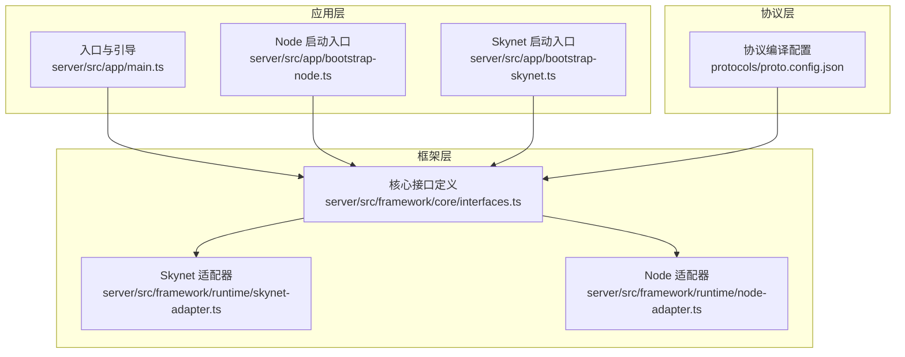
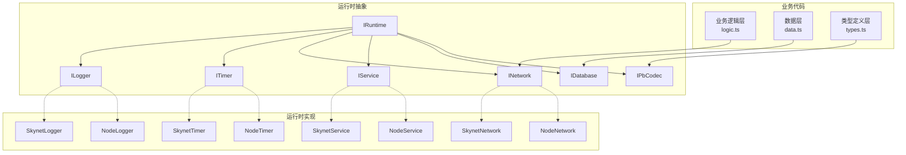
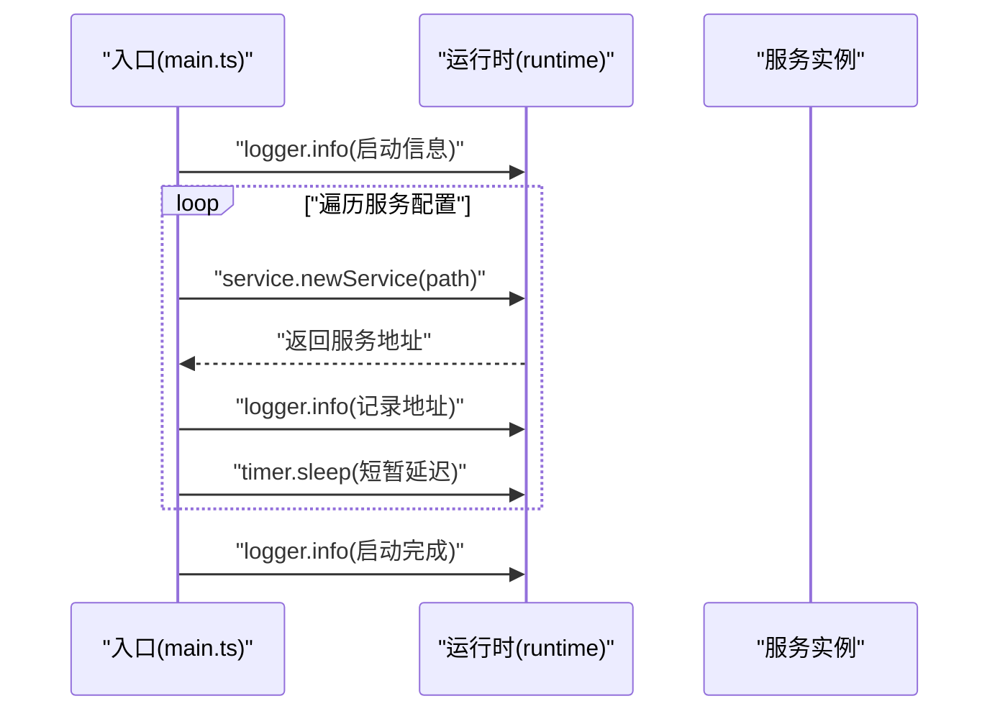
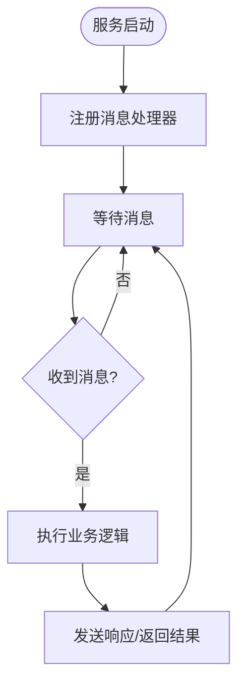
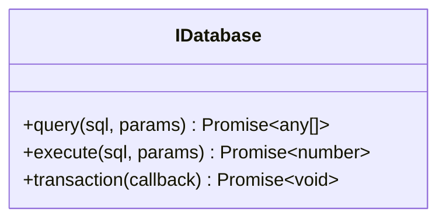
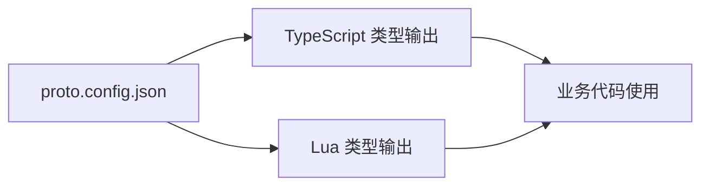
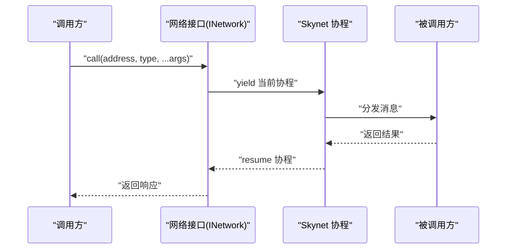
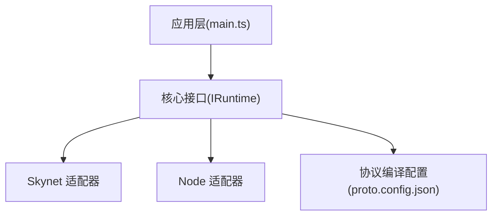

# 服务架构设计

<cite>
**本文引用的文件**
- [server/src/app/main.ts](file://server/src/app/main.ts)
- [server/src/app/bootstrap-node.ts](file://server/src/app/bootstrap-node.ts)
- [server/src/app/bootstrap-skynet.ts](file://server/src/app/bootstrap-skynet.ts)
- [server/src/framework/core/interfaces.ts](file://server/src/framework/core/interfaces.ts)
- [server/src/framework/runtime/skynet-adapter.ts](file://server/src/framework/runtime/skynet-adapter.ts)
- [server/src/framework/runtime/node-adapter.ts](file://server/src/framework/runtime/node-adapter.ts)
- [docs/架构设计文档.md](file://docs/架构设计文档.md)
- [protocols/proto.config.json](file://protocols/proto.config.json)
</cite>

## 目录
1. [简介](#简介)
2. [项目结构](#项目结构)
3. [核心组件](#核心组件)
4. [架构总览](#架构总览)
5. [详细组件分析](#详细组件分析)
6. [依赖关系分析](#依赖关系分析)
7. [性能考量](#性能考量)
8. [故障排查指南](#故障排查指南)
9. [结论](#结论)
10. [附录](#附录)

## 简介
本指南围绕服务架构设计展开，重点阐述以下主题：
- 服务架构的核心原则：单一职责原则、关注点分离、可热更新设计
- 服务的四个核心组件：入口与生命周期管理、业务逻辑层、数据持久化层、类型定义层
- 服务间通信架构：消息路由、远程调用、事件发布订阅
- 最佳实践：错误处理、性能优化、资源管理
- 提供架构图与代码示例路径，帮助开发者设计高质量的服务架构

## 项目结构
该项目采用“核心接口层 + 运行时适配层 + 业务层”的分层组织方式，支持在 Node.js 与 Skynet 两种运行环境上一致地编写业务代码。

**图表来源**
- [server/src/app/main.ts:1-106](file://server/src/app/main.ts#L1-L106)
- [server/src/app/bootstrap-node.ts:1-22](file://server/src/app/bootstrap-node.ts#L1-L22)
- [server/src/app/bootstrap-skynet.ts:1-20](file://server/src/app/bootstrap-skynet.ts#L1-L20)
- [server/src/framework/core/interfaces.ts:1-226](file://server/src/framework/core/interfaces.ts#L1-L226)
- [server/src/framework/runtime/skynet-adapter.ts:1-221](file://server/src/framework/runtime/skynet-adapter.ts#L1-L221)
- [server/src/framework/runtime/node-adapter.ts:1-194](file://server/src/framework/runtime/node-adapter.ts#L1-L194)
- [protocols/proto.config.json:1-15](file://protocols/proto.config.json#L1-L15)

**章节来源**
- [server/src/app/main.ts:1-106](file://server/src/app/main.ts#L1-L106)
- [server/src/framework/core/interfaces.ts:1-226](file://server/src/framework/core/interfaces.ts#L1-L226)
- [server/src/framework/runtime/skynet-adapter.ts:1-221](file://server/src/framework/runtime/skynet-adapter.ts#L1-L221)
- [server/src/framework/runtime/node-adapter.ts:1-194](file://server/src/framework/runtime/node-adapter.ts#L1-L194)
- [protocols/proto.config.json:1-15](file://protocols/proto.config.json#L1-L15)

## 核心组件
本节从“单一职责”和“关注点分离”的角度，定义服务的四个核心组件及其职责边界，并给出与现有代码的对应关系。

- index.ts（服务入口与生命周期管理）
  - 职责：负责服务的启动、停止、实例化与存活维持；协调服务间依赖与初始化顺序
  - 与现有代码的对应：应用入口与引导逻辑位于入口文件中，统一通过运行时接口启动服务
  - 参考路径：[server/src/app/main.ts:22-87](file://server/src/app/main.ts#L22-L87)

- logic.ts（业务逻辑层）
  - 职责：封装领域业务规则、状态机与流程控制；对外暴露稳定的接口供其他服务调用
  - 与现有代码的对应：业务逻辑通过网络接口注册消息处理器与响应调用，体现“逻辑即服务”
  - 参考路径：[server/src/framework/core/interfaces.ts:63-83](file://server/src/framework/core/interfaces.ts#L63-L83)

- data.ts（数据持久化层）
  - 职责：抽象数据库访问、事务与连接池；屏蔽具体存储实现差异
  - 与现有代码的对应：数据库接口定义为可选，便于按需接入 MySQL/Redis/MongoDB 等
  - 参考路径：[server/src/framework/core/interfaces.ts:88-103](file://server/src/framework/core/interfaces.ts#L88-L103)

- types.ts（类型定义层）
  - 职责：集中定义消息类型、请求/响应结构、枚举与常量；保证跨语言/跨环境一致性
  - 与现有代码的对应：协议编译配置指向 TypeScript 与 Lua 输出目录，支撑类型在多端复用
  - 参考路径：[protocols/proto.config.json:1-15](file://protocols/proto.config.json#L1-L15)

**章节来源**
- [server/src/app/main.ts:22-87](file://server/src/app/main.ts#L22-L87)
- [server/src/framework/core/interfaces.ts:63-103](file://server/src/framework/core/interfaces.ts#L63-L103)
- [protocols/proto.config.json:1-15](file://protocols/proto.config.json#L1-L15)

## 架构总览
该架构通过“抽象接口 + 运行时适配器”的方式，实现 Node.js 与 Skynet 的统一开发体验。业务代码只依赖接口，不依赖具体实现，从而实现跨环境的一致性与可维护性。

**图表来源**
- [server/src/framework/core/interfaces.ts:9-196](file://server/src/framework/core/interfaces.ts#L9-L196)
- [server/src/framework/runtime/skynet-adapter.ts:28-199](file://server/src/framework/runtime/skynet-adapter.ts#L28-L199)
- [server/src/framework/runtime/node-adapter.ts:19-172](file://server/src/framework/runtime/node-adapter.ts#L19-L172)

**章节来源**
- [server/src/framework/core/interfaces.ts:9-196](file://server/src/framework/core/interfaces.ts#L9-L196)
- [server/src/framework/runtime/skynet-adapter.ts:28-199](file://server/src/framework/runtime/skynet-adapter.ts#L28-L199)
- [server/src/framework/runtime/node-adapter.ts:19-172](file://server/src/framework/runtime/node-adapter.ts#L19-L172)

## 详细组件分析

### 组件一：入口与生命周期管理（index.ts）
- 设计要点
  - 通过统一的引导函数启动多个服务实例，支持按需并发启动
  - 使用运行时接口进行日志、定时、服务管理与消息通信
  - 保持主服务存活，避免运行时退出
- 关键流程
  - 读取服务配置，逐个创建服务实例
  - 记录启动日志与服务地址
  - 启动完成后输出汇总信息

**图表来源**
- [server/src/app/main.ts:31-77](file://server/src/app/main.ts#L31-L77)

**章节来源**
- [server/src/app/main.ts:31-77](file://server/src/app/main.ts#L31-L77)

### 组件二：业务逻辑层（logic.ts）
- 设计要点
  - 通过网络接口注册消息处理器，实现“请求-响应”与“通知”两类交互
  - 使用定时器接口实现延时、心跳与周期任务
  - 通过服务接口创建子服务或获取自身地址
- 典型流程
  - 初始化阶段注册消息处理器
  - 处理消息时调用业务方法并返回结果

**图表来源**
- [server/src/framework/core/interfaces.ts:63-83](file://server/src/framework/core/interfaces.ts#L63-L83)

**章节来源**
- [server/src/framework/core/interfaces.ts:63-83](file://server/src/framework/core/interfaces.ts#L63-L83)

### 组件三：数据持久化层（data.ts）
- 设计要点
  - 通过数据库接口抽象查询、执行与事务
  - 事务接口允许在单次回调内完成多条语句的原子性操作
- 使用建议
  - 将 SQL 参数化，避免注入风险
  - 在高并发场景下配合连接池与超时控制

**图表来源**
- [server/src/framework/core/interfaces.ts:88-103](file://server/src/framework/core/interfaces.ts#L88-L103)

**章节来源**
- [server/src/framework/core/interfaces.ts:88-103](file://server/src/framework/core/interfaces.ts#L88-L103)

### 组件四：类型定义层（types.ts）
- 设计要点
  - 通过协议编译配置统一生成 TypeScript 与 Lua 类型定义
  - 支持消息打包/解包与消息 ID 映射
- 使用建议
  - 保持消息类型稳定，遵循版本演进策略
  - 在跨语言传输时，优先使用结构化消息而非字符串

**图表来源**
- [protocols/proto.config.json:1-15](file://protocols/proto.config.json#L1-L15)

**章节来源**
- [protocols/proto.config.json:1-15](file://protocols/proto.config.json#L1-L15)

### 服务间通信架构
- 消息路由
  - 通过网络接口的消息类型标识进行路由，处理器根据类型分发到具体业务逻辑
- 远程调用
  - 使用 call 接口发起请求并等待响应，内部在 Skynet 下转换为协程挂起与恢复
- 事件发布订阅
  - 通过 dispatch 注册处理器，实现事件驱动的松耦合通信

**图表来源**
- [server/src/framework/core/interfaces.ts:63-83](file://server/src/framework/core/interfaces.ts#L63-L83)
- [server/src/framework/runtime/skynet-adapter.ts:127-155](file://server/src/framework/runtime/skynet-adapter.ts#L127-L155)

**章节来源**
- [server/src/framework/core/interfaces.ts:63-83](file://server/src/framework/core/interfaces.ts#L63-L83)
- [server/src/framework/runtime/skynet-adapter.ts:127-155](file://server/src/framework/runtime/skynet-adapter.ts#L127-L155)

## 依赖关系分析
- 组件耦合
  - 业务代码仅依赖 IRuntime 抽象，降低对具体运行时的耦合
  - 适配器实现与业务代码解耦，便于替换与扩展
- 外部依赖
  - Skynet 适配器依赖 Lua 环境提供的 API
  - Node 适配器依赖 Node.js 原生 API 与进程模型

**图表来源**
- [server/src/app/main.ts:8-106](file://server/src/app/main.ts#L8-L106)
- [server/src/framework/core/interfaces.ts:189-196](file://server/src/framework/core/interfaces.ts#L189-L196)
- [server/src/framework/runtime/skynet-adapter.ts:10-221](file://server/src/framework/runtime/skynet-adapter.ts#L10-L221)
- [server/src/framework/runtime/node-adapter.ts:1-194](file://server/src/framework/runtime/node-adapter.ts#L1-L194)
- [protocols/proto.config.json:1-15](file://protocols/proto.config.json#L1-L15)

**章节来源**
- [server/src/app/main.ts:8-106](file://server/src/app/main.ts#L8-L106)
- [server/src/framework/core/interfaces.ts:189-196](file://server/src/framework/core/interfaces.ts#L189-L196)
- [server/src/framework/runtime/skynet-adapter.ts:10-221](file://server/src/framework/runtime/skynet-adapter.ts#L10-L221)
- [server/src/framework/runtime/node-adapter.ts:1-194](file://server/src/framework/runtime/node-adapter.ts#L1-L194)
- [protocols/proto.config.json:1-15](file://protocols/proto.config.json#L1-L15)

## 性能考量
- 异步模型统一
  - 通过 TSTL 将 async/await 转换为 Lua 协程，减少回调地狱，提升可读性与可维护性
- 资源管理
  - 使用运行时接口进行定时与网络操作，避免阻塞主线程
  - 在 Skynet 环境下，利用协程挂起与恢复机制提高并发效率
- 热更新设计
  - 结合运行时环境的热更新能力，可在不中断服务的情况下替换代码模块
- 协议与序列化
  - 使用统一的协议编解码接口，减少序列化开销与跨语言差异带来的性能损耗

[本节为通用指导，无需特定文件引用]

## 故障排查指南
- 启动失败
  - 检查服务配置与路径是否正确
  - 查看引导日志，定位具体失败的服务实例
- 网络调用异常
  - 确认消息类型与处理器注册是否匹配
  - 检查被调用方是否正常存活与响应
- 日志与诊断
  - 使用运行时日志接口输出关键信息
  - 在 Skynet 环境下，结合服务地址与会话 ID 进行追踪

**章节来源**
- [server/src/app/main.ts:58-61](file://server/src/app/main.ts#L58-L61)
- [server/src/framework/core/interfaces.ts:9-14](file://server/src/framework/core/interfaces.ts#L9-L14)

## 结论
本指南基于现有代码实现了“抽象接口 + 运行时适配器”的服务架构设计，明确了四个核心组件的职责与协作方式，并给出了服务间通信与最佳实践建议。通过统一的接口与跨环境适配，开发者可以在 Node.js 与 Skynet 上以一致的方式编写高质量的服务架构。

[本节为总结性内容，无需特定文件引用]

## 附录
- 启动入口对比
  - Node.js 启动入口：[server/src/app/bootstrap-node.ts:1-22](file://server/src/app/bootstrap-node.ts#L1-L22)
  - Skynet 启动入口：[server/src/app/bootstrap-skynet.ts:1-20](file://server/src/app/bootstrap-skynet.ts#L1-L20)
- 架构设计文档参考
  - [docs/架构设计文档.md](file://docs/架构设计文档.md)

**章节来源**
- [server/src/app/bootstrap-node.ts:1-22](file://server/src/app/bootstrap-node.ts#L1-L22)
- [server/src/app/bootstrap-skynet.ts:1-20](file://server/src/app/bootstrap-skynet.ts#L1-L20)
- [docs/架构设计文档.md:1-834](file://docs/架构设计文档.md#L1-L834)