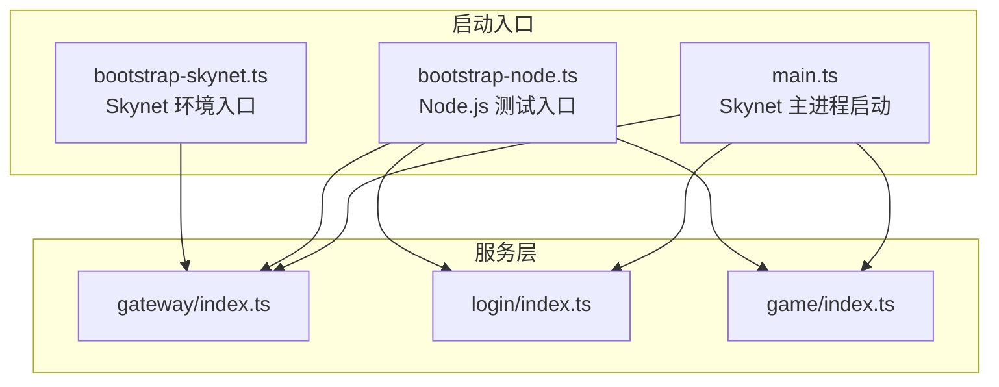
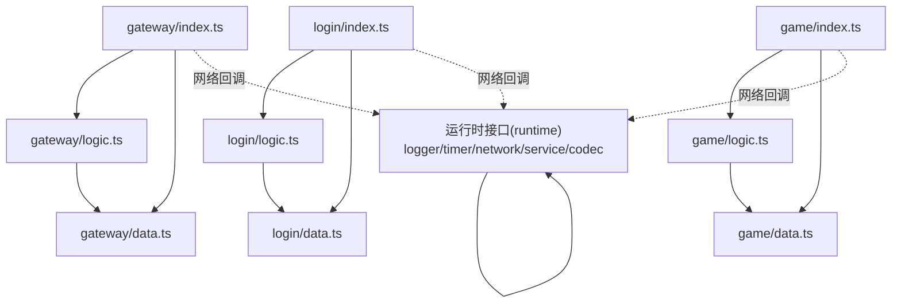
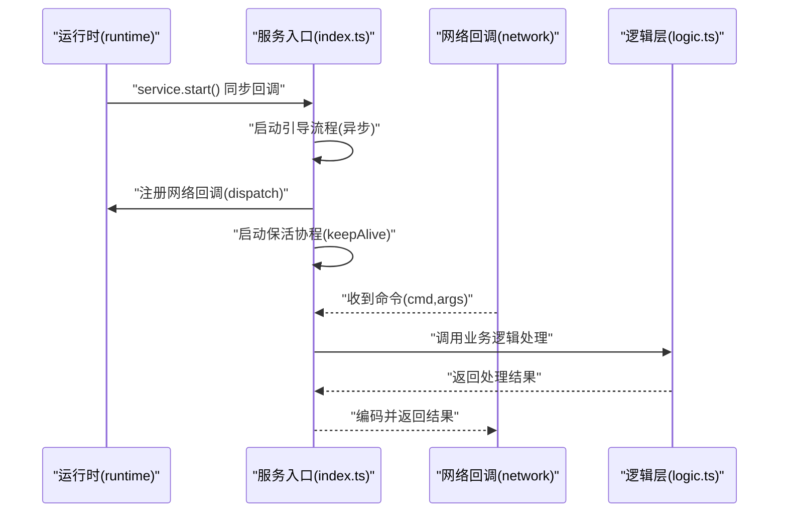
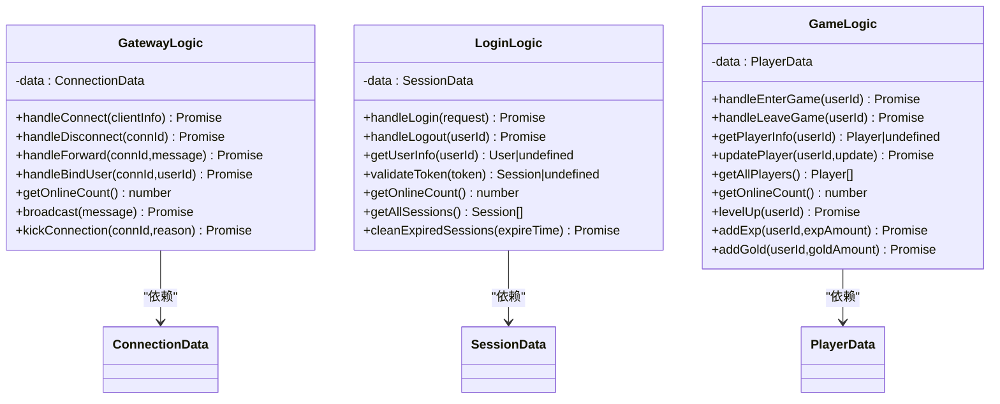
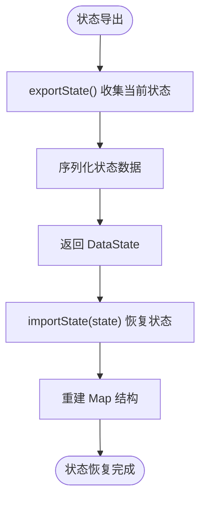
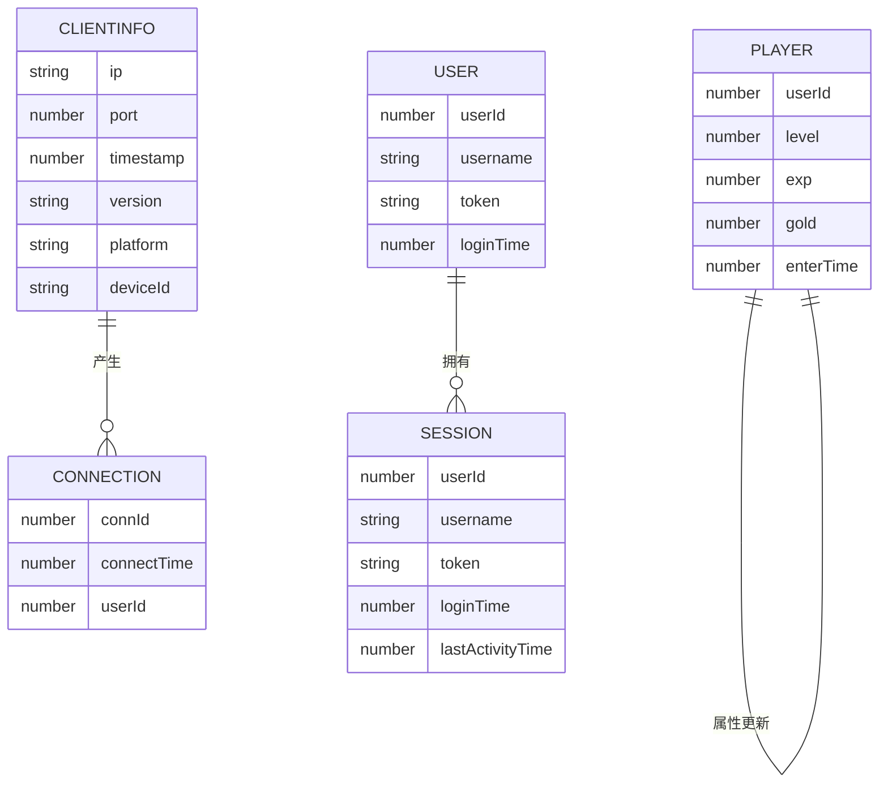
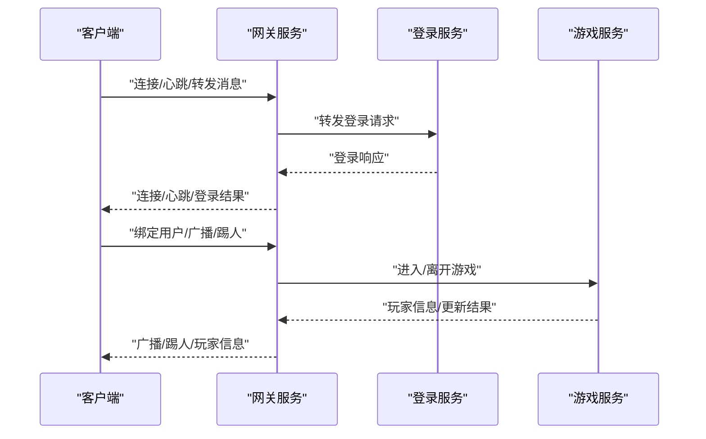
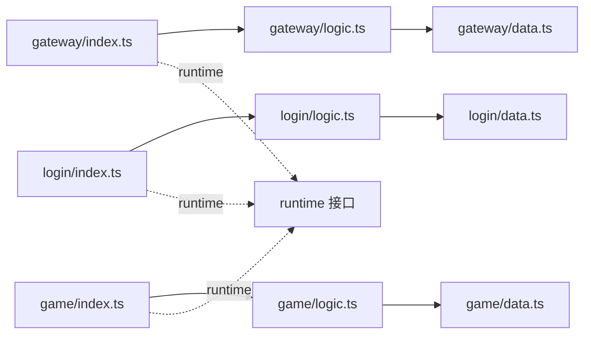

# 服务组件实现

<cite>
**本文档引用的文件**
- [server/src/app/main.ts](file://server/src/app/main.ts)
- [server/src/app/bootstrap-node.ts](file://server/src/app/bootstrap-node.ts)
- [server/src/app/bootstrap-skynet.ts](file://server/src/app/bootstrap-skynet.ts)
- [server/src/app/services/gateway/index.ts](file://server/src/app/services/gateway/index.ts)
- [server/src/app/services/login/index.ts](file://server/src/app/services/login/index.ts)
- [server/src/app/services/game/index.ts](file://server/src/app/services/game/index.ts)
- [server/src/app/services/gateway/logic.ts](file://server/src/app/services/gateway/logic.ts)
- [server/src/app/services/login/logic.ts](file://server/src/app/services/login/logic.ts)
- [server/src/app/services/game/logic.ts](file://server/src/app/services/game/logic.ts)
- [server/src/app/services/gateway/data.ts](file://server/src/app/services/gateway/data.ts)
- [server/src/app/services/login/data.ts](file://server/src/app/services/login/data.ts)
- [server/src/app/services/game/data.ts](file://server/src/app/services/game/data.ts)
- [server/src/app/services/gateway/types.ts](file://server/src/app/services/gateway/types.ts)
- [server/src/app/services/login/types.ts](file://server/src/app/services/login/types.ts)
- [server/src/app/services/game/types.ts](file://server/src/app/services/game/types.ts)
</cite>

## 目录
1. [简介](#简介)
2. [项目结构](#项目结构)
3. [核心组件](#核心组件)
4. [架构总览](#架构总览)
5. [详细组件分析](#详细组件分析)
6. [依赖分析](#依赖分析)
7. [性能考虑](#性能考虑)
8. [故障排除指南](#故障排除指南)
9. [结论](#结论)
10. [附录](#附录)

## 简介
本指南面向服务组件实现，围绕以下目标展开：系统化阐述 index.ts 中的服务启动逻辑、命令分发与生命周期管理；解析 logic.ts 中的业务逻辑处理、状态管理与算法实现；梳理 data.ts 中的数据持久化、缓存策略与数据库操作；明确 types.ts 中的类型定义、接口规范与数据模型。同时，说明各组件间的协作关系与数据流转过程，提供错误处理、异步操作与资源清理的关键实现细节，并对比 Node.js 与 Skynet 两种运行时环境下的实现差异。

## 项目结构
项目采用按功能域划分的服务组织方式，核心入口位于 server/src/app，包含：
- 启动入口：main.ts（Skynet 主进程）、bootstrap-node.ts（Node.js 测试模式）、bootstrap-skynet.ts（Skynet 环境）
- 服务层：gateway/login/game 三个服务，每个服务均包含 index.ts（启动与分发）、logic.ts（业务逻辑）、data.ts（数据存储）、types.ts（类型定义）

图表来源
- [server/src/app/main.ts:1-106](file://server/src/app/main.ts#L1-L106)
- [server/src/app/bootstrap-node.ts:1-22](file://server/src/app/bootstrap-node.ts#L1-L22)
- [server/src/app/bootstrap-skynet.ts:1-20](file://server/src/app/bootstrap-skynet.ts#L1-L20)

章节来源
- [server/src/app/main.ts:1-106](file://server/src/app/main.ts#L1-L106)
- [server/src/app/bootstrap-node.ts:1-22](file://server/src/app/bootstrap-node.ts#L1-L22)
- [server/src/app/bootstrap-skynet.ts:1-20](file://server/src/app/bootstrap-skynet.ts#L1-L20)

## 核心组件
本节聚焦四大核心文件的职责与实现要点：

- index.ts：服务启动、命令分发、生命周期守护协程
- logic.ts：业务逻辑处理、状态管理、算法实现
- data.ts：数据持久化、状态导出导入、缓存策略
- types.ts：类型定义、接口规范、数据模型

章节来源
- [server/src/app/services/gateway/index.ts:1-206](file://server/src/app/services/gateway/index.ts#L1-L206)
- [server/src/app/services/login/index.ts:1-154](file://server/src/app/services/login/index.ts#L1-L154)
- [server/src/app/services/game/index.ts:1-136](file://server/src/app/services/game/index.ts#L1-L136)
- [server/src/app/services/gateway/logic.ts:1-148](file://server/src/app/services/gateway/logic.ts#L1-L148)
- [server/src/app/services/login/logic.ts:1-151](file://server/src/app/services/login/logic.ts#L1-L151)
- [server/src/app/services/game/logic.ts:1-162](file://server/src/app/services/game/logic.ts#L1-L162)
- [server/src/app/services/gateway/data.ts:1-115](file://server/src/app/services/gateway/data.ts#L1-L115)
- [server/src/app/services/login/data.ts:1-128](file://server/src/app/services/login/data.ts#L1-L128)
- [server/src/app/services/game/data.ts:1-113](file://server/src/app/services/game/data.ts#L1-L113)
- [server/src/app/services/gateway/types.ts:1-145](file://server/src/app/services/gateway/types.ts#L1-L145)
- [server/src/app/services/login/types.ts:1-81](file://server/src/app/services/login/types.ts#L1-L81)
- [server/src/app/services/game/types.ts:1-56](file://server/src/app/services/game/types.ts#L1-L56)

## 架构总览
服务采用“入口层-逻辑层-数据层”的三层分离，配合统一的运行时接口，实现跨运行时的一致行为。整体交互如下：

图表来源
- [server/src/app/services/gateway/index.ts:1-206](file://server/src/app/services/gateway/index.ts#L1-L206)
- [server/src/app/services/login/index.ts:1-154](file://server/src/app/services/login/index.ts#L1-L154)
- [server/src/app/services/game/index.ts:1-136](file://server/src/app/services/game/index.ts#L1-L136)
- [server/src/app/services/gateway/logic.ts:1-148](file://server/src/app/services/gateway/logic.ts#L1-L148)
- [server/src/app/services/login/logic.ts:1-151](file://server/src/app/services/login/logic.ts#L1-L151)
- [server/src/app/services/game/logic.ts:1-162](file://server/src/app/services/game/logic.ts#L1-L162)
- [server/src/app/services/gateway/data.ts:1-115](file://server/src/app/services/gateway/data.ts#L1-L115)
- [server/src/app/services/login/data.ts:1-128](file://server/src/app/services/login/data.ts#L1-L128)
- [server/src/app/services/game/data.ts:1-113](file://server/src/app/services/game/data.ts#L1-L113)

## 详细组件分析

### 启动与生命周期管理（index.ts）
- 启动流程
  - 通过 runtime.service.start 注册同步启动回调，内部执行异步引导流程
  - 在引导完成后，启动“保活协程”，避免服务因无活跃协程而退出
- 命令分发
  - 使用 runtime.network.dispatch 注册消息处理器，内部可使用 async
  - 针对特定消息（如心跳、登录转发）进行特殊处理
- 生命周期
  - 保活协程定期休眠并输出调试日志，维持服务常驻
  - 错误处理：捕获命令执行异常并返回错误信息

图表来源
- [server/src/app/services/gateway/index.ts:170-206](file://server/src/app/services/gateway/index.ts#L170-L206)
- [server/src/app/services/login/index.ts:123-154](file://server/src/app/services/login/index.ts#L123-L154)
- [server/src/app/services/game/index.ts:108-136](file://server/src/app/services/game/index.ts#L108-L136)

章节来源
- [server/src/app/services/gateway/index.ts:170-206](file://server/src/app/services/gateway/index.ts#L170-L206)
- [server/src/app/services/login/index.ts:123-154](file://server/src/app/services/login/index.ts#L123-L154)
- [server/src/app/services/game/index.ts:108-136](file://server/src/app/services/game/index.ts#L108-L136)

### 业务逻辑处理（logic.ts）
- 设计原则
  - 逻辑类仅负责业务处理，不持有状态，通过构造函数注入数据层实例
  - 逻辑类支持热更新，便于快速迭代业务规则
- 关键算法
  - 登录服务：登录校验、令牌生成、会话清理
  - 网关服务：连接管理、绑定用户、广播、踢人
  - 游戏服务：玩家进入/离开、属性更新、经验与等级计算

图表来源
- [server/src/app/services/gateway/logic.ts:15-148](file://server/src/app/services/gateway/logic.ts#L15-L148)
- [server/src/app/services/login/logic.ts:15-151](file://server/src/app/services/login/logic.ts#L15-L151)
- [server/src/app/services/game/logic.ts:15-162](file://server/src/app/services/game/logic.ts#L15-L162)

章节来源
- [server/src/app/services/gateway/logic.ts:15-148](file://server/src/app/services/gateway/logic.ts#L15-L148)
- [server/src/app/services/login/logic.ts:15-151](file://server/src/app/services/login/logic.ts#L15-L151)
- [server/src/app/services/game/logic.ts:15-162](file://server/src/app/services/game/logic.ts#L15-L162)

### 数据持久化与状态管理（data.ts）
- 设计原则
  - 数据层不包含业务逻辑，仅负责状态存储与导出导入
  - 不参与热更新，保证状态持久性
- 状态导出/导入
  - 提供 exportState/importState 用于热更新时的状态迁移
- 缓存策略
  - 使用内存 Map 作为主要缓存容器，提供 O(1) 级别的读写性能
  - 清理策略：登录服务提供过期会话清理定时器

图表来源
- [server/src/app/services/gateway/data.ts:96-114](file://server/src/app/services/gateway/data.ts#L96-L114)
- [server/src/app/services/login/data.ts:109-126](file://server/src/app/services/login/data.ts#L109-L126)
- [server/src/app/services/game/data.ts:98-111](file://server/src/app/services/game/data.ts#L98-L111)

章节来源
- [server/src/app/services/gateway/data.ts:15-115](file://server/src/app/services/gateway/data.ts#L15-L115)
- [server/src/app/services/login/data.ts:13-128](file://server/src/app/services/login/data.ts#L13-L128)
- [server/src/app/services/game/data.ts:13-113](file://server/src/app/services/game/data.ts#L13-L113)

### 类型定义与接口规范（types.ts）
- 类型职责
  - types.ts 集中定义服务内部使用的数据结构与命令参数类型
  - 与外部通信时通过 codec 转换为 proto 类型
- 关键类型
  - 网关：ClientInfo、Connection、Message、MessageType、AnyMessage、DataState、CommandArgs
  - 登录：User、LoginRequest、LoginResponse、Session、DataState、CommandArgs
  - 游戏：Player、PlayerUpdate、DataState、CommandArgs

图表来源
- [server/src/app/services/gateway/types.ts:14-41](file://server/src/app/services/gateway/types.ts#L14-L41)
- [server/src/app/services/login/types.ts:16-53](file://server/src/app/services/login/types.ts#L16-L53)
- [server/src/app/services/game/types.ts:14-20](file://server/src/app/services/game/types.ts#L14-L20)

章节来源
- [server/src/app/services/gateway/types.ts:1-145](file://server/src/app/services/gateway/types.ts#L1-L145)
- [server/src/app/services/login/types.ts:1-81](file://server/src/app/services/login/types.ts#L1-L81)
- [server/src/app/services/game/types.ts:1-56](file://server/src/app/services/game/types.ts#L1-L56)

### 组件协作与数据流
- 入口层接收网络消息，调用逻辑层处理，逻辑层访问数据层，最终通过运行时接口返回结果
- 特殊流程：网关服务的心跳与登录转发，登录服务的会话清理定时器

图表来源
- [server/src/app/services/gateway/index.ts:177-193](file://server/src/app/services/gateway/index.ts#L177-L193)
- [server/src/app/services/login/index.ts:130-139](file://server/src/app/services/login/index.ts#L130-L139)
- [server/src/app/services/game/index.ts:115-124](file://server/src/app/services/game/index.ts#L115-L124)

章节来源
- [server/src/app/services/gateway/index.ts:177-193](file://server/src/app/services/gateway/index.ts#L177-L193)
- [server/src/app/services/login/index.ts:130-139](file://server/src/app/services/login/index.ts#L130-L139)
- [server/src/app/services/game/index.ts:115-124](file://server/src/app/services/game/index.ts#L115-L124)

## 依赖分析
- 组件内聚与耦合
  - 入口层仅负责启动与分发，耦合度低
  - 逻辑层通过构造函数注入数据层，遵循依赖倒置
  - 数据层与逻辑层单向依赖，无循环依赖
- 外部依赖
  - 运行时接口（runtime）提供日志、定时器、网络、服务、编解码能力
  - Protobuf 编解码用于跨服务通信

图表来源
- [server/src/app/services/gateway/index.ts:1-206](file://server/src/app/services/gateway/index.ts#L1-L206)
- [server/src/app/services/login/index.ts:1-154](file://server/src/app/services/login/index.ts#L1-L154)
- [server/src/app/services/game/index.ts:1-136](file://server/src/app/services/game/index.ts#L1-L136)

章节来源
- [server/src/app/services/gateway/index.ts:1-206](file://server/src/app/services/gateway/index.ts#L1-L206)
- [server/src/app/services/login/index.ts:1-154](file://server/src/app/services/login/index.ts#L1-L154)
- [server/src/app/services/game/index.ts:1-136](file://server/src/app/services/game/index.ts#L1-L136)

## 性能考虑
- 异步与并发
  - 使用 async/await 处理异步操作，避免阻塞网络回调
  - 保活协程采用定时休眠，降低 CPU 占用
- 缓存与存储
  - 内存 Map 提供高效读写；对于大规模数据可引入 LRU 缓存
  - 登录服务的会话清理采用定时器，避免频繁扫描
- 序列化
  - Protobuf 编解码提升跨服务通信效率，减少序列化开销

## 故障排除指南
- 启动失败
  - 检查 runtime.service.start 是否为同步回调
  - 确认引导流程未抛出未捕获异常
- 命令处理异常
  - 入口层已捕获命令执行异常并返回错误信息
  - 检查逻辑层参数校验与边界条件
- 服务退出
  - 确保保活协程持续运行，避免无活跃协程导致服务退出
- 状态丢失
  - 热更新前后检查 exportState/importState 是否正确执行

章节来源
- [server/src/app/services/gateway/index.ts:180-193](file://server/src/app/services/gateway/index.ts#L180-L193)
- [server/src/app/services/login/index.ts:133-139](file://server/src/app/services/login/index.ts#L133-L139)
- [server/src/app/services/game/index.ts:118-124](file://server/src/app/services/game/index.ts#L118-L124)

## 结论
该服务组件实现通过清晰的三层分离与统一运行时接口，实现了跨 Node.js 与 Skynet 的一致行为。入口层专注启动与分发，逻辑层专注业务处理，数据层专注状态持久化。配合完善的类型定义、错误处理与资源清理机制，能够满足高并发场景下的稳定性与可维护性需求。

## 附录

### 运行时环境差异与实现要点
- Node.js 环境
  - 通过 bootstrap-node.ts 设置运行时并导入服务模块
  - 服务模块的 runtime.service.start 为异步回调，需注意启动顺序
- Skynet 环境
  - 通过 bootstrap-skynet.ts 设置运行时并预加载服务模块
  - 服务启动回调必须为同步函数，进入消息循环后保持活跃协程

章节来源
- [server/src/app/bootstrap-node.ts:1-22](file://server/src/app/bootstrap-node.ts#L1-L22)
- [server/src/app/bootstrap-skynet.ts:1-20](file://server/src/app/bootstrap-skynet.ts#L1-L20)

### 启动与引导流程（main.ts）
- 服务配置与批量启动
  - 通过 serviceConfigs 定义服务名称、路径与实例数量
  - 使用 runtime.service.newService 启动服务并等待初始化
- 引导完成
  - 输出启动日志与服务地址清单
  - 保活协程持续运行，确保主服务存活

章节来源
- [server/src/app/main.ts:22-87](file://server/src/app/main.ts#L22-L87)