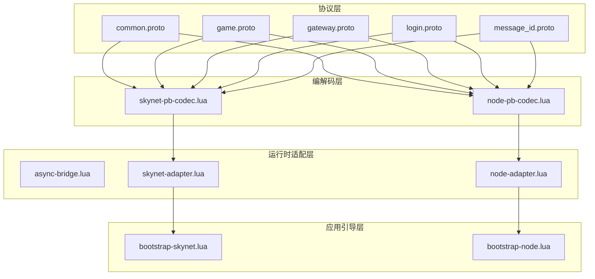
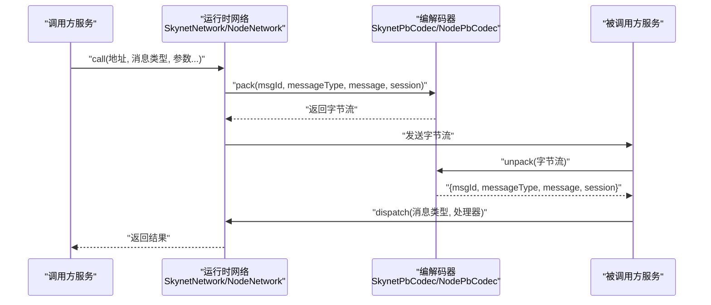
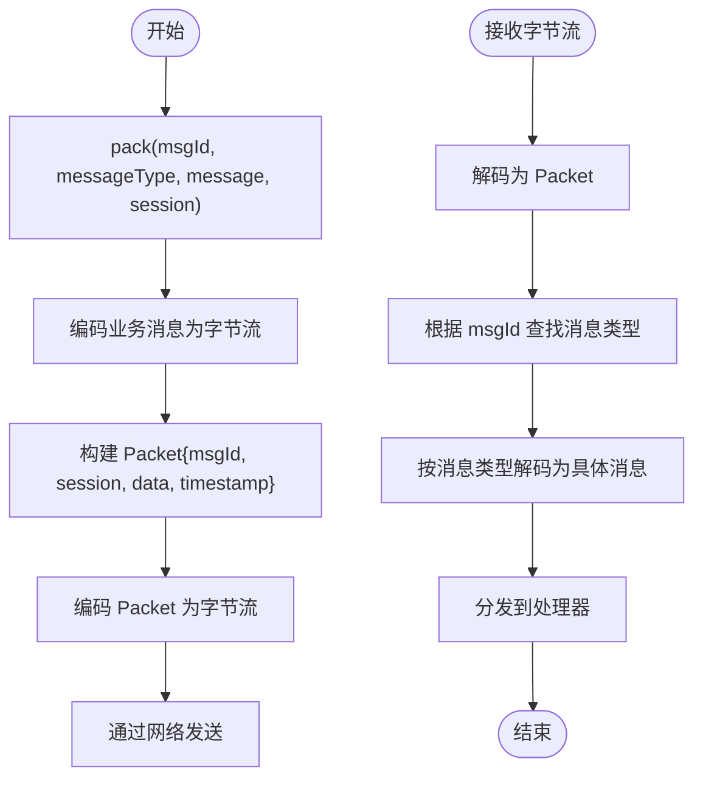
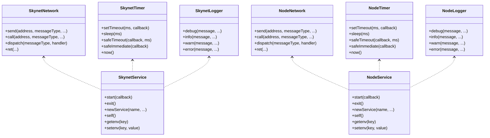
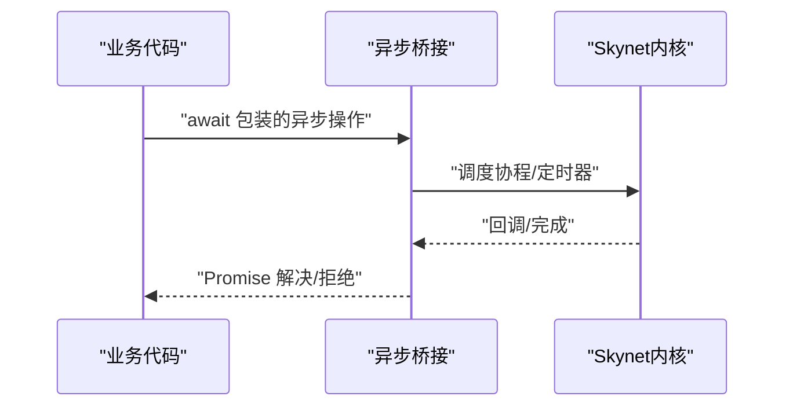
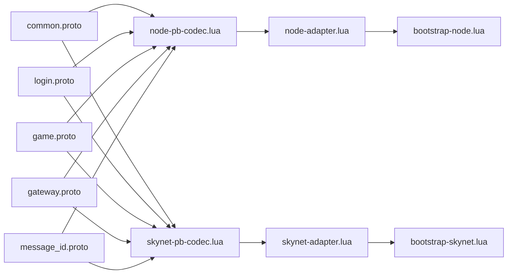

# 服务通信机制

<cite>
**本文引用的文件**
- [common.proto](file://protocols/proto/common.proto)
- [game.proto](file://protocols/proto/game.proto)
- [gateway.proto](file://protocols/proto/gateway.proto)
- [login.proto](file://protocols/proto/login.proto)
- [message_id.proto](file://protocols/proto/message_id.proto)
- [node-pb-codec.lua](file://docker/lua/framework/runtime/node-pb-codec.lua)
- [skynet-pb-codec.lua](file://docker/lua/framework/runtime/skynet-pb-codec.lua)
- [async-bridge.lua](file://docker/lua/framework/runtime/async-bridge.lua)
- [node-adapter.lua](file://docker/lua/framework/runtime/node-adapter.lua)
- [skynet-adapter.lua](file://docker/lua/framework/runtime/skynet-adapter.lua)
- [bootstrap-skynet.lua](file://docker/lua/app/bootstrap-skynet.lua)
- [bootstrap-node.lua](file://docker/lua/app/bootstrap-node.lua)
</cite>

## 目录
1. [引言](#引言)
2. [项目结构](#项目结构)
3. [核心组件](#核心组件)
4. [架构总览](#架构总览)
5. [详细组件分析](#详细组件分析)
6. [依赖关系分析](#依赖关系分析)
7. [性能考虑](#性能考虑)
8. [故障排查指南](#故障排查指南)
9. [结论](#结论)
10. [附录](#附录)

## 引言
本文件系统性阐述本项目的“服务通信机制”，围绕以下目标展开：
- 多种服务间通信方式：消息传递（runtime.network.dispatch/call）、远程过程调用、事件发布订阅、广播通信
- Protobuf 消息编解码机制：消息定义、序列化、反序列化流程
- 服务发现与注册：服务地址解析、负载均衡、故障转移思路
- 具体通信示例：同步调用、异步回调、超时处理、错误重试
- 安全与性能优化：消息压缩、批量处理、连接池管理等

## 项目结构
项目采用“协议定义 + 编解码适配层 + 运行时适配层 + 应用引导”的分层组织：
- 协议层：以 Protobuf 定义消息模型与消息 ID 映射
- 编解码层：Node.js 与 Skynet 双环境的 Protobuf 编解码器
- 运行时适配层：统一的日志、定时器、网络、服务抽象接口
- 应用引导层：分别在 Node.js 与 Skynet 环境下启动服务

图表来源
- [common.proto:1-39](file://protocols/proto/common.proto#L1-L39)
- [game.proto:1-141](file://protocols/proto/game.proto#L1-L141)
- [gateway.proto:1-70](file://protocols/proto/gateway.proto#L1-L70)
- [login.proto:1-83](file://protocols/proto/login.proto#L1-L83)
- [message_id.proto:1-48](file://protocols/proto/message_id.proto#L1-L48)
- [node-pb-codec.lua:1-185](file://docker/lua/framework/runtime/node-pb-codec.lua#L1-L185)
- [skynet-pb-codec.lua:1-164](file://docker/lua/framework/runtime/skynet-pb-codec.lua#L1-L164)
- [node-adapter.lua:1-207](file://docker/lua/framework/runtime/node-adapter.lua#L1-L207)
- [skynet-adapter.lua:1-227](file://docker/lua/framework/runtime/skynet-adapter.lua#L1-L227)
- [bootstrap-skynet.lua:1-12](file://docker/lua/app/bootstrap-skynet.lua#L1-L12)
- [bootstrap-node.lua:1-17](file://docker/lua/app/bootstrap-node.lua#L1-L17)

章节来源
- [common.proto:1-39](file://protocols/proto/common.proto#L1-L39)
- [game.proto:1-141](file://protocols/proto/game.proto#L1-L141)
- [gateway.proto:1-70](file://protocols/proto/gateway.proto#L1-L70)
- [login.proto:1-83](file://protocols/proto/login.proto#L1-L83)
- [message_id.proto:1-48](file://protocols/proto/message_id.proto#L1-L48)
- [node-pb-codec.lua:1-185](file://docker/lua/framework/runtime/node-pb-codec.lua#L1-L185)
- [skynet-pb-codec.lua:1-164](file://docker/lua/framework/runtime/skynet-pb-codec.lua#L1-L164)
- [node-adapter.lua:1-207](file://docker/lua/framework/runtime/node-adapter.lua#L1-L207)
- [skynet-adapter.lua:1-227](file://docker/lua/framework/runtime/skynet-adapter.lua#L1-L227)
- [bootstrap-skynet.lua:1-12](file://docker/lua/app/bootstrap-skynet.lua#L1-L12)
- [bootstrap-node.lua:1-17](file://docker/lua/app/bootstrap-node.lua#L1-L17)

## 核心组件
- Protobuf 消息模型与消息 ID 映射
  - 通用包 common：Packet（消息封装）、ErrorCode（错误码）、Response（通用响应）
  - 业务包 login、gateway、game：定义登录、网关、游戏相关请求/响应消息
  - 协议包 protocol：MessageId（消息 ID 枚举），用于路由与识别
- 编解码器
  - NodePbCodec：基于 TypeScriptToLua 生成的 proto 模块进行 encode/decode/pack/unpack
  - SkynetPbCodec：加载 .desc 描述文件，使用 pb/protoc 进行 encode/decode/pack/unpack
- 运行时适配
  - Node 适配：NodeNetwork（send/call/dispatch/ret）、NodeService、NodeTimer、NodeLogger
  - Skynet 适配：SkynetNetwork（send/call/dispatch/ret）、SkynetService、SkynetTimer、SkynetLogger
- 异步桥接
  - 提供 Skynet 环境下的 Promise 实现与协程包装，支持 async/await 与 skynet.call 等阻塞操作

章节来源
- [common.proto:1-39](file://protocols/proto/common.proto#L1-L39)
- [login.proto:1-83](file://protocols/proto/login.proto#L1-L83)
- [gateway.proto:1-70](file://protocols/proto/gateway.proto#L1-L70)
- [game.proto:1-141](file://protocols/proto/game.proto#L1-L141)
- [message_id.proto:1-48](file://protocols/proto/message_id.proto#L1-L48)
- [node-pb-codec.lua:1-185](file://docker/lua/framework/runtime/node-pb-codec.lua#L1-L185)
- [skynet-pb-codec.lua:1-164](file://docker/lua/framework/runtime/skynet-pb-codec.lua#L1-L164)
- [node-adapter.lua:1-207](file://docker/lua/framework/runtime/node-adapter.lua#L1-L207)
- [skynet-adapter.lua:1-227](file://docker/lua/framework/runtime/skynet-adapter.lua#L1-L227)
- [async-bridge.lua:1-243](file://docker/lua/framework/runtime/async-bridge.lua#L1-L243)

## 架构总览
本项目通过“消息封装 + 消息 ID + 类型映射 + 编解码器 + 运行时网络”实现跨服务通信。消息在发送前由编解码器打包为 common.Packet，包含 msgId、session、data、timestamp；接收端根据 msgId 查找消息类型并反序列化。

图表来源
- [skynet-adapter.lua:128-167](file://docker/lua/framework/runtime/skynet-adapter.lua#L128-L167)
- [node-adapter.lua:88-140](file://docker/lua/framework/runtime/node-adapter.lua#L88-L140)
- [skynet-pb-codec.lua:127-162](file://docker/lua/framework/runtime/skynet-pb-codec.lua#L127-L162)
- [node-pb-codec.lua:160-183](file://docker/lua/framework/runtime/node-pb-codec.lua#L160-L183)

## 详细组件分析

### Protobuf 消息模型与编解码流程
- 消息封装
  - common.Packet：统一承载 msgId、session、data、timestamp，所有业务消息均被封装为 Packet 发送
- 编解码器职责
  - pack：将业务消息编码为字节流，再封装为 Packet
  - unpack：将字节流解析为 Packet，查表得到消息类型后解码为具体消息
- 类型映射
  - Node/Skynet 两端维护 msgId 到消息类型的双向映射，确保跨语言/跨环境一致

图表来源
- [node-pb-codec.lua:160-183](file://docker/lua/framework/runtime/node-pb-codec.lua#L160-L183)
- [skynet-pb-codec.lua:127-162](file://docker/lua/framework/runtime/skynet-pb-codec.lua#L127-L162)
- [common.proto:9-14](file://protocols/proto/common.proto#L9-L14)

章节来源
- [common.proto:1-39](file://protocols/proto/common.proto#L1-L39)
- [node-pb-codec.lua:1-185](file://docker/lua/framework/runtime/node-pb-codec.lua#L1-L185)
- [skynet-pb-codec.lua:1-164](file://docker/lua/framework/runtime/skynet-pb-codec.lua#L1-L164)

### 运行时网络与服务抽象
- SkynetNetwork
  - send/call/dispatch/ret：直接调用 skynet.* 接口，支持协程包装与异步错误捕获
- NodeNetwork
  - send/call/dispatch/ret：提供 mock 实现，便于本地调试与演示
- NodeService/SkynetService
  - start/newService/self/getenv/setenv：统一服务生命周期与环境变量管理
- NodeTimer/SkynetTimer
  - setTimeout/sleep/safeTimeout：跨环境时间控制与安全执行
- NodeLogger/SkynetLogger
  - 统一日志输出，Skynet 版本带时间戳格式化

图表来源
- [skynet-adapter.lua:128-203](file://docker/lua/framework/runtime/skynet-adapter.lua#L128-L203)
- [node-adapter.lua:88-183](file://docker/lua/framework/runtime/node-adapter.lua#L88-L183)

章节来源
- [skynet-adapter.lua:1-227](file://docker/lua/framework/runtime/skynet-adapter.lua#L1-L227)
- [node-adapter.lua:1-207](file://docker/lua/framework/runtime/node-adapter.lua#L1-L207)

### 异步桥接与协程支持
- SkynetPromise：在 Skynet 环境下实现 Promise 语义，支持 then/catch/all
- wrapSkynetCoroutine：将业务函数包装为可 await 的协程任务
- sleep：跨环境睡眠工具，内部使用 setTimeout 或 skynet.timeout

图表来源
- [async-bridge.lua:1-243](file://docker/lua/framework/runtime/async-bridge.lua#L1-L243)

章节来源
- [async-bridge.lua:1-243](file://docker/lua/framework/runtime/async-bridge.lua#L1-L243)

### 通信示例与最佳实践

- 同步调用（RPC）
  - 调用方：使用 runtime.network.call 发起请求，等待返回
  - 被调用方：通过 runtime.network.dispatch 注册处理器，处理完成后 ret 返回
  - 示例路径参考
    - [skynet-adapter.lua:137-167](file://docker/lua/framework/runtime/skynet-adapter.lua#L137-L167)
    - [node-adapter.lua:101-140](file://docker/lua/framework/runtime/node-adapter.lua#L101-L140)

- 异步回调
  - 使用 Promise 风格链式 then/catch，或 async/await
  - 示例路径参考
    - [async-bridge.lua:79-154](file://docker/lua/framework/runtime/async-bridge.lua#L79-L154)

- 超时处理
  - 使用 safeTimeout/sleep 安全调度，避免阻塞
  - 示例路径参考
    - [skynet-adapter.lua:109-127](file://docker/lua/framework/runtime/skynet-adapter.lua#L109-L127)
    - [node-adapter.lua:64-86](file://docker/lua/framework/runtime/node-adapter.lua#L64-L86)

- 错误重试
  - 在 dispatch 回调中捕获异常，结合 safeTimeout 进行指数退避重试
  - 示例路径参考
    - [skynet-adapter.lua:157-161](file://docker/lua/framework/runtime/skynet-adapter.lua#L157-L161)
    - [node-adapter.lua:77-85](file://docker/lua/framework/runtime/node-adapter.lua#L77-L85)

- 广播通信
  - 将消息类型标记为广播，遍历已知服务地址进行发送
  - 示例路径参考
    - [gateway.proto:62-69](file://protocols/proto/gateway.proto#L62-L69)

- 事件发布订阅
  - 通过消息类型区分事件，订阅者注册对应 dispatch 处理器
  - 示例路径参考
    - [node-adapter.lua:133-136](file://docker/lua/framework/runtime/node-adapter.lua#L133-L136)

章节来源
- [skynet-adapter.lua:128-203](file://docker/lua/framework/runtime/skynet-adapter.lua#L128-L203)
- [node-adapter.lua:88-183](file://docker/lua/framework/runtime/node-adapter.lua#L88-L183)
- [gateway.proto:62-69](file://protocols/proto/gateway.proto#L62-L69)
- [async-bridge.lua:1-243](file://docker/lua/framework/runtime/async-bridge.lua#L1-L243)

### 服务发现与注册机制
- 地址解析
  - Node/Skynet 适配器提供 newService/self/getenv/setenv，用于动态创建与查询服务地址
- 负载均衡
  - 可在上层引入服务列表与轮询/权重策略，在 call/send 前选择目标地址
- 故障转移
  - 对失败的 call 设置超时与重试，必要时切换到备用节点

章节来源
- [skynet-adapter.lua:169-203](file://docker/lua/framework/runtime/skynet-adapter.lua#L169-L203)
- [node-adapter.lua:142-183](file://docker/lua/framework/runtime/node-adapter.lua#L142-L183)

## 依赖关系分析
- 协议依赖
  - game/login/gateway 依赖 common（Packet/ErrorCode/Response）
  - 编解码器依赖 message_id（msgId 映射）
- 运行时依赖
  - 适配器依赖各自环境的网络/服务/定时器能力
  - 适配器通过 codec 统一编解码

图表来源
- [common.proto:1-39](file://protocols/proto/common.proto#L1-L39)
- [login.proto:1-83](file://protocols/proto/login.proto#L1-L83)
- [game.proto:1-141](file://protocols/proto/game.proto#L1-L141)
- [gateway.proto:1-70](file://protocols/proto/gateway.proto#L1-L70)
- [message_id.proto:1-48](file://protocols/proto/message_id.proto#L1-L48)
- [node-pb-codec.lua:1-185](file://docker/lua/framework/runtime/node-pb-codec.lua#L1-L185)
- [skynet-pb-codec.lua:1-164](file://docker/lua/framework/runtime/skynet-pb-codec.lua#L1-L164)
- [node-adapter.lua:1-207](file://docker/lua/framework/runtime/node-adapter.lua#L1-L207)
- [skynet-adapter.lua:1-227](file://docker/lua/framework/runtime/skynet-adapter.lua#L1-L227)
- [bootstrap-skynet.lua:1-12](file://docker/lua/app/bootstrap-skynet.lua#L1-L12)
- [bootstrap-node.lua:1-17](file://docker/lua/app/bootstrap-node.lua#L1-L17)

章节来源
- [node-pb-codec.lua:1-185](file://docker/lua/framework/runtime/node-pb-codec.lua#L1-L185)
- [skynet-pb-codec.lua:1-164](file://docker/lua/framework/runtime/skynet-pb-codec.lua#L1-L164)
- [node-adapter.lua:1-207](file://docker/lua/framework/runtime/node-adapter.lua#L1-L207)
- [skynet-adapter.lua:1-227](file://docker/lua/framework/runtime/skynet-adapter.lua#L1-L227)
- [bootstrap-skynet.lua:1-12](file://docker/lua/app/bootstrap-skynet.lua#L1-L12)
- [bootstrap-node.lua:1-17](file://docker/lua/app/bootstrap-node.lua#L1-L17)

## 性能考虑
- 消息压缩
  - 在编解码器层增加压缩选项，对大包进行 gzip/snappy 压缩后再发送
- 批量处理
  - 将多个小消息合并为批次，减少网络往返与封包开销
- 连接池管理
  - 在 Node 环境可使用长连接池；Skynet 环境复用服务间通信通道
- 编解码优化
  - 预热 proto 模块与类型映射，避免运行时反射开销
- 超时与背压
  - 为 call 设置合理超时，超过阈值主动降级或快速失败

## 故障排查指南
- 编解码错误
  - 检查 msgId 是否在两端映射一致；确认消息类型字符串格式是否为 "包.消息"
  - 参考路径
    - [node-pb-codec.lua:76-103](file://docker/lua/framework/runtime/node-pb-codec.lua#L76-L103)
    - [skynet-pb-codec.lua:91-122](file://docker/lua/framework/runtime/skynet-pb-codec.lua#L91-L122)
- 网络调用无响应
  - 确认被调用方是否正确注册了 dispatch；检查 call 的 session 是否匹配
  - 参考路径
    - [skynet-adapter.lua:148-167](file://docker/lua/framework/runtime/skynet-adapter.lua#L148-L167)
    - [node-adapter.lua:133-140](file://docker/lua/framework/runtime/node-adapter.lua#L133-L140)
- 异步错误未被捕获
  - 使用 safeTimeout/safeImmediate 包裹回调，避免异常吞没
  - 参考路径
    - [skynet-adapter.lua:114-127](file://docker/lua/framework/runtime/skynet-adapter.lua#L114-L127)
    - [node-adapter.lua:77-86](file://docker/lua/framework/runtime/node-adapter.lua#L77-L86)

章节来源
- [node-pb-codec.lua:76-131](file://docker/lua/framework/runtime/node-pb-codec.lua#L76-L131)
- [skynet-pb-codec.lua:91-122](file://docker/lua/framework/runtime/skynet-pb-codec.lua#L91-L122)
- [skynet-adapter.lua:148-167](file://docker/lua/framework/runtime/skynet-adapter.lua#L148-L167)
- [node-adapter.lua:133-140](file://docker/lua/framework/runtime/node-adapter.lua#L133-L140)

## 结论
本项目通过统一的 Protobuf 消息模型与编解码器，结合 Node.js 与 Skynet 的运行时适配，提供了跨环境、跨语言的服务通信基础能力。借助 async/await 与 Promise 的桥接，开发者可以以同步风格编写异步逻辑，并通过超时、重试、广播、事件订阅等模式构建健壮的分布式系统。

## 附录
- 引导入口
  - Skynet 环境：bootstrap-skynet.lua 设置运行时并加载网关服务
  - Node.js 环境：bootstrap-node.lua 加载登录/游戏/网关服务并设置运行时
- 协议清单
  - common：通用消息封装与错误码
  - login：登录/登出/令牌校验/在线人数
  - gateway：心跳/连接/断开/消息类型枚举
  - game：进入/离开/查询/更新玩家信息/增经验/增金币
  - message_id：消息 ID 枚举与分段命名空间

章节来源
- [bootstrap-skynet.lua:1-12](file://docker/lua/app/bootstrap-skynet.lua#L1-L12)
- [bootstrap-node.lua:1-17](file://docker/lua/app/bootstrap-node.lua#L1-L17)
- [common.proto:1-39](file://protocols/proto/common.proto#L1-L39)
- [login.proto:1-83](file://protocols/proto/login.proto#L1-L83)
- [gateway.proto:1-70](file://protocols/proto/gateway.proto#L1-L70)
- [game.proto:1-141](file://protocols/proto/game.proto#L1-L141)
- [message_id.proto:1-48](file://protocols/proto/message_id.proto#L1-L48)