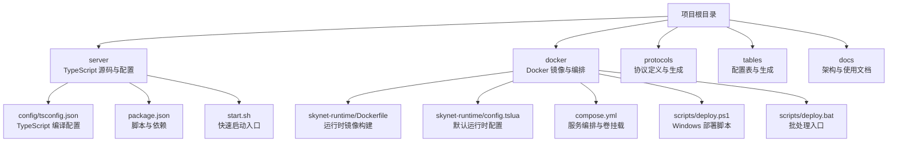
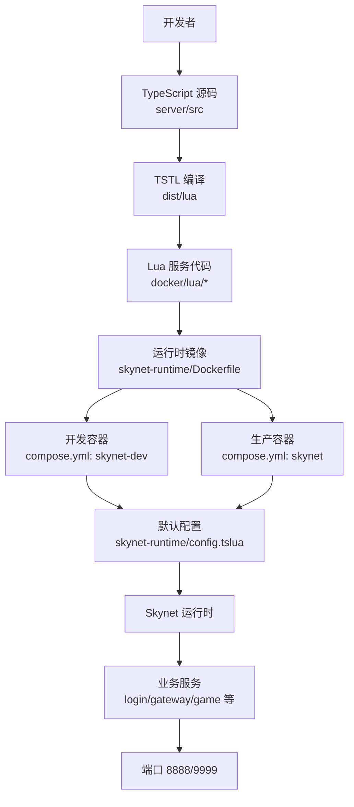
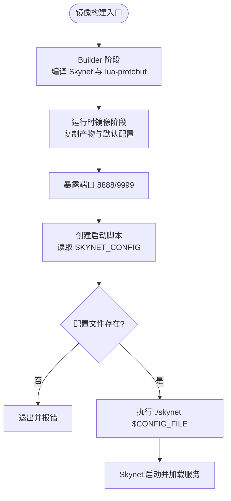
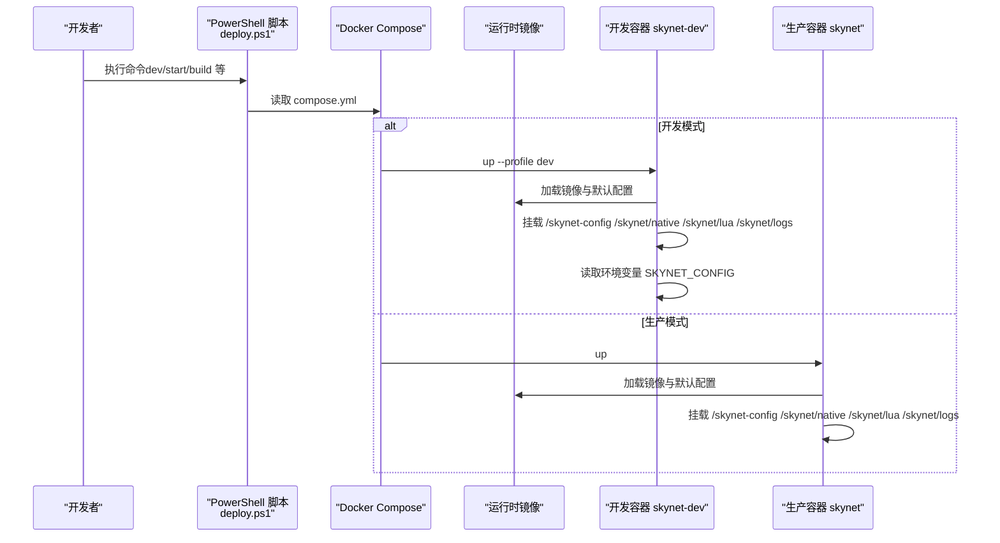
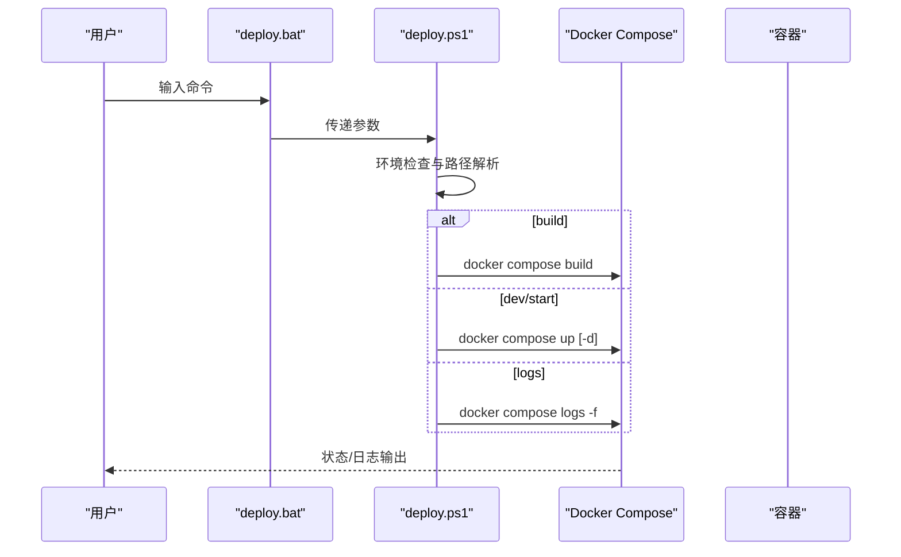
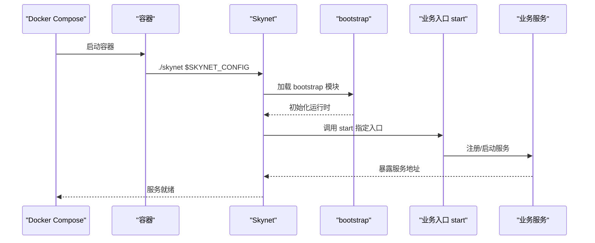
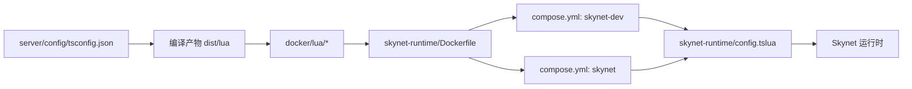

# 服务配置与部署

<cite>
**本文引用的文件**   
- [docker\skynet-runtime\Dockerfile](file://docker/skynet-runtime/Dockerfile)
- [docker\compose.yml](file://docker/compose.yml)
- [docker\skynet-runtime\config.tslua](file://docker/skynet-runtime/config.tslua)
- [server\config\tsconfig.json](file://server/config/tsconfig.json)
- [server\Dockerfile](file://server/Dockerfile)
- [tslua.config.yaml](file://tslua.config.yaml)
- [docker\scripts\deploy.ps1](file://docker/scripts/deploy.ps1)
- [docker\scripts\deploy.bat](file://docker/scripts/deploy.bat)
- [server\start.sh](file://server/start.sh)
- [start.sh](file://start.sh)
- [docs\架构设计文档.md](file://docs/架构设计文档.md)
- [server\package.json](file://server/package.json)
- [package.json](file://package.json)
</cite>

## 目录
1. [简介](#简介)
2. [项目结构](#项目结构)
3. [核心组件](#核心组件)
4. [架构总览](#架构总览)
5. [详细组件分析](#详细组件分析)
6. [依赖分析](#依赖分析)
7. [性能考虑](#性能考虑)
8. [故障排查指南](#故障排查指南)
9. [结论](#结论)
10. [附录](#附录)

## 简介
本指南面向服务配置与部署工程师，系统阐述基于 TS-Skynet 混合框架的服务配置管理、服务注册与启动流程、多环境部署策略、监控与日志配置，以及 Docker 容器化部署的完整步骤与最佳实践。内容涵盖环境变量、配置文件结构、运行时参数、服务地址分配、依赖关系与启动顺序、开发/测试/生产三类环境的差异化配置、容器镜像构建与编排、网络与存储管理、以及运维监控与故障排查。

## 项目结构
项目采用“根工程 + 子工作区”的组织方式，核心与运行时相关的关键目录如下：
- server：TypeScript 源码、编译配置与启动脚本
- docker：Docker 镜像构建、Compose 编排、脚本与默认配置
- protocols：协议定义与生成
- tables：配置表与生成
- docs：架构与使用文档

图表来源
- [docker\skynet-runtime\Dockerfile:1-91](file://docker/skynet-runtime/Dockerfile#L1-L91)
- [docker\skynet-runtime\config.tslua:1-35](file://docker/skynet-runtime/config.tslua#L1-L35)
- [docker\compose.yml:1-70](file://docker/compose.yml#L1-L70)
- [docker\scripts\deploy.ps1:1-430](file://docker/scripts/deploy.ps1#L1-L430)
- [docker\scripts\deploy.bat:1-58](file://docker/scripts/deploy.bat#L1-L58)
- [server\config\tsconfig.json:1-26](file://server/config/tsconfig.json#L1-L26)
- [server\package.json:1-51](file://server/package.json#L1-L51)
- [server\start.sh:1-66](file://server/start.sh#L1-L66)
- [start.sh:1-7](file://start.sh#L1-L7)

章节来源
- [server\config\tsconfig.json:1-26](file://server/config/tsconfig.json#L1-L26)
- [docker\skynet-runtime\config.tslua:1-35](file://docker/skynet-runtime/config.tslua#L1-L35)
- [docker\compose.yml:1-70](file://docker/compose.yml#L1-L70)
- [docker\skynet-runtime\Dockerfile:1-91](file://docker/skynet-runtime/Dockerfile#L1-L91)
- [docker\scripts\deploy.ps1:1-430](file://docker/scripts/deploy.ps1#L1-L430)
- [docker\scripts\deploy.bat:1-58](file://docker/scripts/deploy.bat#L1-L58)
- [server\start.sh:1-66](file://server/start.sh#L1-L66)
- [start.sh:1-7](file://start.sh#L1-L7)

## 核心组件
- 运行时镜像与默认配置
  - 运行时镜像通过分阶段构建，先在 builder 阶段编译 Skynet 与 lua-protobuf，再在运行时镜像中仅保留必要依赖与编译产物，最终以非 root 用户运行。
  - 默认配置文件位于镜像内，生产环境可通过挂载外部配置覆盖。
- Docker Compose 编排
  - 提供开发与生产两种模式：开发模式使用 volume 挂载代码与配置，便于热迭代；生产模式将 Lua 代码嵌入镜像，自包含部署。
- 部署脚本与跨平台入口
  - Windows 提供 PowerShell 部署脚本与批处理入口，统一命令语义；Linux/macOS 通过根目录脚本转发至 CLI。
- TypeScript 编译配置
  - server 层的 tsconfig 控制 Node.js 环境编译输出与路径别名，配合 TSTL 将 TS 编译为 Lua。
- 项目级配置
  - tslua.config.yaml 定义项目路径、构建目标、Docker Compose 文件与服务/容器命名等，便于 CLI 与脚本复用。

章节来源
- [docker\skynet-runtime\Dockerfile:1-91](file://docker/skynet-runtime/Dockerfile#L1-L91)
- [docker\skynet-runtime\config.tslua:1-35](file://docker/skynet-runtime/config.tslua#L1-L35)
- [docker\compose.yml:1-70](file://docker/compose.yml#L1-L70)
- [docker\scripts\deploy.ps1:1-430](file://docker/scripts/deploy.ps1#L1-L430)
- [docker\scripts\deploy.bat:1-58](file://docker/scripts/deploy.bat#L1-L58)
- [server\config\tsconfig.json:1-26](file://server/config/tsconfig.json#L1-L26)
- [tslua.config.yaml:1-52](file://tslua.config.yaml#L1-L52)

## 架构总览
下图展示服务启动与部署的整体流程：TypeScript 源码经 TSTL 编译为 Lua，打包进运行时镜像或通过 Compose 挂载到容器；Skynet 读取配置文件启动服务，容器暴露端口并通过网络互通。

图表来源
- [docker\skynet-runtime\config.tslua:1-35](file://docker/skynet-runtime/config.tslua#L1-L35)
- [docker\skynet-runtime\Dockerfile:1-91](file://docker/skynet-runtime/Dockerfile#L1-L91)
- [docker\compose.yml:1-70](file://docker/compose.yml#L1-L70)

## 详细组件分析

### 组件 A：运行时镜像与默认配置
- 分阶段构建
  - builder 阶段：安装编译依赖，拷贝 skynet 源码，执行 make linux 编译；随后克隆 lua-protobuf 并编译生成 pb.so，复制到 lualib 与 luaclib。
  - 运行时镜像：仅安装运行时证书依赖，创建非 root 用户，复制编译产物与默认配置，暴露端口，创建启动脚本。
- 默认配置
  - 线程数、启动模块、Lua 服务与模块路径、Harbor 单节点模式、日志输出到 stdout、守护进程关闭等。
- 启动脚本
  - 读取环境变量 SKYNET_CONFIG 指定配置文件路径，若不存在则报错退出；否则执行 ./skynet "$CONFIG_FILE"。

图表来源
- [docker\skynet-runtime\Dockerfile:1-91](file://docker/skynet-runtime/Dockerfile#L1-L91)
- [docker\skynet-runtime\config.tslua:1-35](file://docker/skynet-runtime/config.tslua#L1-L35)

章节来源
- [docker\skynet-runtime\Dockerfile:1-91](file://docker/skynet-runtime/Dockerfile#L1-L91)
- [docker\skynet-runtime\config.tslua:1-35](file://docker/skynet-runtime/config.tslua#L1-L35)

### 组件 B：Docker Compose 编排与多环境
- 开发模式（skynet-dev）
  - 使用 volume 挂载：/skynet-config（只读）、/skynet/native（只读）、/skynet/lua（只读）、/skynet/logs（命名卷）。
  - 环境变量：TZ、SKYNET_CONFIG 指向 /skynet-config/config.tslua。
  - 端口映射：8888、9999。
  - 适合热迭代与联调。
- 生产模式（skynet）
  - 代码嵌入镜像，通过挂载配置与日志卷实现配置与数据持久化。
  - 端口映射与网络同上。
- 网络与卷
  - 使用 bridge 网络；日志使用命名卷 skynet-logs，避免容器删除丢失日志。

图表来源
- [docker\compose.yml:1-70](file://docker/compose.yml#L1-L70)
- [docker\scripts\deploy.ps1:1-430](file://docker/scripts/deploy.ps1#L1-L430)

章节来源
- [docker\compose.yml:1-70](file://docker/compose.yml#L1-L70)
- [docker\scripts\deploy.ps1:1-430](file://docker/scripts/deploy.ps1#L1-L430)

### 组件 C：部署脚本与跨平台入口
- Windows
  - deploy.bat：作为入口，调用 PowerShell 脚本 deploy.ps1，支持 setup、build、dev、start、stop、restart、status、logs、deploy、shell、clean 等命令。
  - deploy.ps1：封装环境检查（Docker、Compose、WSL2）、镜像构建、容器启停、日志查看、代码部署、Shell 进入、清理等。
- Linux/macOS
  - start.sh：转发命令到根目录 CLI（npm run cli），实现与 Windows 一致的命令语义。

图表来源
- [docker\scripts\deploy.bat:1-58](file://docker/scripts/deploy.bat#L1-L58)
- [docker\scripts\deploy.ps1:1-430](file://docker/scripts/deploy.ps1#L1-L430)

章节来源
- [docker\scripts\deploy.bat:1-58](file://docker/scripts/deploy.bat#L1-L58)
- [docker\scripts\deploy.ps1:1-430](file://docker/scripts/deploy.ps1#L1-L430)
- [start.sh:1-7](file://start.sh#L1-L7)

### 组件 D：配置管理与运行时参数
- TypeScript 编译配置（server/config/tsconfig.json）
  - 目标 ES2020，模块化输出，严格类型检查，开启 sourceMap、declaration 等，路径别名 @/* 指向 src/*。
- 项目配置（tslua.config.yaml）
  - paths：server、docker、protocols、tables 目录相对路径。
  - build：sourceDir（编译输出 Lua 目录）、targetDir（Docker 部署复制目标）、可选 protoOutput 与 tableOutput。
  - docker：composeFile、serviceName、containerName，以及可选 composeOverride。
- 运行时配置（docker/skynet-runtime/config.tslua）
  - 线程数、bootstrap 与 start、Lua 服务与模块路径、Harbor 单节点、日志输出到 stdout、守护进程关闭。
- 环境变量
  - SKYNET_CONFIG：指定 Skynet 配置文件路径（默认 /skynet/config.tslua，可通过 volume 挂载覆盖）。
  - TZ：时区设置（Asia/Shanghai）。

章节来源
- [server\config\tsconfig.json:1-26](file://server/config/tsconfig.json#L1-L26)
- [tslua.config.yaml:1-52](file://tslua.config.yaml#L1-L52)
- [docker\skynet-runtime\config.tslua:1-35](file://docker/skynet-runtime/config.tslua#L1-L35)
- [docker\compose.yml:29-31](file://docker/compose.yml#L29-L31)

### 组件 E：服务注册与启动流程
- 启动顺序
  - 镜像构建 → Compose 编排 → 容器启动 → Skynet 读取配置 → 加载 bootstrap 与 start 指定入口 → 业务服务初始化。
- 服务地址分配
  - Skynet 通过服务名与地址管理，业务服务通过 runtime.service.newService 或服务注册接口对外暴露。
- 依赖关系
  - Lua 服务代码需随编译产物一并进入镜像或通过挂载提供；Skynet 依赖 lua_path、lua_cpath、cpath 等路径配置。
- 启动顺序控制
  - 通过配置文件的 start 与 bootstrap 字段控制入口模块；业务服务初始化在入口模块中进行。

图表来源
- [docker\skynet-runtime\config.tslua:10-16](file://docker/skynet-runtime/config.tslua#L10-L16)
- [docker\skynet-runtime\Dockerfile:77-86](file://docker/skynet-runtime/Dockerfile#L77-L86)

章节来源
- [docker\skynet-runtime\config.tslua:1-35](file://docker/skynet-runtime/config.tslua#L1-L35)
- [docs\架构设计文档.md:327-364](file://docs/架构设计文档.md#L327-L364)

### 组件 F：多环境配置与注意事项
- 开发环境
  - 使用 skynet-dev，volume 挂载代码与配置，便于热更新；日志卷持久化。
- 测试环境
  - 可沿用开发模式，但建议使用独立的配置文件与网络隔离，避免与生产冲突。
- 生产环境
  - 使用 skynet，代码嵌入镜像，减少运行时不确定性；通过挂载配置与日志卷实现配置与数据持久化；注意端口占用与权限。
- 环境变量与配置优先级
  - 容器环境变量 SKYNET_CONFIG 优先于镜像内默认配置；生产环境建议通过卷挂载覆盖。

章节来源
- [docker\compose.yml:11-62](file://docker/compose.yml#L11-L62)
- [docker\skynet-runtime\config.tslua:1-35](file://docker/skynet-runtime/config.tslua#L1-L35)

### 组件 G：监控与日志配置
- 日志输出
  - 默认配置将日志输出到 stdout，符合 Docker 日志收集最佳实践。
- 日志查看
  - 使用脚本 logs 命令或 docker compose logs -f 实时查看。
- 性能指标与错误追踪
  - 建议结合外部日志栈（如 ELK/Fluentd/Loki）与指标系统（Prometheus/Grafana）进行采集与可视化；错误追踪可结合容器日志与业务埋点。

章节来源
- [docker\skynet-runtime\config.tslua:31-35](file://docker/skynet-runtime/config.tslua#L31-L35)
- [docker\scripts\deploy.ps1:321-327](file://docker/scripts/deploy.ps1#L321-L327)

### 组件 H：Docker 容器化部署详解
- 镜像构建
  - 运行时镜像：分阶段构建，仅保留运行时所需文件与非 root 用户。
  - 服务器镜像：包含 Node/Python/SSH 等工具，适用于开发与调试。
- 容器编排
  - 开发容器：挂载配置、原生脚本与 Lua 服务代码，便于热更新。
  - 生产容器：代码嵌入镜像，仅挂载配置与日志卷。
- 网络与存储
  - 使用 bridge 网络；日志使用命名卷 skynet-logs。
- 启动与维护
  - 通过 PowerShell 脚本统一管理构建、启动、停止、重启、状态、日志、部署与清理。

章节来源
- [docker\skynet-runtime\Dockerfile:1-91](file://docker/skynet-runtime/Dockerfile#L1-L91)
- [server\Dockerfile:1-51](file://server/Dockerfile#L1-L51)
- [docker\compose.yml:1-70](file://docker/compose.yml#L1-L70)
- [docker\scripts\deploy.ps1:174-275](file://docker/scripts/deploy.ps1#L174-L275)

## 依赖分析
- 组件耦合
  - 运行时镜像与默认配置强耦合：镜像内默认配置决定容器启动行为。
  - Compose 与脚本耦合：脚本负责环境检查、镜像构建与容器启停，Compose 负责编排与卷挂载。
  - TypeScript 编译配置与 TSTL：server 层 tsconfig 影响编译产物与路径，进而影响 Lua 服务代码。
- 外部依赖
  - Docker 与 Docker Compose、Skynet 源码、lua-protobuf、Node.js/Python 环境等。

图表来源
- [server\config\tsconfig.json:1-26](file://server/config/tsconfig.json#L1-L26)
- [docker\skynet-runtime\Dockerfile:68-72](file://docker/skynet-runtime/Dockerfile#L68-L72)
- [docker\compose.yml:20-28](file://docker/compose.yml#L20-L28)
- [docker\skynet-runtime\config.tslua:1-35](file://docker/skynet-runtime/config.tslua#L1-L35)

章节来源
- [server\config\tsconfig.json:1-26](file://server/config/tsconfig.json#L1-L26)
- [docker\skynet-runtime\Dockerfile:1-91](file://docker/skynet-runtime/Dockerfile#L1-L91)
- [docker\compose.yml:1-70](file://docker/compose.yml#L1-L70)
- [docker\skynet-runtime\config.tslua:1-35](file://docker/skynet-runtime/config.tslua#L1-L35)

## 性能考虑
- 构建优化
  - 使用分阶段构建减少镜像体积；合理利用 Docker 缓存，避免不必要的重新编译。
- 运行时优化
  - 合理设置线程数与日志级别；单节点 Harbor 模式适合小型部署，分布式场景需调整。
- I/O 与网络
  - 使用命名卷持久化日志与配置；避免频繁写盘；端口映射与网络隔离降低冲突风险。

## 故障排查指南
- 常见问题
  - Docker 未启动：检查 Docker Desktop 与 WSL2 后端。
  - 端口被占用：修改 compose.yml 中的端口映射。
  - 配置文件缺失：确认 SKYNET_CONFIG 指向的配置文件存在或通过卷挂载覆盖。
  - 权限错误：以管理员身份运行 PowerShell 或检查非 root 用户权限。
- 排查步骤
  - 使用 status 查看容器状态与镜像信息。
  - 使用 logs 实时查看日志。
  - 使用 shell 进入容器检查文件与进程。
  - 使用 clean 清理后重试。

章节来源
- [docker\scripts\deploy.ps1:98-143](file://docker/scripts/deploy.ps1#L98-L143)
- [docker\scripts\deploy.ps1:298-327](file://docker/scripts/deploy.ps1#L298-L327)
- [docker\scripts\deploy.ps1:368-386](file://docker/scripts/deploy.ps1#L368-L386)
- [docker\scripts\deploy.ps1:388-402](file://docker/scripts/deploy.ps1#L388-L402)

## 结论
本指南提供了从配置管理、服务注册与启动、多环境部署到容器化与运维监控的完整实践路径。通过分阶段构建的运行时镜像、灵活的 Compose 编排、统一的部署脚本与清晰的配置结构，项目可在开发、测试与生产环境中稳定运行。建议在生产环境强化日志与指标体系，并结合外部可观测性平台实现全面监控与快速定位。

## 附录
- 快速命令参考
  - Windows：deploy.ps1 支持 setup、build、dev、start、stop、restart、status、logs、deploy、shell、clean。
  - Linux/macOS：start.sh 转发至 CLI，命令与 Windows 一致。
- 项目配置要点
  - 通过 tslua.config.yaml 统一管理路径与 Docker 参数，便于 CLI 与脚本复用。

章节来源
- [docker\scripts\deploy.ps1:46-84](file://docker/scripts/deploy.ps1#L46-L84)
- [start.sh:1-7](file://start.sh#L1-L7)
- [tslua.config.yaml:1-52](file://tslua.config.yaml#L1-L52)