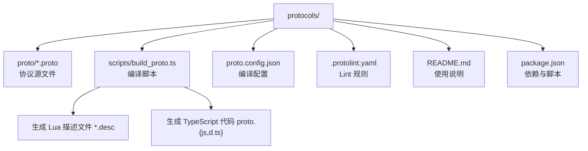
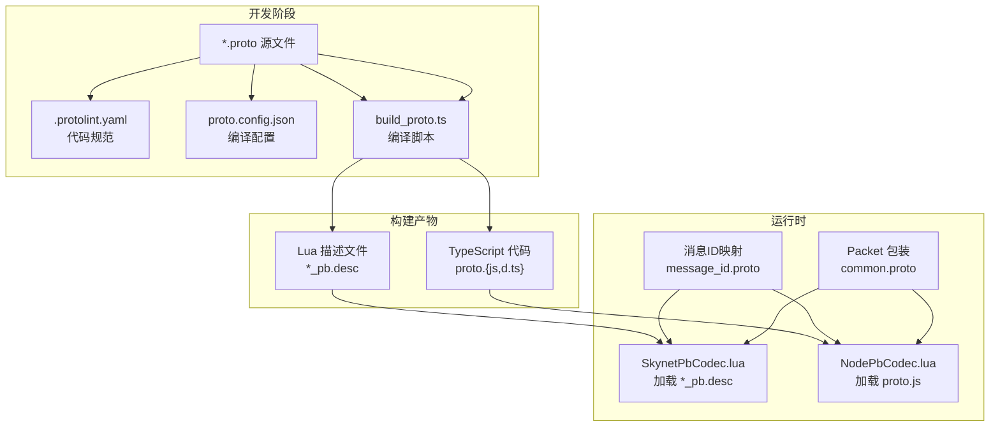
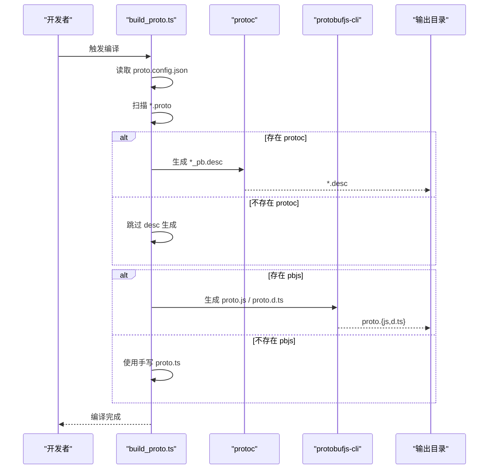
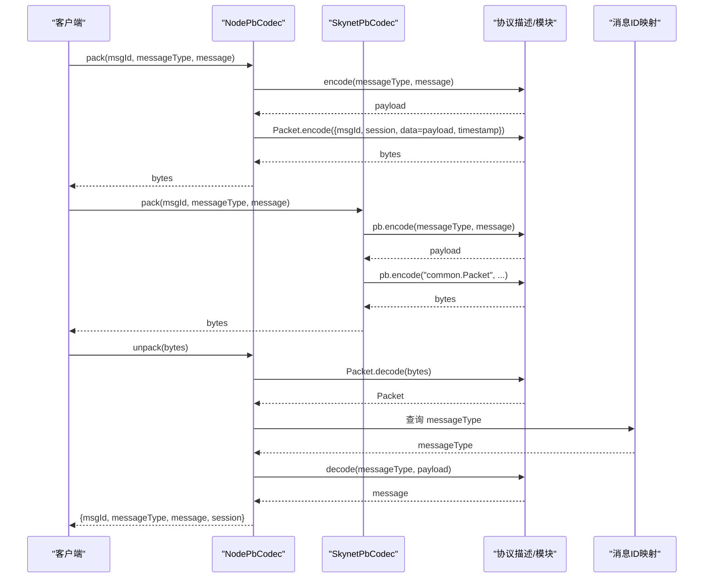
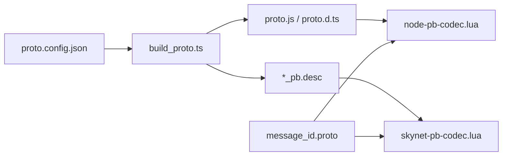

# 协议版本管理

<cite>
**本文引用的文件**
- [.protolint.yaml](file://protocols/.protolint.yaml)
- [README.md](file://protocols/README.md)
- [proto.config.json](file://protocols/proto.config.json)
- [build_proto.ts](file://protocols/scripts/build_proto.ts)
- [package.json](file://protocols/package.json)
- [common.proto](file://protocols/proto/common.proto)
- [gateway.proto](file://protocols/proto/gateway.proto)
- [login.proto](file://protocols/proto/login.proto)
- [game.proto](file://protocols/proto/game.proto)
- [message_id.proto](file://protocols/proto/message_id.proto)
- [skynet-pb-codec.lua](file://docker/lua/framework/runtime/skynet-pb-codec.lua)
- [node-pb-codec.lua](file://docker/lua/framework/runtime/node-pb-codec.lua)
- [proto.lua](file://docker/lua/protos/proto.lua)
</cite>

## 目录
1. [引言](#引言)
2. [项目结构](#项目结构)
3. [核心组件](#核心组件)
4. [架构总览](#架构总览)
5. [详细组件分析](#详细组件分析)
6. [依赖关系分析](#依赖关系分析)
7. [性能考量](#性能考量)
8. [故障排查指南](#故障排查指南)
9. [结论](#结论)
10. [附录](#附录)

## 引言
本指南围绕协议版本管理展开，结合仓库中的 Protocol Buffers 协议定义与编译工具链，系统阐述版本控制的重要性、版本号管理策略、兼容性设计原则、协议演进最佳实践以及版本管理工具与自动化流程。目标是帮助团队在多语言（TypeScript/Lua）环境下实现向后兼容、新旧版本共存与平滑升级。

## 项目结构
协议相关的核心位置位于 protocols 目录，包含：
- 协议源文件：proto/*.proto
- 编译配置：proto.config.json
- 编译脚本：scripts/build_proto.ts
- Lint 配置：.protolint.yaml
- 使用说明：README.md
- 包管理：package.json

下图展示协议子系统的文件组织与职责划分：

图表来源
- [build_proto.ts:1-245](file://protocols/scripts/build_proto.ts#L1-L245)
- [proto.config.json:1-15](file://protocols/proto.config.json#L1-L15)
- [.protolint.yaml:1-45](file://protocols/.protolint.yaml#L1-L45)
- [README.md:1-176](file://protocols/README.md#L1-L176)
- [package.json:1-28](file://protocols/package.json#L1-L28)

章节来源
- [README.md:1-176](file://protocols/README.md#L1-L176)
- [proto.config.json:1-15](file://protocols/proto.config.json#L1-L15)
- [build_proto.ts:1-245](file://protocols/scripts/build_proto.ts#L1-L245)
- [.protolint.yaml:1-45](file://protocols/.protolint.yaml#L1-L45)
- [package.json:1-28](file://protocols/package.json#L1-L28)

## 核心组件
- 协议源文件：定义消息结构、枚举与消息 ID 映射，确保跨语言一致性和向后兼容。
- 编译脚本：自动扫描 proto 目录、生成 Lua 描述文件与 TypeScript 代码，并进行跨平台适配。
- Lint 配置：统一命名规范、注释要求与字段编号唯一性，保障代码质量与一致性。
- 编解码器：Skynet 与 Node 环境下的协议编解码实现，负责消息打包、解包与类型解析。
- 消息 ID 映射：集中管理消息 ID，支撑消息路由与版本演进。

章节来源
- [common.proto:1-39](file://protocols/proto/common.proto#L1-L39)
- [gateway.proto:1-70](file://protocols/proto/gateway.proto#L1-L70)
- [login.proto:1-83](file://protocols/proto/login.proto#L1-L83)
- [game.proto:1-141](file://protocols/proto/game.proto#L1-L141)
- [message_id.proto:1-48](file://protocols/proto/message_id.proto#L1-L48)
- [build_proto.ts:1-245](file://protocols/scripts/build_proto.ts#L1-L245)
- [.protolint.yaml:1-45](file://protocols/.protolint.yaml#L1-L45)
- [skynet-pb-codec.lua:1-164](file://docker/lua/framework/runtime/skynet-pb-codec.lua#L1-L164)
- [node-pb-codec.lua:1-185](file://docker/lua/framework/runtime/node-pb-codec.lua#L1-L185)
- [proto.lua:1-199](file://docker/lua/protos/proto.lua#L1-L199)

## 架构总览
下图展示协议版本管理在系统中的角色与交互路径：开发者通过 .proto 定义协议；编译脚本生成跨语言产物；运行时根据消息 ID 将字节流解包为具体消息类型并进行处理。

图表来源
- [build_proto.ts:1-245](file://protocols/scripts/build_proto.ts#L1-L245)
- [proto.config.json:1-15](file://protocols/proto.config.json#L1-L15)
- [.protolint.yaml:1-45](file://protocols/.protolint.yaml#L1-L45)
- [message_id.proto:1-48](file://protocols/proto/message_id.proto#L1-L48)
- [common.proto:1-39](file://protocols/proto/common.proto#L1-L39)
- [skynet-pb-codec.lua:1-164](file://docker/lua/framework/runtime/skynet-pb-codec.lua#L1-L164)
- [node-pb-codec.lua:1-185](file://docker/lua/framework/runtime/node-pb-codec.lua#L1-L185)

## 详细组件分析

### 组件一：协议版本控制与向后兼容
- 向后兼容原则
  - 不删除既有字段，不修改字段编号，新增字段使用新编号，使用 optional/repeated 以保证兼容。
  - 通用包装 Packet 与 Response 结构保持稳定，便于跨版本传输与解析。
- 字段变更策略
  - 新增：保留旧字段，新增字段使用新编号，旧客户端可忽略新字段。
  - 删除：避免直接删除；可通过标记废弃并在未来版本移除。
  - 修改：避免修改字段编号；如需变更类型，采用兼容类型或引入新字段。
- 消息 ID 分配
  - 按服务预留连续区间，请求偶数、响应奇数，便于路由与调试。
  - 集中式枚举管理，避免冲突并支持热更新。

章节来源
- [README.md:152-156](file://protocols/README.md#L152-L156)
- [common.proto:1-39](file://protocols/proto/common.proto#L1-L39)
- [message_id.proto:1-48](file://protocols/proto/message_id.proto#L1-L48)

### 组件二：版本号管理策略
- 语义化版本控制
  - 主版本号：破坏性变更（如删除字段、修改编号）。
  - 次版本号：新增功能且向后兼容（新增字段）。
  - 修订号：修复与向后兼容的小改动。
- 版本号分配规则
  - 协议版本与服务版本解耦：协议版本仅反映消息结构变化。
  - 发布前冻结字段编号，新增字段必须分配新编号。
- 版本发布流程
  - 提交 PR 包含协议变更与 lint 通过记录。
  - 自动化编译生成跨语言产物并校验。
  - 服务端先加载新协议描述文件，客户端在后续版本更新。

章节来源
- [README.md:147-151](file://protocols/README.md#L147-L151)
- [proto.config.json:1-15](file://protocols/proto.config.json#L1-L15)
- [build_proto.ts:1-245](file://protocols/scripts/build_proto.ts#L1-L245)

### 组件三：版本兼容性设计原则
- 字段新增
  - 使用 optional/repeated，旧客户端可安全忽略新字段。
- 字段删除
  - 不直接删除；标记废弃并在未来版本清理。
- 字段修改
  - 避免修改编号；如需变更类型，采用兼容类型或引入新字段。
- 枚举扩展
  - 新增枚举值不影响旧客户端解析（默认值处理）。
- 默认值与可选字段
  - 利用 proto3 的默认行为，确保旧客户端能正确处理缺失字段。

章节来源
- [README.md:152-156](file://protocols/README.md#L152-L156)
- [common.proto:1-39](file://protocols/proto/common.proto#L1-L39)
- [login.proto:1-83](file://protocols/proto/login.proto#L1-L83)
- [game.proto:1-141](file://protocols/proto/game.proto#L1-L141)

### 组件四：协议演进最佳实践
- 渐进式升级
  - 先在服务端加载新协议描述文件，再逐步推送客户端新版本。
  - 对于复杂变更，分阶段发布，每阶段只引入最小必要改动。
- A/B 测试
  - 通过消息 ID 与版本号分流，对部分用户流量进行灰度验证。
- 回滚机制
  - 保留旧协议描述文件与客户端版本，快速回退到上一个稳定版本。
- 热更新支持
  - 协议文件可热更新；服务端通过重新加载描述文件实现；客户端需重新下载并加载。

章节来源
- [README.md:158-163](file://protocols/README.md#L158-L163)
- [skynet-pb-codec.lua:59-89](file://docker/lua/framework/runtime/skynet-pb-codec.lua#L59-L89)

### 组件五：版本管理工具与使用
- protolint 配置
  - 统一命名规范（消息、字段、枚举、服务）、注释要求与字段编号唯一性。
  - 允许特定包名格式，排除已生成的 pb.* 文件。
- 版本检查
  - 通过 Lint 规则在提交前发现潜在问题，减少运行时风险。
- 冲突解决
  - 字段编号冲突：优先使用现有编号，新增字段分配新编号。
  - 命名冲突：遵循 Lint 规范重命名，保持一致性。

章节来源
- [.protolint.yaml:1-45](file://protocols/.protolint.yaml#L1-L45)
- [README.md:140-146](file://protocols/README.md#L140-L146)

### 组件六：编译与自动化流程
- 编译脚本能力
  - 自动扫描 proto 目录，生成 Lua 描述文件与 TypeScript 代码。
  - 跨平台支持：优先系统 protoc，其次本地 bin，最后 node_modules。
  - 失败降级：若缺少工具，使用手写 proto.ts 作为后备。
- CI/CD 集成建议
  - 在流水线中执行 Lint 与编译步骤，失败即阻断。
  - 产物归档：保存生成的 proto.{js,d.ts} 与 *_pb.desc。
  - 灰度发布：按版本号与消息 ID 进行流量控制。

图表来源
- [build_proto.ts:57-241](file://protocols/scripts/build_proto.ts#L57-L241)
- [proto.config.json:1-15](file://protocols/proto.config.json#L1-L15)
- [package.json:6-8](file://protocols/package.json#L6-L8)

章节来源
- [build_proto.ts:1-245](file://protocols/scripts/build_proto.ts#L1-L245)
- [proto.config.json:1-15](file://protocols/proto.config.json#L1-L15)
- [package.json:1-28](file://protocols/package.json#L1-L28)

### 组件七：运行时编解码与版本协同
- Skynet 环境
  - 通过加载 *_pb.desc 实现协议解析；消息 ID 与类型映射由 message_id.proto 提供。
  - pack/unpack 流程：先将具体消息编码为 payload，再封装为 Packet。
- Node 环境
  - 直接加载编译生成的 proto.js，按命名空间与类型名进行 encode/decode。
  - 通过消息 ID 映射定位具体消息类型，再进行解包。

图表来源
- [node-pb-codec.lua:160-183](file://docker/lua/framework/runtime/node-pb-codec.lua#L160-L183)
- [skynet-pb-codec.lua:127-162](file://docker/lua/framework/runtime/skynet-pb-codec.lua#L127-L162)
- [message_id.proto:1-48](file://protocols/proto/message_id.proto#L1-L48)
- [common.proto:1-39](file://protocols/proto/common.proto#L1-L39)

章节来源
- [node-pb-codec.lua:1-185](file://docker/lua/framework/runtime/node-pb-codec.lua#L1-L185)
- [skynet-pb-codec.lua:1-164](file://docker/lua/framework/runtime/skynet-pb-codec.lua#L1-L164)
- [message_id.proto:1-48](file://protocols/proto/message_id.proto#L1-L48)
- [common.proto:1-39](file://protocols/proto/common.proto#L1-L39)

## 依赖关系分析
- 构建期依赖
  - build_proto.ts 依赖 proto.config.json 指定的输入输出目录。
  - 依赖 protobufjs-cli 生成 TypeScript 代码；依赖 protoc 生成 Lua 描述文件。
- 运行时依赖
  - Skynet 环境依赖 *_pb.desc 文件；Node 环境依赖 proto.js。
  - 消息 ID 映射集中于 message_id.proto，被编解码器广泛使用。

图表来源
- [proto.config.json:1-15](file://protocols/proto.config.json#L1-L15)
- [build_proto.ts:1-245](file://protocols/scripts/build_proto.ts#L1-L245)
- [skynet-pb-codec.lua:1-164](file://docker/lua/framework/runtime/skynet-pb-codec.lua#L1-L164)
- [node-pb-codec.lua:1-185](file://docker/lua/framework/runtime/node-pb-codec.lua#L1-L185)
- [message_id.proto:1-48](file://protocols/proto/message_id.proto#L1-L48)

章节来源
- [proto.config.json:1-15](file://protocols/proto.config.json#L1-L15)
- [build_proto.ts:1-245](file://protocols/scripts/build_proto.ts#L1-L245)
- [skynet-pb-codec.lua:1-164](file://docker/lua/framework/runtime/skynet-pb-codec.lua#L1-L164)
- [node-pb-codec.lua:1-185](file://docker/lua/framework/runtime/node-pb-codec.lua#L1-L185)
- [message_id.proto:1-48](file://protocols/proto/message_id.proto#L1-L48)

## 性能考量
- 编译性能
  - 仅在 proto 目录变化时触发编译，避免重复生成。
  - 优先使用系统 protoc 与 pbjs，减少冷启动开销。
- 运行时性能
  - Skynet 环境使用二进制协议描述文件，解析效率高。
  - Node 环境直接使用编译后的 proto.js，避免运行时解析成本。
- 兼容性与性能平衡
  - 通过 optional/repeated 降低解析分支，提升兼容性与性能稳定性。

## 故障排查指南
- 编译失败
  - 检查 protoc 与 protobufjs-cli 是否可用；若缺失，使用手写 proto.ts 作为临时方案。
  - 确认 proto.config.json 中的输出路径存在且可写。
- 运行时错误
  - Skynet 环境：确认 *_pb.desc 文件存在且可加载；检查消息 ID 映射是否正确。
  - Node 环境：确认 proto.js 已生成并可被 require；检查消息类型命名空间与名称。
- Lint 报错
  - 按 .protolint.yaml 规则修正命名、注释与字段编号；确保唯一性。

章节来源
- [build_proto.ts:107-160](file://protocols/scripts/build_proto.ts#L107-L160)
- [skynet-pb-codec.lua:72-89](file://docker/lua/framework/runtime/skynet-pb-codec.lua#L72-L89)
- [node-pb-codec.lua:61-75](file://docker/lua/framework/runtime/node-pb-codec.lua#L61-L75)
- [.protolint.yaml:1-45](file://protocols/.protolint.yaml#L1-L45)

## 结论
通过规范的协议版本管理策略、严格的 Lint 规则、可靠的编译与运行时编解码实现，本项目实现了跨语言环境下的向后兼容与平滑升级。建议在后续演进中持续完善 CI/CD 流水线、A/B 测试与回滚预案，确保协议演进的安全与可控。

## 附录
- 协议规范要点
  - 命名规范：消息 PascalCase、字段 snake_case、枚举 UPPER_SNAKE_CASE。
  - 消息 ID：按服务预留区间，请求偶数、响应奇数。
  - 兼容性：不删除字段、不修改编号、新增字段使用新编号。
- 推荐工作流
  - 变更前：冻结字段编号，设计兼容性方案。
  - 变更中：先服务端加载新协议，再推送客户端。
  - 变更后：监控日志与指标，准备回滚预案。