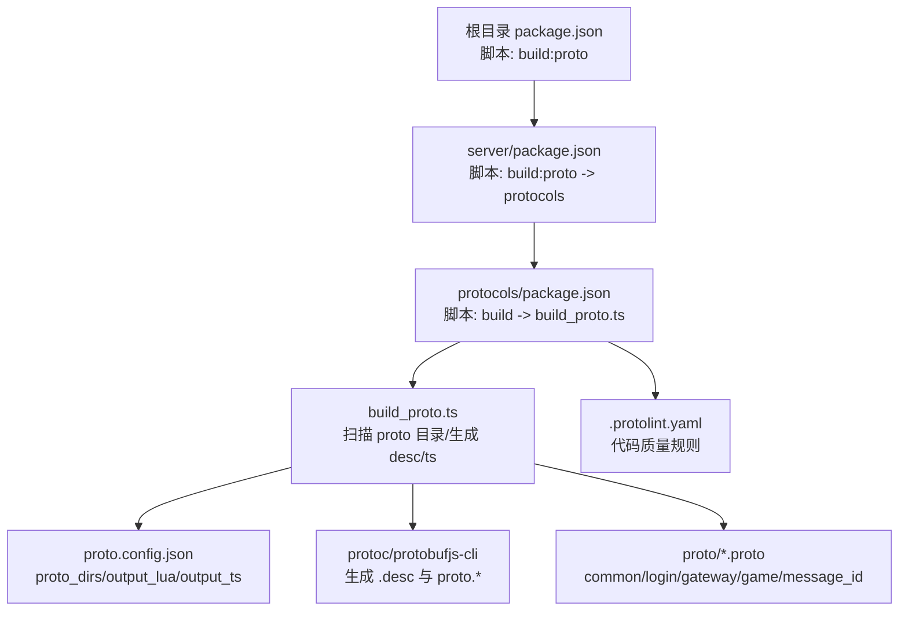
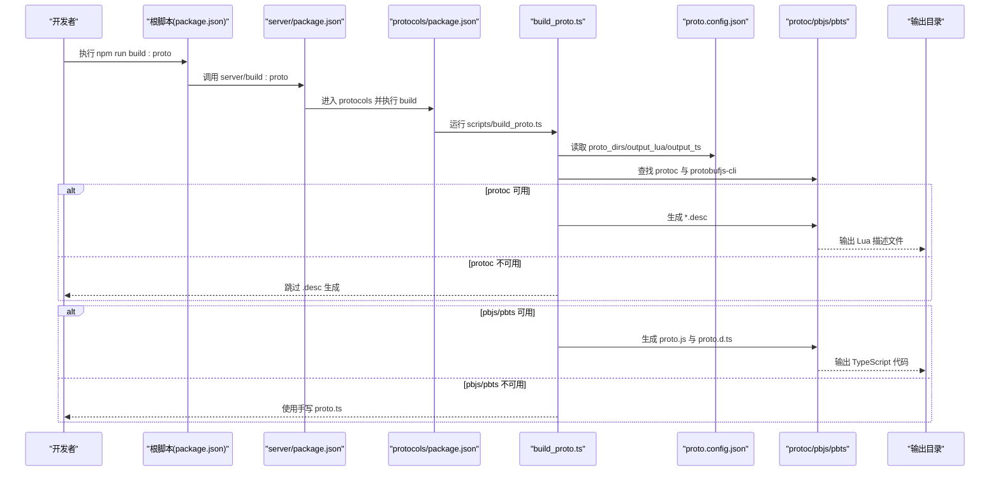
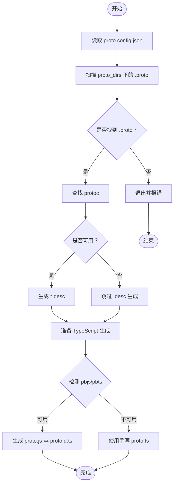
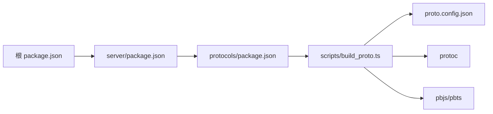

# 协议编译配置

<cite>
**本文引用的文件**
- [proto.config.json](file://protocols/proto.config.json)
- [build_proto.ts](file://protocols/scripts/build_proto.ts)
- [.protolint.yaml](file://protocols/.protolint.yaml)
- [README.md](file://protocols/README.md)
- [common.proto](file://protocols/proto/common.proto)
- [login.proto](file://protocols/proto/login.proto)
- [gateway.proto](file://protocols/proto/gateway.proto)
- [game.proto](file://protocols/proto/game.proto)
- [message_id.proto](file://protocols/proto/message_id.proto)
- [package.json](file://package.json)
- [server/package.json](file://server/package.json)
- [protocols/package.json](file://protocols/package.json)
- [tsconfig.json](file://server/config/tsconfig.json)
- [config.tslua（Docker）](file://docker/config/skynet/config.tslua)
- [config.tslua（运行时）](file://docker/skynet-runtime/config.tslua)
</cite>

## 目录
1. [简介](#简介)
2. [项目结构](#项目结构)
3. [核心组件](#核心组件)
4. [架构总览](#架构总览)
5. [详细组件分析](#详细组件分析)
6. [依赖关系分析](#依赖关系分析)
7. [性能考虑](#性能考虑)
8. [故障排查指南](#故障排查指南)
9. [结论](#结论)
10. [附录](#附录)

## 简介
本指南围绕项目中的 Protocol Buffers 协议编译配置进行系统性说明，涵盖 proto 文件编写规范、编译配置参数、生成代码处理流程、常见问题与解决方案以及最佳实践与性能优化建议。目标是帮助开发者高效、稳定地完成协议编译与集成，确保 TypeScript 与 Lua 双端一致使用。

## 项目结构
协议编译相关的核心位于 protocols 目录，包含：
- proto 源文件：按功能分层组织（通用层、服务层、消息ID）
- 编译脚本：基于 TypeScript 的跨平台编译器
- 配置文件：JSON 配置与 Linter 规则
- 构建入口：通过工作区脚本统一触发

图表来源
- [package.json:11-18](file://package.json#L11-L18)
- [server/package.json:13](file://server/package.json#L13)
- [protocols/package.json:7](file://protocols/package.json#L7)
- [build_proto.ts:57-241](file://protocols/scripts/build_proto.ts#L57-L241)
- [proto.config.json:1-15](file://protocols/proto.config.json#L1-L15)
- [.protolint.yaml:1-45](file://protocols/.protolint.yaml#L1-L45)
- [common.proto:1-39](file://protocols/proto/common.proto#L1-L39)
- [login.proto:1-83](file://protocols/proto/login.proto#L1-L83)
- [gateway.proto:1-70](file://protocols/proto/gateway.proto#L1-L70)
- [game.proto:1-141](file://protocols/proto/game.proto#L1-L141)
- [message_id.proto:1-48](file://protocols/proto/message_id.proto#L1-L48)

章节来源
- [README.md:1-176](file://protocols/README.md#L1-L176)
- [package.json:1-52](file://package.json#L1-L52)
- [server/package.json:1-51](file://server/package.json#L1-L51)
- [protocols/package.json:1-28](file://protocols/package.json#L1-L28)

## 核心组件
- 编译配置文件：定义 proto 源目录与输出目录，控制生成范围与位置
- 编译脚本：负责扫描 proto、查找工具链、生成 Lua 描述文件与 TypeScript 代码
- Linter 配置：统一命名与注释规范，提升协议质量
- proto 源文件：按分层组织，确保跨语言一致性与可维护性

章节来源
- [proto.config.json:1-15](file://protocols/proto.config.json#L1-L15)
- [build_proto.ts:57-241](file://protocols/scripts/build_proto.ts#L57-L241)
- [.protolint.yaml:1-45](file://protocols/.protolint.yaml#L1-L45)
- [common.proto:1-39](file://protocols/proto/common.proto#L1-L39)
- [login.proto:1-83](file://protocols/proto/login.proto#L1-L83)
- [gateway.proto:1-70](file://protocols/proto/gateway.proto#L1-L70)
- [game.proto:1-141](file://protocols/proto/game.proto#L1-L141)
- [message_id.proto:1-48](file://protocols/proto/message_id.proto#L1-L48)

## 架构总览
协议编译的端到端流程如下：

图表来源
- [package.json:18](file://package.json#L18)
- [server/package.json:13](file://server/package.json#L13)
- [protocols/package.json:7](file://protocols/package.json#L7)
- [build_proto.ts:62-226](file://protocols/scripts/build_proto.ts#L62-L226)
- [proto.config.json:5-13](file://protocols/proto.config.json#L5-L13)

## 详细组件分析

### 编译配置文件（proto.config.json）
- 作用：声明 proto 源目录与输出目录，控制编译范围与产物位置
- 关键字段
  - proto_dirs：数组，指定扫描 .proto 的相对路径集合
  - output_lua：数组，Lua 描述文件输出目录（支持多目录）
  - output_ts：数组，TypeScript 代码输出目录（支持多目录）
- 结构约束：通过 JSON Schema 提供基础校验
- 使用建议：保持输出目录与项目实际导入路径一致，避免路径漂移

章节来源
- [proto.config.json:1-15](file://protocols/proto.config.json#L1-L15)

### 编译脚本（build_proto.ts）
- 功能概览
  - 加载配置、扫描 proto 文件、收集全量 .proto 列表
  - 自动发现 protoc：系统 PATH > 本地 bin > node_modules/.bin
  - 生成 Lua 描述文件（*.desc），便于 Lua 端加载
  - 生成 TypeScript 代码：先生成静态模块，再生成类型定义
  - 备选方案：若工具缺失，回退到手写 proto.ts
- 关键流程
  - 命令行工具检测与容错
  - 输出目录创建与权限
  - pbjs/pbts 调用与结果判定
- 跨平台支持：通过 Node.js 与子进程调用，适配 Windows/Linux/macOS

图表来源
- [build_proto.ts:57-241](file://protocols/scripts/build_proto.ts#L57-L241)

章节来源
- [build_proto.ts:57-241](file://protocols/scripts/build_proto.ts#L57-L241)

### Linter 配置（.protolint.yaml）
- 规则类别
  - 命名规范：消息、字段、枚举、服务采用不同大小写风格
  - 注释规范：要求枚举字段、消息、枚举具备注释
  - 唯一性：字段编号唯一
  - 包名策略：允许特定包名使用驼峰
- 排除规则：可按需启用/禁用
- 文件排除：自动忽略已生成的 pb.* 文件

章节来源
- [.protolint.yaml:1-45](file://protocols/.protolint.yaml#L1-L45)

### proto 源文件（分层组织）
- 通用层（common.proto）
  - Packet：统一消息包装，包含 msg_id、session、data、timestamp
  - ErrorCode：统一错误码
  - Response：通用响应结构
- 服务层
  - login.proto：登录、登出、Token 验证、在线统计
  - gateway.proto：心跳、连接、断开、消息类型枚举
  - game.proto：玩家信息、进入/离开、属性更新、在线统计、经验/金币操作
- 消息ID（message_id.proto）
  - 统一分配区间：系统（1-99）、Gateway（100-199）、Login（200-299）、Game（300-399）
  - 建议：请求偶数、响应奇数，便于路由与调试

章节来源
- [common.proto:1-39](file://protocols/proto/common.proto#L1-L39)
- [login.proto:1-83](file://protocols/proto/login.proto#L1-L83)
- [gateway.proto:1-70](file://protocols/proto/gateway.proto#L1-L70)
- [game.proto:1-141](file://protocols/proto/game.proto#L1-L141)
- [message_id.proto:1-48](file://protocols/proto/message_id.proto#L1-L48)

### 生成代码处理流程（TypeScript）
- 静态模块生成：pbjs 将多个 .proto 合并为单个静态模块文件
- 类型定义生成：pbts 基于静态模块生成 .d.ts
- 回退机制：若工具不可用，使用手写 proto.ts 以保证开发可用性
- 使用方式：在 TypeScript 代码中导入 proto、MessageId、MessageTypes，并通过 create/encode/decode 进行序列化与反序列化

章节来源
- [build_proto.ts:190-226](file://protocols/scripts/build_proto.ts#L190-L226)
- [README.md:89-110](file://protocols/README.md#L89-L110)

### 生成代码处理流程（Lua）
- 描述文件加载：通过 protoc 加载 *.desc，注册消息类型
- 编解码：使用 pb.encode / pb.decode 对消息进行序列化与反序列化
- 输出目录：与 TypeScript 配置保持一致，便于跨语言共享

章节来源
- [build_proto.ts:129-160](file://protocols/scripts/build_proto.ts#L129-L160)
- [README.md:112-138](file://protocols/README.md#L112-L138)

## 依赖关系分析
- 工作区脚本
  - 根 package.json 提供统一入口：npm run build:proto
  - server/package.json 将构建指向 protocols 子工程
  - protocols/package.json 执行 TypeScript 编译脚本
- 工具链
  - protoc：用于生成 Lua 描述文件
  - protobufjs-cli：用于生成 TypeScript 静态模块与类型定义
- 配置耦合
  - build_proto.ts 读取 proto.config.json 的输出目录
  - 生成产物路径与项目导入路径需保持一致

图表来源
- [package.json:18](file://package.json#L18)
- [server/package.json:13](file://server/package.json#L13)
- [protocols/package.json:7](file://protocols/package.json#L7)
- [build_proto.ts:62-226](file://protocols/scripts/build_proto.ts#L62-L226)
- [proto.config.json:5-13](file://protocols/proto.config.json#L5-L13)

章节来源
- [package.json:1-52](file://package.json#L1-L52)
- [server/package.json:1-51](file://server/package.json#L1-L51)
- [protocols/package.json:1-28](file://protocols/package.json#L1-L28)

## 性能考虑
- 减少不必要的扫描：仅在必要时变更 proto_dirs，避免全仓库扫描
- 并行生成：当前脚本串行执行，可在工具链层面评估并行能力（注意 .desc 与 pbjs/pbts 的资源竞争）
- 输出目录复用：统一输出到 server/src/protos 与 server/dist/lua/protos，减少路径解析成本
- 工具链缓存：确保 protoc 与 protobufjs-cli 版本稳定，避免重复下载与重建
- Linter 预检：在 CI 中启用 .protolint.yaml，提前发现命名与注释问题，降低后续返工

## 故障排查指南
- 未找到 protoc
  - 现象：跳过 .desc 生成，仅生成 TypeScript
  - 处理：安装 protoc 并加入 PATH，或在 protocols/bin 中放置可执行文件
  - 参考：脚本对 PATH、本地 bin、node_modules/.bin 的查找顺序
- 未安装 protobufjs-cli
  - 现象：跳过 TypeScript 自动生成，使用手写 proto.ts
  - 处理：安装 protobufjs 与 protobufjs-cli，或在 CI 中预装
- 无 .proto 文件
  - 现象：扫描失败并退出
  - 处理：确认 proto.config.json 的 proto_dirs 指向正确目录
- 路径配置不一致
  - 现象：TypeScript/Lua 无法找到生成文件
  - 处理：核对 proto.config.json 的 output_lua/output_ts 与项目导入路径一致
- 版本兼容问题
  - 现象：生成失败或运行时报错
  - 处理：锁定 protoc 与 protobufjs-cli 版本；遵循 proto3 语法与字段编号规则

章节来源
- [build_proto.ts:107-127](file://protocols/scripts/build_proto.ts#L107-L127)
- [build_proto.ts:176-188](file://protocols/scripts/build_proto.ts#L176-L188)
- [build_proto.ts:96-99](file://protocols/scripts/build_proto.ts#L96-L99)
- [README.md:152-156](file://protocols/README.md#L152-L156)

## 结论
通过标准化的编译配置与脚本，项目实现了跨平台、可复用的协议编译流程。配合 Linter 与分层 proto 设计，能够显著提升协议质量与团队协作效率。建议在团队内固化配置与流程，结合 CI 预检，确保每次变更的稳定性与一致性。

## 附录

### 编译脚本使用方法
- 从根目录运行：npm run build:proto
- 从 server 目录运行：cd server && npm run build:proto
- 从 protocols 目录运行：cd protocols && npm run build

章节来源
- [README.md:38-63](file://protocols/README.md#L38-L63)
- [package.json:18](file://package.json#L18)
- [server/package.json:13](file://server/package.json#L13)

### 自定义配置选项
- 修改 proto_dirs：新增或调整扫描目录
- 调整 output_lua/output_ts：变更输出路径以适配项目结构
- 扩展 Linter 规则：根据团队规范调整 .protolint.yaml

章节来源
- [proto.config.json:5-13](file://protocols/proto.config.json#L5-L13)
- [.protolint.yaml:1-45](file://protocols/.protolint.yaml#L1-L45)

### proto 文件编写规范
- 命名规范：消息 PascalCase、字段 snake_case、枚举 UPPER_SNAKE_CASE
- 版本兼容：不删除字段、不修改编号、使用 optional/repeated
- 注释规范：字段、消息、枚举均需注释说明
- 分层组织：common、service、message_id 明确职责边界

章节来源
- [README.md:140-156](file://protocols/README.md#L140-L156)
- [common.proto:1-39](file://protocols/proto/common.proto#L1-L39)
- [login.proto:1-83](file://protocols/proto/login.proto#L1-L83)
- [gateway.proto:1-70](file://protocols/proto/gateway.proto#L1-L70)
- [game.proto:1-141](file://protocols/proto/game.proto#L1-L141)
- [message_id.proto:1-48](file://protocols/proto/message_id.proto#L1-L48)

### 生成代码使用示例（TypeScript）
- 导入 proto、MessageId、MessageTypes
- 使用 create/encode/decode 进行序列化与反序列化
- 使用消息 ID 进行路由与调试

章节来源
- [README.md:89-110](file://protocols/README.md#L89-L110)

### 生成代码使用示例（Lua）
- 加载 *.desc 并注册消息类型
- 使用 pb.encode / pb.decode 进行编解码

章节来源
- [README.md:112-138](file://protocols/README.md#L112-L138)

### 最佳实践
- 固定工具链版本：在 CI 中锁定 protoc 与 protobufjs-cli
- 统一输出目录：与项目导入路径保持一致
- 分层与命名：严格遵守命名与分层规范
- Linter 预检：在提交前执行 .protolint.yaml
- 变更治理：新增消息时同步更新 message_id.proto

章节来源
- [README.md:152-156](file://protocols/README.md#L152-L156)
- [.protolint.yaml:1-45](file://protocols/.protolint.yaml#L1-L45)
- [message_id.proto:1-48](file://protocols/proto/message_id.proto#L1-L48)