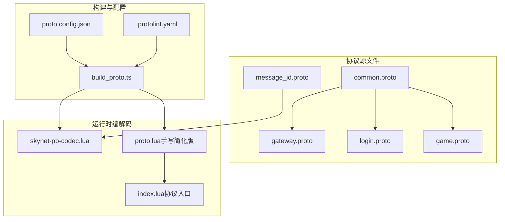
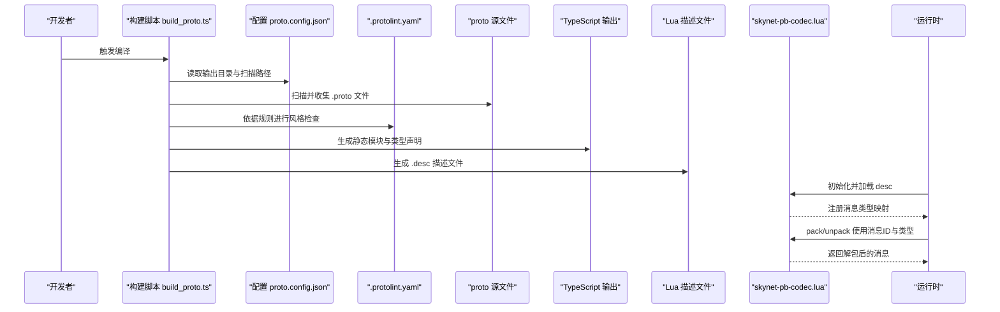
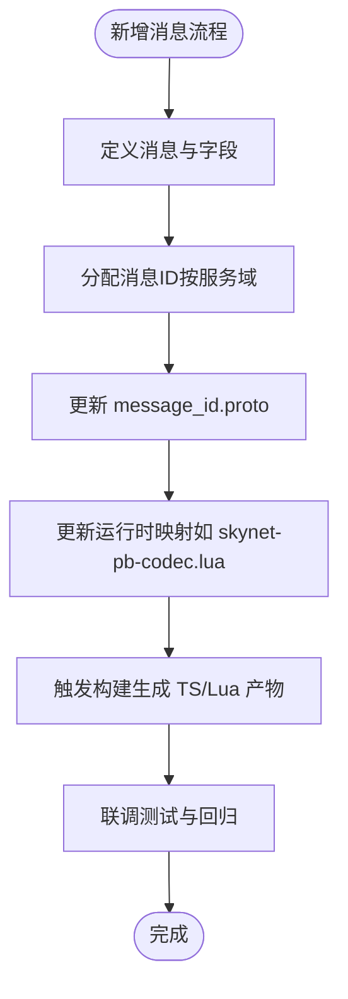
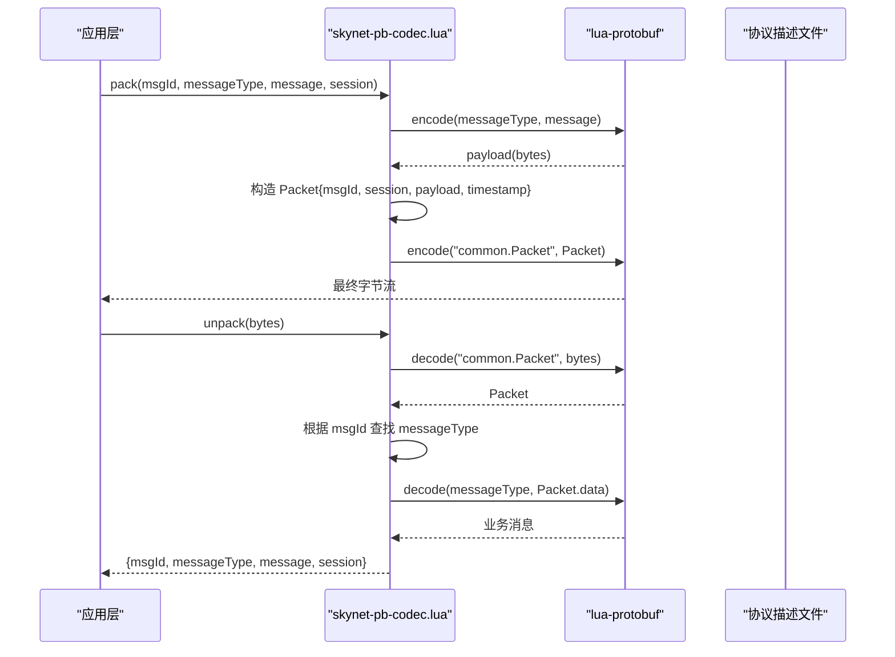
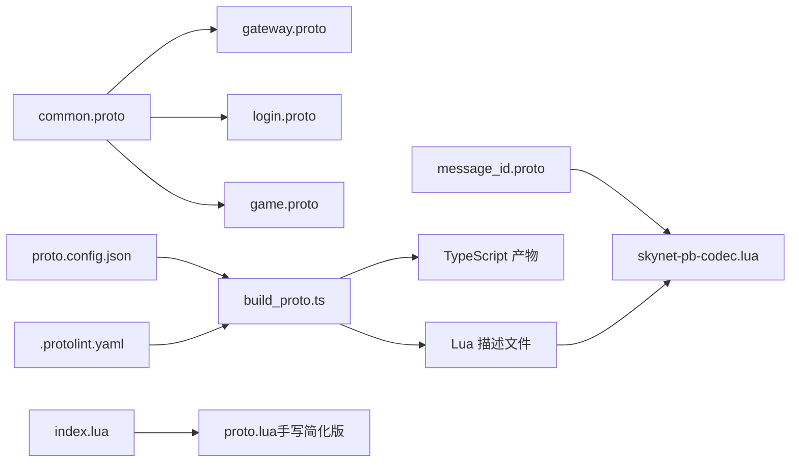

# 协议设计规范

<cite>
**本文引用的文件**
- [message_id.proto](file://protocols/proto/message_id.proto)
- [common.proto](file://protocols/proto/common.proto)
- [gateway.proto](file://protocols/proto/gateway.proto)
- [login.proto](file://protocols/proto/login.proto)
- [game.proto](file://protocols/proto/game.proto)
- [协议 README](file://protocols/README.md)
- [.protolint.yaml](file://protocols/.protolint.yaml)
- [proto.config.json](file://protocols/proto.config.json)
- [build_proto.ts](file://protocols/scripts/build_proto.ts)
- [skynet-pb-codec.lua](file://docker/lua/framework/runtime/skynet-pb-codec.lua)
- [proto.lua（手写简化版）](file://docker/lua/protos/proto.lua)
- [index.lua（协议入口）](file://docker/lua/protos/index.lua)
</cite>

## 目录
1. [引言](#引言)
2. [项目结构](#项目结构)
3. [核心组件](#核心组件)
4. [架构总览](#架构总览)
5. [详细组件分析](#详细组件分析)
6. [依赖关系分析](#依赖关系分析)
7. [性能考量](#性能考量)
8. [故障排查指南](#故障排查指南)
9. [结论](#结论)
10. [附录](#附录)

## 引言
本规范面向 Protobuf 协议在本项目的整体设计与落地，覆盖消息结构设计、字段命名规范、枚举值定义、消息 ID 分配策略、版本兼容性管理、标准设计流程、字段类型选择与重复字段处理、嵌套消息设计、安全性与性能优化等主题。目标是为开发团队提供一套可执行、可演进、可维护的协议设计与实施指南。

## 项目结构
协议相关源文件集中在 protocols 目录，采用按服务拆分的模块化组织方式，并通过统一的构建脚本生成 TypeScript 与 Lua 的协议代码与描述文件，配合运行时编解码器完成消息打包与解包。

图示来源
- [common.proto:1-39](file://protocols/proto/common.proto#L1-L39)
- [gateway.proto:1-70](file://protocols/proto/gateway.proto#L1-L70)
- [login.proto:1-83](file://protocols/proto/login.proto#L1-L83)
- [game.proto:1-141](file://protocols/proto/game.proto#L1-L141)
- [message_id.proto:1-48](file://protocols/proto/message_id.proto#L1-L48)
- [proto.config.json:1-15](file://protocols/proto.config.json#L1-L15)
- [build_proto.ts:1-245](file://protocols/scripts/build_proto.ts#L1-L245)
- [skynet-pb-codec.lua:1-164](file://docker/lua/framework/runtime/skynet-pb-codec.lua#L1-L164)
- [proto.lua（手写简化版）:1-199](file://docker/lua/protos/proto.lua#L1-L199)
- [index.lua（协议入口）:1-14](file://docker/lua/protos/index.lua#L1-L14)

章节来源
- [协议 README:1-176](file://protocols/README.md#L1-L176)
- [proto.config.json:1-15](file://protocols/proto.config.json#L1-L15)
- [build_proto.ts:1-245](file://protocols/scripts/build_proto.ts#L1-L245)

## 核心组件
- 通用层（common.proto）
  - Packet：统一消息包装，包含 msg_id、session、data、timestamp 四要素，所有消息均以该结构承载。
  - ErrorCode：统一错误码集合，便于跨服务一致化处理。
  - Response：通用响应结构，包含 code、message、data。
- 服务层
  - gateway.proto：网关连接、心跳、断开通知等。
  - login.proto：登录、登出、Token校验、在线人数查询等。
  - game.proto：进入/离开游戏、玩家信息、属性更新、经验/金币变更等。
- 消息 ID（message_id.proto）
  - 采用集中式枚举，按服务域划分编号区间，便于路由与扩展。

章节来源
- [common.proto:9-38](file://protocols/proto/common.proto#L9-L38)
- [gateway.proto:10-69](file://protocols/proto/gateway.proto#L10-L69)
- [login.proto:10-82](file://protocols/proto/login.proto#L10-L82)
- [game.proto:10-140](file://protocols/proto/game.proto#L10-L140)
- [message_id.proto:9-47](file://protocols/proto/message_id.proto#L9-L47)

## 架构总览
协议编译与运行时交互的关键路径如下：

图示来源
- [build_proto.ts:57-241](file://protocols/scripts/build_proto.ts#L57-L241)
- [proto.config.json:1-15](file://protocols/proto.config.json#L1-L15)
- [.protolint.yaml:1-45](file://protocols/.protolint.yaml#L1-L45)
- [skynet-pb-codec.lua:59-89](file://docker/lua/framework/runtime/skynet-pb-codec.lua#L59-L89)

章节来源
- [协议 README:36-86](file://protocols/README.md#L36-L86)
- [build_proto.ts:107-226](file://protocols/scripts/build_proto.ts#L107-L226)

## 详细组件分析

### 消息结构设计与字段规范
- 统一包装
  - 所有业务消息均封装于 Packet，包含消息 ID、会话 ID、负载数据与时间戳，便于路由、追踪与幂等控制。
- 字段命名
  - 消息类型：PascalCase；字段名：snake_case；枚举：UPPER_SNAKE_CASE；符合项目规范与 linter 约束。
- 可扩展性
  - 新增字段使用新编号，保持向后兼容；避免删除或重排既有字段编号。

章节来源
- [common.proto:9-14](file://protocols/proto/common.proto#L9-L14)
- [协议 README:142-156](file://protocols/README.md#L142-L156)
- [.protolint.yaml:4-27](file://protocols/.protolint.yaml#L4-L27)

### 字段类型选择与重复字段处理
- 基本类型
  - 整数优先使用合适宽度（如 uint32/uint64），避免无意义的符号位。
  - 字符串使用 string，二进制使用 bytes。
- 可选与重复
  - 新增字段建议使用 optional/repeated，保证版本演进时的兼容性。
- 嵌套消息
  - 将相关字段聚合为子消息（如 ClientInfo、PlayerInfo），提升可读性与复用性。

章节来源
- [gateway.proto:25-31](file://protocols/proto/gateway.proto#L25-L31)
- [game.proto:10-16](file://protocols/proto/game.proto#L10-L16)
- [协议 README:152-156](file://protocols/README.md#L152-L156)

### 枚举值定义与消息 ID 分配策略
- 枚举规范
  - 枚举名与枚举值采用 UPPER_SNAKE_CASE，字段注释明确含义，遵循 linter 规则。
- 消息 ID 分区
  - 系统消息：1-99；网关消息：100-199；登录消息：200-299；游戏消息：300-399。
  - 请求偶数、响应奇数（推荐），便于快速识别与路由。
- 扩展流程
  - 新增消息需同步更新 message_id.proto 与对应服务的 .proto 文件，并在运行时编解码器中注册映射。

图示来源
- [message_id.proto:9-47](file://protocols/proto/message_id.proto#L9-L47)
- [skynet-pb-codec.lua:26-50](file://docker/lua/framework/runtime/skynet-pb-codec.lua#L26-L50)
- [协议 README:147-150](file://protocols/README.md#L147-L150)

章节来源
- [message_id.proto:9-47](file://protocols/proto/message_id.proto#L9-L47)
- [协议 README:147-150](file://protocols/README.md#L147-L150)

### 协议版本管理策略（向前/向后兼容）
- 基本原则
  - 不删除字段；不改变字段编号；新增字段使用新编号；使用 optional/repeated。
- 实施要点
  - 旧客户端可安全解析新协议（新增字段被忽略）；新客户端可解析旧协议（缺失字段按默认值处理）。
- 热更新支持
  - 协议文件可热更新；服务端通过重新加载描述文件实现；客户端需重新加载新协议。

章节来源
- [协议 README:152-163](file://protocols/README.md#L152-L163)
- [common.proto:19-29](file://protocols/proto/common.proto#L19-L29)

### 标准设计流程（从需求到消息定义）
- 需求分析
  - 明确业务场景、消息方向（请求/响应）、异常场景与错误码。
- 结构设计
  - 抽象公共实体为嵌套消息；定义消息字段与类型；确定是否需要扩展字段。
- ID 分配
  - 在服务域内预留连续编号；请求偶数、响应奇数；更新 message_id.proto。
- 协议编写
  - 按命名规范编写 .proto；添加注释与枚举说明；运行 linter 校验。
- 构建与集成
  - 配置输出目录；执行构建脚本；生成 TS/Lua 产物；在运行时注册映射。
- 测试与发布
  - 单元测试、联调测试；灰度发布；记录变更日志。

章节来源
- [协议 README:140-176](file://protocols/README.md#L140-L176)
- [build_proto.ts:57-241](file://protocols/scripts/build_proto.ts#L57-L241)
- [.protolint.yaml:4-27](file://protocols/.protolint.yaml#L4-L27)

### 运行时编解码与消息打包/解包
- 类型映射
  - 运行时维护 msg_id 到消息类型的映射表，用于 pack/unpack。
- 打包流程
  - 先对业务消息进行编码，再将结果放入 Packet 并编码。
- 解包流程
  - 从 Packet 中提取 msg_id，查找类型并解码业务消息体。
- 失败处理
  - 对未知 msg_id 或解码失败进行错误上报与降级处理。

图示来源
- [skynet-pb-codec.lua:127-161](file://docker/lua/framework/runtime/skynet-pb-codec.lua#L127-L161)
- [index.lua（协议入口）:1-14](file://docker/lua/protos/index.lua#L1-L14)
- [proto.lua（手写简化版）:34-158](file://docker/lua/protos/proto.lua#L34-L158)

章节来源
- [skynet-pb-codec.lua:26-90](file://docker/lua/framework/runtime/skynet-pb-codec.lua#L26-L90)
- [proto.lua（手写简化版）:159-196](file://docker/lua/protos/proto.lua#L159-L196)

## 依赖关系分析
- 模块耦合
  - 各服务 .proto 依赖 common.proto（Packet/ErrorCode/Response），形成统一的通信与错误处理基础。
- 构建依赖
  - build_proto.ts 依赖 proto.config.json 指定的输入输出路径；.protolint.yaml 控制代码风格。
- 运行时依赖
  - skynet-pb-codec.lua 依赖 lua-protobuf 与协议描述文件；index.lua 汇总导出协议模块。

图示来源
- [common.proto:1-39](file://protocols/proto/common.proto#L1-L39)
- [gateway.proto:1-70](file://protocols/proto/gateway.proto#L1-L70)
- [login.proto:1-83](file://protocols/proto/login.proto#L1-L83)
- [game.proto:1-141](file://protocols/proto/game.proto#L1-L141)
- [message_id.proto:1-48](file://protocols/proto/message_id.proto#L1-L48)
- [proto.config.json:1-15](file://protocols/proto.config.json#L1-L15)
- [build_proto.ts:57-241](file://protocols/scripts/build_proto.ts#L57-L241)
- [.protolint.yaml:1-45](file://protocols/.protolint.yaml#L1-L45)
- [skynet-pb-codec.lua:59-89](file://docker/lua/framework/runtime/skynet-pb-codec.lua#L59-L89)
- [index.lua（协议入口）:1-14](file://docker/lua/protos/index.lua#L1-L14)
- [proto.lua（手写简化版）:1-199](file://docker/lua/protos/proto.lua#L1-L199)

章节来源
- [协议 README:1-176](file://protocols/README.md#L1-L176)

## 性能考量
- 编解码性能
  - 优先使用二进制 Protobuf；避免在热路径上进行大对象深拷贝。
- 消息大小
  - 合理使用 bytes 存储二进制数据；必要时启用压缩（如 gzip）。
- 字段编号
  - 将高频字段置于较小编号，减少 Varint 编码长度。
- 连接与心跳
  - 网关层心跳周期与超时阈值需平衡网络抖动与资源占用。
- 构建与缓存
  - 构建脚本支持增量与缓存策略，减少重复编译时间。

## 故障排查指南
- 构建阶段
  - protoc 或 protobufjs-cli 未安装：根据提示安装相应工具或使用内置二进制。
  - 输出目录不存在：确认 proto.config.json 中的输出路径正确。
- 运行时阶段
  - 未知消息 ID：检查 skynet-pb-codec.lua 中的映射表是否包含最新消息。
  - 描述文件加载失败：确认 dist/lua/protos 下的 .desc 文件存在且可读。
  - 编解码失败：核对消息类型名称与字段编号是否与 .proto 一致。
- 代码风格
  - linter 报错：根据 .protolint.yaml 的规则修正命名与注释。

章节来源
- [build_proto.ts:107-127](file://protocols/scripts/build_proto.ts#L107-L127)
- [skynet-pb-codec.lua:72-87](file://docker/lua/framework/runtime/skynet-pb-codec.lua#L72-L87)
- [.protolint.yaml:4-27](file://protocols/.protolint.yaml#L4-L27)

## 结论
本规范基于项目现有协议体系，总结了消息结构、字段命名、ID 分配、版本兼容、设计流程与运行时实现的关键实践。建议在后续迭代中持续遵循上述原则，并结合实际业务场景不断优化字段设计与性能参数，确保协议的稳定性与可演进性。

## 附录
- 快速参考
  - 命名规范：消息类型 PascalCase，字段 snake_case，枚举 UPPER_SNAKE_CASE。
  - ID 分区：系统 1-99，网关 100-199，登录 200-299，游戏 300-399。
  - 兼容性：不删除字段、不改编号、新增字段使用新编号。
  - 构建命令：在 protocols 目录执行 npm run build 或根目录 npm run build:proto。

章节来源
- [协议 README:140-176](file://protocols/README.md#L140-L176)