# 协议集成实现

<cite>
**本文档引用的文件**
- [common.proto](file://protocols/proto/common.proto)
- [game.proto](file://protocols/proto/game.proto)
- [gateway.proto](file://protocols/proto/gateway.proto)
- [login.proto](file://protocols/proto/login.proto)
- [message_id.proto](file://protocols/proto/message_id.proto)
- [build_proto.ts](file://protocols/scripts/build_proto.ts)
- [proto.config.json](file://protocols/proto.config.json)
- [skynet-pb-codec.ts](file://server/src/framework/runtime/skynet-pb-codec.ts)
- [node-pb-codec.ts](file://server/src/framework/runtime/node-pb-codec.ts)
- [skynet-adapter.ts](file://server/src/framework/runtime/skynet-adapter.ts)
- [node-adapter.ts](file://server/src/framework/runtime/node-adapter.ts)
- [async-bridge.ts](file://server/src/framework/runtime/async-bridge.ts)
- [skynet-pb-codec.lua](file://docker/lua/framework/runtime/skynet-pb-codec.lua)
- [node-pb-codec.lua](file://docker/lua/framework/runtime/node-pb-codec.lua)
- [skynet-adapter.lua](file://docker/lua/framework/runtime/skynet-adapter.lua)
</cite>

## 目录
1. [简介](#简介)
2. [项目结构](#项目结构)
3. [核心组件](#核心组件)
4. [架构概览](#架构概览)
5. [详细组件分析](#详细组件分析)
6. [依赖关系分析](#依赖关系分析)
7. [性能考虑](#性能考虑)
8. [故障排除指南](#故障排除指南)
9. [结论](#结论)

## 简介

本项目实现了基于 Protocol Buffers 的跨平台协议集成框架，支持 Skynet 和 Node.js 两种运行时环境。该框架提供了统一的消息编解码、服务端处理逻辑和客户端通信机制，通过适配器模式实现了运行时环境的无缝切换。

协议集成的核心特点包括：
- **跨平台支持**：同时支持 Skynet 分布式系统和 Node.js 环境
- **类型安全**：基于 Protocol Buffers 的强类型消息定义
- **异步桥接**：实现了 TypeScript async/await 与 Skynet 协程的双向转换
- **模块化设计**：清晰的分层架构和职责分离

## 项目结构

项目采用模块化组织方式，主要分为以下几个部分：

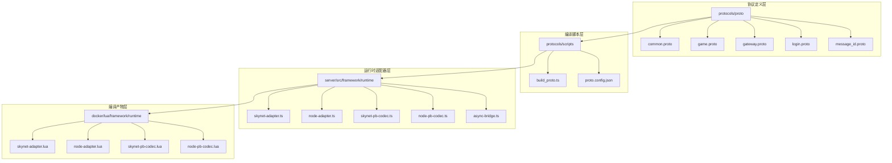

**图表来源**
- [build_proto.ts:1-245](file://protocols/scripts/build_proto.ts#L1-L245)
- [proto.config.json:1-15](file://protocols/proto.config.json#L1-L15)

**章节来源**
- [build_proto.ts:1-245](file://protocols/scripts/build_proto.ts#L1-L245)
- [proto.config.json:1-15](file://protocols/proto.config.json#L1-L15)

## 核心组件

### 协议消息模型

系统定义了完整的消息协议体系，包括基础消息包装、错误码定义和各功能域的消息类型。

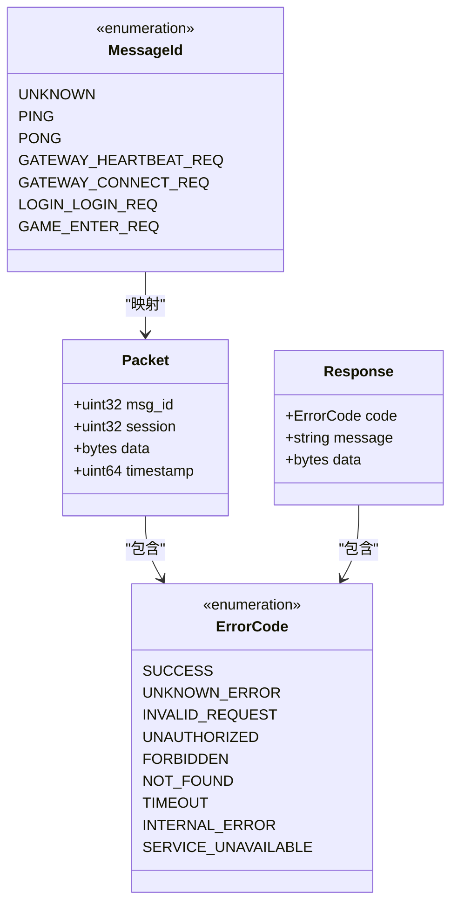

**图表来源**
- [common.proto:9-38](file://protocols/proto/common.proto#L9-L38)
- [message_id.proto:9-47](file://protocols/proto/message_id.proto#L9-L47)

### 编解码器实现

系统提供了针对不同运行时的编解码器实现，确保消息的正确序列化和反序列化。

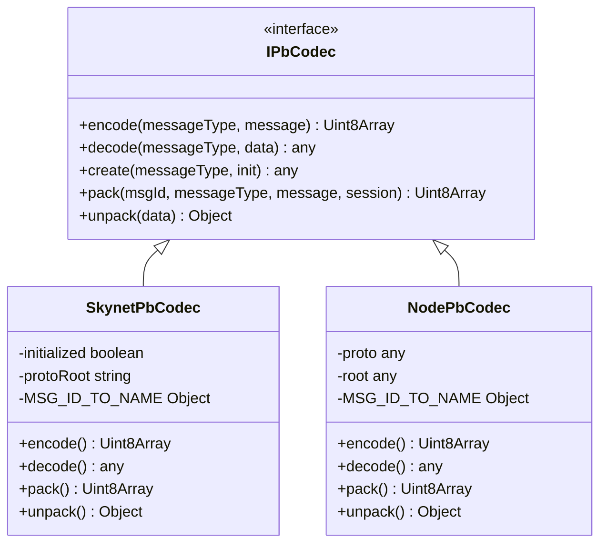

**图表来源**
- [skynet-pb-codec.ts:65-183](file://server/src/framework/runtime/skynet-pb-codec.ts#L65-L183)
- [node-pb-codec.ts:49-161](file://server/src/framework/runtime/node-pb-codec.ts#L49-L161)

**章节来源**
- [common.proto:1-39](file://protocols/proto/common.proto#L1-L39)
- [game.proto:1-141](file://protocols/proto/game.proto#L1-L141)
- [gateway.proto:1-70](file://protocols/proto/gateway.proto#L1-L70)
- [login.proto:1-83](file://protocols/proto/login.proto#L1-L83)
- [message_id.proto:1-48](file://protocols/proto/message_id.proto#L1-L48)

## 架构概览

系统采用分层架构设计，通过适配器模式实现运行时环境的抽象和切换。

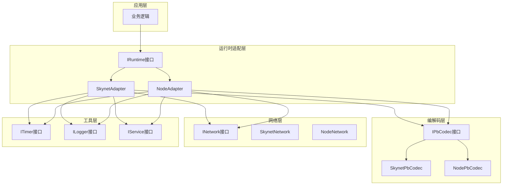

**图表来源**
- [skynet-adapter.ts:204-220](file://server/src/framework/runtime/skynet-adapter.ts#L204-L220)
- [node-adapter.ts:177-193](file://server/src/framework/runtime/node-adapter.ts#L177-L193)

## 详细组件分析

### 协议编译系统

协议编译系统负责将 .proto 文件转换为不同语言的代码和描述文件。

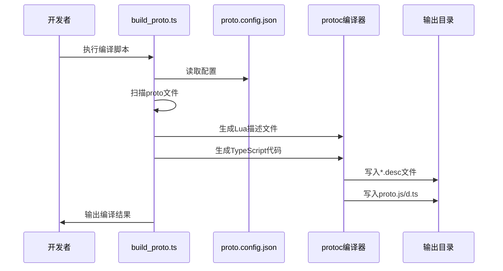

**图表来源**
- [build_proto.ts:57-244](file://protocols/scripts/build_proto.ts#L57-L244)
- [proto.config.json:1-15](file://protocols/proto.config.json#L1-L15)

#### 编译配置详解

编译系统支持灵活的配置选项，包括源文件目录、输出目录和平台特定设置。

**章节来源**
- [build_proto.ts:1-245](file://protocols/scripts/build_proto.ts#L1-L245)
- [proto.config.json:1-15](file://protocols/proto.config.json#L1-L15)

### Skynet 运行时集成

Skynet 适配器实现了分布式系统的协议集成，充分利用了 Skynet 的协程和消息传递机制。

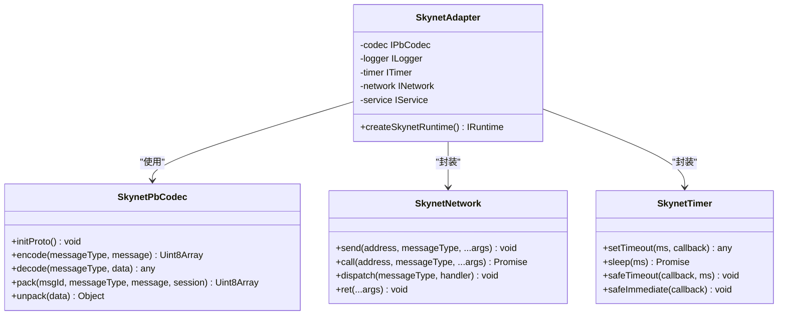

**图表来源**
- [skynet-adapter.ts:204-220](file://server/src/framework/runtime/skynet-adapter.ts#L204-L220)
- [skynet-pb-codec.ts:65-183](file://server/src/framework/runtime/skynet-pb-codec.ts#L65-L183)

#### 异步桥接机制

系统实现了复杂的异步桥接，将 TypeScript 的 Promise 机制转换为 Skynet 的协程系统。

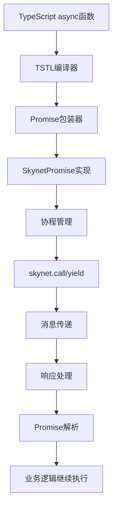

**图表来源**
- [async-bridge.ts:23-186](file://server/src/framework/runtime/async-bridge.ts#L23-L186)

**章节来源**
- [skynet-adapter.ts:1-221](file://server/src/framework/runtime/skynet-adapter.ts#L1-L221)
- [skynet-pb-codec.ts:1-184](file://server/src/framework/runtime/skynet-pb-codec.ts#L1-L184)
- [async-bridge.ts:1-208](file://server/src/framework/runtime/async-bridge.ts#L1-L208)

### Node.js 运行时集成

Node.js 适配器提供了本地开发和测试环境，使用原生 JavaScript API 实现协议功能。

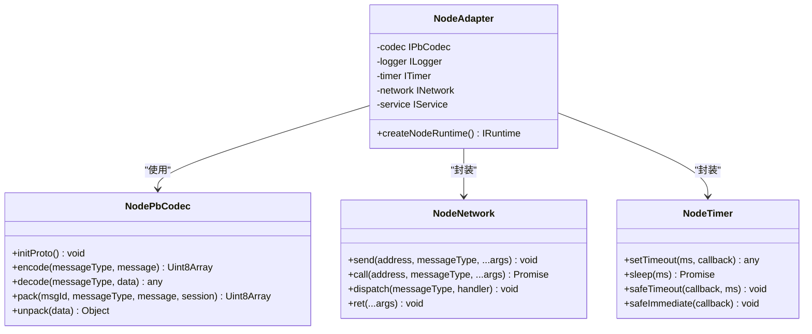

**图表来源**
- [node-adapter.ts:177-193](file://server/src/framework/runtime/node-adapter.ts#L177-L193)
- [node-pb-codec.ts:49-161](file://server/src/framework/runtime/node-pb-codec.ts#L49-L161)

**章节来源**
- [node-adapter.ts:1-194](file://server/src/framework/runtime/node-adapter.ts#L1-L194)
- [node-pb-codec.ts:1-162](file://server/src/framework/runtime/node-pb-codec.ts#L1-L162)

## 依赖关系分析

系统具有清晰的依赖层次结构，各组件之间的耦合度较低，便于维护和扩展。

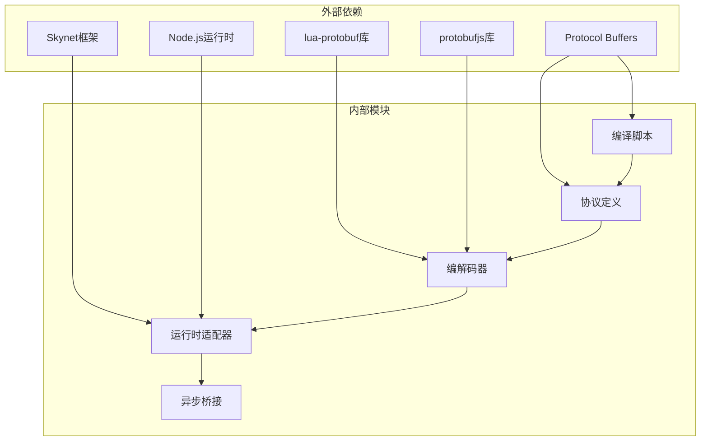

**图表来源**
- [build_proto.ts:108-127](file://protocols/scripts/build_proto.ts#L108-L127)
- [skynet-pb-codec.ts:25-32](file://server/src/framework/runtime/skynet-pb-codec.ts#L25-L32)

### 消息路由流程

系统实现了完整的消息路由机制，支持不同类型消息的处理和转发。

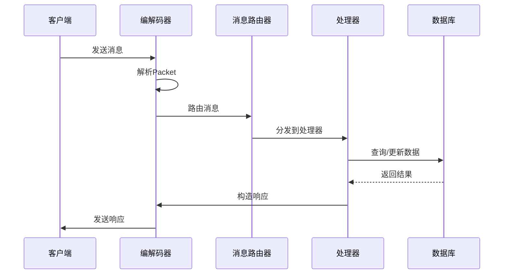

**图表来源**
- [skynet-pb-codec.ts:163-182](file://server/src/framework/runtime/skynet-pb-codec.ts#L163-L182)
- [node-pb-codec.ts:144-160](file://server/src/framework/runtime/node-pb-codec.ts#L144-L160)

**章节来源**
- [skynet-pb-codec.ts:37-63](file://server/src/framework/runtime/skynet-pb-codec.ts#L37-L63)
- [node-pb-codec.ts:20-47](file://server/src/framework/runtime/node-pb-codec.ts#L20-L47)

## 性能考虑

### 编解码性能优化

系统在编解码过程中采用了多项性能优化策略：

1. **缓存机制**：编解码器实例化后缓存消息类型映射
2. **批量处理**：支持批量消息处理减少系统调用开销
3. **内存管理**：合理管理消息对象生命周期避免内存泄漏

### 异步处理优化

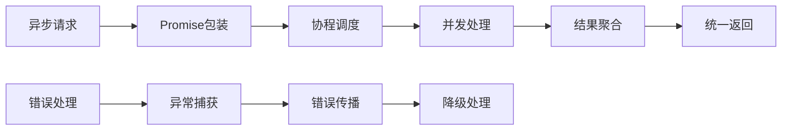

**图表来源**
- [async-bridge.ts:141-167](file://server/src/framework/runtime/async-bridge.ts#L141-L167)

## 故障排除指南

### 常见问题诊断

#### 编译问题

**问题**：protoc 命令找不到
**解决方案**：检查系统 PATH 环境变量或安装 protobuf 编译器

**问题**：Lua 描述文件生成失败
**解决方案**：确认 proto 文件语法正确和依赖文件存在

#### 运行时问题

**问题**：Skynet 环境下编解码器不可用
**解决方案**：检查 lua-protobuf 库是否正确安装和加载

**问题**：Node.js 环境下消息无法解析
**解决方案**：确认 protobufjs 库版本兼容性和 proto.js 文件完整性

### 调试技巧

1. **日志级别控制**：使用 SkynetLogger 的 debug 模式获取详细日志
2. **消息追踪**：通过 session ID 追踪消息的完整生命周期
3. **性能监控**：利用 ITimer 接口监控关键操作的执行时间

**章节来源**
- [skynet-adapter.ts:28-63](file://server/src/framework/runtime/skynet-adapter.ts#L28-L63)
- [node-adapter.ts:19-35](file://server/src/framework/runtime/node-adapter.ts#L19-L35)

## 结论

本协议集成实现提供了完整的跨平台消息通信解决方案，具有以下优势：

1. **架构清晰**：采用分层设计，职责分离明确
2. **扩展性强**：适配器模式支持新的运行时环境
3. **类型安全**：基于 Protocol Buffers 的强类型保证
4. **性能优秀**：针对不同运行时环境进行专门优化
5. **易于维护**：模块化设计便于代码维护和测试

该实现为游戏服务器、实时通信应用和其他需要高性能消息传输的场景提供了可靠的基础设施。