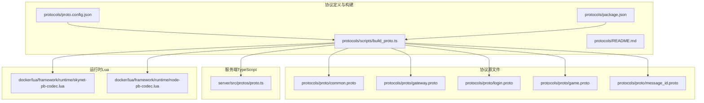
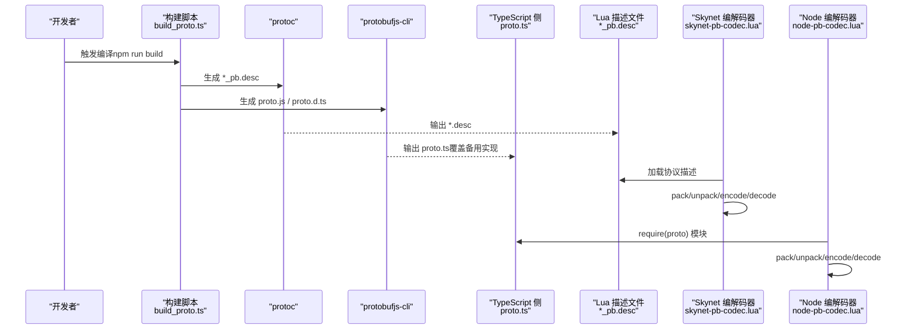
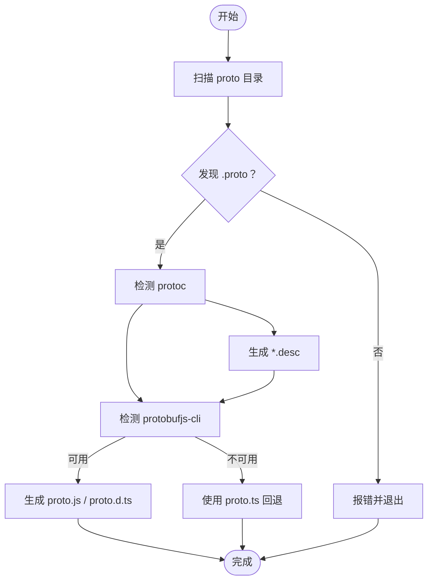
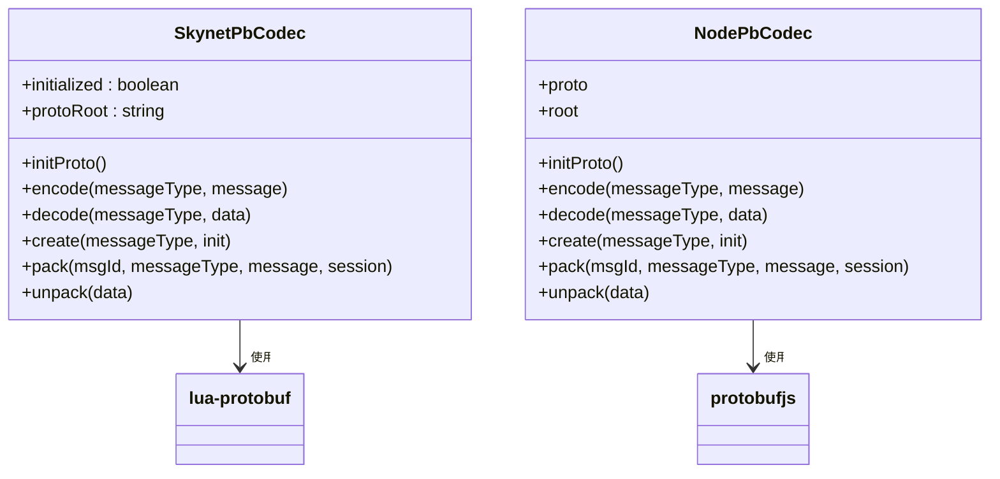
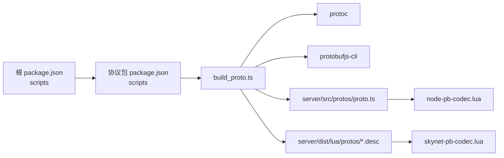

# 自定义协议开发

<cite>
**本文引用的文件**
- [proto.config.json](file://protocols/proto.config.json)
- [build_proto.ts](file://protocols/scripts/build_proto.ts)
- [README.md（协议）](file://protocols/README.md)
- [common.proto](file://protocols/proto/common.proto)
- [gateway.proto](file://protocols/proto/gateway.proto)
- [login.proto](file://protocols/proto/login.proto)
- [game.proto](file://protocols/proto/game.proto)
- [message_id.proto](file://protocols/proto/message_id.proto)
- [skynet-pb-codec.lua](file://docker/lua/framework/runtime/skynet-pb-codec.lua)
- [node-pb-codec.lua](file://docker/lua/framework/runtime/node-pb-codec.lua)
- [proto.ts（Node 备用实现）](file://server/src/protos/proto.ts)
- [package.json（根）](file://package.json)
- [package.json（协议包）](file://protocols/package.json)
</cite>

## 目录
1. [简介](#简介)
2. [项目结构](#项目结构)
3. [核心组件](#核心组件)
4. [架构总览](#架构总览)
5. [详细组件分析](#详细组件分析)
6. [依赖关系分析](#依赖关系分析)
7. [性能考量](#性能考量)
8. [故障排查指南](#故障排查指南)
9. [结论](#结论)
10. [附录](#附录)

## 简介
本指南面向自定义协议开发，围绕 Protobuf 协议在本项目的落地实践，系统讲解协议设计原则与最佳实践（消息结构、字段命名、版本管理）、编译流程（proto 编写、编译配置、生成代码处理）、标准开发流程（从需求到实现测试）、关键技术点（消息类型、服务接口、错误处理）、版本兼容策略（向前/向后兼容、迁移）、性能与安全优化，并提供简单与复杂协议的实现模板路径与参考。

## 项目结构
本项目采用“多工作区”组织方式，协议定义位于 protocols 目录，配套编译脚本与配置；服务端在 server 目录，包含 TypeScript 侧的协议类型与备用实现；运行时框架在 docker/lua 下，提供 Skynet 与 Node 的 Protobuf 编解码器。

**图表来源**
- [proto.config.json:1-15](file://protocols/proto.config.json#L1-L15)
- [build_proto.ts:1-245](file://protocols/scripts/build_proto.ts#L1-L245)
- [common.proto:1-39](file://protocols/proto/common.proto#L1-L39)
- [gateway.proto:1-70](file://protocols/proto/gateway.proto#L1-L70)
- [login.proto:1-83](file://protocols/proto/login.proto#L1-L83)
- [game.proto:1-141](file://protocols/proto/game.proto#L1-L141)
- [message_id.proto:1-48](file://protocols/proto/message_id.proto#L1-L48)
- [proto.ts（Node 备用实现）:1-200](file://server/src/protos/proto.ts#L1-L200)
- [skynet-pb-codec.lua:1-164](file://docker/lua/framework/runtime/skynet-pb-codec.lua#L1-L164)
- [node-pb-codec.lua:1-185](file://docker/lua/framework/runtime/node-pb-codec.lua#L1-L185)

**章节来源**
- [README.md（协议）:1-176](file://protocols/README.md#L1-L176)
- [package.json（根）:1-48](file://package.json#L1-L48)
- [package.json（协议包）:1-28](file://protocols/package.json#L1-L28)

## 核心组件
- 协议配置与构建
  - 配置文件定义 proto 源目录与输出目录，分别生成 Lua 描述文件与 TypeScript 代码。
  - 构建脚本负责扫描 proto、查找 protoc、生成 .desc、调用 protobufjs-cli 生成静态模块与类型定义，或回退到手写 proto.ts。
- 协议源文件
  - 通用层：Packet、ErrorCode、Response。
  - 服务层：Gateway、Login、Game 等服务协议。
  - 消息 ID：集中定义消息枚举，用于路由与识别。
- 运行时编解码器
  - Skynet 环境：基于 lua-protobuf 加载 .desc，提供 pack/unpack、encode/decode。
  - Node 环境：基于 protobufjs 模块，提供 pack/unpack、encode/decode。
- 备用实现
  - Node 环境下若未生成 protobufjs 产物，则使用 server/src/protos/proto.ts 的 JSON 序列化回退方案。

**章节来源**
- [proto.config.json:1-15](file://protocols/proto.config.json#L1-L15)
- [build_proto.ts:57-241](file://protocols/scripts/build_proto.ts#L57-L241)
- [common.proto:1-39](file://protocols/proto/common.proto#L1-L39)
- [gateway.proto:1-70](file://protocols/proto/gateway.proto#L1-L70)
- [login.proto:1-83](file://protocols/proto/login.proto#L1-L83)
- [game.proto:1-141](file://protocols/proto/game.proto#L1-L141)
- [message_id.proto:1-48](file://protocols/proto/message_id.proto#L1-L48)
- [skynet-pb-codec.lua:26-90](file://docker/lua/framework/runtime/skynet-pb-codec.lua#L26-L90)
- [node-pb-codec.lua:18-75](file://docker/lua/framework/runtime/node-pb-codec.lua#L18-L75)
- [proto.ts（Node 备用实现）:1-200](file://server/src/protos/proto.ts#L1-L200)

## 架构总览
协议从源文件到运行时的全链路如下：

**图表来源**
- [build_proto.ts:107-226](file://protocols/scripts/build_proto.ts#L107-L226)
- [proto.ts（Node 备用实现）:1-200](file://server/src/protos/proto.ts#L1-L200)
- [skynet-pb-codec.lua:59-90](file://docker/lua/framework/runtime/skynet-pb-codec.lua#L59-L90)
- [node-pb-codec.lua:61-75](file://docker/lua/framework/runtime/node-pb-codec.lua#L61-L75)

## 详细组件分析

### 协议设计原则与最佳实践
- 消息结构设计
  - 使用 Packet 作为统一承载结构，包含 msg_id、session、data、timestamp，便于路由、匹配与审计。
  - 服务层消息按功能拆分，避免单体消息过大；必要时嵌套子消息（如 LoginResponse 中的 UserInfo）。
- 字段命名规范
  - 消息类型：PascalCase（LoginRequest）。
  - 字段名：snake_case（user_id）。
  - 枚举：UPPER_SNAKE_CASE（LOGIN_LOGIN_REQ）。
- 版本管理策略
  - 不删除/不重排字段编号；新增字段使用新编号；优先使用 optional/repeated 以保持向后兼容。
  - 消息 ID 分配预留每服务 100 个 ID，请求偶数、响应奇数，便于维护与扩展。
- 错误处理机制
  - 统一 ErrorCode 枚举，Response 结构包含 code、message、data，便于客户端一致处理。

**章节来源**
- [common.proto:9-14](file://protocols/proto/common.proto#L9-L14)
- [login.proto:10-25](file://protocols/proto/login.proto#L10-L25)
- [gateway.proto:10-20](file://protocols/proto/gateway.proto#L10-L20)
- [game.proto:10-33](file://protocols/proto/game.proto#L10-L33)
- [message_id.proto:9-47](file://protocols/proto/message_id.proto#L9-L47)
- [README.md（协议）:140-176](file://protocols/README.md#L140-L176)

### 协议编译流程
- 编写 proto
  - 在 protocols/proto 下新增或修改 .proto 文件，遵循命名与版本规则。
- 配置编译
  - 修改 proto.config.json 的 proto_dirs、output_lua、output_ts，确保输出路径正确。
- 生成代码
  - 安装依赖后执行 npm run build，脚本自动：
    - 扫描 proto 目录，收集所有 .proto。
    - 若存在 protoc，生成 *_pb.desc。
    - 若存在 protobufjs-cli，生成 proto.js 与 proto.d.ts；否则回退到 server/src/protos/proto.ts。
- 集成到工程
  - Skynet 侧加载 .desc；Node 侧使用生成的 proto 模块或回退实现。

**图表来源**
- [build_proto.ts:78-226](file://protocols/scripts/build_proto.ts#L78-L226)
- [proto.config.json:5-13](file://protocols/proto.config.json#L5-L13)

**章节来源**
- [README.md（协议）:36-68](file://protocols/README.md#L36-L68)
- [proto.config.json:1-15](file://protocols/proto.config.json#L1-L15)
- [build_proto.ts:57-241](file://protocols/scripts/build_proto.ts#L57-L241)
- [package.json（协议包）:6-8](file://protocols/package.json#L6-L8)

### 标准开发流程（从需求到测试）
- 需求分析
  - 明确消息类型（请求/响应/通知）、字段与业务含义。
- 协议设计
  - 在 common.proto 中定义通用结构，在服务 proto 中定义领域消息；在 message_id.proto 中分配消息 ID。
- 编写与评审
  - 遵循命名与兼容性规范，评审字段编号与默认值。
- 编译与集成
  - 执行构建脚本，生成描述文件与类型代码；在 Skynet 与 Node 环境分别接入编解码器。
- 实现与测试
  - 在服务端实现消息处理逻辑，编写单元/集成测试；在客户端进行联调测试。
- 发布与回滚
  - 通过热更新支持协议文件；若需破坏性变更，制定迁移策略与灰度发布。

**章节来源**
- [README.md（协议）:140-176](file://protocols/README.md#L140-L176)
- [message_id.proto:9-47](file://protocols/proto/message_id.proto#L9-L47)
- [skynet-pb-codec.lua:59-90](file://docker/lua/framework/runtime/skynet-pb-codec.lua#L59-L90)
- [node-pb-codec.lua:61-75](file://docker/lua/framework/runtime/node-pb-codec.lua#L61-L75)

### 关键技术点
- 消息类型定义
  - 使用 proto3 语法，合理选择类型（int32/int64/bytes/repeated），避免使用已废弃类型。
- 服务接口设计
  - 将请求/响应成对定义，必要时引入子消息复用字段。
- 错误处理机制
  - 通过 ErrorCode 与 Response 统一错误语义，便于前端与服务端一致处理。
- 编解码与打包
  - Skynet：通过 MSG_ID_TO_NAME 映射消息类型，使用 pb.load 加载 desc 后 encode/decode。
  - Node：通过 proto 模块直接 encode/decode，pack/unpack 封装 Packet。

**图表来源**
- [skynet-pb-codec.lua:51-162](file://docker/lua/framework/runtime/skynet-pb-codec.lua#L51-L162)
- [node-pb-codec.lua:53-183](file://docker/lua/framework/runtime/node-pb-codec.lua#L53-L183)

**章节来源**
- [skynet-pb-codec.lua:26-90](file://docker/lua/framework/runtime/skynet-pb-codec.lua#L26-L90)
- [node-pb-codec.lua:18-75](file://docker/lua/framework/runtime/node-pb-codec.lua#L18-L75)

### 版本兼容性处理
- 向前兼容
  - 新增字段使用新编号，旧字段保持不变；使用 optional/repeated。
- 向后兼容
  - 不删除/不重排字段编号；新增字段为可选。
- 迁移策略
  - 通过 message_id.proto 逐步替换旧消息；在运行时保留双解析逻辑过渡期。
  - Skynet 侧可通过热加载 desc 实现协议热更新；Node 侧需重启或重新加载模块。

**章节来源**
- [README.md（协议）:152-164](file://protocols/README.md#L152-L164)
- [message_id.proto:9-47](file://protocols/proto/message_id.proto#L9-L47)
- [skynet-pb-codec.lua:59-90](file://docker/lua/framework/runtime/skynet-pb-codec.lua#L59-L90)

### 实际示例与模板
- 简单协议（Login）
  - 请求/响应消息、用户信息嵌套、Token 验证与在线统计。
  - 参考路径：[login.proto:10-83](file://protocols/proto/login.proto#L10-L83)
- 复杂协议（Game）
  - 多类请求/响应、玩家属性更新、批量在线玩家查询、经验/金币变更。
  - 参考路径：[game.proto:10-141](file://protocols/proto/game.proto#L10-L141)
- 通用结构（Common）
  - Packet、ErrorCode、Response。
  - 参考路径：[common.proto:9-38](file://protocols/proto/common.proto#L9-L38)
- 消息 ID（MessageId）
  - 分层分配与命名规范。
  - 参考路径：[message_id.proto:9-47](file://protocols/proto/message_id.proto#L9-L47)

**章节来源**
- [login.proto:1-83](file://protocols/proto/login.proto#L1-L83)
- [game.proto:1-141](file://protocols/proto/game.proto#L1-L141)
- [common.proto:1-39](file://protocols/proto/common.proto#L1-L39)
- [message_id.proto:1-48](file://protocols/proto/message_id.proto#L1-L48)

## 依赖关系分析
- 构建工具链
  - protoc：生成 .desc。
  - protobufjs-cli：生成静态模块与类型定义。
- 运行时依赖
  - Skynet：lua-protobuf（通过 .desc）。
  - Node：protobufjs（通过生成模块）。
- 工程脚本
  - 根 package.json 提供统一构建入口（npm run build:proto）。
  - 协议包 package.json 提供独立构建脚本。

**图表来源**
- [package.json（根）:11-36](file://package.json#L11-L36)
- [package.json（协议包）:6-8](file://protocols/package.json#L6-L8)
- [build_proto.ts:107-226](file://protocols/scripts/build_proto.ts#L107-L226)

**章节来源**
- [package.json（根）:1-48](file://package.json#L1-L48)
- [package.json（协议包）:1-28](file://protocols/package.json#L1-L28)
- [build_proto.ts:107-226](file://protocols/scripts/build_proto.ts#L107-L226)

## 性能考量
- 编解码性能
  - Protobuf 原生二进制序列化优于 JSON；优先使用生成的 protobufjs 模块而非回退实现。
- 消息大小
  - 合理使用 int64/bytes，避免冗余字段；对高频小消息可合并为批量请求/响应。
- 热更新
  - Skynet 侧通过重新加载 desc 实现协议热更新，减少停机时间。
- 并发与内存
  - 控制单次消息体积，避免大对象频繁拷贝；在 Node 侧注意 GC 压力。

## 故障排查指南
- 构建失败
  - protoc 未安装：脚本会跳过 .desc 生成；安装 protoc 或放置于 node_modules/.bin。
  - protobufjs-cli 未安装：脚本会回退到 proto.ts；安装后重新构建。
- 运行时错误
  - Skynet：lua-protobuf 未加载成功会禁用编解码；检查 desc 文件路径与加载顺序。
  - Node：proto 模块未加载会报错；确认生成的 proto.js/d.ts 是否存在且可被 require。
- 消息解析异常
  - 检查 message_id 与消息类型的映射是否一致；确认字段编号未变更。
  - 确认 Pack/Unpack 流程中 Packet 结构与编码顺序一致。

**章节来源**
- [build_proto.ts:107-226](file://protocols/scripts/build_proto.ts#L107-L226)
- [skynet-pb-codec.lua:22-90](file://docker/lua/framework/runtime/skynet-pb-codec.lua#L22-L90)
- [node-pb-codec.lua:61-75](file://docker/lua/framework/runtime/node-pb-codec.lua#L61-L75)

## 结论
本项目提供了从协议设计、编译构建到运行时编解码的完整闭环。通过严格的命名与版本管理、清晰的分层协议与统一的错误处理，结合 Skynet 与 Node 的双环境适配，能够稳定支撑高并发网络通信场景。建议在团队内固化协议评审与热更新流程，持续优化消息结构与编解码性能。

## 附录
- 快速开始
  - 在 protocols 目录安装依赖并执行构建脚本，随后在 server 或 docker 环境中接入编解码器。
- 参考资料
  - Protocol Buffers 官方文档、protobufjs 文档、lua-protobuf 文档。

**章节来源**
- [README.md（协议）:36-68](file://protocols/README.md#L36-L68)
- [package.json（根）:11-36](file://package.json#L11-L36)